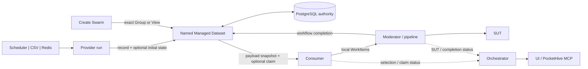

# Managed Datasets — Plain-language Guide

Status: in progress; proposed MVP, implementation and approval pending

For exact requirements, see the
[Managed Test Data MVP Specification](managed-test-data-lifecycle-generic-spec.md).

## One-minute version

Managed Datasets let many test swarms reuse durable synthetic SUT records.

```text
Provider binding -> chooses exactly one Scheduler, CSV or Redis source
Provider run -> creates one named Managed Dataset
Consumer run -> chooses one exact Dataset Group or workflow View
```

A provider swarm creates SUT objects once and shares traffic-ready records with
consumer swarms. Arbitrary schema-defined keys may partition them; these are
not PocketHive fields. Ungrouped data uses one internal Group.

Managed Dataset is a new option. Existing Redis Dataset support does not
change. Every bee input/output names one adapter, and PocketHive never silently
switches adapter, source, Dataset, Group or View.

## Two clear Profiles

| Profile | Use it when | Behaviour |
|---|---|---|
| `REPLAY` | Consumers repeatedly use the same stable records | Record payload is immutable. `SHARED` allows concurrent reuse; `EXCLUSIVE_LEASE` temporarily reserves one record. |
| `WORKFLOW` | Use changes whether a record is available for later work | Payload stays immutable. Separate versioned Record State may change through fixed named Views and declared State Transitions. Every use is exclusively leased. |

`WORKFLOW` keeps mutable datasets in the MVP without becoming a general
database. A consumer claims a record from one named View. Its completion sends
the full next state. PocketHive checks the lease, current state revision,
allowed fields, state schema and target View, then changes state, View
membership and lease together. A failure changes none of them.

The MVP does not support free-form tags, arbitrary filters or patches, payload
replacement, inferred outcomes or changes spanning several Datasets.

Exclusive leasing is not production-proven until concurrency, failure,
restart, expiry and 24-hour soak tests pass.

## Where configuration lives

| Place | Plain meaning |
|---|---|
| `scenarios/managed-dataset/<name>/` | The Dataset Definition: `dataset.yaml`, `record.schema.yaml` and, for `WORKFLOW`, `state.schema.yaml`. It defines name, version, Profile, grouping, Views and transitions. |
| `scenarios/dataset-contracts/<name>/<version>/` | One immutable reusable `schema.yaml`. Record and state schemas use exact versions. |
| Scenario Manager | Validates mounted packages and compiles frozen record/state schema digests. Workers do not search these folders. |
| Provider Scenario Binding | Chooses the Definition, exactly one source, concrete Groups, provider mappings, allocation, lifecycle and supply. Only its non-secret `vars` and `sut` values may resolve Group templates. |
| Consumer Scenario Template | Declares each required Dataset Profile and allocation. A workflow requirement also declares one View, allowed transitions and one completion role. |
| Consumer Scenario Binding | Checks and freezes those requirements against one SUT Environment and Dataset Space. |
| Create Swarm | Requires one exact compatible Dataset/Group or View per requirement, or `datasetSelections: []` when none are required. |
| Deployment profile | Owns REST client settings, Redis connections and positive Dataset, record, state, byte and View-membership limits. |
| Operator runbook | Owns capacity forecasts, thresholds, response, backup/restore coordination and escalation. It cannot instruct direct PostgreSQL deletion. |

The schema roots may combine exact reusable contract versions and local
`$defs`. `latest`, version ranges, remote lookup and fallback are unsupported.
A failed reload publishes nothing and reports its errors; the last valid
registry revision remains active.

Example workflow requirement:

```yaml
managedDatasetRequirements:
  - bindingRef: inputRecords
    datasetDefinitionId: shared-records
    profile: WORKFLOW
    access: READ_STATE_TRANSITION
    allocation:
      type: EXCLUSIVE_LEASE
      acquireBatchSize: 10
      maximumHeldRecordLeases: 20
      acquireInterval: PT1S
    workflow:
      viewId: available
      allowedTransitionIds: [complete]
      allowReleaseUnchanged: false
      completionRole: dataset-completion
      completionLagTolerance: PT30S
```

A replay requirement uses `profile: REPLAY`, `access: READ`, no `workflow`
block, and either allocation. A swarm needing no Managed Dataset uses both
`managedDatasetRequirements: []` and `datasetSelections: []`.

Every provider binding has one source:

| Source | What it does |
|---|---|
| `SCHEDULER` | Creates renewable provider work from bounded refill grants. |
| `CSV` | Validates and imports one mounted provider-bundle file in stable row order. |
| `REDIS` | Copies one referenced Redis list and imports the fixed copy in stable index order. It never pops or changes the live list. |

`CSV` and `REDIS` are finite, non-expiring imports. PocketHive validates the
whole source, binds its fingerprint once and publishes all Groups together.
Existing direct `SCHEDULER`, `CSV_DATASET` and `REDIS_DATASET` inputs remain
separate and unchanged.

## The flow



PostgreSQL is authoritative for Managed Dataset only. Measured SUT requests do
not call PostgreSQL, Orchestrator or a credential service. Replay uses a checked
local payload snapshot. Exclusive records and workflow View members are claimed
in bounded background batches.

For `WORKFLOW`, a claim carries current state and its revision. State is not
chosen from a stale shared snapshot. A missing valid completion keeps the
record unavailable until retry, an explicitly allowed unchanged release or
lease expiry. PocketHive never guesses an outcome from the SUT response.

Replay sends the record as the normal WorkItem payload. Workflow sends one
fixed payload object with `record` and `recordState`, so templates can use both.
Record State is normal data, not a header or observability field.

## Continuous traffic and storage

Each Group owns its supply and availability. `READY` means it can supply safe
records; it does not mean a particular View has an available member. An empty
or fully leased View pauses that consumer without changing selection or losing
data.

The Dataset parent shows total supply and the worst Group state. Temporary
control-plane failure lets replay consumers finish safe local work and
exclusive consumers finish only already held claims; new claims wait for
authority recovery.

Orchestrator reserves Dataset, record, state, byte and View-membership capacity
before admitting work. A hard limit rejects new creation or supply. It does not
delete data, change source or stop a safe existing consumer. MVP has no purge
state machine, so production requires an approved retention and capacity
runbook.

## How PocketHive proves the selected data is used

Each WorkItem carries one structured global header inside its normal JSON body:

```text
schemaVersion, datasetId, groupId, bindingRef, profile, snapshotRevision,
recordId, selectedAt, usableUntil, allocation, optional viewId/stateRevision
```

An exclusive allocation also carries lease identity and expiry. This is not an
observability or broker header. The SDK preserves it and checks identity, time,
View and lease immediately before SUT network I/O.

Selection, SUT-attempt and workflow-completion roles report bounded counters.
Orchestrator owns one status calculation; UI and PocketHive MCP return the same
result. `CONSUMING` requires matching fresh evidence for the frozen:

```text
datasetId + groupId + profile + optional viewId + allocation
```

It also requires the matching record-schema digest, a valid exclusive lease
when used, and, for `WORKFLOW`, the claimed state revision plus a successful
allowed transition or explicitly allowed unchanged release. Missing,
mismatched or stale evidence can never appear green.

| Consumption state | Plain meaning |
|---|---|
| `CONSUMING` | Fresh selection and SUT activity use the exact frozen contract; workflow completion is also healthy when required. |
| `DEGRADED` | Valid work continues, but refresh, rejection, delay, completion or partial reporting needs attention. |
| `NOT_CONSUMING` | Fresh mature status shows that the active binding is not reaching its required boundaries. |
| `UNKNOWN` | Evidence is missing, stale, restarting or intentionally inactive. PocketHive does not guess. |

This is operational evidence of Dataset use, not proof that the SUT accepted a
request, delivery was exactly once or a declared business transition was
correct. Status contains no record or Record State values and never blocks
traffic.

## Sensible MVP boundary

Included: `REPLAY` with immutable payload and shared/exclusive reuse;
`WORKFLOW` with versioned state, fixed Views, declared transitions and exclusive
claims; exactly one Scheduler/CSV/Redis source; optional Dataset use through
explicit empty arrays; Dataset-defined Groups; exact versioned record/state
schemas; scheduler refill; atomic finite imports; checked payload snapshots;
local safety guards; UI/MCP evidence; deployment-wide storage limits; and an
operator retention/capacity runbook.

Deferred: queue/pop semantics, use counts, lease renewal/transfer, free-form
tags, arbitrary filters/patches, runtime-created Views/transitions, payload
replacement, cross-Dataset transactions, multi-Group queries, multiple or
fallback sources, CSV rotation, Redis pop, finite-source refill, SUT
reconciliation, automatic provider lifecycle, exactly-once/audit proof,
Dataset retirement, purge and automatic deletion.
