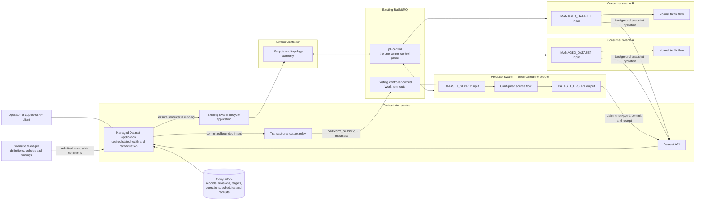
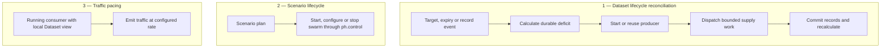
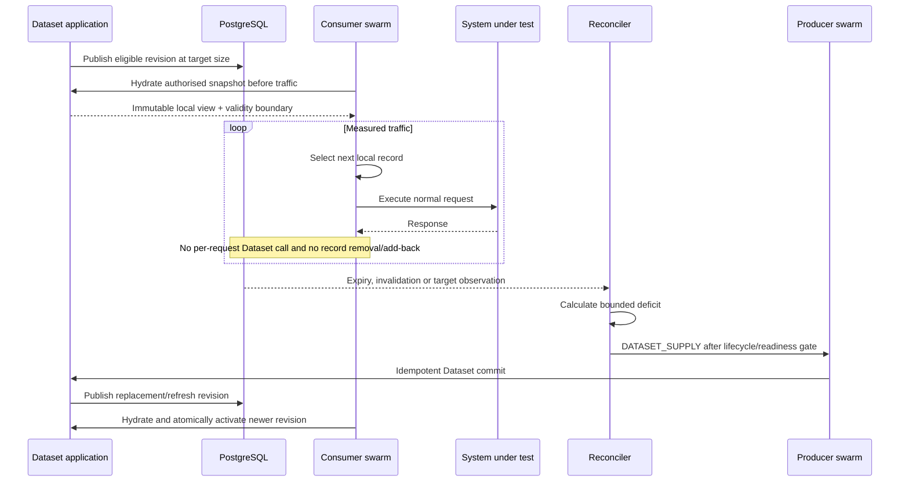
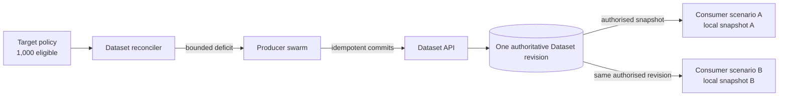
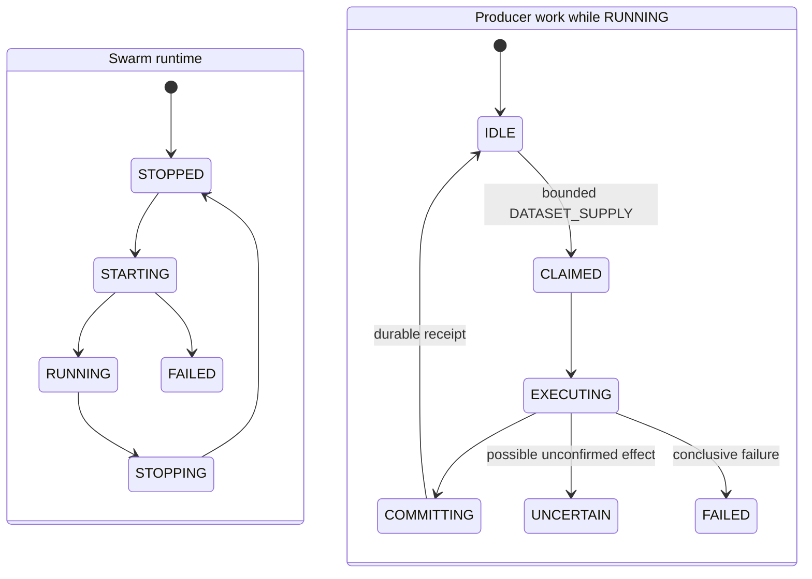
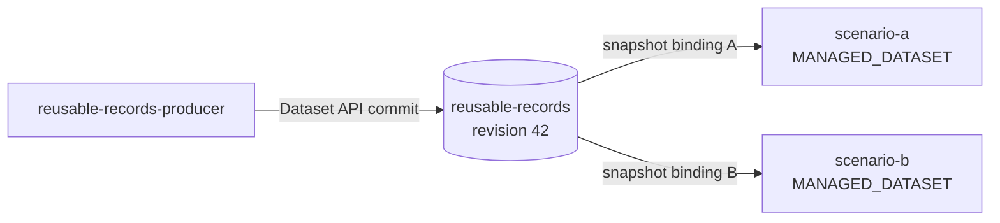
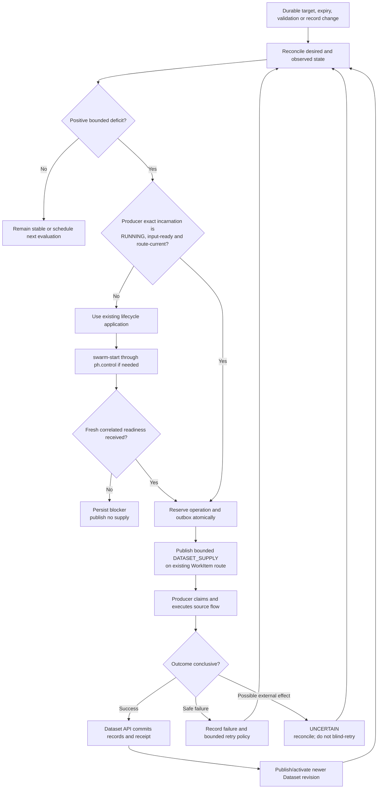

# Managed Datasets — Components, Use Cases and Scenario Examples

Status: **team visualisation guide for the approved target design**

This document shows where each component sits, what makes records flow, how
common long-running scenarios behave, and how the target scenario configuration
could look. It is intentionally generic and uses no organisation-specific data
fields.

> **Architecture rule:** Managed Datasets add no new control, data or Dataset
> messaging plane. Swarm lifecycle stays on the existing `ph.control` plane;
> bounded source work reuses the existing controller-owned WorkItem route; the
> Dataset API is an application boundary over PostgreSQL.

## 1. The idea in one picture



The producer does not feed either consumer directly. It feeds the authoritative
Dataset. Each consumer receives the Dataset revision it is authorised to use.

## 2. Where responsibilities sit

| Component | Runs in | Owns | Does not own |
|---|---|---|---|
| Dataset definition and bindings | Scenario Manager | Versioned schema, generic grouping fields, producer binding, consumer binding and policy references | Runtime records or RabbitMQ topology |
| Managed Dataset application | Orchestrator | Desired target, observed supply, health, reconciliation, operations, schedules and evidence | Swarm lifecycle implementation or source-specific logic |
| Existing lifecycle application | Orchestrator | `ensureRunning`, start/stop intent and current readiness result | Dataset deficit or record truth |
| Swarm Controller | Swarm Controller service | Applied swarm lifecycle, exact worker incarnation and controller-owned WorkItem topology | Dataset target or committed records |
| `ph.control` | Existing RabbitMQ | Delivery of canonical swarm lifecycle/status events | Dataset records or supply counts |
| WorkItem route | Existing RabbitMQ | Delivery of bounded `DATASET_SUPPLY` work to an already-ready producer | Lifecycle authority or completion proof |
| Producer swarm | Normal PocketHive swarm | Executes the configured source flow for one bounded operation | Choosing the target or declaring queues |
| Dataset API | Orchestrator application boundary | Authorised claim, checkpoint, commit, snapshot and receipt operations | RabbitMQ routing decisions |
| PostgreSQL | Orchestrator persistence | Durable Dataset truth and transactional outbox | Worker execution |
| Consumer swarm | Normal PocketHive swarm | Background hydration and local selection during traffic | Direct PostgreSQL access or Dataset mutation |

## 3. What makes records flow

There are three independent flows. They must not be collapsed into one
scheduler or one message.



### Dataset triggers

The Dataset reconciler wakes immediately when durable observed state changes
and also runs a periodic repair sweep. A wake-up is a request to reassess; it
does not itself create records.

```text
deficit = max(0, targetReady - eligibleTotal - pendingExpected)
```

Supply is dispatched only when the deficit is positive, policy permits it, the
producer is freshly ready and a current controller-issued WorkItem route exists.

| Trigger or observation | Typical operation | Expected behavior |
|---|---|---|
| New Dataset is below its initial target | `PROVISION_NEW` | Warm to `minimumReady`, admit consumers, then continue toward `targetReady` |
| Eligible supply crosses `lowWatermark` | `PROVISION_NEW` or `REPLACE_RECORD` | Open a bounded fill cycle; Dataset may remain `READY` while above `minimumReady` |
| Target is increased | `PROVISION_NEW` | Create only the incremental deficit under the newest target generation |
| Target is decreased | No source operation initially | Stop new supply and move deterministic safe surplus to `STANDBY`; do not delete active material |
| Material is approaching `refreshAt` or `expiresAt` | `REFRESH_MATERIAL` | Refresh early enough to preserve the declared validity/reserve horizon |
| A record is invalid, revoked or quarantined | `REPLACE_RECORD` | Remove it from eligibility and replace only the resulting safe-supply deficit |
| Periodic validation is due | `VALIDATE_RECORD` | Retain eligibility only when the validation receipt is conclusive and current |
| An external entity reaches retirement policy | `DEPROVISION_ENTITY` | Execute governed cleanup independently of ordinary replenishment |
| A producer operation partially fails | Same original operation identity | Reconcile committed effects; resume or redrive only when the durable ledger proves it is safe |
| A notification or process restart was missed | No automatic operation kind | Periodic repair sweep reconstructs the decision from PostgreSQL truth |

`REPLENISH` is not an MVP wire operation. “Replenishment” is the operator idea;
the system maps its reason to one of the explicit operation kinds above.

## 4. Use case A — fixed-size Dataset used in a loop

For the MVP shared mode, use is non-destructive. A consumer selects from an
immutable local revision; the record never leaves the Dataset, so it is not
“added back” after each request.



If a later approved profile needs exclusive use, acquire and release must use a
fenced Dataset lease API. RabbitMQ acknowledge/requeue must never implement the
business return.

### If “consume and add back” means checkout and return

That is a different allocation mode, not ordinary shared reuse. It is a
separately gated future profile:

```mermaid
sequenceDiagram
  participant C as Consumer swarm
  participant A as Dataset API
  participant P as PostgreSQL

  C->>A: Acquire exclusive batch
  A->>P: AVAILABLE → LEASED<br/>holder + expiry + fencing epoch
  A-->>C: Opaque lease token + local batch
  C->>C: Use records locally
  C->>A: Release with exact token and fence
  A->>P: LEASED → AVAILABLE
  alt Consumer crashes or lease expires
    A->>P: Reconcile expiry; reject stale holder
    A->>P: Return safely or quarantine according to policy
  end
```

The Dataset target still describes membership. Leasing changes availability,
not membership, and does not automatically create replacement records. This
profile must not ship until stale-holder fencing, expiry and recovery tests
pass; the recommended MVP remains `SHARED`.

## 5. Use case B — one producer prepares data for two consumer swarms



The producer runs once for the shared deficit, not once per consumer. Consumers
may use different traffic rates and local selection offsets, but they do not
own separate durable copies of the Dataset.

## 6. Use case C — continuous 24/7 run with expiring records

```mermaid
sequenceDiagram
  participant T as Trusted time / schedule
  participant D as Dataset reconciler
  participant L as Existing lifecycle application
  participant C as ph.control / Swarm Controller
  participant P as Producer swarm
  participant W as Existing WorkItem route
  participant DB as Dataset API / PostgreSQL
  participant S as Consumer swarms

  loop Periodic reconciliation and durable time events
    T->>D: Records approach refreshAt/expiresAt
    D->>DB: Recalculate eligible supply and reserve horizon
    alt Safe reserve remains
      D->>L: ensureRunning(producer)
      L->>C: swarm-start only if required
      C-->>L: fresh RUNNING + input-ready + current route
      D->>W: bounded REFRESH_MATERIAL or REPLACE_RECORD
      W->>P: deliver at least once
      P->>DB: checkpoint and durable receipt
      DB-->>S: newer revision available for background activation
    else Safe reserve is threatened
      D->>DB: Set DEGRADED and continue bounded recovery
      DB-->>S: Keep only still-safe local material active
    else No safe material remains
      D->>DB: Set STARVED
      DB-->>S: Pause affected Dataset input; fail closed
    end
  end
```

The source operation should begin before expiry, using `minimumValidity` and
`reserveHorizon`. Waiting until the last record expires turns routine refresh
into an outage.

## 7. Dataset and producer lifecycles

### Dataset availability

```mermaid
stateDiagram-v2
  [*] --> INITIALISING
  INITIALISING --> WARMING: first reconciliation complete
  WARMING --> READY: minimum + Fitness + validity satisfied
  READY --> READY: below low watermark but safe; replenish in background
  READY --> DEGRADED: safe data remains but reserve/minimum/evidence is threatened
  DEGRADED --> READY: recovery receipt restores safe threshold
  DEGRADED --> STARVED: no safe eligible record / proof horizon exhausted
  STARVED --> WARMING: bounded recovery starts
  WARMING --> READY: recovery threshold restored
  WARMING --> ERROR: structural lifecycle failure
  DEGRADED --> AUTH_REQUIRED: source recovery needs authorised credential action
  AUTH_REQUIRED --> WARMING: authorised action completed
  ERROR --> WARMING: operator resolves structural fault
```



### Producer runtime and work are separate



`RUNNING + IDLE` is the recommended hot-idle producer state. It is healthy and
does not mean that work is missing.

## 8. What consumers do when the Dataset is degraded

| Dataset state | New consumer start | Already-running consumer | Producer/reconciler action |
|---|---|---|---|
| `READY` | Allowed for the exact admitted binding | Continue with the activated local revision | Replenish in the background when below low watermark |
| `WARMING` | Wait; admission occurs only after the exact binding becomes `READY` | No prior revision: remain paused | Start/reuse producer and fill bounded deficit |
| `DEGRADED` | Block new admission | Continue only with still-valid, already-activated material inside its proven safe horizon; show warning and deadline | Prioritise refresh/replacement and expose blocker |
| `STARVED` | Block | Pause the affected Dataset input and fail closed; unrelated inputs may continue | Recover bounded supply; never substitute stale/unknown data |
| `AUTH_REQUIRED` | Block affected binding | Preserve only material whose existing authorisation and validity remain conclusive | Wait for approved credential/identity action; no AI or automatic bypass |
| `ERROR` | Block | Pause affected input when correctness cannot be established | Surface structural fault and require repair/reconciliation |

Missing or stale evidence is never interpreted as zero, healthy or ready.

## 9. Producer setup options

| Setup | Use when | Recommendation |
|---|---|---|
| Dedicated hot-idle producer per Dataset/source binding | First delivery and most predictable ownership | **Recommended MVP.** Simple readiness, routing, capacity and failure isolation |
| Dedicated producer stopped when idle | Resource saving is proven necessary | Allowed only with an explicit policy; repeat the full start/readiness gate before every supply operation |
| One producer with create, refresh, validate and retire capabilities | The operations share identity, security and capacity boundaries | Accept only when every operation kind is explicitly declared and independently bounded |
| Separate create and refresh producers | Refresh has different credentials, limits or failure modes | Good separation when each has its own exact source binding and route lease |
| One producer serving several Datasets | High-volume platform optimisation | Defer until fairness, isolation, exact routing and durable per-owner `SwarmRunDemand` are qualified |
| Multi-step colocated producer | Intermediate values must not cross generic queues | Use one declared `COLOCATED_SEQUENCE` capability with durable per-item checkpoints |
| CSV-backed producer | A finite versioned catalog drives initial or refreshed records | Treat CSV as the source catalog inside a bounded supply operation; rotation must not create unbounded work |

## 10. YAML status and naming

The following examples show the **target authoring contract** for discussion.
They are not executable in the current branch: the current Worker SDK does not
yet contain `DATASET_SUPPLY`, `MANAGED_DATASET` or `DATASET_UPSERT`, and the
Scenario Manager does not yet admit the proposed source-binding artifact.

Before implementation, each new field must be frozen in one canonical schema
and capability manifest. Implementations must not silently accept a second
shape or fall back to CSV/Redis behavior.

“Seeder” is a useful team label, but the contract calls it a **Dataset
producer** because it can provision, replace, refresh, validate or retire data
throughout a long-running Dataset lifecycle.

## 11. Example — CSV catalog of 1,000 records that must stay replenished

### 11.1 Proposed Dataset source binding

This companion artifact belongs to Scenario Manager. It defines how bounded
source work uses a versioned CSV catalog; it is not worker-local state.

```yaml
id: reusable-records-csv-source
version: 1

datasetRef:
  datasetSpaceId: performance-test
  datasetAlias: reusable-records
  partition: default
  pool: ready

executionMode: COLOCATED_SEQUENCE
capabilities:
  - PROVISION_NEW
  - REFRESH_MATERIAL
  - REPLACE_RECORD

source:
  type: CSV_CATALOG
  csv:
    filePath: /app/scenario/datasets/reusable-records.csv
    expectedRows: 1000
    skipHeader: true
    rotate: true
    maximumRowsPerOperation: 1000
    identityColumn: record_key

mappingRef: reusable-records-csv-mapping-v1
recordSchemaRef: reusable-records-schema-v1
```

`rotate: true` means the producer can continue from the beginning of the
catalog when a later bounded operation requires it. It does not mean “emit
forever”: `requestedCount` and `maximumRowsPerOperation` bound each operation.
Stable `record_key` plus the Dataset operation identity makes repeat processing
idempotent.

### 11.2 Proposed supply policy

```yaml
id: reusable-records-supply
version: 1

datasetRef:
  datasetSpaceId: performance-test
  datasetAlias: reusable-records
  partition: default
  pool: ready

sourceBindingRef: reusable-records-csv-source@1

supplyPolicy:
  minimumReady: 800
  lowWatermark: 900
  targetReady: 1000
  maximumReady: 1100
  provisioningBatchSize: 100
  maximumInFlight: 200
  minimumValidity: PT30M
  reserveHorizon: PT10M
  reconciliationPeriod: PT5S
  targetDecreaseMode: STANDBY_TO_TARGET
```

The policy—not `scheduler.maxMessages` and not CSV rotation—keeps the Dataset
near 1,000 eligible records.

### 11.3 Producer `scenario.yaml`

```yaml
id: reusable-records-producer
name: Reusable records producer
description: Performs bounded Dataset source operations from the approved CSV binding.

template:
  image: swarm-controller:latest
  bees:
    - role: dataset-producer
      image: dataset-producer:latest   # target capability; not implemented yet
      work:
        in:
          in: dataset-supply
      config:
        inputs:
          type: DATASET_SUPPLY
          datasetSupply:
            datasetRef: "{{ vars.datasetRef }}"
            sourceBindingId: "{{ vars.sourceBindingId }}"
            ratePerSec: "{{ vars.producerRatePerSec }}"
            maxConcurrent: "{{ vars.producerMaxConcurrent }}"
        outputs:
          type: DATASET_UPSERT
          datasetUpsert:
            deliveryMode: IN_PROCESS_DIRECT
            expectedDatasetRef: "{{ vars.datasetRef }}"
            expectedSourceBindingId: "{{ vars.sourceBindingId }}"
            mappingRef: "{{ vars.sourceMappingRef }}"
      ports:
        - { id: in, direction: in }

topology:
  version: 1
  edges: []
```

The producer has no scheduler input. It receives work only when the Dataset
reconciler finds a durable deficit and the existing control-plane readiness
gate has passed.

### 11.4 Producer `variables.yaml` excerpt

```yaml
profiles:
  - id: default
    name: Default

values:
  global:
    default:
      producerRatePerSec: 20
      producerMaxConcurrent: 4
  sut:
    default:
      example-environment:
        datasetRef:
          datasetSpaceId: performance-test
          datasetAlias: reusable-records
          partition: default
          pool: ready
        sourceBindingId: reusable-records-csv-source
        sourceMappingRef: reusable-records-csv-mapping-v1
```

## 12. Example — one producer, two consumer scenarios

Both consumer scenarios select the same immutable Dataset reference. They do
not name the producer swarm and are not connected to it by a direct queue.



The Scenario Manager admits two consumer bindings:

```yaml
consumerBindings:
  - scenarioId: scenario-a
    bindingId: scenario-a-reusable-records
    datasetRef:
      datasetSpaceId: performance-test
      datasetAlias: reusable-records
      partition: default
      pool: ready
    allocation: SHARED
    requiredRemainingValidity: PT30M

  - scenarioId: scenario-b
    bindingId: scenario-b-reusable-records
    datasetRef:
      datasetSpaceId: performance-test
      datasetAlias: reusable-records
      partition: default
      pool: ready
    allocation: SHARED
    requiredRemainingValidity: PT30M
```

This proposed binding artifact is admission configuration, not a new runtime
message. The binding resolves to exact immutable versions before either swarm
starts.

## 13. Example — consumer scenario whose source is a Managed Dataset

```yaml
id: scenario-a
name: Scenario A using reusable records
description: Hydrates a Managed Dataset before running normal traffic.

template:
  image: swarm-controller:latest
  bees:
    - role: dataset-source
      image: generator:latest
      work:
        out:
          out: request-build
      config:
        inputs:
          type: MANAGED_DATASET
          managedDataset:
            datasetRef: "{{ vars.datasetRef }}"
            fitnessContractRef: "{{ vars.fitnessContractRef }}"
            allocation: SHARED
            deliveryEffectProfile: AT_LEAST_ONCE
            requiredRemainingValidity: PT30M
            ratePerSec: "{{ vars.trafficRatePerSec }}"
            snapshotPageSize: 250
            maximumLocalRecords: 1100
            maximumLocalBytes: 16777216
            selectorProjectionRef: "{{ vars.selectorProjectionRef }}"
            bindingSlotsRef: "{{ vars.bindingSlotsRef }}"
            selectionPolicyRef: "{{ vars.selectionPolicyRef }}"
            trustedTimePolicyRef: "{{ vars.trustedTimePolicyRef }}"
        message:
          bodyType: SIMPLE
          body: "{{ payload }}"
      ports:
        - { id: out, direction: out }

    - role: request-builder
      image: request-builder:latest
      work:
        in:
          in: request-build
        out:
          out: request-send
      config:
        templateRoot: /app/scenario/templates/http
        serviceId: default
        passThroughOnMissingTemplate: false
      ports:
        - { id: in, direction: in }
        - { id: out, direction: out }

    - role: processor
      image: processor:latest
      work:
        in:
          in: request-send
        out:
          out: response
      config:
        baseUrl: "{{ sut.endpoints['default'].baseUrl }}"
        mode: THREAD_COUNT
        threadCount: 4
        inputs:
          type: RABBITMQ
        outputs:
          type: RABBITMQ
        auxiliary:
          managedDatasetResolver:
            type: MANAGED_DATASET_RESOLVER
            datasetRef: "{{ vars.datasetRef }}"
            materialProjectionRef: "{{ vars.materialProjectionRef }}"
            bindingSlotsRef: "{{ vars.bindingSlotsRef }}"
            snapshotPageSize: 250
            maximumLocalRecords: 1100
            maximumLocalBytes: 16777216
      ports:
        - { id: in, direction: in }
        - { id: out, direction: out }

    - role: postprocessor
      image: postprocessor:latest
      work:
        in:
          in: response
      config:
        forwardToOutput: false
        txOutcomeSinkMode: NONE
        dropTxOutcomeWithoutCallId: true
      ports:
        - { id: in, direction: in }

topology:
  version: 1
  edges:
    - id: dataset-to-builder
      from: { role: dataset-source, port: out }
      to: { role: request-builder, port: in }
    - id: builder-to-processor
      from: { role: request-builder, port: out }
      to: { role: processor, port: in }
    - id: processor-to-postprocessor
      from: { role: processor, port: out }
      to: { role: postprocessor, port: in }
```

Scenario B can use the same structure with a different scenario ID, traffic
rate, selection policy or request template. Its Dataset reference can remain
identical.

### 13.1 Consumer `variables.yaml` excerpt

```yaml
profiles:
  - id: default
    name: Default

values:
  global:
    default:
      trafficRatePerSec: 25
  sut:
    default:
      example-environment:
        datasetRef:
          datasetSpaceId: performance-test
          datasetAlias: reusable-records
          partition: default
          pool: ready
        fitnessContractRef: reusable-records-traffic-fitness-v1
        selectorProjectionRef: reusable-records-selector-v1
        materialProjectionRef: reusable-records-request-material-v1
        bindingSlotsRef: reusable-records-request-slots-v1
        selectionPolicyRef: reusable-records-local-round-robin-v1
        trustedTimePolicyRef: qualified-host-time-v1
```

## 14. End-to-end decision flow



## 15. Team review questions

The diagrams and examples are ready for team discussion when the team can
answer these questions consistently:

1. Is `ph.control` still the only swarm control plane? **Yes.**
2. Does the producer receive bounded demand only after fresh readiness? **Yes.**
3. Does the producer feed the Dataset rather than consumer queues? **Yes.**
4. Do consumers use local immutable views during measured traffic? **Yes.**
5. Is shared use non-destructive, with no Rabbit “add back”? **Yes.**
6. Can every replenishment reason map to one explicit operation kind? **Yes.**
7. Are degraded, starved, uncertain and authentication-blocked behaviors
   observable and fail-closed? **Yes.**
8. Are the YAML additions clearly marked as target contracts requiring one
   canonical schema before implementation? **Yes.**

## Related design documents

- [Team design overview](managed-datasets-team-design-overview.md)
- [Architecture recommendation](managed-test-data-architecture-recommendation.md)
- [Lifecycle specification](managed-test-data-lifecycle-generic-spec.md)
- [Readiness assessment](managed-test-data-readiness-assessment.md)
- [Assurance strategy](managed-test-data-assurance-strategy.md)
