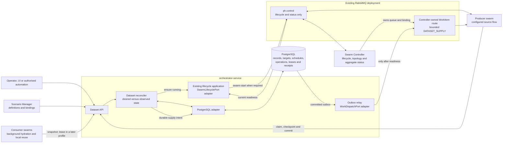
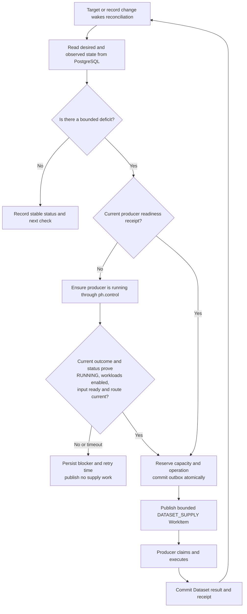
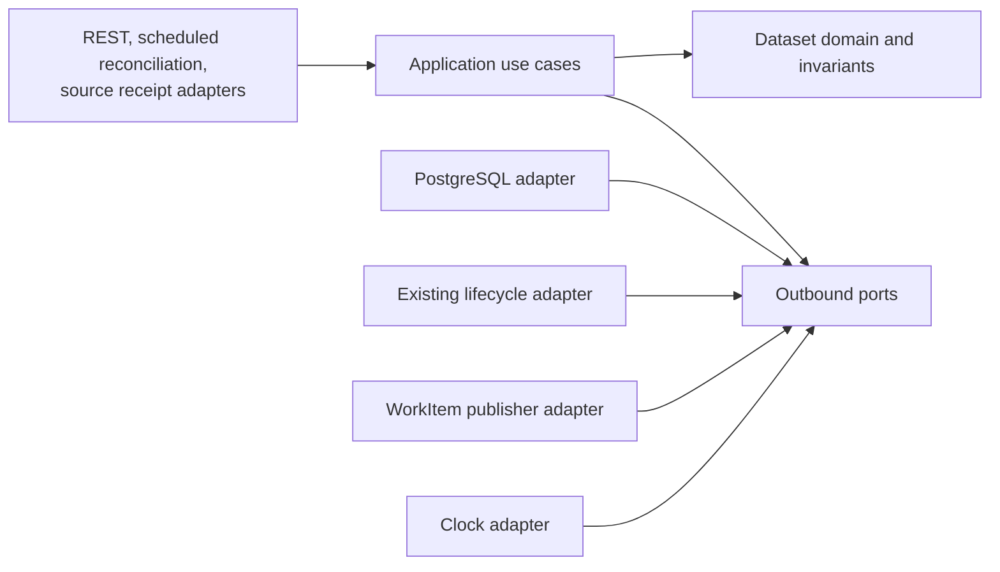

# Managed Dataset Architecture — Team Explanation and Recommendation

Status: **design-readiness GREEN — ready for team approval**

Last updated: 2026-07-17

Normative detail:
[Managed Test Data Architecture and Lifecycle Specification](./managed-test-data-lifecycle-generic-spec.md)

This is a green assessment of the **target design**. It is not a claim that the
feature, the 50,000-record profile, or the required RabbitMQ topology has
already been implemented or qualified.

## The idea in one minute

PocketHive will manage reusable test records as a durable Dataset. A configured
producer swarm creates records when the Dataset is below its desired target.
Other swarms reuse a safe published view of those records without owning or
copying the authoritative Dataset.

There are three separate actions:

1. PocketHive starts or enables the producer swarm through its existing
   `ph.control` control plane.
2. After current status proves the swarm is `RUNNING` and its target input is
   ready, PocketHive sends a bounded `DATASET_SUPPLY` WorkItem through the
   existing controller-owned WorkItem route.
3. The producer claims the operation, performs its configured source flow, and
   commits results through the Dataset API. PostgreSQL stores the authoritative
   records and completion receipt.

This separation is mandatory. A start command contains no Dataset work, and a
supply WorkItem cannot start a stopped swarm. A RabbitMQ acknowledgement proves
message delivery, not successful Dataset creation.

## Where everything sits



### Component ownership

| Component | Owns | Does not own |
|---|---|---|
| Scenario Manager | Versioned Dataset definitions, schemas, source bindings and policy definitions | Runtime records, supply execution or queues |
| Orchestrator lifecycle application | Desired swarm state and canonical start/stop/config commands | Dataset records |
| Managed Dataset module in Orchestrator | Targets, reconciliation, schedules, operations, records, revisions, allocation and outbox | Swarm control commands, queue declaration or source-specific calls |
| Swarm Controller | Per-swarm lifecycle, aggregate readiness and WorkItem topology | Global Dataset counts or schedules |
| Producer swarm | Execution of bounded source work | Deciding target size or declaring completion without a durable receipt |
| Consumer adapters | Bounded background hydration and worker-local selection | PostgreSQL access or Dataset authority |
| PostgreSQL | Durable Dataset truth | Swarm runtime state |

## Architecture decision: no new plane

Managed Datasets introduce **no second control plane and no Dataset-specific
message plane**. The feature crosses three interface boundaries, but only the
first is a control plane. The second is PocketHive's existing swarm WorkItem
data path; the third is an application API backed by a database.

| Existing boundary | Architectural role | Carries | Must never carry |
|---|---|---|---|
| `ph.control` | PocketHive's one RabbitMQ swarm control plane | Swarm template, plan, start, stop, remove, approved config, outcomes, status and alerts | `DATASET_SUPPLY`, requested record counts or record values |
| Controller-owned WorkItem route | Existing swarm data/work path—not a control plane | A bounded, idempotent `DATASET_SUPPLY` operation and ordinary swarm work | Swarm lifecycle commands or durable completion claims |
| Dataset API + PostgreSQL | Application service boundary and durable store—not a message plane | Claim, checkpoint, commit, snapshot, allocation, schedule and durable receipt state | Direct worker SQL or inferred Rabbit queue state |

The MVP creates no Dataset exchange, control queue, event bus or notification
lane. Consumers reconcile through the bounded Dataset API and the periodic
repair sweep.

## The supply decision



If the producer is already ready, the lifecycle check is an idempotent no-op.
The recommended MVP keeps a dedicated producer `RUNNING + IDLE` between supply
operations. If a later cost policy stops it, the complete readiness gate runs
again before the next WorkItem. A Dataset controller must never stop a swarm
that another owner still needs; a shared producer therefore requires durable
per-owner run-demand records and aggregate desired state.

## States people will see

Three runtime state machines answer different questions:

| State machine | Question | States |
|---|---|---|
| `SwarmRuntimeState` | Can this swarm accept work? | `READY`, `STARTING`, `RUNNING`, `STOPPING`, `STOPPED`, `FAILED` |
| `ProducerWorkState` | What bounded work is the producer doing? | `IDLE`, `CLAIMED`, `EXECUTING`, `COMMITTING`, `FAILED`, `UNCERTAIN` |
| `DatasetAvailabilityState` | Is this Dataset safe for this use? | `INITIALISING`, `WARMING`, `READY`, `DEGRADED`, `STARVED`, `ERROR`, `AUTH_REQUIRED` |

These states cannot be collapsed. For example:

| Situation | Swarm | Producer work | Dataset |
|---|---|---|---|
| Healthy and waiting for demand | `RUNNING` | `IDLE` | Usually `READY` |
| Initial fill in progress | `RUNNING` | `EXECUTING` | `WARMING` |
| Safe records exist but replenishment is late | `RUNNING` | `EXECUTING` or `FAILED` | `DEGRADED` |
| No safe record can be issued | Any | Any | `STARVED` |
| Provider result may have happened but is unconfirmed | `RUNNING` | `UNCERTAIN` | Existing safe records determine availability |
| Producer is stopped while new supply is due | `STOPPED` | `IDLE` | `WARMING` or `DEGRADED`; start gate runs before work |

Record lifecycle and allocation state are additional domain facts. They do not
replace these three operator-facing views.

## Desired size, scheduling and live changes

`targetReady` is desired state, not an instruction to send a fixed number of
scheduler ticks. The reconciler repeatedly compares desired and observed state:

```text
deficit = max(0, targetReady - eligibleTotal - pendingExpected)
```

- `eligibleTotal` includes safely allocated records; leasing does not create a
  replacement deficit.
- `pendingExpected` is the bounded output already reserved for accepted
  operations.
- Storage, byte, provider, concurrency and batch limits reduce each dispatch.

PostgreSQL stores each lifecycle schedule, due time, attempt, backoff, claim and
fence. A committed target/record/operation event wakes reconciliation, while a
periodic repair sweep recovers a missed wake-up. Multiple reconcilers claim due
rows in short transactions using `FOR UPDATE SKIP LOCKED`, then release the
database lock before making a lifecycle, RabbitMQ or provider call.

PocketHive's existing worker `scheduler.maxMessages` is process-local and is
not the Dataset size. It may cap one producer attempt, but it cannot recover an
exact target after restart.

### Live target changes

- **Increase:** advance the desired generation, promote safe standby records,
  then create only the remaining bounded deficit.
- **Decrease:** stop new reservations, let accepted work finish, keep leased or
  in-flight records, and move deterministic surplus to `STANDBY`. Deletion or
  external cleanup requires a separate retention/decommission policy.
- **Rapid edits:** coalesce to the latest desired generation. Older operations
  remain accounted under the generation that authorised them.
- **User experience:** accept the target update immediately and show
  asynchronous convergence. Do not claim synchronous resizing.

The UI should show desired target, observed eligible records, standby,
allocated, pending expected output, desired/observed generation, last and next
reconciliation, convergence state and one actionable blocker. A useful progress
message is: “Target accepted: 32,500 of 50,000 eligible; 3,000 pending; next
check in 5 seconds.”

## Reuse and “add back”

The MVP uses `SHARED`, explained in the UI as **shared snapshot**:

- consumers hydrate an immutable published revision;
- several swarms select the same eligible records non-destructively;
- selection does not remove Dataset membership; and
- there is no add-back operation.

`EXCLUSIVE_LEASE` is a deferred profile for records that cannot be used
concurrently. Acquire and return change allocation state, not membership. A
lease must have a holder, opaque token, expiry and monotonically increasing
fencing epoch; a stale return cannot release a newer lease.

RabbitMQ ack/requeue is transport delivery state and must not implement Dataset
borrow/return semantics.

## Failure and consistency rules

Delivery is at least once, so every boundary is idempotent:

- one stable `operationId`, Dataset generation, reservation and record identity;
- the same idempotency key with different intent is rejected;
- PostgreSQL uniqueness constraints and `INSERT ... ON CONFLICT` prevent
  duplicate durable results;
- target, reservation, operation and outbox intent commit in one transaction;
- a relay publishes later with mandatory routing and publisher confirms;
- the producer acknowledges the WorkItem only after its durable claim;
- final success requires the typed PostgreSQL commit receipt; and
- an ambiguous provider outcome becomes `UNCERTAIN`, not a blind retry.

Publisher confirms and consumer acknowledgements are independent and do not
provide end-to-end exactly-once execution. The design instead combines an
outbox, durable idempotency, fencing and reconciliation.

## SOLID and hexagonal structure

The Dataset domain imports no HTTP, RabbitMQ, JDBC/JPA, scheduler, worker or
Orchestrator registry type. Application use cases depend on small ports;
infrastructure implements those ports.



Minimum ports:

| Direction | Port | Purpose |
|---|---|---|
| Inbound | `SetDatasetTarget` | Accept one authorised desired-state generation |
| Inbound | `ReconcileDataset` | Compare desired and observed state |
| Inbound | `CommitDatasetRecord` | Commit an idempotent result and receipt |
| Inbound | `AcquireDatasetSnapshot` | Return a bounded immutable reusable view |
| Outbound | `DatasetRepository` / `UnitOfWork` | Store aggregates and outbox atomically |
| Outbound | `SwarmLifecyclePort` | Use the existing lifecycle authority |
| Outbound | `WorkDispatchPort` | Publish bounded work after readiness |
| Outbound | `Clock` | Make scheduling and deadlines deterministic and testable |

This structure supports SOLID directly: each owner has one reason to change,
new adapters implement stable ports, adapter contract tests enforce equivalent
semantics, interfaces stay narrow, and domain dependencies point inward.

## Agentic AI and security boundary

AI or automation is an untrusted client of the same authorised product APIs as
a person or UI. It cannot gain authority from a tool name, bypass the Dataset
application, publish lifecycle messages, declare queues, query PostgreSQL, or
read raw record values. Read-only MCP status may explain desired state,
observed state, progress and bounded blockers; mutations require the normal
authorised application command and durable receipt.

## 50,000-record position

The architecture is designed for a first profile with 50,000 eligible records,
a 55,000 maximum, at least two concurrent consumer swarms and safe live resize.
That is a **qualification target**, not current performance evidence.

Release evidence must include representative maximum payload sizes, full
snapshot memory, multiple consumers, increase/decrease convergence, duplicate
delivery, producer and Orchestrator restart, lease faults where enabled,
PostgreSQL lock/pool behaviour, Rabbit queue recovery, p95/p99 latency and a
24-hour run. Records are paged or hydrated in bounded projections; no control
message or worker must load an unbounded Dataset.

## Current implementation gap

The current repository declares generic `ph.work.*` queues but has no explicit
fenced Dataset supply route-profile registration, and the SDK input/output
enums do not yet contain `DATASET_SUPPLY`, `MANAGED_DATASET` or
`DATASET_UPSERT`. The target design requires:

1. canonical contracts and adapter contract tests;
2. SDK factories/adapters for those three explicit capabilities;
3. a Swarm Controller-owned, platform-selected and qualified supply WorkItem
   route profile carried by a fenced `SupplyRouteLease`; the Dataset module
   neither declares nor infers queue topology;
4. the Orchestrator Dataset module, PostgreSQL schema and outbox relay;
5. lifecycle-before-work integration and fault tests;
6. operator views for desired versus observed state; and
7. the named 50,000-record qualification.

The Dataset module and workers must never declare, select or silently downgrade
that platform-owned route profile. Until this implementation and evidence
exist, the accurate statement is “design approved for implementation,” not
“50,000 records supported.”

## Design assessment

| Area | Result | Why it is green |
|---|---|---|
| Control ownership | GREEN | All swarm lifecycle remains on canonical `ph.control` |
| Work/data separation | GREEN | Start, bounded supply and durable result have distinct contracts |
| Durable authority | GREEN | PostgreSQL is the sole positive Dataset authority |
| Consistency | GREEN | Idempotency, fencing, outbox and reconciliation cover at-least-once delivery |
| Scheduling/resizing | GREEN | Desired state, durable schedules and observable convergence are explicit |
| Reuse semantics | GREEN | Shared snapshot is non-destructive; exclusive lease is explicit and deferred |
| SOLID/hexagonal boundaries | GREEN | Owners and inward-facing ports are explicit and testable |
| UX | GREEN | Orthogonal states, progress and blockers are defined without false certainty |
| QA | GREEN | Capacity, faults, recovery and acceptance evidence are named |
| Agentic AI safety | GREEN | Agents use the same authorised boundary and cannot become an authority |

**Recommendation:** approve this target architecture for implementation and
team review. Keep runtime release approval separate until every implementation
and qualification gate passes.

## Primary references

- PocketHive control/data contracts:
  [ARCHITECTURE.md](../ARCHITECTURE.md)
- PocketHive current worker input and output capabilities:
  [WorkerInputType.java](../../common/worker-sdk/src/main/java/io/pockethive/worker/sdk/config/WorkerInputType.java),
  [WorkerOutputType.java](../../common/worker-sdk/src/main/java/io/pockethive/worker/sdk/config/WorkerOutputType.java)
- PocketHive process-local scheduler behaviour:
  [SchedulerWorkInput.java](../../common/worker-sdk/src/main/java/io/pockethive/worker/sdk/input/SchedulerWorkInput.java)
- Desired-state reconciliation:
  [Kubernetes controllers](https://kubernetes.io/docs/concepts/architecture/controller/)
- `spec`/`status` and observed-generation conventions:
  [Kubernetes API conventions](https://github.com/kubernetes/community/blob/master/contributors/devel/sig-architecture/api-conventions.md)
- Control-plane/data-plane separation:
  [AWS fault-isolation guidance](https://docs.aws.amazon.com/whitepapers/latest/aws-fault-isolation-boundaries/control-planes-and-data-planes.html)
- Ports and adapters:
  [Alistair Cockburn's Hexagonal Architecture](https://alistair.cockburn.us/hexagonal-architecture)
- RabbitMQ delivery semantics:
  [Consumer acknowledgements and publisher confirms](https://www.rabbitmq.com/docs/confirms)
- PostgreSQL claiming and idempotent insert primitives:
  [`SELECT ... SKIP LOCKED`](https://www.postgresql.org/docs/current/sql-select.html),
  [`INSERT ... ON CONFLICT`](https://www.postgresql.org/docs/current/sql-insert.html)
- Transactional outbox:
  [AWS Prescriptive Guidance](https://docs.aws.amazon.com/prescriptive-guidance/latest/cloud-design-patterns/transactional-outbox.html)
- Lease coordination:
  [Kubernetes Leases](https://kubernetes.io/docs/concepts/architecture/leases/)
