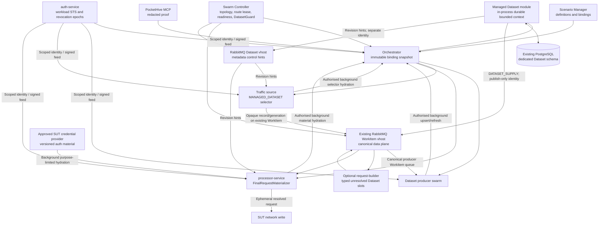

# Managed Test Data Architecture and Lifecycle Specification

Status: in progress — ready for manager review; implementation and qualification evidence pending

Decision target: PocketHive architecture and MVP implementation

Last updated: 2026-07-16

Assurance companion:
`docs/inProgress/managed-test-data-assurance-strategy.md`

Operator UI design companion:
`docs/inProgress/managed-datasets-operator-ui-design-spec.md`

This document specifies the target design and the conditions under which a
PocketHive release may claim the capability. It is not evidence that the
current implementation meets those conditions. Production case studies and
standards support design choices; only PocketHive qualification evidence can
support a PocketHive capacity, resilience, or security claim.

## 1. Purpose

Define PocketHive's managed test-data capability for long-running simulations,
including workloads with sensitive or regulated data.

The first delivery supports a configured source workflow that creates or
obtains related test entities, resources, and material. The resulting records
are grouped by descriptor-defined logical partitions and pools, then reused by
other swarms to generate traffic.

This specification covers:

- durable record storage;
- continuous sourcing, refresh, replacement, and retirement;
- bounded external-entity creation, validation, decommissioning, and deletion;
- synchronous and asynchronous multi-swarm consumption;
- variable-driven input and output configuration;
- high-throughput worker-local access;
- Redis compatibility;
- sensitive-data security, payment-data constraints, and a disabled-by-default
  PCI account-data profile;
- Docker deployment and restart behaviour;
- read-only MCP evidence for source operations, readiness, and use;
- a read-only, authorised Managed Datasets inventory, detail experience, and
  Swarm Inspector dependency view whose every dynamic fact is supplied by a
  canonical product read model;
- risk-based qualification, independent oracles, and reproducible evidence;
- the MVP boundary and enterprise evolution path.

The terms **must**, **shall**, and **required** are normative. **Should** records
the preferred implementation where an equivalent design can still satisfy the
acceptance criteria.

### 1.1 Requirement and evidence classes

To prevent target-state ideas from silently entering the MVP, requirements use
these classes:

- **MVP release requirement**: must be implemented and satisfy its section 28
  evidence gate before the capability is released;
- **MVP design constraint**: constrains implementation but may be demonstrated
  by contract, component, or static evidence rather than an end-to-end run;
- **profile release requirement**: mandatory only before the named guarded
  profile can be admitted; qualified core may ship with that profile disabled
  and fail-closed;
- **deferred target**: documents an extension point and must fail admission if
  selected before implementation;
- **informative evidence**: research, rationale, examples, and case studies;
  it is not a PocketHive acceptance oracle.

Section 27 is the scope authority. Section 28 is the release-contract
authority. If narrative elsewhere appears to expand either section, the
smaller explicit MVP scope and the numbered release requirements win.

Every qualification report shall identify the build, image digests, reference
deployment, workload profile, Dataset definitions and policy versions, fault
schedule, raw evidence locations, anomalies, and residual risks. A percentage
of passed checks is not a confidence statement.

### 1.2 Manager review decision

**Recommendation: conditional GO for the core MVP.** Implement Managed Dataset
as a bounded module inside `orchestrator-service`, supported by existing common
contracts and SDK extension points. Add no PocketHive application container.

Approval conditions:

- the existing PostgreSQL deployment, in a dedicated Dataset schema and role,
  is the sole durable authority; ad-hoc filesystem files are neither authority
  nor a recovery journal;
- the Dataset module owns a feature-scoped durable state machine, transactional
  outbox, idempotency/fencing, bounded executors and startup `RECONCILING` gate;
- workers hydrate/upsert in the background through authorised Orchestrator
  Dataset endpoints and perform no remote Dataset call on the measured path;
- Swarm Controller owns only per-swarm topology, fenced route leases,
  activation/readiness aggregation and `DatasetGuard`; and
- the release claims Dataset-state recovery, not exact recovery of an
  interrupted whole-swarm create/config/start/stop handoff. That broader
  platform capability remains separately gated.

The accepted MVP trade-off is a shared Orchestrator process, heap, deployment
and availability boundary. A later sensitive or independently available
profile may extract the same bounded module behind its existing ports. HSM
integration remains a last, optional extension.

**Decision requested:** approve this embedded modular-monolith boundary and its
explicit release limitations, or require the separately deployable enterprise
boundary before implementation.

## 2. Executive decision

PocketHive will add a managed test-data bounded context inside the existing
monorepo.

The target architecture is:

1. Scenario Manager owns SUT-scoped Dataset Space definitions, logical aliases,
   schemas, permissions, source bindings, and versioned policy metadata.
2. A bounded Managed Dataset module inside `orchestrator-service` owns durable
   runtime records, material generations, supply operations, refresh state and
   the transactional outbox. It is isolated by package/port boundaries,
   dedicated PostgreSQL schema/role/pool and bounded executors, not by a new
   application container.
3. Each required binding freezes an immutable Dataset Fitness Contract. The
   module derives `PASS`, `FAIL`, or `UNKNOWN` from authoritative schema, cohort,
   freshness, provenance, classification, retention and declared-use evidence;
   only `PASS` contributes to readiness.
4. PostgreSQL is the durable authority, but it is never queried by a measured
   traffic transaction. Ordinary filesystem writes are not authoritative.
5. RabbitMQ carries bounded supply/refresh commands and coalesced,
   metadata-only change notifications. `DATASET_SUPPLY` uses the producer's
   canonical WorkItem route in the existing WorkItem vhost; revision hints use
   a dedicated Dataset vhost. The Dataset module uses a different
   least-privilege identity and connection for each vhost and never assumes
   cross-vhost routing. Sensitive record values, credentials, ciphertext,
   provider bodies, and record projections shall not be placed in Rabbit
   messages.
6. Worker SDK clients preload reusable records or leased batches into bounded
   local memory. The measured transaction path performs only local access.
7. Source and refresh swarms execute configured SUT business calls. The Dataset
   module coordinates lifecycle but does not embed those workflows.
8. The existing PocketHive MCP exposes only bounded, redacted, deterministic
   Dataset status and proof from product-owned APIs. An agent is an untrusted
   client: MCP is not a Dataset authority, mutation surface, store, or privileged
   database client.
9. Existing `REDIS_DATASET` and `REDIS` output behaviour remains supported.
   Managed datasets are additive and opt-in.

This is a PocketHive feature delivered as an Orchestrator-owned bounded module
plus shared contracts/SDK adapters in the existing repository and deployment.
It is not a separate product, repository, or application container.

## 3. Brief and required outcomes

The MVP shall enable this flow:

```text
Configured source workflow
        -> create or obtain related entities/resources/material
        -> commit a managed dataset record
        -> classify by Dataset Space/partition/pool
        -> publish a new dataset revision
        -> hydrate traffic swarm worker-local pools
        -> generate traffic continuously
```

Required outcomes:

- Source results survive application and container restarts.
- Data is shared by multiple swarms without copying scenario bundles.
- Dataset identity and access policy remain stable for a running binding while
  record contents and material generations continue to change.
- A required Dataset is never declared ready from count alone: its exact
  Dataset Fitness Contract must be `PASS`, while projection/auth activation
  remains a separate gate.
- Under a declared provider operating profile, short-lived data is refreshed
  and applied before its safe-use boundary. Outside that profile, the affected
  input degrades or stops before unsafe data can be used.
- Exhausted or expired data fails closed and never becomes traffic silently.
- At 1,000 requests/second, the dataset layer performs no central-store lookup
  on the measured transaction thread.
- Existing Redis scenarios continue to work.
- Operators can inspect authorised Dataset selections, use-specific Fitness,
  real supply/lifecycle work, consumers, evidence, and swarm-local application
  through a production UI with no fixture fallback or record-value exposure.
- All mandatory components are free to run and Dockerised.
- HSM-backed payment cryptography is a last, optional profile extension, not an
  MVP dependency or the Dataset at-rest-encryption mechanism.
- Capacity and non-interference claims are made only for a named, reproducible
  reference deployment and workload profile.

## 4. Non-goals

The MVP will not:

- replace Redis for every PocketHive use case;
- implement Kafka, NATS, Cassandra, ScyllaDB, or distributed SQL;
- provide a general-purpose test-data management product outside PocketHive;
- store prohibited sensitive authentication data;
- make agents or MCP clients data authorities;
- provide autonomous or write-capable Dataset-agent operations, including
  agent-requested seed, refresh, configuration, activation, or deletion;
- define cross-cutting agent governance for model/provider/prompt/skill
  qualification, persistent memory, multi-agent coordination, AI/tool bills of
  materials, or agent-specific approval and kill-switch systems;
- place PostgreSQL, Redis, the Orchestrator Dataset API, a secret service, or a remote
  provider in the measured reusable-data request path;
- implement multi-region active-active data management;
- implement an HSM integration;
- promise exactly-once execution of external provider side effects where the
  provider supplies no idempotency or reconciliation facility;
- claim regulatory compliance merely because this architecture is followed;
- promise an unmeasured universal maximum throughput.

## 5. Alignment with existing PocketHive architecture

This specification completes rather than replaces
`docs/architecture/sut-dataset-simulation-model.md`.

The existing proposal already establishes these decisions:

- a Dataset Space is scoped to a SUT Environment;
- datasets are shared across scenarios for days or weeks;
- source swarms continuously create persistent identities/material and feed
  operational pools;
- Scenario Manager stores registry/control-plane metadata only;
- a Scenario Binding produces an immutable runtime snapshot;
- PostgreSQL is the source of truth for metadata and version history.

The existing proposal must be amended in one area: a binding snapshot shall
contain a stable logical runtime reference, not a physical Redis list name or a
specific material generation.

The snapshot freezes:

- Dataset Space identity;
- descriptor/schema version;
- logical dataset alias;
- logical partition and pool;
- allocation and access policy;
- stable Supply Policy identity;
- stable Selection Policy identity and exact version;
- selector projection identity and exact version;
- material projection identity and exact version;
- source binding identity and exact version;
- SUT Authentication Binding identity/exact version and stable opaque
  `authRef`;
- variable profile and resolved non-secret values;
- traffic delivery/effect profile and any immutable SUT idempotency contract;
- Trusted Time Policy identity and exact version;
- external-entity lifecycle/decommission policy identity and exact version.

Every definition, binding, permission, record, operation, and proof is scoped
by SUT Environment and Dataset Space. Dataset references narrow that scope by
Dataset, partition, and pool; no API may infer or broaden a missing scope.

It does not freeze:

- records inserted after the swarm starts;
- current material generation;
- activated SUT credential material revision behind the stable auth binding;
- refresh timestamps;
- pool counts;
- leases;
- supply operations;
- active Supply Policy version after an explicit audited activation;
- readiness state.

Descriptor or binding changes create a new binding version. Ordinary record
creation, refresh, expiry, and state transitions occur behind the stable
reference without a swarm config update.

A scenario bundle contains definitions and references, not runtime Dataset
records. A record becomes durable only when `DATASET_UPSERT` returns a
PostgreSQL commit receipt; after that, workers may restart and rehydrate it
without rerunning the source workflow.

## 6. Terminology

### 6.1 Dataset Space

A SUT-scoped namespace containing Dataset definitions, aliases, schemas,
permissions, source bindings, and policy references.

### 6.2 Dataset definition

The versioned contract for one logical set of records, including its schema,
logical partitions, pools, classifications, allowlisted
`fitnessContractRefs`, and optional `defaultFitnessContractRef`. Examples
include reusable identities, reference entities, short-lived tokens, request
inputs, or workflow outputs. Each declared-use binding resolves exactly one
allowlisted immutable Fitness Contract after variable materialisation; it may
use the default but cannot add or weaken assertions inline.

The definition declares whether concurrent reuse by different workers and
swarms is safe for the SUT. `SHARED` admission is forbidden when concurrent
reuse is not declared safe. Data that requires exclusivity, single use, strict
ordering, or a transaction-bound value is outside the reusable MVP and shall
fail with a stable unsupported-allocation error rather than silently sharing.

### 6.3 Dataset reference

The immutable logical selector delivered to a running swarm.

```yaml
datasetRef:
  datasetSpaceId: performance-sim
  datasetAlias: reusable-entities
  partition: baseline
  pool: traffic-ready
```

`partition` is a required, descriptor-owned logical classification within a
Dataset. Every record belongs to exactly one declared partition; use
`partition: default` when no subdivision is required. It is not a PostgreSQL
table partition, wildcard, tag map, or physical shard. Unknown, omitted, or
cross-Dataset partition values fail admission. Descriptive tags may exist as
schema metadata but do not drive supply, authorisation, or routing.

`pool` is a required, descriptor-owned operational grouping within that
partition. It is separate from record lifecycle state. Unknown, omitted, or
wildcard pools also fail admission.

The worker does not receive a table name, Redis key, database endpoint, or
storage-specific identifier.

### 6.4 Record

A stable test identity representing one logical entity or related resource
aggregate. One record may have multiple material generations over time.

### 6.5 Material generation

One immutable version of refreshable or sensitive record material, with
`usableFrom`, `refreshAt`, `expiresAt`, and `usableUntil` timestamps.

### 6.6 Source binding

A versioned link from a Dataset definition to the PocketHive scenario or
adapter capable of creating, replacing, refreshing, or replenishing its data.
It contains references to configuration and credentials, never secret values.

### 6.7 Dataset producer

A long-running or demand-driven swarm that executes business calls and commits
the resulting data. The first MVP source workflow is implemented as a Dataset
producer. This replaces the ambiguous concept of a startup-only "seeder".

### 6.8 Supply operation

A bounded, idempotent request to provision, replace, refresh, or replenish data.

### 6.9 Eligible record

A record that matches the Dataset reference, is in an allowed state, has
sufficient remaining validity, is not quarantined or revoked, and satisfies the
requested allocation policy.

### 6.10 Authentication Binding

A versioned, non-secret SUT-scoped contract naming the allowed authentication
protocol/mode, credential-provider reference, purpose, rotation/validity policy,
final-processor capability, and local capacity limits. Its stable `authRef` is
opaque; it is not a credential, secret name, provider URL, or authorisation
token. Credential material rotates behind an explicitly activated revision.

### 6.11 Executable data-contract artifacts

The immutable, version-addressed `recordSchemaRef`, `sourceMappingRef`,
`selectorProjectionRef`, `materialProjectionRef`, and `bindingSlotsRef`
together define the only permitted path from a source result to a stored record
and then to a request slot. Selector and material projections are different
artifacts with different principals, fields and classifications; one reference
shall never stand for both. They are closed machine-readable contracts, not
descriptive labels or arbitrary code. Their normative semantics are in section
9.13.

### 6.12 Selection Policy

An immutable, versioned `selectionPolicyRef` defines worker-local reusable
record choice, including algorithm, deterministic seed derivation, replacement,
weight and hotspot rules. It never creates a global per-transaction
coordinator. Its normative semantics are in section 15.1.

### 6.13 Trusted Time Policy

An immutable, versioned `trustedTimePolicyRef` identifies the qualified time
authority, sampling and authentication requirements, uncertainty/step limits,
durable rollback floor, maximum offline age, and restart behaviour. It exists
because process memory and the wall clock alone cannot safely enforce expiry
across restart. Its normative semantics are in section 11.

### 6.14 Dataset Fitness Contract

An immutable, versioned `fitnessContractRef` defines the minimum evidence that
records are fit for one declared Dataset use. Scenario Manager owns these
contracts; a Dataset definition allowlists compatible contracts and may name a
default, while each binding freezes one exact resolved reference/digest. This
supports safe reuse under several declared uses without letting a consumer
invent or weaken policy.

The contract separates compile/admission metadata (owner/support, intended and
forbidden use, retention and projection purpose) from bounded runtime
assertions over schema/relationships, required partition/pool cohorts and
counts, freshness and remaining validity, source provenance/classification,
and the permitted SUT Environment/destination class. Its result is `PASS`,
`FAIL`, or `UNKNOWN`; record count alone is never a fitness result. Its
normative semantics are in section 18.1.

## 7. Component responsibilities

### 7.1 Scenario Manager

Scenario Manager owns:

- Dataset Space descriptors;
- Dataset definitions and aliases;
- Dataset Fitness Contracts, definition allowlists/defaults, and authoring
  validation;
- versioned logical partition and pool declarations;
- schema and data-classification metadata;
- source binding definitions;
- versioned non-secret SUT `AuthenticationBinding` definitions/provider refs;
- access/usage policies;
- supply and retention policy definitions or references;
- selection, trusted-time, external-entity lifecycle, decommission, and
  side-effect-budget policy definitions or references;
- version history and authoring validation;
- variable definitions and profiles.

Scenario Manager does not:

- call SUT-specific source APIs;
- seed runtime rows;
- refresh credentials;
- assign consumable records;
- serve records to transaction workers.

### 7.2 Orchestrator and Simulation Program

The Orchestrator owns:

- the external Managed Dataset API, authentication, authorisation and admission;
- binding admission and final compatibility validation;
- resolution of SUT and variable profiles;
- materialised, immutable binding snapshots;
- freezing and coordinating Dataset/auth binding revisions and activation;
- producer and traffic swarm lifecycle;
- data-aware start admission;
- persistent plan/binding references and idempotent replay; and
- hosting the bounded Managed Dataset module described in section 7.3.

Workers and producers call authorised Orchestrator Dataset endpoints directly
in the background. The Orchestrator does not proxy a Dataset call for each
measured transaction; measured selection and materialisation remain local.

A Simulation Program may compose source producers, traffic, stress, and
post-processing swarms against one Dataset Space.

### 7.3 Managed Dataset module

The Managed Dataset module is an in-process bounded context inside
`orchestrator-service`. It owns:

- durable runtime records and material generations;
- durable deletion/tombstone epochs and external-entity lifecycle accounting;
- eligibility and pool counts;
- Dataset Fitness Contract compilation, evaluation, and reason-coded status;
- supply policy evaluation;
- capacity reservations and supply operations;
- refresh scheduling and fencing;
- reusable/sharded/leased/consumable allocation;
- transitions, acknowledgements, and quarantine;
- the transactional outbox;
- non-secret projection and SUT-auth activation/fencing state;
- authoritative dataset health and evidence snapshots;
- secure snapshot/batch application ports exposed through Orchestrator APIs;
- hierarchical admission budgets and separate lifecycle/hydration/evidence
  bulkheads.

The module does not execute SUT-specific source sequences and does not depend
on Orchestrator's in-memory swarm registries for durability. Its PostgreSQL
state, migrations, claims and reconciliation form a feature-scoped durable
island. On process start it remains `RECONCILING` until that state and outbox
are recovered; this does not imply that an interrupted whole-swarm lifecycle
mutation has also been recovered.

### 7.4 Shared contracts and SDK boundaries

Shared code is deliberately narrow:

- `common/dataset-contracts` owns canonical Dataset IDs, DTOs, states,
  bindings, projection contracts, commands and receipts, with no persistence
  or scheduling policy;
- `common/swarm-model` carries resolved immutable Dataset binding references in
  the swarm plan;
- `common/worker-sdk` owns managed input/output adapters, authorised background
  hydration/upsert clients, bounded local projections and local readiness;
- `common/manager-sdk` owns reusable Dataset readiness aggregation and
  `DatasetGuard` contracts; and
- `common/auth-contracts` owns Dataset resource types and permission IDs.

PostgreSQL entities, repositories, migrations, Supply Policy decisions,
refresh scheduling, outbox relay and authoritative Dataset business rules stay
inside the Orchestrator Dataset module. `common` is not a second runtime owner.

### 7.5 Dataset producer swarms

Producer swarms:

- stay healthy and idle when no supply request exists;
- accept bounded `DATASET_SUPPLY` work;
- execute the configured source/refresh business flow;
- preserve operation and reservation context throughout the flow;
- commit source results through `DATASET_UPSERT`; use the deferred
  `DATASET_TRANSITION` only for a later approved state-loop migration;
- report bounded, redacted failure outcomes;
- never decide independently how many records the Dataset needs.

### 7.6 Traffic workers

Traffic workers:

- preload data in the background;
- perform local selection/pop on the measured path;
- enforce `usableUntil` locally;
- enforce the frozen traffic delivery/effect and selection contracts locally;
- publish redacted readiness and use evidence;
- stop or throttle the affected input when no safe record exists;
- never connect directly to PostgreSQL.

### 7.7 Swarm Controller

Swarm Controller owns only per-swarm realisation and safety:

- canonical producer and revision-hint topology for the current plan;
- issue, renewal and revocation of fenced `SupplyRouteLease` registrations;
- worker-incarnation and projection-activation acknowledgement aggregation;
- Dataset readiness reporting and start-gate contribution; and
- manager-level `DatasetGuard` protection for starved or unsafe inputs.

It does not own Dataset records, global Supply Policy counts, refresh schedules,
outbox work, decryption keys or evidence truth. A controller restart fences its
old route lease and requires current registration/rehydration; broader exact
swarm reconstruction remains a separately qualified platform capability.

### 7.8 PocketHive MCP

The MCP:

- delegates to authenticated product APIs;
- presents source, commit, distribution, readiness, and use status/proof through
  the three read-only MVP tools in section 22.1;
- exposes no raw data, SQL, Redis query, or secret retrieval tool;
- treats the agent as an untrusted client and confers no authority from a tool
  name, description, annotation, model decision, or MCP routing choice;
- fails closed when the Orchestrator Dataset evidence contract is unavailable;
- does not infer durable proof from Redis list length.

## 8. Architecture



Data values are transferred through authenticated Orchestrator Dataset APIs in
background hydration/upsert flows. RabbitMQ
dataset events contain only schema-allowlisted identifiers, revisions, states,
bounded reason codes, and checksums. They shall not contain sensitive record
values, credentials, ciphertext, provider response bodies, or free-form error
text.

The diagram shows two RabbitMQ vhosts that may share one qualified physical
broker. RabbitMQ does not route messages between vhosts. `DATASET_SUPPLY` is a
typed WorkItem and therefore enters the producer through PocketHive's canonical
WorkItem exchange/queue in the existing WorkItem vhost. Revision hints use the
Dataset vhost. The Dataset module maintains two separately authenticated,
least-privilege publisher connections/channels: the supply identity can publish
only to the canonical WorkItem exchange/routing pattern and cannot configure or
consume queues; the hint identity can publish only the allowlisted Dataset-hint
exchange. Swarm Controller alone owns both sets of queue/binding declarations.
The transactional outbox records the immutable destination class and routing
contract so a relay cannot publish an event to the other vhost by fallback.

A reusable selection adds opaque metadata to the WorkItem already needed by
the pipeline; it does not add another per-transaction Dataset message. Neither
Rabbit connection is opened or used by a measured request thread.

## 9. Managed Dataset persistence model

The MVP uses the existing PostgreSQL deployment with a separate database schema
and least-privilege role. It does not introduce another database container.
PostgreSQL is the sole authority for committed Dataset state; local files may
hold disposable caches or diagnostics only and must never be used to decide a
record, operation, schedule, revision, fence, or outbox outcome. The module's
ports must allow future extraction to a dedicated process or HA PostgreSQL
deployment without worker contract changes.

Target logical tables follow. The MVP requires records, material generations,
temporal membership/revisions, fitness evaluations, projection/auth activation,
supply operations, outbox, refresh attempts, source-step checkpoints, and
encrypted operation staging.
Record/batch leases and business-state transitions are post-MVP unless an
approved MVP flow proves they are necessary.

### 9.1 `dataset_record`

- stable `record_id`;
- Dataset Space and Dataset definition identifiers;
- schema version;
- encrypted stable payload or secret references;
- creation source operation and timestamps;
- optimistic current pointer/version for command validation.

Stable identity/attributes are immutable after creation. Any projected
correction or refresh appends a material generation and membership version;
it does not overwrite a value that an older revision could resolve. The
optimistic current pointer may change for command validation, but snapshot
reads never follow it. Revision-pinned membership and state come from the
temporal rows below and resolve only their referenced immutable generation.
`dataset_record` does not contain an independently mutable lifecycle state,
partition, or pool that could disagree with temporal membership. It identifies
the aggregate; `dataset_membership_version` is the sole as-of-revision authority
for selection state and inventory ownership.

### 9.2 `dataset_material_generation`

- `record_id`;
- monotonically increasing generation;
- encrypted material payload or secret reference;
- `usable_from`;
- `refresh_at`;
- `expires_at`;
- `usable_until`;
- immutable lifecycle class/initial disposition and key version;
- fencing epoch and provenance reference.

Material generations are immutable. A correction or refresh appends a new
generation; it never changes the payload/time meaning of an older generation.
The row's immutable creation classification is not current lifecycle state.
Current `generation_state` is temporal membership data, so a restart or
snapshot can never choose between two competing mutable state columns.

### 9.3 Revisions, temporal membership/change, and projection/auth activation

`dataset_revision` records one committed revision for an exact Dataset/
partition/pool scope, including descriptor/schema/selector-projection/material-
projection versions, counts, change digest, manifest-build state, and commit
time.

`dataset_membership_version` records:

- exact scope, stable record ID, material generation, separate
  `record_state` and `generation_state`, verification validity, and
  non-sensitive indexed selection metadata;
- `visible_from_revision` and nullable
  `visible_until_revision_exclusive`;
- a stable unique pagination key.

A membership change allocates N in the same transaction, closes the previous
row with `visible_until_revision_exclusive = N`, inserts the successor visible
from N, appends an immutable `ADD|UPDATE|REMOVE` change row, and writes the
revision/outbox. The change row contains scope, revision, stable record,
old/new generation/state references and bounded metadata, not sensitive payload.
Payload generations remain immutable.
Thus a page query for N always applies:

```text
visible_from_revision <= N
AND (visible_until_revision_exclusive IS NULL
     OR visible_until_revision_exclusive > N)
AND stable_key > continuation.lastStableKey
```

Concurrent commits at N+1 cannot alter the membership visible at N and no
network-spanning database transaction is required. Temporal rows/generations
and revision-change rows needed by an unexpired snapshot or exclusive delta
cursor cannot be purged. Representative
`EXPLAIN (ANALYZE, BUFFERS)` plans must prove the scoped visibility/keyset
indexes before qualification.

For the MVP, every stable record is assigned exactly one descriptor-declared
partition and exactly one inventory-owning pool for its lifetime. `READY`,
`STANDBY`, `QUARANTINED`, and `RETIRED` are record states within that same
scope; they are not hidden pools. A record cannot be visible in two pools or
count twice at one revision, and one stable record has at most one generation
eligible for new selection at an activated revision. An older generation may
be retained only for already-issued opaque references and never re-enters the
new-selection count. Database constraints plus the serialized scoped mutation
command enforce these invariants. Reclassification or multi-pool membership
requires an explicit post-MVP migration contract; copying a membership row is
not permitted.

`dataset_supply_policy_activation` is the sole inventory-controller pointer for
an exact Dataset/partition/inventory-owning-pool scope. It records one stable
Supply Policy identity, candidate and active immutable versions, activation
revision/fence and audit metadata. A database uniqueness constraint permits
exactly one non-retired activation row per scope, and the serialized scoped
mutation command prevents overlapping effective intervals. A second active
policy, a policy bound to the same records through another alias, or two
controllers calculating demand for one scope is a structural error that makes
the scope non-ready. Version replacement advances this one pointer; it never
creates a parallel controller. Read-only consumer bindings may share the scope
but cannot own or activate a Supply Policy.

`dataset_fitness_evaluation` is an append-only decision record containing the
exact binding snapshot, Fitness Contract reference/version/digest, evaluated
Dataset scope/revision vector, source/provenance policy references, trusted-time
evidence reference, input-vector digest, `PASS`, `FAIL`, or `UNKNOWN`,
`evaluatedAt`, `safeUntil`, `nextEvaluationAt`, and bounded per-assertion states,
reason codes, and evidence references; it contains no Dataset values or free
text. `safeUntil` is no later than the earliest safety-critical assertion,
material-validity, external-verification, or trusted-time offline boundary.
`nextEvaluationAt` includes a bounded guard and stable jitter before that
boundary. A transactionally updated current-evaluation pointer keyed by exact
binding snapshot may reference only the latest evaluation that is not
superseded and whose complete input vector still matches that binding. A
Dataset/policy/contract revision, expired evidence, or trusted-time invalidation
makes the pointer unusable until a new evaluation commits; restart reconstructs
this state from PostgreSQL rather than recomputing a remembered `PASS` from
process memory.

### 9.4 `dataset_supply_operation`

- operation and idempotency identifiers;
- exact Dataset/partition/pool reference and Supply Policy version;
- source binding/version;
- operation-kind discriminator and its closed terminal-receipt schema;
- requested, accepted, inserted, updated, duplicate, rejected counts for upsert,
  or validated/invalid/uncertain/deprovisioned/expired/handed-off accounting for
  the applicable lifecycle kind;
- reserved worst-case record and encrypted-byte capacity plus emergency
  reconciliation margin;
- state, attempts, deadline, and bounded error code;
- resulting Dataset revision.

Each queued operation also records the opaque `supplyRouteLeaseId` and fence
under which its canonical WorkItem destination was authorised. The route itself
is not inferred from a swarm name or source binding.

`dataset_supply_route_lease` is the durable, fenced registration joining one
exact SUT Environment/Dataset/source-binding version and closed operation-kind
set to a live producer swarm's canonical WorkItem exchange/routing key,
topology version, logical producer role, membership epoch, incarnation-set
digest, expiry and monotonically increasing route fence. It contains no
credential or record value. Only Orchestrator/Swarm Controller may register,
renew or remove it after reconciling topology through the shared routing
utility; Dataset module is a read/publish consumer of this authority.

### 9.5 `dataset_lease` (post-MVP)

- record/batch reference;
- allocation mode;
- worker/swarm owner;
- lease expiry;
- fencing epoch;
- acknowledgement/quarantine state.

### 9.6 `dataset_transition` (post-MVP)

- idempotent outcome identifier;
- record and expected generation;
- from/to state;
- transaction correlation reference;
- commit revision and timestamp.

### 9.7 `dataset_outbox`

- immutable event ID and aggregate revision;
- event type, immutable `WORKITEM_SUPPLY|DATASET_HINT` destination class,
  canonical contract/routing version, and metadata-only payload;
- publication state, attempt count, and timestamps.

### 9.8 `dataset_refresh_attempt`

- record/generation/fence reference and refresh-attempt state;
- claim, attempt, admitted deadline, result, retry, and bounded failure metadata;
- no secret or provider body.

### 9.9 `dataset_source_step_checkpoint` and `dataset_operation_staging`

- source operation, stable per-item `subOperationId`, step name/version,
  attempt, expected predecessor, and request-intent digest;
- surrogate or keyed-fingerprint external identity and provider idempotency/
  status reference;
- redacted outcome code, completion timestamp, and optimistic version;
- no sensitive record value, credential, provider body, or unbounded error text.

The staging table may hold only schema-allowlisted, application-encrypted
intermediate fields required by a declared successor step, bound to the exact
operation/item/step/source identity and retention deadline. It never stores an
unbounded provider body. Only the same authorised co-located source sequence
and Dataset module can resolve it; generic WorkItems, Rabbit/debug output,
MCP, and other producers receive only the opaque operation/item/step reference.
Staging is purged after the operation's reconciliation/retention gate.

Together the checkpoint and encrypted staging rows are the durable resume
authority when a parent step returns a generated identifier or secret required
by a child step.

### 9.10 External-entity and deletion ledgers

`dataset_external_entity` accounts for every external entity that a source
operation may have created, including an uncertain late success. It records an
opaque/keyed-fingerprint provider identity, source operation/sub-operation,
source namespace, lifecycle class, ownership, created/last-verified time,
`verification_valid_until`, deprovision capability/state, and bounded outcome
code. It never stores a prohibited value or provider body.

Every Source Binding declares exactly one external lifecycle:

| Lifecycle | Required contract |
|---|---|
| `AUTO_EXPIRES` | Provider contract and conservative expiry; Dataset module still accounts for the entity until that boundary and validates any provider invalidation signal |
| `DEPROVISIONABLE` | Versioned, idempotent deprovision/status binding, deadline, retry/reconciliation rules, and owner |
| `OWNER_RETAINED` | Explicit data-owner approval, retention/ownership hand-off, inventory export and acknowledgement; PocketHive never reports it as deleted |

`dataset_decommission` is the durable state machine for a Dataset selection:

```text
ACTIVE -> DRAINING -> TOMBSTONED -> EXTERNAL_RECONCILING -> RETIRED
```

`DRAINING` rejects new bindings and provisioning, stops new selector emissions,
and lets only already-issued work finish within its safety horizon.
`TOMBSTONED` commits a scoped removal revision and revocation epoch; every
worker must apply it and erase its local projection before retirement can be
reported. External entities then expire, are deprovisioned and reconciled, or
are handed to the declared owner. Primary data is purged only after worker,
external-lifecycle, evidence, retention, and key-erasure gates complete.

`dataset_deletion_tombstone` records a monotonically increasing Dataset-space
deletion epoch, exact scope, last visible revision, reason code, approved actor,
time, and digest. Active tombstones outlive the maximum backup/restore horizon.
For any PITR/backup profile, the newest signed tombstone manifest is also held
in an owner-controlled append-only restore-safety ledger outside the Dataset
database backup stream. This can be a separately protected Docker volume/file
for the free reference profile; it requires no hosted service. Before a restored
Dataset module publishes or serves data, it imports that manifest, reapplies every
newer deletion/decommission epoch, reconciles external effects, and issues a new
Dataset revision. A missing, older, invalid, or unverifiable manifest makes the
restore non-serving. Database rollback must never resurrect selectable data or
an externally deprovisioned identity.

### 9.11 Idempotency and external side effects

Dataset delivery is at least once. PocketHive promises exactly-once durable
accounting for a canonical command, not exactly-once execution by an external
provider.

Command-delivery deduplication is version-scoped:

```text
(sutEnvironmentId, datasetSpaceId, sourceBindingVersion, operationKind,
 idempotencyKey)
```

External business intent is a second, stable identity that cannot reset merely
because a source binding version changes:

```text
(sutEnvironmentId, providerAccountNamespace, operationKind,
 sourceCompatibilityNamespace, businessOperationKey)
```

The canonical intent is RFC 8785 canonical JSON hashed with SHA-256 and includes
the exact Dataset scope, operation kind, compatibility namespace, business key,
requested entity/item identities and count, parent references, mapping/schema
version, and semantic provider parameters. It excludes delivery `messageId`,
`attempt`, `correlationId`, heartbeat/claim owner, and operational deadline.
Canonicalization schema version and digest are persisted with the first result.
Before canonicalisation, every sensitive/secret leaf is replaced by its opaque
secret version reference or a domain-separated, versioned keyed fingerprint;
neither the retained canonical intent nor a plain hash may expose a raw or
dictionary-guessable sensitive value.

- the same key and semantically equivalent canonical request returns the
  original operation/commit receipt and changes no counts;
- the same key with a different semantic request fails with
  `IDEMPOTENCY_CONFLICT` and produces no side effect;
- receipt and deduplication state is retained beyond the maximum command retry,
  reconciliation, backup, and restore horizon;
- claim TTL, heartbeat interval, expiry grace, and late-completion handling are
  explicit policy fields;
- an uncertain external result remains reserved until provider idempotency,
  provider status/introspection, or an authorised replacement flow resolves it.

Every source profile declares provider idempotency scope, key format, TTL,
parameter-mismatch semantics, status/introspection behaviour, and maximum late
arrival. PocketHive retention cannot extend the provider's guarantee. Once the
provider window closes, an unresolved operation remains quarantined unless
provider truth or an authorised replacement establishes a safe outcome.

A unique keyed-fingerprint constraint on the provider account namespace and
stable external identity prevents two different command keys from inserting the
same logical external record. A binding upgrade reuses the compatibility
namespace or requires an explicit reviewed migration; it cannot silently make
an old business intent new.

After point-in-time restore, operations newer than the restore point are not
assumed forgotten by the provider. They enter recovery quarantine and reconcile
against provider status/external ledger before any replay. A local backup alone
cannot prove exactly-once external effects across rollback.

### 9.12 Dataset revision and snapshot contract

A revision is scoped to one exact Dataset/partition/pool aggregate. Revision
allocation shall not require one global hot counter shared by unrelated
Datasets.

- snapshot revision N is implemented by the temporal visibility predicate in
  section 9.3 and contains every visible commit through N and no commit after N;
- a continuation token is opaque, bound to the same scope and snapshot, and
  cannot broaden access;
- a delta cursor is exclusive: requesting changes after N never returns a
  change at or before N;
- maximum page bytes, maximum record count, request timeout, continuation-token
  lifetime, and delta-retention window are explicit deployment limits;
- an expired cursor returns a stable `SNAPSHOT_REQUIRED` result;
- a worker exposes either a complete validated revision N or a complete
  validated revision N+1, never a mixed view;
- required-worker acknowledgement uses a binding membership epoch. A removed
  worker cannot block activation forever, and a stale returning worker cannot
  dispatch before joining the current epoch and rehydrating.

Every snapshot starts with an immutable `SnapshotManifest` containing exact
authorised scope and principal purpose, Dataset/descriptor/schema, the exact
`selectorProjectionRef` or `materialProjectionRef` (never an ambiguous generic
projection), slot versions where applicable, membership epoch, revision,
ordered record count, uncompressed canonical byte count, page count,
page/record/byte limits, canonicalisation and digest algorithms, `manifestId`,
creation/expiry, and an ordered root digest.
For a required binding, the signed manifest also carries a bounded
`FitnessReceipt` containing the exact evaluation ID, Fitness Contract
reference/digest, input-vector digest, result `PASS`, `evaluatedAt`, and
`safeUntil`. A `FAIL`/`UNKNOWN`, mismatched input vector, or receipt that cannot
cover the activation/recovery budget cannot be placed in an activatable
manifest. The worker verifies this receipt as metadata; it does not re-evaluate
the Dataset-level contract.
Entries are ordered by the stable pagination key and hashed as unambiguous
length-delimited canonical records; concatenating ambiguous JSON strings is
forbidden. Digest material for a sensitive projection is returned only inside
the authorised projection response and never enters hints, metrics, logs, MCP,
or a lower-purpose projection.

Every page repeats `manifestId`, scope/revision/projection kind and exact ref,
page ordinal,
first/last stable key, item and canonical-byte counts, previous-page digest,
page digest, and an authenticated next token. Tokens are bound to the caller,
purpose, exact manifest/scope/revision/projection kind and ref, last key,
ordinal, expiry,
and response limits. They cannot select arbitrary SQL predicates. The worker
validates page order, non-overlap, bounds, per-page chain, total counts/bytes,
and root digest before making the candidate visible. A duplicate identical page
is idempotent; a missing, changed, overlapping, reordered, over-limit, or
cross-manifest page discards the complete candidate and reconciles.

A delta has exact `fromRevisionExclusive` and `toRevisionInclusive`, the base
manifest/root digest, contiguous scoped change sequence, descriptor/schema/
projection kind/version, ordered count/bytes/digest, and an authenticated exclusive
cursor. It applies only to the declared complete base. Gaps, incompatible
schema/projection kind/ref, a divergent prior digest, expired retention, or an unknown
change type returns `SNAPSHOT_REQUIRED`; Dataset module and worker never guess or patch
a partial view. Compression is optional transport encoding and is bounded and
fully decoded before canonical validation.

Revision commit is O(changed records), not O(total Dataset size). It persists a
length-delimited ordered change digest and marks each affected selector/material
projection manifest `PENDING`; it never rescans the full Dataset inside the
mutation transaction. Deltas compute their authenticated root over only the
contiguous changed leaves. When a full baseline is required, one bounded,
resumable manifest builder per exact scope/revision/projection kind/ref streams
the revision-pinned keyset off the mutation path. It writes immutable page
digests and a domain-separated Merkle-accumulator peak set after each bounded
page, so restart resumes without holding or rehashing prior pages. Finalisation
folds the ordered peaks, counts and canonical bytes into the manifest root and
signs the manifest with Dataset module's purpose-separated manifest-signing
key. Workers verify the signature, key-manifest epoch, page chain, accumulator
root and totals before exposure.

`maximumManifestBuildRecords`, bytes, pages, wall time, database read permits,
checkpoint interval and retained builder-state bytes are deployment limits.
At most one builder is active per scope/projection kind; rapid revisions use the
existing durable supersession rule and build only the highest safe candidate.
An over-limit, stalled or unverifiable build is non-ready and cannot activate.
This permits an occasional bounded O(dataset) baseline build while prohibiting
O(dataset) work per record change; ordinary delta work remains O(changes).

`dataset_projection_activation` durably records the exact binding/membership
epoch, candidate revision, Fitness evaluation ID/input-vector digest/
`safeUntil`, required selector/final-materializer incarnations, their
projection-ready acknowledgements, activated revision, fence, and timestamps.
Dataset module advances the activated revision monotonically only after the
bound Fitness receipt remains `PASS` and all required final materializers are
ready. An acknowledgement from another epoch/incarnation cannot satisfy the
barrier; restart reconstructs the same candidate/barrier rather than inferring
activation from process health.

Dataset module also owns the non-secret operational
`authentication_binding_activation` table. It records Scenario Binding,
Authentication Binding definition/version, opaque credential-material
candidate/activated revision, provider-validity/credential epoch, exact
membership epoch and required final-processor incarnations, ready
acknowledgements, monotonic activation fence, and timestamps—never a credential
or secret path. Swarm Controller submits the fenced acknowledgement set;
Dataset module validates every incarnation and commits the activated auth revision.
An auth/provider/Dataset module restart reconstructs the candidate, acknowledgements,
and last activated revision from this table; process health or a mutable config
value cannot infer/advance activation.

The MVP permits one active revision, at most one unactivated building candidate,
and the bounded retained-old revisions required by already-issued work. Hint
coalescing records the highest observed authoritative revision. If a newer
revision arrives before activation, Dataset module durably marks the old candidate
`SUPERSEDED`, invalidates its acknowledgements/fence, and workers cancel or
discard it before building the highest safe complete snapshot/delta. A selector
may atomically advance from activated R to R+k after the same final-materializer
barrier; it need not expose every intermediate revision, but the durable change
history remains auditable. An acknowledgement for a superseded candidate can
never activate it. `maximumCandidateAge`, `maximumActivationLag`, candidate
bytes, and retained-old count/bytes are frozen limits; exceeding one pauses the
affected input and triggers full reconciliation. Old revisions are released
only after their maximum in-flight age/send gates and material safety horizons
have drained.

The MVP projection mode is `FULL`: every required selector worker receives all
eligible opaque references/selection metadata for its exact scope, and every
authorised final materializer receives all purpose-limited fields for that same
scope/revision through the separately authorised `selectorProjectionRef` and
`materialProjectionRef`. Equality of those refs is invalid even if their
current fields happen to match. `snapshotPageSize` controls transport pages, not local
membership. Deterministic sharded/subset projections are deferred and fail
admission until their own revision/readiness contract is approved.

Each binding declares `maximumLocalRecords`, `maximumLocalBytes`, maximum
projected record bytes, snapshot page limits, and a measured transient-swap
multiplier covering active + building + retained-old generations. Admission
fails before container creation if Supply Policy capacity and worst-case
projection cannot fit. Delta apply is bounded/coalesced; if it cannot preserve a
complete revision within limits, the input pauses rather than keeping a partial
view.

### 9.13 Executable schema, mapping, selector/material projection, and slot contract

The canonical repository shall publish closed JSON Schema 2020-12 documents
for every artifact and OpenAPI/AsyncAPI references to them. Every artifact has
an immutable content-addressed version, bounded depth/count/bytes, restrictive
identifier grammar, `additionalProperties: false`, and explicit compatibility
metadata. Dataset module persists the exact content digest used by each record,
operation, revision, selector/material projection role and exact ref, and
binding. A moving alias is resolved before
container creation and never evaluated by a worker.

The record contract has three non-overlapping namespaces:

- `stable`: immutable identity/attributes owned by `dataset_record`;
- `material`: generation-owned refreshable/sensitive values owned by
  `dataset_material_generation`; and
- `relations`: typed opaque references and declared cardinality to related
  records or aggregates.

Dataset module metadata—including record/generation/revision IDs, lifecycle states,
partition/pool, timestamps, fences, provenance, key versions, classifications,
and digests—is Dataset module-owned and cannot be supplied or shadowed by a mapping.
A field path has exactly one owner for all compatible schema versions. Stable
and material namespaces cannot contain the same logical field under aliases,
and a new generation cannot change a stable value. A stable correction requires
an explicit replacement/migration that preserves lineage; silent overwrite is
forbidden.

Each field declares type, required/nullability, maximum encoded size,
classification, permitted source paths, retention class, projection purposes,
and request contexts. Missing and explicit `null` are distinct. Literal
defaults apply only to a declared missing field, never to `null`. There is no
implicit string/number/boolean/date coercion, locale-dependent parsing,
truncation, case folding, array flattening, first-value selection, or unknown-
field discard. Any explicitly permitted normalisation is named, versioned,
deterministic, locale-independent, and tested with canonical vectors.

Every Dataset declares an ordered natural-key contract over immutable stable
fields and its exact uniqueness scope. Sensitive natural-key components are
represented for lookup/uniqueness only by the versioned domain-separated keyed
fingerprint in section 23; raw or plain-hashed sensitive keys are forbidden.
Empty/missing key parts reject the item. Relationship contracts declare target
Dataset/schema, `ONE|OPTIONAL_ONE|MANY` cardinality, ownership, delete behaviour,
and whether all members form one atomic related aggregate. Dataset module validates
referential scope and cardinality before commit; an opaque reference cannot
cross a SUT Environment or Dataset Space by accident.

`sourceMappingRef` is a declarative, deterministic, side-effect-free mapping
from a schema-validated, size-bounded source-step result to one or more
`RecordDraft` aggregates. It cannot perform network/file/secret lookups,
reflection, arbitrary code, dynamic property-path evaluation, clock/random
reads, or destination selection. Its input paths, output paths, transforms,
defaults, relationship construction, maximum fan-out, and error code for every
failure are closed and compile-validated at binding admission.

`selectorProjectionRef` and `materialProjectionRef` are distinct closed
allowlists of record fields, Dataset module metadata, principal purpose and output
classification. Neither can downgrade a classification, expose a natural-key
fingerprint without an approved purpose, derive a new sensitive value, or
include a field not permitted by the record schema. A selector projection
contains only opaque identity/generation/validity and declared non-sensitive
selection metadata and is readable only by the named selector principals. A
material projection contains only fields needed by the exact final-processor
binding and slots and is readable only by those final materializer principals;
source-step resolution uses its separate operation-bound contract from section
13.2, not either traffic projection. Binding admission rejects a missing ref,
the same artifact used in both roles, a selector field classified above the
declared metadata ceiling, or a material field without a compiled slot/use.

`bindingSlotsRef` maps each projected source field to one immutable request-
definition slot, cardinality and exact context adapter such as HTTP header,
path, query, JSON, XML, ISO or TCP field. It declares required/optional/null
behaviour, maximum encoded bytes and duplicate-field/header rules. Every
required slot has exactly one source; unused sensitive projected fields and
multiple writers are rejected. Slot compilation proves schema/material-
projection/request-definition/protocol compatibility before start. Dataset module values never
select a slot, expression, endpoint, protocol, header name, template, or
credential mode.

The MVP upsert atomicity is `PER_RELATED_AGGREGATE`. One `RecordDraft` and its
declared owned relations commit atomically with its receipt/revision/outbox;
bounded batches are collections of independently accounted aggregates.
`ALL_OR_NOTHING_BATCH` and cross-Dataset transactions are unsupported and fail
admission. For each received aggregate, exactly one terminal result applies:

- `inserted`: a new natural key and stable record/generation were committed;
- `updated`: the same stable identity received a different valid material
  generation or temporal state under the expected version/fence;
- `duplicate`: canonical stable/material/relations and business intent match an
  already accounted result, so no new revision is manufactured;
- `rejected`: validation, scope, ownership, relationship, stable-field,
  expected-version, or policy conflict caused no partial aggregate commit.

The receipt preserves per-item bounded reason codes and the invariant
`received = inserted + updated + duplicate + rejected`; a transport retry
returns the original results. Schema evolution never reinterprets stored bytes.
An incompatible field-owner, natural-key, relationship, classification,
selector projection, material projection, slot, or normalisation change requires an explicit versioned
migration with old/new readers, rollback rules and qualification evidence.

### 9.14 Retention and storage capacity

Retention Policy is separate from Supply Policy. It defines bounded retention
or archive periods for retired records, expired/superseded generations, source
operations, transitions, leases, and audit evidence. `maximumReady` is never
used as a delete limit. Scheduled purge/cryptographic-erasure jobs and restore
tests must cover primary rows, history, projections, and backups according to
the approved retention schedule.

Every deployment also declares `maximumStoredRecords`, `maximumStoredBytes`,
`maximumStandby`, a minimum free-space threshold, purge cadence, and purge SLO.
Before an external provisioning call, Dataset module atomically reserves the
profile's worst-case encrypted rows and bytes for every in-flight item plus a
separate emergency reconciliation margin. It refuses the call if either cannot
fit. A late provider success consumes its reservation and is durably accounted;
variable-size overflow may use only the emergency margin and then closes new
provisioning until reconciled. An external success is never reported as
PocketHive success and silently dropped. Storage pressure in the Dataset schema
must not corrupt or starve Orchestrator-owned persistence.

Large transition, consumption, and audit tables may be time-partitioned when
measured volume justifies it. Partitioning is not required for the first MVP.

## 10. Lifecycle classes

Lifecycle classification and allocation policy are independent.
`STATIC_REUSABLE` and `REFRESHABLE_REUSABLE` are the MVP lifecycle classes;
the other rows define fail-closed classification and post-MVP extension points.

### 10.1 Lifecycle types

| Type | Examples | Required behaviour |
|---|---|---|
| `STATIC_REUSABLE` | Stable entity/resource identity | Durable, versioned, reusable; immutable by qualified contract or continuously validated/invalidation-fed when externally mutable |
| `REFRESHABLE_REUSABLE` | Access/session material | Refresh ahead; atomic generation swap |
| `ROTATING_CREDENTIAL` | One-time rotating refresh chain | Single fenced refresher; atomic full-generation commit |
| `PREFETCHABLE_CONSUMABLE` | Source-issued nonce/token | Batch lease; local pop; never silently reissue |
| `TRANSACTION_BOUND` | Request-bound generated material | Generate just in time through an approved adapter |
| `PROHIBITED` | Schema-prohibited or regulated authentication data | Reject from durable storage and telemetry |

### 10.2 Allocation modes

`SHARED` is the MVP allocation mode. The remaining modes are target-state
extensions and do not expand the source-workflow MVP.

| Mode | Meaning |
|---|---|
| `SHARED` | Multiple workers/swarms may reuse an eligible record |
| `SHARDED` | A deterministic record subset is assigned to a worker or swarm |
| `EXCLUSIVE_LEASE` | One owner may use a record for a bounded period |
| `CONSUMABLE` | A value is issued at most once and then retired |

## 11. Lifecycle and health states

Record state, temporal material-lifecycle state, source-operation state, and
aggregate Dataset health are separate contracts. They must not be collapsed
into one ambiguous `status` field.

All timestamps are UTC instants. Eligibility calculations use an explicit
clock-skew budget and fail closed if time cannot be trusted.

Each worker maintains an upper bound on real UTC time:

```text
conservativeNow = max(
  previousConservativeNow,
  lastTrustedReferenceUtc + monotonicElapsedSinceSample
    + sampleUncertainty + configuredClockSkewBudget)
```

The sampled reference, uncertainty, maximum sample age, and configured budget
are reported. Wall-clock rollback cannot move `conservativeNow` backwards. If
the reference is unavailable beyond `maximumClockSampleAge`, time readiness is
removed and selection stops no later than the monotonic deadline calculated for
`maxOfflineUseUntil` at the last trusted sample.

The frozen `TrustedTimePolicy` applies to Dataset module, producers, selectors and
final processors and declares:

- the qualified time-authority identity and authentication/host-attestation
  method, sampling interval, maximum sample age and uncertainty;
- an immutable `timeSafetyDomainId` that cannot change merely because a
  binding, policy, worker or membership epoch is rematerialised;
- maximum backward discrepancy and maximum accepted forward step;
- configured skew/safety budget and `maxOfflineUseUntil`;
- durable-floor checkpoint interval and maximum uncheckpointed advance; and
- restart, reference-loss, disagreement and recovery behaviour.

The qualified sensitive profile uses an authenticated time source such as NTS
or a deployment-controlled, continuously monitored host time authority; an
unauthenticated network time reply alone is not an expiry oracle. A large
forward step is availability-safe but still removes readiness until reconciled,
because it can hide a broken authority. A backward sample never lowers the
accepted bound.

Dataset module durably stores the last accepted UTC high-water floor and
sample sequence for the immutable `timeSafetyDomainId`, plus per logical worker
role/slot lineage heads. A new membership epoch, worker replacement, binding
version or rematerialised Scenario Binding records its predecessor lineage and
atomically inherits `max(domain floor, every predecessor lineage-head floor)`;
creating a new identifier cannot reset time. A converging/split lineage uses
the maximum of all parents. Each update is tagged with the reporting container
incarnation and fenced so a stale incarnation cannot lower or replace it. The
current domain and lineage heads are materialised values, so readiness does not
scan the full chain; the immutable predecessor/digest chain remains auditable.
A replacement incarnation therefore never starts from an empty value.
Checkpoints are asynchronous, bounded by the policy's maximum uncheckpointed
advance, non-sensitive and not on the measured request path. On every process/
container restart the worker has no time readiness until it obtains the domain
floor, inherited lineage-head floor and a fresh authenticated sample, then
initialises:

```text
conservativeNow = max(
  timeSafetyDomainAcceptedUtcFloor,
  inheritedLineageAcceptedUtcFloor,
  durableAcceptedUtcFloor,
  freshTrustedReferenceUtc + freshUncertainty + configuredClockSkewBudget)
```

It then uses the process monotonic clock as in the first formula. A fresh sample
that is older than the durable floor outside the declared uncertainty, has a
non-increasing/replayed authority sequence, exceeds a step limit, or cannot be
authenticated makes the component non-dispatching. A Dataset module outage during a
warm process is bounded by the already-calculated offline horizon; a restarted
worker cannot use cached expiring data merely because its local volume survived.
The max-chain domain/lineage floor is included in backup/restore reconciliation
and cannot be lowered by membership churn, rematerialisation, rollback or an
operator wall-clock change. A missing parent or lower imported floor makes the
new incarnation non-ready. No request performs a Dataset module or time-authority
call.

### 11.1 Stable record lifecycle

```text
PROVISIONING -> STANDBY <-> READY -> LEASED / IN_FLIGHT
                    |         |             |
                    +---------+-------------+-> QUARANTINED -> RETIRED
```

- Only an eligible `READY` record enters a worker-local eligible set; its
  descriptor-owned partition/pool membership does not change.
- `STANDBY` is durable, valid overflow or reserve inventory not currently
  counted as active ready supply.
- A reusable lease may return to `READY`; an uncertain consumable never does.
- An illegal transition fails closed.
- Records created after target capacity was reached are still committed if the
  external operation succeeded, but may enter `STANDBY`.

### 11.2 Material-generation lifecycle

```text
PENDING -> ACTIVE -> QUIESCING -> SUPERSEDED
              |               `-------> REVOKED
              `-----------------------> EXPIRED / QUARANTINED
```

Refresh work has its own state and never rewrites the state of still-valid
generation N merely because work is due:

```text
DUE -> CLAIMED -> RUNNING -> SUCCEEDED
                    |-----> RETRY_WAIT -> DUE
                    |-----> FAILED
                    `-----> UNCERTAIN
```

| Generation/attempt condition | N selectable? |
|---|---|
| `ACTIVE`, refresh `DUE/CLAIMED/RUNNING/RETRY_WAIT`, `overlapAllowed` | Yes, only while every validity/credential/offline rule passes |
| N+1 committed but worker has not atomically installed it | N remains eligible only to its existing conservative boundary |
| `QUIESCING` acknowledged by that worker | No |
| refresh `FAILED/UNCERTAIN` | N is unchanged and usable only to its existing boundary; no extension |
| `SUPERSEDED/EXPIRED/REVOKED/QUARANTINED` | No |

A generation is immutable after commit. The lifecycle names above are
effective states in `dataset_membership_version`, not mutable columns on
`dataset_material_generation`. Every `PENDING -> ACTIVE -> ...` change closes
and appends a temporal membership row, allocates a Dataset revision/change, and
writes its outbox record atomically. The immutable generation payload/times/key
version never change; refresh-attempt state remains separately mutable through
its own append/accounting contract.

The three time fields are distinct:

- `refreshAt`: when refresh work should begin;
- `expiresAt`: the source or dependency's declared expiry;
- `usableUntil`: the earlier safety boundary after which PocketHive will not
  issue the generation, including skew and distribution margin.

For expiring material the invariant is:

```text
usableFrom <= refreshAt < usableUntil <= expiresAt
```

Selection is forbidden when conservative worker time is greater than or equal
to `usableUntil`. Eligibility additionally requires:

```text
usableUntil - conservativeNow >= requiredRemainingValidity
```

Static non-expiring material uses its explicit lifecycle class and absent
expiry fields; sentinel far-future dates are forbidden. Jitter is bounded by
`0 <= jitter <= maximumJitter`. A binding whose declared lifetime cannot cover
provider, retry, distribution, failover, skew, safety, and consumer-validity
budgets fails admission.

`STATIC_REUSABLE` means that PocketHive does not refresh its material; it does
not assert that an external entity can never be closed, revoked or changed.
Every static source declares one `externalTruthMode`:

- `IMMUTABLE_BY_CONTRACT`: versioned provider/owner evidence says the entity
  cannot change during the declared Dataset retention/use horizon;
- `PERIODIC_VALIDATION`: the source implements fenced `VALIDATE_RECORD` status
  work and each membership has a conservative `verificationValidUntil`; or
- `INVALIDATION_FEED`: Dataset module consumes an authenticated, monotonic feed with a
  declared maximum age/gap and still records `verificationValidUntil`.

Selection requires `verificationValidUntil - conservativeNow` to cover the
consumer dispatch budget. Validation starts ahead using the same admitted
provider/retry/distribution budgets as refresh. Failure does not extend the
verification boundary: the record degrades and becomes unselectable at the
boundary. A feed gap, replay, signature failure or stale age has the same
fail-closed result. A mutable external entity with neither a qualified status
operation nor invalidation feed fails admission instead of masquerading as
permanently static.

Workers recheck every time/credential/revocation condition both at selection
and in the final materializer immediately before the SUT network write. Queue,
pacing, build, or scheduling delay between those points cannot consume the
required remaining-validity budget silently. An unsafe item is rejected before
any bytes are written, even during a control-plane outage.

### 11.3 Supply-operation lifecycle

```text
RESERVED -> QUEUED -> RUNNING -> SUCCEEDED
                         |-----> PARTIAL
                         |-----> FAILED
                         |-----> TIMED_OUT
                         |-----> CANCELLED
                         `-----> UNCERTAIN
```

`UNCERTAIN` means the external provider may have changed state but PocketHive
does not yet have a conclusive durable result. Reconciliation or provider
idempotency/introspection is required before retry.

`PARTIAL` is terminal: some results are durably accounted, no more work
continues under that operation, and remaining reservation is released only
after its external outcomes are reconciled.

### 11.4 Transition authority and safety

| Transition | Authorised actor | Required precondition | Durable side effect |
|---|---|---|---|
| Reserve/queue supply | Dataset module controller | Current policy version, capacity and fence | Operation plus reservation; outbox command |
| Claim/run supply | Dataset producer via Orchestrator Dataset API | Matching operation, permit and unexpired claim | Owner/heartbeat/attempt update |
| Commit source result | Orchestrator Dataset API | Authorised source binding and idempotency key | Record/generation, receipt and outbox revision atomically |
| Promote/standby/quarantine record | Dataset module | Expected record version and allowed transition | Versioned state change and outbox event |
| Claim/commit refresh | Refresh producer via Orchestrator Dataset API | Expected generation and fencing epoch | Attempt then immutable generation and outbox event |
| Validate external truth | Validation producer via Orchestrator Dataset API | Expected record/generation, verification policy and fence | Typed validation receipt plus temporal verification/quarantine revision |
| Deprovision external entity | Lifecycle producer via Orchestrator Dataset API | Decommission epoch, external-ledger entry, idempotency/status contract and fence | Typed external-lifecycle receipt; tombstone gate advances only on conclusive truth |
| Lease/ack transition | Dataset module | Allocation permission, expected generation and fence | Lease/transition receipt and outbox event |

Every mutating command is idempotent and carries an expected version, fencing
epoch, or operation id as appropriate. Dataset module is the sole transition
authority; producers propose results but cannot directly rewrite state.

### 11.5 Dataset supply health

```text
INITIALISING -> WARMING -> READY -> DEGRADED -> STARVED
                                      `------> ERROR / AUTH_REQUIRED
```

For the policy selection being evaluated:

- `INITIALISING`: no authoritative snapshot/reconciliation has completed.
- `WARMING`: initial reconciliation is current but first admission has not yet
  reached `minimumReady`; bounded supply work is progressing.
- `READY`: `eligibleReady >= minimumReady`, the required Dataset Fitness
  Contract is `PASS`, remaining validity meets policy, distribution lag is
  within its bound, and no source/refresh failure threatens the configured
  reserve horizon. Crossing `lowWatermark` starts replenishment but is not
  itself degradation because it is deliberately above the minimum.
- `DEGRADED`: a previously admitted pool still has safe data but
  `eligibleReady < minimumReady`, remaining validity/reserve horizon is below
  warning policy, fitness evidence is temporarily `UNKNOWN` while the prior
  safety-critical proof remains inside its safe horizon, or refresh, source, or
  distribution lag exceeds its warning bound.
- `STARVED`: the Dataset-level Fitness Contract is `FAIL`; or, after the allowed
  warm-up/recovery grace, no record meeting allocation and `minimumValidity` is
  available, fitness remains `UNKNOWN` beyond its safe horizon, or the
  configured safe continuity horizon is exhausted. Only the affected input
  pauses and fails closed.
- `ERROR`: a structural/runtime failure prevents reliable lifecycle control.
- `AUTH_REQUIRED`: source recovery requires an authorised credential action.

`READY` is a minimum admission condition, not a claim that the pool is at
`targetReady`. Health is recomputed continuously and recovery automatically
resumes an affected input when the configured threshold is restored.

An optional/non-dispatching binding with `minimumReady: 0` is excluded from the
required start gate and reports `required: false`; an empty optional binding is
not represented as usable data merely because zero meets its threshold.

## 12. Supply policy

Supply Policy controls usable inventory. It replaces manually using
`scheduler.maxMessages` as the desired Dataset size.

Example:

```yaml
supplyPolicy:
  minimumReady: 5000
  lowWatermark: 10000
  targetReady: 50000
  maximumReady: 55000
  maximumInFlight: 1000
  provisioningBatchSize: 500
  minimumValidity: PT30M
  reserveHorizon: PT5M
  reservationTimeout: PT2M
  sourceMaxRatePerSecond: 20
  sourceMaxConcurrent: 8
  reconciliationPeriod: PT5S
```

Required invariant:

```text
0 <= minimumReady <= lowWatermark <= targetReady <= maximumReady
```

`minimumReady: 0` is permitted only for an explicitly optional/non-dispatching
binding. A required traffic Dataset must set `minimumReady > 0`.

The policy is scoped to one exact Dataset/partition/inventory-owning-pool
reference. Exactly one stable Supply Policy identity and one active immutable
version may control that scope at a time, as enforced by section 9.3. Aggregate
totals from another partition cannot hide starvation in this one. Because
partitions are disjoint, one READY record cannot be counted by two policies.
`minimumValidity` is part of eligibility;
`reserveHorizon` is the desired time coverage for consumable/high-churn pools.

`maximumReady` limits active usable/reserved inventory. PostgreSQL may also
contain expired, retired, quarantined, standby, historical generation, and
audit records. Historical storage is controlled by Retention Policy.

Provider quotas may be narrower than one policy. Where multiple policies share
a provider account, tenant, endpoint, or contractual quota, Dataset module
applies an explicit provider-level rate/concurrency budget above the per-policy
limits. Independent policy controllers shall not collectively exceed that
budget.

For the reusable MVP, a consumer binding is admitted only when:

```text
consumer.requiredRemainingValidity <= supplyPolicy.minimumValidity
```

This is an admission invariant, not a request-time choice. It ensures Dataset module's
authoritative eligible count and demand controller are at least as strict as
every admitted consumer. A policy activation that would lower
`minimumValidity` below any live binding requirement is rejected until those
bindings are rematerialised or removed. The worker still rechecks its exact
requirement at selection and final write, but a stricter consumer cannot starve
silently while Dataset module reports the pool supplied. Future validity-band pools
would require a separate counted-demand design and are not inferred by taking a
per-worker maximum.

### 12.1 Demand calculation

```text
eligibleReady = matching READY records that are allocatable and have
                remaining validity >= minimumValidity
effectiveSupply = eligibleReady + unexpired reservedProvisioning

if not fillCycleActive and effectiveSupply < lowWatermark and not paused:
  open a durable fill cycle for this policy version

if paused or not fillCycleActive or effectiveSupply >= targetReady:
  newBudget = 0
else:
  newBudget = max(0, min(
    targetReady - effectiveSupply,
    maximumReady - effectiveSupply,
    availableInFlightCapacity,
    floor(availableReservedByteCapacity / worstCaseEncryptedBytesPerItem),
    provisioningBatchSize
  ))
```

Dataset module reserves capacity before issuing supply work. This prevents
multiple producers from observing the same deficit and oversupplying it.

Before opening external provisioning, the controller promotes matching,
still-valid `STANDBY` records into `READY` up to policy capacity and recomputes
the budget. It never creates new external identities while safe reserve
inventory can satisfy the deficit.

The low/target gap provides hysteresis: once a fill cycle begins below
`lowWatermark`, its reserved bounded operations may continue toward
`targetReady`; a new cycle is not opened merely because the total fluctuates
below target. The cycle closes at target (or explicit pause/policy change), so
completing the first small batch above `lowWatermark` does not strand the pool
well below target.

`availableInFlightCapacity` is record-count capacity, not message count.
`availableReservedByteCapacity` comes from storage limits after the emergency
reconciliation margin. The immutable source/schema profile declares and
qualification verifies `worstCaseEncryptedBytesPerItem`; Dataset module reserves both
rows and bytes. Every unexpired `RESERVED`, `QUEUED`, `RUNNING`, unresolved
`PARTIAL`, or `UNCERTAIN` outcome consumes both reservations until reconciled.

Failed/rejected work releases its reservation according to retry policy.
Successful external creation is always durably recorded; it is never discarded
merely because another producer reached the target first. Late successful
overflow enters `STANDBY`. Timed-out or `UNCERTAIN` work is reconciled before
its reservation is released or reused.

### 12.2 Cumulative external-side-effect budgets

Supply Policy controls current inventory; it is not sufficient protection for
a source that creates external accounts, resources or other lasting effects.
Every Source Binding also selects an immutable `ExternalSideEffectBudget`
scoped by provider account/namespace. It declares, as applicable:

- maximum creates and replacements in rolling hour/day windows and over the
  explicitly approved campaign lifetime;
- maximum simultaneously live externally owned entities;
- maximum replacement ratio/rate and consecutive failure count;
- maximum unresolved `PARTIAL|UNCERTAIN` effects and maximum age;
- maximum deprovision attempts/in-flight/outstanding failures; and
- a hard circuit-breaker threshold and approval required to reset or raise it.

Dataset module enforces the strictest applicable deployment, SUT Environment,
provider-account, Dataset and policy budget. It durably reserves a count before
the external call in the same transaction as the operation/reservation. A late
success consumes the reservation even after target capacity is met; a known
failure releases it according to policy; an ambiguous effect remains charged.
Counters and circuit state survive controller/Dataset module restart and cannot be
reset by changing a binding version, idempotency key or Dataset alias. Budget
exhaustion stops new external effects with a stable reason while safe existing
traffic may continue. Reset/override is a time-bounded, scoped, audited owner
action, never an MCP-agent default or `scheduler.maxMessages` workaround.

### 12.3 Policy application and source control

- `PROVISION_NEW` fills a genuine identity/inventory deficit.
- `REFRESH_MATERIAL` preserves an existing identity before `refreshAt`.
- `REPLACE_RECORD` creates a successor when an identity is revoked,
  irrecoverable, or cannot be safely refreshed.
- `REPLENISH` is a reserved post-MVP discriminator for consumable/reserve
  horizons. Dataset module shall not emit it and producer admission shall reject it as
  `DATASET_OPERATION_KIND_UNSUPPORTED` in the reusable MVP.
- `VALIDATE_RECORD` rechecks externally mutable static entities before their
  verification boundary.
- `DEPROVISION_ENTITY` executes a declared external lifecycle during Dataset
  decommission; it never creates ready supply.

The controller honours source rate, concurrency, provider quota/backoff, and
manual pause/resume independently per policy selection. Pause stops new claims;
it does not invalidate safe existing data or discard late external successes.

Scheduling is bounded and fair across eligible policy selections. The
qualification profile shall define a maximum scheduling delay; one large or
failing Dataset cannot consume every reconciliation opportunity, connection,
or producer permit while another healthy selection remains eligible.

Policy versions are immutable. A new version is audited and takes effect at an
explicit `effectiveAt`/revision boundary. Existing operations complete against
the version recorded when capacity was reserved; the next reconciliation uses
the new version. A change that affects worker-side validity or admission is
distributed before `effectiveAt` and requires the affected workers to apply the
revision; failure to do so delays activation or fails the input closed. Pure
controller thresholds do not require worker rematerialisation.

Activation is a compare-and-set on the sole scoped
`dataset_supply_policy_activation` fence. Admission rejects a different stable
Supply Policy identity while the scope is active; changing identity requires a
drained, audited policy migration with no outstanding reservations or source
operations. Controller takeover uses the same durable pointer and fencing
epoch. It cannot manufacture a second active policy after a crash or partition.

### 12.4 Relationship to Scheduler

The desired inventory is configured only in Supply Policy.

`scheduler.maxMessages` may remain an internal defensive cap for:

- a single bounded provisioning operation;
- manual/smoke runs;
- protection against a disconnected controller;
- compatibility during the MVP implementation.

Users shall not need to calculate `maxMessages` from desired Dataset size.
Dataset module translates demand into bounded producer work.

## 13. Dataset producer behaviour

The producer consumes demand, not Dataset records.

```text
Dataset module evaluates policy
        -> DATASET_SUPPLY request
        -> producer executes source flow
        -> typed Dataset module upsert/validation/deprovision result
        -> durable terminal receipt and revision where state changed
        -> producer returns to IDLE
```

The producer container/swarm remains deployed and reports healthy-idle while no
demand exists. PocketHive does not create and destroy it for every
low-watermark crossing. A stopped producer is observable and affects Dataset
health only when the safe reserve horizon or explicit start policy requires it.

`DATASET_SUPPLY` is a typed data-plane job, not a per-instance control signal.
The canonical `WorkItem` envelope in
`docs/spec/workitem-envelope.schema.json` carries this metadata-only payload in
its initial step (including the required step service/instance headers):

```yaml
schemaVersion: pockethive.dataset-supply/v1
operationId: supply-8472
operationKind: PROVISION_NEW
datasetRef:
  datasetSpaceId: performance-sim
  datasetAlias: reusable-entities
  partition: baseline
  pool: traffic-ready
requestedCount: 500
reservationId: reservation-8472
sourceBindingId: reusable-entity-provisioner-v1
sourceBindingVersion: 3
deadline: 2026-07-14T13:00:00Z
attempt: 1
correlationId: dataset-correlation-31
idempotencyKey: dataset-supply-8472
businessOperationKey: inventory-fill-cycle-290
sourceCompatibilityNamespace: reusable-entity-provisioning-v1
causationId: policy-evaluation-290
```

No sensitive record value or credential appears in the request.

The enclosing WorkItem `messageId` identifies one data-plane delivery;
`operationId` is the durable business-work identity. `idempotencyKey` is stable
across retries of the same command, while `correlationId` is new per delivery/
attempt as defined by `docs/correlation-vs-idempotency.md`; outcomes echo both.
`reservationId` is a redacted lookup identifier, not an authorisation token.
The Dataset module validates it together with the authenticated producer identity,
source binding, Dataset scope, operation state, and current claim.

Supported demand kinds:

- `PROVISION_NEW`;
- `REPLACE_RECORD`;
- `REFRESH_MATERIAL`;
- `VALIDATE_RECORD`; and
- `DEPROVISION_ENTITY`.

`REPLENISH` remains reserved in the shared enum for forward compatibility but
is unsupported in the MVP. Selecting or receiving it fails closed with
`DATASET_OPERATION_KIND_UNSUPPORTED`; it is never treated as
`PROVISION_NEW`.

The initial source path implements `PROVISION_NEW`. For every MVP field
classified `REFRESHABLE_REUSABLE`, the MVP shall provide and acceptance-test a
`REFRESH_MATERIAL` source binding, implemented by the same or a separate
producer with this operation contract. Refreshable data cannot pass binding
admission without that source capability.
Likewise, a `PERIODIC_VALIDATION` static source or `DEPROVISIONABLE` external
lifecycle cannot pass admission unless its exact validation/deprovision
capability and Source Operating Profile pass the adapter conformance kit.

### 13.1 Delivery, acknowledgement, and retry

`DATASET_SUPPLY` requires a dedicated typed adapter. It must not alias the
current `RabbitMessageWorkerAdapter`, which catches downstream dispatch/output
exceptions and returns normally and therefore cannot prove durable completion.

The adapter uses manual acknowledgement plus a durable Dataset module operation lease:

1. receive a metadata-only Rabbit command;
2. idempotently claim `operationId` and `reservationId` through the authorised
   Orchestrator Dataset API;
3. acknowledge the Rabbit delivery only after the claim is durable;
4. heartbeat bounded progress while the business flow runs;
5. submit the operation-kind terminal result and wait for its durable typed
   receipt: upsert for create/replace/refresh, validation for
   `VALIDATE_RECORD`, or external-lifecycle receipt for
   `DEPROVISION_ENTITY`;
6. complete the operation or record `PARTIAL`, `FAILED`, or `UNCERTAIN`;
7. allow Dataset module to requeue an expired claim safely.

Supply work uses the producer swarm's canonical `ph.work.<swarmId>.*` input
queue, declared/reconciled/removed exclusively by Swarm Controller through the
shared topology/routing utility. Dataset module routes to it through the
canonical contract in the existing WorkItem vhost and never declares an ad-hoc
work queue. Its dedicated `orchestrator-dataset-supply-publisher` identity has
publish-only permission to the canonical exchange/routing pattern and uses a
connection/channel separate from traffic publishers; it has no configure,
consume, wildcard-exchange, or Dataset-hint-vhost permission. Producer replicas
are competing consumers; a supply command is not fanned out to every replica.

Before Dataset module can reserve or enqueue supply, Orchestrator/Swarm Controller
must create the producer topology through PocketHive's canonical topology/
routing utility and register an opaque fenced `SupplyRouteLease`. Dataset module
matches exact environment, Dataset, source-binding ID/version and operation
kind, then copies only the lease's already-canonical exchange/routing tuple and
lease ID/fence into the durable operation/outbox transaction. It shall never
derive `ph.*` names, inspect container names, select a merely healthy swarm, or
handcraft/fallback to a routing key. Lease registration is accepted only after
the exact desired plan/config revision and queue topology are reconciled.

The Controller renews the bounded lease while the exact producer membership/
topology remains authoritative. Stop, remove, replacement, membership change or
route change first advances/removes the fence, prevents new dispatch, then
drains/removes topology under the existing lifecycle protocol. A producer claim
must present the authenticated producer identity plus matching route lease/fence
and operation; a queued stale-route command is rejected and Dataset module may reissue
the same operation ID only after binding it to a new current lease. Expiry or
Controller unavailability stops new supply publication and degrades the affected
pool without invalidating already-safe records. Registration/renewal/publication
are background lifecycle operations and never touch the measured traffic path.

Swarm Controller also owns the lifecycle of the proposed revision-hint bindings
for each binding/membership epoch/consumer group. Their names and routing keys
must first be added to the canonical architecture/AsyncAPI/constants. Dataset
Dataset module only publishes; it never creates or deletes subscriber queues. Removal
waits for the fenced membership-removal protocol. Workers reconcile Dataset module on
startup, reconnect, sequence gap, and periodically, so hints are replaceable.
Hints are published through the distinct `orchestrator-dataset-hint-publisher`
identity/connection in the Dataset vhost. No shovel, federation, exchange
binding, default exchange, or application fallback bridges the two vhosts.

The Dataset Rabbit contract is bounded:

- one durable supply operation emits at most one outstanding supply command;
- revision hints are coalesced to the highest known revision per exact Dataset
  reference within an explicit interval;
- the certified MVP profile sets a maximum encoded payload of 4 KiB;
- the supply queue is a durable quorum queue, even on the one-node Docker
  profile, with bounded length/bytes, `reject-publish`, publisher confirms,
  manual ack, delivery limit, DLX, bounded prefetch, and Dataset module retry budget;
  one-node quorum gives restart durability, not HA;
- revision-hint queues are bounded replaceable classic queues; coalescing and
  `drop-head` may discard an older hint only, never a supply command, because
  authoritative periodic reconciliation exists;
- message expiry/dead-letter of a supply delivery never completes its durable
  Dataset module operation; it remains pending/failed/reconciling according to its
  deadline and retry budget;
- Dataset module supply and hint relays each use their own bounded connection/channel
  pools; the supply connection shares the canonical WorkItem vhost but not a
  traffic publisher channel, while the hint connection uses the Dataset vhost;
- a discarded or superseded revision hint is safe because workers reconcile
  against the authoritative Dataset module revision.

`DATASET_SUPPLY` has one closed canonical topology descriptor,
`DATASET_SUPPLY_QUORUM_V1`, carried by the materialised input capability and
consumed only by the shared topology/routing utility. It declares durable quorum
queue type, bounded message/byte length, `reject-publish` overflow, delivery
limit, expiry/dead-letter exchange/routing, bounded prefetch and the exact
supported Rabbit-version semantics. Numeric bounds come from the frozen
deployment profile, but argument names/types are not ad hoc scenario fields.
Swarm Controller creates and verifies the queue before issuing a
`SupplyRouteLease`; workers and Dataset module never declare or redeclare it. An
existing classic queue or any argument mismatch fails plan reconciliation with
a stable topology error before a producer starts—there is no retry against
Rabbit `PRECONDITION_FAILED`, delete-and-recreate fallback or silent downgrade.
The current generic classic `ph.work.*` declaration therefore requires this
explicit capability-aware extension before Dataset supply can qualify.

No Dataset Rabbit message is emitted or consumed merely because one measured
transaction selected reusable data.

Rabbit redelivery is harmless because the operation and reservation identify
the same durable work. Transient failures use bounded retry/backoff; permanent
validation failures are rejected; uncertain external outcomes go to
reconciliation rather than blind retry. Exhausted operations retain a redacted
failure receipt and may emit a DLQ/alert reference, never a provider body.

The direct `DatasetSourceCommitter` exposes distinct closed result contracts:

- an upsert receipt accounts `inserted|updated|duplicate|rejected`, committed
  aggregate IDs and Dataset revision;
- a validation receipt binds expected record/generation/fence to
  `VALID|INVALID|UNCERTAIN`, provider-status fingerprint/version,
  `verifiedAt` and conservative `verificationValidUntil`. `VALID` appends the
  temporal verification revision, `INVALID` quarantines/removes eligibility,
  and `UNCERTAIN` never extends the old boundary; and
- a deprovision receipt binds the external-entity ledger entry and provider
  business idempotency/status to
  `DEPROVISIONED|AUTO_EXPIRED|OWNER_HANDED_OFF|UNCERTAIN` and advances the
  decommission gate only when its external truth is conclusive.

Each operation has exactly one durable terminal semantic receipt or remains
non-terminal/uncertain. An operation kind cannot be completed with another
kind's receipt, and a validation/deprovision job is never reported as a
`DATASET_UPSERT` success merely to reuse the first source adapter.

### 13.2 Multi-step source progress and commit

The representative MVP source binding declares
`executionMode: COLOCATED_SEQUENCE`. One authorised producer instance (an
adapted `http-sequence-service` path or equivalent declared capability) executes
the business sequence in-process; generic Rabbit WorkItems never carry its
sensitive intermediate values. After each external step it durably records the
per-item checkpoint and any schema-allowlisted encrypted successor input in
Dataset module before advancing. If a parent step succeeded and a dependent
step failed, retry resolves the opaque checkpoint/staging handle and resumes or
reconciles at the dependent step; it must not silently recreate the parent.

Each requested item has a stable `subOperationId`, predecessor, business
idempotency key, step-intent digest, and provider status reference. A batch of
500 is therefore 500 independently reconcilable item histories, not one
ambiguous checkpoint. The producer may not emit intermediate results to a
generic output, debug tap, log, or another bee. A multi-worker source topology
requiring plaintext or ciphertext in a WorkItem is rejected in MVP; a future
topology may pass opaque Dataset module staging handles only after its authorisation,
expiry, and recovery contract is approved.

`COLOCATED_SEQUENCE` has an explicit in-process `DatasetSourceCommitter` port.
The source worker passes schema-typed successor fields directly from its
ephemeral step context to Orchestrator Dataset checkpoint/staging/upsert calls and waits for
their durable receipts before returning from the worker. It does **not** place
the extracted result in the `WorkItem` returned by `HttpSequenceWorkerImpl`,
invoke a generic output chain with that result, or serialise it for another
bee. The only serialisable terminal result is a bounded redacted operation
receipt/reference. A source capability that lacks this direct port fails
`SENSITIVE_TEST` admission.

The source binding declares whether a related resource aggregate is committed
atomically or whether explicitly partial records are allowed. An external
resource discovered after cancellation/timeout is reconciled and committed or
quarantined; it is not orphaned.

An upsert includes source operation, stable external identities, mapping/schema
version, lifecycle/validity fields, command idempotency key, stable business
operation/item key, canonical intent digest, and the authorised Dataset
reference. `DATASET_UPSERT` reports success only after PostgreSQL has committed
the result and receipt. Its reconciliation invariant is:

```text
received = inserted + updated + duplicate + rejected
```

Refresh producers receive only an opaque record/operation/fence reference in
the supply command. An in-process `SourceRefreshMaterialResolver` then requests
through the Orchestrator Dataset API the smallest schema-declared fields required for that exact source
step. Dataset module authorises the producer workload, binding/version, operation,
record/generation, fence, purpose and deadline; the response is bound to a
single operation, never a full Dataset projection, and expires at the earliest
of source-step deadline, material/credential validity, revocation horizon, or
claim loss. The producer holds it only in bounded operation memory, cannot
forward it to a WorkItem/generic output, and checkpoints any successor secret
through encrypted staging before clearing the step context. Source credentials
use the same purpose/binding restriction but remain secret-provider references,
not Dataset fields. Every resolve/deny is redacted and audited. Supply commands
never contain sensitive record values, credentials, or provider response
bodies.

## 14. Variable-driven input and output configuration

PocketHive shall support its existing `variables.yaml` mechanism for
environment-varying, non-secret Dataset input/output values. Authors may use a
literal when a value is invariant. Variable resolution occurs at swarm
creation/binding time, before worker configuration is bound; no second template
language is introduced.

The existing Orchestrator already recursively resolves `{{ vars.* }}` inside
bee config maps/lists. An exact token preserves the native value type; an
embedded token produces a string.

### 14.1 Variable definitions

```yaml
version: 1
definitions:
  - name: datasetRef
    scope: sut
    type: object
    required: true
  - name: sourceBindingId
    scope: sut
    type: string
    required: true
  - name: producerRatePerSec
    scope: global
    type: float
    required: true
  - name: producerMaxConcurrent
    scope: global
    type: int
    required: true
  - name: trafficRatePerSec
    scope: global
    type: float
    required: true
  - name: snapshotPageSize
    scope: global
    type: int
    required: true
  - name: maximumLocalRecords
    scope: global
    type: int
    required: true
  - name: maximumLocalBytes
    scope: global
    type: int
    required: true
  - name: maximumLocalAuthEntries
    scope: global
    type: int
    required: true
  - name: maximumLocalAuthBytes
    scope: global
    type: int
    required: true
  - name: sourceMappingRef
    scope: sut
    type: string
    required: true
  - name: selectorProjectionRef
    scope: sut
    type: string
    required: true
  - name: materialProjectionRef
    scope: sut
    type: string
    required: true
  - name: bindingSlotsRef
    scope: sut
    type: string
    required: true
  - name: authenticationBindingRef
    scope: sut
    type: string
    required: true
  - name: selectionPolicyRef
    scope: sut
    type: string
    required: true
  - name: trustedTimePolicyRef
    scope: sut
    type: string
    required: true
profiles:
  - id: default
    name: Default
values:
  global:
    default:
      producerRatePerSec: 20.0
      producerMaxConcurrent: 8
      trafficRatePerSec: 1000.0
      snapshotPageSize: 1000
      maximumLocalRecords: 55000
      maximumLocalBytes: 134217728
      maximumLocalAuthEntries: 8
      maximumLocalAuthBytes: 1048576
  sut:
    default:
      example-sut:
        datasetRef:
          datasetSpaceId: performance-sim
          datasetAlias: reusable-entities
          partition: baseline
          pool: traffic-ready
        sourceBindingId: reusable-entity-provisioner-v1
        sourceMappingRef: reusable-entity-mapping-v1
        selectorProjectionRef: reusable-entity-selector-projection-v1
        materialProjectionRef: reusable-entity-http-material-projection-v1
        bindingSlotsRef: reusable-entity-http-slots-v1
        authenticationBindingRef: example-sut-http-auth-v1
        selectionPolicyRef: reusable-local-round-robin-v1
        trustedTimePolicyRef: qualified-host-time-v1
        fitnessContractRef: reusable-entities-traffic-fitness-v1
```

### 14.2 Producer configuration

```yaml
config:
  inputs:
    type: DATASET_SUPPLY
    datasetSupply:
      datasetRef: "{{ vars.datasetRef }}"
      sourceBindingId: "{{ vars.sourceBindingId }}"
      ratePerSec: "{{ vars.producerRatePerSec }}"
      maxConcurrent: "{{ vars.producerMaxConcurrent }}"
  outputs:
    type: DATASET_UPSERT
    datasetUpsert:
      deliveryMode: IN_PROCESS_DIRECT
      expectedDatasetRef: "{{ vars.datasetRef }}"
      expectedSourceBindingId: "{{ vars.sourceBindingId }}"
      mappingRef: "{{ vars.sourceMappingRef }}"
```

For a demand-driven producer, `ratePerSec` controls how quickly granted permits
are processed; it does not create work beyond the requested/reserved count. The
effective limit is the stricter of producer config and the current Supply Policy
source rate/concurrency cap.

### 14.3 Traffic input configuration

```yaml
config:
  inputs:
    type: MANAGED_DATASET
    managedDataset:
      datasetRef: "{{ vars.datasetRef }}"
      fitnessContractRef: "{{ vars.fitnessContractRef }}"
      allocation: SHARED
      deliveryEffectProfile: AT_LEAST_ONCE
      requiredRemainingValidity: PT30M
      ratePerSec: "{{ vars.trafficRatePerSec }}"
      snapshotPageSize: "{{ vars.snapshotPageSize }}"
      maximumLocalRecords: "{{ vars.maximumLocalRecords }}"
      maximumLocalBytes: "{{ vars.maximumLocalBytes }}"
      selectorProjectionRef: "{{ vars.selectorProjectionRef }}"
      bindingSlotsRef: "{{ vars.bindingSlotsRef }}"
      selectionPolicyRef: "{{ vars.selectionPolicyRef }}"
      trustedTimePolicyRef: "{{ vars.trustedTimePolicyRef }}"

  auxiliary:
    managedDatasetResolver:
      type: MANAGED_DATASET_RESOLVER
      datasetRef: "{{ vars.datasetRef }}"
      materialProjectionRef: "{{ vars.materialProjectionRef }}"
      bindingSlotsRef: "{{ vars.bindingSlotsRef }}"
      snapshotPageSize: "{{ vars.snapshotPageSize }}"
      maximumLocalRecords: "{{ vars.maximumLocalRecords }}"
      maximumLocalBytes: "{{ vars.maximumLocalBytes }}"
    managedAuthResolver:
      type: MANAGED_AUTH_RESOLVER
      authenticationBindingRef: "{{ vars.authenticationBindingRef }}"
      maximumLocalEntries: "{{ vars.maximumLocalAuthEntries }}"
      maximumLocalBytes: "{{ vars.maximumLocalAuthBytes }}"
```

The `inputs` block applies to the first traffic/source bee. The `auxiliary`
blocks apply only to the declared final `processor-service` capabilities. They
freeze the same Dataset revision but their separate selector/material
projection refs, slot and Authentication Binding versions;
none creates a moving alias. Supply Policy remains the inventory/readiness
authority—snapshot page and local capacity settings do not create a second
watermark policy.

### 14.4 Variable rules

- Capability discriminators such as `inputs.type`/`outputs.type` and invariant
  contract enums remain literal, never variable-driven. The literal selects the
  capability manifest and typed validator.
- Exact expressions are required for numbers, booleans, objects, and lists.
- Every referenced Dataset var is required for the selected profile/SUT;
  unresolved optional vars must not leave template expressions in materialised
  config. Required Dataset selectors may also be authored as literals.
- Vars contain non-secret references, selectors, and initial operational
  values only.
- Sensitive record values, credentials, passwords, keys, ciphertext, and raw
  records are forbidden in `variables.yaml`.
- Dataset module demand values such as `operationId`, `requestedCount`, reservation,
  deadline, and attempt are WorkItem data, not vars.
- Supply thresholds live in Dataset module policy. A scenario may select a
  `supplyPolicyRef`; it does not duplicate the policy as worker state.
- Binding admission requires the selected Supply Policy `minimumValidity` to be
  greater than or equal to the consumer's `requiredRemainingValidity`; Dataset module
  counts against the policy threshold and the worker rechecks its exact frozen
  threshold. There is no silent per-worker demand band in the MVP.
- A Dataset definition and source/policy binding must already exist before
  swarm admission. The first config update selects or tunes an existing
  binding; it does not create a Dataset implicitly.
- Selected descriptor, source, mapping, Authentication Binding, and access/
  allocation policy IDs resolve once to exact immutable versions during
  binding. Supply Policy is different:
  the binding freezes its stable ID, while Dataset module may adopt a new
  immutable version only through the explicit audited activation described in
  section 12.3. A running binding never follows a moving `latest` alias.
- PocketHive currently makes the resolved vars map broadly available during
  worker construction. Dataset implementation must pass only the scoped,
  allowlisted resolved fields required by that worker.

### 14.5 Materialised-config validation gate

Current static capability validation deliberately defers type/option/range
checks for template expressions. A new gate is required after variable and SUT
resolution and before plan registration/container creation:

```text
resolve profile + SUT vars
  -> render complete bee config
  -> assert no unresolved expression remains
  -> validate typed capability fields/ranges/options
  -> validate Dataset reference and source binding
  -> compile record schema + source mapping + selector projection
     + material projection + binding slots
  -> validate Selection and Trusted Time Policies
  -> validate consumer validity <= Supply Policy minimum validity
  -> validate traffic delivery/effect profile and SUT idempotency contract
  -> validate external lifecycle and cumulative side-effect budgets
  -> validate Authentication Binding/provider/mode/final capability
  -> validate read/write permission and SUT scope
  -> validate input/output reference compatibility
  -> freeze binding snapshot
  -> create runtime
```

No fallback to another profile, Dataset, Redis key, or source binding is
permitted.

Changing Dataset/source/mapping/access/allocation/Supply-Policy identity creates
a new binding and worker rematerialisation. An explicitly activated version of
the same Supply Policy ID follows section 12.3. Only fields listed as
operationally live mutable may otherwise change without that process.

The canonical contract defines one mandatory closed enum/registry of stable
admission failure codes (shared DTO/schema/constants, never duplicated strings):

- `CONFIG_FIELD_UNKNOWN`;
- `VARIABLE_REQUIRED_MISSING`;
- `VARIABLE_TYPE_MISMATCH`;
- `UNRESOLVED_CONFIG_TEMPLATE`;
- `DATASET_REF_INVALID`;
- `DATASET_SCOPE_MISMATCH`;
- `SOURCE_BINDING_MISMATCH`;
- `DATASET_PERMISSION_DENIED`;
- `SECRET_INLINE_FORBIDDEN`;
- `DATASET_ALLOCATION_UNSUPPORTED`;
- `DATASET_REUSE_UNSAFE`;
- `DATASET_PROJECTION_UNSUPPORTED`;
- `DATASET_PROJECTION_ROLE_CONFLICT`;
- `DATASET_LOCAL_CAPACITY_EXCEEDED`;
- `DATASET_SOURCE_PROFILE_UNQUALIFIED`;
- `DATASET_SOURCE_CAPABILITY_MISSING`;
- `DATASET_BINDING_VERSION_CONFLICT`;
- `DATASET_TIME_BUDGET_INVALID`;
- `DATASET_REQUIRED_VALIDITY_EXCEEDS_POLICY`;
- `DATASET_OPERATION_KIND_UNSUPPORTED`;
- `DATASET_SCHEMA_CONTRACT_INVALID`;
- `DATASET_MAPPING_CONTRACT_INVALID`;
- `DATASET_SLOT_CONTRACT_INVALID`;
- `DATASET_TRUSTED_TIME_POLICY_INVALID`;
- `DATASET_SIDE_EFFECT_BUDGET_EXHAUSTED`;
- `TRAFFIC_EFFECT_PROFILE_UNSUPPORTED`;
- `DATASET_SECURITY_PROFILE_UNSATISFIED`;
- `DATASET_ENDPOINT_POLICY_DENIED`;
- `DATASET_ATTESTATION_INVALID`;
- `AUTH_BINDING_INVALID`;
- `AUTH_MODE_UNSUPPORTED`;
- `AUTH_LOCAL_CAPACITY_EXCEEDED`;
- `AUTH_REVOCATION_FEED_STALE`.

Every admission failure returns exactly one primary code plus bounded field
paths/details. Unknown/internal exceptions return a non-sensitive internal code,
never a fallback configuration or free-form provider text.

## 15. Worker SDK input/output contracts

### 15.1 New input types

#### `DATASET_SUPPLY`

Consumes bounded supply operations for a Dataset producer. It does not expose
Dataset records. Its claim/ack behaviour is the dedicated durable protocol in
section 13.1, not the generic Rabbit input adapter.

#### `MANAGED_DATASET`

Background-fetches the full reusable **selector projection** (opaque references,
generation/validity and non-sensitive selection metadata only), selects locally,
and dispatches WorkItems at the configured rate. Post-MVP allocation modes may
also fetch leased batches.

Each WorkItem carries metadata such as:

```yaml
x-ph-dataset-ref: opaque-runtime-reference
x-ph-dataset-record-ref: opaque-record-reference
x-ph-dataset-generation: 17
x-ph-dataset-revision: 42
x-ph-dataset-pool: traffic-ready
x-ph-dataset-selector-projection-ref: traffic-selector-v3
x-ph-dataset-material-projection-ref: traffic-http-material-v3
x-ph-dataset-binding-slots-ref: request-slots-v2
x-ph-dataset-selection-policy-ref: local-round-robin-v1
x-ph-dataset-selection-ordinal: 38291
x-ph-logical-occurrence-id: opaque-run-slot-ordinal
x-ph-occurrence-range-epoch: 12
x-ph-auth-ref: opaque-auth-binding-reference
x-ph-auth-revision: 6
x-ph-traffic-effect-profile: AT_LEAST_ONCE
x-ph-transaction-effect-key: immutable-opaque-effect-key
x-ph-request-definition-ref: immutable-http-request-v8
x-ph-destination-policy-ref: example-sut-approved-egress-v3
x-ph-protected-payload-digest: canonical-sha256
x-ph-request-stage-attestations: bounded-ordered-chain
x-ph-dataset-selected-at: 2026-07-14T11:59:57.812Z
x-ph-dataset-not-after: 2026-07-14T12:00:02.812Z
x-ph-dataset-attestation-version: 4
x-ph-dataset-selector-attestation: bounded-hmac-value
```

Selection is governed by the frozen `selectionPolicyRef`, not by iteration
order of a map or an undocumented random call. The mandatory MVP algorithm is
`ROUND_ROBIN_LOCAL`: each selector sorts the complete eligible opaque references
by their stable selection key, derives a worker-specific starting offset from
`SHA-256(runSeed || bindingSnapshotId || membershipEpoch || workerIdentity)`,
and visits every still-eligible record once before reuse. Replacement occurs
between cycles; there is no global cross-worker cursor or global ordering
claim. Revision activation atomically installs a new ordered set and advances
the cursor to the first stable key greater than the last emitted key, wrapping
once, so a refresh does not reset every worker to the first record.

The policy also freezes the run seed provenance, minimum eligible count,
per-worker evidence window, maximum consecutive use and maximum observed-share
oracle. If the pool is too small to satisfy a declared distribution constraint,
the input reports `STARVED|DEGRADED` according to the frozen policy rather than
silently concentrating traffic. `UNIFORM_RANDOM_LOCAL` and
`WEIGHTED_RANDOM_LOCAL` are reserved enum values and fail admission until their
algorithm, fixed-point weight rules, deterministic vectors, hotspot limits and
performance TCK are separately approved. Selection metadata and weights must be
non-sensitive and schema-bounded. None of these policies performs central I/O
or promises a globally uniform distribution.

Traffic effect identity is restart-stable and independent of Rabbit delivery.
The durable run plan creates a random immutable `runExecutionId` and a stable
logical traffic-slot ID. Swarm Controller grants that logical slot a fenced,
non-overlapping bounded ordinal range before use:

```text
OccurrenceRange(runExecutionId, logicalTrafficSlotId,
                rangeEpoch, startOrdinal, endOrdinalExclusive, fence)
logicalOccurrenceId = (runExecutionId, logicalTrafficSlotId, occurrenceOrdinal)
transactionEffectKey = base64url(SHA-256(
  "pockethive-traffic-effect/v1" || length-delimited logicalOccurrenceId))
```

The range grant and fence are durable before dispatch. A worker derives keys
locally and checkpoints the highest definitely published ordinal in bounded
batches no larger than the frozen `maximumOccurrenceCheckpointBatch` and
`maximumOccurrenceCheckpointInterval`. After a crash, the replacement inherits
the same logical slot and range, fences the old incarnation, and replays the
bounded uncertain suffix with the same deterministic keys. It never allocates
new keys to disguise uncertainty. A new planned open-loop occurrence consumes
the next ordinal and therefore has a new key; a retry/redelivery retains the
original occurrence ID and key. Exhausting a range pauses that slot until the
next range is durably granted; ranges cannot overlap or be reused by another
run/slot. Range grants/checkpoints are background control-plane operations—no
measured request performs a central call. The manifest reports range size,
checkpoint bounds and the maximum duplicate/replay uncertainty window.

RabbitMQ traffic delivery is at least once. Selector/stage HMACs prove bounded
integrity and provenance; they do not prove that a WorkItem has never been
delivered or written before. Every binding therefore freezes exactly one
traffic delivery/effect profile:

- `AT_LEAST_ONCE`: the recommended explicit choice when no qualified SUT
  idempotency contract is declared. Omission of the effect profile fails
  admission; there is no implicit default. A redelivery retains the same
  `transactionEffectKey`; duplicate SUT effects remain possible and are
  reported as tool/environment errors rather than extra throughput. A bounded
  local replay cache may suppress an exact recent duplicate within one final-
  processor incarnation, but is only an optimisation and creates no restart,
  replica or exactly-once guarantee.
- `SUT_IDEMPOTENT`: the immutable request contract declares an SUT/provider-
  enforced idempotency key location, scope, parameter-mismatch behaviour,
  status/ledger oracle and validity window covering maximum queue age, retries,
  network ambiguity and evidence delay. The final materializer context-encodes
  the attested `transactionEffectKey` into that declared slot immediately before
  send. Redelivery may repeat an attempt, but the independent sink must prove at
  most one business effect for the key within the qualified SUT contract.

A new open-loop scheduled occurrence always receives a new effect key through
the fenced occurrence range above; a retry or Rabbit redelivery never does. The
logical occurrence ID, range epoch/fence, key, profile and request semantics are
covered by the selector/stage attestations. `EXACTLY_ONCE` is not a supported
profile and no central deduplication call is introduced on the transaction
thread. Evidence reports offered unique effect keys, WorkItem deliveries/
redeliveries, network-write attempts, responses, unique sink effects,
SUT-suppressed duplicates and ambiguous effects separately.

The supported MVP traffic topology is explicit:

1. `MANAGED_DATASET` is the primary input of the first traffic/source bee and
   emits only the metadata above on the existing WorkItem route.
2. An optional request builder must be an explicitly declared, ordered,
   integrity-attesting stage. It performs no external side effect, builds only
   from the bounded typed input and immutable request/destination definitions,
   leaves Dataset/auth slots unresolved, and appends the received-input digest
   plus canonical prepared-model digest under its own stage key. Other
   intermediate bees may only forward those protected fields. None resolves a
   value, fetches a credential, constructs an `Authorization` header, signs a
   SUT request, or applies HTTP/TCP/protocol authentication before
   serialisation. End-to-end trust is decided only by final verification below.
3. `processor-service`, whose primary input remains `RABBITMQ`, declares the
   new auxiliary `MANAGED_DATASET_RESOLVER` capability. Its background client
   hydrates the full purpose-limited material projection for the same binding.
4. Immediately before the SUT write, `FinalRequestMaterializer` accepts the
   record/generation/revision, immutable selector/material projection and
   slot-mapping refs, and a
   prepared request model plus its exact stage-attestation chain. It verifies
   the chain and recomputed canonical prepared-model/destination digest, then
   rechecks scope/time/credential/revocation locally,
   resolves the authorised Dataset and `authRef` material from its background
   local stores, context-encodes allowlisted fields, applies protocol-specific
   authentication/signing, and creates an ephemeral send buffer. It performs no
   I/O other than the SUT call.
5. The serialisable WorkItem retains the unresolved slots/opaque refs. The
   ephemeral request is never copied back into it. The response path appends
   only schema-allowlisted/redacted outcome data, not a sensitive request or
   provider/SUT response body.

The resolver is a named processor capability, not an implicit second primary
input available to every Rabbit worker. Binding validation checks protocol and
slot-context support and rejects every other topology that would need sensitive
values on Rabbit, a generic WorkItem/output, or a central request-time call.
Current processor request/response debug logging must be removed or structurally
redacted before `SENSITIVE_TEST` can be enabled.

The current request-builder behaviour that applies HTTP and some TCP
authentication before the request becomes a WorkItem is incompatible with this
profile. For `SENSITIVE_TEST`, every authentication mode on the admitted traffic
path must be moved behind the same final-processor boundary; unsupported modes
fail admission. Neither credentials nor derived SUT authentication headers/
signatures/MACs may enter a generic WorkItem or Rabbit queue; the bounded
selector-integrity attestation below is metadata, not SUT authentication.

SUT authentication has its own explicit lifecycle; it is separate from
PocketHive workload tokens:

- Scenario Manager owns the versioned, non-secret `AuthenticationBinding`
  definition: SUT Environment, provider reference, allowed protocol/mode,
  purpose, rotation/expiry policy, and exact final-processor capability. The
  immutable Scenario Binding freezes its ID/version and a stable opaque
  `authRef`; it never contains credential material.
- The credential authority is the binding's approved provider. The free
  reference provider is an owner-restricted Docker secret-file set; an existing
  authorised SUT credential/token provider may be adapted. `auth-service`
  remains the issuer of PocketHive workload identity and is not silently made
  the owner of SUT credentials.
- A declared in-process `ManagedAuthResolver` in the final processor hydrates
  the exact purpose-limited credential/signing material in the background over
  the authenticated provider path, validates protocol/mode, and indexes it by
  opaque ref/version. The measured request performs local lookup/signing only.
- Rotation creates a candidate auth revision. Every required final processor
  installs/acknowledges it before Dataset module advances the fenced
  `authentication_binding_activation` row; new WorkItems then carry the new
  opaque version. The old revision is retained
  only through the bounded in-flight age and credential validity, and revocation
  closes/drains its send gate immediately under the section 17 protocol.
- Readiness requires current material, trustworthy time/revocation state, and
  enough remaining credential validity for the dispatch budget. Each binding
  declares maximum local auth entries/bytes, maximum credential bytes, and a
  transient active+candidate+retained-old multiplier. Missing, expired,
  over-capacity, wrong-mode, or unqualified provider state fails admission or
  pauses the affected input without fallback.

Secret names/paths are deployment references visible only to the owning
component and are absent from vars, WorkItems, status, MCP, and ordinary logs.

The selector creates the first integrity envelope with HMAC-SHA-256. It covers
the canonical digest of the immutable typed WorkItem payload, transaction and
message identity, logical occurrence/range/fence, traffic effect profile and
`transactionEffectKey`, Scenario Binding/membership epoch, Dataset/auth/
selector-projection/material-projection/slot versions, immutable request-
definition and destination-policy refs,
selection time, and `notAfter`. The versioned per-binding selector key is issued
in memory only to the exact selector and final processor.

If an admitted request builder exists, it is a named trusted-computing-base
stage with an exact position/version and its own purpose-separated binding key.
It appends an HMAC over the digest of the exact received prior envelope/model,
previous attestation, its stage identity/version, canonical prepared-request-
model digest, unresolved slot contexts, and destination-policy ref. It does not
receive or verify with a predecessor's symmetric key and performs no secret or
network side effect. The auth service issues its own stage key only to that
exact builder and the final processor. The ordered stage list is frozen in the
Scenario Binding; unlisted intermediates cannot create a valid stage. For a
path without a builder, the final processor reconstructs the prepared model
from the protected original payload and immutable request definition.

`PreparedRequest/v1` is the only canonical prepared-model envelope admitted by
the qualified sensitive profile. Its closed JSON Schema has
`additionalProperties: false`
and contains: schema version; request-definition and destination-policy refs;
protocol canonicalizer ID/version; method/operation; an ordered typed path-
segment list; an ordered query-pair list; an ordered header-field list; body
media type, length bound and typed body model or base64url non-sensitive bytes;
the ordered unresolved Dataset/auth/idempotency slots with exact context; and
the selector/material projection, slot, binding and stage-manifest refs. It
contains no resolved secret, credential, arbitrary URL, socket address or
mutable destination.

The qualified sensitive-profile canonicalizer is `PreparedHttpRequest/v1`. Header names are
lowercase RFC 9110 ASCII tokens; whitespace is the schema value rather than
implicitly trimmed; hop-by-hop, `Host`, `Content-Length`, `Authorization` and
signature headers are final-materializer owned. Header and query order is
preserved, and duplicates are accepted only when the immutable request/slot
contract names the exact duplicate rule. Strings must be valid Unicode scalar
sequences; no normalization, locale conversion or replacement character is
applied. Path/query/header values are typed unencoded values and receive
exactly one context encoding at final materialisation. JSON bodies use RFC 8785
canonical JSON; other media types require a separately named byte
canonicalizer. Ambiguous percent encoding, CR/LF in a field, unpaired
surrogates, conflicting lengths, unsupported transfer coding, and unregistered
binary/TCP/ISO canonicalizers fail admission. A protocol without a closed
canonicalizer is unsupported for `SENSITIVE_TEST`.

The protected digest is exactly
`SHA-256(ASCII("pockethive.PreparedRequest/v1\n") ||
UTF8(RFC8785(preparedRequest)))`. Canonical fixtures include empty/maximal
models, Unicode and numeric edges, duplicate headers/query pairs, body bytes,
slot ordering and every rejection boundary. JVM and JavaScript implementations
must match the checked-in digest/HMAC vectors byte-for-byte; mutation of one
semantic field must change the digest or be rejected. The final resolved wire
buffer remains ephemeral and is not added to this model, logged or exported as
a reusable digest oracle.

Immediately before materialisation, the final processor verifies every expected
selector/stage HMAC with its verification copies, checks that every stage input
digest equals the preceding protected envelope/model digest, recomputes the
canonical digest of the actual prepared model,
and resolves the destination only from the immutable SUT Environment/policy;
it never trusts a mutable WorkItem URL. It also verifies scope, transaction/
message binding, age and replay policy. A missing, altered, reordered,
unexpected, replayed-outside-policy, or unverifiable envelope/model fails the
item without unsigned fallback. Selector, admitted request builders and final
processor are explicitly in the trusted computing base, and all HMAC/canonical-
digest cost is included in the performance profiles.

The local resolver retains a safe old generation long enough for already queued
opaque references, bounded by `usableUntil` and maximum in-flight age. A miss,
generation mismatch, unsupported context, expired reference, or invalid
selector/material projection pairing fails the affected item before network write; it never falls back to
Dataset module or another record.

Selector and final-materializer hydration follow a recoverable order:

```text
subscribe to revision notifications
  -> fetch authoritative snapshot at revision N
  -> apply queued notifications newer than N
  -> reconcile current Dataset module revision
  -> report READY
```

Notifications are invalidation/change hints, not the data authority. Both
workers
track monotonic generation and Dataset revision numbers. A missing,
out-of-order, or stale event triggers a bounded snapshot/delta reconciliation;
it can never replace a newer local generation.

Hydration is coordinated by a binding/membership-epoch activation barrier. A
candidate revision R is not selectable merely because the selector downloaded
it. Every required final materializer first installs and acknowledges its full
purpose-limited projection for R; Swarm Controller submits the fenced exact-
incarnation acknowledgement set and Dataset module durably commits
`trafficActivatedRevision = R`; only after observing that activation may
selectors emit R references. Materializers retain R-1 for opaque work already
queued before activation, bounded by maximum in-flight age and the old
generation's safety horizon. Missing acknowledgements delay activation or pause
the affected input; they never create a window of expected generation misses.

### 15.2 New output types

#### `DATASET_UPSERT`

Commits a source result idempotently. It must not swallow failures. It returns
or records an operation/commit receipt containing counts and a Dataset revision.
It is an authenticated Orchestrator Dataset API adapter, not a generic Rabbit output;
sensitive source results terminate at this boundary and cannot fall through to
debug taps or another output. In `COLOCATED_SEQUENCE`, the worker invokes it
through the in-process `DatasetSourceCommitter` before any terminal WorkItem is
constructed; `WorkerOutputType.DATASET_UPSERT` names the typed capability and
receipt semantics, not permission to serialise the source payload into the
generic output pipeline.

#### `DATASET_TRANSITION` (deferred extension)

Atomically records a business-state transition using `recordRef`, expected
generation, from/to state, and idempotent outcome ID.

For a supply-driven source workflow, the output shall inherit the exact
Dataset reference and reservation from the supply WorkItem. Configuration
fields named `expectedDatasetRef`/`expectedSourceBindingId` are scope
constraints, not routing authorities; they must equal the WorkItem or the write
fails closed. Configuration cannot redirect an operation to another Dataset.

### 15.3 Live mutability

Immutable for a running worker:

- input/output type;
- Dataset Space/alias/partition/pool;
- source binding;
- mapping/schema reference;
- allocation mode;
- endpoint and credential identity;
- output routing/transition contract.

Initially live mutable:

- `inputs.datasetSupply.ratePerSec`;
- `inputs.datasetSupply.maxConcurrent`;
- `inputs.managedDataset.ratePerSec`.

Other fields require explicit review before being added to
`LiveIoConfigMutability`. A live update changes the resolved operational field,
not the `vars` map.

## 16. Reusable, consumable, and transition behaviour

### 16.1 Reusable data

- Background client fetches a versioned snapshot/delta.
- Worker constructs the next local map/pool off-thread.
- Active pointer swaps atomically after validation.
- Existing generation remains available until its safe-use deadline.
- Transaction selection is local O(1) work.

### 16.2 Consumable data (post-MVP)

- Dataset module leases a batch durably before delivery.
- Worker stores the batch in a bounded local ring buffer.
- Transaction pops locally.
- A submitted/ambiguous transaction consumes the item.
- Acknowledgements/checkpoints are asynchronous and batched.
- Remaining values from a crashed worker are quarantined or discarded unless
  provider semantics explicitly prove safe reuse.

### 16.3 Stateful loops (post-MVP)

Existing Redis scenarios model states through list membership, for example:

```text
TOP -> RED -> BAL -> TOP
```

Managed Dataset models explicit durable state:

```text
AVAILABLE_TOP -> IN_FLIGHT_TOP -> AVAILABLE_RED
```

A transition includes:

```yaml
recordRef: opaque-record
fromState: TOP
toState: RED
expectedGeneration: 14
outcomeId: idempotent-transaction-reference
```

Transition commands may be queued/batched after the measured SUT response.
They must be idempotent. The record remains `IN_FLIGHT` until commit or recovery
policy decides quarantine.

Exact global FIFO/LIFO ordering is not promised by the managed, sharded,
prefetched path. A scenario that requires exact Redis list order remains on the
legacy Redis adapter.

## 17. Continuous refresh

Refresh is independent of scenario start and stop.

All scheduling uses UTC and an explicit maximum clock-skew allowance. Dataset module,
producer, and worker clock offset are measured against the deployment time
source. A component outside the permitted offset removes its readiness and may
not provision, refresh, or select expiring material until clock trust is
restored.

Every refreshable source binding has a versioned **Source Operating Profile**.
It declares the maximum active records, provider rate and concurrency limits,
observed provider latency distribution, hard per-attempt timeout, maximum
attempts/backoff time, admitted provider-call deadline, distribution/
acknowledgement deadline, credential-renewal and failover deadline, maximum
clock uncertainty, minimum safety margin, reserve target, and allowed refresh-
failure/continuity SLO. These values come from a provider contract and a passed
versioned qualification profile; they are not guessed at runtime. The
controller rejects a policy whose validity window cannot cover the complete
deadline budget.

PocketHive guarantees refresh-ahead only while the observed system remains
inside that profile. Approaching a profile limit produces a structured
`DEGRADED` condition; exceeding a safety limit stops new admission and fails
closed before material becomes unsafe. The architecture must not turn an
unbounded or rate-limited dependency into an unconditional 24/7 promise.

Observed p95/p99 values size capacity and detect degradation; a percentile is
not a safety bound. Refresh admission uses explicit deadlines:

```text
latestSafeStart =
  usableUntil
  - admittedProviderCallDeadline
  - admittedRetryAndBackoffDeadline
  - admittedDistributionAndAckDeadline
  - admittedCredentialAndFailoverDeadline
  - maximumClockUncertainty
  - safetyMargin

refreshAt = latestSafeStart - boundedJitter(recordRef, generation)
```

The jitter range is declared in policy, cannot consume the safety margin, and
is deterministic for a record generation so controller restart does not move
the deadline repeatedly. Failure to refresh within the admitted deadlines may
consume reserve and breach an availability SLO, but it can never extend
`usableUntil` or turn a missed deadline into an availability override.
Qualification requires zero observed post-boundary selections/network writes
inside the named clock/fault profile; that is a bounded acceptance claim, not a
universal mathematical probability claim.

The refresh controller:

1. claims due work in a short PostgreSQL transaction using deterministic order;
2. increments a monotonically increasing fencing epoch and commits the claim;
3. publishes a metadata-only refresh operation after commit;
4. the authorised refresh producer executes the provider workflow outside the
   database transaction;
5. Dataset module persists the complete new generation and outbox event
   atomically;
6. the state-owning write path atomically rejects a fence older than the
   current epoch;
7. workers apply the new revision before the relevant safe-use boundary.

`FOR UPDATE SKIP LOCKED` is permitted for queue-like work claiming only. Its
inconsistent view is not used to calculate readiness, inventory, or proof.
Remote calls never occur while a database transaction or row lock is open.
Expired claims are swept, but lease expiry alone is not treated as fencing: a
paused producer can resume late, so the authoritative write target must reject
its stale epoch. Where an external provider cannot enforce a fence, the source
profile requires an idempotency key plus status/precondition operation;
otherwise ambiguous outcomes are reconciled or quarantined rather than
retried as if they were known failures.

Each source declares refresh handover capability:

- `overlapAllowed`: generation N may remain usable until its conservative
  `usableUntil` while N+1 distributes;
- `invalidatesPrevious`: Dataset module first issues a scoped quiesce revision and
  waits for the required-worker set, frozen at the binding membership epoch,
  to acknowledge that N is no longer selectable **or in a pre-write/send
  critical section**;
  only then may the producer rotate at the provider. The input remains paused
  until N+1 commits and is acknowledged. An unreachable worker may be removed
  from the set only through a fenced removal transaction: stop its exact
  container incarnation/consumer, verify inventory absence, revoke its workload
  credential/binding epoch, wait until its monotonic offline-use horizon has
  passed, persist the removal, and create a new membership epoch. A membership
  edit alone never shrinks the safety set. Timeout/failure remains fail closed.

The final processor implements that acknowledgement with a per-generation send
gate. Immediately before the last validity/revocation check it acquires a
bounded in-flight permit, performs the check and SUT write under that permit,
and releases only after the write completes or the socket is cancelled/closed.
Quiesce atomically closes the gate to new permits, stops selectors, and waits
for the active count to reach zero before the final processor acknowledges.
Provider rotation cannot begin before all exact-incarnation gates are closed
and drained. A stalled send hits the declared timeout and is closed; it cannot
be ignored to force an acknowledgement. This makes the final-write check and
provider invalidation one fenced protocol rather than two racy observations.

A configured maximum offline-staleness/revocation horizon always overrides a
cached expiry. Operators have a scoped kill switch that invalidates a material
generation and fails the affected input closed.

Bounded jitter reduces synchronised refresh demand; it does not replace
provider rate limits, admission control, or a measured capacity margin.

If a rotating provider invalidates the previous refresh token, returns a new
one, and PocketHive crashes before durable commit, recovery cannot claim
exactly-once semantics without provider support. The record enters
`REFRESH_UNCERTAIN`; PocketHive does not blindly retry the old credential.
Recovery requires a provider idempotency key, status/introspection operation,
or an authorised replacement flow.

### 17.1 Continuous validation of externally mutable records

Validation is lifecycle work independent of scenario start, like refresh. For
`PERIODIC_VALIDATION`, Dataset module schedules `VALIDATE_RECORD` from the persisted
`verificationValidUntil` using a deterministic jittered safe-start deadline,
claims/fences it in a short transaction, and executes the provider status call
outside that transaction. Only a matching fence and expected generation can
append the typed validation receipt. A stale or late validator cannot revive a
quarantined/replaced entity.

For `INVALIDATION_FEED`, Dataset module persists the authenticated feed identity,
monotonic sequence and high-water time. Duplicate events are idempotent; a gap
triggers bounded authoritative status reconciliation; a replay, signature/
scope failure or unresolved gap removes verification readiness. Provider
status, feed, local record and independent qualification ledgers are compared;
the local `READY` state is not its own validity oracle. Validation has reserved
provider/Dataset module capacity and cannot be starved by `PROVISION_NEW` work.

### 17.2 Dataset decommission and external cleanup

Decommission is an explicit idempotent operation, not row deletion:

1. reject new bindings, Supply Policy activation and external creation;
2. durably enter `DRAINING`, close selectors to new work, and wait or cancel
   exact-incarnation send gates within the declared maximum in-flight age;
3. commit the tombstone/removal revision and revocation epoch;
4. require selectors/final materializers to acknowledge local projection and
   plaintext removal for that epoch;
5. expire, deprovision/reconcile, or hand off every external entity according
   to its declared lifecycle and cumulative budget;
6. retain proof/tombstone/key material through the deletion and backup horizon;
   then purge/cryptographically erase only what the policy authorises.

Failure at any step resumes from the durable gate after restart. `RETIRED`
means every required gate is proven; `OWNER_RETAINED` is reported as a hand-off,
not deletion. A Dataset with unresolved external effects remains
`EXTERNAL_RECONCILING` and cannot be recreated under a new alias to bypass the
circuit breaker or tombstone epoch.

## 18. Readiness and guards

Current swarm readiness is primarily worker-heartbeat/config readiness. Managed
datasets add dependency readiness.

Before start, required workers report:

- resolved Dataset reference;
- loaded Dataset revision;
- material-ready and traffic-activated Dataset revisions;
- auth material-ready/activated revision and remaining credential validity;
- Trusted Time Policy version, logical-slot durable floor, fresh sample
  sequence/age/uncertainty and time-readiness state;
- eligible local count;
- minimum remaining validity;
- minimum external-verification remaining validity;
- applied Fitness Contract version/digest and manifest-bound Fitness evaluation
  ID/input-vector digest/result/`safeUntil`;
- seconds of supply where applicable;
- projection/reconciliation lag;
- state `WARMING|READY|DEGRADED|STARVED`.

The binding snapshot freezes a **membership epoch** containing the exact
required selectors and final materializers, Dataset projections, Fitness
Contract version/digest and required Fitness receipt fields, minimum eligible
count, minimum seconds of supply, maximum revision lag, maximum clock offset,
and the source-health rule. A worker added or replaced after that point enters a
new epoch and must hydrate before it becomes part of an admission decision.
Traffic readiness requires the persisted activation barrier in section 15.1,
not independent component `READY` flags.

The start gate requires:

```text
worker healthy
AND config acknowledged
AND required Dataset references READY
AND every required Dataset Fitness Contract PASS
AND required Authentication Bindings READY
AND Trusted Time Policy floor + fresh sample READY for every required slot
AND Dataset module reconciliation and current controller route/readiness registration complete
AND source binding healthy when required by the frozen start policy
AND no pending incompatible binding/config
```

A source may be healthy-idle or temporarily unavailable without blocking start
only when the frozen policy explicitly permits cached operation and the local
safe horizon covers the complete admission/recovery budget. Otherwise source
health is required. An optional Dataset with `required: false` and
`minimumReady: 0` is excluded from the gate and cannot make a required Dataset
look ready.

### 18.1 Dataset Fitness Contract

After vars/SUT materialisation, every required Dataset binding resolves exactly
one immutable `fitnessContractRef` from the definition's allowlist, using its
default only when no explicit reference is supplied. The exact reference and
digest freeze before container creation; a binding cannot define or weaken an
assertion inline. The contract reuses and pins existing Dataset schema,
relationship, Supply Policy, provenance, classification, retention,
environment, and projection facts rather than creating a second source of
truth. A clause owned by another policy references that exact version/field
instead of copying its value.

The MVP contract contains two closed parts:

- compile/admission metadata: owner/support identity, intended and forbidden
  uses, retention-policy reference, selector/material-projection purposes, and
  required source-provenance/data-classification policy versions; and
- runtime assertions: exact SUT Environment/destination class, record schema
  and relationship/cardinality, required partition/pool cohorts and minimum
  eligible counts, maximum data age, minimum remaining validity, external-
  verification age, and required provenance/classification evidence.

Compile/admission metadata must be compatible before the binding is accepted;
that check is not reported as a runtime fitness `PASS`. A retention clause is a
pinned compatibility check unless it explicitly declares bounded authoritative
compliance evidence, freshness and a reevaluation trigger; only then may it be
a runtime assertion. Runtime assertions are deterministic, side-effect-free,
size/cost bounded, and compile-validated. They cannot execute arbitrary code,
read a secret, perform a network/file lookup, choose a destination, or inspect
fields outside the authorised evidence model.

Authoritative runtime evaluation uses committed Dataset facts, source/
provenance ledgers, trusted time, and the exact binding environment/use. Worker
projection application and activation remain separate readiness terms;
consumer churn cannot change the intrinsic fitness of the same Dataset
revision for the same declared use. Evaluation runs on relevant definition,
binding, policy, revision, generation, refresh, and validation changes. It is
also durably scheduled before the earliest evidence/receipt expiry using the
contract guard and stable jitter, with periodic reconciliation as a backstop;
it never adds synchronous work to a measured transaction.

Each assertion and the overall contract has one state:

- `PASS`: every required assertion is currently proven by sufficiently fresh
  evidence;
- `FAIL`: at least one required assertion is proven false; or
- `UNKNOWN`: required evidence is missing, stale, contradictory, or
  unreconciled.

Neither `FAIL` nor `UNKNOWN` can satisfy a new start or activate a new binding/
Dataset revision. `FAIL` invalidates the active Fitness receipt: a connected
worker pauses the affected input on receipt, and a disconnected worker cannot
send beyond its previously frozen kill/safety horizon. `UNKNOWN` permits no new
activation, but an already-running input may continue on the exact already-
activated local view only while its signed manifest-bound prior `PASS` receipt
still matches that view and trusted local time remains strictly before
`safeUntil`. The worker does not re-evaluate the contract or extend that time.
At `safeUntil` it pauses before another send. Recovery requires a new
authoritative `PASS` evaluation and the normal revision/activation barriers.
Changing the contract version rematerialises the binding; it is not a live
reinterpretation of an old readiness decision.

Status and proof expose only the contract reference/digest, evaluation ID,
input-vector digest, evaluation time, `safeUntil`, `PASS`, `FAIL`, or `UNKNOWN`,
bounded reason codes, and assertion evidence references. They never expose
record values. An optional non-dispatching binding remains excluded from the
required gate, but its empty inventory is not reported as a fitness pass.

**Brief justification (informative).** Inventory readiness alone can accept the
wrong cohort, stale or short-lived material, broken related aggregates,
unverified provenance, or data approved for a different environment. That can
make a technically successful performance run invalid or unsafe. The Fitness
Contract turns the existing requirements into one explainable, executable
readiness decision without adding a service, container, datastore, or
transaction-path dependency.

### 18.2 Runtime readiness, recovery, and status

After an Orchestrator process restart, its Dataset module enters
`RECONCILING`, reloads authoritative Dataset state, recovers expired claims and
pending outbox work, fences stale route registrations, and accepts new Dataset
mutations only after those Dataset invariants agree. Bounded read-only status
may report reconciliation progress. This gate is independent of the current
platform's ability to resume an interrupted swarm create/config/start command;
that broader operation remains failed, timed out or operator-reconciled under
its existing contract and is never represented as Dataset recovery.

After start, local input protection is immediate. A manager-level
`DatasetGuard` coordinates rate changes, alerts, and status across workers.
It is distinct from `BufferGuard`: Rabbit queue depth and safe data supply are
different signals and may require opposite rate responses.

Detailed lifecycle health is published through the existing status extension
point as fields such as `data.context.dataset.state`,
`data.context.dataset.appliedRevision`, `data.context.dataset.eligible`, and
an explicitly typed `data.context.dataset.horizonKind` plus
`data.context.dataset.horizonEndsAt` where a qualified validity, prior-PASS
continuity, or distribution horizon exists. A generic demand-consumption
`secondsOfSupply` is not valid for MVP `SHARED` reusable records. Status also
includes the bounded Fitness Contract reference/digest, evaluation
ID/input-vector digest, state, evaluation time, `safeUntil`, and reason codes.
It maps into the existing schema-limited `ioState.work.input` contract instead
of adding new enum values:

| Dataset state | Existing input state | Detail |
|---|---|---|
| `INITIALISING` / `WARMING` | `unknown` | Hydration not yet admission-safe |
| `READY` | `ok` | Policy and Fitness Contract admission thresholds met |
| `DEGRADED` with valid local data | `ok` | Structured warning and horizon included |
| `STARVED` | `out-of-data` | Affected input paused |
| Orchestrator Dataset API unavailable after safe horizon | `upstream-error` | Affected input fails closed |

The producer reports `IDLE/READY` when healthy but without demand. Idle is not
an error.

## 19. Performance model

### 19.1 Hot-path invariant

For reusable and prefetched data, a measured transaction shall perform zero
synchronous calls to:

- PostgreSQL;
- Redis/Valkey;
- Orchestrator Dataset API;
- auth, secret, credential, or key service;
- a refresh provider.

The request path performs local selector/material/auth lookups, selector-HMAC
verification, context encoding, and any admitted local protocol signing. Their
CPU/allocation cost is part of the measured active profile; no remote miss
fallback exists.

### 19.2 Capacity formulas

The reusable example is in MVP scope. Consumable and state-transition examples
below are sizing guidance for the explicit post-MVP extensions.

Reusable refresh load across unique scoped copies is approximately:

```text
refresh operations/second =
  SUM(active expiring records in scope / effective refresh interval in scope)
```

Example: 100,000 values refreshed over 45 minutes average about 37 refreshes
per second for one shared Dataset, independent of traffic RPS. Thirty isolated
copies of that Dataset average about 1,111 refreshes per second; Dataset sharing
therefore forms part of every capacity claim.

Cold-start capacity is separate from steady-state traffic:

```text
cold-start bytes =
  SUM(worker local target records * measured projected bytes per record)

peak local projection bytes =
  active generation
  + building generation
  + safe retained-old generations
  + measured decode/index/allocation transient overhead

peak local authentication bytes =
  active auth revision
  + candidate auth revision
  + bounded retained-old auth revisions
  + measured provider/decode/signing transient overhead

required hydration bandwidth = cold-start bytes / warm-up SLO

Dataset Rabbit deliveries =
  supply commands
  + (coalesced revision publications * subscriber queues)
  + retries
```

Projected bytes include measured Java/object/crypto overhead, not payload bytes
alone. Snapshot hydration uses version-pinned keyset pagination, bounded bytes
and concurrency, and single-flight fetch/supply per scoped Dataset. A request-
thread miss never falls through to the Orchestrator Dataset API. Qualification includes all workers
cold-starting together with mitigation disabled, production jitter/coalescing
enabled, and a restart wave of ten swarms while twenty remain warm.

The following consumable/transition calculations are post-MVP planning only;
they are not part of `Q-MVP-1K-24H` and do not enable a deferred allocation
mode. Consumable reserve is approximately:

```text
required items = peak RPS * items per transaction * outage horizon * safety factor
```

At 1,000 RPS, one consumable per transaction, and a five-minute durable reserve,
the base requirement is 300,000 valid items before safety margin.

With a 10,000-item lease batch at 1,000 RPS, the worker refills about once every
10 seconds. A 5,000-item asynchronous checkpoint creates roughly 0.2 checkpoint
transactions per second.

Stateful transitions still scale logically with transaction RPS. They are
queued and batch committed off the measured SUT-response path. A batch of 500
at 1,000 transitions/second represents about two database transactions/second
while still processing 1,000 logical state changes/second.

For planning only, 30 swarms at 1,000 requests/second imply 30,000 end-to-end
requests/second. A representative three-hop swarm would also imply about
90,000 WorkItem deliveries/second, independently of the low-rate Dataset
control traffic. A typical controller plus three-to-five-worker topology would
mean roughly 120--180 JVM containers and 180--300 queues across 30 swarms.
These figures expose the qualification scale; they are not a capacity claim.

### 19.3 PostgreSQL safeguards

- Batch/COPY source-result writes where possible.
- Short claim transactions using `FOR UPDATE SKIP LOCKED`.
- Use `SKIP LOCKED` only for queue-like claims; derive counts/readiness from a
  consistent authoritative query or committed aggregate, never the claim view.
- No remote provider call while holding a database lock.
- Append immutable material generations rather than rewriting large records.
- Avoid shared hot counter rows.
- Index due refresh by state/`refresh_at`, eligibility by scoped Dataset/
  partition/pool/state/validity, expired leases by state/expiry, and source
  operations by unique idempotency key. Verify every index with representative
  query plans.
- One bounded Dataset-module connection pool/permit budget inside Orchestrator;
  workers do not connect directly.
- Budget all pools against the server limit: the sum of configured application,
  migration, and administrative maxima must remain at or below 70% of
  `max_connections` in the qualified profile, leaving explicit recovery and
  operator headroom.
- Partition/archive large audit/transition tables only when measured.
- Apply module-level resource limits and control-plane-reserved permits so
  lifecycle work cannot starve Orchestrator control-plane persistence.
- Benchmark worker heap, allocation rate, and GC pause impact at the largest
  planned local pool; use compact immutable representations and bounded buffers.
- Batch source writes, lease acquisition, acknowledgements, state transitions,
  and evidence receipts.

### 19.4 Hierarchical budgets and bulkheads

Every reference deployment publishes one machine-readable resource budget
tree. A child can narrow but never exceed its parent:

```text
deployment
  -> SUT Environment
    -> provider/security domain
      -> Dataset/partition/pool
        -> binding/swarm/workload principal
```

The tree bounds outstanding source/refresh/validation/deprovision operations,
provider calls, Orchestrator Dataset API concurrency, PostgreSQL permits, snapshot/delta
requests and bytes, simultaneous hydrations, candidate projection bytes,
outbox/hint publication, evidence generation/storage, MCP calls/cost, and audit
backlog. It also reserves recovery/operator headroom. Admission accounts for
the sum of every binding's worst-case limits before containers start; Dataset module
enforces the same limits continuously with bounded queues, deadlines and
stable throttled/rejected reason codes. A new swarm or agent principal cannot
consume unallocated global capacity merely because its local limit is high.

Inside the shared Orchestrator JVM, the Dataset module uses separate bounded
executors/semaphores and reserved database
permits for at least:

1. durable result commit, outbox and recovery reconciliation;
2. safety-deadline refresh, validation, revocation and decommission work;
3. projection snapshot/delta hydration and activation;
4. new provisioning/replacement; and
5. status, proof/MCP and administrative reads.

Priority does not mean starvation: each class has a reserved minimum, maximum,
fair queue and deadline, while safety work may borrow unused lower-priority
capacity. Proof/MCP cannot borrow the reserved lifecycle/commit pool, execute
arbitrary queries, cause unbounded fan-out, or start a full scan outside its
declared page/cost budget. Conversely, a cold-start wave cannot consume every
commit or refresh permit. Overload returns a bounded retry-after/status result
and removes readiness when a safety deadline is threatened; it does not grow an
unbounded in-memory/Rabbit queue.

These bulkheads provide overload containment, not process-compromise or JVM
failure isolation. Their combined maxima still obey the Orchestrator JVM and
global PostgreSQL/Rabbit connection/channel/thread/memory limits, including
both Dataset-module Rabbit publisher connections. Bulkhead and
hierarchical-budget behaviour is measured
under MCP polling, cold-start, refresh wave, slow provider and 30-swarm claim
profiles. None adds a transaction-thread remote call.

### 19.5 Honest maximum

No universal maximum RPS is declared in this design. Worker-local access removes
central dataset lookups from the measured path; overall maximum becomes the
minimum of worker processing, RabbitMQ pipeline, SUT capacity, CPU/GC/network,
and for consumables the sustainable supply rate.

PocketHive must benchmark the target deployment to find its throughput knee.
MCP/proof collection is asynchronous or batched; it is never a synchronous
per-transaction step that could manufacture the bottleneck being measured.

The current Redis Dataset adapter's synchronous per-item `LPOP` and Redis
sequence generator's per-value `INCR` remain separate legacy hot-path risks.
Adopting Managed Dataset does not silently change those adapters; scenarios
must migrate deliberately or sequence allocation must be optimised separately.

### 19.6 Named qualification profiles and support limit

No performance number is valid without an immutable run manifest containing:

- profile ID and specification commit;
- host CPU model/count, RAM, storage type, filesystem, kernel, Docker and JVM;
- image digests, resource limits, JVM options, GC, and worker topology;
- PostgreSQL/RabbitMQ versions and complete relevant tuning;
- Dataset count, projected record count/bytes, expiry distribution, refresh
  provider limits, mapping complexity, allocation mode, Selection Policy and
  distribution limits;
- Authentication Binding/provider/mode/revisions, active/candidate/retained
  entry and byte limits, selector/request-stage attestation manifest and key
  rotation, canonical model complexity, security profile, revocation/feed
  limits, and Network Proxy Manager policy/version;
- swarm count, workers/hops per swarm, offered rate, request mix, SUT double or
  SUT version, traffic delivery/effect profile and SUT idempotency contract,
  network shape, warm-up, duration, and fault schedule;
- numeric business-success/error, schedule-lag, absolute dispatch/completion
  latency, CPU/memory/GC/network, Rabbit message/byte/backlog/age, PostgreSQL,
  and Orchestrator control-probe SLOs;
- UTC 60-second window alignment, control-probe workload/sample count, run
  randomisation, independent replicate count, stopping/exclusion rules, and the
  predeclared power/sensitivity and block-bootstrap or other autocorrelation-
  aware analysis.

The following profiles separate the MVP release claim from the enterprise
capacity claim:

| Profile | Gate | Required workload |
|---|---|---|
| `Q-MVP-1K-24H` | MVP release | Repeated paired experiments with at least two concurrent traffic swarms sharing one authoritative Dataset and each carrying a non-zero frozen share of 1,000 aggregate requests/second; an aggregate `Q-KNEE` of at least 1,429 requests/second; then one 24-hour two-swarm active run at 1,000 aggregate requests/second with reusable material, refresh, MCP proof polling and the `DSUI-PERF-004` qualified UI-read workload active |
| `Q-DATA-REFRESH-<sourceProfileVersion>` | MVP for every admitted refreshable Source Operating Profile | Its maximum active records, minimum validity, provider latency/rate/error envelope, aligned due wave, reserve, and distribution fan-out; no traffic denominator is assumed |
| `Q-SHARED-30K` | Deferred claim | 30 swarms at 1,000 requests/second each, shared reusable Dataset, refresh and proof polling active |
| `Q-ISOLATED-30K` | Deferred claim | 30 independently scoped Datasets at 1,000 requests/second per swarm with fair supply and bounded background work |
| `Q-KNEE` | Required sub-profile for every throughput claim | Step offered load through saturation using the exact same topology/data profile |
| `Q-HA-RESTORE-v1` | Deferred HA/restore claim | Declared HA failure/backup/PITR/key-loss cases with exact RPO/RTO and restored evidence |
| `Q-PLATFORM-RECOVERY-v1` | Deferred whole-swarm lifecycle claim | Crash/retry at create, handoff, config, start, stop, remove and controller-replacement boundaries with exact durable intent and applied-revision proof |

`Q-SHARED-30K` and `Q-ISOLATED-30K` are deferred enterprise-route
qualification gates, not evidence that the unimplemented MVP already supports
30 swarms. A deployment may advertise only profiles it has passed.

For PocketHive capacity/knee claims, use a deterministic SUT double whose
separate control run sustains at least twice the highest offered PocketHive load
without breaching its own CPU/network/latency SLO. A real or throttled SUT can
support an end-to-end scenario claim, but cannot establish PocketHive maximum
capacity when it is the first bottleneck.

Metric definitions are fixed before the run:

- `offered` is the planned-start count from the open-loop schedule;
- a `validSuccess` is one unique offered `transactionEffectKey` that reaches
  the external sink before the absolute deadline and matches the expected
  protocol/business outcome and schema; a redelivered duplicate response or
  duplicate external effect cannot increase this count;
- `achievedThroughput = validSuccess / windowSeconds`; failed, timed-out,
  unclassified, skipped, or never-started work is unachieved, even if it fails
  quickly;
- `dispatchLatency` is monotonic time from planned start to the instant
  immediately before the processor writes the first SUT byte, including queue,
  pacing, request build, and final materialization;
- `completionLatency` is planned start through validated SUT outcome; SUT service
  time is also reported separately;
- expected business declines count as valid only when the immutable workload
  model names that exact expected outcome. The capacity SUT double expects
  success, so every decline/error is a tool or environment failure.
- WorkItem deliveries/redeliveries, network attempts, SUT duplicate
  suppressions, unique sink effects and ambiguous/duplicate effects are
  reported separately. Any external effect count greater than the offered
  unique-key count, or more than one effect for a key, fails the traffic run in
  either delivery profile.

For traffic profiles, run feature-disabled, enabled/idle, and active-at-peak-
refresh modes using equivalent worker-local data and the same SUT workload.
Use at least five independently started, alternating/randomised paired
replicates at each decision load, each with at least 15 minutes of declared
steady state. Use those shorter runs for non-inferiority; the single 24-hour
active run proves endurance and safety, not by itself a paired confidence
interval. Exclude an explicitly declared warm-up period, not inconvenient
samples. Predeclared fault/recovery windows remain in the evidence and are
evaluated against section 20.8; they are not silently discarded. A profile that
claims uninterrupted throughput for a fault must still meet the throughput gate
during that fault. At minimum:

- valid-success achieved throughput is at least 99.9% of offered load in the
  aggregate and for each participating swarm, and the predeclared absolute
  dispatch/completion latency/error SLO passes in each steady-state 60-second
  window;
- at every common offered-load step, the lower one-sided 95% confidence bound
  of active/baseline achieved-throughput ratio is at least 0.99, and the lowest
  repeated active knee is at least 99% of the disabled-feature knee;
- the upper 95% confidence bound of p99 dispatch-latency regression is no more
  than 5%, and p99 also remains below the manifest's absolute ceiling;
- there are zero post-`usableUntil` selections and zero synchronous central
  Dataset/Redis/PostgreSQL/secret/provider calls on measured request threads;
- for steady traffic with a non-zero denominator, Dataset per-queue deliveries
  (supply + revision hints + retries) are no more than 0.1% of all existing
  WorkItem per-queue deliveries in the same UTC window; they also remain below
  the manifest's absolute messages/second, encoded bytes/second, backlog count,
  and oldest-age bounds; snapshot bytes do not traverse RabbitMQ;
- there is no sustained existing-Rabbit queue growth or flow/resource alarm;
  no Orchestrator journal write or control operation is dropped; and the upper
  95% confidence bound of active/baseline Orchestrator control-plane p99 latency
  ratio is at most 1.05 and below its absolute ceiling.

`Q-DATA-REFRESH-*` has no WorkItem-throughput ratio. It passes its absolute
provider success/continuity, refresh deadline, command/delivery/byte, outbox
age, database, distribution, memory, and fairness limits while traffic-thread
central calls remain zero in a simultaneous representative traffic run.

If run-to-run noise or confidence intervals cannot resolve these thresholds,
the result is **inconclusive**, not pass. Raw samples, run manifest, queries,
logs, counters, and analysis scripts form the evidence pack.
The statistical unit is the independently repeated paired run or predeclared
steady interval, with autocorrelation handled explicitly; millions of requests
from one run are not misrepresented as millions of independent replications.

`Q-KNEE` defines the knee as the first of three consecutive steady intervals
where achieved rate is below 98% of offered rate, the agreed latency/error SLO
is breached, or a mandatory resource safety limit is breached. The advertised
sustained limit is no more than 70% of the lowest repeated knee across at least
three runs. Therefore a 30,000-request/second support claim requires a repeated
knee of at least 42,858 requests/second in that exact profile; the 1,000-
request/second MVP claim requires at least 1,429 requests/second. Results from
a different host, topology, data projection, Rabbit/PostgreSQL version, or SUT
mix do not silently transfer.

## 20. Durability and recovery

### 20.1 Container restart

After a successful PostgreSQL commit:

- Dataset records survive Orchestrator and worker container restarts when the
  PostgreSQL volume remains intact;
- the in-process Dataset module resumes due work and outbox publication after
  its startup reconciliation gate;
- workers rehydrate before dispatch;
- reusable caches are reconstructed;
- stale fencing epochs reject delayed completions;
- abandoned leases follow their explicit recovery/quarantine policy.

The Dataset module keeps no authoritative process-local state: schedules,
reservations, leases, revisions, trusted-time floors and unpublished outbox
work are reconstructed from PostgreSQL after every Orchestrator start.
Migrations, startup reconciliation, and claim expiry are repeatable and
idempotent. Filesystem snapshots, JSON journals and container-local files
cannot advance or reconstruct authoritative state.

Record/material changes and their outbox row commit in one PostgreSQL
transaction. The outbox publisher sends persistent, metadata-only messages
with `mandatory=true`, handles `basic.return`, and uses asynchronous/batched
publisher confirms. An unroutable message may still be publisher-acknowledged;
therefore a return, negative confirm, connection loss, or unknown outcome keeps
the outbox item pending for idempotent retry/reconciliation. A positive publish
confirm proves broker responsibility, not queue routing, consumer receipt, or
application.

Dataset consumers use manual acknowledgement and acknowledge only after the
idempotent effect is durable. Publisher confirms and consumer acknowledgements
are independent. Duplicate or missing hints are expected and harmless because
consumers reconcile the authoritative monotonically versioned revision. This
closes the database/broker dual-write gap without claiming exactly-once
delivery or exactly-once provider side effects.

### 20.2 Repeated unhealthy startup

- Orchestrator Dataset-module startup/migrations are idempotent;
- every process start enters Dataset `RECONCILING` before Dataset mutation or
  readiness;
- dynamic worker containers require a restart policy and Orchestrator
  reconciliation;
- worker start remains blocked until config and Dataset readiness are current;
- no startup retry may create duplicate supply operations;
- a producer that cannot reach the Orchestrator Dataset API remains idle/fails closed and
  never seeds blindly.

The release deployment applies explicit health checks, startup dependencies,
bounded backoff, and restart policies to both static and dynamically created
containers. A worker becoming process-healthy is not sufficient: it remains
non-dispatching until configuration, clock, Dataset snapshot, revision, and
membership epoch are current.

### 20.3 Redis loss

Managed Dataset truth is unaffected. Existing legacy Redis/auth/sequence/debug
features retain their own documented persistence semantics. Any future
managed-data Valkey projection must be fully rebuildable from PostgreSQL.

### 20.4 PostgreSQL outage

Already-warmed reusable traffic may continue only until local validity/supply
policy permits. No refresh result, new lease, or durable transition is accepted
without an authoritative commit.

### 20.5 Host/volume loss

A Docker named volume provides container-restart durability, not host-level HA.
Enterprise production-simulation deployments require backup/restore testing and
an HA PostgreSQL topology. The deployment must define RPO/RTO, encrypted backup,
point-in-time recovery, retention, and scheduled restore drills. Restore is not
complete until encryption-key versions are available and outbox/revision
consistency has been reconciled.

### 20.6 Availability claim

The single-host Docker MVP supports a nominal continuous 24-hour run, safe
pause/resume, and deterministic recovery of committed Dataset state, due work,
fences and outbox after Orchestrator/worker application-container restarts while
PostgreSQL durable storage and encryption keys remain available. Warm reusable
workers may continue through a bounded Orchestrator outage only for their
configured validity/supply horizon.

This is a **Dataset durability claim**, not an exact whole-swarm lifecycle
recovery claim. A restart during create, plan handoff, config, start, stop or
remove may still require the existing platform's failure/timeout/operator
reconciliation behaviour. It must not lose an acknowledged Dataset commit or
cause the Dataset module to infer a binding, route or controller incarnation.

It does **not** claim uninterrupted service through host, disk, PostgreSQL
primary, or encryption-key loss. If the deployment SLO requires uninterrupted
24/7 traffic through those failures, PostgreSQL HA/PITR, RabbitMQ resilient
topology, replicated durable storage, key-service availability, and tested
failover move from enterprise evolution into the mandatory deployment baseline.

Durability assumes PostgreSQL `fsync` and `synchronous_commit` remain enabled,
durable Rabbit queues/messages, publisher confirms, and durable volumes.
`docker compose down -v`, volume deletion, or host/disk loss is destructive in
the single-host profile and must never be represented as an ordinary restart.

### 20.7 Current PocketHive platform limitations

The following recovery improvements are required before claiming exact
autonomous recovery of interrupted whole-swarm lifecycle operations, but they
do not block the narrower Dataset durability claim:

- add restart/reconciliation for dynamically created containers/services;
- persist/replay swarm plans and binding snapshots;
- resolve the documented one-shot swarm-plan handoff loss;
- make lifecycle actions idempotent across controller restart.

The core Dataset MVP still requires these shared-infrastructure prerequisites;
they are not deferred with whole-swarm recovery:

- set and qualify explicit PostgreSQL pool minima/maxima/timeouts and role
  limits for every existing platform client before the embedded Dataset module
  shares the instance; and
- upgrade the unsupported RabbitMQ 3.13 baseline to a supported, pinned release
  and requalify existing routing/control/data-plane semantics.

The known `swarm-plan-handoff-loss` and `control-plane-command-lifecycle-gap`
findings block only the exact whole-swarm/controller recovery claim represented
by `DUR-009` and `OPS-009`. They are recorded limitations of the core MVP, not
waived by Dataset evidence and not silently reclassified as Dataset failures.

### 20.8 Recovery contract

The qualified profile declares exact data volume, safe horizon, restart fault
point, and RTO. The MVP reference targets below apply after ten consecutive
successful repetitions on the `Q-MVP-1K-24H` manifest:

For the reference shared-broker row, **WorkItem recovery ready** means the
authenticated broker/topology and every expected current consumer are healthy,
each measured WorkItem queue has no more than 5,000 ready+unacknowledged
messages and no ready message older than five seconds, planned-start schedule
lag is no more than one second, and `validSuccess` is at least 99.9% of offered
load for ten consecutive one-second intervals. A different qualified profile
may set stricter or workload-derived numeric limits before the run; it may not
refer to an unnamed platform SLO.

| Fault | Required behaviour | Reference target |
|---|---|---|
| Orchestrator restart in steady-state Dataset traffic | Warm workers continue locally; the Dataset module replays migrations/claims/outbox and reconciles before Dataset mutation/readiness | Dataset reconciliation ready within 60 seconds; no lost acknowledged Dataset commit, expired use or duplicate durable operation |
| Scenario Manager restart | Existing traffic and Dataset lifecycle continue; definition writes unavailable, then restored from DB | read/write readiness within 60 seconds; no definition/version loss |
| Worker restart | No dispatch before scoped snapshot/revision/membership hydration | `READY` within 120 seconds at the profile's maximum local projection |
| Auth service/revocation-feed restart or outage | Locally verifiable current credentials may continue only while the signed epoch feed is no older than 30 seconds; token/key refresh and new membership stop; no shared-key or stale-feed fallback | pause affected `SENSITIVE_TEST` work by 30 seconds of feed staleness; within 60 seconds of independently verified auth-service restoration, every required workload has current JWKS, epoch/feed and binding-attestation key before resume |
| Network Proxy Manager restart or outage | Source/SUT egress has no direct-route bypass; affected calls stop/fail with bounded redacted outcomes and do not switch endpoint | within 60 seconds of independently verified proxy restoration, exact policy version is active and 100 consecutive profile canary calls reach only the approved sink before traffic/source readiness returns |
| Dataset-hint vhost/connection outage while the existing WorkItem vhost remains healthy | Running traffic and typed source operations can continue within their other safety/provider limits; workers use periodic Orchestrator Dataset API reconciliation, hint outbox grows boundedly, and no false broker-accepted claim is made | within 120 seconds of independently verified hint identity/vhost/topology/confirm-probe/required-consumer restoration, reconcile all committed hints and reduce backlog to the frozen manifest maximum |
| Shared Rabbit broker outage | Local projections remain safe, but normal Rabbit-dependent PocketHive traffic stops; no uninterrupted-traffic claim is made | within 120 seconds of independently verified broker restoration, reconcile Dataset hints and meet the numeric WorkItem-recovery-ready definition above before traffic is called ready |
| PostgreSQL outage | Warm reusable traffic continues only within safe horizon; all authoritative writes stop | pause before horizon expires; within 120 seconds of independently verified stable read/write restoration, reconcile and restore mutation readiness |
| Repeated unhealthy start | Backoff remains bounded and operation identity stable | 20 restart attempts create no duplicate external/durable effect; after the blocking dependency is verified healthy, reach the appropriate ready/reconciled state within 120 seconds |

The separately gated platform target retains these non-MVP fault contracts:

| Deferred platform fault | Required behaviour before `DUR-009`/`OPS-009` may be claimed |
|---|---|
| Orchestrator restart during create/handoff | Resume to exactly one configured runtime or one durable terminal failure, with no orphan or duplicate runtime |
| Control command publish/target-not-ready fault | Retain one durable create/handoff/config/start/stop/remove command identity and prove one terminal result against the intended applied revision |
| Swarm Controller loss/replacement | Reconstruct the exact persisted plan/config/workers/topology, fence stale incarnations and register only the current route leases before dispatch |

The safety/continuity clock starts when the fault is injected. For a restart or
transient fault that is immediately recoverable, recovery RTO also starts at
injection. For a scripted dependency outage that deliberately remains down,
the profile records outage duration separately and recovery RTO starts only at
the independently verified restoration event named in the table. RTO ends when
the independent oracle confirms the required state, not when a container first
reports process health. A profile with a larger snapshot/backlog must publish
and meet its own numeric RTO/queue/age bounds before it can replace these
reference bounds.

## 21. Redis compatibility

Managed Dataset module is not a Redis replacement.

The table describes the target architecture. The MVP implements reusable
managed pools only; leased consumables and state-loop transitions remain on
legacy Redis until their post-MVP adapters pass equivalence tests.

| Existing Redis use | Managed equivalent | Decision |
|---|---|---|
| CSV Dataset input | None | Keep `CSV_DATASET` unchanged |
| Seeded sensitive-data lists | `DATASET_UPSERT` | Migrate managed data |
| Reusable entity/reference lists | Shared/sharded local pools | Migrate managed data |
| Destructive `LPOP` | Batch lease/local pop/ack | Post-MVP; keep Redis meanwhile |
| Single-use values | Fenced consumable lease | Post-MVP; keep Redis meanwhile |
| Multiple lists | Logical pools and selectors | Supported |
| Round-robin/weighted input | Local selector over logical pools | Supported; no global order promise |
| TOP/RED/BAL loops | Explicit state transitions | Post-MVP; keep Redis meanwhile |
| Exact global FIFO/LIFO | None | Keep Redis |
| Arbitrary LPUSH/RPUSH/list routing | None | Keep `REDIS` output |
| OAuth token hashes/leases/due ZSET | None in Dataset MVP | Keep auth boundary |
| `ph:seq:*` counters | None | Keep Redis/Valkey; optimise separately |
| TTL debug captures | None | Keep Redis/Valkey |
| External generic Redis integration | None | Keep existing adapter |

Migration is opt-in:

1. retain `REDIS_DATASET`, `REDIS` output, and `redisUploader`;
2. add `MANAGED_DATASET`, `DATASET_SUPPLY`, and `DATASET_UPSERT`; add
   `DATASET_TRANSITION` only when a state-loop migration is selected;
3. update Scenario Manager, wizard, UI, and MCP to understand both backends;
4. migrate lifecycle-managed datasets and stateful loops after equivalence
   testing;
5. keep exact-order and generic Redis scenarios indefinitely where useful.

The legacy Redis image/version and its licence posture must be pinned and
reviewed; the current floating `redis:7-alpine` tag is not an enterprise
contract. Any later Valkey projection for managed data is disposable and fully
reconstructable from PostgreSQL.

Redis-backed `#sequence` currently issues a synchronous `INCR` per generated
value. If it becomes a high-RPS limit, optimise it separately with worker range
allocation (`INCRBY` once per block), not by moving it into Dataset module.

## 22. MCP evidence and integration boundary

The existing PocketHive MCP is the only normal agent-facing MCP surface. A
separate test-data MCP is not introduced. An agent is an untrusted client of
that surface; reasoning, tool selection, tool descriptions, and MCP annotations
are never product authority.

### 22.1 Read-only MVP tools

| Tool | Purpose |
|---|---|
| `dataset_status` | Counts by partition/pool/state, revision, freshness, supply horizon, refresh health, and bounded Dataset Fitness Contract status/`safeUntil`/reasons |
| `dataset_source_operation_status` | Source lineage and reconciled operation counts |
| `dataset_prove` | Deterministic end-to-end proof and explicit gaps |

Additional read-only tools such as a bounded opaque-reference trace or detailed
refresh status are deferred and are not part of the MVP tool catalogue.

Every tool requires an exact Dataset/partition/pool scope and suppresses even
aggregate counts for partitions the caller is not authorised to access.

### 22.2 MVP authority and ingress-convergence rule

The Dataset MCP surface is read-only. It does not expose `dataset_seed_plan`,
`dataset_seed_execute`, refresh, configuration, policy, binding, activation,
deletion, producer-start, or other Dataset-affecting operations. Adding any
write-capable agent operation requires a separately approved cross-cutting
PocketHive agent-governance design and is not an extension implied by this
specification.

One agent-specific integration safeguard is in scope: every Dataset-affecting
command, whether reached through a Dataset MCP tool, an existing generic
workflow/swarm tool, the UI, or an official API, shall converge on the identical
authenticated product-side authorisation and Dataset admission decision before
execution. A wrapper may neither call an internal bypass nor substitute its
service identity for the calling principal. Tool choice, description,
annotation, model output, or a prior read-only proof grants no authority.

For the same canonical principal, scope, command, policy versions, and product
state, all ingress paths shall return the same allow/deny decision and stable
reason. A denied command creates zero external or product-domain durable command
effects: no provider/SUT call, reservation, outbox row, Dataset mutation,
Rabbit publication, container/workflow start, or policy/binding change. A
bounded redacted security denial audit is permitted and is not command success
or authority. This is a server-side product invariant, not a prompt or model
control.

### 22.3 Evidence ladder

1. `configured`: exact Dataset/source definition version exists.
2. `sourced`: source operation completed with a durable provider-facing
   receipt; provider truth remains a separate oracle where available.
3. `persisted`: all received results are committed, duplicate, or rejected and
   accounted for.
4. `broker-accepted`: the metadata hint received a positive publish confirm and
   no `basic.return`; this does not prove consumer receipt.
5. `final-materializer-applied`: every required final materializer in the named
   membership epoch acknowledged the exact or newer authoritative revision.
6. `traffic-activated`: Dataset module committed that revision through the fenced
   binding/membership activation barrier.
7. `selector-applied`: every required selector observed the activated revision
   and is constrained not to emit a newer one.
8. `ready`: those workers have sufficient eligible, safe local data and the
   required Dataset Fitness Contract is `PASS`.
9. `flow-proven`: an identified successful traffic transaction used a safe
   opaque record reference/generation and has both selection and external SUT-
   sink outcome evidence.

These are typed facts, not a blindly sequential transport ladder. In
particular, a worker can reconcile an authoritative revision after a missed
hint, so `broker-accepted` may be unavailable while application/activation is
proven. The verdict declares which facts are required for its claim and never
promotes an absent transport fact. `ready` requires final-materializer,
activation, and selector facts plus safe local inventory; `flow-proven`
additionally requires the identified successful transaction evidence.

A Redis list count proves only a current operational observation. It does not
prove source completion, durability, distribution, or use.

`flow-proven` proves the identified transaction only. It does not imply that
all transactions in a run used the Dataset or used valid material. An interval
claim additionally reconciles bounded per-worker aggregates by Dataset revision
and validity bucket with offered/started/completed/failed counts and the
independent SUT/provider ledger for the complete declared interval. It does not
persist one Dataset receipt per transaction.

### 22.4 Evidence contract

```yaml
schemaVersion: pockethive.dataset-proof/v1
proofId: proof-84a9
generatedAt: 2026-07-14T12:00:00Z
claimsPayload:
  observedAt: 2026-07-14T11:59:58Z
  validUntil: 2026-07-14T12:00:28Z
  asOfRevision: 42
  descriptorVersion: 7
  sourceBindingVersion: 3
  supplyPolicyVersion: 5
  fitnessContractRef: dataset-fitness/reusable-traffic/v2
  fitnessContractVersion: 2
  fitnessContractDigest: sha256:fitness-contract-digest
  bindingSnapshotId: binding-2f61
  datasetRef:
    datasetSpaceId: performance-sim
    datasetAlias: reusable-entities
    partition: baseline
    pool: traffic-ready
  verdict: pass
  level: flow-proven
  claims:
    - id: source.completed
      status: pass
      evidenceRefs: [source-operation-8472]
    - id: persistence.accounted
      status: pass
      evidenceRefs: [commit-receipt-42]
    - id: broker.accepted
      status: pass
      evidenceRefs: [outbox-publication-42]
    - id: final-materializer.applied
      status: pass
      evidenceRefs: [membership-epoch-9-ack]
    - id: traffic.activated
      status: pass
      evidenceRefs: [activation-receipt-42]
    - id: selector.applied
      status: pass
      evidenceRefs: [selector-epoch-9-ack]
    - id: dataset.fitness
      status: pass
      evidenceRefs: [fitness-evaluation-42]
    - id: flow.transaction-used
      status: pass
      evidenceRefs: [traffic-selection-receipt-991, sut-sink-outcome-991]
  flow:
    transactionRef: opaque-tx-991
    recordRef: opaque-record-23
    generation: 17
    selectedAt: 2026-07-14T11:59:57.812Z
    sutCompletedAt: 2026-07-14T11:59:57.836Z
    materialUsableUntil: 2026-07-14T12:31:00Z
    sutOutcome: expected-success
  counts:
    received: 1000
    inserted: 992
    updated: 3
    duplicate: 4
    rejected: 1
  freshness:
    eligible: 995
    minimumRequired: 500
    safetyHorizonSeconds: 1800
  fitness:
    evaluationId: fitness-evaluation-42
    inputVectorDigest: sha256:fitness-input-vector-digest
    status: PASS
    evaluatedAt: 2026-07-14T11:59:56Z
    safeUntil: 2026-07-14T12:29:56Z
    reasonCodes: []
  distribution:
    brokerAcceptedRevision: 42
    finalMaterializerAppliedRevision: 42
    trafficActivatedRevision: 42
    selectorAppliedRevision: 42
    requiredMembershipApplied: true
  redaction:
    classification: SENSITIVE_TEST
    secretsIncluded: false
digest:
  algorithm: SHA-256
  canonicalization: RFC8785
  scope: claimsPayload
  value: canonical-proof-digest
```

Required reconciliation:

```text
received = inserted + updated + duplicate + rejected
```

The product authority creates the canonical proof snapshot. `claimsPayload`
contains stable Dataset identity/version/revision, claims, counts, freshness,
and distribution facts. The digest excludes volatile transport-envelope fields
such as `proofId` and `generatedAt`. Re-reading the same immutable `proofId`
must return the same stored `claimsPayload` and digest; a new time-bound
observation creates a new proof. A SHA-256 digest supports reproducibility but
is not independent authenticity. Release/enterprise evidence exports therefore
use the mandatory signed profile below.

The MCP is a product evidence surface, not an independent oracle. Official-
ingress release acceptance cross-checks its claims against provider/SUT-double
operation ledgers, post-restart product receipts, worker request-thread
counters exposed through approved diagnostics, and the external traffic sink.
Separately approved component-interface tests may use a read-only PostgreSQL
invariant observer or schema-validated Rabbit test capture when the explicit
subject is that persistence/protocol boundary; neither is an E2E shortcut. A
disagreement fails or remains unknown; the MCP's own summary never breaks the
tie in its favour.

Every status/proof is explicitly time-bound by `claimsPayload.observedAt`,
`claimsPayload.validUntil`, source/descriptor version, and revision. The semantic
times live inside the digest; `generatedAt` is only the transport/export time.
Stale, partial, unavailable, or unreconciled evidence
remains `partial/unknown` rather than being converted into a pass.

Workers emit bounded aggregates asynchronously by membership epoch, revision,
validity bucket, and outcome. Identified `flow-proven` receipts use deterministic
sampling from `SHA-256(runEvidenceSeed || transactionRef)` with the threshold
and minimum sample target frozen in the run manifest; they include the external
sink reference. Increasing traffic therefore does not create an unbounded
receipt-per-transaction store. MCP polling reads the resulting product-owned
aggregate/sample and never participates in the measured transaction.

### 22.5 MCP security prerequisites

Current direct Redis evidence paths must not be extended to managed sensitive
data. Before claiming sensitive-data-safe MCP evidence:

- replace raw Redis `KEYS` usage with product-owned bounded diagnostic APIs
  (`SCAN` is only an interim mitigation);
- fix credential-record redaction so the JSON `payload` field cannot expose a
  token or secret;
- redact/allowlist URL query values and request/response bodies in HTTP sequence
  captures, not only selected headers;
- apply schema allowlisting at the product API before serialisation;
- use identical redacted models for JSON, logs, reports, and MCP App widgets.

MCP returns only opaque references and bounded metadata. It never returns
sensitive record values, credentials, access tokens, ciphertext, secret names
or values, or raw record samples.

Dataset tool input/output schemas use strict allowlists with
`additionalProperties: false`, bounded pagination, restrictive identifier
grammar, and bounded reason codes. Dataset aliases, labels, provider messages,
exception text, and any other externally influenced free text are treated as
untrusted and are never copied into an agent instruction or tool result.

MCP propagates the calling principal and SUT/Dataset scope to product APIs; its
service identity must not amplify caller permissions. Inbound access tokens
must be audience-bound to MCP and are never passed through to Dataset module;
downstream access uses a separately audience-bound delegated credential or
token exchange.

The concrete free sensitive-profile mechanism is the auth-service OAuth 2 token-exchange
endpoint defined from RFC 8693. MCP authenticates as its own workload and
exchanges the caller's unexpired `aud=pockethive-mcp` subject token for a
shorter-lived `aud=orchestrator-dataset` token. Auth service intersects—not unions—
the caller grants, MCP tool grant, exact requested Dataset scope, and policy;
the result carries the original `sub`, an `act` claim naming MCP, issuer,
audience, exact operations/scope, credential epoch, and expiry no later than
either input token. Dataset module validates that full chain and rejects an MCP service
token without delegated subject authority. No bearer token is passed through,
MCP cannot mint/refresh delegation while the caller is absent, and denial is
audited at both exchange and Dataset module enforcement.

For `SENSITIVE_TEST`, the exchanged downstream token is additionally bound
under RFC 8705 to MCP's current step-ca client certificate and Dataset module verifies
its `cnf.x5t#S256`, SAN, audience and actor chain on the same mutual-TLS
connection. Inbound public clients use mTLS-bound tokens or the RFC 9449 DPoP
profile in section 23.5; a plain bearer token cannot invoke a sensitive Dataset
tool.

Dataset tools are rate-limited, prevent opaque-reference enumeration, and write
a redacted audit record containing caller, actor chain, scope, tool, decision,
and evidence reference.

### 22.6 Signed evidence-export profile

`Q-EVIDENCE-SIGNED-v1` is mandatory for a `SENSITIVE_TEST` release or enterprise
qualification pack and recommended for the qualified core pack. A closed
`EvidencePackManifest/v1` lists the qualification/run/profile,
build and image digests, acceptance-parent and child-assertion results, anomaly
and residual-risk dispositions, and every artifact's relative path, media type,
byte length and SHA-256 digest. Paths are normalised, unique and cannot escape
the pack; an unlisted file is not evidence. The RFC 8785 canonical manifest is
signed with a dedicated evidence-export signing key whose certificate chain,
key-manifest epoch and revocation state are included. It is not an auth, CA,
Dataset-manifest or encryption key.

The signed manifest digest receives an RFC 3161 timestamp token. The free
reference deployment may run a pinned one-shot OpenSSL timestamp-authority job
with a dedicated step-ca-issued TSA certificate/key and append-only timestamp
serial ledger; an approved external TSA is optional, never mandatory. A local
TSA proves ordering inside the deployment-owner trust boundary, not independent
third-party existence, and the report states that limitation. Export signing
and timestamping are asynchronous after the run and never execute on a
transaction thread.

A clean verifier container with no product/database access validates the pack
offline: closed schema, every byte length/digest, manifest signature and chain,
key purpose/epoch/anti-rollback floor, RFC 3161 imprint/signature/time/serial,
pack sequence, assertion completeness and valid-time relationships. A changed,
missing, extra, path-confused, expired/revoked, rollback-signed or partially
verified artifact makes the pack invalid; there is no warning-only mode for a
release claim.

## 23. Sensitive-data and secret posture

### 23.1 Security profiles and scope

Every deployment and Dataset selects one explicit profile; absence or an
unknown classification fails admission.

| Profile | Permitted data and mandatory posture |
|---|---|
| `NON_SENSITIVE_SYNTHETIC` | Official sandbox/generated values with no link to real people/accounts. A visibly labelled, isolated developer profile may use plaintext internal transport, but cannot produce release or security evidence. |
| `SENSITIVE_TEST` | Non-production credentials, tokens, confidential entities, and payment test values. Requires application encryption, authenticated transport, scoped workload identities, retention, canary scans, and all controls below. |
| `PCI_ACCOUNT_DATA` | Disabled by default. Requires an explicit enablement, approval reference, assessed boundary, access/retention justification, and payment-brand constraints. It creates no automatic compliance claim. |
| `PROHIBITED` | CVV/CVC, full track, PIN/PIN block, payment cryptographic keys, and schema-unknown fields. Admission always fails. |

Synthetic, tokenised, pseudonymised, expired, cancelled, or invalid values are
not assumed anonymous or out of scope. The data owner and qualified assessor,
not PocketHive, determine regulatory/PCI scope. A pre-production test or this
architecture cannot establish PCI DSS compliance.

### 23.2 Data minimisation and access

- Each field declares classification, permitted source, storage, projection,
  retention, and evidence handling. New/unknown fields fail until reviewed.
- Sensitive values never enter RabbitMQ, Redis, generic WorkItems, logs, traces,
  metrics labels, journal records, ClickHouse, status, MCP/agent context,
  reports, URL/query captures, debug taps, or error bodies.
- Sensitive material may be resolved only at two declared endpoints: the exact
  co-located source/refresh step through its single-operation
  `SourceRefreshMaterialResolver`, and the final authorised traffic processor
  through its bounded purpose-limited local projection. Neither may expose it
  to an intermediate WorkItem. A source mapping, auth mode, or traffic mapping
  that would require any other resolver or serialisation fails binding
  admission.
- Use surrogate IDs or keyed fingerprints for identity, idempotency, indexes,
  joins, metrics, and evidence. A separately versioned HMAC-SHA-256 key is used
  for fingerprints; they are not presented as anonymisation.
- Fingerprint key rotation is its own key-ring lifecycle. Rows store the
  fingerprint key version; during rotation, lookup computes both active and
  retained-key fingerprints, a bounded background job rewrites indexes, and
  uniqueness is checked across both versions before the old key is deleted.
- Access is deny-by-default across SUT Environment, Dataset Space, Dataset,
  partition, pool, swarm, operation, projection role/exact ref, and immutable
  binding ID.
- Release authorisation evidence uses an independent decision oracle generated
  from the frozen grants/policies by a separately implemented test model. It
  must not import or call auth-service/Dataset module authorisation code, shared policy
  predicates or the production token validator. The oracle enumerates allowed
  and one-dimension-mutated denied tuples across subject/actor, audience,
  environment, Dataset, partition, pool, binding, projection role, operation,
  token/certificate binding, epoch and time. Production/oracle disagreement is
  fail/unknown and cannot be resolved by the production audit log alone.
- Source credentials are references, never descriptor/config/var values.
  Secrets are injected through owner-restricted read-only files or the provider
  interface, never Docker `ARG`, image layers, Git, ordinary environment
  variables, command lines, or status.

### 23.3 Payment-data constraints

- Approved synthetic or payment-network test data is the default. Real account
  data requires the disabled-by-default `PCI_ACCOUNT_DATA` profile.
- Managed Datasets never retain CVV/CVC, full track, PIN/PIN block, or payment
  keys, even when encrypted or when no PAN accompanies them. An HSM does not
  make prohibited retention permissible.
- PAN and payment tokens remain sensitive when encrypted. Raw PAN is never used
  for identity, idempotency, indexes, joins, metrics, evidence, or agent tools.
- Primary-store deletion, backup expiry, and cryptographic erasure are reported
  separately; deleting a database row is not represented as deletion from a
  retained backup.

### 23.4 Envelope encryption and key lifecycle

The free Docker sensitive-profile reference uses true envelope encryption through
`DatasetKeyProvider` and `pockethive.dataset-ciphertext/v1`:

- an independent versioned AES-256 data-encryption key (DEK) per Dataset or
  approved security domain;
- a key-encryption key (KEK), held outside PostgreSQL, wraps every DEK;
- PostgreSQL stores ciphertext, wrapped DEK, key IDs/versions, algorithm,
  unique 96-bit nonce, and 128-bit GCM tag, never the plaintext KEK/DEK;
- AAD is a versioned fixed-field object containing SUT Environment, Dataset
  Space, Dataset, descriptor/schema version, partition, record, field, and
  security domain, canonicalised with RFC 8785 and encoded as UTF-8;
- every DEK has a unique 32-bit nonce prefix and an atomic database-allocated
  64-bit invocation counter; the 96-bit nonce is prefix || big-endian counter.
  Replicas reserve counter ranges durably before encryption, may waste but never
  reuse them, and a restore rotates the DEK before any new encryption;
- invocation and total encrypted-block counts cover all replicas. Although the
  selected NIST deterministic 96-bit IV construction has a 64-bit invocation
  field, PocketHive adopts a conservative hard policy cap below 2^32
  invocations per DEK and a separately derived lower block/forgery-risk limit;
  the first reached limit forces DEK rotation;
- KEK rotation rewraps DEKs without record decryption; DEK rotation selects a
  new write DEK and re-encrypts retained records in bounded background work;
- old decrypt-only key versions remain available until every live row and
  retained backup has expired or been re-encrypted, after which an audited
  deletion gate may remove them.

The Dataset module is the only application component authorised to invoke
persistent-record decryption. In the embedded topology this is a logical code
and permission boundary inside the Orchestrator JVM, not protection from an
Orchestrator process compromise. Over
authenticated transport it releases only an authorised full purpose-limited
material projection to an exact final processor or a single-operation/source-step
projection to the exact refresh producer described in section 13.2.
A missing active key fails readiness. An unknown historical key, bad tag, or
AAD mismatch quarantines the generation and never falls back to plaintext or
another key.

The free sensitive-profile reference uses service-specific Docker-secret
key-ring providers; it never
mounts one all-purpose ring:

- the Orchestrator container mounts `DatasetKekKeyRingProvider` private KEKs and
  `DatasetFingerprintKeyRingProvider` HMAC keys plus its purpose-separated
  `DatasetManifestSigningKeyRingProvider` private snapshot-manifest key; only
  the Dataset module may access their application ports, but the combined
  process remains in the sensitive-profile TCB;
- auth-service alone mounts `AuthSigningKeyRingProvider` private signing keys
  and the root used to issue binding-attestation keys; Dataset module/MCP/workers
  receive only the corresponding public JWKS or their exact short-lived
  binding key over an authenticated channel; and
- a consumer is not given a key merely because it can read the ring manifest.

Each owner-restricted secret file holds one key version. A separate non-secret,
integrity-protected manifest declares exact owner, purpose, key ID and
`PENDING|ACTIVE_WRAP|ACTIVE_SIGN|ACTIVE_FINGERPRINT|DECRYPT_ONLY|VERIFY_ONLY|RETIRED`
state; PostgreSQL stores only appropriate IDs and wrapped DEKs. Purpose/owner
mismatch fails readiness. Rotation is two-phase per owning service:

The integrity protection is a closed signed `KeyRingManifest/v1`, not file
permissions or a plain digest. It contains owner/security domain, purpose,
monotonic `manifestEpoch`, `previousManifestDigest`, highest previously
activated key epoch, complete key-state entries, algorithms, activation bounds,
creation time and signer ID. RFC 8785 canonical bytes are signed by a dedicated
deployment key-manifest authority that is not a listed data/auth/evidence key.
Each owner persists `highestAcceptedManifestEpoch` and digest in its protected
anti-rollback floor outside the replaceable key-ring mount and also records the
accepted value in its durable audit store. Startup and reload require a valid
signature, exact previous-digest continuity, an epoch at least both stored
floors, legal state transitions and replica agreement. Missing history,
rollback, equivocation, an unexpected signer or a key-state resurrection makes
the owner non-ready; an operator cannot bypass the floor with a restart or
database restore. Backup/restore and host-loss runbooks restore the independently
retained newest floor before key use.

1. mount/load the new key on every owning-service replica and prove the
   purpose-specific readiness while it is `PENDING`;
2. atomically activate its key ID for new wrap, fingerprint, or signing
   operations of that purpose;
3. rewrap DEKs, migrate fingerprint indexes, or publish the new verification
   key and issue new tokens in bounded purpose-specific work;
4. retain old decrypt/lookup/verification versions until live rows, tokens, and
   retained backups no longer need them, then pass the audited deletion gate.

A missing manifest/key version, wrong service owner/purpose, or replica
disagreement removes readiness; there is no fallback key. In particular,
Dataset module can verify auth tokens but cannot mint them. Docker secrets
provide injection and a free versioned ring, not central audit or automatic
custody. OpenBao Transit is an optional free enterprise provider for those
capabilities. No key service is called on a measured transaction thread.
The ciphertext format, nonce/range allocator, AAD, manifest signature and
anti-rollback/state-transition design require independent cryptographic review
and known-answer/property/fault evidence before `SENSITIVE_TEST` release; code
review by only the implementing team is insufficient.

### 23.5 Transport, workload identity, memory, and container posture

- `SENSITIVE_TEST` and `PCI_ACCOUNT_DATA` require TLS 1.3 by default; TLS 1.2
  needs an explicit compatibility policy and approved suites. Dataset module
  APIs require authenticated server TLS plus the workload token below,
  PostgreSQL certificate/hostname verification equivalent to `verify-full`,
  and RabbitMQ TLS plus least-
  privilege vhost/queue ACLs. `trustAll`, hostname bypass, and plaintext fallback
  are prohibited.
- The concrete free `dataset-qualified-sensitive` PKI is a pinned Dockerised
  Smallstep `step-ca`. Its X.509 root private key is generated and held offline
  and is never mounted into a running Compose service. The online CA mounts only
  the current intermediate private key through an owner-restricted secret,
  keeps its database on a protected durable volume, and exposes issuance/admin
  APIs only on the internal administration network. Root and intermediate
  certificates, image digest, provisioner configuration and policy are part of
  the run manifest; an unpinned image or development `--insecure` bootstrap is
  not qualification evidence.
- After the durable membership/role record exists, Orchestrator authorises one
  short-lived, single-use enrollment for the exact workload. The workload
  generates its private key in its own tmpfs, submits a CSR, and cannot choose
  its SANs. Policy derives DNS and URI SANs from environment, service, swarm,
  immutable binding, logical slot and incarnation; wildcards, arbitrary SANs,
  client/server EKU confusion and cross-environment trust are denied. Leaf
  certificates are short-lived, renew before two-thirds of lifetime, and
  remove readiness before the renewal/expiry safety boundary. Membership
  removal revokes the certificate serial and increments the signed workload
  credential epoch; servers enforce that epoch/revocation feed rather than
  assuming every TLS stack performs online revocation checking.
- Root/intermediate rollover uses an overlap bundle containing only explicitly
  approved old/new anchors, cross-version connection tests and two-phase
  activation. New issuance switches only after all required peers trust the new
  chain; old trust is removed only after every old leaf and maximum offline
  window expires. Emergency revoke, CA/intermediate loss, expired leaf, wrong
  SAN/EKU, stale bundle and partial rollover fail closed and are exercised in
  the PKI runbook and acceptance suite.
- The free reference identity mechanism extends the existing `auth-service` as
  a small internal security-token service; it adds no container. A durable
  per-workload registration uses a bootstrap secret delivered only as a Docker
  secret file. Auth service issues asymmetrically signed access tokens with a
  maximum 15-minute TTL and exact issuer, `aud=orchestrator-dataset`, environment,
  swarm, role, immutable binding, projection role/exact ref, and operation
  grants. Dataset module
  verifies locally, so no auth call occurs on the measured path. For the
  sensitive profile every workload token is certificate-bound under RFC 8705:
  it carries `cnf.x5t#S256` for the presented step-ca client certificate and
  Dataset module validates the same certificate thumbprint, SAN/role and credential
  epoch. A copied bearer value is therefore insufficient.
- Bootstrap credentials are random per workload, stored hashed by auth service,
  rotated with a maximum five-minute overlap, and revocable. Auth signing keys
  use auth-service's private versioned signing ring and publish only verification
  keys to verifiers. Shared global identities, token
  passthrough, and the current in-memory unscoped session tokens/shared Compose
  secrets are not sufficient for `SENSITIVE_TEST`.
- Tokens carry a monotonic `workloadCredentialEpoch`. Auth service exposes an
  authenticated, signed, monotonically versioned revocation/epoch snapshot and
  delta feed. Dataset module, source/selector/request-builder/final workloads refresh
  it in the background at least every ten seconds; the qualified reference
  bound from
  revocation commit to enforcement is 30 seconds. If feed age exceeds 30
  seconds, new `SENSITIVE_TEST` source/selection/final-write operations fail
  closed even if a locally verified JWT has not expired. JWT expiry (maximum 15
  minutes) is the outer bound, not the revocation mechanism.
- A sensitive MCP ingress binding freezes exactly one sender-constraint mode:
  `MCP_MTLS` or, only for an approved client that cannot use mutual TLS,
  `MCP_DPOP`. There is no negotiation, automatic downgrade or failure fallback
  between them. In DPoP mode auth service applies RFC 9449 and validates method/
  URI, nonce, replay cache and the token's `cnf.jkt`. The RFC 8693 exchange never
  forwards that token. It issues a distinct `aud=orchestrator-dataset` downstream
  token bound under RFC 8705 to MCP's exact step-ca workload certificate, while
  preserving the original subject and MCP actor chain. Plain bearer inbound or
  downstream credentials are rejected for `SENSITIVE_TEST`.
- A disconnected worker may select cached sensitive material only until the
  earliest of `usableUntil`, token expiry, revocation/epoch-feed freshness, and
  `maxOfflineUseUntil`. Fenced removal additionally follows section 17; changing
  a membership row or publishing a best-effort hint is not revocation proof.
- Auth service issues random, versioned, purpose-separated per-binding
  attestation keys: one for the selector and one for each ordered admitted
  request-builder stage. Each key is delivered only to that exact stage and the
  final-processor identities after their membership epoch/stage manifest is
  durable. Keys are held in memory, scoped to binding, selector/material
  projection refs, stage and
  epoch, rotated on membership/stage change, and expire no later than workload
  credentials/offline horizon. They are never general auth-signing or Dataset-
  encryption keys.
- Orchestrator and workers run non-root with a read-only root filesystem, dropped
  Linux capabilities, `no-new-privileges`, and explicit resource limits.
  Plaintext pools use bounded memory/tmpfs only, never a persistent volume.
- Core dumps, automatic heap dumps, remote debug, unrestricted JMX, and memory
  diagnostic endpoints are disabled. Mutable secret buffers/references are
  cleared where practical, but no JVM memory-zeroisation guarantee is made.
- `dataset-qualified-sensitive` refuses qualification when host/container memory
  can reach unencrypted persistent swap. Host swap is disabled or protected by
  an approved encrypted-swap policy; hibernation/suspend-to-disk, host/kernel
  crash dumps, hypervisor memory snapshots and unapproved live migration are
  disabled. Persistent host/volume storage and any approved diagnostic artifact
  store are encrypted with separately controlled keys and retention. `tmpfs`
  alone is not proof because it can be swapped. `/proc`/ptrace access is
  restricted to the trusted operator boundary.
- These controls reduce crash-artifact exposure but do not claim JVM
  zeroisation, protection from host root, or immunity from physical memory
  acquisition; those remain in the explicit threat boundary.
- Release checks inspect container metadata to prove credentials/keys are absent
  from environment and command fields.

The Compose contract has three named profiles:

- `dataset-dev-synthetic`: convenient local-only, non-sensitive, not
  qualification evidence;
- `dataset-qualified-core`: non-sensitive synthetic core qualification with
  pinned/hardened infrastructure and all performance/durability evidence, but
  no permission to admit `SENSITIVE_TEST`; and
- `dataset-qualified-sensitive`: TLS/workload identity/key ring enabled, no
  PostgreSQL/Rabbit data or management port published to the host, management
  UI disabled or confined to an authenticated administration network, and
  separate internal application/administration networks.

The embedded Dataset module is approved only for
`NON_SENSITIVE_SYNTHETIC` at M2. `SENSITIVE_TEST` remains fail-closed until the
Orchestrator's raw Docker control is removed or mediated and the combined
Orchestrator/Dataset trust boundary passes every sensitive control, **or** the
Dataset bounded context is extracted into an independently least-privileged
container behind the same ports. A separate database role/pool does not isolate
keys or plaintext from compromise of the shared JVM. Until these controls and
the known capture/redaction gaps are closed, the current root Compose topology
is `dataset-dev-synthetic` only. Passing the core profile never causes a
sensitive Dataset to fall back or become admissible.

### 23.6 Egress and hostile-input boundary

- Provider and SUT destinations resolve only from the immutable SUT Environment
  and source binding and pass through PocketHive Network Proxy Manager or the
  approved egress proxy. An operation cannot supply an arbitrary URL.
- Allowed schemes, hosts, ports, DNS names, and environment-specific CIDRs are
  explicit. URL user-info, ambiguous encodings, unapproved IP literals, Docker
  daemon/socket, cloud metadata/link-local addresses, and other reserved targets
  are denied. DNS is resolved/pinned through the proxy; every redirect is
  disabled by default or revalidated at each hop.
- Request/response byte size, collection count, JSON/XML depth, field length,
  decompression ratio, timeout, and content type are bounded before mapping or
  staging. Provider strings are untrusted data and cannot select a template,
  expression, property path, log format, MCP field, or instruction.
- Final request slot adapters perform context-specific HTTP path/query/header/
  JSON/XML/ISO/TCP encoding and reject an unsupported context. Concatenating an
  untrusted value into an already encoded request is forbidden.

### 23.7 Agent boundary

Within this managed-Dataset feature's MVP additions, agents only request
bounded status/proof through the three tools in section 22.1 and are treated as
untrusted clients. They do not manipulate Dataset definitions, policies,
bindings, lifecycle operations, producer starts, or values through Dataset MCP.
This does not remove existing generic PocketHive workflow/swarm tools; those
tools remain governed by their existing contracts and gain no Dataset authority
or bypass. Dedicated `dataset:status:read` and
`dataset:proof:read` scopes exist; no `dataset:value:read` or Dataset-write tool
exists, including for administrators. Agents never receive values, credentials,
tokens, ciphertext, provider bodies, exceptions, or record samples. Tool output
is untrusted data, not an instruction. Generic workflow/swarm tools cannot
escape the product-side convergence invariant in section 22.2.

### 23.8 Explicit threat and assurance boundary

Application encryption protects database files, backups, and unintended
database readers; it cannot protect plaintext from a fully compromised
Orchestrator/Dataset module, authorised worker memory, or host root. TLS does not correct an
over-privileged identity. OpenBao/HSM improves key custody but does not remove
endpoint, authorisation, retention, or leakage risk. These residual risks are
recorded and accepted by the deployment owner before a sensitive profile is
enabled.

In the embedded profile, the trusted computing base includes the entire
Orchestrator process and its Docker-control capability, the Dataset module,
authorised source,
selector, ordered integrity-attesting request-builder, and final worker
processes, auth service, Orchestrator/Swarm Controller identity and
container provisioning, approved SUT credential provider, Network Proxy
Manager, PostgreSQL/Rabbit hosts, Docker daemon/socket, host kernel/root, and
key/backup operators. Container
isolation does not defend against host root or unrestricted Docker socket
access. Deployments requiring that separation need a dedicated hardened host/
cluster and an independently controlled key provider.

The final processor is a deliberate high-value TCB endpoint because its local
material projection may contain every field authorised for its scope. The
qualified sensitive default is `DEDICATED_SECURITY_DOMAIN`: a final-processor
container may serve only one SUT Environment, data owner, security domain and
classification. Cross-environment, cross-owner or mixed-sensitive/non-sensitive
co-tenancy is prohibited. Same-domain multiple bindings require an explicit
immutable co-tenancy policy and caps for bindings, Datasets, records, plaintext
bytes, material generations, auth entries, concurrent sends and maximum
plaintext residence; admission and every atomic swap enforce the lower of
deployment and binding limits.

Final processors have no source-write, Dataset-administration, MCP, Docker-
socket, database, arbitrary filesystem or general outbound-network grant. Their
network policy permits only the exact Dataset module/auth/CA/revocation background
paths and immutable SUT egress proxy. Separate process identities and queues
are used for different security domains; a generic plugin or agent runtime is
not co-located. The run manifest calculates the compromise blast radius at
active + candidate + retained-old peak and proves erasure on removal/restart.
Exceeding a plaintext/co-tenancy bound removes readiness before hydration or
send; it never spills, evicts to disk, broadens a projection or falls back to a
remote per-request lookup. Qualification records the residual fact that
compromise of one final processor can disclose all plaintext inside that stated
bound.

### 23.9 Optional payment cryptography/HSM adapter

If transaction-bound ARQC/MAC or payment-key operations later enter scope, add
a separate `PaymentCryptoAdapter` to the existing HSM service. It passes opaque
key handles and approved inputs/outputs only; payment keys and PIN blocks never
enter Dataset module or worker state. This adapter is distinct from
`DatasetKeyProvider`, is last/optional, and is outside MVP. An HSM call is not
introduced on the measured path unless payment cryptography itself is under
test and has its own performance profile.

## 24. Docker and free deployment

The core managed-Dataset implementation adds **no PocketHive application
container**. It adds the bounded Dataset module to the existing
`orchestrator-service` image and reuses the existing PostgreSQL and RabbitMQ
deployments. Worker/manager SDK adapters ship in the PocketHive images that
already consume those SDKs.

The separately gated `dataset-qualified-sensitive` deployment adds one free
security-infrastructure container, pinned Smallstep `step-ca`, plus one-shot
evidence signing/timestamp verification jobs. A qualified extracted variant
also adds the Dataset application container; a qualified combined variant does
not. All are real deployment dependencies and are included in SBOM, resource,
backup, upgrade and qualification manifests. The offline root is not a
container or runtime dependency.

It reuses:

- PostgreSQL 16 for durable authority;
- the existing RabbitMQ deployment for bounded commands/notifications;
- existing PocketHive ingress/auth patterns;
- Orchestrator-owned Dataset key-provider ports for a later sensitive profile,
  and auth-service private signing/attestation-root ring.

It does not require a new broker, cache, hosted service, or paid product.

Shared physical infrastructure is an MVP deployment choice, not an ownership or
isolation shortcut:

- The Dataset module owns a separate PostgreSQL schema, role with `CONNECTION
  LIMIT`, migrations, and bounded pool. Workers have no database role. This is
  logical ownership and resource containment, not isolation from compromise of
  the shared Orchestrator process.
- Revision hints use a dedicated Dataset RabbitMQ vhost/user/exchange and
  bounded replaceable queues. `DATASET_SUPPLY` uses a separate publish-only
  Dataset module user/connection on the existing WorkItem vhost and canonical producer
  queue. These ACLs are disjoint and no cross-vhost route exists. A vhost is
  logical/security isolation, not CPU, memory, disk, flow, or alarm isolation;
  a cluster-wide resource alarm can block both.
- `DATASET_POSTGRES_URL`, `DATASET_RABBIT_URL` (hints), and the canonical
  WorkItem Rabbit endpoint/vhost are explicit deployment seams. The Dataset
  database, hint topology, or complete Dataset module can be extracted to a
  separately dockerised free deployment when security, independent
  availability or measured interference requires it; supply still targets the
  producer's canonical WorkItem broker/vhost and worker contracts do not
  change.
- Shared mode is supported only after the paired Orchestrator/Rabbit
  non-interference gates in section 19 pass. Separate endpoints are the escape
  hatch, not a different product architecture.

The repository currently uses the floating
`rabbitmq:3.13-management-alpine` tag. RabbitMQ 3.13 community support ended in
2024; it is not an acceptable 2026 release baseline. Before implementation the
platform must choose a supported RabbitMQ release, pin its patch image by
digest, verify all queue/confirm/ACL semantics against that exact version, and
rerun existing PocketHive compatibility/performance tests. A broker upgrade is
an explicit platform change, never an undocumented side effect of this feature.

Installation and upgrade use an expand/migrate/contract protocol. Every image
declares application, database-schema, WorkItem, SnapshotManifest,
PreparedRequest and evidence-contract min/max versions. A migration leader uses
a PostgreSQL advisory lock and records checksum, owner, start/finish and
irreversible boundary. Additive schema/reader support is deployed before any
writer emits a new version; activation occurs only after all required replicas
report compatible capability manifests; destructive contraction waits until no
live binding, retained work, snapshot, rollback image or evidence reader needs
the old form. Unknown versions fail closed rather than being ignored.

The qualified matrix includes: clean empty install; upgrade from the previous
supported release with existing encrypted records/in-flight operations; each
permitted old/new Dataset module, SDK, controller, auth, MCP and database mixed-version
order; restart during every migration/activation boundary; and rollback before
and after writer activation. Rollback is allowed only while both code and schema
declare backward readability and must not lower deletion, trusted-time,
credential, key-manifest or evidence-pack epochs. After an irreversible write,
recovery is roll-forward or isolated restore/reconciliation—not an unsafe image
downgrade. The runbook names the maximum mixed-version window, traffic/supply
behaviour, backup checkpoint and owner for every step.

All mandatory managed-Dataset components must be usable without a commercial
licence or hosted service. Release Compose profiles pin image versions/digests,
publish an SBOM/licence inventory, use health checks and explicit restart
policies, declare CPU/memory/PID/storage limits, and run as non-root with the
hardening in section 23. Configuration validates durable volumes and refuses a
sensitive profile whose transport/identity/key controls are absent.

Docker/Compose health is observation, not an actuator: a failed health check
alone does not restart a running container. Ownership is therefore explicit:

- each process distinguishes dependency/readiness loss from an internal
  liveness failure. Dependency loss stays alive, non-ready and retries with
  bounded jitter/backoff; it does not crash-loop. A deadlock, invariant breach
  or inability to make local progress beyond the liveness deadline emits a
  bounded terminal event and self-terminates fail closed;
- Docker owns restart of static application containers after exit through the
  pinned Compose restart policy. Application startup/backoff and operator
  alerting bound restart storms; process health never implies reconciliation or
  traffic readiness; and
- Swarm Controller owns dynamic producer/traffic worker remediation while that
  exact controller incarnation is authoritative. It uses
  the durable desired plan, logical worker slot and incarnation fencing to stop/
  replace at most one incarnation, then requires configuration, trusted time,
  projection/auth activation and queue reconciliation before dispatch.

Exact durable ownership/reconstruction of a dynamically launched Swarm
Controller is a deferred platform target under `DUR-009`/`OPS-009`. The core
Dataset MVP does not assume current in-memory controller indexes or a fresh
`ready` event provide that guarantee. Dataset safety instead fences every old
route lease on restart, requires the current controller incarnation to
re-register exact topology/readiness, and fails closed while ambiguous. Static
auth, Scenario Manager and Orchestrator containers remain Compose/Docker
restart-owned. This specification makes no general Kubernetes-like
self-healing claim for arbitrary dynamic containers.

The run manifest names liveness/readiness deadlines, restart owner, backoff,
maximum restart rate/alert threshold and recovery terminal state. Repeated
unhealthy starts and a process that remains running-but-unhealthy are both
fault-injected; neither may duplicate a source effect or cause a stale worker
to dispatch.

The current Redis container remains for legacy input/output, auth, sequences,
and debug. Pin its version for reproducibility. A later compatibility-tested
Valkey deployment is an optional fully open-source Redis-protocol alternative.

## 25. Enterprise evolution

The MVP shall include interfaces/seams for, but not implement all of:

- PostgreSQL HA, backup, point-in-time recovery, and a dedicated Dataset
  database deployment;
- PgBouncer only when measured replica/pool growth justifies it, with transaction-
  pooling compatibility tests and migrations/admin traffic on a direct path;
- three-node RabbitMQ quorum queues and optional RabbitMQ Streams for replay;
- extraction of the Dataset bounded context behind the same ports, followed by
  horizontal instances using PostgreSQL claims/fencing when independent
  availability, sensitive isolation or measured capacity requires it;
- optional rebuildable Valkey projection if startup/fan-out benchmarks require
  it;
- OpenBao HA;
- encrypted object snapshots for multi-gigabyte immutable datasets;
- multi-region read replicas/distribution;
- optional HSM-backed `PaymentCryptoAdapter` only if payment cryptography later
  enters scope;
- optional externally operated/online per-proof or hardware-backed evidence
  signing beyond the mandatory deployment-owned `Q-EVIDENCE-SIGNED-v1` pack.

Adding Cassandra/Kafka/distributed SQL before measured need is not part of the
enterprise posture; it is unnecessary operational complexity for this brief.

## 26. Repository change map

### 26.1 Contract-first prerequisite

Before implementation, fold approved decisions into PocketHive's canonical
sources of truth: `docs/ARCHITECTURE.md`, `docs/spec/asyncapi.yaml`, relevant
JSON schemas, `docs/architecture/workerCapabilities.md`,
`docs/scenarios/SCENARIO_CONTRACT.md`,
`docs/scenarios/SCENARIO_VARIABLES.md`, and `docs/ORCHESTRATOR-REST.md`.

Define each API/event/config once in shared contracts. Dataset control events
use the canonical control envelope; `DATASET_SUPPLY` uses the canonical data-
plane WorkItem envelope with its typed payload. Both use the correlation/
idempotency rules, shared routing utility, and shared constants rather than
hand-crafted routing keys or magic header/event strings. Changes to protected
routing, public contracts, or security configuration require the explicit
approval mandated by `AGENTS.md`.

Canonical sources also include closed JSON Schemas for record/mapping/
selector-projection/material-projection/slot/selection/time/effect contracts,
the Dataset Fitness Contract and its bounded result/reason/`FitnessReceipt`
DTOs,
SnapshotManifest/page/delta, `PreparedRequest/v1`, typed validation/deprovision
receipts, `SupplyRouteLease`, `DATASET_SUPPLY_QUORUM_V1` topology arguments,
key/evidence manifests and deletion manifests. Generated models
must round-trip canonical examples and reject unknown fields identically in
Scenario Manager, the Orchestrator Dataset module, SDK and MCP.

After approval and canonical-doc integration, archive this in-progress plan or
convert it to a non-authoritative decision record. It must not remain a second
architecture source of truth beside
`docs/architecture/sut-dataset-simulation-model.md`.

### 26.2 Shared modules and Orchestrator bounded context

- `common/dataset-contracts`
  - Dataset refs, lifecycle/allocation enums, supply commands, receipts,
    immutable Fitness Contract/result types, readiness, evidence DTOs,
    validation, and redaction.
- `common/swarm-model`
  - immutable resolved Dataset binding references in `SwarmPlan`.
- `common/worker-sdk`
  - managed input/output adapters, authorised background hydration/upsert,
    bounded local projections and readiness.
- `common/manager-sdk`
  - Dataset readiness aggregation and `DatasetGuard` contracts.
- `common/auth-contracts`
  - Dataset resource types and permission IDs.
- `orchestrator-service` package `io.pockethive.orchestrator.dataset`
  - API/application, domain, authorisation and infrastructure ports;
    PostgreSQL repositories/migrations, supply/refresh controllers, claims,
    projection/auth activation ledgers, external-entity/deletion ledgers,
    hierarchical budgets, bulkheads, outbox, health and evidence.

Register only genuinely new common modules in the root `pom.xml`. Scenario
Manager definitions and Dataset operational state use separate PostgreSQL
schemas/migration ownership even though the Docker MVP shares one PostgreSQL
instance. Persistence entities, schedulers and business policy do not move
into `common`.

### 26.3 Scenario Manager

- implement DB-backed Dataset Space/definition/source-policy registry;
- declare and validate versioned logical partitions and pools, including an
  explicit `default` partition where no subdivision is required;
- add schema and permissions;
- add executable mapping/separate-selector-and-material-projection/slot,
  Selection/Trusted-Time,
  Dataset Fitness, external-lifecycle/decommission and side-effect-budget
  policies;
- add Dataset capability manifests;
- validate vars references and static config;
- expose descriptor/version APIs.

### 26.4 Orchestrator

- expose the authenticated/authorised external and workload Dataset APIs;
- add the bounded `io.pockethive.orchestrator.dataset` context with its own
  database pool/role, executors, resource budgets and startup `RECONCILING`;
- reconstruct records, operations, refresh schedules, claims, activation state,
  route fences and outbox exclusively from PostgreSQL after every process start;
- resolve Dataset Space/binding aliases during create;
- perform materialised-plan validation after vars/SUT resolution;
- reject consumer validity above policy validity and compile every executable
  contract/effect profile, including the exact Dataset Fitness Contract, before
  container creation;
- freeze logical runtime refs and variable provenance;
- add Dataset-aware start admission;
- evaluate fitness from authoritative Dataset/provenance/time facts and require
  the exact binding contract to be `PASS`, while keeping worker projection/auth
  activation as a separate readiness condition;
- persist/replay the immutable Dataset binding snapshot and the
  Dataset-relevant fragment of the materialised plan;
- coordinate exact producer topology with Swarm Controller and register no
  `SupplyRouteLease` until the applied plan/topology revision is proven; and
- fail closed rather than infer producer/traffic binding after restart.

Durable `desired_swarm_runtime` and exact interrupted lifecycle recovery are
tracked separately by `Q-PLATFORM-RECOVERY-v1` through
`DUR-009`/`OPS-009`; they are not prerequisites for committed Dataset-state
recovery.

### 26.5 Worker SDK

- add `WorkerInputType.DATASET_SUPPLY`;
- add `WorkerInputType.MANAGED_DATASET`;
- add `WorkerOutputType.DATASET_UPSERT`;
- do not add `WorkerOutputType.DATASET_TRANSITION` until a post-MVP state-loop
  migration is approved and implemented;
- add typed config classes, factories, binders, validation, background clients,
  local pools, and status;
- add `ROUND_ROBIN_LOCAL` Selection Policy, fenced occurrence-range/
  restart-stable traffic effect-key/profile, max-chain restart-safe trusted-time
  floor/sample client, separate selector/material projection refs, signed
  snapshot manifest/page/delta and manifest-bound Fitness receipt validation,
  and candidate supersession/coalescing;
- add the in-process `ManagedDatasetResolver` port used by an approved final
  materializer as an explicitly declared auxiliary capability;
- add the in-process `ManagedAuthResolver`, versioned non-secret
  `AuthenticationBinding`, local capacity/readiness/rotation contract, and
  unresolved opaque auth slots;
- add the in-process `DatasetSourceCommitter` port for checkpoint/staging/upsert
  from a co-located source sequence without a generic WorkItem payload;
- add the operation/fence/purpose-bound `SourceRefreshMaterialResolver` port;
- add canonical selector-attestation fields/signing/verification, activation-
  barrier acknowledgements, and typed unresolved `authRef` slots;
- implement `DATASET_SUPPLY` as a dedicated manual-ack/operation-lease adapter,
  not an alias of `RabbitMessageWorkerAdapter`;
- require `DATASET_UPSERT` to wait for a durable source receipt and prevent
  sensitive results from falling through to generic Rabbit/debug outputs;
- extend `LiveIoConfigUpdateGuard` and shared mutability contracts;
- preserve legacy Redis adapters unchanged.

The SDK also defines the canonical opaque Dataset reference/slot metadata in
the WorkItem schema and prevents those fields from being interpreted as values
by generic workers.

### 26.6 Source sequence and final processor

- adapt the representative `http-sequence-service` source path (or the selected
  existing equivalent) to execute `COLOCATED_SEQUENCE`, checkpoint/stage through
  Dataset module through `DatasetSourceCommitter` after every external step, terminate
  in `DATASET_UPSERT`, and return only a redacted terminal receipt;
- extend `processor-service` with the declared
  `MANAGED_DATASET_RESOLVER`/`FinalRequestMaterializer` capability;
- add protocol/context-specific allowlisted materializers for the representative
  MVP traffic path and reject unsupported protocols/slots at binding time;
- change request-builder authentication so sensitive modes retain only an
  unresolved opaque `authRef`; apply all credential resolution, headers,
  signatures, and HTTP/TCP/protocol authentication inside the final processor
  immediately before network write;
- make each admitted request-builder stage append its own HMAC over the received
  input digest, preceding attestation, and canonical prepared-model/destination-
  policy digest without receiving predecessor keys or performing side effects;
  make the final processor verify the exact frozen digest/HMAC chain or
  reconstruct the request from immutable definitions when no builder exists;
- keep the ephemeral resolved request outside WorkItem serialization and
  structurally redact/disable request/response debug logging and unsafe response
  forwarding for sensitive profiles.

### 26.7 Swarm Controller

- extend readiness tracking/aggregation;
- add `DatasetGuard`;
- reconcile logical worker-slot trusted-time floors and own dynamic-container
  liveness replacement/incarnation fencing;
- exclusively provision/reconcile/clean the canonical producer work queue in
  the WorkItem vhost and revision-hint bindings in the Dataset vhost for each
  binding/membership epoch; the Orchestrator Dataset module remains publish-only through its
  two scoped connections;
- extend the shared topology/routing utility with the closed
  `DATASET_SUPPLY_QUORUM_V1` capability descriptor, reject existing queue-type/
  argument drift before launch, and issue/renew/remove fenced
  `SupplyRouteLease` registrations only after exact plan/topology reconciliation;
- expose Dataset supply and worker hydration state;
- reconcile exact selector/final-processor incarnation acknowledgements and ask
  Dataset module to commit the fenced traffic-activation revision only after every
  required final projection is installed;
- publish detailed Dataset fields while mapping them to the existing
  `ioState.work.input` enum;
- apply live rate/concurrency updates only through the allowlist.

### 26.8 PocketHive MCP

- add `tools/pockethive-mcp/dataset-tools.mjs` modelled on
  `runtime-tools.mjs`;
- register only `dataset_status`, `dataset_source_operation_status`, and
  `dataset_prove`; add no managed-Dataset seed, refresh, configuration,
  activation, deletion, or producer-start tool;
- call the existing authenticated Orchestrator Dataset API; add no direct
  Dataset service base URL;
- replace the current `evidence.summary.datasets` placeholder;
- replace generic `dataset.rotated` workflow proof with Dataset-specific claims;
- return the exact Fitness Contract version/digest, `PASS`, `FAIL`, or
  `UNKNOWN`, bounded reason codes and evidence references without returning
  Dataset values;
- add read-only evidence widget section;
- add redaction, contract, schema, and live acceptance tests;
- enforce deployment/environment/Dataset/principal MCP rate, concurrency,
  pagination and proof-cost budgets through bounded product APIs;
- add cross-ingress conformance tests proving that Dataset MCP, generic
  workflow/swarm tools, UI, and official APIs cannot bypass or disagree with
  the same product-side authorisation/admission decision and that every denied
  route has zero external or product-domain durable command effects;
- supersede draft direct-Redis `dataset.seed/check/save` contracts for managed
  datasets.

### 26.9 Auth service and network boundary

- extend `auth-service` with durable per-workload registration, hashed bootstrap
  credentials, asymmetrically signed audience/binding-scoped short-lived tokens,
  signing-key rotation, the signed credential-epoch/revocation feed, and an
  official Orchestrator provisioning API;
- add the RFC 8693-derived MCP token-exchange endpoint and Dataset module validation of
  `sub`/`act`/audience/intersected Dataset grants; a raw MCP service credential
  never authorises a caller operation;
- bind sensitive-profile workload and MCP-downstream tokens to the step-ca
  client certificate under RFC 8705; validate RFC 9449 DPoP proof/nonces/replay
  for supported public MCP ingress rather than accepting bearer-only access;
- issue/rotate purpose-separated in-memory per-binding selector and ordered
  request-builder-stage attestation keys only to each current exact stage and
  final-processor identity;
- make Orchestrator provision/revoke the exact source/selector/request-builder/
  final-processor identity as part of the durable binding/membership lifecycle;
- route source and SUT egress through Network Proxy Manager/approved proxy with
  immutable endpoint policy, DNS/IP/redirect/metadata protections and bounded
  payload parsing.

### 26.10 Docker/deployment

- add no application container; add Dataset-module migrations, health,
  secrets/provider ports and resource limits to `orchestrator-service`;
- add pinned step-ca sensitive-profile infrastructure, offline-root/online-
  intermediate ceremony, internal enrollment/admin networks, durable CA state,
  renewal/revocation/rollover runbooks, and one-shot signed-evidence/timestamp
  jobs;
- configure the two Dataset module Rabbit publisher identities/connections with
  publish-only canonical WorkItem-vhost ACLs for supply and Dataset-vhost ACLs
  for hints; add no cross-vhost bridge;
- update root `docker-compose.yml`, packaging, and example environment only for
  the existing Orchestrator/PostgreSQL/Rabbit configuration; add no Dataset
  host port or UI proxy route;
- add dynamic container restart policy and reconciliation;
- add distinct `dataset-dev-synthetic`, `dataset-qualified-core`, and
  `dataset-qualified-sensitive` profiles; the latter closes host data/admin
  ports and enables TLS, workload
  identity, service-owned key rings, internal networks, hardened containers,
  and qualification checks for swap/hibernation/crash-artifact policy;
- add backup/restore runbook for enterprise profile.
- declare static-versus-dynamic restart ownership, liveness/readiness deadlines,
  backoff/storm alarms, and the independently retained signed deletion manifest
  required by any restore profile.

### 26.11 Conformance, reference example, and formal model

The MVP repository shall include:

- a provider/source-adapter TCK that exercises typed operation claims,
  idempotency expiry/mismatch/status, checkpoint resume, mapping vectors,
  validation/deprovision receipts, bounds, redaction and ambiguous outcomes for
  every admitted Source Operating Profile;
- a contract TCK shared by JavaScript/JVM components for canonicalisation,
  schema ownership, natural keys, per-aggregate accounting, separate selector/
  material projection and slot
  compilation, snapshot/page/delta integrity, selection vectors, trusted-time
  restart and effect-key replay;
- one generic, synthetic, executable conformance scenario that travels through
  definition/binding, multi-step source, durable commit, hint reconciliation,
  snapshot activation, two-swarm selection, final materialisation, external
  sink proof, refresh/validation, restart and decommission without private
  endpoints or company-specific data; and
- a small TLA+/PlusCal or equivalent exhaustively explored state model for
  outbox delivery, source claim/fence, candidate supersession/activation,
  send-gate/quiesce, logical-slot time floor and deletion restore. It checks at
  least: no stale-fence commit, no selection before all final projections are
  ready, no mixed revision, no unsafe post-boundary send, no two active
  inventory pools, and no tombstoned-record resurrection under duplicate,
  reorder, crash and restart behaviours.

The model validates the protocol design, not the implementation. Each model
action/invariant maps to executable TCK or fault-test evidence; an unlinked
model-check result cannot satisfy a release criterion.

### 26.12 Production operator UI

- add canonical Dataset inventory, detail, Fitness, operation, consumer, proof,
  capability and swarm-dependency read contracts to
  `common/dataset-contracts`;
- add exact Dataset resource selectors/`VIEW` permission handling to
  `common/auth-contracts` and apply it before every aggregate, facet and page;
- implement bounded Orchestrator read projections and official endpoints; the
  browser never queries PostgreSQL, Redis, Rabbit, workers or MCP directly;
- add capability-gated `/datasets` and linkable detail routes to active
  `ui-v2`, backed by a typed client and server-state query cache with no runtime
  fixture fallback;
- add the server-composed Dataset-dependencies panel above the existing real
  `SwarmRuntimeInspector`; do not recreate runtime diagnostics;
- implement every state, semantic mapping, responsive/accessibility rule,
  security boundary, delivery stage and `DSUI` acceptance requirement in the
  companion operator UI design specification; and
- document all official reads in `docs/ORCHESTRATOR-REST.md` and add their
  polling workload to Dataset status/proof bulkhead qualification.

## 27. MVP delivery scope

### 27.1 Included

The MVP solves the brief's reusable Dataset flow, not every possible test-data
problem. Its release scope is:

1. versioned Dataset Space, executable schema/mapping/separate selector and
   material projection/slot, source
   binding, Supply/Selection/Trusted-Time/external-lifecycle/side-effect-budget,
   Dataset Fitness, access policy, and immutable Scenario Binding contracts;
2. PostgreSQL authority and one bounded Managed Dataset module inside
   `orchestrator-service`, using the existing platform PostgreSQL/Rabbit
   deployments through separable URLs and adding no application container;
3. static reusable and refreshable reusable material with `allocation: SHARED`
   only, where the schema/source explicitly declares concurrent reuse safe;
   externally mutable static records require qualified periodic validation or
   invalidation feed;
4. bounded `PROVISION_NEW` using one representative co-located multi-step source
   producer, encrypted Dataset module checkpoints/staging, `DATASET_SUPPLY`, and
   durable/idempotent typed upsert receipts; applicable bindings also implement
   typed validation/deprovision receipts and the adapter TCK;
5. a `MANAGED_DATASET` metadata selector with `ROUND_ROBIN_LOCAL` and explicit
   `AT_LEAST_ONCE|SUT_IDEMPOTENT` effect semantics at the traffic source plus the
   named auxiliary `MANAGED_DATASET_RESOLVER`, activation barrier and local
   final materializer in `processor-service`; the sensitive gate adds
   `ManagedAuthResolver`, selector/stage attestation, `PreparedRequest/v1` and
   final-only SUT authentication;
6. continuous refresh/readiness independent of scenario start, executable
   `PASS`, `FAIL`, or `UNKNOWN` Dataset fitness, fail-closed validity, persisted
   fencing, bounded jitter, membership epochs, and scoped kill/revocation
   horizons;
7. variable-capable non-secret input/output fields with post-resolution typed
   validation before any container is created;
8. transactional outbox, `DATASET_SUPPLY` on the canonical WorkItem vhost via a
   publish-only Dataset module connection, and bounded metadata-only hints on the
   Dataset vhost with authoritative revision reconciliation;
9. a qualified `NON_SENSITIVE_SYNTHETIC` core profile plus a fail-closed
   `SENSITIVE_TEST` enterprise gate; the latter requires true envelope
   encryption, service-owned versioned key-ring rotation/rewrap, step-ca PKI,
   sender-constrained workload identity/delegation/revocation, redaction,
   host-memory-artifact controls, and free Docker-secret injection;
10. MCP `dataset_status`, `dataset_source_operation_status`, and
    `dataset_prove` as the complete read-only MVP Dataset tool catalogue, with
    product-side cross-ingress authorisation/admission convergence;
11. the read-only production `ui-v2` Managed Datasets inventory, all five
    linkable detail views, and Swarm Inspector Dataset dependencies, backed only
    by authorised canonical Orchestrator read models and satisfying the
    companion UI design specification's `DSUI` requirements; no runtime sample
    data, Dataset value browser, or lifecycle mutation control is included;
12. recovery of committed Dataset state, schedules, claims, outbox, module
    activations and worker projections across Orchestrator/worker restarts,
    including logical-slot trusted-time floors, external-entity/deletion ledgers
    and non-resurrection; exact interrupted whole-swarm lifecycle recovery is
    explicitly excluded from this MVP claim;
13. `Q-MVP-1K-24H` including its required `Q-KNEE`, plus one passed
    `Q-DATA-REFRESH-<sourceProfileVersion>` for every admitted refreshable
    Source Operating Profile.

### 27.2 Required enterprise-route seams, not MVP capacity claims

The MVP code and contracts include separate PostgreSQL/Rabbit URLs, provider
interfaces, immutable versions, horizontal claim/fence semantics, bounded
snapshot APIs, key-provider interfaces, and evidence schemas. Those seams avoid
a later redesign. They do not mean HA, 30-swarm capacity, OpenBao, or HSM is
implemented or qualified.

### 27.3 Deferred

- generic CSV/data import tooling beyond the representative source use case;
- random/weighted/global selection policies beyond `ROUND_ROBIN_LOCAL`;
- consumable, exclusive, single-use, ordered, or transaction-bound allocation;
- `DATASET_TRANSITION` and state-loop migration;
- `PCI_ACCOUNT_DATA` enablement and any compliance assessment;
- `Q-SHARED-30K`, `Q-ISOLATED-30K`, and any claim beyond the measured MVP
  profile;
- `Q-PLATFORM-RECOVERY-v1` exact interrupted swarm-lifecycle/controller
  reconstruction;
- optional Valkey projection, PgBouncer, OpenBao HA, multi-region, object-store
  snapshots, and HA database/broker profiles;
- all write-capable Dataset-agent tools and autonomous Dataset changes;
- model/provider/prompt/skill qualification, persistent agent memory,
  multi-agent coordination, AI/tool bills of materials, and agent-specific
  approval or kill-switch governance, which belong to a separate cross-cutting
  PocketHive specification;
- HSM/`PaymentCryptoAdapter`; and
- removal or semantic change of any legacy Redis feature.

### 27.4 Staged delivery and profile gates

Milestones are integration checkpoints, not permission to weaken a profile:

1. **M0 contracts and Dataset foundations** — canonical schemas/TCK/model,
   supported Rabbit baseline, `SupplyRouteLease`, Dataset PostgreSQL durability,
   startup reconciliation and migration protocol. Current whole-swarm lifecycle
   bugs remain documented platform limitations, not Dataset-release blockers.
2. **M1 core vertical slice** — a generic non-sensitive source, durable commit,
   exactly-one Supply Policy, selector/material projections, two-swarm local
   traffic, refresh, restart, MCP facts and fault evidence under
   `dataset-dev-synthetic`. Internal evidence only.
3. **M2 qualified core MVP** — `dataset-qualified-core` passes every applicable
   core MVP child assertion plus `Q-MVP-1K-24H`/`Q-KNEE`. This may release the
   reusable non-sensitive Dataset feature; `SENSITIVE_TEST` remains rejected.
4. **M3 sensitive enterprise gate** — step-ca PKI, sender-constrained identity,
   encryption/key anti-rollback, final-processor isolation, redaction/canaries,
   hostile-input, signed evidence and independent security oracles pass
   `Q-SENSITIVE-ENTERPRISE-v1`. Only then may the same release admit
   `SENSITIVE_TEST`; every applicable sensitive row is mandatory and
   non-waivable. A core pass is never inherited as a security pass.
5. **M4 measured extensions** — 30-swarm, exact whole-swarm restart recovery,
   extracted/HA Dataset module deployment, consumable, PCI or HSM profiles remain
   separately gated claims.

The core vertical slice is the MVP delivery unit. Sensitive support is an
enterprise posture built into the contracts but guarded by a separate mandatory
qualification profile. Marketing, UI and MCP must report the highest passed
profile exactly; they shall not call M1/M2 sensitive-capable, secure-payment, or
enterprise-qualified.

### 27.5 Brief-to-release traceability

| Brief/outcome | MVP mechanism/scope | Normative evidence IDs |
|---|---|---|
| A configured multi-call source flow creates related test entities/material | Versioned source binding, co-located sequence, per-item encrypted checkpoints/staging, durable upsert | `FUN-002`--`FUN-003`, `FUN-009`, `LIF-001`, `LIF-005`--`LIF-006`, `LIF-009` |
| Results become a grouped Dataset selected by configured class/category | Dataset Space plus exact partition/pool, executable schema/mapping/separate selector/material projection/slot contract, and a versioned Dataset Fitness Contract proving the required cohorts are fit for the declared use | `FUN-001`, `FUN-003`--`FUN-004`, `FUN-006`--`FUN-007`, `FUN-010`, `FUN-013`, `LIF-013` |
| Other swarms reuse the Dataset | One durable authority, at least two traffic swarms, versioned local selection, restart-stable occurrence effects, exact leased producer routing and final processor-local materialization | `FUN-005`, `FUN-008`, `FUN-011`--`FUN-012`, `OPS-003`, `OPS-006` |
| Data is durable across application/container restarts | PostgreSQL volume authority, temporal revisions, manifested snapshots, outbox, max-chain trusted-time floor, feature-scoped Dataset reconciliation and rehydration; no claim of exact interrupted swarm-lifecycle recovery | `DUR-001`--`DUR-007`, `DUR-010`--`DUR-011`, `OPS-005`, `OPS-007`--`OPS-008` |
| Short-lived or externally mutable data remains usable for continuous scenarios | Passed Source Operating Profile, refresh/validation deadlines, fencing, time/credential/revocation checks, external-effect budgets and decommission independent of scenario start | `LIF-002`--`LIF-007`, `LIF-009`--`LIF-012`, `PER-009` |
| Test-data management must not cap the performance tool | Worker-local selector/materializer, no central request call, hierarchical budgets/bulkheads and paired/knee/endurance evidence | `PER-001`--`PER-010` |
| Existing Redis use cases continue | Additive adapters and unchanged legacy semantics | `DUR-006`, `EVD-005` |
| Dockerised and free, with an enterprise route | No new core application container, existing free PostgreSQL/Rabbit, explicit two-vhost connections, separable ports, and a later extraction seam; sensitive profile remains gated by the combined Orchestrator/Docker-control TCB | `OPS-001`--`OPS-008`; `OPS-009`, `PER-006`--`PER-007` for later claims |
| Sensitive/payment test data and secrets are controlled | Explicit gate, final-only materialization, anti-rollback envelope key rings, sender-constrained step-ca identity, canonical requests, bounded final TCB, egress/redaction/canary controls; HSM last | `SEC-001`--`SEC-015` |
| MCP proves sourcing, readiness and use without becoming authority | Bounded read-only evidence facts including Fitness Contract status/digest/reasons, independent oracles, aggregate/sample proof, signed enterprise export and executable conformance evidence | `FUN-013`, `EVD-001`--`EVD-009` |
| Operators can understand and diagnose the capability without infrastructure browsing or dummy data | Authorised, bounded Orchestrator read models drive `ui-v2` inventory, Overview, Fitness, Supply/lifecycle, Consumers, Evidence and Swarm Inspector dependencies; all unavailable/stale/partial states fail honestly and values remain hidden | `FUN-014` and all applicable `DSUI-*` requirements in the operator UI design companion |

## 28. Acceptance criteria

End-to-end, MCP, and acceptance tests use official PocketHive ingress/product
APIs, including authorised Orchestrator Dataset endpoints. There is no direct
Dataset-service port. Direct PostgreSQL or
Rabbit observers are likewise confined to separately approved component-
interface qualification; E2E stimulus and product result queries remain on the
official path.

The companion
[Managed Test Data Assurance Strategy](managed-test-data-assurance-strategy.md)
defines risk charters, corner cases, debrief, and evidence grading. The tables
below are the normative release contract. `MVP` rows must pass for release;
`PROFILE` rows must pass before that named gated profile is admitted, and
`CLAIM` rows must pass before the named optional capability is advertised.
Design review, case studies, unit-test counts, and pass percentages cannot
substitute for the named evidence.

For `FUN-014`, the numbered `DSUI-*` requirements in the
[Managed Datasets Operator UI Design Specification](managed-datasets-operator-ui-design-spec.md)
are normative child requirements. Missing, omitted, contradictory or unlinked
`DSUI` evidence makes `FUN-014` incomplete; a visually polished wireframe or
fixture-backed page is not implementation evidence.

A parenthesised deployment/data/source profile after a class is an applicability
qualifier. `dataset-qualified-core` must pass all applicable `MVP` rows and may
release only `NON_SENSITIVE_SYNTHETIC`. `SENSITIVE_TEST` admission additionally
requires every `PROFILE Q-SENSITIVE-ENTERPRISE-v1` row and applicable core row
on the same build/deployment. Failure or absence of that profile is a hard
admission denial, not a reduced-security fallback. `dataset-dev-synthetic`
remains a preview and cannot produce release evidence.

Every table row is a parent requirement, not an indivisible test case. The
canonical repository shall contain a closed machine-readable
`managed-dataset-acceptance-assertions/v1` registry. Every conjunction,
boundary, failure mode and oracle in an omnibus parent row is split into stable
child IDs such as `FUN-005.a`; each child names profile/applicability, risk,
preconditions, stimulus/fault, exact predicate and numeric bound, independent
oracle, required artifacts, repetition/confidence rule and implementation-test
link. A parent passes only when all applicable children pass; omitted,
`not-run`, contradictory or unlinked children make it incomplete, and a parent
percentage cannot hide one failure. The signed evidence pack carries the
registry digest and every child result. Human prose may summarize but cannot
change child predicates without versioning the registry and requalification.

The initial registry shall encode this minimum profile split; all children of
an unlisted `MVP` parent apply to qualified core unless their own source/data
applicability excludes them:

| Parent | `dataset-qualified-core` children | Additional mandatory `Q-SENSITIVE-ENTERPRISE-v1` children |
|---|---|---|
| `FUN-001` | `.a` native var/config and Dataset/source/selector/material/slot resolution; `.b` closed failures/zero-container side effects | `.c` Authentication Binding and sensitive-profile capability resolution |
| `FUN-005` | `.a` separate opaque selector/material refs and final local material resolution with zero request-time central I/O; `.b` immutable request/destination and no value in Rabbit | `.c` selector/stage HMAC chain; `.d` closed `PreparedRequest/v1`; `.e` final-only SUT credential/authentication and sensitive serialization rejection |
| `FUN-011` | `.a` round-robin vectors/distribution; `.b` occurrence-range/effect-key restart semantics; `.c` explicit at-least-once accounting | `.d` sensitive `SUT_IDEMPOTENT` slot/materialisation profile when selected |
| `FUN-013` | `.a` allowlisted/default reference resolution plus compile/admission metadata; `.b` each runtime assertion and `PASS`/`FAIL`/`UNKNOWN` oracle; `.c` start denial, manifest-bound `safeUntil`, runtime transitions and reevaluation; `.d` redacted status/proof and zero transaction-path I/O | Same core children under the exact sensitive profile; sensitive admission remains gated by the applicable `SEC`/`EVD` children |
| `LIF-003` | `.a` Dataset `usableUntil`/policy invalidation and queued-send boundary | `.b` credential/revocation/offline horizon; `.c` invalidates-previous final-send gate |
| `DUR-001` | `.a` committed Dataset plus selector/material activation restart/rehydration | `.b` Authentication Binding activation restart/rehydration |
| `DUR-004` | `.a` Dataset-module steady-state recovery plus Scenario Manager/worker/Rabbit/PostgreSQL faults; no interrupted swarm-mutation claim | `.b` auth/revocation/PKI/key/egress security-service faults |
| `PER-005` | `.a` maximum selector/material projection hydration, swap and cold-start limits | `.b` maximum auth revision/attestation-key and sensitive plaintext limits |
| `SEC-008` | `.a` only the three read-only Dataset tools, no value/write capability, strict bounded schemas, opaque refs, and scope/rate/enumeration/prompt-injection controls; `.b` identical product-side authorisation/admission and zero command effects for denied Dataset MCP, generic workflow/swarm, UI, and official-API paths | `.c` frozen mTLS-or-DPoP ingress, RFC 8693 actor-preserving exchange and RFC 8705 MCP-downstream binding |
| `OPS-001` | `.a` free pinned core Compose/SBOM; `.b` no new PocketHive application container | `.c` pinned step-ca and evidence-job infrastructure/licences/resources plus qualified combined-or-extracted security boundary |
| `OPS-003` | `.a` membership plus selector/material activation and Dataset readiness; `.b` trusted-time chain for every expiring core profile | `.c` Authentication Binding, sender credential/revocation and sensitive offline horizon |
| `EVD-007` | `.a` cross-language core contract/source TCK; `.b` executable generic vertical slice | `.c` exhaustively explored security/lifecycle protocol model and model-to-test links |

These child sets prevent M2 from inheriting M3 security machinery while keeping
all sensitive predicates mandatory before sensitive admission. Code paths may
land earlier as disabled seams, but an unsupported profile must reject at
binding; it cannot silently use the core child set.

### 28.1 Functional

| ID | Class | Pass condition | Primary oracle/evidence |
|---|---|---|---|
| `FUN-001` | MVP (profile-split children) | Complete vars/SUT materialisation resolves native types and exact immutable Dataset/source/mapping/selector-projection/material-projection/slot versions before container creation; the sensitive child also resolves Authentication Binding. Missing, equal projection-role refs, wrong-type, unresolved, wildcard, unsupported auth, or cross-scope values fail with the specified stable code and create zero containers | official create API, frozen plan, Docker inventory |
| `FUN-002` | MVP | Same scoped idempotency key plus same canonical intent returns the original semantic receipt and changes durable accounting once; same key with different intent returns `IDEMPOTENCY_CONFLICT` | provider/SUT-double ledger plus official operation receipts; approved DB component invariant test |
| `FUN-003` | MVP | Every source operation satisfies `received = inserted + updated + duplicate + rejected`, with no unclassified result or cross-partition reservation | operation receipt plus independent source ledger |
| `FUN-004` | MVP | A worker never replaces a complete valid selector or material view with an older revision; it may reinstall the same complete current revision during recovery. A gap, bad continuation, wrong token/hash/scope/schema/projection-role/ref, mixed revision, or stale generation causes reconciliation/fail-closed behaviour. A selector emits revision R only after every required final materializer in the exact membership epoch has acknowledged R and the durable activation barrier commits | faulting snapshot double, activation ledger/status, request sink |
| `FUN-005` | MVP (profile-split children) | Core proves separate opaque selector/material refs, immutable request/destination, final local resolution and no value in Rabbit or request-time central I/O. Sensitive children additionally prove the selector/stage HMAC chain, closed `PreparedRequest/v1`, final-only SUT authentication/ephemeral buffer and rejection of every altered/reordered/unsigned/undeclared stage/resolver/auth/protocol/context without sensitive serialization | serializer/stage-chain/model mutation and network-write capture as applicable, thread I/O counters, official API |
| `FUN-006` | MVP | A running immutable binding adopts committed material generations, fenced SUT-auth material revisions, and approved live policy versions without an I/O wiring update; identity-changing edits create a new binding/rematerialisation | Dataset/auth activation and binding history plus worker acknowledgements |
| `FUN-007` | MVP | Exclusive, consumable, ordered, transaction-bound, or undeclared-unsafe shared use is rejected with a stable unsupported-allocation result | contract/official ingress tests |
| `FUN-008` | MVP | At least two concurrent traffic swarms bind to and use one authoritative reusable Dataset without duplicate external provisioning or per-swarm durable record copies; each worker keeps only its bounded local projection and scope violations remain denied | provider ledger, Dataset module counts/revisions, both external traffic sinks |
| `FUN-009` | MVP | For the representative Source Operating Profile, which must provide qualified provider idempotency/status support, failure/restart after the parent effect resumes or reconciles at the dependent step, creates the parent at most once within that provider contract, preserves the intended parent/child relationship/mapping, and returns one accounted receipt; unsupported provider semantics produce `UNCERTAIN`, not an at-most-once claim | scripted provider ledger, official operation history, resulting SUT requests |
| `FUN-010` | MVP | Closed executable schema/mapping/separate-selector-and-material-projection/slot contracts enforce role separation, field ownership, natural-key/relationship/cardinality, missing/null/default/coercion, classification/context and `PER_RELATED_AGGREGATE` rules identically across authoring, Dataset module and workers; every batch item is exactly inserted, updated, duplicate or rejected with no partial aggregate | canonical contract TCK, mutation/property tests, Dataset module receipts and DB invariant observer |
| `FUN-011` | MVP (profile-split children) | The frozen Selection Policy produces canonical `ROUND_ROBIN_LOCAL` vectors and bounded distribution without central I/O. Fenced non-overlapping durable occurrence ranges produce restart-stable keys from logical occurrence IDs; bounded uncertain replay retains those keys after crash. Explicit `AT_LEAST_ONCE` never counts duplicate effects as throughput, the applicable `SUT_IDEMPOTENT` child proves at most one sink effect, `EXACTLY_ONCE` fails admission, and request-thread central calls remain zero | deterministic selector/effect-range TCK, crash/replacement/Rabbit redelivery/concurrent-consumer faults, durable range ledger, independent sink ledger and request-thread I/O detector |
| `FUN-012` | MVP | Supply dispatch requires one current fenced `SupplyRouteLease` matching exact environment/Dataset/source-binding version/operation kind, reconciled plan/topology revision and `DATASET_SUPPLY_QUORUM_V1` descriptor. Missing, expired, stale, wrong-incarnation/kind or classic/mismatched queue profiles publish nothing; route replacement fences the old tuple and safely rebinds the same operation ID. Dataset module uses only the lease tuple/shared routing utility and never declares, infers, handcrafts or falls back to a route | official create/config/stop/remove APIs, route-lease ledger, Rabbit topology/argument capture, stale-route producer claim and queue-drift mutation tests |
| `FUN-013` | MVP | Every required binding resolves one exact allowlisted Fitness Contract version/digest before container creation; compile/admission metadata is compatible and cannot be weakened inline. The Dataset module returns runtime `PASS` only when every required environment/use, schema/relationship, cohort/count, freshness/validity and provenance/classification assertion is supported by sufficiently fresh authoritative evidence, and qualification independently verifies that decision. `FAIL` or `UNKNOWN` contributes zero new readiness; `FAIL` invalidates active use, while `UNKNOWN` permits only the exact previously activated local view through its signed prior-`PASS` `safeUntil` and never activates a new view. A contract-version/input-vector change invalidates the prior result until reevaluated. Status/MCP expose only bounded result/reason/evidence metadata and no record value, and evaluation adds zero synchronous transaction-path I/O | official create/start/status/MCP APIs, frozen contract/binding snapshot and `FitnessReceipt`, independent fitness evaluator, source/provider ledger, trusted clock, Dataset invariants, worker I/O detector and traffic sink |
| `FUN-014` | MVP | The production `ui-v2` inventory, all five Dataset-detail routes, and Swarm Inspector dependencies satisfy every applicable `DSUI-*` requirement in the operator UI design companion: every dynamic fact comes from an authorised canonical Orchestrator read model; Dataset health, use-specific Fitness, prior-PASS continuity, distribution, exact swarm decisions and proof facts remain independent; stale/partial/reconciling/denied/error states never fabricate a value; the UI exposes no Dataset value or mutation control; and runtime diagnostics reuse the real bounded APIs | official Orchestrator APIs, browser DOM/network/storage/accessibility evidence, independent Dataset/binding/operation/proof oracles, release-bundle scan, Firefox all-state captures and non-interference run |

### 28.2 Lifecycle

| ID | Class | Pass condition | Primary oracle/evidence |
|---|---|---|---|
| `LIF-001` | MVP | Low watermark creates at most policy deficit subject to target, maximum stored/in-flight/provider limits; concurrent producers cannot over-reserve and late successes are safely accounted | model/property tests plus DB constraints |
| `LIF-002` | MVP | Inside the passed versioned Source Operating Profile, N+1 is committed, required workers apply it before N's conservative safe boundary, and the external traffic sink observes safe N+1 use | virtual clock, provider double, membership acknowledgements, traffic sink |
| `LIF-003` | MVP (profile-split children) | Core produces zero selections or SUT writes at/after Dataset `usableUntil` or policy invalidation and fails queued/paced/time boundaries before first byte. Sensitive children add credential/revocation/offline horizons and, for `invalidatesPrevious`, close/drain every final-send gate before provider rotation including a stalled-write timeout | request/provider sinks plus selection/materializer/send-gate aggregates and injected reference/monotonic clock as applicable |
| `LIF-004` | MVP | 429, timeout, 5xx, malformed, and credential failures consume only the declared retry/time/rate budget and transition to the specified degraded/closed state | scripted provider double and operation state history |
| `LIF-005` | MVP | An ambiguous provider result lacking idempotency/status support becomes `UNCERTAIN`/quarantined and is never blindly retried or reported as success | provider ledger versus durable operation history |
| `LIF-006` | MVP | A stale fencing epoch activates or checkpoints zero generations after claim expiry/reassignment | paused-producer fault injection and DB invariant |
| `LIF-007` | MVP | Across at least two simultaneously eligible policy selections, bounded fair scheduling keeps each within the declared maximum scheduling delay while one source is slow/failing or continuously eligible | per-scope wait distribution, deterministic scheduler model, provider double |
| `LIF-008` | CLAIM `Q-ISOLATED-30K` | The same fairness property and per-scope SLO hold at 30 independently scoped Datasets without a noisy neighbour exhausting connections, permits, or reconciliation opportunities | per-scope wait/resource distribution and deterministic load model |
| `LIF-009` | MVP | The first committed binding/config update creates bounded demand, awakens or routes to exactly one healthy producer operation, reaches `READY` within the profile's numeric provisioning/warm-up SLO, then returns the producer to `IDLE/READY` without tying lifecycle to scenario start | official config/start/status APIs, provider ledger, membership acknowledgements, timer |
| `LIF-010` | MVP | Binding fails with `DATASET_REQUIRED_VALIDITY_EXCEEDS_POLICY` when a consumer requirement exceeds Supply Policy minimum validity; a policy downgrade below any live requirement cannot activate, and Dataset module/worker readiness agrees at every boundary | official binding/policy APIs, virtual clock, Dataset module and worker counts |
| `LIF-011` | MVP (every externally mutable static source) | Periodic validation or the authenticated invalidation feed keeps `verificationValidUntil` current inside the qualified profile; stale/gapped/ambiguous validation never extends it and produces zero selection/write at or after the boundary | scripted status/feed oracle, virtual clock, typed validation receipts and external sink |
| `LIF-012` | MVP (every source with external effects) | Rolling/lifetime external-effect budgets survive restart/binding changes, count late/uncertain outcomes, trip and require audited reset; decommission drains/tombstones workers and conclusively expires, deprovisions or hands off every external entity before `RETIRED` | provider ledger, budget/decommission history, worker acknowledgements and restart faults |
| `LIF-013` | MVP | Database and controller invariants permit exactly one active stable Supply Policy/version/controller for each inventory-owning Dataset/partition/pool scope across concurrent activation, alias collision, takeover and restart; second identities/overlapping intervals fail closed. Reserved `REPLENISH` is never emitted or executed and returns `DATASET_OPERATION_KIND_UNSUPPORTED` | activation rows/constraints, concurrent policy/controller fault model, official admission/operation receipts |

### 28.3 Durability/recovery

| ID | Class | Pass condition | Primary oracle/evidence |
|---|---|---|---|
| `DUR-001` | MVP (profile-split children) | An acknowledged Dataset commit and activated selector/material revision survive Orchestrator/worker application-container restart with the PostgreSQL volume intact; the Dataset module reconstructs its feature state and workers reconstruct activation barriers/rehydrate before dispatch. The sensitive child also proves Authentication Binding activation | official commit/activation/post-restart receipt and request sink; approved DB component invariant test |
| `DUR-002` | MVP | Faults before/after DB commit, publish, return/confirm, outbox update, consumer apply/ack, provider result, generation commit, download, and atomic swap preserve the section 20 invariants | boundary fault hooks, DB/Rabbit/provider ledgers |
| `DUR-003` | MVP | Duplicate, missing, delayed, reordered, returned, or negatively/ambiguously confirmed Rabbit hints cause no duplicate durable effect and converge by authoritative revision reconciliation | raw Rabbit test capture and revision history |
| `DUR-004` | MVP (profile-split children) | Orchestrator/Dataset-module steady-state restart, Scenario Manager, worker, Rabbit and PostgreSQL faults meet the MVP rows in section 20.8; sensitive children add auth/revocation, PKI/key and Network Proxy Manager security-service faults | independent health/inventory/ledger/proxy timer as applicable |
| `DUR-005` | MVP | Twenty repeated unhealthy starts retain one operation identity and create no duplicate external or durable effect | Docker events, provider ledger, DB unique constraints |
| `DUR-006` | MVP | Redis wipe/restart does not change managed Dataset revision, records, operations, or proof; all existing Redis regression scenarios retain their prior semantics | before/after invariants plus legacy regression suite |
| `DUR-007` | MVP | PostgreSQL loss accepts no new durable writes and warm traffic stops before its safe horizon; recovery reconciles before mutations resume | network fault, request sink, write ledger |
| `DUR-008` | CLAIM `Q-HA-RESTORE-v1` | Backup/PITR restore meets declared RPO/RTO with old keys, provider reconciliation of post-restore-point operations, outbox/revision convergence, and separate active-store/backup deletion evidence | destructive restore drill on isolated deployment |
| `DUR-009` | CLAIM `Q-PLATFORM-RECOVERY-v1` | For create, plan handoff, config, start, stop, and remove, publish failure/target-not-ready/controller restart yields one durable command receipt and exactly one terminal success, failure, or timeout; success additionally proves the intended plan/config revision is applied to the one correct runtime, not merely that a container exists | official control APIs, command journal, target applied-revision status, Docker inventory |
| `DUR-010` | MVP | Snapshot manifest/page/delta corruption, overlap, reorder, gap, wrong projection role/ref/scope/version/digest/signature or superseded-candidate acknowledgement can never expose a partial/mixed view. Revision commit work is O(changes); one bounded/resumable page-digest/Merkle-accumulator builder produces a full signed baseline off the mutation path, highest-safe coalescing converges, and restart reconstructs builder/barrier state within declared record/byte/time limits | snapshot fault server, manifest-signature vectors, activation/build history, database-work/heap bounds and traffic sink |
| `DUR-011` | MVP | After membership change, binding rematerialisation, worker replacement or restart plus wall-clock rollback, the component inherits the maximum fenced time-safety-domain and every predecessor-lineage floor and requires a fresh authenticated sample; missing parent, lower/replayed/old/large-step/unavailable time removes dispatch readiness and no unsafe write occurs | trusted-time double, durable domain/lineage history, membership/binding/incarnation faults and sink |
| `DUR-012` | CLAIM `Q-HA-RESTORE-v1` | A restore imports and verifies the independently retained newest deletion manifest before serving, reapplies newer tombstone epochs and reconciles provider effects; missing/older/invalid manifest fails closed and deleted data never becomes selectable | destructive rollback/restore drill, signed ledger, external and traffic sinks |

### 28.4 Performance

| ID | Class | Pass condition | Primary oracle/evidence |
|---|---|---|---|
| `PER-001` | MVP | `Q-MVP-1K-24H` sustains two concurrent traffic swarms sharing one Dataset at 1,000 aggregate offered requests/second for 24 hours, with each swarm's frozen non-zero share and the aggregate achieved-throughput, non-inferiority, p99, safety, refresh, restart, and evidence gates in section 19.6 all passing | immutable manifest, open-loop generator, per-swarm/aggregate raw samples |
| `PER-002` | MVP | Every measured reusable-data transaction performs zero synchronous calls to the Orchestrator Dataset API, PostgreSQL, Redis/Valkey, auth/secret/key service, or provider | request-thread I/O instrumentation, server counters, and an approved external network trace or denied-route experiment |
| `PER-003` | MVP | Feature disabled, enabled-idle, and active paired runs satisfy the section 19 confidence bounds; baseline noise above the bound makes the result inconclusive | versioned analysis and raw histograms |
| `PER-004` | MVP | Load generation is open-loop/planned-start and publishes offered, started, completed, failed, skipped, and schedule-lag values; coordinated omission cannot turn stalls into a pass | generator configuration and latency recordings |
| `PER-005` | MVP (profile-split children) | At the `Q-MVP-1K-24H` manifest's maximum worker, full separate selector/material projection all-at-once hydration remains within bounded concurrency/bytes and cold-start RTO; sensitive children add maximum auth revision/attestation-key/plaintext count/bytes without breaching the control-plane gate | Dataset module/worker/DB/Rabbit and sensitive auth-provider resource telemetry as applicable |
| `PER-006` | CLAIM `Q-SHARED-30K` | Thirty shared reusable-Dataset swarms meet all section 19.6 gates, including simultaneous cold start and restarting ten while twenty stay warm; a repeated `Q-KNEE` is at least 42,858 requests/second on the exact manifest | three or more knee runs plus 24-hour 30,000-RPS soak |
| `PER-007` | CLAIM `Q-ISOLATED-30K` | Thirty isolated reusable-Dataset swarms meet the same gates and restart wave at isolated refresh/storage load; the shared result cannot be reused | isolated-profile evidence pack |
| `PER-008` | MVP | PostgreSQL pool budget, Rabbit Dataset delivery/payload/queue bounds, outbox age, and Orchestrator journal/control-plane non-interference limits remain satisfied | DB pool/stats, Rabbit capture/alarms, journal metrics |
| `PER-009` | MVP (each admitted refreshable Source Operating Profile) | The exact `Q-DATA-REFRESH-<sourceProfileVersion>` passes at maximum records, minimum validity, provider limits/error budget, aligned due wave, reserve, and distribution fan-out before that source profile is admitted | immutable refresh manifest, provider/traffic ledgers, lifecycle/resource evidence |
| `PER-010` | MVP | Deployment-to-principal budget trees and separate commit/safety/hydration/provisioning/proof bulkheads remain inside declared queue/permit/DB/Rabbit/memory limits under simultaneous cold start, refresh/validation wave, slow provider and maximum MCP polling; no class starves past its bound and request-thread central calls remain zero | budget snapshot, per-class wait/reject/resource telemetry, paired workload and I/O detector |

### 28.5 Security

| ID | Class | Pass condition | Primary oracle/evidence |
|---|---|---|---|
| `SEC-001` | MVP | Unknown fields and prohibited CVV/CVC, track, PIN/PIN block, or payment-key fields fail admission before persistence | schema mutation tests and DB scan |
| `SEC-002` | PROFILE `Q-SENSITIVE-ENTERPRISE-v1` | Unique exact and encoded canary values occur zero times in logs, Rabbit queues/DLQs, Redis, journal, ClickHouse, metrics/traces, status, errors, reports, MCP JSON/widgets, Docker metadata, and plaintext DB/backup columns | independent multi-sink scanner with coverage manifest |
| `SEC-003` | MVP | Deny-by-default permissions reject cross-environment/Dataset/partition/pool/swarm/selector-or-material-projection access, wildcards, opaque-ID enumeration, wrong audience, expiry, sender-binding mismatch and privilege amplification; a separately implemented authorization oracle agrees for every allow and one-axis-mutated deny tuple | adversarial API/MCP tests, independent policy-model decisions and audit comparison |
| `SEC-004` | PROFILE `Q-SENSITIVE-ENTERPRISE-v1` | Versioned KEK/DEK/fingerprint key-ring rotation, two-phase activation, rewrap/reindex, bounded re-encryption, nonce/counter/block ceilings, and application restart preserve authorised data; missing/disagreeing keys, wrong versions, corrupt tags/AAD, and counter/nonce collision paths quarantine/fail closed | crypto known-answer/property/fault tests plus official read/use path |
| `SEC-005` | PROFILE `Q-SENSITIVE-ENTERPRISE-v1` | `dataset-qualified-sensitive` enforces TLS, per-workload audience/binding-scoped token issuance/rotation, credential-epoch feed and revocation within 30 seconds (stale feed fails closed), owner-scoped private key rings, closed host data/admin ports, network separation, non-root/read-only/no-new-privileges containers, and disabled diagnostics without insecure fallback. The profile also proves raw Orchestrator Docker control is mediated/removed and the combined JVM TCB is accepted, or uses an extracted independently least-privileged Dataset process | deployment scanner, token/revocation/packet/config inspection, Docker-control denial test, fault injection |
| `SEC-006` | MVP | Credentials and keys are absent from Git, image history, `docker inspect` environment/command, vars, configs, status, and ordinary logs; file ownership/permissions are restrictive | secret scanner and container/image inspection |
| `SEC-007` | PROFILE `Q-SENSITIVE-ENTERPRISE-v1` | No sensitive material projection, source-step result, credential, or derived SUT authentication value can serialise to an intermediate/generic WorkItem; `COLOCATED_SEQUENCE` uses the direct committer and final authentication occurs only in processor memory; worker plaintext is bounded and cannot reach a persistent volume, unencrypted swap, hibernation, crash/heap/core dump, or unapproved hypervisor snapshot | serializer/property tests, source/traffic path capture, filesystem/host-memory-artifact policy inspection |
| `SEC-008` | MVP (profile-split children) | Core registers only `dataset_status`, `dataset_source_operation_status`, and `dataset_prove`, with no Dataset value/write capability; validates strict schemas; contains prompt-injection/free-text probes; and returns only authorised bounded metadata. For every Dataset-affecting command exposed elsewhere, Dataset MCP, generic workflow/swarm, UI, and official-API ingress produce the same independently checked product-side authorisation/admission decision; tool metadata grants no authority and every denial produces zero external or product-domain durable command effects. The sensitive child additionally requires the frozen sender-constrained ingress and audience/certificate-bound least-privilege exchange with validated `sub`/`act` chain | MCP/auth/Dataset module contract security suite, generic-tool/API bypass and zero-effect fault tests, independent authorization oracle and token/proof introspection as applicable |
| `SEC-009` | MVP | Security/proof output makes no PCI-compliance or out-of-scope claim and separately reports active-store deletion, backup expiry, and cryptographic erasure | schema/content assertions and security review |
| `SEC-010` | CLAIM `Q-HA-RESTORE-v1` | A restored backup requiring retained historical KEK/DEK versions decrypts only authorised records, meets the deletion/retention record, and fails closed when key custody is incomplete | isolated destructive restore drill and key audit |
| `SEC-011` | MVP | Source/SUT egress permits only the immutable approved endpoint/proxy path and blocks URL/DNS/IP/redirect/metadata/socket SSRF variants; oversized/deep/compressed/hostile provider content and unsupported request-slot contexts are rejected before staging/send | Network Proxy Manager capture, hostile provider suite, external sink |
| `SEC-012` | PROFILE `Q-SENSITIVE-ENTERPRISE-v1` | The pinned Dockerised step-ca profile proves offline-root/online-intermediate separation, policy-derived exact SAN/EKU, private-key locality, renewal, serial/epoch revocation, trust/intermediate rollover and fail-closed CA faults. Workload and MCP-downstream Dataset module tokens are RFC 8705 certificate-bound; DPoP ingress validates proof/replay/nonce where used; copied bearer tokens, wrong certificates and partial rollover authorise zero operations | clean PKI ceremony/runbook, CA/audit/revocation records, token/certificate/packet capture and adversarial rollover/replay faults |
| `SEC-013` | PROFILE `Q-SENSITIVE-ENTERPRISE-v1` | Every `KeyRingManifest/v1` has a valid purpose-separated signature, monotonic epoch, exact previous digest and highest accepted anti-rollback floor; restart, replica disagreement, file/database/backup rollback, equivocation, illegal state resurrection and missing history fail closed. Independent cryptographic review closes all blocking findings | manifest vectors/state-machine properties, destructive rollback/restore/replica faults, signed review record |
| `SEC-014` | PROFILE `Q-SENSITIVE-ENTERPRISE-v1` | Closed `PreparedRequest/v1`/`PreparedHttpRequest/v1` schema and JVM/JavaScript vectors agree byte-for-byte across header/query duplication, Unicode, JSON/body, slot ordering and bounds; any semantic mutation changes the protected digest or is rejected, and unsupported protocol canonicalizers fail admission | checked-in cross-language vectors, mutation/property suite and final wire capture |
| `SEC-015` | PROFILE `Q-SENSITIVE-ENTERPRISE-v1` | Final processors enforce dedicated security-domain/co-tenancy policy, least privilege/egress, and active+candidate+old plaintext record/byte/binding/auth/residence limits; cross-domain placement, over-limit hydration, spill/debug/admin/plugin access and undeclared destinations fail before readiness/send, and the reported compromise blast radius equals observed peak state | scheduler/container/network policy inspection, heap/projection counters, adversarial placement/limit faults and independent scanner |

### 28.6 Evidence

| ID | Class | Pass condition | Primary oracle/evidence |
|---|---|---|---|
| `EVD-001` | MVP | `dataset_prove` distinguishes configured, sourced, persisted, broker-accepted, final-materializer-applied, traffic-activated, selector-applied, ready, and identified-transaction/interval flow facts without promoting an absent fact; authoritative reconciliation may prove application despite a missed broker hint | proof contract and fact-removal/reconciliation fault tests |
| `EVD-002` | MVP | Missing, stale, contradictory, partial, unavailable, or unreconciled evidence returns `partial/unknown` or fail, never pass | mutation/property tests with independent oracle removed/corrupted |
| `EVD-003` | MVP | Re-reading an immutable `proofId` produces byte-equivalent canonical claims—including observation/validity time—and digest; a digest is labelled reproducibility, not truth/authenticity | RFC 8785 vectors and stored proof comparison |
| `EVD-004` | MVP | Product proof reconciles against independent provider/SUT ledger, DB invariant query, Rabbit test capture, request-thread counter, and traffic sink; disagreement is visible | qualification evidence pack |
| `EVD-005` | MVP | Managed and legacy Redis evidence state their distinct authority/durability limits and the full evidence pack is reproducible from the manifest | report schema and clean-room replay |
| `EVD-006` | MVP | Interval proof uses bounded per-worker/revision/validity aggregates plus deterministic sampled identified transactions with both selection and SUT-sink outcomes; evidence storage/message rate stays within its manifest limit at 1,000 RPS/24h | aggregate reconciliation, sampling property tests, storage/Rabbit metrics |
| `EVD-007` | MVP (profile-split children) | Canonical cross-language contract/source-adapter TCKs and the generic executable conformance scenario pass for core; the sensitive child additionally requires the exhaustively explored protocol model to have no invariant counterexample and every model action/invariant to link to an executable test, without treating the model as implementation proof | versioned TCK reports, conformance run, and sensitive-profile model/config/state-space/result and requirement-to-evidence map as applicable |
| `EVD-008` | PROFILE `Q-SENSITIVE-ENTERPRISE-v1` | `Q-EVIDENCE-SIGNED-v1` exports a closed artifact manifest whose dedicated signature/certificate/key epoch and RFC 3161 timestamp validate offline; every listed path/length/digest/assertion is complete, and changed/missing/extra/path-confused/rollback-signed/revoked/expired/partial packs fail verification | clean verifier-container report, signature/timestamp vectors and tamper matrix |
| `EVD-009` | MVP | Every acceptance parent has a versioned machine-readable child-assertion set covering each conjunct/boundary/fault/oracle; the signed or reproducible pack records the registry digest and every applicable child, and omitted/not-run/contradictory/unlinked children prevent parent/release pass | acceptance-registry schema/linter, requirement-test graph and deliberately incomplete-pack tests |

### 28.7 Deployment, readiness, and operability

| ID | Class | Pass condition | Primary oracle/evidence |
|---|---|---|---|
| `OPS-001` | MVP (profile-split children) | The applicable documented Compose profile builds and runs with no paid/hosted dependency, adds no PocketHive application container for Managed Dataset, pins images by supported patch/digest, and publishes an SBOM/licence inventory. Only the sensitive child requires step-ca/one-shot evidence infrastructure and a qualified combined-or-extracted security boundary | clean-host run for the profile being claimed, image manifest, licence review |
| `OPS-002` | MVP | PostgreSQL/Rabbit versions are in community/vendor support on the qualification date; health checks, explicit restart policies, durable volumes, connection/resource/queue limits, separate Dataset URLs/roles and the distinct WorkItem-supply/Dataset-hint vhost identities match the run manifest | Compose/config inspection, dependency lifecycle record, fault run |
| `OPS-003` | MVP (profile-split children) | Start is blocked until the frozen membership epoch, coordinated separate selector/material projection activation, authoritative Fitness Contract `PASS`, max-chain time-domain/lineage floor for every expiring binding, and every required Dataset meet readiness. The sensitive child additionally requires Authentication Binding revision and trustworthy credential/revocation state. `FAIL` or `STARVED` pauses only the affected input before unsafe use. `UNKNOWN` blocks start/new activation; an existing exact local view may continue only through its signed prior-`PASS` `safeUntil`, then pauses. Safe reevaluation/recovery returns it to `READY`; optional empty data cannot satisfy the gate | official create/start/status APIs, independent fitness evaluator, injected depletion/time/auth/recovery as applicable, manifest-bound worker receipt and traffic sinks |
| `OPS-004` | MVP | Stored row/byte/standby/free-space and cumulative external-effect limits stop new provisioning before exhaustion; purge/decommission meets cadence/SLO without deleting eligible/reserved/uncertain data or breaching Orchestrator journal/control SLO | boundary model, storage/provider telemetry, official operation/status, retention fault charter |
| `OPS-005` | MVP | `docker compose restart` and repeated application-container restarts preserve acknowledged Dataset truth on the named PostgreSQL volume; destructive `down -v`/host-volume loss is explicitly reported as outside this profile | commit/use receipts before and after restart plus volume/run manifest |
| `OPS-006` | MVP | Dataset module publishes supply only through its publish-only identity and current fenced `SupplyRouteLease` to a controller-declared `DATASET_SUPPLY_QUORUM_V1` queue on the canonical WorkItem vhost, and hints only through its Dataset-vhost identity. Missing/stale/expired route, queue-type/argument drift, ACL denial, unroutable return/confirm and either-vhost outage reconcile without Dataset module/worker declaration, inferred/fallback route, cross-vhost bridge or per-transaction Dataset message | route-lease/Rabbit definitions/arguments/ACL capture, exact plan/topology inventory, stale-fence/drift faults, producer claim and outbox history |
| `OPS-007` | MVP | Health-check failure alone is not assumed to restart a process. Static process self-termination/Docker restart and any platform/operator-triggered controller reincarnation obey the declared backoff/fence contract; dependency-readiness loss does not crash-loop, and 20 unhealthy/restart cycles create no stale Dataset route/dispatch or duplicate external effect. Automatic exact controller reconstruction is not required here | Docker events/health, route leases, provider/traffic ledgers and timer |
| `OPS-008` | MVP | Clean install, previous-supported-release upgrade, every declared mixed-version order, restart at migration/activation boundaries and permitted rollback preserve encrypted data, operations, activations and evidence. Expand/migrate/contract gates incompatible writers; rollback never lowers deletion/time/credential/key/evidence epochs, and an irreversible write requires roll-forward or isolated restore | versioned compatibility matrix, migration ledger/checksums, clean/seeded deployment drills and faulted rollback evidence |
| `OPS-009` | CLAIM `Q-PLATFORM-RECOVERY-v1` | Orchestrator's durable desired-runtime row is the sole owner of each dynamic Swarm Controller. Under `DOCKER_SINGLE`, same-container restart and missing/terminal controller replacement fence stale incarnations, reconstruct exact plan/config/workers/topology, re-register current route leases and create at most one runtime before dispatch; current in-memory/ready-event-only behaviour cannot pass | Orchestrator journal/desired rows, Docker labelled inventory, controller/route/worker state, restart/partition/duplicate-container faults |

### 28.8 Release and claim decision

A release candidate passes only when every applicable `MVP` row has linked,
reviewed evidence; all P0/P1 risks in the assurance strategy are at the required
confidence grade; the known whole-swarm lifecycle limitations are disclosed;
and there are no unexplained contradictions. `DUR-009`/`OPS-009` are required
only before advertising exact interrupted lifecycle/controller recovery.
Inconclusive, missing, contradictory, or self-referential evidence is not a
pass.

That decision is profile-specific. M2 evaluates only the core child set and
must label its reproducibility pack unsigned/untrusted-time unless it
voluntarily passes `EVD-008`. M3 evaluates the same build's core children plus
every applicable sensitive child and `PROFILE Q-SENSITIVE-ENTERPRISE-v1` row,
including `EVD-008`; only that decision unlocks sensitive admission. A report
shall not merge the two verdicts or describe an M2 pass as partially sensitive.

MVP acceptance rows and P0 controls are non-waivable. A failed or omitted row
can be removed only by an explicitly reviewed specification/scope revision made
before requalification; the resulting narrower profile must name the omitted
capability and cannot advertise it. Residual P1/P2 risk beyond a passing row may
be time-bounded and accepted by its owner, but that disposition never converts
a failed/inconclusive requirement into a pass.

Passing `Q-MVP-1K-24H` does not imply 30-swarm, consumable, exclusive,
transaction-bound, HA, PCI, or universal-RPS support. Each such claim requires
its own `CLAIM` rows and exact versioned profile.

## 29. Mandatory test matrix

| Area | Tests |
|---|---|
| Vars/contracts | zero/one/max nested values, numeric/bool/object/list types, missing/wrong/extra fields, unresolved expression, profile/SUT mismatch, changing alias/latest target, unsupported allocation; closed schema/mapping/separate selector/material projection/slot ownership and role conflict, natural key, relationships, missing/null/default/coercion, per-aggregate batch outcomes; exact allowlisted/default Fitness Contract resolution, compile/admission owner/use/retention/purpose compatibility, and runtime `PASS`, `FAIL`, or `UNKNOWN` across required cohort/count, relationships, freshness/validity, provenance/classification and permitted-environment/destination assertions; consumer validity above/equal/below policy |
| Supply | empty/one/below/equal/above watermark/target/capacity, partition isolation, exactly-one-pool and exactly-one-active-Supply-Policy cardinality, concurrent policy activation/producers/controllers/takeover, reserved `REPLENISH` rejection, reservation expiry, late/uncertain success, duplicates, rejection, overflow, fairness; rolling/day/lifetime external-effect, replacement, unresolved and deprovision budgets across restart/binding change/circuit reset |
| Source workflow | fail/restart before and after every external step/checkpoint/stage/direct-committer call/commit; prove extracted values never reach returned WorkItem or generic output; same command with changed binding; same provider intent after binding change; provider idempotency expiry/status unavailable; encrypted staging corruption, size bound, purge, and resume; parent/child relationship and one terminal receipt |
| Time/refresh/validation | just before/at/after every temporal/verification boundary, maximum positive/negative clock offset, membership/binding rematerialisation and logical-slot restart with wall-clock rollback, split/converged/missing predecessor floor chain and replayed/old/large-step/unavailable authenticated sample, normal/429/timeout/5xx/malformed response, aligned expiry/validation wave, invalidation-feed gap/replay/signature/staleness, stale fence, ambiguous provider result, credential/revocation overlap |
| Snapshots/workers | empty and largest separate full selector/material projection, projection-role swap, manifest signature/key epoch and page/delta count/byte/order/root/chain corruption, O(changes) revision work, bounded full-build checkpoint/restart/timeout/supersession, temporal insert/update/remove across page boundaries, stale/forged/expired continuation, mixed revision, one-candidate ceiling/stale acknowledgement, selector-before-materializer race, wrong membership/incarnation acknowledgement, activation restart, mismatched/forged/expired Fitness receipt and exact `safeUntil` boundary, initial warm-up, notification gap/reorder/duplicate, active/building/retained-old generations at byte/row/transient ceilings, atomic swap, final-write validity, worker restart, Dataset module outage, all-at-once and staggered hydration |
| Traffic selection/replay | canonical round-robin vectors, revision swap cursor, small-pool/hotspot limits, non-overlapping fenced occurrence ranges, checkpoint-before/after publish crash and uncertain-suffix replay, replacement with same logical slot, Rabbit duplicate/concurrent redelivery/restart, stable versus new effect key, local-cache loss, SUT idempotency TTL/mismatch/status, unique sink-effect accounting, unsupported exactly-once/random/weighted policies |
| Outbox/Rabbit | every crash point in `DUR-002`, immutable destination class, current exact `SupplyRouteLease`, missing/expired/stale/wrong-kind/wrong-topology fence, same-operation route rebind, no inferred/handcrafted route, publish-only ACLs, WorkItem-versus-Dataset vhost isolation, no bridge/fallback, return despite positive confirm, nack/unknown confirm, duplicate/delay/reorder/missing hint, poison delivery, full/expired queue, flow/resource alarm, reconciliation |
| PostgreSQL/storage | restart, connection exhaustion, lock/deadlock, transaction timeout, bloat/autovacuum, migration retry, outbox recovery, disk low/full, retention/decommission race, exactly-one visible pool/generation, maximum rows/bytes, backup/old-key restore, rollback with newest/missing/invalid independently retained deletion manifest |
| Controllers/liveness | MVP: Scenario Manager and Orchestrator steady-state restart, Dataset `RECONCILING`, static running-but-unhealthy self-exit/Docker restart, dependency-readiness loss without crash loop, repeated unhealthy containers, stale route/incarnation denial, and no Dataset mutation during reconciliation. `Q-PLATFORM-RECOVERY-v1` only: create/handoff/config/start/stop/remove crash windows, automatic Swarm Controller replacement, exact desired-plan/topology reconstruction and duplicate-runtime prevention |
| Redis compatibility | existing Redis dataset demo, TOP/RED/BAL loop, auth proof, sequence generation, debug TTL |
| MCP/oracles | exact three-tool catalogue and no Dataset write/value tool; Dataset MCP, generic workflow/swarm, UI and official-API bypass/equivalence attempts with mutated principal/scope/policy/tool annotations and zero command effects on every denial; capability mismatch, bounded pagination, extra properties, hostile labels/provider text, strict staged claims, missing/contradictory product, independently implemented authorization and Fitness Contract oracles, canonical replay, bounded aggregate rollover, deterministic sample inclusion/exclusion, no raw data, deployment/environment/Dataset/principal concurrency/rate/cost exhaustion, storage/message ceiling and polling impact; signed evidence missing/extra/path-confused/tampered/rollback-key/RFC3161 timestamp cases and machine-readable child-assertion completeness |
| Operator UI | every `DSUI` requirement and every inventory/detail/Fitness/supply/consumer/evidence/Swarm-Inspector/runtime view; no-authority, loading, current, background-refresh, stale, partial, reconciling, empty, filtered-empty, denied, revoked, limited, unavailable and incompatible-schema states; authoritative field/DOM comparison, cross-view contradiction injection, server-side authorised facets/totals/pagination, route/back/focus/keyboard/zoom/reflow/Firefox coverage, browser storage/redaction scan, release-bundle no-fixture scan and polling non-interference |
| Identity/egress | step-ca offline-root/online-intermediate bootstrap, exact SAN/EKU/private-key locality, leaf renewal/revoke and root/intermediate rollover; workload mTLS-bound token and MCP DPoP-to-mTLS token exchange copy/replay/wrong-certificate cases; signing/key-manifest activation/rollback/equivocation/owner mounts, selector/stage-attestation mutation/replay/reorder/key rotation, closed `PreparedRequest/v1` Unicode/duplicate-header/query/body/slot/destination vectors, unresolved auth through request builder and final-only authentication, endpoint allowlist, URL/DNS/IP/redirect/metadata/socket SSRF, DNS rebinding, payload/decompression/parser bounds, unsupported slot context and context-safe encoding |
| Security | all canary sinks/encodings, prohibited schemas, inline/image/env secrets, cross-scope/wildcard/enumeration, token audience/expiry/revocation/sender binding, KEK/DEK/fingerprint/certificate/credential rotation, nonce reservation and restore, corrupt ciphertext/AAD, final-processor cross-domain co-tenancy/plaintext/egress/spill/debug/plugin bounds, unsafe transport/debug/container rejection, active-store/backup retention purge |
| Performance | feature-off/idle/active pairs, open-loop unique-effect-key rate and duplicate-effect failure, 10/20/30/40/50-swarm claim steps, shared versus isolated, maximum full-projection bytes and swap amplification, refresh/validation maximum, hierarchical budget/bulkhead saturation and fairness, proof sampling/polling maximum, queue backlog/recovery, cold-start storm, ten-of-thirty restart wave, 24-hour soak |

Each row is a family, not a test-count target. Pairwise/combinatorial selection
may reduce redundant combinations, but every P0/P1 risk and every acceptance ID
must retain an explicit test-to-evidence link.

## 30. Observability

Metrics shall avoid sensitive values and unbounded record/cardinality labels.

Minimum Dataset module metrics:

- eligible/ready/standby/quarantined/expired counts by bounded Dataset identity;
- Fitness Contract evaluation state/age, assertion pass/fail/unknown counts,
  bounded reason codes, reevaluation lag and nearest-`safeUntil` bucket; exact
  contract versions/digests remain in bounded status/proof and are never metric
  labels;
- seconds of supply;
- supply requested/completed/rejected/duplicate;
- refresh due/success/failure/lag;
- validation due/success/invalid/uncertain/lag, invalidation-feed sequence/gap/
  age, and nearest `verificationValidUntil` bucket;
- Source Operating Profile capacity/rate/concurrency usage and throttling;
- external create/replace/live/unresolved/deprovision rolling/lifetime budget,
  circuit state/reset, decommission gate/age, tombstone/deletion epoch and
  restore-manifest status;
- active/expired leases and quarantine;
- claim age, fencing rejection, idempotency conflict, and `UNCERTAIN` age/count;
- reserved/committed/released rows and bytes, encrypted staging rows/bytes/age,
  source-step/checkpoint progress, and refresh-attempt state/age;
- current/published/candidate/material-ready/traffic-activated/selector-applied
  revision lag and activation-barrier age/missing incarnations;
- membership epoch/required/applied worker counts, credential/offline horizon,
  and trusted-time sample age/uncertainty/offset health;
- snapshot/batch latency, records, encoded bytes, manifest/page/delta digest/
  chain/bounds rejection, candidate count/bytes/age, supersession/coalescing and
  activation lag;
- outbox backlog/age/retry;
- Rabbit publication/return/nack/unknown/retry counts and encoded bytes;
- evidence aggregate/sample counts, sampled sink-match failures, storage bytes,
  message rate, rollover/drop/rejection, and MCP proof-query cost;
- database pool active/idle/wait/timeout, lock wait, transaction duration, WAL,
  table/index size, dead/live rows, and storage free-space thresholds;
- API errors and bounded reason codes.
- hierarchical budget admitted/throttled/rejected/current/limit and per-bulkhead
  queue depth/oldest age/permit wait/deadline miss, including bounded MCP proof
  cost by non-sensitive principal class.

Minimum worker metrics/status:

- loaded revision;
- local eligible/buffer count;
- local pool misses;
- oldest/nearest `usableUntil` bucket;
- refill latency/failure;
- locally blocked expired selections;
- central-call attempts observed on request threads;
- Selection Policy/version, selection ordinal/cycle, bounded distribution/
  hotspot deviation and too-small-pool state;
- unique effect keys, WorkItem deliveries/redeliveries, local replay
  suppressions, network-write attempts, SUT suppressions, unique/duplicate/
  ambiguous external effects by bounded effect profile;
- projected heap bytes split by active/building/retained-old generation and
  transient overhead, allocation/GC pause, hydration bytes and duration;
- auth material-ready/activated revision, remaining validity, active/candidate/
  retained-old entries and bytes, provider hydration/rotation failures, and
  credential-epoch feed age;
- final-write validity/scope/context rejection counts and bounded evidence
  aggregate/sample publication counts;
- selector/stage-attestation sign/verify/version/order/replay and prepared-model/
  destination-digest rejection counts, plus unresolved-auth/final-auth
  application rejection counts;
- input health state and dispatch rate.
- logical worker slot/incarnation, durable trusted-time floor/sample sequence,
  sample age/uncertainty/step rejection and restart-time readiness.

Minimum qualification telemetry also includes offered/started/completed/failed/
skipped traffic, planned-start schedule lag, Rabbit queue/flow/alarm state for
both Dataset and existing WorkItem topology, Orchestrator journal latency/error,
and provider/SUT-double independent operation totals.
Qualification telemetry reconciles offered unique effect keys to unique sink
effects; Rabbit deliveries and response counts are never substituted for
business effects.

Qualified security-profile telemetry additionally includes bounded auth token
issue/refresh/revocation failures, stale workload-incarnation denials, key-ring
version/rewrap/reindex state, nonce-range consumption, Network Proxy Manager
allow/deny reason counts, parser-limit rejections, and canary-scan coverage.
Labels contain only bounded identifiers/reason codes; endpoints, tokens,
record references, values, provider text, and other high-cardinality or
sensitive fields are excluded.

Detailed operational events use the existing bounded journal/status model. Bulk
time-series evidence remains in ClickHouse through PocketHive's supported
metrics path.

### 30.1 Required testability seams

The implementation provides production-equivalent, access-controlled seams for:

- an injectable clock and deterministic jitter seed in tests;
- scripted provider and SUT doubles with an append-only independent ledger;
- named fault points at every `DUR-002` boundary;
- a request-thread central-I/O detector, bounded per-worker/revision/validity
  aggregates, and deterministic identified-transaction sampling;
- read-only invariant queries, schema-validated Rabbit capture, and multi-sink
  canary scanning;
- deterministic snapshot/page corruption, delay, gap, and concurrency controls;
- deterministic manifest/page/delta digest-chain, candidate supersession and
  activation-lag controls;
- deterministic activation-ack incarnation/race, selector-attestation
  mutation/replay, auth-revision rotation, and final send-gate stall/drain
  controls;
- direct source-committer/refresh-resolver serialization capture, auth
  token-exchange/revocation-feed faults, and qualified-host artifact inspection;
- authenticated-time sequence/uncertainty/rollback/step faults, external-status/
  invalidation-feed/deprovision doubles, and restore deletion-manifest faults;
- cross-language contract/source-adapter TCKs, executable conformance scenario,
  and checked protocol-model-to-test links;
- an immutable run manifest and machine-readable requirement-to-evidence index.

Fault controls are disabled or absent from release runtime endpoints and cannot
be reached by an ordinary Dataset/MCP principal. Test instrumentation must be
measured in the baseline too, so it cannot hide its own performance cost.

## 31. Risks and mitigations

| Risk | Mitigation |
|---|---|
| Expired/revoked/clock-unsafe data reaches SUT | Conservative `usableUntil`, credential/offline horizon, measured clock trust, local pre-dispatch check, fail closed |
| PostgreSQL becomes a transaction-path bottleneck | Worker-local projections; background batches only; request-thread I/O detector |
| Shared PostgreSQL starves Orchestrator | Explicit global connection/resource budget, journal SLO gate, separate URL escape hatch |
| Shared Rabbit flow/alarm impacts measured traffic | Supply on canonical WorkItem vhost and hints on Dataset vhost through disjoint least-privilege connections, metadata-only bounded queues, interference gate, separate hint-broker escape hatch |
| Rabbit vhost ambiguity loses supply or bypasses ACLs | Immutable outbox destination class; no cross-vhost bridge/fallback; Swarm Controller owns canonical queue declarations; ACL/return/confirm fault tests |
| Producer oversupply or storage exhaustion | Atomic capacity reservations, stored-row/byte limits, free-space gate, retention/purge SLO, late-success accounting |
| Aligned refresh or fleet cold start overloads provider/Dataset module | Persisted bounded jitter, provider quota, single-flight/coalescing, bounded hydration, worst-case storm qualification |
| Slow/paused former owner overwrites newer material | Monotonic fencing epoch validated atomically by the state owner; leases alone are insufficient |
| Crash after an ambiguous provider side effect | Scoped idempotency/status contract or `UNCERTAIN` quarantine; no blind retry |
| Lost DB/Rabbit dual write or false delivery proof | Transactional outbox, mandatory return plus confirms, idempotent consumers, authoritative reconciliation |
| Worker misses, reorders, or forges an event/page | Versioned snapshot/delta, scope/hash/token validation, sequence-gap and periodic reconciliation |
| Corrupt/mixed snapshot or rapid revisions exhaust memory/activate stale data | Manifest/page/delta digest chain, one building candidate, durable supersession fence, highest-safe coalescing, activation-lag and byte limits |
| Selector exposes a generation before final processors can resolve it | Durable membership-epoch activation barrier; final projections acknowledge before selector activation; bounded old-generation retention |
| Intermediate code mutates payload, request/destination semantics, or opaque Dataset/auth references | Selector envelope over original payload/immutable refs, purpose-separated ordered request-builder stage attestations over canonical prepared model, exact final chain/destination verification |
| Temporal paging or projection amplification creates a mixed view or exhausts worker memory | Immutable revision visibility, retained deltas, full-projection identity, row/byte/transient limits, build-before-swap and fail-closed admission |
| Shared Dataset is unsafe for concurrent reuse | Explicit schema/source reuse declaration; MVP rejects exclusivity/single-use/ordering requirements |
| Mapping/schema drift corrupts identity, relationships or request contexts | Closed executable field-owner/natural-key/mapping/separate selector/material projection/slot contracts, per-aggregate atomicity and cross-language TCK |
| Count-only or stale readiness starts traffic with the wrong, invalid, unverified, or wrong-environment data | Immutable Dataset Fitness Contract, authoritative `PASS`, `FAIL`, or `UNKNOWN`, independent evaluator, exact-version start gate, continuous reconciliation and bounded MCP reasons |
| Consumer validity exceeds controller's counted supply | Binding/policy-activation admission enforces consumer requirement no greater than policy minimum validity |
| Externally mutable static entity remains falsely ready | Qualified periodic status or authenticated invalidation feed, conservative verification boundary and fail-closed validation receipt |
| WorkItem integrity is mistaken for effect uniqueness | Explicit at-least-once/SUT-idempotent profiles, stable effect key, no exactly-once claim, independent unique sink-effect reconciliation |
| Current inventory cap permits unbounded external creation over 24/7 operation | Durable rolling/lifetime side-effect budgets, unresolved-effect circuit breaker and audited reset independent of binding version |
| Dataset deletion leaves or resurrects external/local entities | Fenced drain/tombstone/deprovision/hand-off gates plus independently retained restore deletion manifest and non-serving restore failure |
| Sensitive data leaks through any secondary sink | Purpose-limited final projection, metadata-only messaging, strict models, canary scanning across every sink |
| Existing request/source worker paths serialise credentials or extracted source results | Unresolved `authRef` until final processor, direct in-process source committer, serializer denial and admission blockers for unsupported paths |
| Hostile source/binding content reaches an internal target or unsafe request context | Immutable proxy allowlists, redirect/DNS/IP/metadata/socket controls, bounded parsing and context-specific final encoding |
| Key-ring, nonce, or workload identity lifecycle fails across restart/restore | Versioned two-phase key rings, crash-safe nonce reservation, scoped short-lived identity, fencing/revocation, destructive restore qualification |
| Agent reaches a Dataset-affecting action through a generic workflow/swarm tool that bypasses Dataset controls | Agent remains an untrusted client; every ingress converges on identical product-side authorisation/admission, tool metadata grants no authority, and denied-path zero-effect tests cover provider, persistence, Rabbit and orchestration sinks |
| MCP self-certifies a false result | Staged claims and independent provider/DB/Rabbit/worker/SUT oracles; contradiction is unknown/fail |
| Proof telemetry becomes a second data plane or silently loses evidence | Bounded aggregates, deterministic samples, explicit rollover/rejection metrics and performance gates; MCP stays off transaction path |
| Agent/MCP or hydration demand starves safety lifecycle work | Deployment-to-principal budgets and reserved fair commit/safety/hydration/provision/proof bulkheads with bounded queues/deadlines |
| Controller restart loses intent or duplicates a runtime | Durable plan/binding/membership, `RECONCILING` mutation gate, idempotent recovery; current bugs block claim |
| Container stays unhealthy or restart loop creates a stale dispatcher | Explicit self-exit/Docker versus Swarm Controller ownership, dependency-readiness distinction, backoff/storm alarm, logical-slot/incarnation fencing |
| Process restart plus clock rollback revives expired data | Logical-slot durable UTC floor, fresh authenticated sample, monotonic process time and fail-closed step/replay checks |
| 30-swarm result is inferred from the two-swarm MVP | Named shared/isolated profiles, knee/headroom rule, cold-start/restart waves, 24-hour evidence |
| Current unsupported/floating component tags undermine evidence | Supported patch/digest pinning, SBOM, compatibility and performance requalification on change |
| Encryption is mistaken for endpoint protection or compliance | Explicit threat boundary, scoped identities/retention, no PCI claim, deployment-owner risk acceptance |
| Scope grows into generic Redis replacement | Explicit compatibility boundary and retained adapters |
| Immutable binding blocks 24/7 refresh | Freeze logical identity/policy, not material generation |
| Vars defer validation until worker | Materialised-plan validation before runtime creation |

The assurance companion owns severity, exposure, confidence, charter, evidence,
and residual-risk status for these items. This table is an architecture summary,
not a substitute for the risk register.

## 32. Decision summary

The recommended direction for implementation review is:

- one PocketHive Managed Dataset bounded context embedded in
  `orchestrator-service`, with no new core application container;
- shared canonical contracts in `common/dataset-contracts`, plan references in
  `common/swarm-model`, adapters/projections in `common/worker-sdk`, readiness/
  `DatasetGuard` in `common/manager-sdk`, and permissions in
  `common/auth-contracts`;
- PostgreSQL authority, Rabbit metadata distribution, worker-local hot path;
- feature-scoped Dataset durability and startup `RECONCILING`, while exact
  interrupted whole-swarm lifecycle recovery remains a disclosed deferred
  platform claim;
- Orchestrator as external authorisation/API boundary and Swarm Controller as
  per-swarm topology, fenced route-lease and readiness owner only;
- source/refresher swarms as business-aware producers;
- Supply Policy as inventory authority, with Scheduler limits as safety only;
- an executable Dataset Fitness Contract as the declared-use readiness gate;
  inventory count alone never proves fitness;
- distinct selector/material projection contracts, exactly one active Supply
  Policy per inventory scope, and fenced canonical `SupplyRouteLease` routing;
- `DATASET_SUPPLY` input for demand and `DATASET_UPSERT` output for commits;
  `MANAGED_DATASET` selects opaque references at the traffic source while the
  declared final `processor-service` resolver performs purpose-limited local
  materialisation immediately before the SUT write; `DATASET_TRANSITION`
  remains the designed extension for later state-loop migration;
- binding-time vars supported for environment-varying non-secret input/output
  values, with capability discriminators and invariant contract fields literal;
- continuous lifecycle/readiness independent of scenario start;
- additive Redis compatibility;
- PocketHive MCP as an untrusted-client, read-only redacted proof surface with
  exactly the three MVP Dataset tools and no cross-ingress authority bypass;
- a conditional GO for the non-sensitive core MVP; sensitive admission requires
  mediated/removed raw Docker control plus qualification of the combined TCB,
  or extraction of the bounded context behind the same ports;
- named, evidence-gated MVP and enterprise qualification profiles; and
- HSM last and optional through a separate payment-crypto adapter, only if that
  future scope is approved.

## 33. References and production evidence

PocketHive repository references:

- `docs/architecture/sut-dataset-simulation-model.md`
- `docs/ARCHITECTURE.md`
- `docs/scenarios/SCENARIO_VARIABLES.md`
- `docs/scenarios/SCENARIO_CONTRACT.md`
- `docs/AUTH-BEHAVIOR.md`
- `common/worker-sdk/src/main/java/io/pockethive/worker/sdk/input/redis/RedisDataSetWorkInput.java`
- `common/worker-sdk/src/main/java/io/pockethive/worker/sdk/runtime/LiveIoConfigUpdateGuard.java`
- `tools/pockethive-mcp/runtime-tools.mjs`
- `tools/pockethive-mcp/server.mjs`
- `docs/bugs/swarm-plan-handoff-loss.md`
- `docs/bugs/control-plane-command-lifecycle-gap.md`
- `docs/inProgress/managed-test-data-assurance-strategy.md`

### 33.1 Concrete case-study applicability

| Evidence | Demonstrated pattern | PocketHive decision it supports | Limitation |
|---|---|---|---|
| [K2view Fortune 500 bank](https://www.k2view.com/case-studies/tdm-fortune-500-bank) | The vendor reports entity-based subsetting, masking, reservation and versioning across 25 sources and four test environments, with a 40% increase in provisioning productivity | Treat fitness as a declared-use contract over complete related entities, provenance and environment rather than a row-count check | Vendor-published commercial TDM case; it does not prove PocketHive correctness, hot-path design, or RPS |
| [Tonic Patterson](https://www.tonic.ai/case-study/patterson-test-data-better-software-for-thousands) | The vendor reports performance-test data generation falling from about 2.5 hours to 35--45 minutes and daily coverage rising from one practice to 15--25 | Executable, reusable data-quality/fitness rules reduce test-data delay and make performance-test inputs repeatable | Vendor-published batch-generation case; it does not prove 24/7 refresh or PocketHive capacity |
| [Delphix Worldpay](https://www.perforce.com/customers/case-studies/pdx/worldpay) | The vendor reports automated masking and delivery reducing a 28-day process to about four days across a 450-TB estate | Central policy, repeatable refresh and versioned test-data delivery have demonstrated payment-domain value | Vendor-published commercial platform case; it validates lifecycle value, not this record-pool implementation or throughput |
| [Netflix Hollow](https://hollow.how/) | Netflix documents compact, read-only in-memory datasets, snapshots/deltas, and multi-year production use for request-critical data | Versioned worker-local projection and snapshot/delta distribution | Read-only/RAM-bounded; the cited overview does not prove PocketHive's exact atomic-swap implementation, durability, or performance |
| [Cloudflare Quicksilver](https://blog.cloudflare.com/introducing-quicksilver-configuration-distribution-at-internet-scale/) | Cloudflare reports about 2.5 trillion reads/day, microsecond average local access, snapshots plus ordered change logs and sequence-gap detection | Local request path, authoritative sequence, snapshot plus reconciliation, bounded disconnected operation | Custom global LMDB-based system; it does not justify PocketHive's datastore sizing or sensitive-data rules |
| [Netflix EVCache](https://netflixtechblog.com/caching-for-a-global-netflix-7bcc457012f1) | Netflix reported more than 30 million regional network-cache requests/second and asynchronous cross-region replication using keys/metadata, batching, and persistent connections | Metadata-only asynchronous distribution, batching, and persistent connections | EVCache is a network cache, not an in-process PocketHive hot path; it is eventual-consistency 2016 infrastructure, not a payment-data benchmark |
| [Meta Memcache at scale](https://www.usenix.org/system/files/conference/nsdi13/nsdi13-final170_update.pdf) | Meta reported leases reducing peak database queries for herd-prone keys from about 17,000/s to 1,300/s, an 18x increase in median deletes carried per invalidation packet, and controlled cold-cluster warm-up | Single-flight/coarse supply, coalesced hints, explicit hydration admission | Meta can tolerate stale values in cases where PocketHive must fail closed; it is not external-effect fencing or PostgreSQL sizing evidence |
| [Grab Mirror Cache](https://engineering.grab.com/mirror-cache-blog) | In a documented 10,000-RPS service, peak responses from local memory rose from about 25% to 75% and database calls fell about 5%; deploys also exposed cold-cache load | Worker-local projection plus proactive/bounded hydration and cold-start testing | Remote stores remained in the overall path; the report does not prove PocketHive capacity |
| [Grab Scylla key-turnover incident](https://engineering.grab.com/evaluate-performance-remove-redis-from-scylla-service) | Fixed 15-minute query-window/key-space turnover aligned QPS/latency spikes; Grab removed external Redis and relied on Scylla cache/compaction | Test aligned temporal boundaries and avoid synchronized lifecycle work | It is not a TTL-expiry incident and does not prove that jitter is the correct PocketHive mitigation |
| [Google Chubby](https://research.google/pubs/the-chubby-lock-service-for-loosely-coupled-distributed-systems/) | Google's production lock service used generation sequencers so state-owning targets could reject delayed former owners; cells served tens of thousands of clients | Monotonic fencing checked by the target, not lease-expiry assumptions | Deliberately low-volume coordination; supports coarse background claims, not transaction-path use |
| [37signals Solid Queue](https://dev.37signals.com/solid-queue-v1-0/) | 37signals reports roughly 20 million relational-database-backed jobs/day with 800 workers | Relational storage can support substantial background queue workloads when deliberately engineered and measured | The reported production database is MySQL and the cited article does not substantiate PocketHive's specific ready-table/index/`SKIP LOCKED` design or PostgreSQL capacity |
| [Nium payment-platform case](https://aws.amazon.com/solutions/case-studies/nium/) | The AWS-published customer case separates PostgreSQL critical data, Redis hot reference access, and CloudHSM key custody and reports greater than 99.99% uptime | Separate durable authority, hot access, and optional key-custody/payment-crypto boundaries | Vendor-published case using paid AWS managed infrastructure; not an independent audit, PocketHive topology prescription, or proof that the free Docker profile works |

These production reports corroborate the selected mechanisms and reveal their
trade-offs. They do **not** prove or validate PocketHive correctness, security,
capacity, availability, or maximum RPS. Only PocketHive's versioned acceptance,
fault-injection, recovery, security, and endurance evidence can support those
claims.

### 33.2 Standards and implementation references

- PostgreSQL 16 documents `SKIP LOCKED` as an inconsistent view suitable for
  queue-like access, not general correctness queries:
  <https://www.postgresql.org/docs/16/sql-select.html>
- PostgreSQL durability, connection, and telemetry contracts:
  <https://www.postgresql.org/docs/16/runtime-config-wal.html>,
  <https://www.postgresql.org/docs/16/runtime-config-connection.html>,
  <https://www.postgresql.org/docs/16/monitoring-stats.html>
- AWS transactional outbox guidance explicitly requires idempotent consumers
  because a relay can publish more than once:
  <https://docs.aws.amazon.com/prescriptive-guidance/latest/cloud-design-patterns/transactional-outbox.html>
- RabbitMQ 3.13 semantics matching the repository's current baseline state that
  confirms and consumer acks are orthogonal and that an unroutable mandatory
  publish can still be confirmed; the release must use documentation matching
  its upgraded pinned version:
  <https://www.rabbitmq.com/docs/3.13/confirms>,
  <https://www.rabbitmq.com/docs/3.13/reliability>
- RabbitMQ release lifecycle, vhost limits, alarms, flow control, and bounded
  queue controls:
  <https://www.rabbitmq.com/release-information>,
  <https://www.rabbitmq.com/docs/vhosts>,
  <https://www.rabbitmq.com/docs/alarms>,
  <https://www.rabbitmq.com/docs/flow-control>,
  <https://www.rabbitmq.com/docs/maxlength>
- JSON Schema 2020-12 is the executable closed-contract foundation; RFC 8785 is
  used where canonical JSON digests are required:
  <https://json-schema.org/draft/2020-12>,
  <https://www.rfc-editor.org/rfc/rfc8785>
- The Apache-2.0 Open Data Contract Standard models intended use and
  limitations, schema, ownership/support, roles and service-level properties;
  PocketHive adopts only the small operational subset required by section 18.1
  rather than importing an analytics platform or a second authority:
  <https://github.com/bitol-io/open-data-contract-standard>
- Docker documents health checks and restart policy as separate service
  mechanisms; the specification therefore assigns liveness remediation instead
  of treating an unhealthy flag as an automatic restart:
  <https://docs.docker.com/reference/compose-file/services/#healthcheck>,
  <https://docs.docker.com/reference/compose-file/services/#restart>
- Network Time Security provides an IETF-standard authenticated time option for
  the qualified Trusted Time Policy:
  <https://www.rfc-editor.org/rfc/rfc8915>
- AWS's published use of TLA+ supports bounded protocol model checking as a
  design-assurance technique, while not treating it as implementation proof:
  <https://aws.amazon.com/builders-library/using-formal-methods-at-aws/>
- RabbitMQ quorum queues require majority availability and trade latency for
  replicated safety; use documentation matching the pinned release:
  <https://www.rabbitmq.com/docs/quorum-queues>
- Lease-versus-fence explanation with the long-pause failure:
  <https://docs.hazelcast.com/hazelcast/5.5/data-structures/fencedlock>
- Mature provider idempotency/reconciliation patterns and their limits:
  <https://aws.amazon.com/builders-library/making-retries-safe-with-idempotent-APIs/>,
  <https://shopify.engineering/building-resilient-graphql-apis-using-idempotency>,
  <https://docs.stripe.com/api/idempotent_requests>,
  <https://docs.stripe.com/error-low-level>
- AWS caching and jitter guidance covers cold-start amplification,
  coalescing/metrics, bounded TTL, capped backoff, and full jitter:
  <https://aws.amazon.com/builders-library/caching-challenges-and-strategies/>,
  <https://aws.amazon.com/blogs/architecture/exponential-backoff-and-jitter/>
- PgBouncer configuration and Heroku's connection-multiplexing case support the
  optional scale seam, not an MVP dependency:
  <https://www.pgbouncer.org/config.html>,
  <https://www.heroku.com/blog/connection-pooling/>
- PostgreSQL `pgbench` scheduled-rate/schedule-lag guidance and `wrk2`'s
  coordinated-omission explanation support the open-loop qualification method:
  <https://www.postgresql.org/docs/current/pgbench.html>,
  <https://github.com/giltene/wrk2>

### 33.3 Security, identity, MCP, and payment references

- NIST AES/GCM, key-management, TLS, and zero-trust foundations:
  <https://csrc.nist.gov/pubs/fips/197/final>,
  <https://csrc.nist.gov/pubs/sp/800/38/d/final>,
  <https://csrc.nist.gov/pubs/sp/800/57/pt1/r5/final>,
  <https://csrc.nist.gov/pubs/sp/800/52/r2/final>,
  <https://csrc.nist.gov/pubs/sp/800/207/final>
- OWASP cryptographic storage, secrets lifecycle, logging exclusion, and MCP
  security:
  <https://cheatsheetseries.owasp.org/cheatsheets/Cryptographic_Storage_Cheat_Sheet.html>,
  <https://cheatsheetseries.owasp.org/cheatsheets/Secrets_Management_Cheat_Sheet.html>,
  <https://cheatsheetseries.owasp.org/cheatsheets/Logging_Cheat_Sheet.html>,
  <https://cheatsheetseries.owasp.org/cheatsheets/MCP_Security_Cheat_Sheet.html>
- Official MCP authorization/security guidance for audience binding,
  non-passthrough, least privilege, and confused-deputy prevention:
  <https://modelcontextprotocol.io/docs/tutorials/security/security_best_practices>
- OAuth security best current practice:
  <https://www.rfc-editor.org/rfc/rfc9700.html>
- OAuth 2 token exchange and actor-chain semantics used by MCP delegation:
  <https://www.rfc-editor.org/rfc/rfc8693.html>
- OAuth 2 mutual-TLS client authentication and certificate-bound access tokens
  used for workload and MCP-downstream sender constraint:
  <https://www.rfc-editor.org/rfc/rfc8705.html>
- OAuth 2 Demonstrating Proof of Possession used where public MCP ingress
  cannot use mutual TLS:
  <https://www.rfc-editor.org/rfc/rfc9449.html>
- Smallstep's open-source Dockerised `step-ca` documentation for the free
  qualified-sensitive PKI reference:
  <https://smallstep.com/docs/step-ca/>
- RFC 3161 time-stamp protocol used by signed qualification evidence packs:
  <https://www.rfc-editor.org/rfc/rfc3161.html>
- OpenBao Transit documents versioned AES-GCM, ACLs, rotation, and rewrap; it is
  an optional capability reference, not an operational case study:
  <https://openbao.org/docs/secrets/transit/>
- Stripe's sandbox guidance says to use test credentials/data rather than real
  card details, supporting the synthetic-first default:
  <https://docs.stripe.com/testing>
- Visa token lifecycle guidance supports expiry monitoring, refresh buffers,
  encrypted caching, rotation, and revocation:
  <https://developer.visa.com/capabilities/visa-pay/authentication-token-management>
- PCI SSC source material for the assessed standard and specific constraints:
  <https://www.pcisecuritystandards.org/document_library/>,
  <https://www.pcisecuritystandards.org/faqs/1154/>,
  <https://www.pcisecuritystandards.org/faqs/1280/>,
  <https://www.pcisecuritystandards.org/faqs/1533/>,
  <https://www.pcisecuritystandards.org/faqs/1038/>,
  <https://www.pcisecuritystandards.org/faqs/1314/>,
  <https://www.pcisecuritystandards.org/faqs/1333/>

### 33.4 Evidence-use rule

Architecture patterns can be proven mature by independent standards,
peer-reviewed papers, and production reports. Their fitness for PocketHive is
still a hypothesis until tested. Each implementation decision records the
source, the exact mechanism borrowed, important differences, the acceptance ID
that tests the hypothesis, and the version/date reviewed. Marketing numbers or
case-study scale are never copied into a PocketHive support claim.
