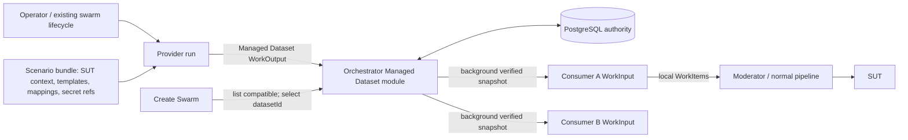

# Managed Test Data MVP Specification

Status: in progress; proposed requirements, implementation and canonical contract approval pending
Scope: Scenario Manager metadata, Orchestrator Managed Dataset module and Worker SDK adapters

## Decision required

Approve a PostgreSQL-backed Managed Dataset MVP in which one provider run
creates a Dataset and zero or many consumer swarms select it explicitly.
Consumers dispatch reusable records from verified local snapshots through the
existing `WorkInput -> WorkItem -> WorkOutput` pipeline.

The design replaces Redis-style Dataset dependencies without copying Redis
list semantics. Records are immutable, shared and reusable. There is no pop,
depletion, use count, exclusive checkout, outcome-driven invalidation or
automatic provider lifecycle.

## Goal

Keep renewable synthetic SUT data available for continuous test traffic while
keeping PostgreSQL, Orchestrator and credential-provider calls off the measured
request path.

```text
provider WorkInput -> normal provider pipeline -> provider WorkOutput -> Managed Dataset
Managed Dataset snapshot -> consumer WorkInput -> normal consumer pipeline -> SUT
```

## Hard rules

| Rule | Requirement |
|---|---|
| Normal worker I/O | Managed Dataset adapters implement existing `WorkInput` and `WorkOutput`; no Dataset-specific RabbitMQ lane is added. |
| Explicit configuration | Every adapter and setting is explicit under its adapter-specific block. Missing or unsupported values fail before provisioning. |
| One creator | One provider run creates one Managed Dataset per Managed Dataset output binding. A worker-process restart keeps that provider-run identity; a new provider run gets a new identity and Dataset. |
| Explicit consumers | Create Swarm requires one exact `datasetId` for each consumer `bindingRef`. A run stays pinned to it. There is no alias following, substitution or fallback. |
| Shared records | Records are immutable and reusable by concurrent consumers. The scenario owner MUST confirm that repeated concurrent use is safe under the SUT contract. |
| Local measured path | Selection, validity checks and claim copying are local. Snapshot refresh, refill and persistence are background/control-plane work. |
| PostgreSQL authority | PostgreSQL owns records, grants, receipts, revisions and background-work leases. Redis is not an authority. |
| No provider automation | The Dataset module never starts, stops, replaces, fails over or reconciles a provider swarm. |
| No generic reconciliation | MVP never infers record state from a SUT result and never corrects, revalidates, deprovisions or retires SUT objects. |
| Secrets by reference | Scenario bundles may contain SUT context, templates and mappings. They contain secret references, never secret values. |
| No fallback | Invalid, stale, unavailable or mismatched configuration fails explicitly. PocketHive never switches Dataset, adapter, provider or snapshot implicitly. |

## Supported MVP

- One immutable provider identity and zero or many consumers per Managed
  Dataset.
- Explicit SUT-compatible Dataset listing and selection during Create Swarm.
- `SHARED` allocation and deterministic `ROUND_ROBIN` local selection.
- Non-expiring and expiring records.
- Proactive refill to fixed minimum, target and maximum levels.
- Durable idempotent grants and receipts with stale-grant recovery.
- Verified immutable local snapshots with atomic replacement.
- Replica-safe Orchestrator background work using PostgreSQL leases and
  fencing.
- A small deterministic Selection Claim needed for end-of-pipeline expiry
  safety.

## Out of scope

- Record use counts, queue/pop semantics, bounded-use records, one-use records
  and exclusive checkout.
- SUT-outcome invalidation, SUT reconciliation, correction, revalidation,
  deprovisioning and outcome-driven retirement.
- Multiple providers, provider transfer, automatic provider start or failover,
  and live consumer rebinding.
- Sensitive records or secrets in Dataset records.
- Active-active multi-region operation and application-owned PostgreSQL HA.
- MVP consumption verdicts, qualification evidence, evidence frames, approval
  workflows, window mathematics, and HiveGate or HiveMind coupling. These are a
  future milestone and must not gate MVP provider or consumer traffic.

## Canonical terms

| Term | Status | Meaning | Not the same as | Source | Allowed shorthand |
|---|---|---|---|---|---|
| `WorkInput` | EXISTING | Worker SDK adapter that supplies immutable `WorkItem`s to a worker. | SUT traffic pacing. | Worker SDK | None |
| `WorkOutput` | EXISTING | Worker SDK adapter that publishes or persists a worker result. | A Dataset provider workflow. | Worker SDK | None |
| `Dataset Space` | PROPOSED | SUT-scoped authoring namespace containing versioned Dataset definitions and access policy. | Runtime record storage. | SUT/Dataset model | None |
| `Scenario Binding` | PROPOSED | Validated link between scenario, SUT Environment, Dataset Space, schema, policy and access versions. Runtime uses a frozen snapshot. | A provider dependency. | SUT/Dataset model | None |
| `Managed Dataset` | PROPOSED | Orchestrator-owned runtime record set created by one provider run and readable by many compatible consumer bindings. | A Redis list or work queue. | This specification | `Dataset` after first use |
| `Managed Dataset Selection Claim` | PROPOSED | Small deterministic `WorkItem` metadata identifying the selected binding, Dataset revision, record and validity. | Consumption evidence or security attestation. | This specification | `Selection Claim` after first use |

The architecture proposal remains authoritative for `SUT Environment`,
`Dataset Space` and `Scenario Binding`. This specification owns proposed
Managed Dataset runtime rules.

## Ownership

| Concern | Owner | Must not own |
|---|---|---|
| Dataset definitions, schema and binding requirements | Scenario Manager | Runtime records or refill execution |
| Candidate listing, admission and frozen run configuration | Orchestrator | Automatic Dataset or provider selection |
| Records, grants, receipts, revisions, availability and leases | Orchestrator Managed Dataset module | Swarm lifecycle or SUT business logic |
| Provider lifecycle | Operator and existing swarm lifecycle | Managed Dataset module |
| SUT context, templates, mappings and secret references | Scenario bundle and existing resolution flow | Managed Dataset records |
| Local snapshot, dispatch, selection and expiry guard | Managed Dataset `WorkInput` and Worker SDK | Durable authority or SUT traffic pacing |
| SUT traffic pacing | Moderator | Dataset supply or refill demand |
| PostgreSQL availability, replication, backup and recovery | Deployment infrastructure | Application fallback logic |

## Architecture


```mermaid
flowchart LR
  OP["Operator / existing swarm lifecycle"] --> P["Provider run"]
  B["Scenario bundle: SUT context, templates, mappings, secret refs"] --> P
  P -->|"Managed Dataset WorkOutput"| MD["Orchestrator Managed Dataset module"]
  MD <--> PG[("PostgreSQL authority")]
  CS["Create Swarm"] -->|"list compatible; select datasetId"| MD
  MD -->|"background verified snapshot"| C1["Consumer A WorkInput"]
  MD -->|"background verified snapshot"| C2["Consumer B WorkInput"]
  C1 -->|"local WorkItems"| M["Moderator / normal pipeline"]
  M --> SUT["SUT"]
```

The measured path starts when a consumer selects a local record. It performs
no PostgreSQL, Orchestrator, Scenario Manager or credential-provider call.

## Dataset creation and selection

Provider admission creates the Managed Dataset before provider workers start.
Creation is idempotent on
`providerSwarmId + providerRunId + providerBindingRef`. Repeating the same
request and contract returns the same `datasetId`; changed content fails. A
new provider run creates a new `providerRunId` and `datasetId`.

The Dataset stores immutable provider swarm, run and binding provenance plus
the frozen SUT Environment, Dataset definition, schema and policy versions.
Provider ownership never transfers.

For each consumer binding, Create Swarm lists Datasets whose frozen SUT,
Dataset definition, schema and access contract match. The operator supplies:

```yaml
datasetSelections:
  - bindingRef: inputCards
    datasetId: cards-provider-run-20260805
```

Both fields are required. Orchestrator revalidates the exact Dataset and
freezes its id into the run. Only `READY` candidates can be admitted;
`DEGRADED` and `UNAVAILABLE` candidates remain visible with reason codes.
Different bindings may select the same Dataset.

## Worker I/O contract

The examples below are normative for nesting and illustrative for names. M0
must add the enum values and closed settings schemas to the canonical worker
I/O contracts and capability manifests.

The first provider bee obtains refill grants through its input adapter:

```yaml
role: provider-source
config:
  inputs:
    type: MANAGED_DATASET_REFILL
    managedDatasetRefill:
      bindingRef: refillCards
      batchSize: 100
  outputs:
    type: RABBITMQ
```

The terminal provider bee persists mapped results through a separate output
adapter:

```yaml
role: provider-store
config:
  inputs:
    type: RABBITMQ
  outputs:
    type: MANAGED_DATASET
    managedDataset:
      bindingRef: refillCards
```

Both `bindingRef` values resolve the same provider binding. Orchestrator
injects its created `datasetId` into both runtime adapter blocks. Work between
the first and terminal bees follows normal PocketHive topology. The bundle's
provider binding points to the SUT template and typed result mapping.

A consumer declares its dispatch trigger under the adapter-specific block:

```yaml
role: dataset-source
config:
  inputs:
    type: MANAGED_DATASET
    managedDataset:
      bindingRef: inputCards
      ratePerSec: 500
  outputs:
    type: RABBITMQ
```

Create Swarm injects the selected `datasetId` into
`config.inputs.managedDataset.datasetId` in the frozen runtime configuration.
It is runtime materialisation, not an authoring default.

`ratePerSec` controls how quickly `WorkInput` supplies `WorkItem`s. It does not
consume records and is not refill demand. Moderator remains responsible for
SUT traffic pacing.

Adapter settings live only in the bee blocks above. Dataset definition,
schema, lifecycle, supply and capacity policy live once in the versioned
provider Scenario Binding resolved by `bindingRef`. A consumer Scenario Binding
contains compatibility and `READ` requirements only; it never repeats or
overrides provider policy. The frozen Managed Dataset stores the resolved
provider policy.

Supply fields are closed and explicit:

| Field | Rule |
|---|---|
| `allocation` | Required MVP value `SHARED` |
| `selection` | Required MVP value `ROUND_ROBIN` |
| `minimumReady`, `targetReady`, `maximumReady` | Required non-negative integers satisfying the stated invariant |
| `replacementHeadroom` | Required non-negative integer; must be `0` for `NON_EXPIRING` |
| `lifecycle` | Required tagged union: `NON_EXPIRING`, or `EXPIRING` with `renewalLeadTime` |
| `maximumExpiryCohort` | Required positive integer for `EXPIRING`; forbidden for `NON_EXPIRING` |
| capacity timings and limits | Required explicit values; no defaults, clamping or auto-tuning |

## Safety invariants

### Counts and validity

- `0 <= minimumReady <= targetReady <= maximumReady`.
- A record is **live** when its immutable commit and schema are valid and it is
  either `NON_EXPIRING` or its `usableUntil` is later than authority time.
- A record is **renewal-ready** when it is live and either non-expiring or its
  `usableUntil` is later than `authorityTime + renewalLeadTime`.
- `activeGrantedSlots` count unexpired grant items not yet completed or stale.
- For expiring data,
  `maximumStored = maximumReady + replacementHeadroom`; old live records and
  their replacements may coexist only within this bound.

### Refill

Refill starts proactively when
`renewalReady + activeGrantedSlots < targetReady`. Records enter the refill
deficit before expiry because they stop being renewal-ready at the renewal
lead boundary.

```text
deficit = max(0, targetReady - renewalReady - activeGrantedSlots)

maximumGrant = min(
  deficit,
  maximumReady - renewalReady - activeGrantedSlots,
  maximumStored - liveStored - activeGrantedSlots,
  configuredBatchSize
)
```

A non-positive `maximumGrant` creates no work. Counts and grant creation occur
in one bounded PostgreSQL transaction.

For expiring data, admission requires
`replacementHeadroom >= maximumExpiryCohort`. It also requires a positive
refill window and enough declared provider capacity:

```text
refillWindow = renewalLeadTime - refillCycleInterval - maximumProviderCompletionTime
providerCapacityRecordsPerSecond * refillWindow >= maximumExpiryCohort
```

### Idempotency and stale grants

- A grant request has a stable idempotency key. Exact replay returns the same
  grant; reuse with changed content fails without mutation.
- Each grant item has one stable provider-operation key and one receipt.
  Exact receipt replay returns the stored result; changed replay fails.
- A receipt commits one immutable valid record. A provider failure records no
  record. MVP does not classify SUT outcomes or retire an existing record.
- A grant item not receipted by `grantExpiresAt` becomes `STALE` in a fenced
  transaction and releases its reserved slot. A late receipt is rejected.
  Recovery performs no SUT call and creates no reconciliation work.

## Selection Claim and snapshots

The Selection Claim is retained because an expiring item may wait in the normal
pipeline after source selection. M0 reserves shared header constant
`MANAGED_DATASET_SELECTION_CLAIM` with wire name
`ph.dataset.selection.claim`. Its value is closed, versioned JSON encoded once
when the snapshot is built; Managed Dataset items require it and other items do
not use it.

Each snapshot record carries a prebuilt immutable Selection Claim containing
only:

- contract version, `bindingRef`, `datasetId`, snapshot revision and record id;
- validity type `NON_EXPIRING`; or
- validity type `EXPIRING` with `usableUntil`.

For the same binding, snapshot revision and record, the claim is identical.
Dispatch copies the prebuilt claim into the normal `WorkItem`; it performs no
hashing, signing, remote call, acknowledgement or evidence write. It adds no
synchronous dependency: per-item work is a field copy and the expiry comparison
already required for local selection. The claim is not proof of SUT correctness.
Normal workers preserve it with the `WorkItem`. The final SUT-calling boundary
rejects an expiring item when its local validity cannot cover the configured
maximum invocation duration.

Snapshot refresh is background work:

1. Fetch bounded, keyset-paged records at one PostgreSQL-backed revision.
2. Verify Dataset id, binding, revision, schema, page digests, whole-snapshot
   digest, record count, byte limit and validity horizon.
3. Build the next immutable view outside request threads.
4. Publish the complete view with one atomic reference replacement. Existing
   readers finish on the old immutable view.
5. On refresh failure, keep the last verified view only while its records
   remain locally safe. Never extend validity.

A consumer process starts traffic only after loading a verified snapshot. A
temporary control-plane failure does not stop an already admitted consumer
while its current snapshot remains safe.

## Continuous operation and HA

- `providerRunId` belongs to the logical swarm run, not a worker process.
  Worker replacement or restart receives the same id and resumes only its
  durable grants. An explicitly new provider run receives a new id and Dataset.
- Consumer runs remain pinned to their frozen `datasetId` across worker
  restarts. If that Dataset is unsafe, the run stops dispatch; it never selects
  another Dataset.
- Orchestrator replicas claim Dataset background work through PostgreSQL lease
  rows. Each successful acquisition increments a fencing token. Every
  background mutation compares the current token in the same transaction;
  work from an expired owner is rejected.
- PostgreSQL replication, failover, backup, restore and recovery objectives are
  infrastructure responsibilities. The application does not implement a
  database fallback.

Availability is a closed enum. Orchestrator evaluates authority-side state for
candidate admission. Each admitted consumer evaluates local state from its
snapshot and last authority observation; Orchestrator does not claim to know
local memory state.

| State | Orchestrator candidate rule | Admitted consumer rule | Behaviour |
|---|---|---|---|
| `READY` | At least `targetReady` records are renewal-ready and refill/storage checks are within limits. | A verified snapshot has at least `targetReady` records safe through the invocation horizon and authority state is current. | New admission and dispatch are allowed. |
| `DEGRADED` | At least `minimumReady` records are safe, but supply is below target or provider/refill/storage health is late within tolerance. | A verified snapshot has at least `minimumReady` safe records, but refresh or authority state is late, unknown or not `READY`. | New admission stops; this consumer continues dispatch. |
| `UNAVAILABLE` | Fewer than `minimumReady` records are safe, integrity or authorisation fails, or the last authority observation exceeds tolerance. | Fewer than `minimumReady` local records are safe, snapshot integrity or authorisation fails, or records cannot cover the invocation horizon. | New admission stops; only a consumer whose own state is `UNAVAILABLE` stops dispatch. |

For an existing consumer, local safety is decisive during a temporary
control-plane outage. A central status change alone does not revoke a still
valid immutable snapshot. An explicit operator stop still stops the run.

Administrative qualification evidence is not an MVP runtime dependency. A
future evidence expiry may block new admission, but MUST NOT unexpectedly stop
already admitted traffic that remains safe under the frozen contract.

## Capacity and overload protection

Admission fails before provisioning when any of these is false:

- count thresholds and lifecycle fields are valid;
- expiring data has sufficient `replacementHeadroom` and provider replacement
  capacity;
- `1 <= batchSize <= maximumSupportedBatchSize` for the selected adapter;
- snapshot memory satisfies
  `2 * maximumSnapshotBytes + snapshotDecodeOverheadBytes <= snapshotMemoryBudgetBytes`;
  and
- configured dispatch, provider, PostgreSQL connection and storage limits fit
  the selected capability profile.

There are no unbounded Dataset queues. Refill grants and provider in-flight
items are capped. Snapshot refresh is single-flight and coalesces a later
request instead of queueing refresh tasks. Consumer dispatch has an explicit
in-flight bound; when downstream capacity is full it pauses through normal
backpressure rather than allocating more work or selecting alternate data.
Any normal RabbitMQ work queue used by the scenario must have explicit length
or byte limits. Overflow must signal pause/rejection; it must not silently drop
or reroute work.

Consumer `ratePerSec` is workload supply, not record-depletion demand. Refill
capacity is driven by expiry/replacement cohorts only.

Required metrics and alerts are:

- live, renewal-ready, stored, deficit, active-grant and stale-grant counts;
- replacement headroom, refill request/completion rate and refill latency;
- snapshot revision, age, records, bytes, refresh failures and time-to-unsafe;
- dispatch offered, accepted, paused and rejected, plus in-flight depth;
- lease acquisition, fencing rejection, transaction latency and database
  errors; and
- availability state and closed reason code.

Alerts fire before headroom, snapshot validity or bounded queue capacity is
exhausted. Metrics and logs contain ids and counts, never record values or
secrets.

## Security

- Authorise Dataset, binding, SUT and run scope on every control-plane call.
- Validate record schema, sizes, cursors, ids and template references as
  hostile input.
- Resolve SUT endpoints and secret references through existing approved paths
  before traffic starts. Never store resolved credentials in records,
  snapshots, claims, logs or metrics.
- Use `correlationId` for tracing and distinct idempotency keys for mutation
  replay.

## Delivery plan

| Milestone | Deliverable | Exit |
|---|---|---|
| M0 — contracts | Closed Dataset, Create Swarm selection, adapter config, snapshot, grant, receipt, claim, availability and capability schemas | Canonical owners and team approve before code starts |
| M1 — authority | PostgreSQL records, revisions, grants, receipts, leases, fencing and bounded APIs | Transaction, concurrency, restart and replica tests pass |
| M2 — adapters | Refill `WorkInput`, Dataset `WorkOutput`, consumer `WorkInput`, local snapshots and expiry guard | Shared provider/consumer scenario passes functional and overload tests |
| M3 — continuous-use release | Metrics, alerts, security and 24-hour resilience qualification | Refill, expiry, restart, outage and soak gates pass |
| Future — evidence | Optional qualification, consumption evidence, MCP views, approvals and governance integration | Separate design with no bootstrap cycle or measured-path dependency |

## Acceptance criteria

The MVP is releasable only when tests through official product APIs prove:

1. invalid thresholds, lifecycle fields, headroom, batch size, memory or refill
   capacity fail before provisioning;
2. provider refill input and Dataset output are separate adapters on the first
   and terminal bees, and the consumer input requires `bindingRef` and
   `ratePerSec` under `managedDataset`;
3. concurrent consumer swarms reuse the same immutable records without
   depletion, checkout, use counts or cross-consumer mutation;
4. repeated provider create/grant/receipt requests are idempotent and changed
   replay fails;
5. stale grants recover capacity, reject late receipts and perform no SUT
   reconciliation;
6. expiring cohorts refill before expiry without exceeding `maximumReady` or
   `maximumStored` during replacement overlap;
7. a provider worker restart preserves `providerRunId`, while a new provider
   run creates a new Dataset;
8. two Orchestrator replicas cannot both mutate background state under one
   lease, and stale fencing tokens are rejected;
9. a consumer stays on its exact `datasetId`; Dataset or control-plane failure
   never causes substitution;
10. a fully verified snapshot replaces the old view atomically, a failed
    refresh preserves only a still-safe view, and invalid or expired records do
    not reach the SUT boundary;
11. packet-level dependency tests show no PostgreSQL, Orchestrator, Scenario
    Manager or credential-provider calls on the measured path;
12. `READY`, `DEGRADED` and `UNAVAILABLE` transitions match this specification,
    including safe continuation during a temporary control-plane outage;
13. overload tests reach configured bounds, apply backpressure and keep queue,
    memory and transaction use within limits; and
14. a 24-hour soak covers provider and consumer process restarts, two expiry
    and refill cycles, one temporary control-plane outage and one PostgreSQL
    failover exercise supplied by the deployment environment.

## Remaining risks

- Shared reuse is safe only when the scenario's SUT contract tolerates
  concurrent repeated use. The MVP does not detect a false declaration.
- A stale provider operation may leave an unrecorded SUT object. The MVP
  deliberately does not reconcile it.
- PostgreSQL HA and the proposed contracts are not yet implemented or
  qualified.
- The Selection Claim supports local expiry safety and diagnostics; it does not
  prove end-to-end consumption or resist a malicious worker.

## References

- [PocketHive architecture](../ARCHITECTURE.md)
- [Scenario contract](../scenarios/SCENARIO_CONTRACT.md)
- [Worker SDK](../../common/worker-sdk/README.md)
- [SUT, Dataset Space and Simulation Program model](../architecture/sut-dataset-simulation-model.md)
- [PocketHive correlation and idempotency](../correlation-vs-idempotency.md)
- [AWS: make mutating operations idempotent](https://docs.aws.amazon.com/wellarchitected/latest/framework/rel_prevent_interaction_failure_idempotent.html)
- [PostgreSQL explicit locking](https://www.postgresql.org/docs/current/explicit-locking.html)
- [PostgreSQL high availability, load balancing and replication](https://www.postgresql.org/docs/current/high-availability.html)
- [Kubernetes leases and leader election](https://kubernetes.io/docs/concepts/architecture/leases/)
- [Java 21 `AtomicReference`](https://docs.oracle.com/en/java/javase/21/docs/api/java.base/java/util/concurrent/atomic/AtomicReference.html)
- [RabbitMQ flow control](https://www.rabbitmq.com/docs/flow-control)
- [AWS: fail fast and limit queues](https://docs.aws.amazon.com/wellarchitected/latest/framework/rel_mitigate_interaction_failure_fail_fast.html)
- [AWS: rely on the data plane during control-plane failure](https://docs.aws.amazon.com/wellarchitected/latest/framework/rel_withstand_component_failures_avoid_control_plane.html)
