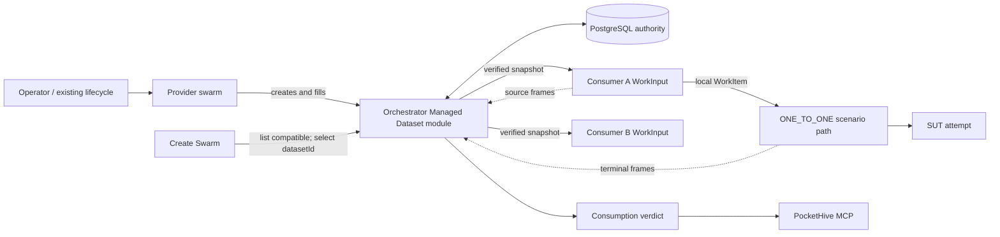

# Managed Test Data MVP Specification

Status: proposed requirements; implementation and canonical contract approval pending
Scope: Scenario Manager metadata, Orchestrator Managed Dataset module, Worker SDK adapters, PocketHive MCP evidence

## Decision required

Approve a PostgreSQL-backed Managed Dataset MVP that:

- uses PocketHive's existing `WorkInput -> WorkItem -> WorkOutput` pipeline;
- keeps reusable synthetic records available through bounded refill;
- reads from verified local snapshots on the measured path; and
- proves, through PocketHive Model Context Protocol (MCP), whether a qualified
  one-to-one scenario path consumed the intended Dataset correctly.

The main trade-off is deliberate: one provider run owns each Managed Dataset,
while any number of compatible consumer swarms may share it. Consumers select
an existing `datasetId`; they never configure or replace its provider.
Automatic provider lifecycle, general topology accounting, SUT reconciliation,
sensitive data, and high-availability qualification are deferred.

## Goal

Provider swarms create reusable synthetic records for a System Under Test
(SUT). Independent consumer swarms use those records continuously without
calling Orchestrator, PostgreSQL, or a credential provider on the measured
request path.

## Hard rules

| Rule | Requirement |
|---|---|
| Existing pipeline | Managed Dataset I/O uses the canonical `WorkItem` and normal worker lifecycle. No Dataset-specific RabbitMQ lane. |
| Explicit adapters | Every worker selects one input adapter and one output adapter. Existing logical multi-port topology remains supported. |
| No fallback | Missing, stale, unsupported, or mismatched data fails explicitly. Never substitute another Dataset, adapter, provider, snapshot, CSV, or Redis source. |
| Runtime authority | Orchestrator's Managed Dataset module owns runtime records in PostgreSQL. Scenario Manager owns authoring metadata only. |
| Local measured path | Consumer selection and validity checks are local. Refresh and evidence emission run in bounded background bulkheads. |
| Simple ownership | A provider run creates one Managed Dataset for each Managed Dataset output. The Dataset stores that exact provider provenance. |
| Explicit selection | Create Swarm lists SUT-compatible Managed Datasets. The operator selects one exact `datasetId` for each consumer binding; PocketHive never auto-selects or substitutes one. |
| Shared use | Zero or many compatible consumer bindings may read the same Managed Dataset. Consumers neither clone nor mutate it. |
| Bounded proof | MVP consumption evidence supports `ONE_TO_ONE` paths only. Unsupported topology fails admission. |
| Human approval | Qualification Evidence requires an identified human approval. AI, RAG, HiveMind, and MCP may present evidence but cannot approve it. |
| Data classification | MVP records are synthetic, non-secret, size-bounded, and safe for the existing `WorkItem` path. |
| Contract first | Implementation waits for approved closed schemas and canonical REST/tool contracts. |

## Supported MVP

- Reusable `SHARED` records with deterministic round-robin selection.
- Fixed `minimumReady`, `targetReady`, and `maximumReady` supply levels.
- Expiring and non-expiring records.
- Proactive bounded refill and expiry-safe snapshot rotation.
- Durable grants, receipts, idempotency, retention, and restart recovery.
- One immutable provider identity per Managed Dataset and many consumers per
  Dataset.
- Explicit compatible-Dataset selection through Create Swarm.
- Windowed one-to-one consumption evidence through PocketHive MCP.
- Replica-safe background ownership using PostgreSQL leases and fences.

## Out of scope

- Automatic provider start, stop, discovery, or substitution.
- Multiple providers, provider transfer, or live rebinding for one Managed
  Dataset.
- Requiring a Simulation Program.
- Generic SUT reconciliation, correction, revalidation, or deprovision.
- Live supply-target changes.
- Fan-out, filtering, joins, sampling, or multiple terminal boundaries in an
  evidence-qualified path.
- Exclusive or one-use records, sensitive data, Redis authority, and
  multi-output interceptors.
- Active-active Orchestrator, backup-restore qualification, and multi-region
  operation.
- Proof of SUT business correctness or proof against a malicious worker.

## Canonical terms

| Term | Status | Meaning |
|---|---|---|
| `Dataset Space` | PROPOSED | SUT-scoped authoring namespace containing versioned Dataset definitions and access policy. It is not the runtime record store. |
| `Scenario Binding` | PROPOSED | Validated link between scenario, SUT Environment, Dataset Space, Dataset, schema, policy, and access versions. Runtime uses an immutable snapshot. |
| `Managed Dataset` | PROPOSED | Orchestrator-owned shared runtime record set created by one exact provider run from one resolved Dataset definition. It stores immutable provider provenance and may serve many consumer bindings. |
| `Qualification Evidence` | PROPOSED | Approved, expiring record that one exact build and workload met the required safety and capacity profile. |
| `TrustedClock` | PROPOSED | Explicit calibrated clock used by SDK expiry guards. |
| `Managed Dataset Selection Claim` | PROPOSED | Digest-protected `WorkItem` metadata identifying the binding, record revision, validity, and selection event. |
| `Managed Dataset Evidence Frame` | PROPOSED | Low-frequency cumulative SDK report for one worker process epoch and binding. |
| `Managed Dataset Consumption Evidence` | PROPOSED | Orchestrator verdict for one swarm, run, binding, frozen Dataset, and exact UTC window. |

The architecture proposal remains authoritative for `SUT Environment`,
`Dataset Space`, and `Scenario Binding` meanings. This specification owns the
Managed Dataset runtime and consumption-evidence proposal.

## Ownership

| Concern | Owner | Must not own |
|---|---|---|
| Dataset definitions and binding requirements | Scenario Manager | Runtime records, Dataset selection, or refill execution |
| Compatible-Dataset listing, admission, and run snapshot | Orchestrator | Automatic Dataset selection or live alias resolution |
| Managed Datasets, provider provenance, availability, records, grants, frames, and verdicts | Orchestrator Managed Dataset module | Swarm lifecycle or SUT business logic |
| Provider lifecycle | Operator or existing swarm lifecycle | Dataset module |
| SUT request and result mapping | Provider scenario bundle | Generic Orchestrator workflow language |
| Local selection, guards, counters | Consumer adapter and Worker SDK | Durable authority |
| Agent-facing evidence | PocketHive MCP | Verdict recomputation or fallback evidence |
| Approval and policy | Human approver; HiveGate when governed | Advisory AI or MCP |

## Architecture


```mermaid
flowchart LR
  OP["Operator / existing lifecycle"] --> PROVIDER["Provider swarm"]
  PROVIDER -->|creates and fills| API["Orchestrator Managed Dataset module"]
  API <--> PG[("PostgreSQL authority")]
  CREATE["Create Swarm"] -->|list compatible; select datasetId| API
  API -->|verified snapshot| C1["Consumer A WorkInput"]
  API -->|verified snapshot| C2["Consumer B WorkInput"]
  C1 -->|local WorkItem| PATH["ONE_TO_ONE scenario path"]
  PATH --> SUT["SUT attempt"]

  C1 -. source frames .-> API
  PATH -. terminal frames .-> API
  API --> VERDICT["Consumption verdict"]
  VERDICT --> MCP["PocketHive MCP"]
```

The Dataset module never invokes the SUT. Provider scenario bundles own SUT
templates, resolved `sut`/`vars` context, private `authRef` selection, and typed
result mapping.

## Dataset and binding contract

A Scenario Binding declares Dataset requirements, not a runtime Dataset or
provider. Provider admission creates and persists one Managed Dataset per
`MANAGED_DATASET` output before workers start.

Managed Dataset creation is idempotent for
`providerSwarmId + providerRunId + providerBindingRef`. Repeating the same
request with the same contract returns the existing `datasetId`; changed
content fails. A new provider run creates a new Dataset. Dataset ids are
globally unique, tombstoned after retirement, and never reused.

Each Managed Dataset stores immutable Dataset definition/contract/schema,
exact SUT Environment, Dataset Space/version, storage profile, supply/access
policy, provider swarm/run/binding, and provider Qualification Evidence
identities and digests.

Only records, revisions, supply counters, availability, and operational reason
codes change during the Dataset lifetime. Provider identity never changes.

### Shared Dataset invariants

- One Managed Dataset has exactly one provider run and zero or many consumers.
- Multiple consumer bindings and swarms may select the same `datasetId`.
- Supply thresholds apply once to the shared Dataset, not once per consumer.
- Every consumer maintains its own bounded local snapshot and evidence scope.
- Consumers have read-only access; they cannot refill, retire, or rebind it.
- A consumer run remains pinned to its selected `datasetId`. A different
  Dataset requires a new run admission.

### Create Swarm selection

For each Managed Dataset input, Create Swarm lists candidates bound to the
selected SUT Environment. The shared validator requires exact Dataset
Space/version, definition, record schema, storage profile, and `READ` access.
Availability and reason codes allow unavailable candidates to appear disabled.

The operator must explicitly select one candidate:

```yaml
datasetSelections:
  - bindingRef: inputCards
    datasetId: cards-run-20260804
```

Both fields are required. Each Managed Dataset input has exactly one selection;
other inputs have none. Bindings may share a Dataset. There is no default.

The list is not admission authority. Orchestrator resolves the `datasetId`
again, verifies compatibility, authorisation, qualification, and availability,
then freezes Dataset, contract, provider, and both qualification digests into
the run snapshot. Runtime never follows a mutable alias.

M0 must add the candidate read model and `datasetSelections` to the canonical
Create Swarm contract before implementation.

The run snapshot also freezes scenario, SUT, Dataset Space, schema, policy,
access, binding, topology, capability, plan, workload, worker image, SDK, and
resolved Dataset I/O digests and versions.

### Supply policy

| Field | Rule |
|---|---|
| `lifecycleMode` | Required: `NON_EXPIRING` or `EXPIRING` |
| `minimumReady` | Required, non-negative |
| `targetReady` | Required and `>= minimumReady` |
| `maximumReady` | Required and `>= targetReady` |
| `renewalLeadTime` | Required for `EXPIRING`; forbidden for `NON_EXPIRING` |
| `selection` | MVP value `ROUND_ROBIN` |
| `allocation` | MVP value `SHARED` |
| retention limits | Explicit row, byte, receipt, grant, and tombstone limits; no defaults |

Records are immutable. An expiring result must remain usable beyond commit by
at least `renewalLeadTime`. Otherwise commit fails and releases the grant.

### Dataset availability

The Dataset module combines provider liveness, refill progress, safe supply,
storage health, and provider qualification into one required Dataset
availability state. Consumers use this state and do not independently monitor
providers.

| Availability | Selection rule |
|---|---|
| `READY` | New admission and selection are allowed |
| `DEGRADED` | Existing consumers may select while records remain safe; new admission is rejected |
| `UNAVAILABLE` | Admission and selection stop |

Closed reason codes distinguish late refill, provider loss, supply below
`minimumReady`, invalid provider qualification, storage failure, contract
integrity failure, and lost safety horizon. An expiring Dataset may remain
`DEGRADED` after provider loss while its records remain safe. A non-expiring
Dataset does not require a running provider after safe supply has committed.
There is no provider substitution.

### Worker I/O

```yaml
# Provider scenario authoring: this output creates the Managed Dataset.
inputs:
  type: MANAGED_DATASET_REFILL
  bindingRef: refillCards
outputs:
  type: MANAGED_DATASET
  bindingRef: refillCards

# Consumer scenario authoring: Create Swarm supplies the concrete datasetId.
inputs:
  type: MANAGED_DATASET
  bindingRef: inputCards
```

Adapters are explicit and have no defaults. Unsupported values fail typed
configuration binding. Adapter state appears through existing `workIn` and
`workOut` status fields.

## Qualification and time

### Qualification Evidence

Qualification Evidence is immutable. It contains identity, schema/payload
digest, creation/expiry, state `ACTIVE | SUPERSEDED | REVOKED | EXPIRED`;
image, SDK, Orchestrator, contract, environment, binding, topology, profile,
plan, and workload digests; qualified load and safety results; and required
`approvalMode: DIRECT_HUMAN | HIVEGATE`, approver, and approval reference.

Provider and consumer qualifications are separate uses of the same contract:

- provider evidence covers Dataset creation, refill, storage, and capacity; the
  Managed Dataset stores its explicit reference; and
- consumer evidence covers images, topology, rate, SDK, clock, and accounting.

Dataset creation validates provider evidence; consumer admission validates
both references. Invalid provider evidence makes the Dataset `UNAVAILABLE`.
Invalid consumer evidence blocks only that run.

### TrustedClock

`CALIBRATED_SYSTEM_CLOCK` is the only MVP adapter. Its configuration requires
a time-health source, maximum sample age, maximum skew, maximum uncertainty,
and sample interval. Nothing defaults and there is no clock fallback.

| State | Rule | Behaviour |
|---|---|---|
| `SYNCED` | Sample is current and offset plus uncertainty is within the configured bound | Selection and invocation may continue |
| `STALE` | Sample is older than the configured maximum age | Refresh may download, but activation, selection, and invocation stop |
| `UNSAFE` | No valid sample, unsynchronised source, backwards time, or excessive skew | The affected consumer stops selection and invocation |

Absolute expiry uses:

```text
latestPossibleNow = calibratedWallTime + effectiveUncertainty
```

Elapsed waits and backoff use a monotonic clock.

## WorkItem Selection Claim

Managed Dataset items reserve two proposed global headers:

| Shared constant | Header | Value |
|---|---|---|
| `MANAGED_DATASET_SELECTION_CLAIM` | `ph.dataset.selection.claim` | RFC 8785 canonical JSON |
| `MANAGED_DATASET_SELECTION_CLAIM_DIGEST` | `ph.dataset.selection.claim-digest` | SHA-256 of the UTF-8 canonical claim bytes |

Both are required together for Managed Dataset items and absent from other
items. M0 must add the closed claim schema and header pairing to the canonical
`docs/spec/` contracts before implementation.

The claim contains only:

- schema version, `selectionId`, binding and record-schema digests;
- Dataset id, record revision, record id;
- source worker instance, process epoch, and monotonic selection sequence;
- selected time; and
- explicit validity: `NON_EXPIRING` or `EXPIRING` with `usableUntil`.

It contains no record value, credential, provider response, or free-form text.
Every SDK hop parses the claim, validates the schema, recomputes the digest, and
preserves both original strings. Invalid, missing, changed, oversized, or
unknown-version claims fail before worker invocation.

`selectionId` is SHA-256 over RFC 8785 canonical JSON containing exactly
`bindingDigest`, `sourceWorkerInstanceId`, `sourceProcessEpoch`, and
`selectionSequence`.

Immediately before a SUT-calling worker, the SDK requires:

```text
usableUntil > latestPossibleNow + maximumWorkerInvocationDuration
```

## Producer runtime

1. Provider admission creates or idempotently resolves the Managed Dataset for
   each provider output before workers start.
2. The refill adapter requests only that Dataset's deficit to `targetReady`.
3. PostgreSQL atomically grants bounded slots. Active grants count against
   `maximumReady`.
4. The provider executes its scenario-defined SUT request with a stable
   idempotency key.
5. The output adapter records one result:

| Result | Effect |
|---|---|
| `COMPLETED` | Commit one valid immutable record and durable receipt |
| `FAILED` | Prove no usable effect and release the reservation |
| `UNCERTAIN` | Retain bounded capacity; do not retry blindly |

6. Replaying the same idempotency key and payload returns the prior result.
   Reusing the key with different content fails with no mutation.
7. Failure, unusable-result, and uncertainty budgets open the refill circuit.
   Nothing starts a mutation storm or automatic reconciliation.

## Consumer runtime

1. Orchestrator materialises the explicitly selected `datasetId` into the
   consumer's frozen runtime I/O configuration.
2. A background task downloads a bounded keyset-paged snapshot as of one
   revision.
3. The adapter validates page digests, record schema, binding digest, and
   `refreshBy` before activation.
4. It builds the next immutable view off-thread and swaps atomically.
5. Request threads select locally and create the Selection Claim.
6. A failed refresh keeps the current view only while every selected record
   remains safe. It never extends validity.
7. Restart rehydrates a current safe snapshot from PostgreSQL before traffic
   resumes.

| Local consumer state | Meaning |
|---|---|
| `READY` | Selected Dataset is `READY` or safely `DEGRADED`; local snapshot and clock are safe |
| `UNAVAILABLE` | Dataset, local snapshot, schema, authorisation, clock, or safety guard prevents selection |

Consumer state never changes Dataset ownership. Failure in one consumer does
not mutate the shared Dataset or another consumer's snapshot.

## Consumption evidence

### Admission scope

A consumer binding requiring proof declares:

```yaml
consumptionEvidence:
  accountingPolicy: ONE_TO_ONE
```

The frozen path must have one Managed Dataset source, preserve exactly one
Selection Claim through the path, and have one terminal SUT-attempt boundary.
Fan-out, filtering, joins, sampling, multiple terminal boundaries, or live
topology changes fail evidence admission. This restriction applies to MVP
evidence only, not PocketHive topology in general.

### Evidence Frames

Only the Dataset source and terminal SUT-attempt boundary emit Evidence Frames.
Intermediate SDK hops validate and preserve the claim without accounting.

Measured threads update in-memory counters only. A separate bounded worker
flushes cumulative frames. Evidence emission never blocks selection, RabbitMQ
acknowledgement, worker invocation, or a SUT call.

Each frame includes:

- frame identity, sequence, idempotency key, payload digest, emission time;
- swarm, run, role, worker instance, process epoch, image, and SDK identity;
- boundary `DATASET_SOURCE | SUT_ATTEMPT`, binding, Dataset, snapshot,
  topology, accounting policy, and bucket identity;
- observed interval, `completeThrough`, and TrustedClock state; and
- the boundary's cumulative populations: source `selected`; terminal
  `sutStarted`, `rejectedExpired`, `rejectedInvalid`, and
  `duplicateObserved`.

Each population carries `count` and `tokenSum256`, the unsigned modular sum of
Selection Claim ids. It detects accidental loss, duplication, or substitution
without storing record ids, but not a malicious worker.

Frames are cumulative per process epoch. Exact replay is idempotent; changed
replay, sequence gaps, counter resets, identity changes, or decreasing
`completeThrough` invalidate the epoch. Orchestrator subtracts frames to derive
window populations.

M0 must add a closed Evidence Frame schema and exact ingestion contract before
implementation.

### Window finalisation

The frozen manifest and runtime timeline define expected source/terminal
workers and epochs. MCP cannot override them; intermediate frames are rejected.

Orchestrator checks both count and `tokenSum256` across the two boundaries:

```text
selectedDuringWindow + inFlightAtStart
  = sutStartedDuringWindow
  + terminalRejectedDuringWindow
  + inFlightAtEnd
```

A final window is bucket-aligned, has unchanged binding/topology, continuous
expected epochs through `windowEnd`, elapsed evidence lag, qualified frames,
and `SYNCED` clocks.

| Verdict | Meaning |
|---|---|
| `CONFORMING` | Final window; qualified source and terminal frames complete; all scope, claim, clock, and population checks pass; at least one selection occurred; no invalid, expired, missing, or duplicate terminal item |
| `NON_CONFORMING` | Complete evidence proves a contract violation |
| `INSUFFICIENT_EVIDENCE` | Window is not final or evidence/scope is incomplete, stale, unqualified, inactive, or unsupported; never a pass |

Reason codes are a closed enum. They must distinguish at least window not
finalised, missing source or terminal epoch, sequence gap, topology change,
clock/qualification failure, no active consumption, no selection,
binding/claim failure, expiry at SUT, population mismatch, and duplicate
terminal attempt.

### Product API and MCP

M0 must add these proposed contracts to the canonical owners:

- `POST /api/managed-datasets/evidence-frames` — service-authenticated,
  idempotent frame ingestion;
- `GET /api/managed-datasets/consumption-evidence` — exact `swarmId`, `runId`,
  `bindingRef`, `windowStart`, and `windowEnd`; and
- `managed_dataset_consumption_evidence_get` — PocketHive MCP read-only facade
  with the same five required inputs.

MCP returns Orchestrator's verdict unchanged. It never recomputes or falls back
to logs, taps, RabbitMQ, metrics, or database reads. `CONFORMING` passes,
`NON_CONFORMING` fails, and `INSUFFICIENT_EVIDENCE` blocks.

Responses contain scope, verdict, reason codes, finalisation, counts/checks,
the frozen `datasetId`, provider and consumer Qualification Evidence digests,
and frame-set digest. They never contain raw records, claims, payloads,
credentials, or secrets.

## Capacity, persistence, and resilience

One versioned capability profile explicitly sets all polling, retry, timeout,
clock, grant, snapshot, memory, connection, evidence, retention, and row/byte
limits. Values do not default, clamp, or auto-tune.

Admission calculates aggregate demand across all consumers of each shared
Dataset and rejects
when any of these cannot fit:

- two snapshots plus decode/runtime overhead for every consumer replica;
- provider refill rate and in-flight work;
- largest expiry cohort inside its renewal window;
- PostgreSQL locks, connections, storage, evidence, and retention budgets; or
- Orchestrator control and journal reserves.

PostgreSQL is authoritative. Claim, commit, snapshot, frame, and retention
operations use bounded transactions, durable idempotency, leases, and fencing.
Hydration uses keyset pagination. Retention runs in small batches and never
deletes records protected by an active snapshot lease.

## Security and observability

- Authorise Dataset, binding, run, and evidence-window scope on every API.
- Treat ids, cursors, templates, and record fields as hostile input.
- Resolve SUT egress only through approved endpoints.
- Keep credentials in the existing private configuration path.
- Redact logs, metrics, journal, UI, MCP, and evidence.
- Expose readiness, refill circuit, snapshot age, provider progress, clock
  state, frame lag, and evidence verdict without exposing records.
- Use `correlationId` for tracing and separate idempotency keys for mutation
  replay.

## Delivery plan

| Milestone | Deliverable | Exit |
|---|---|---|
| M0 — contracts | Closed schemas for Dataset creation, compatible-Dataset listing, Create Swarm selection, runtime configs, claims, frames, verdicts; canonical REST and MCP contracts; capability profile | Contract owners and team approve; implementation may start |
| M1 — authority | PostgreSQL records, grants, receipts, snapshots, frames, retention, authorisation | Contract, transaction, restart, and concurrency tests pass |
| M2 — worker I/O | Three adapters, local snapshots, Selection Claim guards, TrustedClock, background frames | Provider and consumer scenario proves bounded runtime behaviour |
| M3 — product proof | MCP/UI evidence views and operational status | Security, resilience, consumption-evidence, and performance gates pass |

## Acceptance criteria

The MVP is releasable only when:

1. unsupported or incomplete configuration fails before provisioning;
2. provider and consumer adapters use the normal PocketHive pipeline;
3. concurrent provider replicas cannot exceed one shared Dataset's `maximumReady`;
4. durable receipt and idempotency rules survive restart and ambiguous replies;
5. each Managed Dataset retains one immutable provider identity and is never
   rebound;
6. two consumer swarms can share one Dataset without cloning records,
   interfering with each other, or combining evidence scopes;
7. Create Swarm lists only compatible Datasets, requires explicit selection,
   and rejects stale or unavailable choices at admission;
8. consumer selection remains local and safe across refresh and restart;
9. invalid or expired Selection Claims fail before SUT invocation;
10. background evidence cannot slow or block the measured path;
11. Orchestrator returns the correct three-state verdict for loss, duplication,
   expiry, restart, late frames, and clean windows;
12. MCP returns that exact verdict and fails closed without the product API;
13. synthetic record content never appears in evidence or logs; and
14. capacity, security, replica-safety, and retention tests pass through
    official product APIs.

Required test families:

| Area | Minimum evidence |
|---|---|
| Contracts | Closed-field, enum, digest, candidate-selection, boundary, and generated-type tests |
| Refill | Concurrent grants, idempotent replay, uncertain effects, circuit, provider loss |
| Sharing | Two swarms select one Dataset; isolated snapshots, failures, authorisation, and evidence |
| Snapshots | Paging, digest, expiry, atomic swap, failed refresh, restart |
| Claims | Canonical JSON, digest, hop preservation, expiry guard, hostile input |
| Frames | Cumulative counters, token sums, replay conflict, gaps, restart epochs |
| Verdicts | Clean, missing, late, topology change, loss, duplicate, invalid, expired |
| Resilience | PostgreSQL timeout/deadlock/full disk, stale fences, clock loss |
| Security | Object scope, egress, redaction canaries, secret scan |
| Performance | Feature-off comparison, refill/expiry bursts, 24-hour soak |

Continuous-use qualification requires at least 24 hours, two expiry/refill
cycles, and one purge cycle. The candidate profile of 50,000 target records,
55,000 maximum, two consumer swarms, and 1,000 requests/second remains
unqualified until those tests pass.

## Risks and open gates

- Dataset Space and Scenario Binding are still proposed architecture.
- Canonical schemas, REST endpoints, MCP tool contract, and shared constants do
  not yet exist.
- The current deployment is not HA-qualified.
- `tokenSum256` is accidental-corruption evidence, not malicious-worker
  attestation.
- `ONE_TO_ONE` excludes valid complex scenarios from MVP proof; extending proof
  requires a separate accounting design.

## References

- [PocketHive architecture](../ARCHITECTURE.md)
- [Orchestrator REST contract](../ORCHESTRATOR-REST.md)
- [WorkItem envelope schema](../spec/workitem-envelope.schema.json)
- [SUT, Dataset Space, and Simulation Program model](../architecture/sut-dataset-simulation-model.md)
- [Scenario contract](../scenarios/SCENARIO_CONTRACT.md)
- [Worker capability catalogue](../architecture/workerCapabilities.md)
- [Correlation and idempotency](../correlation-vs-idempotency.md)
- [RFC 8785 JSON Canonicalization Scheme](https://www.rfc-editor.org/rfc/rfc8785)
- [OpenTelemetry metrics data model](https://opentelemetry.io/docs/specs/otel/metrics/data-model/)
