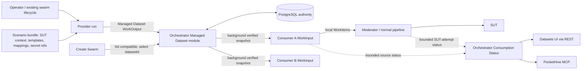

# Managed Test Data MVP Specification

Status: in progress; proposed requirements, implementation and canonical contract approval pending
Scope: Scenario Manager metadata, Orchestrator Managed Dataset module, Worker SDK adapters, UI and PocketHive MCP

## Decision required

Approve a PostgreSQL-backed Managed Dataset MVP in which one provider run
creates a Dataset and zero or many consumer swarms select it explicitly.
Consumers dispatch reusable records from verified local snapshots through the
existing `WorkInput -> WorkItem -> WorkOutput` pipeline. PocketHive also shows
whether the selected Dataset is being used correctly at the source and SUT
attempt boundary.

The design replaces Redis-style Dataset dependencies without copying Redis
list semantics. Records are immutable, shared and reusable. There is no pop,
depletion, use count, exclusive checkout, outcome-driven invalidation or
automatic provider lifecycle.

## Goal

Keep renewable synthetic SUT data available for continuous test traffic while
keeping PostgreSQL, Orchestrator and credential-provider calls off the measured
request path.

```text
provider WorkInput -> normal provider pipeline -> provider WorkOutput -> Managed Dataset
Managed Dataset snapshot -> consumer WorkInput -> normal consumer pipeline -> SUT
```

## Hard rules

| Rule | Requirement |
|---|---|
| Normal worker I/O | Managed Dataset adapters implement existing `WorkInput` and `WorkOutput`; no Dataset-specific RabbitMQ lane is added. |
| Explicit configuration | Every adapter and setting is explicit under its adapter-specific block. Missing or unsupported values fail before provisioning. |
| One creator | One provider run creates one Managed Dataset per Managed Dataset output binding. A worker-process restart keeps that provider-run identity; a new provider run gets a new identity and Dataset. |
| Explicit consumers | Create Swarm requires one exact `datasetId` for each consumer `bindingRef`. A run stays pinned to it. There is no alias following, substitution or fallback. |
| Shared records | Records are immutable and reusable by concurrent consumers. The scenario owner MUST confirm that repeated concurrent use is safe under the SUT contract. |
| Local measured path | Selection, context validation and counter increments are local. Snapshot refresh, refill, persistence and status reporting are background/control-plane work. |
| PostgreSQL authority | PostgreSQL owns records, grants, receipts, revisions and background-work leases. Redis is not an authority. |
| No provider automation | The Dataset module never starts, stops, replaces, fails over or reconciles a provider swarm. |
| No generic reconciliation | MVP never infers record state from a SUT result and never corrects, revalidates, deprovisions or retires SUT objects. |
| Secrets by reference | Scenario bundles may contain SUT context, templates and mappings. They contain secret references, never secret values. |
| No fallback | Invalid, stale, unavailable or mismatched configuration fails explicitly. PocketHive never switches Dataset, adapter, provider or snapshot implicitly. |
| One consumption view | Orchestrator alone derives `ManagedDatasetConsumptionStatus`; REST, MCP and UI do not reimplement its checks. Missing or stale input produces `UNKNOWN`, never inferred health. |
| Non-blocking telemetry | Consumption reporting failure never blocks Dataset selection or SUT traffic. Status is operational evidence, not audit-grade delivery proof. |

## Supported MVP

- One immutable provider identity and zero or many consumers per Managed
  Dataset.
- Explicit SUT-compatible Dataset listing and selection during Create Swarm.
- `SHARED` allocation and deterministic `ROUND_ROBIN` local selection.
- Non-expiring and expiring records.
- Proactive refill to fixed minimum, target and maximum levels.
- Durable idempotent grants and receipts with stale-grant recovery.
- Verified immutable local snapshots with atomic replacement.
- Replica-safe Orchestrator background work using PostgreSQL leases and
  fencing.
- A minimal Managed Dataset Context needed for end-of-pipeline identity and
  expiry safety.
- Lightweight per-consumer consumption status exposed through REST, the
  existing Datasets UI area and PocketHive MCP.

## Out of scope

- Record use counts, queue/pop semantics, bounded-use records, one-use records
  and exclusive checkout.
- SUT-outcome invalidation, SUT reconciliation, correction, revalidation,
  deprovisioning and outcome-driven retirement.
- Multiple providers, provider transfer, automatic provider start or failover,
  and live consumer rebinding.
- Sensitive records or secrets in Dataset records.
- Active-active multi-region operation and application-owned PostgreSQL HA.
- Audit-grade delivery or SUT-acceptance proof, qualification evidence,
  evidence frames, approvals, arbitrary-window exactness, loss/duplicate
  cryptographic proof and HiveGate or HiveMind coupling. These are a future
  milestone and must not gate provider or consumer traffic.
- Per-record drill-down, exact-use or exactly-once claims, token/frame sums,
  malicious-worker resistance and custom time services.

## Canonical terms

| Term | Status | Meaning | Not the same as | Source | Allowed shorthand |
|---|---|---|---|---|---|
| `WorkInput` | EXISTING | Worker SDK adapter that supplies immutable `WorkItem`s to a worker. | SUT traffic pacing. | Worker SDK | None |
| `WorkOutput` | EXISTING | Worker SDK adapter that publishes or persists a worker result. | A Dataset provider workflow. | Worker SDK | None |
| `Dataset Space` | PROPOSED | SUT-scoped authoring namespace containing versioned Dataset definitions and access policy. | Runtime record storage. | SUT/Dataset model | None |
| `Scenario Binding` | PROPOSED | Validated link between scenario, SUT Environment, Dataset Space, schema, policy and access versions. Runtime uses a frozen snapshot. | A provider dependency. | SUT/Dataset model | None |
| `Managed Dataset` | PROPOSED | Orchestrator-owned runtime record set created by one provider run and readable by many compatible consumer bindings. | A Redis list or work queue. | This specification | `Dataset` after first use |
| `Managed Dataset Context` | PROPOSED | Minimal `WorkItem` metadata identifying the selected binding, Dataset revision, record and validity at the SUT-attempt guard. | Consumption evidence or security attestation. | This specification | `Dataset Context` after first use |
| `ManagedDatasetConsumptionStatus` | PROPOSED | Canonical Orchestrator read model for current operational Dataset consumption. | SUT business acceptance, exactly-once proof or audit evidence. | This specification | `Consumption Status` after first use |

The architecture proposal remains authoritative for `SUT Environment`,
`Dataset Space` and `Scenario Binding`. This specification owns proposed
Managed Dataset runtime rules.

## Ownership

| Concern | Owner | Must not own |
|---|---|---|
| Dataset definitions, schema and binding requirements | Scenario Manager | Runtime records or refill execution |
| Candidate listing, admission and frozen run configuration | Orchestrator | Automatic Dataset or provider selection |
| Records, grants, receipts, revisions, availability and leases | Orchestrator Managed Dataset module | Swarm lifecycle or SUT business logic |
| Provider lifecycle | Operator and existing swarm lifecycle | Managed Dataset module |
| SUT context, templates, mappings and secret references | Scenario bundle and existing resolution flow | Managed Dataset records |
| Local snapshot, dispatch and source counters | Managed Dataset `WorkInput` | Durable authority or SUT traffic pacing |
| Context propagation, terminal validation and SUT-attempt counters | Worker SDK | SUT business acceptance or evidence persistence |
| Consumption Status checks and aggregation | Orchestrator application/domain service | REST, MCP, UI, logs or RabbitMQ queue inference |
| Consumption Status presentation | Existing Datasets UI and PocketHive MCP adapters | Independent status logic or direct worker access |
| SUT traffic pacing | Moderator | Dataset supply or refill demand |
| PostgreSQL availability, replication, backup and recovery | Deployment infrastructure | Application fallback logic |

## Architecture


```mermaid
flowchart LR
  OP["Operator / existing swarm lifecycle"] --> P["Provider run"]
  B["Scenario bundle: SUT context, templates, mappings, secret refs"] --> P
  P -->|"Managed Dataset WorkOutput"| MD["Orchestrator Managed Dataset module"]
  MD <--> PG[("PostgreSQL authority")]
  CS["Create Swarm"] -->|"list compatible; select datasetId"| MD
  MD -->|"background verified snapshot"| C1["Consumer A WorkInput"]
  MD -->|"background verified snapshot"| C2["Consumer B WorkInput"]
  C1 -->|"local WorkItems"| M["Moderator / normal pipeline"]
  M --> SUT["SUT"]
  C1 -.->|"bounded source status"| O["Orchestrator Consumption Status"]
  M -.->|"bounded SUT-attempt status"| O
  O --> UI["Datasets UI via REST"]
  O --> MCP["PocketHive MCP"]
```

The measured path starts when a consumer selects a local record. It performs
no PostgreSQL, Orchestrator, Scenario Manager or credential-provider call.

## Dataset creation and selection

Provider admission creates the Managed Dataset before provider workers start.
Creation is idempotent on
`providerSwarmId + providerRunId + providerBindingRef`. Repeating the same
request and contract returns the same `datasetId`; changed content fails. A
new provider run creates a new `providerRunId` and `datasetId`.

The Dataset stores immutable provider swarm, run and binding provenance plus
the frozen SUT Environment, Dataset definition, schema and policy versions.
Provider ownership never transfers.

For each consumer binding, Create Swarm lists Datasets whose frozen SUT,
Dataset definition, schema and access contract match. The operator supplies:

```yaml
datasetSelections:
  - bindingRef: inputCards
    datasetId: cards-provider-run-20260805
```

Both fields are required. Orchestrator revalidates the exact Dataset and
freezes its id into the run. Only `READY` candidates can be admitted;
`DEGRADED` and `UNAVAILABLE` candidates remain visible with reason codes.
Different bindings may select the same Dataset.

## Worker I/O contract

The examples below are normative for nesting and illustrative for names. M0
must add the enum values and closed settings schemas to the canonical worker
I/O contracts and capability manifests.

The first provider bee obtains refill grants through its input adapter:

```yaml
role: provider-source
config:
  inputs:
    type: MANAGED_DATASET_REFILL
    managedDatasetRefill:
      bindingRef: refillCards
      batchSize: 100
  outputs:
    type: RABBITMQ
```

The terminal provider bee persists mapped results through a separate output
adapter:

```yaml
role: provider-store
config:
  inputs:
    type: RABBITMQ
  outputs:
    type: MANAGED_DATASET
    managedDataset:
      bindingRef: refillCards
```

Both `bindingRef` values resolve the same provider binding. Orchestrator
injects its created `datasetId` into both runtime adapter blocks. Work between
the first and terminal bees follows normal PocketHive topology. The bundle's
provider binding points to the SUT template and typed result mapping.

A consumer declares its dispatch trigger under the adapter-specific block:

```yaml
role: dataset-source
config:
  inputs:
    type: MANAGED_DATASET
    managedDataset:
      bindingRef: inputCards
      ratePerSec: 500
      consumptionObservation:
        reportInterval: PT5S
        staleAfter: PT20S
        observationWindow: PT15S
        pipelineLagTolerance: PT30S
  outputs:
    type: RABBITMQ
```

Create Swarm injects the selected `datasetId` into
`config.inputs.managedDataset.datasetId` in the frozen runtime configuration.
It is runtime materialisation, not an authoring default.

`ratePerSec` controls how quickly `WorkInput` supplies `WorkItem`s. It does not
consume records and is not refill demand. Moderator remains responsible for
SUT traffic pacing. The four `consumptionObservation` values are required and
frozen with the run. `staleAfter` MUST be at least three report intervals;
`observationWindow` MUST be at least two; `pipelineLagTolerance` MUST cover the
scenario's declared moderator and bounded queue delay. There are no defaults
or auto-tuning.

Adapter settings live only in the bee blocks above. Dataset definition,
schema, lifecycle, supply and capacity policy live once in the versioned
provider Scenario Binding resolved by `bindingRef`. A consumer Scenario Binding
contains compatibility and `READ` requirements only; it never repeats or
overrides provider policy. The frozen Managed Dataset stores the resolved
provider policy.

Supply fields are closed and explicit:

| Field | Rule |
|---|---|
| `allocation` | Required MVP value `SHARED` |
| `selection` | Required MVP value `ROUND_ROBIN` |
| `minimumReady`, `targetReady`, `maximumReady` | Required non-negative integers satisfying the stated invariant |
| `replacementHeadroom` | Required non-negative integer; must be `0` for `NON_EXPIRING` |
| `lifecycle` | Required tagged union: `NON_EXPIRING`, or `EXPIRING` with `renewalLeadTime` |
| `maximumExpiryCohort` | Required positive integer for `EXPIRING`; forbidden for `NON_EXPIRING` |
| capacity timings and limits | Required explicit values; no defaults, clamping or auto-tuning |

## Safety invariants

### Counts and validity

- `0 <= minimumReady <= targetReady <= maximumReady`.
- A record is **live** when its immutable commit and schema are valid and it is
  either `NON_EXPIRING` or its `usableUntil` is later than authority time.
- A record is **renewal-ready** when it is live and either non-expiring or its
  `usableUntil` is later than `authorityTime + renewalLeadTime`.
- `activeGrantedSlots` count unexpired grant items not yet completed or stale.
- For expiring data,
  `maximumStored = maximumReady + replacementHeadroom`; old live records and
  their replacements may coexist only within this bound.

### Refill

Refill starts proactively when
`renewalReady + activeGrantedSlots < targetReady`. Records enter the refill
deficit before expiry because they stop being renewal-ready at the renewal
lead boundary.

```text
deficit = max(0, targetReady - renewalReady - activeGrantedSlots)

maximumGrant = min(
  deficit,
  maximumReady - renewalReady - activeGrantedSlots,
  maximumStored - liveStored - activeGrantedSlots,
  configuredBatchSize
)
```

A non-positive `maximumGrant` creates no work. Counts and grant creation occur
in one bounded PostgreSQL transaction.

For expiring data, admission requires
`replacementHeadroom >= maximumExpiryCohort`. It also requires a positive
refill window and enough declared provider capacity:

```text
refillWindow = renewalLeadTime - refillCycleInterval - maximumProviderCompletionTime
providerCapacityRecordsPerSecond * refillWindow >= maximumExpiryCohort
```

### Idempotency and stale grants

- A grant request has a stable idempotency key. Exact replay returns the same
  grant; reuse with changed content fails without mutation.
- Each grant item has one stable provider-operation key and one receipt.
  Exact receipt replay returns the stored result; changed replay fails.
- A receipt commits one immutable valid record. A provider failure records no
  record. MVP does not classify SUT outcomes or retire an existing record.
- A grant item not receipted by `grantExpiresAt` becomes `STALE` in a fenced
  transaction and releases its reserved slot. A late receipt is rejected.
  Recovery performs no SUT call and creates no reconciliation work.

## Dataset Context and snapshots

An expiring item may wait in the normal pipeline after source selection. M0
therefore reserves shared header constant `MANAGED_DATASET_CONTEXT` with wire
name `ph.dataset.context`. Managed Dataset items require its closed,
versioned JSON value; other items do not use it.

The source creates the Dataset Context locally at selection with exactly these
fields:

| Field | Rule |
|---|---|
| `schemaVersion` | Required supported integer version. |
| `datasetId` | Required; copied from the frozen consumer configuration. |
| `bindingRef` | Required; copied from the frozen consumer configuration. |
| `snapshotRevision` | Required positive revision of the selected local snapshot. |
| `recordId` | Required opaque record identity; never a telemetry dimension or UI value. |
| `selectedAt` | Required RFC 3339 selection time from the existing Worker SDK time source. |
| `usableUntil` | Required RFC 3339 value for expiring records; required JSON `null` means explicitly non-expiring. |

Normal workers preserve the header unchanged. Immediately before invoking the
SUT adapter, the Worker SDK rejects an absent, malformed or unsupported context,
an expired context or one that cannot cover the frozen maximum invocation
duration, or a `datasetId`/`bindingRef` mismatch against the frozen run. It then
increments `sutAttemptedTotal` and invokes the SUT. An in-flight
item from an older valid snapshot revision remains valid; refresh must not make
queued work fail merely because the local revision advanced.

The context adds no remote call, persistence, acknowledgement, canonical JSON,
hash, signature, token sum or custom clock protocol. It proves neither SUT
acceptance nor exactly-once processing.

Snapshot refresh is background work:

1. Fetch bounded, keyset-paged records at one PostgreSQL-backed revision.
2. Verify Dataset id, binding, revision, schema, page digests, whole-snapshot
   digest, record count, byte limit and validity horizon.
3. Build the next immutable view outside request threads.
4. Publish the complete view with one atomic reference replacement. Existing
   readers finish on the old immutable view.
5. On refresh failure, keep the last verified view only while its records
   remain locally safe. Never extend validity.

A consumer process starts traffic only after loading a verified snapshot. A
temporary control-plane failure does not stop an already admitted consumer
while its current snapshot remains safe.

## Continuous operation and HA

- `providerRunId` belongs to the logical swarm run, not a worker process.
  Worker replacement or restart receives the same id and resumes only its
  durable grants. An explicitly new provider run receives a new id and Dataset.
- Consumer runs remain pinned to their frozen `datasetId` across worker
  restarts. If that Dataset is unsafe, the run stops dispatch; it never selects
  another Dataset.
- Orchestrator replicas claim Dataset background work through PostgreSQL lease
  rows. Each successful acquisition increments a fencing token. Every
  background mutation compares the current token in the same transaction;
  work from an expired owner is rejected.
- PostgreSQL replication, failover, backup, restore and recovery objectives are
  infrastructure responsibilities. The application does not implement a
  database fallback.

Availability is a closed enum. Orchestrator evaluates authority-side state for
candidate admission. Each admitted consumer evaluates local state from its
snapshot and last authority observation; Orchestrator does not claim to know
local memory state.

| State | Orchestrator candidate rule | Admitted consumer rule | Behaviour |
|---|---|---|---|
| `READY` | At least `targetReady` records are renewal-ready and refill/storage checks are within limits. | A verified snapshot has at least `targetReady` records safe through the invocation horizon and authority state is current. | New admission and dispatch are allowed. |
| `DEGRADED` | At least `minimumReady` records are safe, but supply is below target or provider/refill/storage health is late within tolerance. | A verified snapshot has at least `minimumReady` safe records, but refresh or authority state is late, unknown or not `READY`. | New admission stops; this consumer continues dispatch. |
| `UNAVAILABLE` | Fewer than `minimumReady` records are safe, integrity or authorisation fails, or the last authority observation exceeds tolerance. | Fewer than `minimumReady` local records are safe, snapshot integrity or authorisation fails, or records cannot cover the invocation horizon. | New admission stops; only a consumer whose own state is `UNAVAILABLE` stops dispatch. |

For an existing consumer, local safety is decisive during a temporary
control-plane outage. A central status change alone does not revoke a still
valid immutable snapshot. An explicit operator stop still stops the run.

Administrative qualification evidence is not an MVP runtime dependency. A
future evidence expiry may block new admission, but MUST NOT unexpectedly stop
already admitted traffic that remains safe under the frozen contract.

## Operational consumption status

Dataset availability and consumption are separate. `READY` says that a Dataset
can supply safe records; it does not say that a consumer is using them.
Consumption Status is lightweight operational evidence that:

- the consumer remains pinned to its frozen `datasetId` and `bindingRef`;
- its local snapshot is current and safe;
- records are being selected;
- valid Dataset Context reaches the SUT-attempt guard; and
- every expected reporting worker instance is fresh.

It does not prove SUT business acceptance, bounded use, exactly-once delivery,
loss or duplication resistance, or correct behaviour by a malicious worker.

### Bounded telemetry

The source and SUT-attempt guard update local monotonic counters. At the
configured low frequency, workers attach one bounded
`managedDatasetConsumption` entry per configured binding and boundary to the
existing status context. M0 adds this closed entry to the canonical
control-event schema; it adds no new event family. Existing controller status
collection delivers the entries to Orchestrator. The Orchestrator runtime
inventory names the exact active source and SUT-calling worker instances
expected for each frozen binding; the set is not inferred from received reports.

All counters start at zero for each process epoch. The epoch is the existing
worker `instance` plus `status-full.data.startedAt`; no second worker id is
introduced. Orchestrator keeps only the two latest samples per expected
reporter and computes a rate only when both samples have the same epoch and
increasing timestamps. A restart, counter decrease or epoch change starts a new
baseline and yields `UNKNOWN` until a second fresh sample arrives.

| Boundary | Required status fields |
|---|---|
| Source | `selectedTotal`, `selectionRejectedTotal`, `lastSelectedAt`, `snapshotRevision`, `snapshotRecordCount`, `snapshotAge`, `snapshotRefreshFailures`, `snapshotSafe` |
| SUT attempt | `sutAttemptedTotal`, `lastSutAttemptAt`, `expiredRejectedTotal`, `invalidContextRejectedTotal`, `datasetMismatchRejectedTotal` |
| Both | `schemaVersion`, `runId`, `bindingRef`, `datasetId`, `boundary`, report time and existing worker `instance`/`startedAt` |

`selectedTotal` increments only after a safe local record and its Dataset
Context are selected. `sutAttemptedTotal` increments only after terminal context
validation and immediately before SUT invocation. Reject counters increment at
their named guard. Source and terminal counts are not expected to match:
moderation, bounded queues and in-flight work make their rates and totals
different. Displayed totals sum the latest current-epoch reporter values; they
are operational process totals, not durable run-lifetime counts.

Dimensions are limited to swarm, run, binding, Dataset, expected worker
instance, process epoch and boundary. Record ids, selection ids, context values,
correlation ids and unbounded reason text MUST NOT be dimensions. Reports,
metrics, logs and UI contain no record values, credentials or `recordId`.

Status transport failure is caught outside the measured path and never changes
selection or SUT invocation. Orchestrator does not infer consumption from logs,
RabbitMQ messages or queue depth, generic worker TPS, another Dataset, or any
other fallback source.

### Canonical read model

`ManagedDatasetConsumptionStatus` is the only consumer-status DTO and domain
calculation. Every key is required on the wire; a nullable observation means
"not observed" and must have an `UNKNOWN` check and reason.

| Field | Contract |
|---|---|
| Identity | `schemaVersion`, `swarmId`, `runId`, `bindingRef`, `datasetId` |
| Separate state | `datasetAvailability`, `runState`, `consumptionState` |
| Decision | `reasonCode`, `nextActionCode`, `observedAt`, `freshUntil`, `refreshAfter` |
| Source | `selectedTotal`, `selectionRejectedTotal`, `lastSelectedAt`, `observedSelectionRate`, `snapshotRevision`, `snapshotRecordCount`, `snapshotAge`, `snapshotRefreshFailures`, `snapshotSafe` |
| SUT attempt | `sutAttemptedTotal`, `lastSutAttemptAt`, `observedAttemptRate`, `expiredRejectedTotal`, `invalidContextRejectedTotal`, `datasetMismatchRejectedTotal` |
| Reporting | `expectedReporterCount`, `freshReporterCount`, `staleReporterCount` and bounded reporter identities without record data |
| Checks | Ordered `checks[]` entries containing closed `code`, `result`, `reasonCode`, `observedAt` and `freshUntil` |

Rates are observed items per second over the actual interval between two
consecutive cumulative samples in one process epoch. `observationWindow` is the
minimum mature period for a zero-activity decision; it is not a rate window.
These rates are not arbitrary-window exact counts. `freshUntil` is the earliest
required reporter expiry, or `null` when an expected reporter has never been
seen; `refreshAfter` is the earliest useful next read.

Checks use only `PASS`, `FAIL` or `UNKNOWN`:

| Check code | `PASS` | `FAIL` | `UNKNOWN` |
|---|---|---|---|
| `FROZEN_BINDING` | Fresh source and terminal identity match the frozen run. | A mismatch rejection increased. | Required identity report missing, stale or reset. |
| `SNAPSHOT_SAFE` | Fresh source reports a current safe snapshot. | Snapshot is unsafe and selection is stopped. | Source snapshot report missing or stale. |
| `SOURCE_SELECTING` | Fresh selection delta is positive. | Expected-active source is fresh with no selection after the observation window. | Window not mature or source report missing, stale or reset. |
| `SUT_BOUNDARY_REACHED` | Fresh SUT-attempt delta is positive. | Source selects but no attempt occurs after `pipelineLagTolerance`. | Lag window not mature or terminal report missing, stale or reset. |
| `EXPECTED_REPORTERS_FRESH` | All expected instances report in time. | Not used: absence cannot prove failure. | One or more expected reports are missing or stale. |

Closed reason codes are `OK`, `RUN_NOT_ACTIVE`, `NO_ACTIVE_CONSUMER`,
`NO_SELECTION`, `PIPELINE_DELAY`, `SNAPSHOT_REFRESH_FAILED_SAFE`,
`SNAPSHOT_UNSAFE`, `CONTEXT_INVALID`, `CONTEXT_EXPIRED`, `DATASET_MISMATCH`,
`REPORT_MISSING`, `REPORT_STALE`, `REPORTER_PARTIAL`, `COUNTER_EPOCH_CHANGED`
and `TELEMETRY_ERROR`. Closed next-action codes are `NONE`, `WAIT`,
`CHECK_DATASET`, `CHECK_BINDING`, `CHECK_WORKER_STATUS` and `RESUME_RUN`.

`consumptionState` is calculated in this order:

1. When the run or binding is not expected to consume, return `UNKNOWN` with
   `RUN_NOT_ACTIVE`; UI shows `PAUSED` or `STOPPED` as the primary state.
2. Return `UNKNOWN` when either required boundary has no usable fresh report or
   awaits a post-restart baseline. If each boundary has a fresh report proving
   valid flow but other expected instances are missing, partial reporting is
   `DEGRADED`, never `CONSUMING`.
3. Return `CONSUMING` only when the snapshot is safe, source and terminal rates
   are positive, identities match and every expected reporter is fresh.
4. Return `DEGRADED` when valid attempts continue but a safe snapshot refresh
   failed, a reject counter increased, reporters are partial, or selected work
   is still within `pipelineLagTolerance`.
5. Return `NOT_CONSUMING` only from fresh, mature reports showing no selection,
   no terminal attempt beyond the lag tolerance, an unsafe snapshot stop, or
   terminal rejection activity with no valid attempt beyond the lag tolerance.

Dataset aggregate state excludes paused and stopped bindings. With active
bindings, priority is `NOT_CONSUMING`, `UNKNOWN`, `DEGRADED`, then
`CONSUMING`; no active binding yields `UNKNOWN/NO_ACTIVE_CONSUMER`. Thus one
degraded and one healthy consumer is `DEGRADED`, while one unknown consumer can
never be hidden by a healthy one. Availability may be `DEGRADED` or
`UNAVAILABLE` while a non-expiring safe snapshot remains `CONSUMING`.

### REST, MCP and UI

Orchestrator exposes the read model unchanged at:

```text
GET /api/managed-datasets/consumption-status?swarmId={swarmId}&runId={runId}&bindingRef={bindingRef}
```

The PocketHive MCP tool
`managed_dataset_consumption_status_get(swarmId, runId, bindingRef)` delegates
to that product API and returns the same JSON object without recalculation. It
does not query logs, RabbitMQ or general metrics. The UI uses normal product
REST, never MCP. Dataset list/detail endpoints project the same statuses; they
do not own a second state algorithm.

The existing Datasets area gains no new top-level navigation. List rows show
name/id, availability, ready/target/maximum supply, active consumer bindings,
aggregate consumption state, source rate, last SUT-attempt time and freshness.
Detail shows identity/provider and availability, supply/refill, then a compact
consumer table keyed by swarm/run/binding. Consumer detail shows snapshot
revision/size/age/safety, separate source and terminal counts/rates, reject
counts, last observations, checks, reason and next action. Charts appear only
when the normal metrics store has a real bounded time series.

Status, freshness, action and reason appear before counts. `READY` is never
labelled `CONSUMING`. Each state has text and an accessible icon; colour is
secondary. Status changes use appropriate live-region semantics without moving
focus. Many consumers default to a compact sortable table with progressive
detail. The UI refreshes no faster than `refreshAfter`, pauses background-tab
refresh and honours endpoint throttling and `Retry-After`; it never polls at
traffic rate. Aggregate rates sum fresh active consumers only and always show
reporter coverage; missing consumers are never filled in as zero.

| UI field | REST/read-model field | Producer | Freshness |
|---|---|---|---|
| Name/id, provider | Dataset detail identity/provenance | Frozen Dataset registry | Immutable |
| Availability | `datasetAvailability` | Managed Dataset authority state | Authority observation |
| Ready/target/maximum | Dataset supply projection | PostgreSQL counts/frozen policy | Authority observation |
| Active bindings | Dataset aggregate projection | Frozen Orchestrator run registry | Run observation |
| Aggregate state | Dataset aggregate projection | Orchestrator over Consumption Status | Earliest active `freshUntil` |
| Source rate | `observedSelectionRate` | Source cumulative samples | Source `freshUntil` |
| Last observed consumption | `lastSutAttemptAt` | SUT-attempt guard | Terminal `freshUntil` |
| Snapshot revision/size/age/safety | Source fields | Managed Dataset `WorkInput` | Source `freshUntil` |
| Terminal rate/count/rejects | SUT-attempt fields | Worker SDK guard | Terminal `freshUntil` |
| Checks/reason/action | `checks`, `reasonCode`, `nextActionCode` | Orchestrator domain service | Overall `freshUntil` |

Required UI acceptance scenarios are:

| Scenario | Expected presentation |
|---|---|
| Healthy Dataset used by two swarms | `READY`; two separate `CONSUMING` rows and a `CONSUMING` aggregate. |
| Ready Dataset with no consumer | `READY`; `UNKNOWN/NO_ACTIVE_CONSUMER`, never `CONSUMING`. |
| Selecting while SUT work is delayed | Source rate visible; `DEGRADED/PIPELINE_DELAY` until tolerance, then `NOT_CONSUMING`. |
| Refresh fails but current snapshot is safe | Availability and consumption shown separately; consumption `DEGRADED`, traffic continues. |
| Expired, malformed or mismatched context | Blocked before SUT; named reject count and `FAIL` check increase. |
| One degraded and one healthy consumer | Rows remain distinct; aggregate is `DEGRADED`. |
| Telemetry missing or stale | Affected checks and state are `UNKNOWN`; no false green status. |
| Provider unavailable, non-expiring snapshot safe | Availability problem remains visible while consumption may continue. |
| Run intentionally paused or stopped | Run state leads; not presented as a consumption failure. |

### Cost and overload budget

Telemetry holds constant-size local counters and at most two Orchestrator
samples per bounded reporter. Publication is coalesced, non-blocking and at most
one status entry per boundary per `reportInterval`; endpoint and UI refresh
limits are required explicit deployment settings and are load-tested. The
minimum UI/API refresh interval MUST be at least `reportInterval`; per-principal
read rate and burst limits MUST be positive and have no implicit defaults.

The MVP release gate compares the same workload with consumption reporting on
and off: throughput reduction and p95 measured-path latency increase MUST each
be at most 2%; telemetry state MUST remain O(expected reporters), status payload
MUST remain at most 8 KiB per worker report, and no allocation may grow with
record or selection count. Failure of this gate blocks release, not traffic.

## Capacity and overload protection

Admission fails before provisioning when any of these is false:

- count thresholds and lifecycle fields are valid;
- expiring data has sufficient `replacementHeadroom` and provider replacement
  capacity;
- `1 <= batchSize <= maximumSupportedBatchSize` for the selected adapter;
- snapshot memory satisfies
  `2 * maximumSnapshotBytes + snapshotDecodeOverheadBytes <= snapshotMemoryBudgetBytes`;
  and
- configured dispatch, provider, PostgreSQL connection and storage limits fit
  the selected capability profile.

There are no unbounded Dataset queues. Refill grants and provider in-flight
items are capped. Snapshot refresh is single-flight and coalesces a later
request instead of queueing refresh tasks. Consumer dispatch has an explicit
in-flight bound; when downstream capacity is full it pauses through normal
backpressure rather than allocating more work or selecting alternate data.
Any normal RabbitMQ work queue used by the scenario must have explicit length
or byte limits. Overflow must signal pause/rejection; it must not silently drop
or reroute work.

Consumer `ratePerSec` is workload supply, not record-depletion demand. Refill
capacity is driven by expiry/replacement cohorts only.

Required metrics and alerts are:

- live, renewal-ready, stored, deficit, active-grant and stale-grant counts;
- replacement headroom, refill request/completion rate and refill latency;
- snapshot revision, age, records, bytes, refresh failures and time-to-unsafe;
- dispatch offered, accepted, paused and rejected, plus in-flight depth;
- lease acquisition, fencing rejection, transaction latency and database
  errors; and
- availability state and closed reason code.

Alerts fire before headroom, snapshot validity or bounded queue capacity is
exhausted. Metrics and logs contain ids and counts, never record values or
secrets.

## Security

- Authorise Dataset, binding, SUT and run scope on every control-plane call.
- Validate record schema, sizes, cursors, ids and template references as
  hostile input.
- Resolve SUT endpoints and secret references through existing approved paths
  before traffic starts. Never store resolved credentials in records,
  snapshots, contexts, status, logs or metrics.
- Use `correlationId` for tracing and distinct idempotency keys for mutation
  replay.

## Delivery plan

| Milestone | Deliverable | Exit |
|---|---|---|
| M0 — contracts | Closed Dataset, Create Swarm selection, adapter config, snapshot, grant, receipt, Dataset Context, status input, `ManagedDatasetConsumptionStatus`, REST, MCP, availability and capability schemas | Canonical owners and team approve before code starts |
| M1 — authority | PostgreSQL records, revisions, grants, receipts, leases, fencing and bounded APIs | Transaction, concurrency, restart and replica tests pass |
| M2 — adapters | Refill `WorkInput`, Dataset `WorkOutput`, consumer `WorkInput`, local snapshots, context guard and local counters | Shared provider/consumer scenario passes functional and overload tests |
| M3 — continuous-use release | Consumption Status REST/MCP/UI, metrics, alerts, security and 24-hour resilience qualification | Functional, freshness, cost, accessibility, restart, outage and soak gates pass |
| Future — audit evidence | Optional qualification, delivery proof, approvals and governance integration | Separate design with no bootstrap cycle or measured-path dependency |

## Acceptance criteria

The MVP is releasable only when tests through official product APIs prove:

1. invalid thresholds, lifecycle fields, headroom, batch size, memory or refill
   capacity fail before provisioning;
2. provider refill input and Dataset output are separate adapters on the first
   and terminal bees, and the consumer input requires `bindingRef` and
   `ratePerSec` under `managedDataset`;
3. concurrent consumer swarms reuse the same immutable records without
   depletion, checkout, use counts or cross-consumer mutation;
4. repeated provider create/grant/receipt requests are idempotent and changed
   replay fails;
5. stale grants recover capacity, reject late receipts and perform no SUT
   reconciliation;
6. expiring cohorts refill before expiry without exceeding `maximumReady` or
   `maximumStored` during replacement overlap;
7. a provider worker restart preserves `providerRunId`, while a new provider
   run creates a new Dataset;
8. two Orchestrator replicas cannot both mutate background state under one
   lease, and stale fencing tokens are rejected;
9. a consumer stays on its exact `datasetId`; Dataset or control-plane failure
   never causes substitution;
10. a fully verified snapshot replaces the old view atomically, a failed
    refresh preserves only a still-safe view, and invalid or expired records do
    not reach the SUT boundary;
11. packet-level dependency tests show no PostgreSQL, Orchestrator, Scenario
    Manager or credential-provider calls on the measured path;
12. `READY`, `DEGRADED` and `UNAVAILABLE` transitions match this specification,
    including safe continuation during a temporary control-plane outage;
13. overload tests reach configured bounds, apply backpressure and keep queue,
    memory and transaction use within limits;
14. a 24-hour soak covers provider and consumer process restarts, two expiry
    and refill cycles, one temporary control-plane outage and one PostgreSQL
    failover exercise supplied by the deployment environment;
15. two consumer swarms using one Dataset retain separate source, terminal,
    reporter freshness and aggregate statuses;
16. missing, malformed, expired and mismatched Dataset Context is blocked before
    SUT invocation and increments only its bounded terminal rejection counter;
17. counter rates never bridge a process epoch, and missing or stale telemetry
    yields `UNKNOWN` without blocking measured traffic;
18. REST, MCP and UI return or present the same Orchestrator status, with no
    inference from logs, RabbitMQ, generic TPS or another Dataset;
19. API/UI contract tests cover all nine scenarios, accessible non-colour status
    semantics, no record values or high-cardinality identifiers, and complete
    UI-field traceability; and
20. load qualification meets the measured overhead, payload, refresh and
    bounded-state budget in this specification.

## Remaining risks

- Shared reuse is safe only when the scenario's SUT contract tolerates
  concurrent repeated use. The MVP does not detect a false declaration.
- A stale provider operation may leave an unrecorded SUT object. The MVP
  deliberately does not reconcile it.
- PostgreSQL HA and the proposed contracts are not yet implemented or
  qualified.
- Dataset Context and Consumption Status support local safety and operations;
  they do not prove SUT acceptance, end-to-end delivery or malicious-worker
  resistance.

## References

- [PocketHive architecture](../ARCHITECTURE.md)
- [Scenario contract](../scenarios/SCENARIO_CONTRACT.md)
- [Worker SDK](../../common/worker-sdk/README.md)
- [SUT, Dataset Space and Simulation Program model](../architecture/sut-dataset-simulation-model.md)
- [PocketHive correlation and idempotency](../correlation-vs-idempotency.md)
- [AWS: make mutating operations idempotent](https://docs.aws.amazon.com/wellarchitected/latest/framework/rel_prevent_interaction_failure_idempotent.html)
- [PostgreSQL explicit locking](https://www.postgresql.org/docs/current/explicit-locking.html)
- [PostgreSQL high availability, load balancing and replication](https://www.postgresql.org/docs/current/high-availability.html)
- [Kubernetes leases and leader election](https://kubernetes.io/docs/concepts/architecture/leases/)
- [Java 21 `AtomicReference`](https://docs.oracle.com/en/java/javase/21/docs/api/java.base/java/util/concurrent/atomic/AtomicReference.html)
- [RabbitMQ flow control](https://www.rabbitmq.com/docs/flow-control)
- [AWS: fail fast and limit queues](https://docs.aws.amazon.com/wellarchitected/latest/framework/rel_mitigate_interaction_failure_fail_fast.html)
- [AWS: rely on the data plane during control-plane failure](https://docs.aws.amazon.com/wellarchitected/latest/framework/rel_withstand_component_failures_avoid_control_plane.html)
- [OpenTelemetry metrics data model](https://opentelemetry.io/docs/specs/otel/metrics/data-model/)
- [OpenTelemetry metrics cardinality limits](https://opentelemetry.io/docs/specs/otel/metrics/sdk/#cardinality-limits)
- [Prometheus instrumentation and label cardinality](https://prometheus.io/docs/practices/instrumentation/)
- [WCAG 2.2: use of colour](https://www.w3.org/WAI/WCAG22/Understanding/use-of-color.html)
- [WCAG 2.2: status messages](https://www.w3.org/WAI/WCAG22/Understanding/status-messages.html)
- [AWS: throttle requests](https://docs.aws.amazon.com/wellarchitected/latest/framework/rel_mitigate_interaction_failure_throttle_requests.html)
