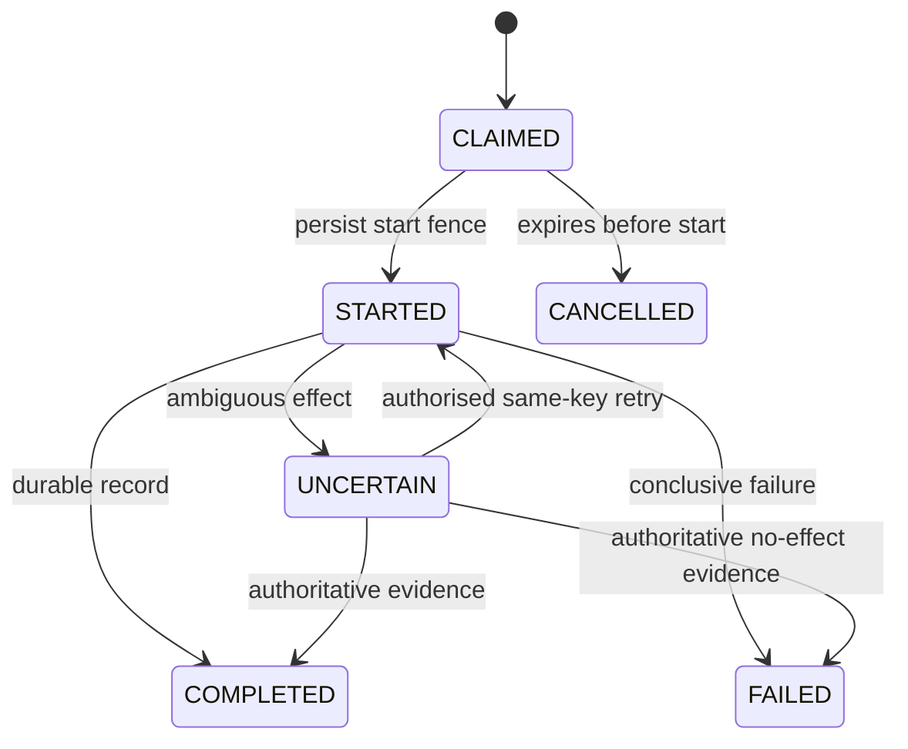

# Managed Test Data MVP

Status: in progress — 24/7 and HA-compatible design tightened; contracts and team approval pending

## Goal

Let producer swarms create durable synthetic test records that independent
consumer swarms can reuse continuously without central I/O on the measured
request path.

The MVP uses PocketHive's existing worker pipeline:

```text
WorkInput -> WorkItem -> worker -> WorkItem -> WorkOutput
```

## MVP decisions

| Area | Decision |
|---|---|
| Runtime authority | PostgreSQL through a bounded module inside Orchestrator |
| Dataset model | Documented SUT-scoped Dataset Space and immutable Scenario Binding snapshot |
| Producer input | `MANAGED_DATASET_REFILL` `WorkInput` |
| Producer output | `MANAGED_DATASET` `WorkOutput` |
| Consumer input | `MANAGED_DATASET` `WorkInput` with a local immutable snapshot |
| Envelope | Existing canonical `WorkItem` |
| Allocation | Reusable `SHARED` records with round-robin selection |
| Supply | Continuous bounded refill to a fixed target before records expire |
| Lifecycle | Immutable records, expiry-safe snapshot rotation, and bounded retention |
| Availability | Replica-safety requirements in MVP; HA deployment and qualification deferred |
| SUT behavior | Scenario-bundle config using resolved `sut`, `vars`, templates, and private auth |
| Data classification | Synthetic, non-secret records suitable for the existing `WorkItem` path |

Deferred: generic SUT reconciliation, record correction or revalidation,
SUT-side deprovision, live target changes, automatic producer lifecycle, Redis
authority, consumable/exclusive records, multi-output interceptors, sensitive
data, HA deployment and qualification, backup restore, and multi-region
operation. Expiry replacement, snapshot renewal, and database retention are
required MVP housekeeping; they do not inspect or reconcile SUT state.

Unsupported capabilities fail validation. Adapters, Datasets, SUTs,
configuration, and stale data are never substituted.

Evidence status:

| Status | Statement |
|---|---|
| Current | PocketHive already has the worker I/O pipeline, `WorkItem`, bundle SUT context, and worker status fields. |
| Design | Dataset Space and Scenario Binding are proposals, not verified runtime capabilities. |
| Proposed | Managed Dataset adapters, persistence, APIs, grants, snapshots, and readiness. |
| Unverified | Fault recovery, replica safety, continuous expiry/retention, and the candidate 50k/1k RPS profile; all require implementation evidence. |

“24/7” means a continuously running simulation can renew, rotate, recover, and
bound storage without planned operator data maintenance. The Dataset design
requires replica safety: PostgreSQL remains authoritative, background
ownership is durably fenced, and consumers continue only with a safe local
snapshot. This remains unverified and does not make the current deployment
highly available; HA, backup restore, and multi-region failover remain separate
qualifications.

## Architecture rules

- Dataset Space contains the Dataset definitions and state pools for one SUT
  Environment, as defined in the PocketHive architecture proposal.
- Scenario Manager owns versioned authoring metadata. Orchestrator owns runtime
  records, grants, revisions, receipts, and readiness.
- A `bindingRef` in Dataset I/O config is the scenario's explicit Dataset
  requirement. The MVP does not add a duplicate `requirements.yaml` contract.
- Scenario Binding resolves every `bindingRef` to exact Space, Dataset, schema,
  policy, and access versions before swarm creation.
- Runtime uses the immutable binding snapshot, never a live alias. Alias reuse
  cannot redirect a running swarm.
- `config.inputs` and `config.outputs` select exactly one adapter per worker.
- `template.bees[].work.in/out` remains the RabbitMQ topology map between bees;
  it is not a Dataset identifier.
- Dataset adapters report their resolved resources through existing status
  `workIn` and `workOut` fields.
- Swarm lifecycle continues through the existing `ph.control` contract. The
  Dataset module does not start, stop, or configure swarms.

## Dataset and binding contract

Illustrative Dataset Space content:

```yaml
datasetSpaceId: payments-integration
version: 3
sutEnvironmentId: payments-int-01
datasets:
  - datasetId: cards.mastercard.ready
    recordSchemaRef: cards-mastercard-record@1
    recordSchemaDigest: sha256:...
    maxEncodedRecordBytes: 4096
    keyFields: [cardId]
    allocation: SHARED
    storage:
      adapter: POSTGRESQL
      capabilityProfile: MANAGED_RECORDS_V1
    supply:
      minimumReady: 45000
      targetReady: 50000
      maximumReady: 55000
    lifecycle:
      mode: EXPIRING
      renewalLeadTime: PT30M
```

Rules:

- Space, Dataset, schema, and policy versions are immutable after activation.
- Dataset ids and aliases are unique within one Space version.
- `minimumReady <= targetReady <= maximumReady`; all are non-negative.
- A Dataset bound to a consumer requires `minimumReady >= 1`; a zero-capacity
  Dataset cannot start consumer dispatch.
- Adapter and capability profile are required and explicit.
- Lifecycle mode is required: `NON_EXPIRING` forbids `usableUntil`;
  `EXPIRING` requires `usableUntil` and `renewalLeadTime`.
- Record schemas are closed, versioned, content-digested, size-bounded, and
  non-secret. Commits exceeding `maxEncodedRecordBytes` fail.
- Runtime-significant changes create a new Space and binding version.

The runtime binding snapshot contains its own id/digest plus exact scenario,
SUT, Dataset Space, Dataset, schema, storage profile, supply policy, and
selection algorithm version, and `READ`/`REFILL` access versions.

Record values are immutable while retained. An expiring result must remain
usable beyond its commit time by at least `renewalLeadTime`; shorter results
fail, contribute no record, and release the grant reservation. Records leaving
that horizon stop counting as supply-ready, which creates replacement demand
before expiry.

Expired raw records, closed grants, receipts, and natural-key tombstones have
separate bounded retention windows in the capability profile. Purge never
calls the SUT. Natural-key duplicate protection is guaranteed across live data
and the retained tombstone window; any longer uniqueness requirement must be
enforced by the producer or SUT and proved at admission.

## Worker I/O contract

The SDK adds these enum values and factories:

| Type | Responsibility |
|---|---|
| `WorkerInputType.MANAGED_DATASET_REFILL` | Claim bounded missing slots and emit one refill `WorkItem` per grant. |
| `WorkerOutputType.MANAGED_DATASET` | Validate and commit one typed producer result, then obtain a durable receipt. |
| `WorkerInputType.MANAGED_DATASET` | Hydrate a local snapshot and emit selected record `WorkItem`s. |

Input config keys are exactly `inputs.managedDatasetRefill` and
`inputs.managedDataset`. `outputs.type: MANAGED_DATASET` has no author-provided
target; the grant and binding snapshot determine it.

Producer config fragments:

```yaml
# First bee
inputs:
  type: MANAGED_DATASET_REFILL
  managedDatasetRefill:
    bindingRef: refillCards
outputs:
  type: RABBITMQ

# SUT-calling bee config may use bundle context
baseUrl: "{{ sut.endpoints['cards'].baseUrl }}"
# Bundle-local request templates may select authRef.profileId.

# Terminal bee
inputs:
  type: RABBITMQ
outputs:
  type: MANAGED_DATASET
```

SUT endpoints, variables, templates, and result mapping may live in the
producer scenario bundle. Orchestrator resolves them into the immutable plan.
Credentials remain behind the existing private auth configuration and never
enter the bundle, binding, grant, `WorkItem`, logs, or status.

Consumer input:

```yaml
inputs:
  type: MANAGED_DATASET
  managedDataset:
    bindingRef: inputCards
    ratePerSec: 1000
    selection: ROUND_ROBIN
outputs:
  type: RABBITMQ
```

`ROUND_ROBIN` is the only MVP selection policy.

### Configuration safety

Scenario authors set only the refill `bindingRef`, or the consumer
`bindingRef`, `ratePerSec`, and `selection`. `ratePerSec` keeps PocketHive's
existing per-input-instance semantics and dispatches from local memory. It is
not proof of SUT arrival rate. For rate-shaped performance tests, the existing
Moderator remains the only pacing authority. Target and released rate are
measured at the Moderator; actual SUT starts, lateness, and drops are measured
at the final SUT boundary.

The versioned capability profile owns claim batch, refill start-rate and
in-flight limits, backoff bounds, hydration
page/concurrency/maximum-duration limits, snapshot bytes, and database budgets.
It also owns selection safety margin, maximum worker invocation duration,
snapshot age, recovery budget and clock skew, retention windows, and purge
batches. Dataset admission rejects supply or schema combinations whose
worst-case record count or encoded bytes exceed that profile. Values are never
silently clamped.

`selectionSafetyMargin` must be at least
`maximumWorkerInvocationDuration + maximumClockSkew`. Worker and Rabbit queue
age budgets must also fit the qualified load profile; unbounded residence is
not admissible for expiring data. `EXPIRING` admission also requires an
explicit clock-health source qualified to that skew; `UNKNOWN` fails closed.

Admission reserves aggregate capacity across all admitted worker instances;
per-instance rate, snapshot bytes, hydration concurrency, refill work, and
database demand are multiplied by their resolved replica counts. Work-plane
byte rate includes encoded record and `WorkItem` envelope size; serialization
CPU and Rabbit queue capacity are evidence-backed budgets. An expiring Dataset
must satisfy:

```text
renewalLeadTime >= largestExpiryCohort / provenRefillRate
                 + maximumHydrationDuration
                 + recoveryBudget
                 + selectionSafetyMargin
                 + maximumClockSkew
```

Evidence, not an author-supplied estimate, provides the refill rate and expiry
cohort. A zero or unknown proven rate fails admission. Runtime compares the
observed expiry histogram with the admitted bound; a breach makes the Dataset
`DEGRADED`, blocks new dependent admissions, and remains visible while bounded
refill attempts recovery.

Admission also budgets the worst-case retained rows and bytes from the proven
creation rate, lifecycle windows, overlap, grants, receipts, and tombstones.
Current ready count alone is not a storage-capacity proof.

Refill claims and input dispatch jointly enforce the profile's start-rate and
in-flight limits rather than emitting one tick-sized burst. Producer SUT calls are
reported separately and included in the run's aggregate SUT load budget; they
are never hidden from performance results.

Snapshot memory admission includes the active view, one building or retained
old view, page buffers, indexes, `WorkItem` copies, measured object overhead,
and runtime headroom. A consumer may hold at most two full views; another
refresh cannot start until the older view is released. At the illustrative
55,000 × 4,096-byte maximum, two encoded views alone are about 429.7 MiB per
consumer before overhead.

All capacity-affecting templates resolve before admission; missing, non-finite,
or out-of-range values fail before provisioning.

The API enforces its limits regardless of client input. Empty claims and
overload use bounded exponential backoff with jitter and `Retry-After`; fixed,
synchronised polling is forbidden. Status, UI, and MCP show the resolved
profile and effective limits.

## WorkItem payloads

No new envelope or RabbitMQ lane is introduced.

A consumer `WorkItem` contains one typed record plus bounded Managed Dataset
metadata: binding digest, Dataset/revision/record ids, lifecycle mode,
`selectedAt`, and `usableUntil` when expiring, plus a digest of that immutable
selection metadata. Shared contract constants, not raw magic strings, name
these fields. Every worker hop preserves them; missing or changed metadata
fails locally.

Before invoking a worker, the SDK locally rejects an expiring item unless:

```text
usableUntil > trustedNow
              + profile.maximumWorkerInvocationDuration
              + profile.maximumClockSkew
```

The final check therefore occurs immediately before the SUT-calling worker.
Rejected items never reach the SUT and increment bounded expired/dropped
metrics. Queue age and drop rate are admission and run-failure signals; no
retry may silently replace the missed arrival.

A refill claim payload contains only:

- schema version;
- immutable binding snapshot and Dataset ids;
- grant id and fence;
- operation id and stable SUT idempotency key.

A producer result contains the grant/fence plus one outcome:

| Outcome | Required content |
|---|---|
| `COMPLETED` | One record matching the frozen schema |
| `FAILED` | No record and one bounded reason code |
| `UNCERTAIN` | No record and one bounded reason code |

Provider bodies, stack traces, arbitrary URLs, credentials, and free-form
errors are rejected.

`FAILED` means the operation conclusively produced no admissible Dataset
record. A known SUT success whose mapped record is invalid uses a bounded
`SUT_RESULT_UNUSABLE` reason and consumes the profile's side-effect budget; it
is not reported as `COMPLETED` or `UNCERTAIN`.

The Dataset output returns only after a durable receipt. Replaying the same
idempotency key and payload digest returns the original receipt. A changed
payload under the same key returns `409` with no mutation. A different grant
that produces an existing natural key receives a duplicate disposition,
creates no revision, releases that grant's reservation, and consumes the
bounded failure budget so a broken generator cannot loop forever.

## Refill protocol

The MVP includes bounded refill, not a general desired/observed reconciler.

```text
renewalReady = records without expiry
             + records with usableUntil > now + renewalLeadTime
effective = renewalReady + activeReservedGrants
deficit   = max(0, targetReady - effective)
capacity  = max(0, maximumReady - effective)
inflight  = max(0, profile.maxInFlightGrants - activeReservedGrants)
grant     = min(deficit, capacity, inflight, profile.maxClaimBatch)
```

`maximumReady` caps renewal-ready supply and reservations, not retained rows.
Records inside the renewal horizon may remain usable in an already activated
snapshot while replacements are created. Separate row and byte quotas bound
that overlap plus retention.

Active reservations are `CLAIMED`, `STARTED`, and `UNCERTAIN`. Completed,
failed, or cancelled grants do not count; a completed grant contributes only
through its committed record.

The Dataset API locks one Dataset row with `SELECT ... FOR UPDATE`, calculates
the grant, and inserts individual reservations in one short transaction. It
performs no network or SUT call while holding the transaction. A stable claim
request id makes a lost-response retry return the same grants.

Lock wait and transaction time are bounded. Per-Dataset pressure returns `429`;
service saturation returns `503`. Both return `Retry-After` and no grant.
An empty claim returns a bounded `nextClaimAt`, calculated from the earliest
renewal transition and the profile's maximum idle interval. Refill inputs sleep
until that time with jitter; they do not poll at a fixed rate.


```mermaid
stateDiagram-v2
  [*] --> CLAIMED
  CLAIMED --> STARTED: persist start fence
  CLAIMED --> CANCELLED: expires before start
  STARTED --> COMPLETED: durable record
  STARTED --> FAILED: conclusive failure
  STARTED --> UNCERTAIN: ambiguous effect
  UNCERTAIN --> STARTED: authorised same-key retry
  UNCERTAIN --> COMPLETED: authoritative evidence
  UNCERTAIN --> FAILED: authoritative no-effect evidence
```

The refill input must persist `STARTED` before dispatch. Expired `CLAIMED`
grants release capacity. An abandoned `STARTED` grant becomes `UNCERTAIN`,
retains capacity, and is never blindly reissued.

Automatic SUT-mutating refill requires a real provider idempotency mechanism
using the stable operation key and identical request parameters. Without it,
automatic refill is rejected. RabbitMQ acknowledgement, publisher confirm,
socket write, or HTTP timeout is not proof of business completion.

Uncertainty resolution is explicit, authorised, audited, and unavailable to
untrusted agents. A generic status-reconciliation workflow is deferred.

The profile bounds the number and age of `UNCERTAIN` grants. Crossing that
budget makes supply `BLOCKED` and alerts an operator; it never causes blind
retry or silent capacity release.

The profile also bounds consecutive/provider failures and known unusable SUT
effects. Exceeding either budget opens the refill circuit and makes supply
`BLOCKED` until an authorised operator resets it after correcting the cause.
There is no automatic SUT cleanup or retry storm.

Any run that can outlive its `EXPIRING` records must resolve at least one
explicit refill binding with qualified capacity. The Swarm Controller's existing
AMQP-derived aggregate proves component liveness; bounded claim heartbeats and
receipts when work is due prove supply-path health and progress. Both must
remain healthy. PocketHive never discovers, starts, or substitutes a producer
implicitly.

## Snapshots and readiness

Consumer hydration is background work. For revision `R`, the manifest fixes an
`eligibleAsOf` time, `refreshBy`, canonical order, row/byte count, and digest.
Pages use stable keyset pagination and contain only records that were
renewal-ready at that time with `createdRevision <= R`. A short, bounded
hydration lease prevents purge from changing those pages; it is not held after
activation. Every page requires the same live lease and fence; an expired lease
returns `410` and the partial view is discarded. Page and manifest digests are
verified before local use.

```text
refreshBy = min(
  eligibleAsOf + profile.maximumSnapshotAge,
  earliestUsableUntil - profile.selectionSafetyMargin
)
refreshStartAt = refreshBy - profile.maximumHydrationDuration
```

The expiry term is ignored for a non-expiring snapshot. A manifest whose
`refreshStartAt` is already unsafe is rejected rather than activated.

Hydration is staggered and globally concurrency-limited. Admission proves that
the full rotation peak fits the worker memory budget before provisioning.

The consumer builds the next immutable view off-thread and atomically swaps it
in. It starts refresh by `refreshStartAt`, checks for a newer revision within
the profile's maximum snapshot age, and refreshes after a failed local safety
check. Selection materializes an owned `WorkItem` and then releases its snapshot
read reference; the old view waits only for in-flight selectors, not downstream
SUT work. Refresh failure keeps the current view only while it remains safe; it
never extends expiry. An invocation thread may signal refresh demand locally
but never performs hydration or waits for it.

Every selection performs a local final check:

```text
usableUntil is absent
or usableUntil > trustedNow + profile.selectionSafetyMargin
```

Round-robin uses the manifest's canonical order. Its process-local monotonic
sequence does not reset on snapshot swap; the initial offset is a stable hash
of binding digest and worker instance id. This avoids refresh and multi-worker
hotspots without introducing shared cursor authority. `SHARED` allocation does
not promise cross-worker uniqueness.

Selection uses a bounded number of skips. If the locally safe count falls below
`minimumReady`, or trusted clock skew exceeds the profile, dispatch stops
before unsafe data can enter a `WorkItem`. Absolute validity uses UTC wall
time; elapsed waits and backoff use a monotonic clock.

Measured worker invocation threads make no Dataset API, database, Redis,
RabbitMQ control, or credential-provider call for record selection.

| State | Meaning |
|---|---|
| `READY` | At least `targetReady` renewal-ready records; required refill and consumer views are healthy |
| `DEGRADED` | Safe local use remains above minimum, but renewal-ready supply is below target or refill, refresh, purge, or uncertainty is late |
| `STARVED` | A required consumer has fewer than `minimumReady` locally safe records, or no qualifying snapshot; dependent dispatch stops |
| `BLOCKED` | Authorisation, schema, clock, quota, PostgreSQL, API, refill circuit, or uncertainty budget prevents progress |

A refill input can start against an empty Dataset when its binding and grant
path are operational. A consumer input starts only after the expected snapshot
is locally active. Hydration may occur while a worker is disabled; dispatch
still waits for normal `swarm-start`/enable behavior.

Readiness loss stops only the dependent input. It never selects another
Dataset, adapter, old binding, or unsafe snapshot. A process restart rehydrates
the current safe revision before dispatch resumes; local memory is never
treated as authority.

## Ownership and persistence

| Component | Owns |
|---|---|
| Scenario Manager | Versioned Dataset Space and Scenario Binding metadata |
| Orchestrator | Binding snapshots, admission, and Managed Dataset product API |
| Managed Dataset module | Records, revisions, grants, receipts, hydration leases, retention, readiness, and audit |
| Producer swarm | SUT calls and typed result mapping |
| Consumer input | Background hydration and local selection |
| UI and MCP | Authoring and redacted status through the same product APIs |

The Managed Dataset domain is isolated behind application ports. Domain code
imports no HTTP, JDBC/JPA, RabbitMQ, worker, UI, or MCP types. PostgreSQL and
HTTP are adapters; repository entities do not escape them.

MVP tables use a dedicated schema with Orchestrator's approved DataSource and
transaction manager. A second database or connection pool needs separate
capacity evidence and approval. Separate bounded executors and concurrency
bulkheads isolate claim/commit, hydration, and retention work. The Dataset
connection budget leaves an explicit reserve for Orchestrator control and
journal operations.

Transactions guarantee:

- grant calculation and reservation commit together;
- record, revision, grant completion, and receipt commit together;
- natural keys within the retained horizon, grant fences, and receipt
  idempotency keys are unique;
- stale binding, snapshot, grant, or worker fences fail;
- serialization/deadlock retries repeat the whole transaction with the same
  request id and bounded backoff.

Lifecycle due-times, purge cursors, hydration leases, circuit/budget state, and
receipts are durable; in-memory timers are not authority. After restart, the
module expires abandoned claims/leases by contract, converts abandoned
`STARTED` grants to `UNCERTAIN`, exposes overdue refill demand, and resumes
retention in bounded jittered batches rather than a startup storm.

When replicas can run housekeeping, each work unit uses a durable database
lease and fence. A stale owner cannot advance its cursor or commit state after
takeover; a process-local timer or leader is never authority. This makes the
replica-safety contract testable without claiming that the full Orchestrator or
current deployment is active-active or HA-qualified.

Snapshot queries use an indexed
`(dataset_id, created_revision, record_id)` keyset; growing `OFFSET` scans are
forbidden. Retention removes only expired rows whose
profile window has elapsed and which no live hydration lease protects. It uses
small indexed batches, short transactions, deadlines, staggered scheduling,
and jittered backoff. Receipt and audit tombstones are purged only after their
longer windows expire.

Retention is internal database housekeeping, not Dataset or SUT
reconciliation. If purge lag approaches a row/byte quota, new refill is
rejected before control-plane capacity is threatened; already active consumers
may continue only while their local view is safe. Table partitioning is an
implementation option only if the qualified query and maintenance evidence
requires it.

No transactional outbox is needed for MVP correctness because refill inputs
pull grants through the API; the Dataset module does not publish supply work.

Operational status exposes renewal-ready, safe-local, expiring, retained and
uncertain counts; target/deficit; earliest expiry; refill liveness; active
revision, snapshot age/`refreshBy`; clock health; purge lag; quotas; and resolved
limits. It also exposes refill circuit state and remaining failure,
side-effect, and uncertainty budgets. Metrics include
scheduled/actual/dropped dispatch, claim rejections,
lock/transaction/pool wait, hydration queue/bytes, snapshot memory and swap,
selection skips, retention rows/bytes, and control/journal SLO impact. Labels
are bounded and exclude record or provider text.

## Security

- Exact object-level authorisation covers Space, binding, Dataset, grant,
  result, snapshot, lifecycle, circuit-reset, and status operations; wildcard
  mutation is forbidden.
- SUT destinations come from the selected SUT contract and an egress allowlist.
- Worker-to-Dataset API calls use service authentication and TLS.
- Schemas, enums, page sizes, batch sizes, and errors are closed and bounded.
- Record values do not appear in logs, metrics, status, UI persistence, MCP
  responses, or evidence manifests.
- UI, MCP, and agents use the same authorised product APIs; no direct store,
  fixture, dummy-data, or permission-bypass path exists.
- Raw SQL, repository, arbitrary URL, secret retrieval, and agent runtime-record
  mutation APIs are forbidden.

## Contract gate

Implementation must not start from prose alone. M0 must approve one executable
source for:

- Dataset Space and binding snapshot;
- input/output configs and worker capability enums;
- claim, result, receipt, snapshot/lease, lifecycle, retention, status, and
  error payloads;
- authorised HTTP operations, idempotency, pagination, limits, and optimistic
  concurrency;
- the versioned capacity profile, aggregate admission and renewal formulae,
  clock policy, retention windows, and overload responses.

Use one declared JSON Schema dialect, reject unknown fields at closed
boundaries, and generate or validate all clients from the same source.

## Acceptance and testing

Functional acceptance:

- scenarios without Managed Dataset I/O remain unchanged;
- every `bindingRef` resolves exactly once before provisioning;
- producer and consumer flows use native WorkInput/WorkOutput and `WorkItem`;
- bundle-local SUT context resolves explicitly and fails fast when incomplete;
- concurrent producers never exceed renewal-ready `maximumReady` or storage
  row/byte quotas;
- only a durable receipt completes a grant;
- identical replay is idempotent and changed replay has zero side effects;
- ambiguous effects remain `UNCERTAIN` and are not blindly retried;
- repeated provider failures or unusable SUT effects open the bounded refill
  circuit instead of creating a mutation storm;
- expiring runs prove a live refill path and replace the largest expiry cohort
  within the qualified renewal window;
- refill starts remain within their qualified rate/in-flight budget and are
  included in aggregate SUT traffic evidence;
- consumer selection is local, bounded, and expiry-safe after verified
  snapshot activation;
- Dataset validity metadata survives every `WorkItem` hop; an item that expires
  in a work queue is rejected before the SUT call and counted as dropped;
- background refresh atomically replaces snapshots before `refreshBy`; a failed
  refresh never extends record validity;
- retention converges within row/byte quotas without deleting leased snapshot
  rows or starving control/journal work;
- restart recovers authority from PostgreSQL without fallback;
- concurrent module replicas cannot double-apply housekeeping, and stale
  lease/fence holders cannot advance durable state;
- UI and MCP show real authoring/readiness/grant state from product APIs and do
  not expose raw records;
- unsafe or over-capacity configuration fails before provisioning, with no
  clamp or fallback;
- simultaneous refill and hydration starts remain within lock, connection,
  memory, and request budgets;
- rate-shaped runs use the Moderator as pacing authority and expose target,
  actual, late, and dropped work.

Required test families:

| Area | Coverage |
|---|---|
| Contracts | boundaries, missing/extra fields, enums, digests, generated-type compatibility |
| Binding | missing/duplicate refs, alias reuse, wrong SUT/Space/version, stale snapshot, authorisation |
| SDK I/O | factory/config selection, start/stop idempotence, `workIn/workOut`, validity propagation/guard, no fallback |
| Configuration | profile bounds, aggregate replicas/rates/bytes, refill/renewal capacity, invalid/templated values, no clamping |
| Grants | target/max boundaries, concurrent claims, request replay, fences, expiry, restart |
| Results | completed/failed/uncertain, duplicate key, lost response, changed replay, rollback |
| SUT effects | idempotency-key propagation, timeout ambiguity, unusable success, failure/side-effect circuit, provider mismatch |
| Lifecycle | expiry cohorts, renewal lead, missing refiller, uncertainty age/budget, trusted-time loss |
| Snapshots | keyset paging, hydration leases, as-of consistency, digest failure, refresh boundary, atomic swap, cursor continuity, bounded local selection |
| Retention | lease/purge races, batch deadlines, tombstone windows, quota pressure, aged-table query plans and vacuum behavior |
| Security | object scope, hostile ids/paths/config, egress, redaction canaries, secret scans |
| UI/MCP | real data, permissions, loading/empty/error/stale states, no raw-record path |
| Resilience | restart and competing replicas during claim/commit/hydrate/purge, stale housekeeping fences, PostgreSQL timeout/deadlock/full disk, clock skew, `429`/`503` backoff |
| Performance | feature-off comparison, Moderator arrival accuracy, synchronised refill/hydration/expiry bursts, lock/pool/GC/storage stability, soak |

Use real PostgreSQL and official product APIs for concurrency/crash tests.
Randomised model-based tests with an injected clock assert supply, expiry,
maximum, fence, replay, snapshot, purge, and uncertainty invariants after every
operation.

Before release, approve a reproducible performance profile with record count,
producer/consumer count, request rate, duration, page size, resource limits,
record lifetime/cohorts, renewal and retention windows, refill capacity, and
initial time-to-ready plus steady-renewal thresholds. Continuous-use
qualification requires a real-time soak of at least
24 hours, at least two expiry/refill cycles, and one purge cycle. Longer real
windows may use injected-clock lifecycle tests and an aged database in addition
to—not instead of—the 24-hour resource soak. The proposed 50,000 target,
55,000 maximum, two consumer swarms, and 1,000 requests/second remain an
unverified candidate profile.

## Delivery order

1. **M0 — contracts:** approve schemas, API, enums, lifecycle/capacity profile,
   SUT double, and evidence matrix.
2. **M1 — authority:** implement PostgreSQL domain adapters, bulkheads,
   retention, and authorised grant/result/snapshot/status APIs.
3. **M2 — worker I/O:** implement the three SDK adapters, expiry-safe snapshot
   rotation, and one producer plus consumer scenario.
4. **M3 — product proof:** add UI/MCP views through product services and pass
   the acceptance, security, resilience, 24-hour soak, and performance gates.

## References

- [PocketHive architecture](../ARCHITECTURE.md)
- [SUT, Dataset Space, and Simulation Program model](../architecture/sut-dataset-simulation-model.md)
- [Scenario contract](../scenarios/SCENARIO_CONTRACT.md)
- [Worker SDK quick start](../sdk/worker-sdk-quickstart.md)
- [Correlation and idempotency](../correlation-vs-idempotency.md)
- [Kubernetes Controllers](https://kubernetes.io/docs/concepts/architecture/controller/)
- [PostgreSQL locking](https://www.postgresql.org/docs/current/explicit-locking.html)
- [PostgreSQL transaction isolation](https://www.postgresql.org/docs/current/transaction-iso.html)
- [PostgreSQL LIMIT and OFFSET](https://www.postgresql.org/docs/current/queries-limit.html)
- [PostgreSQL routine vacuuming](https://www.postgresql.org/docs/current/routine-vacuuming.html)
- [PostgreSQL table partitioning](https://www.postgresql.org/docs/current/ddl-partitioning.html)
- [RabbitMQ acknowledgements and confirms](https://www.rabbitmq.com/docs/confirms)
- [RabbitMQ consumer prefetch](https://www.rabbitmq.com/docs/consumer-prefetch)
- [RabbitMQ flow control](https://www.rabbitmq.com/docs/flow-control)
- [AWS idempotent mutations](https://docs.aws.amazon.com/wellarchitected/latest/reliability-pillar/rel_prevent_interaction_failure_idempotent.html)
- [AWS timeouts, retries, backoff, and jitter](https://aws.amazon.com/builders-library/timeouts-retries-and-backoff-with-jitter/)
- [Google SRE: addressing cascading failures](https://sre.google/sre-book/addressing-cascading-failures/)
- [Grafana k6: soak testing](https://grafana.com/docs/k6/latest/testing-guides/test-types/soak-testing/)
- [Grafana k6: running large tests](https://grafana.com/docs/k6/latest/testing-guides/running-large-tests/)
- [RFC 6585: 429 Too Many Requests](https://www.rfc-editor.org/rfc/rfc6585.html#section-4)
- [RFC 9110 retrying requests](https://www.rfc-editor.org/rfc/rfc9110.html#name-retrying-requests)
- [OWASP SSRF prevention](https://cheatsheetseries.owasp.org/cheatsheets/Server_Side_Request_Forgery_Prevention_Cheat_Sheet.html)
- [OWASP object-level authorisation](https://owasp.org/API-Security/editions/2023/en/0xa1-broken-object-level-authorization/)
- [JSON Schema 2020-12](https://json-schema.org/draft/2020-12/json-schema-core)
