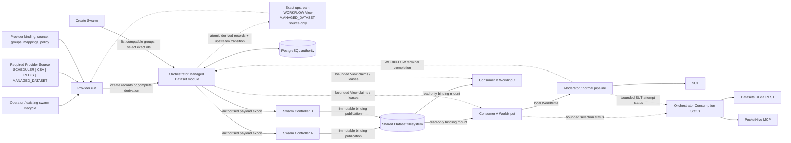

# Managed Test Data MVP Specification

Status: in progress; proposed requirements, implementation and canonical contract approval pending
Scope: Scenario Manager metadata, Orchestrator Managed Dataset module, Worker SDK adapters, UI and PocketHive MCP

## Decision required

Approve a PostgreSQL-backed Managed Dataset MVP in which one provider run with
one required `SCHEDULER`, `CSV`, `REDIS` or derived `MANAGED_DATASET` source
creates one named Dataset and zero or many consumer swarms select it
explicitly.
The Dataset is either ungrouped or contains a small frozen set of Groups whose
fields come from its Dataset Definition. Consumers dispatch reusable records
from one exact Group through the existing `WorkInput -> WorkItem -> WorkOutput`
pipeline. PocketHive also shows
whether that exact Dataset group is used at the consumer-input and SUT-attempt
boundary.

Managed Dataset is a new Dataset option alongside the existing
`REDIS_DATASET` option. Redis Dataset remains supported with unchanged
behaviour and configuration. Each bee I/O binding selects exactly one adapter;
PocketHive performs no migration, substitution or fallback between them. A
scenario may use Redis Dataset and Managed Dataset on different bindings.

Managed Dataset does not copy Redis list semantics. Every Dataset freezes one
profile. `REPLAY` keeps immutable reusable records and uses `SHARED` or
`EXCLUSIVE_LEASE`. `WORKFLOW` keeps the record payload immutable but adds
separately versioned mutable Record State, named materialised Views and
`EXCLUSIVE_LEASE` claims. A workflow completion atomically validates the
declared state transition and releases the lease. Neither profile pops, moves
or replaces record payloads, and neither infers state from a SUT result.
Scenario-owned typed Outcome Mapping converts a closed normalised outcome into
one complete next state. Named Views, not separate success and failure
Datasets, select records by outcome.

When successful processing creates independently reusable records, a bounded
derived Provider Source may consume one exact upstream `WORKFLOW` View and
create one downstream Dataset. One atomic authority completion commits the
derived records, changes the upstream Record State and releases its lease.
Non-success outcomes create no downstream records. An exact Dataset copy is a
different control-plane operation and remains outside the MVP.

For each admitted consumer binding, Orchestrator freezes the exact authority
identity and reserves deployment capacity. The per-swarm Swarm Controller then
exports that binding's immutable payload revision once through authenticated
Orchestrator REST, publishes it to a deployment-owned shared Dataset
filesystem and gives only the applicable consumer-input workers a read-only
binding mount. Workers verify the publication and load immutable local memory
before readiness. Filesystem, Swarm Controller, Orchestrator and PostgreSQL
access remain outside the measured SUT-request path.

Both allocation modes are proposed, not production-qualified. In particular,
`EXCLUSIVE_LEASE` cannot be approved for production until its concurrency,
expiry, retry, worker and authority failure, restart and soak gates pass.
Snapshot publication is supported by this design but remains performance-
unverified until the target-scale filesystem, startup, refresh and measured-
path gates in this specification pass.

## Goal

Keep reusable synthetic SUT data available for continuous test traffic while
keeping PostgreSQL, Orchestrator and credential-provider calls off the measured
request path.

```text
required provider source -> normal provider pipeline -> provider WorkOutput -> named Managed Dataset / Group
Orchestrator export -> Swarm Controller publication -> worker local memory -> normal consumer pipeline -> SUT
```

## Hard rules

| Rule | Requirement |
|---|---|
| Additive option | `REDIS_DATASET` remains supported and unchanged. Each bee I/O binding selects exactly one adapter. A scenario may use Redis Dataset and Managed Dataset on different bindings, but one binding never combines, substitutes or falls back between them. |
| Normal worker I/O | Managed Dataset adapters implement existing `WorkInput` and `WorkOutput`; no Dataset-specific RabbitMQ lane is added. |
| Explicit configuration | Every adapter, requirement and setting is explicit in its canonical contract block. Missing or unsupported values fail before provisioning. |
| One creator | One provider run creates one Managed Dataset per Managed Dataset output binding. A worker-process restart keeps that provider-run identity; a new provider run gets a new identity and Dataset. |
| Required provider source | Every Provider Scenario Binding selects exactly one frozen source from `SCHEDULER`, `CSV`, `REDIS` or `MANAGED_DATASET`. Source omission, mixing, switching and fallback fail. `SCHEDULER` and `MANAGED_DATASET` are renewable; `CSV` and `REDIS` are finite non-expiring imports. |
| Named parent | Every Managed Dataset has a required frozen `name` for people and one opaque `datasetId` for identity. Groups are subordinate partitions; they never replace either field. |
| Frozen grouping | Every Dataset Definition explicitly selects `UNGROUPED` or `GROUPED`. A grouped provider binding resolves a bounded group set before provider work starts; records cannot create, rename or change groups at runtime. |
| Mounted authoring registry | Scenario Manager loads Dataset Definition bundles from `scenarios/managed-dataset/<name>/` and reusable Dataset Schema Contracts from `scenarios/dataset-contracts/<name>/<version>/`. Mount order never establishes precedence. |
| One frozen record schema | Each Dataset Definition owns one root JSON Schema Draft 2020-12 record schema. It may compose exact versioned Dataset Schema Contracts and Dataset-local `$defs`; every record in one runtime Dataset uses the same resolved schema graph. |
| One frozen profile | Each Dataset Definition selects exactly one `REPLAY` or `WORKFLOW` profile. Runtime Datasets and consumer requirements must match it; a run never changes profile. |
| Bounded mutable state | `WORKFLOW` owns one separately versioned state schema, bounded named Views and declared transitions. State mutation requires a live matching Record Lease and expected state revision. Free-form tags, ad-hoc predicates and payload replacement are forbidden. |
| State and Views before Datasets | Lifecycle outcomes remain typed Record State and named Views in one `WORKFLOW` Dataset. Success, retryable failure, terminal failure and unknown are not separate Datasets. A new Dataset is valid only for records with an independent schema, identity, allocation, retention or lifecycle. |
| Explicit outcome mapping | A scenario-owned Outcome Normaliser emits one closed Managed Dataset Outcome. A terminal Outcome Mapping handles every class explicitly and creates one complete next state. Missing cases and defaults fail; the Dataset module never parses a SUT response or guesses an outcome. |
| Bounded derivation | `MANAGED_DATASET` Provider Source consumes one exact upstream `WORKFLOW + EXCLUSIVE_LEASE` requirement. One atomic authority completion creates bounded downstream records only for `SUCCESS`, transitions the upstream state and releases the lease. Arbitrary cross-Dataset writes and multi-destination fan-out are forbidden. |
| Provider-only templates | Group templates may use only the Provider Scenario Binding's non-secret `vars` and `sut` context. Consumers select resolved ids and never evaluate, reconstruct or compare provider templates. |
| Explicit consumers | Create Swarm uses an explicit empty selection when no Managed Dataset is required. Otherwise it requires one exact `datasetId` for each Managed Dataset consumer `bindingRef`, one exact `groupId` for `GROUPED`, and one exact `viewId` for `WORKFLOW`. A run stays pinned to them. There is no alias following, substitution or fallback. |
| Explicit allocation | `REPLAY` freezes `SHARED` or `EXCLUSIVE_LEASE` for all Groups. `WORKFLOW` requires `EXCLUSIVE_LEASE`. Modes never mix within a Dataset and consumers must match the frozen profile and allocation. |
| Per-swarm snapshot publication | The Swarm Controller exports each admitted binding revision once through Orchestrator REST, publishes one immutable physical snapshot under its swarm directory and refreshes it in bounded background work. Workers never fetch authority pages themselves. Cross-swarm file caching is deferred. |
| Typed least-privilege mounts | A deployment-owned typed Managed Dataset mount gives the Swarm Controller read-write access only to its swarm publication directory and each applicable consumer-input worker read-only access only to its required binding directory. Scenario authors choose neither storage paths nor access mode. Invalid or unhealthy storage fails provisioning. |
| Local measured path | Replay selection, claimed workflow dispatch, Dataset Context validation and counter increments use verified immutable local memory. Snapshot export, filesystem publication/load, refill, persistence, View-claim acquire, state-transition completion, Record Lease release and status reporting are bounded background/control-plane work. |
| PostgreSQL authority | For Managed Dataset only, PostgreSQL owns immutable records, published revision identity, publication grants, Record State, materialised View membership, state revisions, finite source imports, refill/derivation grants, receipts, lineage, Record Leases, accepted Outcome/mapping results and background-work leases. Snapshot files and worker memory are derivative caches, never authority. The Redis Dataset option retains its existing Redis-backed behaviour. |
| Bounded deployment capacity | The deployment capability profile requires explicit positive storage, mutation-rate, snapshot, filesystem, worker-memory and concurrency limits. Orchestrator admits and reserves deployment-wide capacity atomically; it never overcommits, queues unsafe work, evicts authoritative data or changes source as fallback. |
| No implicit retention deletion | MVP defines no Dataset retirement or purge state machine. Production release requires an approved operator retention and capacity runbook. Direct PostgreSQL deletion is prohibited. Limit exhaustion rejects new Dataset creation or supply while existing safe consumers remain unchanged. |
| No provider automation | The Dataset module never starts, stops, replaces, fails over or reconciles a provider swarm. |
| No inferred mutation or reconciliation | Only an explicit declared `WORKFLOW` completion may change Record State. MVP never infers state from a SUT result and never corrects, revalidates, deprovisions or retires SUT objects. |
| Secrets by reference | Scenario bundles may contain SUT context, templates and mappings. They contain secret references, never secret values. |
| No fallback | Invalid, stale, unavailable or mismatched configuration fails explicitly. PocketHive never switches Dataset, adapter, provider or snapshot implicitly. |
| One consumption view | Orchestrator alone derives `ManagedDatasetConsumptionStatus`; REST, MCP and UI do not reimplement its checks. Missing or stale input produces `UNKNOWN`, never inferred health. |
| Non-blocking telemetry | Consumption reporting failure never blocks Dataset selection or SUT traffic. Status is operational evidence, not audit-grade delivery proof. |

## Supported MVP

- Existing Redis Dataset scenarios continue to use `REDIS_DATASET` unchanged.
- New scenarios may select `MANAGED_DATASET` explicitly when reusable records
  are required.
- One immutable provider identity and zero or many consumers per Managed
  Dataset.
- One required provider source: refill-driven `SCHEDULER`, finite mounted `CSV`,
  finite immutable `REDIS` list snapshot, or a bounded derived
  `MANAGED_DATASET` source.
- Required Dataset name and explicit `UNGROUPED` or bounded `GROUPED` mode.
- One frozen Dataset profile: immutable `REPLAY`, or bounded mutable
  `WORKFLOW` with immutable payload, versioned Record State, named materialised
  Views and declared state transitions.
- Mounted Dataset Definition bundles with one root record schema, exact reusable
  Dataset Schema Contract versions and Dataset-local custom definitions.
- Closed Managed Dataset Outcome classes and explicit Outcome Mapping into
  complete workflow state. Named overlapping Views select outcome state without
  copying records into success or failure Datasets.
- One derived `MANAGED_DATASET` Provider Source from an exact upstream
  `WORKFLOW + EXCLUSIVE_LEASE` View into one new downstream Dataset. A successful
  source item creates a bounded number of independently reusable records;
  non-success outcomes create none.
- Arbitrary Dataset-Definition Group keys resolved once from literals or the
  Provider Scenario Binding's non-secret `vars` and `sut` context.
- Explicit SUT-compatible Dataset-group listing and exact selection during
  Create Swarm.
- `REPLAY` uses explicit `SHARED` or `EXCLUSIVE_LEASE` allocation. `SHARED`
  uses deterministic local `ROUND_ROBIN`; `EXCLUSIVE_LEASE` uses bounded,
  prefetched durable Record Leases. `WORKFLOW` always uses background-prefetched
  `EXCLUSIVE_LEASE` claims from one named View.
- Non-expiring and expiring records.
- Proactive `SCHEDULER` refill to fixed minimum, target and maximum levels.
- Durable idempotent grants and receipts with stale-grant recovery.
- Verified immutable local snapshots with atomic replacement.
- Per-swarm, per-binding immutable filesystem publications created once by the
  Swarm Controller and mounted read-only only into applicable consumer-input
  workers.
- Replica-safe Orchestrator background work using PostgreSQL leases and
  fencing.
- Explicit deployment-wide Dataset, record, record/state-byte, View-
  membership, authority-rate, snapshot, filesystem and worker-memory limits
  plus an operator retention and capacity runbook.
- A minimal Managed Dataset Context needed for end-of-pipeline identity and
  expiry safety.
- Lightweight per-consumer consumption status exposed through REST, the
  existing Datasets UI area and PocketHive MCP.

## Out of scope

- Record use counts, queue/pop semantics, bounded-use and one-use records,
  per-record/per-Group/per-consumer allocation overrides, and allocation-mode
  mixing within one Dataset.
- Record Lease renewal, transfer, manual checkout, inferred SUT-outcome release
  or invalidation, and exact-use or exactly-once claims.
- Automatic SUT-outcome inference, SUT reconciliation, correction,
  revalidation, deprovisioning and outcome-driven retirement. An explicit
  Outcome Mapping and declared `WORKFLOW` State Transition are not
  reconciliation.
- Free-form mutable tags, arbitrary state patches or selectors,
  `PAYLOAD_REPLACE`, runtime-created Views or transitions, shared state-filtered
  snapshots, arbitrary cross-Dataset state transactions and multi-destination
  derivation fan-out. The one bounded atomic derivation completion is the only
  cross-Dataset MVP operation.
- Multiple providers, provider transfer, automatic provider start or failover,
  and live consumer rebinding.
- Multiple sources in one provider binding, source switching or fallback,
  rotating CSV imports, destructive Redis pop imports and refill or expiry for
  finite `CSV` or `REDIS` sources.
- Sensitive records or secrets in Dataset records.
- Active-active multi-region operation and application-owned PostgreSQL HA.
- Audit-grade delivery or SUT-acceptance proof, qualification evidence,
  evidence frames, approvals, arbitrary-window exactness, loss/duplicate
  cryptographic proof and HiveGate or HiveMind coupling. These are a future
  milestone and must not gate provider or consumer traffic.
- Per-record drill-down, exact-use or exactly-once claims, token/frame sums,
  malicious-worker resistance and custom time services.
- Runtime-created groups, provider-result-derived group identity, live
  regrouping, partial group keys and per-group access or supply overrides.
- Schema-version ranges, `latest`, external network schema resolution, live
  schema upgrade, per-record schema selection and mixed schema graphs within
  one runtime Dataset.
- Selecting all groups, multiple groups in one consumer binding, predicates,
  ranges, joins or an arbitrary Dataset query language.
- Dataset retirement, purge or automatic retention deletion. MVP retains
  records within explicit deployment bounds; deletion requires a future
  governed product contract.
- Exact Dataset clone, copy-on-write, in-place extension and aliases. A future
  Clone Dataset control-plane operation must pin one immutable source revision;
  transformation or enrichment uses the derived Provider Source instead.
- Direct Swarm Controller or worker table access to PostgreSQL, worker snapshot
  downloads, object storage, a Redis snapshot cache, another distribution
  service, another messaging plane and a cross-swarm content-addressed file
  cache. A direct read-only PostgreSQL export contract requires separate
  benchmark evidence and contract approval.

## Canonical terms

| Term | Status | Meaning | Not the same as | Source | Allowed shorthand |
|---|---|---|---|---|---|
| `WorkInput` | EXISTING | Worker SDK adapter that supplies immutable `WorkItem`s to a worker. | SUT traffic pacing. | Worker SDK | None |
| `WorkOutput` | EXISTING | Worker SDK adapter that publishes or persists a worker result. | A Dataset provider workflow. | Worker SDK | None |
| `Dataset Space` | PROPOSED | SUT-scoped authoring namespace containing versioned Dataset definitions and access policy. | Runtime record storage. | SUT/Dataset model | None |
| `Scenario Binding` | PROPOSED | Validated link between Scenario Template, SUT Environment, Dataset Space and variable profile. It produces a frozen, versioned runtime snapshot. | A provider dependency or Managed Dataset. | SUT/Dataset model | None |
| `Dataset Definition Bundle` | PROPOSED | Mounted authoring package under `scenarios/managed-dataset/<name>/` containing one `dataset.yaml`, its root `record.schema.yaml` and, for `WORKFLOW`, one `state.schema.yaml`. | A Scenario Bundle or runtime Managed Dataset. | This specification | None |
| `Dataset Schema Contract` | PROPOSED | Immutable reusable JSON Schema resource under `scenarios/dataset-contracts/<name>/<version>/schema.yaml`, referenced at one exact version by a record or state root schema. | A Dataset Definition or Dataset-local `$defs`. | This specification | None |
| `Managed Dataset Provider Source` | PROPOSED | Required tagged union in one Provider Scenario Binding that supplies provider work from `SCHEDULER`, `CSV`, `REDIS` or one exact upstream `MANAGED_DATASET` workflow requirement while preserving one frozen configuration and source provenance. | A consumer Dataset input, provider lifecycle automation, clone operation or fallback chain. | This specification | `Provider Source` after first use |
| `Managed Dataset` | PROPOSED | Named Orchestrator-owned runtime parent created by one provider run, frozen to one profile and usable by many compatible consumer bindings. | A group, Redis list or work queue. | This specification | `Dataset` after first use |
| `Managed Dataset Profile` | PROPOSED | Frozen Dataset behaviour: immutable reusable `REPLAY`, or `WORKFLOW` with immutable payload and governed mutable Record State. | A per-consumer mode or runtime fallback. | This specification | `Profile` after first use |
| `Dataset Group` | PROPOSED | Immutable runtime partition under one Managed Dataset, identified by an opaque `groupId` and one exact typed `groupKey`. `UNGROUPED` has one internal group. | A Dataset name, filter or Provider Scenario Binding. | This specification | `Group` after first use |
| `Managed Dataset Record State` | PROPOSED | `WORKFLOW`-only versioned mutable JSON object stored separately from the immutable record payload and changed only by a declared state transition under a live Record Lease. | Free-form tags, SUT truth or record payload. | This specification | `Record State` after first use |
| `Dataset View` | PROPOSED | `WORKFLOW`-only named materialised membership over bounded equality clauses on declared Record State paths. | A runtime selector, Group or copied record pool. | This specification | `View` after first use |
| `Dataset State Transition` | PROPOSED | `WORKFLOW`-only declared change from one View to another, restricted to named state paths and completed atomically with Record Lease release. | Automatic SUT inference, reconciliation or payload replacement. | This specification | `State Transition` after first use |
| `Managed Dataset Outcome` | PROPOSED | Closed normal scenario result object with class `SUCCESS`, `RETRYABLE_FAILURE`, `TERMINAL_FAILURE` or `UNKNOWN` and a required nullable bounded code. | SUT truth, a transport header, Record State or a State Transition. | This specification | `Outcome` after first use |
| `Managed Dataset Outcome Mapping` | PROPOSED | Terminal scenario configuration that maps every closed Outcome class to one complete schema-valid next state for the requirement's exact State Transition. | Regex extraction, inferred SUT truth, a default route or a Dataset selector. | This specification | `Outcome Mapping` after first use |
| `Managed Dataset Derivation` | PROPOSED | Bounded operation that consumes one leased upstream workflow record and, on `SUCCESS`, creates one or more independently identified records in one downstream Dataset while changing upstream state in the same authority transaction. | Outcome routing, an exact Dataset clone, arbitrary cross-Dataset transaction or multi-destination fan-out. | This specification | `Derivation` after first use |
| `Managed Dataset Record Lease` | PROPOSED | Durable exclusive right for one consumer run and binding to hold one record, and for `WORKFLOW` its claimed state revision and View, for one dispatched WorkItem until completion, release or fixed expiry. | A record removal, Redis pop, background-work lease or exactly-once guarantee. | This specification | `Record Lease` after first use |
| `Managed Dataset Context` | PROPOSED | Minimal `WorkItem` metadata identifying the selected binding, Dataset Group, Profile, optional View/state revision, record and validity at the SUT-attempt guard. | Consumption evidence or security attestation. | This specification | `Dataset Context` after first use |
| `Managed Dataset Snapshot Publication` | PROPOSED | Immutable, versioned filesystem export of one admitted binding's authority-owned record payload revision, published by its Swarm Controller for verified worker loading. | PostgreSQL authority, Record State, View membership or a cross-swarm cache. | This specification | `Snapshot Publication` after first use |
| `Managed Dataset Mount` | PROPOSED | PocketHive-owned typed runtime mount that resolves one deployment storage reference and fixed access scope for a Controller or applicable consumer-input worker. | Scenario-authored `docker.volumes`, a raw host path or Dataset authority. | This specification | `Dataset mount` after first use |
| `ManagedDatasetConsumptionStatus` | PROPOSED | Canonical Orchestrator read model for current operational Dataset consumption. | SUT business acceptance, exactly-once proof or audit evidence. | This specification | `Consumption Status` after first use |

The architecture proposal remains authoritative for the high-level ownership
and binding relationship between `SUT Environment`, `Dataset Space` and
`Scenario Binding`. Its illustrative aliases and state pools are not M0
runtime contracts. This specification owns proposed Managed Dataset runtime
rules. Its Dataset Definition fields are an M0 proposal for the canonical
Dataset Space schema and are not implemented until that contract is approved
and updated. Any Dataset Space alias is resolved during Scenario Binding
validation to one exact Dataset Definition version; it is not a runtime Dataset
or Group alias and Create Swarm never follows it.

## Ownership

| Concern | Owner | Must not own |
|---|---|---|
| Dataset Definition bundles, Dataset Schema Contracts and compiled schema graph | Scenario Manager Dataset Space registry | Runtime records, refill execution or worker filesystem lookup |
| Dataset name, Profile, grouping, root record/state schema references, Views and State Transitions | Dataset Definition in Scenario Manager | Reusable contract content, runtime records/state or transition execution |
| Provider Source, Groups, templates, record/initial-state mapping, allocation, derivation bounds and supply policy | Provider Scenario Binding | Dataset Definition, implicit source selection or runtime workers |
| Consumer Dataset/Profile/View requirement, one transition and local lease bounds | Consumer Scenario Template; Scenario Binding validates and freezes | Provider policy or runtime Dataset selection |
| Candidate listing, admission and frozen run configuration | Orchestrator | Automatic Dataset or provider selection |
| Groups, source imports, immutable records, payload revisions, publication grants, Record State, materialised View membership, state revisions, refill/derivation grants, receipts, lineage, Record Leases, availability and background-work leases | Orchestrator Managed Dataset module | Swarm lifecycle, filesystem publication, implicit source selection or SUT business logic |
| Per-swarm snapshot export, immutable filesystem publication, refresh coalescing, publication-cache cleanup and publication readiness | Swarm Controller | Dataset authority, record/state mutation, scenario-authored paths or measured-path selection |
| Shared Dataset filesystem, storage health and capacity | Deployment-owned storage profile and infrastructure | Dataset authority, automatic backend selection or scenario configuration |
| Typed Dataset mount resolution and enforced read-only/read-write mode | Compute adapter from frozen PocketHive runtime configuration | Silent parsing, ignored access mode or scenario-selected paths |
| Provider lifecycle | Operator and existing swarm lifecycle | Managed Dataset module |
| CSV artifacts, SUT context, templates, mappings and secret references | Provider Scenario Bundle and existing resolution flow | Dataset Definition or Managed Dataset records |
| Bounded CSV/Redis acquisition, parsing, staging, enumeration and fingerprinting; bounded Managed Dataset source claims | `MANAGED_DATASET_PROVIDER` `WorkInput` | Source policy, durable import/derivation state or result persistence |
| Snapshot manifest/chunk verification, immutable local payload memory, replay selection, workflow claim prefetch, dispatch and selection counters | Managed Dataset `WorkInput` | Filesystem publication, durable authority, state mutation or SUT traffic pacing |
| Managed Dataset Outcome validation, explicit Outcome Mapping, workflow next-state mapping and completion operation | Terminal Managed Dataset `WorkOutput` | Raw SUT parsing, transition definition, arbitrary patching or SUT inference |
| Raw protocol/business-result extraction and one closed Managed Dataset Outcome in normal WorkItem data | Scenario-owned SUT/result pipeline | Record State, View selection, authority mutation or a Dataset Context field |
| Atomic derived-record commit, upstream State Transition and lease release | Orchestrator Managed Dataset module | External SUT invocation, Outcome classification or multi-destination fan-out |
| Context propagation, terminal validation, SUT-attempt and workflow-completion counters | Worker SDK | SUT business acceptance or evidence persistence |
| Consumption Status checks and aggregation | Orchestrator application/domain service | REST, MCP, UI, logs or RabbitMQ queue inference |
| Consumption Status presentation | Existing Datasets UI and PocketHive MCP adapters | Independent status logic or direct worker access |
| SUT traffic pacing | Moderator | Dataset supply or refill demand |
| Managed Dataset client settings, storage adapter/reference, clock-health reference, per-record and deployment-wide capacity/rate limits, and Redis connection contracts | Deployment profile | Provider bindings, workers or implicit environment lookup |
| Retention, capacity forecasting and storage-exhaustion response | Deployment operator runbook | Direct PostgreSQL deletion or an implicit Dataset purge lifecycle |
| PostgreSQL availability, replication, backup and recovery | Deployment infrastructure | Application fallback logic |

## Architecture


```mermaid
flowchart LR
  OP["Operator / existing swarm lifecycle"] --> P["Provider run"]
  PS["Required Provider Source<br/>SCHEDULER | CSV | REDIS | MANAGED_DATASET"] --> P
  U["Exact upstream WORKFLOW View<br/>MANAGED_DATASET source only"] -.-> P
  B["Provider binding: source, groups, mappings, policy"] --> P
  P -->|"create records or complete derivation"| MD["Orchestrator Managed Dataset module"]
  MD <--> PG[("PostgreSQL authority")]
  CS["Create Swarm"] -->|"list compatible groups; select exact ids"| MD
  MD -->|"authorised payload export"| SC1["Swarm Controller A"]
  MD -->|"authorised payload export"| SC2["Swarm Controller B"]
  SC1 -->|"immutable binding publication"| FS[("Shared Dataset filesystem")]
  SC2 -->|"immutable binding publication"| FS
  FS -->|"read-only binding mount"| C1["Consumer A WorkInput"]
  FS -->|"read-only binding mount"| C2["Consumer B WorkInput"]
  MD -.->|"bounded View claims / leases"| C1
  MD -.->|"bounded View claims / leases"| C2
  MD -.->|"atomic derived records + upstream transition"| U
  C1 -->|"local WorkItems"| M["Moderator / normal pipeline"]
  M --> SUT["SUT"]
  M -.->|"WORKFLOW terminal completion"| MD
  C1 -.->|"bounded selection status"| O["Orchestrator Consumption Status"]
  M -.->|"bounded SUT-attempt status"| O
  O --> UI["Datasets UI via REST"]
  O --> MCP["PocketHive MCP"]
```

The measured path starts when a consumer selects a record from verified local
memory, or assigns a locally held Record Lease in `EXCLUSIVE_LEASE`. It
performs no filesystem, PostgreSQL, Swarm Controller, Orchestrator, Scenario
Manager or credential-provider call.

## Dataset creation and selection

Provider admission creates the Managed Dataset before provider workers start.
Creation is idempotent on
`providerSwarmId + providerRunId + providerBindingRef`. Repeating the same
request and contract returns the same `datasetId`; changed content fails. A
new provider run creates a new `providerRunId` and `datasetId`.

The Dataset stores its required `name`, Profile, immutable provider swarm, run,
binding and binding-version provenance, plus the frozen SUT Environment,
Dataset Definition, record-schema URI/dependencies/digest, optional
`WORKFLOW` state-schema URI/dependencies/digest, View and State Transition
definitions, Provider Source type and policy versions. `name` is a non-secret
human label copied from the Dataset Definition. It is required, non-unique and
immutable for the runtime Dataset; `datasetId` alone identifies the Dataset.
Provider ownership and source configuration never transfer.

Source status is a required closed tagged union. `SCHEDULER` has
`state: ACTIVE` and forbids `sourceFingerprint`. `MANAGED_DATASET` also has
`state: ACTIVE`, forbids `sourceFingerprint` and stores its exact frozen
upstream Dataset/Group/View, requirement and binding-version provenance. `CSV`
and `REDIS` start with `state: PENDING_IMPORT` and required
`sourceFingerprint: null`. After provider
preflight, the first valid begin-import request atomically binds the fingerprint
and changes the state to `IMPORTING`. Exact replay returns the same import;
another fingerprint fails with `SOURCE_MISMATCH`. Completion changes the state
to `COMPLETE`; failure or expiry changes it to `FAILED`. `IMPORTING`,
`COMPLETE` and `FAILED` require the bound fingerprint. No transition can clear
or replace it.

The versioned Dataset Definition lives in Dataset Space, outside every
scenario. Its Dataset Definition Bundle owns literal `name`, one root record
schema reference and the closed grouping contract; Definition metadata never
evaluates scenario templates:

```yaml
# scenarios/managed-dataset/shared-records/dataset.yaml
id: shared-records
version: 1.0.0
name: Shared Records
profile: WORKFLOW
recordSchemaRef:
  path: record.schema.yaml
workflow:
  stateSchemaRef:
    path: state.schema.yaml
  views:
    - id: ready
      match:
        all:
          - path: /phase
            equals: READY
    - id: attempted
      match:
        all:
          - path: /phase
            equals: ATTEMPTED
    - id: successful
      match:
        all:
          - path: /outcome
            equals: SUCCESS
    - id: retryable
      match:
        all:
          - path: /outcome
            equals: RETRYABLE_FAILURE
    - id: failed
      match:
        all:
          - path: /outcome
            equals: TERMINAL_FAILURE
    - id: unknown
      match:
        all:
          - path: /outcome
            equals: UNKNOWN
  transitions:
    - id: attempt-complete
      fromViewId: ready
      toViewId: attempted
      mutableStatePaths: [/phase, /outcome, /attemptCount, /lastResultCode]
    - id: retry-complete
      fromViewId: retryable
      toViewId: attempted
      mutableStatePaths: [/outcome, /attemptCount, /lastResultCode]
grouping:
  type: GROUPED
  fields:
    - name: category
      type: STRING
      maximumLength: 40
    - name: variant
      type: STRING
      maximumLength: 40
  maximumGroups: 8
```

`grouping.type` is required. `UNGROUPED` forbids all other grouping fields and
produces one internal Group. `GROUPED` requires between one and eight ordered
`fields` and `maximumGroups` between 1 and 64. Field names are unique, match
`[A-Za-z][A-Za-z0-9_]{0,63}` and may be domain-specific. MVP field types are the
closed set `STRING`, `INTEGER` and `BOOLEAN`. `STRING` requires a positive
`maximumLength` of at most 256 Unicode code points; the field is forbidden for
other types. Its resolved value must be non-empty, within that bound, free of
control characters and without leading or trailing whitespace. `INTEGER` is a
signed 64-bit value. Every listed field and no other field is present in each
Group key; `null`, nested values and type coercion are forbidden.
The example names are illustrative, not PocketHive fields. The Dataset
Definition is versioned, so changing field names, order, types or bounds
creates a new definition version.

`profile` is required. `REPLAY` forbids `workflow` and has no Record State.
`WORKFLOW` requires `workflow`, a fixed `state.schema.yaml`, between one and the
configured maximum Views, and between one and the configured maximum State
Transitions. View and transition ids follow the same id rule as Group fields
and are unique within the Definition.

Each View contains one bounded non-empty `match.all` array. A clause has one
JSON Pointer `path` and one primitive `equals` value; arrays, objects, ranges,
OR, negation, expressions and author-supplied SQL are forbidden. Scenario
Manager validates each path and value against the state schema. Orchestrator
materialises membership rows transactionally whenever initial or next state is
committed; runtime consumers never evaluate the predicate or submit another
selector.

Each State Transition requires `fromViewId`, `toViewId` and a bounded non-empty
set of unique `mutableStatePaths`. Both Views and every path must exist in the
same Definition. Completion supplies a full next-state object. Orchestrator
requires the claimed current state to remain in `fromViewId`, permits changes
only at the declared paths, validates the complete next state and requires it
to match `toViewId`. State may also match other declared Views. No state update
can change payload, Group or Dataset identity.

The example deliberately uses one umbrella `attempted` target View plus
overlapping outcome Views. One `attempt-complete` transition can therefore
finish in its declared target and also make the record selectable through
exactly one of `successful`, `retryable`, `failed` or `unknown`. Those Views do
not copy or move the record. A retry uses the separate declared
`retry-complete` transition. Dataset-specific definitions may use other state
names, but the Outcome Mapping contract remains closed and explicit.

### Mounted Dataset definitions and schema contracts

Scenario Manager uses the existing mounted `scenarios` authoring root with
three explicit registries:

```text
scenarios/
  bundles/<scenario-name>/scenario.yaml
  managed-dataset/<dataset-name>/dataset.yaml
  managed-dataset/<dataset-name>/record.schema.yaml
  managed-dataset/<dataset-name>/state.schema.yaml  # WORKFLOW only
  dataset-contracts/<contract-name>/<version>/schema.yaml
```

`dataset.yaml` is the only Dataset Definition entry point. Its directory name
must equal `id`, `version` is required SemVer and `recordSchemaRef.path` must be
the exact bundle-relative value `record.schema.yaml`. `WORKFLOW` also requires
`workflow.stateSchemaRef.path: state.schema.yaml`; `REPLAY` forbids that file
and reference. Scenario Manager rejects duplicates, case-colliding names, path
traversal, symbolic-link escape, missing or unexpected entry points and
directory/declared-identity mismatches. It never uses mount order, another
directory or a previous version as fallback.

A published `id + version` is immutable. Reloading the same pair with changed
`dataset.yaml`, record/state root schema, contract references, Views,
Transitions or local definitions fails.
Any such change requires a new Dataset Definition version; selecting a newer
Dataset Schema Contract also requires a new root schema and Definition version.
Removing a mounted bundle does not mutate a frozen runtime Dataset or erase its
stored registry version.

`record.schema.yaml` is one JSON Schema Draft 2020-12 root for the complete
record. Its `$id` is
`pockethive://managed-dataset/<dataset-id>/<definition-version>/record`. Within
explicit deployment bounds, it may use `$ref` to compose zero or more immutable
Dataset Schema Contracts at exact versions and may contain Dataset-local custom
definitions under `$defs`. A local definition is versioned with the Dataset
Definition. A definition that needs independent versioning or reuse must become
a Dataset Schema Contract. For example:

```yaml
$schema: https://json-schema.org/draft/2020-12/schema
$id: pockethive://managed-dataset/shared-records/1.0.0/record
type: object
additionalProperties: false
required: [identity, details, extension]
properties:
  identity:
    $ref: pockethive://dataset-contracts/base-identity/2.1.0
  details:
    $ref: pockethive://dataset-contracts/record-details/1.4.0
  extension:
    $ref: "#/$defs/extension"
$defs:
  extension:
    type: object
    additionalProperties: false
    required: [label]
    properties:
      label:
        type: string
        maxLength: 40
```

For `WORKFLOW`, `state.schema.yaml` is a second Draft 2020-12 root with `$id`
`pockethive://managed-dataset/<dataset-id>/<definition-version>/state`. It is a
JSON object schema and may compose exact Dataset Schema Contracts and local
`$defs` under the same rules as the record root. It validates only Record State;
the immutable record payload remains governed solely by `record.schema.yaml`.
The resolved MVP state shape is a closed object-property tree: every object
uses declared `properties` and `additionalProperties: false`; selectable or
mutable paths do not cross arrays, `patternProperties`, unions or conditional/
dynamic schema branches. A View path resolves to one primitive-typed leaf.
Mutable paths are non-root, unique and prefix-disjoint. These restrictions make
path typing, state diffs and materialised membership deterministic; a richer
state-schema language requires a later contract version.

M0 publishes one versioned, machine-readable PocketHive schema-profile
meta-schema for record and state authoring plus positive and negative
conformance vectors. It pins Draft 2020-12, the supported vocabulary and the
closed keyword subset used by these restrictions. Scenario Manager rejects an
unknown or unsupported keyword; it never treats it as an annotation or lets a
different validator choose behaviour. The validator implementation/version
and meta-schema id are frozen in the registry revision. Prose and examples do
not create a second schema profile.

```yaml
$schema: https://json-schema.org/draft/2020-12/schema
$id: pockethive://managed-dataset/shared-records/1.0.0/state
type: object
additionalProperties: false
required: [phase, outcome, attemptCount, lastResultCode]
properties:
  phase:
    type: string
    enum: [READY, ATTEMPTED]
  outcome:
    type: string
    enum: [NONE, SUCCESS, RETRYABLE_FAILURE, TERMINAL_FAILURE, UNKNOWN]
  attemptCount:
    type: integer
    minimum: 0
  lastResultCode:
    type: [string, "null"]
    maxLength: 80
```

Each Dataset Schema Contract has the canonical URI
`pockethive://dataset-contracts/<name>/<version>`, stored at the matching
`scenarios/dataset-contracts/<name>/<version>/schema.yaml`. Its `$id` must equal
that URI, its directory version must be SemVer and its `$schema` must select
Draft 2020-12. Published versions are immutable. References using `latest`, a
version range, an unversioned id, HTTP(S), an unsupported dialect, an
unresolved contract or a cross-contract cycle fail publication. MVP loads only
each package's required `schema.yaml`; there is no wildcard schema discovery.

Scenario Manager loads and validates Dataset Schema Contracts first, Dataset
Definition Bundles second and scenario references third. It compiles each root
graph once, applies explicit deployment limits for registry size, schema bytes
and the reference graph, and publishes the registry revision atomically. The
record graph and, for `WORKFLOW`, state graph each have one derived digest and
resolved dependency list. These are stored metadata, not another authoring
contract. Each persisted compiled artifact contains its root and every resolved
schema resource. Scenario Manager alone assigns each digest once as `sha256:`
followed by 64 lowercase hexadecimal digits over the exact persisted artifact bytes.
Orchestrator, workers, status adapters and MCP treat that value as opaque and
compare it exactly; they never recompile, canonicalise or hash the graph.

An invalid reload is one failed transaction: Scenario Manager publishes no
partial registry revision, keeps the last successfully published revision
active and reports the rejected bundle, contract and reference paths. This is
registry transaction safety, not Dataset Definition version fallback; changed
content is never admitted under an existing `id + version`.

The Scenario Manager deployment profile requires positive
`maximumDatasetDefinitionBundles`, `maximumDatasetContractVersions`,
`maximumSchemaBytesPerFile`, `maximumCompiledSchemaBytes`,
`maximumSchemaReferences`, `maximumSchemaReferenceDepth` and
`maximumRecordValidationErrors`, plus positive `maximumStateValidationErrors`,
`maximumDatasetViews`, total `maximumDatasetViewClauses`,
`maximumDatasetTransitions` and total `maximumMutableStatePaths`. None has an
implicit default. Exceeding a registry/definition bound fails publication.
Record or state validation error locations are truncated only at their named
configured count without accepting the object.

Mounted files are authoring/import inputs. Scenario Manager remains the
versioned Dataset Space registry. Orchestrator receives the resolved Dataset
Definition version, Profile, record/state root schema identities, dependency
versions, digests, Views and Transitions, then freezes them into the runtime
Dataset. Orchestrator and workers never discover or resolve `/app/scenarios`
files. A provider receipt is committed only after its mapped record and, for
`WORKFLOW`, initial Record State validate against their frozen compiled roots.

Two resolved Group keys are equal only when every defined field has the same
typed value; string comparison is exact and case-sensitive. Orchestrator does
not trim, normalise or otherwise rewrite resolved values.

The Provider Scenario Binding references the Dataset Definition and owns one
required Provider Source plus the concrete group set because only that binding
has the applicable source, `vars` and `sut` context:

```yaml
providerDataset:
  datasetDefinitionId: shared-records
  source:
    type: SCHEDULER
  allocation:
    type: EXCLUSIVE_LEASE
    recordLeaseDuration: PT2M
    maximumActiveRecordLeases: 100
  groups:
    - groupKey:
        category: "{{ vars.recordCategory }}"
        variant: "{{ sut.type }}"
```

`source` is a required tagged union:

| `source.type` | Required settings | MVP behaviour |
|---|---|---|
| `SCHEDULER` | No source-specific block; the supply policy already owns refill cadence, capacity and completion bounds. | Renewable. The Provider Source dispatches only authority-granted refill items. |
| `CSV` | `csv.artifactRef`, one ASCII `delimiter` other than double quote, CR, LF or NUL, `charset: UTF-8` and `header: true` | Finite. The literal artifact reference is confined to the provider Scenario Bundle; bytes are hashed and rows are read once in stable order. Rotation and external URLs are forbidden. |
| `REDIS` | `redis.connectionRef`, literal `listName`, `itemFormat: JSON`, `snapshotMode: COPY` and positive `snapshotTtl` | Finite. The source list is copied once to an immutable provider-run staging key and read in stable index order. Pop, sampling and live-list reads are forbidden. |
| `MANAGED_DATASET` | `managedDataset.sourceBindingRef`, positive `minimumDerivedRecordsOnSuccess` and `maximumDerivedRecordsPerSource` | Renewable. The source binding resolves one exact upstream `WORKFLOW + EXCLUSIVE_LEASE` requirement and View. Authority dispatches only leased derivation items and never follows another Dataset or View. |

Exactly the matching settings block is present; `SCHEDULER` forbids all three
source-specific blocks. `CSV` and `REDIS` require
`lifecycle.type: NON_EXPIRING` and
`replacementHeadroom: 0`. A CSV row becomes one object keyed by its unique,
non-empty header names. Parsing accepts valid quoted fields, doubled-quote
escaping and LF or CRLF records; malformed UTF-8, quoting, headers or row width
fails the whole import. Each Redis item must be one UTF-8 JSON object.

For `MANAGED_DATASET`, `sourceBindingRef` references exactly one
`managedDatasetRequirements[].bindingRef` in the same Provider Scenario
Template. That requirement must use `WORKFLOW`, `READ_STATE_TRANSITION`,
`EXCLUSIVE_LEASE`, one exact View and one exact transition. It contains no
runtime ids. Create Swarm requires the normal exact `datasetSelections` entry
for that source binding and freezes the resulting upstream Dataset, Group and
View into the provider run. The downstream provider binding may have exactly
one Managed Dataset output binding. Another upstream requirement, destination
output, source type or live rebinding fails before provisioning.

The two record-count bounds satisfy
`1 <= minimumDerivedRecordsOnSuccess <= maximumDerivedRecordsPerSource` and
the deployment's positive maximum. `SUCCESS` completion must create within
that range. `RETRYABLE_FAILURE`, `TERMINAL_FAILURE` and `UNKNOWN` must create
zero derived records. A source item may target only the destination Group
assigned before dispatch. The provider result cannot select a destination
Dataset or Group.

Illustrative derived provider binding:

```yaml
providerDataset:
  datasetDefinitionId: derived-records
  source:
    type: MANAGED_DATASET
    managedDataset:
      sourceBindingRef: sourceRecords
      minimumDerivedRecordsOnSuccess: 1
      maximumDerivedRecordsPerSource: 20
  allocation:
    type: SHARED
```

Here `derived-records` is a `REPLAY` Dataset Definition, so the downstream
records are independently reusable by shared consumers.

The same Provider Scenario Template declares the `sourceRecords` workflow
requirement using the canonical consumer requirement shape. Its Provider
Scenario Binding and Create Swarm selection freeze the upstream Dataset,
Group, View and transition; the block above never repeats them.

The provider binding freezes the source type and settings. The content
fingerprint is `sha256:` plus 64 lowercase hexadecimal digits. CSV
hashes the exact artifact bytes before decoding. Redis hashes, in list-index
order, each raw item as an unsigned 64-bit big-endian byte length followed by
those exact bytes. The first import binds that fingerprint to the Dataset as
safe provenance; paths, Redis keys, credentials and source values are not
exposed to consumers, metrics or normal logs. A Redis staging copy expiring
before completion fails the import; PocketHive never reads the live list or
falls back to pop.

`connectionRef` resolves one exact entry in the deployment profile's Managed
Dataset Redis connection registry. That entry alone owns the endpoint, TLS,
declared standalone or cluster topology and credential reference. The staging
key is deterministic for the provider run and binding. The adapter creates it
without replacement using one `MULTI/EXEC` operation that runs `COPY` and
applies expiry. It validates the separate result of every queued command;
`EXEC` success alone is not treated as all-or-nothing success. If `COPY`
succeeds but expiry fails, the adapter deletes only its deterministic staging
key and fails the import. Cleanup failure raises
`REDIS_STAGING_CLEANUP_FAILED`, blocks that provider run and never reads or
changes the live list. An existing key is accepted only when an exact restart
reproduces its fingerprint and its remaining TTL exceeds the bounded import
horizon. For cluster topology, `listName` must contain a non-empty Redis hash
tag and the staging key must reuse it so both keys occupy one slot. Unsupported
topology, copy/expiry/cleanup failure, collision or fingerprint mismatch fails
explicitly. Deployment limits bound source items, bytes and copy duration
because collection `COPY` cost grows with source size.

Before a finite import, the `MANAGED_DATASET_PROVIDER` `WorkInput` performs a
bounded preflight. It validates source size, item count, CSV headers and
quoting, Redis staging-copy creation, source-item parsing and, for `GROUPED`, an explicit
`source.groupMapping` from Dataset Definition field name to source JSON
Pointer. `MANAGED_DATASET` performs the same complete Group-mapping validation
against the frozen upstream record schema before its first derivation grant.
Its pointers start at the upstream immutable `record`; Record State and
provider output are forbidden inputs. `source.groupMapping` is forbidden for
`UNGROUPED` and `SCHEDULER`. Its keys must exactly equal `grouping.fields`.
Redis and Managed Dataset pointers retain JSON types. CSV fields are strings
and may map only to string Group fields; there is
no implicit type coercion. Every source item must resolve to exactly one already
frozen Group. Unmatched, ambiguous or invalid items fail the import and cannot
create a Group. Stable source-item identity is the frozen source fingerprint
plus one-based CSV row or Redis list index; a CSV position counts logical data
records after the header, not physical lines, and duplicate values remain
distinct items. `sourceItemKey` is `sha256:`
plus lowercase SHA-256 hex over UTF-8
`sourceType + "\n" + sourceFingerprint + "\n" + decimalPosition`.

`groups` is required and non-empty for `GROUPED` and forbidden for
`UNGROUPED`. Group-key leaves may be typed literals or templates accepted by
the existing Orchestrator create-time renderer. Templates may read only the
provider binding's non-secret, allowlisted `vars` and non-secret `sut` metadata.
Orchestrator resolves them once before Dataset creation or provider work,
validates the resulting object against `grouping.fields`, rejects missing,
additional, mistyped or unresolved values, secret material, duplicate resolved
keys and field/count bound violations, then freezes the set. It assigns one opaque
`groupId` to each resolved key; an idempotent creation replay returns the same
ids.

Provider result mapping may populate record fields and validate an echoed
group attribute, but it cannot derive, create or change group identity. Each
refill item already targets one frozen `groupId`; its receipt can commit only
to that Group. Each derivation item likewise carries one preassigned
destination `groupId`; every derived record in that item commits only there. A
configuration change requires a new provider binding version
and provider run, which creates a new Dataset. This rule keeps proactive
per-group refill and readiness deterministic.

For `WORKFLOW`, the provider binding also owns one typed `initialStateMapping`.
Every receipt must produce a complete state object that validates against the
frozen state schema and belongs to at least one declared View. The receipt
atomically commits immutable payload, initial `stateRevision: 1` and all
materialised View memberships. `REPLAY` forbids `initialStateMapping` and state
values. A provider can initialise state; it cannot execute a State Transition.

The Consumer Scenario Template is the single source of truth for Dataset
requirements and local allocation settings. It contains no runtime Dataset id,
provider template or refill policy:

```yaml
managedDatasetRequirements:
  - bindingRef: inputRecords
    datasetDefinitionId: shared-records
    profile: WORKFLOW
    access: READ_STATE_TRANSITION
    allocation:
      type: EXCLUSIVE_LEASE
      acquireBatchSize: 10
      maximumHeldRecordLeases: 20
      acquireInterval: PT1S
    workflow:
      viewId: ready
      transitionId: attempt-complete
      allowReleaseUnchanged: false
      completionRole: dataset-completion
      completionLagTolerance: PT30S
```

`bindingRef`, `datasetDefinitionId`, `profile`, `access` and `allocation.type`
are required. `REPLAY` requires `access: READ`, allows `SHARED` or
`EXCLUSIVE_LEASE` and forbids `workflow`. `WORKFLOW` requires
`access: READ_STATE_TRANSITION`, `EXCLUSIVE_LEASE` and one `workflow` block.
That block names one declared View, exactly one declared `transitionId`,
required explicit `allowReleaseUnchanged`, one completion role and positive
completion-lag tolerance. A binding that needs another transition declares a
separate requirement. `SHARED` forbids the three lease settings;
`EXCLUSIVE_LEASE` requires them. Templates, aliases, runtime Dataset/Group ids
and an omitted profile or allocation are forbidden. Validation requires a
one-to-one match between each requirement and either one
`inputs.type: MANAGED_DATASET` binding by `bindingRef` or one
`source.type: MANAGED_DATASET` `sourceBindingRef`; the same requirement cannot
serve both. Unmatched or duplicate entries fail during Scenario Binding
validation. The resulting Consumer
Scenario Binding freezes the validated requirement array against one SUT
Environment and Dataset Space; it does not author or alter requirements. A
validated template with no Managed Dataset input uses the explicit shape
`managedDatasetRequirements: []`.

M0 contract activation includes a mechanical migration of existing Scenario
Templates to that explicit empty array. Runtime never treats an omitted field
as empty. Existing direct `SCHEDULER`, `CSV_DATASET` and `REDIS_DATASET`
adapter behaviour remains unchanged; only the compiled Scenario Template shape
becomes explicit before the new contract is enabled.

Create Swarm derives required Dataset bindings from the Scenario Binding's
frozen requirement array. When it is empty, Create Swarm skips Dataset
discovery and the request carries `datasetSelections: []`. Otherwise, for each
requirement, Create Swarm lists compatible Datasets, Groups or Views whose
frozen SUT, Dataset Definition version, Profile, compiled schema digests,
grouping fields, access contract and required allocation match. Each candidate
includes `datasetId`, Dataset `name`, Profile, grouping type, allocation and,
for `GROUPED`, `groupId`, safe resolved `groupKey` and Group availability. A
`WORKFLOW` candidate also includes the exact `viewId`, bounded
eligible/unleased counts and state-schema digest, never state values. The operator
supplies one closed selection shape:

```yaml
datasetSelections:
  - bindingRef: inputRecords
    selection:
      type: VIEW
      datasetId: shared-records-provider-run-20260805
      groupId: group-01
      viewId: ready
```

`selection.type: DATASET` requires `datasetId` and forbids `groupId`; it is
valid only for `REPLAY + UNGROUPED`. `selection.type: GROUP` requires both ids,
forbids `viewId` and is valid only for `REPLAY + GROUPED`.
`selection.type: VIEW` requires `datasetId`, concrete `groupId` and the exact
requirement `viewId`; it is valid only for `WORKFLOW`, including the internal
Group of an ungrouped Dataset. Orchestrator revalidates the exact candidate and
freezes the ids into the run. It injects the internal Group id for an
`UNGROUPED` replay selection so every runtime adapter has one required concrete
`groupId`. Only `READY` Groups with sufficient declared Record Lease capacity,
when applicable, can be admitted; a `WORKFLOW` View may be temporarily empty
and wait for another workflow without becoming a different selection. Other
Groups remain visible with reason codes. Different bindings and swarms may
select the same Group or View subject to the frozen Profile and Record Lease
rules. Consumers never evaluate Group templates, View predicates, compare keys
or follow an alias. The selections array must contain exactly one entry for
every Managed Dataset input binding and no entries for any other binding; it
cannot be omitted, partially supplied or used to attach a Dataset to a swarm
that does not declare one. A consumer that needs two Groups declares two
bindings.

## Worker I/O contract

The examples below are normative for nesting and illustrative for names. M0
must add the enum values and closed settings schemas to the canonical worker
I/O contracts and capability manifests.

Adapter choice is per bee I/O binding. `inputs.type` or `outputs.type` names
one adapter and its matching settings block; conflicting blocks fail schema
validation. Existing direct `SCHEDULER`, `CSV_DATASET` and `REDIS_DATASET`
inputs remain unchanged. They do not become Managed Dataset providers
implicitly. A Provider Scenario Binding instead uses one explicit
`MANAGED_DATASET_PROVIDER` input whose frozen Provider Source selects the
source handler; no binding mixes or fails over between handlers.

The first provider bee obtains refill or finite-import work through its input
adapter:

```yaml
role: provider-source
config:
  inputs:
    type: MANAGED_DATASET_PROVIDER
    managedDatasetProvider:
      bindingRef: supplyRecords
      batchSize: 100
  outputs:
    type: RABBITMQ
```

`batchSize` is only the positive bounded maximum number of source WorkItems
fetched per adapter call. It does not select a source or define supply; the
Provider Scenario Binding remains the sole owner of source settings and supply
policy.

The terminal provider bee persists mapped results through a separate output
adapter:

```yaml
role: provider-store
config:
  inputs:
    type: RABBITMQ
  outputs:
    type: MANAGED_DATASET
    managedDataset:
      bindingRef: supplyRecords
      operation: CREATE_RECORD
```

Both `bindingRef` values resolve the same provider binding. Orchestrator
injects its created `datasetId`, Provider Source and frozen Group descriptors
into both runtime adapter blocks. `SCHEDULER` obtains Group-scoped refill
grants. `CSV` and `REDIS` create one finite source import after successful
preflight and dispatch every source item once in stable order.
`MANAGED_DATASET` acquires bounded derivation grants from its exact upstream
View and dispatches each leased source record with current state once for that
grant item. Work between the first and terminal bees follows normal PocketHive
topology. The provider binding owns source settings, SUT template and typed
source/result mappings. `CREATE_RECORD` is required for `SCHEDULER`, `CSV` and
`REDIS`; `WORKFLOW` destinations also map one complete initial Record State.
`MANAGED_DATASET` instead requires `COMPLETE_DERIVATION`. Another operation or
a state value under a `REPLAY` destination fails before provisioning.

The Scenario Manager capability manifest for the provider-source image declares
a required, unique `managedDatasetProviderSources` array whose closed values
are `SCHEDULER`, `CSV`, `REDIS` and `MANAGED_DATASET`. Admission requires the selected source
value; missing or unsupported capability fails before provisioning and never
selects another source. Workers do not publish or negotiate this capability.

Each provider WorkItem carries one SDK-owned structured
`MANAGED_DATASET_PROVIDER_CONTEXT` header in the normal JSON WorkItem body.
Its wire key is `ph.dataset.provider.context`; it is not a broker or
observability header. Every value contains `schemaVersion`, `datasetId`,
`groupId`, `bindingRef`, `sourceType` and `workType`. `workType: REFILL` adds
`grantId`, `grantItemId`, `providerOperationKey` and `grantExpiresAt` and is
valid only for `SCHEDULER`. `workType: IMPORT` adds `importId`,
`sourceItemKey`, `sourceFingerprint` and positive `sourcePosition` and is valid
only for `CSV` or `REDIS`. `workType: DERIVATION` adds `derivationGrantId`,
`derivationItemId`, `providerOperationKey`, `grantExpiresAt`,
`sourceBindingRef`, source Dataset/Group/record/View/lease ids, source payload
and state revisions, and the preassigned destination `groupId`; it is valid
only for `MANAGED_DATASET`. The source Dataset values are also represented by
one normal SDK-owned `MANAGED_DATASET_CONTEXT` so the standard SUT-attempt guard
and Consumption Status evidence chain apply. No other fields are allowed. The terminal adapter
rejects a missing, changed or wrong-kind context before any write. Authors and
intermediate workers never construct or change this header.

For `MANAGED_DATASET`, the provider input dispatches the normal workflow shape
`{"record":<source-record>,"recordState":<current-source-state>}` and preserves
both Contexts. Its terminal output uses `operation: COMPLETE_DERIVATION`, the
destination provider `bindingRef`, the upstream `sourceBindingRef`, the same
closed four-case `outcomeMapping` contract defined below and one
`derivedRecordsMapping.sourcePath`. That path must resolve to a bounded array
whose one-based position is the record ordinal. Every element is the closed
object `{"record":<destination-record>,"initialState":<object-or-null>}`.
`initialState` is a complete object for a `WORKFLOW` destination and exactly
`null` for `REPLAY`. A `SUCCESS` case requires the configured record-count
range; every other case requires an empty array. Destination Dataset and Group
identity come only from Provider Context and cannot be templated or returned by
the scenario.

A consumer declares its dispatch trigger under the adapter-specific block:

```yaml
role: dataset-source
config:
  inputs:
    type: MANAGED_DATASET
    managedDataset:
      bindingRef: inputRecords
      ratePerSec: 500
      sutAttemptRole: sut-client
      sutAttemptGuard:
        maximumInvocationDuration: PT5S
        maximumClockSkew: PT1S
      consumptionObservation:
        reportInterval: PT5S
        staleAfter: PT20S
        observationWindow: PT15S
        pipelineLagTolerance: PT30S
  outputs:
    type: RABBITMQ
```

Create Swarm injects the selected `datasetId`, concrete `groupId`, Profile and,
for `WORKFLOW`, `viewId` into `config.inputs.managedDataset` in the frozen
runtime configuration. This is runtime materialisation, not an authoring
default.

`bindingRef` must resolve exactly one frozen Consumer Scenario Template
requirement.
Create Swarm injects that requirement's allocation mode and local settings into
the frozen adapter configuration. `EXCLUSIVE_LEASE` acquires only from its
frozen Dataset Group and, for `WORKFLOW`, its frozen View. It keeps at most
`maximumHeldRecordLeases` active or pending-completion leases and never changes
Profile, View or mode at runtime. A workflow claim carries the authority-read
state object and `stateRevision`; mutable state is never selected from an
ordinary shared snapshot.

The consumer `WorkInput` owns one explicit payload shape. `REPLAY` dispatches
the schema-valid record as the normal WorkItem payload, matching existing
Dataset-input use. `WORKFLOW` dispatches the closed JSON object
`{"record": <schema-valid record>, "recordState": <current schema-valid state>}`.
The state object is business data available to normal templates; it is not a
header or observability context. Downstream workers may produce their normal
payloads, but they must preserve Dataset Context, and only the declared
completion mapping can construct the next complete Record State.

A `WORKFLOW` scenario has one declared terminal completion role. It may be the
`sutAttemptRole` when that bee's output is the terminal Managed Dataset
adapter, or one later terminal role. Its output is explicit:

```yaml
role: dataset-completion
config:
  inputs:
    type: RABBITMQ
  outputs:
    type: MANAGED_DATASET
    managedDataset:
      bindingRef: inputRecords
      operation: COMPLETE_STATE_TRANSITION
      outcomeMapping:
        sourcePath: /outcome
        cases:
          SUCCESS:
            nextStateMapping:
              phase: ATTEMPTED
              outcome: SUCCESS
              attemptCount: "{{ payload.attemptCount }}"
              lastResultCode: "{{ payload.outcome.code }}"
          RETRYABLE_FAILURE:
            nextStateMapping:
              phase: ATTEMPTED
              outcome: RETRYABLE_FAILURE
              attemptCount: "{{ payload.attemptCount }}"
              lastResultCode: "{{ payload.outcome.code }}"
          TERMINAL_FAILURE:
            nextStateMapping:
              phase: ATTEMPTED
              outcome: TERMINAL_FAILURE
              attemptCount: "{{ payload.attemptCount }}"
              lastResultCode: "{{ payload.outcome.code }}"
          UNKNOWN:
            nextStateMapping:
              phase: ATTEMPTED
              outcome: UNKNOWN
              attemptCount: "{{ payload.attemptCount }}"
              lastResultCode: "{{ payload.outcome.code }}"
```

The adapter derives the exact frozen `transitionId` from `bindingRef`; authors
do not repeat it in worker configuration. The normal scenario pipeline must
produce one closed normal payload object
`{"outcome":{"class":<class>,"code":<string-or-null>}}`. `class` is exactly
`SUCCESS`, `RETRYABLE_FAILURE`, `TERMINAL_FAILURE` or `UNKNOWN`; `code` is
required, nullable and bounded by the executable Worker I/O contract. Existing
`resultRules` may extract a business code for the normaliser, but neither regex
nor a step header changes Dataset state directly.

`outcomeMapping.sourcePath` is one JSON Pointer to that complete Outcome. Its
`cases` object must contain all four classes exactly once and forbids a default.
The selected `nextStateMapping` produces one complete state object; it is not a
JSON patch. Every case must satisfy the requirement's one declared target View;
overlapping Views may then expose its outcome. `RETRYABLE_FAILURE` labels state
for a separately declared retry workflow; it does not authorise an automatic
SUT retry. `UNKNOWN` is required for an observed timeout, connection loss or
other ambiguous terminal result and cannot create derived records. A worker
crash or missing terminal output supplies no Outcome, changes no state and
leaves the lease unavailable until valid completion or expiry.

`RELEASE_RECORD_LEASE` is the only alternative
`WORKFLOW` operation and is accepted only when
`allowReleaseUnchanged: true`; it forbids transition and state fields. The
terminal adapter uses the unchanged Dataset Context, makes one idempotent
background completion call and ends that WorkItem. A missing completion,
invalid transition or process failure leaves the record unavailable until
lease expiry; no SDK hook silently releases it.

`ratePerSec` controls how quickly `WorkInput` supplies `WorkItem`s. It does not
deplete records or create refill demand. Moderator remains responsible for SUT
traffic pacing. `sutAttemptRole` is the one scenario node whose instances
may make SUT attempts for this binding in MVP. M0 adds the required capability
enum `managedDatasetSutAttemptGuard` with closed values `SUPPORTED` and
`UNSUPPORTED`; the Scenario Manager capability manifest for that role's image
must declare `SUPPORTED`. Missing capability, an unknown role or more than one
SUT-attempt role fails before provisioning. For `REPLAY + EXCLUSIVE_LEASE`, the
same manifest must also declare the closed capability
`managedDatasetRecordLeaseRelease: SUPPORTED`; the SDK releases after that role
completes all permitted SUT calls and its normal output handoff. For
`WORKFLOW`, the declared completion role's manifest instead requires
`managedDatasetWorkflowCompletion: SUPPORTED`; the SUT-attempt role never
auto-releases its claim. When both responsibilities use one role, only its
explicit terminal output completes the claim. Orchestrator copies `datasetId`, `groupId`, `bindingRef`,
Profile, optional `viewId`, the required guard durations and observation
settings into the applicable roles' frozen private runtime configuration.
Authors do not repeat authority identity on either role.

The two `sutAttemptGuard` and four `consumptionObservation` values are required
and frozen with the run. `maximumInvocationDuration` covers the longest
permitted network invocation, including protocol retries.
`maximumClockSkew` is the deployment's qualified maximum absolute worker-clock
error relative to PostgreSQL time. `staleAfter` MUST be at least three report
intervals; `observationWindow` MUST be at least two;
`pipelineLagTolerance` MUST cover the scenario's declared moderator and bounded
queue delay. For `WORKFLOW`, `completionLagTolerance` MUST cover the declared
bounded delay from completion of the SUT-attempt role to invocation of the
completion adapter. There are no defaults or auto-tuning.

Worker trigger, guard and observation settings live only in the bee blocks
above. The Dataset Definition lives once in Dataset Space. Concrete Groups,
provider mapping, allocation, lifecycle, supply and capacity policy live once
in the versioned Provider Scenario Binding resolved by `bindingRef`. One allocation mode and supply
policy applies to every Group in the Dataset; a different mode or policy
requires another output binding and Dataset. The Consumer Scenario Template
owns compatibility, Profile/access, optional View/transitions, allocation
requirement and local lease bounds. The
bee adapter references these once by `bindingRef`; it never repeats them or any
provider template or policy. The Scenario Binding freezes the validated
requirements; the Managed Dataset stores its resolved provider contract; and
the consumer run stores its selection.

### Background authority API

Managed Dataset adapters and the Swarm Controller use authenticated
Orchestrator REST only for background authority work. Workers never connect to
PostgreSQL directly. The Swarm Controller is the only snapshot-export caller;
workers load the resulting read-only filesystem publication. No
Dataset-specific RabbitMQ lane is added. M0 owns closed request, response and
error schemas for these operations:

| Operation | Product API | Required contract |
|---|---|---|
| Acquire refill grant | `POST /api/managed-datasets/{datasetId}/groups/{groupId}/refill-grants` | `SCHEDULER` only. Request contains `bindingRef`, `batchSize` and `idempotencyKey`; response repeats both ids and contains `grantId`, `grantExpiresAt` and bounded `items[]` with `grantItemId` and `providerOperationKey`. |
| Stage refill receipt | `PUT /api/managed-datasets/{datasetId}/groups/{groupId}/refill-grants/{grantId}/items/{grantItemId}/receipt` | `SCHEDULER` only. Request contains `bindingRef`, `providerOperationKey`, mapped record, explicit `usableUntil` and complete `initialState` required for `WORKFLOW` and forbidden for `REPLAY`; response repeats both ids and contains the staged `recordId` and profile-required `stateRevision: 1`. It does not publish a payload revision. Exact replay returns the same response; changed replay fails. |
| Complete refill grant | `PUT /api/managed-datasets/{datasetId}/groups/{groupId}/refill-grants/{grantId}/complete` | `SCHEDULER` only. Request repeats `bindingRef`, expected item count and `idempotencyKey`. Completion succeeds only when every granted item has one valid receipt; one transaction commits the cohort and publishes at most one new payload `snapshotRevision`. Exact replay returns the same revision; changed, incomplete or stale completion fails. |
| Begin finite source import | `POST /api/managed-datasets/{datasetId}/source-imports` | `CSV` or `REDIS` only. Request contains `bindingRef`, source type/fingerprint, total item/byte counts, exact per-Group item counts and `idempotencyKey`; response contains `importId` and bounded import expiry. The first valid request binds the previously null fingerprint; exact replay returns the same import and another fingerprint fails. Counts must satisfy every Group's `targetReady..maximumReady` and deployment limits. |
| Commit finite source item | `PUT /api/managed-datasets/{datasetId}/source-imports/{importId}/items/{sourceItemKey}/receipt` | Request contains exact `groupId`, mapped record, required `usableUntil: null`, `initialState` required for `WORKFLOW` and forbidden for `REPLAY`, and `idempotencyKey`. The item key is the hash of source fingerprint, kind and one-based position, never a source value. Exact replay returns the same staged `recordId` and profile-required state revision; changed replay fails. No consumer snapshot or View exposes staged records. |
| Complete finite source import | `PUT /api/managed-datasets/{datasetId}/source-imports/{importId}/complete` | Request repeats source fingerprint, item/byte and per-Group counts plus `idempotencyKey`. Completion succeeds only when every declared item has one valid receipt, atomically publishes the first Group revisions and marks the source complete. Exact replay returns the same revisions; changed, incomplete or expired completion fails. |
| Acquire derivation grant | `POST /api/managed-datasets/{datasetId}/derivation-grants` | `MANAGED_DATASET` source only; path Dataset is the destination. Request contains destination `bindingRef`, upstream `sourceBindingRef`, `batchSize` and `idempotencyKey`. In one transaction authority validates the frozen upstream selection, claims eligible source View members, resolves each immutable source record to one frozen destination Group, reserves the maximum downstream record/state/membership bytes and returns a bounded grant. Each item contains one derivation id, provider-operation key, expiry, source record/state/lease identity and destination Group. Empty with `retryAfter` is normal saturation or empty source View, never source substitution. |
| Complete derivation item | `PUT /api/managed-datasets/{datasetId}/derivation-grants/{derivationGrantId}/items/{derivationItemId}/completion` | Request contains both binding refs, provider-operation key, source lease/View/expected state revision, closed Outcome, frozen `outcomeMappingDigest`, its complete mapped `nextState`, bounded ordered `derivedRecords[]` and `idempotencyKey`. `SUCCESS` requires the configured record-count range; other Outcomes require an empty array. One transaction validates both Contexts, lease, revision, closed Outcome, exact mapping digest, mapped state against the transition, destination schemas, Group and all capacity deltas; creates deterministic downstream records and initial state/View membership, publishes at most one destination Group revision, changes upstream state/memberships and releases its lease. Exact replay returns the same source revision, destination revision and count; changed, partial, stale or cross-binding replay changes nothing. |
| Begin snapshot publication | `POST /api/managed-datasets/{datasetId}/groups/{groupId}/snapshot-publications` | Swarm Controller only. Request contains exact `swarmId`, `runId`, `bindingRef` and `idempotencyKey`. Orchestrator revalidates the frozen binding, reserves deployment publication/export capacity and returns `publicationId`, fencing token, expiry and one descriptor pinned to the newest eligible payload `snapshotRevision`, root schema URI/digest, record count, total bytes and whole-snapshot digest. Exact replay returns the same grant. |
| Read snapshot publication page | `GET /api/managed-datasets/{datasetId}/groups/{groupId}/snapshot-publications/{publicationId}/records?afterRecordId={cursor}&limit={limit}` | Swarm Controller only. Stable record-id order; response repeats publication, Dataset, Group, binding and revision and contains bounded immutable record envelopes, page digest, next cursor and completion flag. Record State, View membership and leases are forbidden. A stale grant or fencing token fails. |
| Complete snapshot publication | `PUT /api/managed-datasets/{datasetId}/groups/{groupId}/snapshot-publications/{publicationId}/complete` | Swarm Controller only. Request contains exact manifest, whole-snapshot and chunk digests/counts plus `idempotencyKey`. Orchestrator verifies them against the descriptor and current fencing token, releases reserved publication capacity and records the operational publication observation. Exact replay returns the same result; changed or stale completion fails. Files remain derivative cache data. |
| Acquire replay Record Leases | `POST /api/managed-datasets/{datasetId}/groups/{groupId}/record-leases` | `REPLAY + EXCLUSIVE_LEASE` only. Request contains `bindingRef`, `snapshotRevision`, `requestedCount` and `idempotencyKey`. Response repeats Dataset, Group, binding and revision, includes `authorityTime`, and contains bounded `recordLeases[]` with `recordId`, `recordLeaseId` and `recordLeaseExpiresAt`. |
| Acquire workflow View claims | `POST /api/managed-datasets/{datasetId}/groups/{groupId}/views/{viewId}/record-leases` | `WORKFLOW` only. In one transaction, selects current materialised membership, excludes active leases, validates eligibility, and grants bounded leases. Request contains `bindingRef`, payload `snapshotRevision`, `requestedCount` and `idempotencyKey`. Each result contains `recordId`, `recordLeaseId`, expiry, `viewId`, `stateRevision` and complete state. An empty list with required `retryAfter` is normal saturation or empty membership, never a mode change. |
| Complete State Transition | `PUT /api/managed-datasets/{datasetId}/groups/{groupId}/record-leases/{recordLeaseId}/state-transition` | `WORKFLOW` only. Request contains `bindingRef`, claimed `viewId`, expected state revision, allowed `transitionId`, closed Outcome, frozen `outcomeMappingDigest`, complete mapped `nextState` and `idempotencyKey`. One transaction validates lease ownership/expiry, current revision/from-View, exact mapping digest, allowed changed paths, state schema, to-View membership and storage deltas, then increments state revision, replaces materialised memberships and releases the lease. Exact replay returns the same accepted Outcome class, new revision and release result; changed replay fails. |
| Release Record Lease unchanged | `PUT /api/managed-datasets/{datasetId}/groups/{groupId}/record-leases/{recordLeaseId}/release` | `REPLAY + EXCLUSIVE_LEASE`, or `WORKFLOW` only when the frozen requirement allows unchanged release. Request contains `bindingRef`, expected Profile and `idempotencyKey`; workflow also requires claimed `viewId` and `expectedStateRevision`. It never contains or infers a SUT outcome. Exact replay returns the same `releasedAt` and resulting lease state, `AVAILABLE` or `EXPIRED`; changed or stale ownership/state fails. |

Receipt and transition validation use the applicable frozen compiled roots
before persistence. `RECORD_INVALID` or `STATE_INVALID` may return bounded
schema-keyword and JSON Pointer locations but never record/state values or an
unrestricted validator message.

Orchestrator materialises one required `managedDatasetClient` block into every
Managed Dataset runtime adapter from the deployment profile. It contains
`baseUrl`, `serviceAuthRef`, `requestTimeout`, `operationTimeout`,
`maximumAttempts` and `retryBackoff`. Values are explicit; secrets remain
behind `serviceAuthRef`. Missing values, a non-HTTPS production URL,
non-positive durations/counts or `operationTimeout < requestTimeout` fail
before provisioning.

Every request is authorised for the exact Dataset, Group, binding, run and
operation. Every API error has required `schemaVersion`, `code`, `retryable` and
`correlationId`. The closed codes are `AUTHENTICATION_FAILED` (HTTP `401`),
`AUTHORISATION_FAILED` (`403`), `CONTRACT_INVALID` (`400`),
`DATASET_NOT_FOUND`, `GROUP_NOT_FOUND`, `SNAPSHOT_REVISION_NOT_FOUND` or
`SNAPSHOT_PUBLICATION_NOT_FOUND`, `VIEW_NOT_FOUND` or
`RECORD_LEASE_NOT_FOUND` (`404`),
`BINDING_MISMATCH`, `GROUP_MISMATCH`, `PROFILE_MISMATCH`,
`ALLOCATION_MISMATCH`, `VIEW_MISMATCH`,
`SOURCE_MISMATCH`, `SOURCE_INCOMPLETE`, `IDEMPOTENCY_CONFLICT`,
`GRANT_STALE`, `IMPORT_STALE`, `DERIVATION_GRANT_STALE`, `SNAPSHOT_PUBLICATION_STALE`,
`REDIS_STAGING_CLEANUP_FAILED`, `CAPACITY_EXCEEDED`,
`RECORD_LEASE_MISMATCH` or
`RECORD_LEASE_NOT_ACTIVE`, `STATE_REVISION_CONFLICT` or
`STATE_TRANSITION_CONFLICT` (`409`),
`IDEMPOTENCY_WINDOW_EXPIRED` (`410`),
`SOURCE_INVALID`, `OUTCOME_INVALID`, `DERIVATION_INVALID`, `RECORD_INVALID`, `STATE_INVALID` or
`STATE_TRANSITION_INVALID` (`422`), `RATE_LIMITED` (`429`) and
`AUTHORITY_UNAVAILABLE` (`503`). Only the final two set `retryable: true`.
Authentication/authorisation, invalid contract, schema failure, changed replay,
source mismatch/invalidity/incompleteness, stale grant/import/derivation,
invalid Outcome/derivation, capacity
exhaustion, Profile/View mismatch, state revision/transition failure and
missing revision fail explicitly and are not retried. Only
connection reset/refusal, timeout, HTTP `408`, `429`, `502`, `503` and `504`
are retryable within `maximumAttempts` and `operationTimeout`; `Retry-After` is
honoured only within that bound. Refill, import, derivation, receipt, Record Lease
acquisition, completion, release and snapshot-publication retries reuse their original
idempotency keys.
Exhaustion fails that background operation and never changes source, adapter,
Dataset, Group or revision.
Snapshot failure preserves only a still-safe local snapshot.

Supply fields are closed and explicit:

| Field | Rule |
|---|---|
| `allocation` | Required tagged union. `REPLAY` permits `SHARED` or `EXCLUSIVE_LEASE`; `WORKFLOW` requires `EXCLUSIVE_LEASE`. `SHARED` forbids lease policy fields. `EXCLUSIVE_LEASE` requires positive `recordLeaseDuration` and per-Group `maximumActiveRecordLeases`. |
| `selection` | `REPLAY + SHARED` requires `ROUND_ROBIN`; every `EXCLUSIVE_LEASE` profile forbids local selection because authority chooses eligible records. |
| `minimumReady`, `targetReady`, `maximumReady` | Required integers; `minimumReady` is non-negative, `targetReady` and `maximumReady` are positive, and all satisfy the stated invariant |
| `replacementHeadroom` | Required non-negative integer; must be `0` for `NON_EXPIRING` |
| `lifecycle` | Required tagged union: `NON_EXPIRING`, or `EXPIRING` with `renewalLeadTime` |
| `maximumExpiryCohort` | Required positive integer for `EXPIRING`; forbidden for `NON_EXPIRING` |
| capacity timings and limits | Required explicit values; no defaults, clamping or auto-tuning |

All supply fields and formulas apply independently to one concrete Group.
Dataset totals are display and capacity aggregates only; they never authorise
admission to an unsafe Group. Admission also validates the aggregate bound
`groupCount * perGroupMaximumStored` against configured storage and provider
capacity. `UNGROUPED` has `groupCount = 1`. Allocation is frozen for the whole
Dataset and cannot be overridden by a Group, record or consumer.

## Safety invariants

### Counts and validity

- `0 <= minimumReady <= targetReady <= maximumReady`, with
  `targetReady > 0`.
- `authorityTime` is PostgreSQL `transaction_timestamp()` read in the same
  transaction that evaluates counts or commits a grant, receipt, revision or
  availability observation. Application clocks never author authority time.
- A record is **live** when its immutable commit and schema are valid and it is
  either `NON_EXPIRING` or its `usableUntil` is later than authority time.
- A record is **renewal-ready** when it is live and either non-expiring or its
  `usableUntil` is later than `authorityTime + renewalLeadTime`.
- A record is **unleased-ready** when it is renewal-ready and has no active
  Record Lease. This is an availability projection, not refill demand.
- `activeGrantedSlots` count unexpired grant items for the same Group not yet
  completed or stale.
- For expiring data,
  `maximumStored = maximumReady + replacementHeadroom`; old live records and
  their replacements may coexist only within this bound.

### Record allocation

`REPLAY + SHARED` selects safe immutable records from the local snapshot by
`ROUND_ROBIN`; many consumers may select the same record concurrently. The
scenario owner must confirm that repeated concurrent use is safe under the SUT
contract.

`EXCLUSIVE_LEASE` keeps the Dataset and Group shareable while serialising one
use of each record:

```text
AVAILABLE -> LEASED -> AVAILABLE
                    -> EXPIRED      when the record is no longer live
```

- PostgreSQL grants at most one active Record Lease per `recordId` in one
  bounded transaction. A lease is owned by the exact Dataset, Group, consumer
  run and binding, has one unique `recordLeaseId`, and cannot transfer.
- Exact acquisition replay returns the same leases or the same empty result;
  changed replay fails. Exact release replay returns the original result.
- Replay acquisition is pinned to the caller's verified `snapshotRevision`. A
  record is eligible only when it exists in that revision, is not actively
  leased and remains live beyond `authorityTime + recordLeaseDuration`.
- Workflow acquisition is pinned to the same immutable-payload revision and
  one frozen View. In one transaction, authority selects a current materialised
  member, verifies that it is unleased and live, and returns the current
  complete Record State and `stateRevision` with the lease. It never selects
  workflow eligibility from the local payload snapshot.
- The consumer input prefetches bounded leases in the background, joins each returned
  `recordId` to that pinned local snapshot and dispatches it once for that
  lease. No held lease means explicit backpressure with no alternate Dataset,
  Group or mode.
- After an empty acquisition, the consumer input retries no earlier than both its
  `acquireInterval` and the authority's `retryAfter`.
- For `REPLAY`, the SDK queues release only after `sutAttemptRole` finishes all
  permitted SUT calls and its normal output handoff. Release is bounded
  background work; it never blocks the measured path and contains no SUT
  outcome.
- For `WORKFLOW`, the claim remains active through the declared completion
  role. That role submits either one allowed complete State Transition or, when
  explicitly permitted, an unchanged release. A transition transaction checks
  lease ownership and expiry, expected state revision, from-View membership,
  allowed changed paths, the state schema and to-View membership; it then
  stores the next state, increments its revision, replaces materialised View
  memberships and releases the lease atomically.
- State cannot change while another run holds the record. Expiry or an allowed
  unchanged release leaves state and View membership unchanged. An invalid or
  stale transition changes nothing and leaves the lease active until a valid
  retry, allowed release or expiry.
- A failed release leaves the record unavailable until authority expiry. A
  graceful stop attempts to release unused held leases; a crash relies on
  expiry. The consumer input does not dispatch a lease that is too close to expiry.
- Lease renewal, transfer, payload mutation and early reuse are forbidden in
  MVP. After expiry a later acquisition receives a new id; a stale completion
  or release is rejected.

For each Group, `1 <= maximumActiveRecordLeases <= targetReady`. Create Swarm
reserves declared lease capacity, so existing reservations plus
`expectedSourceInstances * maximumHeldRecordLeases` for the requested run must
not exceed `maximumActiveRecordLeases`. It also validates
`1 <= acquireBatchSize <= maximumHeldRecordLeases` and requires
`recordLeaseDuration` to exceed the consumer's clock-skew, pipeline-lag and
maximum-invocation horizon. For `WORKFLOW`, it must also cover the frozen
completion-lag tolerance and one bounded completion `operationTimeout`. All
durations and counts are explicit and bounded by the selected deployment
capability profile.

### PostgreSQL transaction and lock contract

M1 freezes one reviewed physical data model and migration before authority code
starts. Correctness does not rely on an application-only check:

- a partial unique index on `(dataset_id, record_id)` where lease state is
  `ACTIVE` enforces at most one active Record Lease;
- unique constraints enforce Dataset/run/binding identity, Group identity,
  scoped idempotency keys, source items, derivation identity, View membership
  and published Group revision identity;
- state, membership and lease rows carry explicit revisions/fencing tokens;
  stale tokens update zero rows and fail;
- foreign keys prevent a lease, membership, receipt or publication grant from
  crossing its Dataset and Group.

Transactions use one documented lock order: deployment-capacity row when a
storage delta is possible, Dataset rows in ascending `datasetId`, Group rows in
ascending `(datasetId, groupId)`, record rows in ascending
`(datasetId, recordId)`, active lease row, Record State row, then
View-membership rows in ascending `(datasetId, viewId)`. Single-Dataset work is
the one-Dataset subset of this order. A completion resolves ids first and then
takes this order; it does not lock the lease first. Claim queries use deterministic
`ORDER BY recordId FOR UPDATE SKIP LOCKED` only for queue-like eligible-record
selection. Status and integrity reads never use `SKIP LOCKED` to hide rows.

The default authority isolation is PostgreSQL `READ COMMITTED` with those row
locks, database constraints and atomic conditional updates. SQLSTATE `40001`
and `40P01` retry only within the operation's explicit attempt/time budget and
reuse the same idempotency key; exhaustion returns the closed authority error.
No transaction changes isolation level or lock order at runtime. Replica,
failure and concurrency tests must prove the constraints, deadlock handling,
rollback and exact replay before `EXCLUSIVE_LEASE` is qualified.

### Finite source import

`CSV` and `REDIS` enumerate one immutable bounded source before import begins.
For every Group, preflight requires
`targetReady <= sourceItemCount <= maximumReady`; `UNGROUPED` has one count.
The deployment capability profile requires positive
`maximumFiniteSourceItems`, `maximumFiniteSourceBytes` and
`maximumFiniteImportDuration`; none has a default. Preflight rejects a source
outside those limits. The import expiry is exactly the configured bounded
duration, and a Redis `snapshotTtl` must be greater than it.
The adapter then opens one idempotent import, stages each validated item under
its stable source-item key and completes only after all declared items have
receipts. No staged record is selectable and no Group becomes `READY` before
atomic completion. Any fingerprint, count, Group, schema or item mismatch marks
the import failed and the Dataset `UNAVAILABLE`; it never skips the item,
publishes a partial source or changes Provider Source. An exact restart resumes
the same import and item receipts. Changed source content requires a new
Provider Scenario Binding version and provider run, producing a new Dataset.

### Scheduler refill

`SCHEDULER` refill is evaluated independently for each Group and starts proactively when
`renewalReady + activeGrantedSlots < targetReady`. Active Record Leases do not
create refill demand: leased records remain live and renewal-ready until their
normal lifecycle says otherwise. Records enter the refill deficit before
expiry because they stop being renewal-ready at the renewal lead boundary.

```text
deficit = max(0, targetReady - renewalReady - activeGrantedSlots)

maximumGrant = min(
  deficit,
  maximumReady - renewalReady - activeGrantedSlots,
  maximumStored - liveStored - activeGrantedSlots,
  adapterBatchSize
)
```

A non-positive `maximumGrant` creates no work. Counts and grant creation occur
in one bounded PostgreSQL transaction.

Refill receipts remain staged and unavailable until every item in their grant
has one valid receipt and the provider explicitly completes that grant. Grant
completion publishes the cohort in one transaction and advances the Group's
payload revision at most once. Expiry processing also publishes bounded
cohorts. Individual receipts, Record Lease operations, workflow transitions,
View membership changes and telemetry never advance the payload revision.

For expiring data, each Group requires
`replacementHeadroom >= maximumExpiryCohort`. Admission also requires a
positive refill window and enough declared provider capacity for the bounded
worst case in which every Group needs one cohort:

```text
refillWindow = renewalLeadTime - refillCycleInterval - maximumProviderCompletionTime
providerCapacityRecordsPerSecond * refillWindow >= groupCount * maximumExpiryCohort
```

### Managed Dataset derivation

`MANAGED_DATASET` source is the bounded bridge from mutable workflow processing
to independently reusable records. It is not outcome routing between physical
Datasets. Failure, retry and unknown remain upstream Record State and Views;
only a declared `SUCCESS` creates downstream records.

Orchestrator issues work only while the destination Group is below its target
and all source and destination reservations fit deployment limits. In one
short transaction it claims one current upstream View member, reserves the
configured maximum destination record/state/membership bytes and stores one
derivation item. The external SUT call and normal scenario pipeline happen
after that transaction and never run while database locks are held.

The terminal completion is the only cross-Dataset MVP transaction. It:

1. validates unchanged Provider and Dataset Contexts, both frozen bindings,
   grant/lease expiry, source View and expected source state revision;
2. validates the closed Outcome and selected complete next-state mapping;
3. requires the configured derived-record count for `SUCCESS` and zero for
   every other Outcome;
4. validates every destination record and required initial state against the
   frozen destination schemas and preassigned Group;
5. derives each immutable lineage key from source `datasetId`, `groupId`,
   `recordId`, claimed `stateRevision`, provider binding version, destination
   binding and one-based ordinal;
6. inserts the downstream records, initial states and View memberships,
   advances at most one destination Group payload revision, changes the source
   state/memberships and releases its lease; and
7. releases unused capacity reservation and returns both resulting revisions
   and the committed record count.

The whole operation commits or rolls back. A schema, capacity, lease, state,
count, lineage or mapping failure creates no downstream record, changes no
upstream state and leaves the source lease active until a valid retry or
expiry. Exact completion replay returns the stored result. Changed replay
fails. A later retry transition claims the new source state revision and gets a
new derivation identity; an earlier successful atomic completion cannot be
repeated under that revision.

The downstream Dataset stores bounded lineage metadata for each derived record:
source Dataset/Group/record id, source state revision, provider binding version,
destination binding and ordinal. Lineage is authority metadata, not record
payload, Group identity, a metric dimension or a consumer selector. A
`REPLAY + SHARED` downstream Dataset may then publish those immutable successful
records for concurrent traffic use. A different destination schema, Profile,
allocation, retention or lifecycle requires another explicit provider binding
and run; one derivation item never writes several Datasets.

### Idempotency and stale provider work

- Every mutation request requires one idempotency key. Its scope is the
  authenticated principal, closed operation code, normalized route target,
  `datasetId`, optional `groupId`, run identity, `bindingRef` and key. A key may
  be reused in another explicit scope; it never aliases another operation.
- After schema validation, Orchestrator fingerprints normalized path/query
  fields and the request body, excluding `correlationId` and the idempotency
  key, as `sha256:` plus lowercase SHA-256 over RFC 8785 JSON Canonicalization
  Scheme bytes. The stored scope, fingerprint, result and expiry are the
  idempotency authority. Another implementation or DTO does not recompute a
  different contract.
- Exact replay within the declared window returns the original status and body;
  the same scoped key with another fingerprint returns
  `IDEMPOTENCY_CONFLICT` without mutation. Every response exposes
  `idempotencyExpiresAt`.
- The deployment profile requires positive `idempotencyRetention` and
  `idempotencyTombstoneRetention`. Retention must exceed the largest configured
  operation timeout, broker-redelivery horizon, Record Lease/grant/import/
  publication expiry and clock-skew allowance. After full-response retention,
  a bounded tombstone retains the scope and fingerprint; replay during that
  period returns `IDEMPOTENCY_WINDOW_EXPIRED` and never executes again. Clients
  must not retry after that response. Expiry and storage are capacity-bounded;
  exhaustion rejects new mutations before execution.
- `correlationId` identifies one transport attempt and is new on every retry.
  The idempotency key and returned operation identity remain stable. M0 aligns
  this rule with the canonical correlation/idempotency contract before code.
- A grant request has a stable idempotency key. Exact replay returns the same
  grant; reuse with changed content fails without mutation.
- Each grant item has one stable provider-operation key and one receipt.
  Exact receipt replay returns the stored result; changed replay fails.
- A receipt stages one immutable valid record for the Group reserved by its
  grant. For `WORKFLOW`, the exact-replay identity also includes the complete
  schema-valid initial state. Grant completion commits all staged records,
  initial state revisions and View memberships atomically and publishes one
  payload revision. A record never moves between Groups. A provider failure
  publishes no record. The Dataset module does not classify SUT outcomes or retire an
  existing record.
- A grant item not receipted by `grantExpiresAt` becomes `STALE` in a fenced
  transaction and releases its reserved slot. A late receipt is rejected.
  Recovery performs no SUT call and creates no reconciliation work.
- A finite import and every source-item receipt have stable idempotency keys.
  Exact replay returns the stored result; reuse with another fingerprint,
  position, Group, record or count fails without mutation. Import expiry makes
  incomplete receipts and completion stale; recovery never reads another
  source or exposes staged records.
- A derivation grant and item completion have stable idempotency keys. The item
  identity includes both frozen bindings, the source lease/state revision and
  destination Group. The completion fingerprint includes the Outcome,
  complete next state and ordered derived records. Exact replay returns the
  original source/destination revisions and record count; changed replay fails
  before mutation. Grant expiry releases reserved destination capacity but
  never releases or changes the upstream Record Lease outside its normal
  workflow rules.
- A snapshot-publication key is bound to the swarm, run, binding, Dataset,
  Group and authority revision. Exact replay returns the same publication
  grant/result. Changed replay or an expired fencing token fails without
  making a filesystem publication authoritative.
- A workflow completion key is bound to the lease id, expected state revision,
  transition id, closed Outcome, frozen Outcome Mapping digest and complete
  next state. Exact replay returns the accepted Outcome class, stored next
  revision and release result. Changed replay, stale revision, invalid changed
  paths or a state that does not satisfy the declared to-View fails without
  changing state, membership or lease. PocketHive never infers a transition
  from payload, SUT response or timeout.

## Dataset Context and snapshots

An expiring item may wait in the normal pipeline after consumer selection. M0
therefore reserves shared global WorkItem-header constant
`MANAGED_DATASET_CONTEXT` with wire key `ph.dataset.context`. The value lives
at `WorkItem.headers[MANAGED_DATASET_CONTEXT]` inside the JSON WorkItem
envelope. It is a structured JSON object, never a JSON-encoded string, step
header, `ObservabilityContext` field or broker transport header. Transport
adapters carry it only by serialising the normal WorkItem body. Managed Dataset
items require its closed, versioned value; other items do not use it.

The Managed Dataset `WorkInput` creates the Dataset Context locally at selection
with exactly these
fields:

| Field | Rule |
|---|---|
| `schemaVersion` | Required supported integer version. |
| `datasetId` | Required; copied from the frozen consumer configuration. |
| `groupId` | Required opaque Group identity; copied from the frozen consumer configuration, including for `UNGROUPED`. |
| `bindingRef` | Required; copied from the frozen consumer configuration. |
| `profile` | Required closed value `REPLAY` or `WORKFLOW`; copied from the frozen consumer configuration. |
| `snapshotRevision` | Required positive revision of the selected local snapshot. |
| `recordId` | Required opaque record identity; never a telemetry dimension or UI value. |
| `selectedAt` | Required RFC 3339 selection time from the injected UTC `java.time.Clock`. |
| `usableUntil` | Required RFC 3339 value for expiring records; required JSON `null` means explicitly non-expiring. |
| `allocation` | Required closed tagged union. `SHARED` contains only `type: SHARED`. `EXCLUSIVE_LEASE` contains `type: EXCLUSIVE_LEASE` and one required `recordLease` object with `recordLeaseId` and RFC 3339 `recordLeaseExpiresAt`. |
| `viewId` | Required only for `WORKFLOW`; exact frozen View from which authority granted the claim. Forbidden for `REPLAY`. |
| `stateRevision` | Required positive revision only for `WORKFLOW`; authority revision returned with the claim. Forbidden for `REPLAY`. State values use the profile-defined normal WorkItem payload and are not copied into Dataset Context. |

Dataset Context does not repeat either root schema URI, dependency list or
digest. `datasetId + snapshotRevision` identifies the frozen immutable record
schema, while `datasetId + profile` identifies the frozen state contract when
present;
repeating it in every WorkItem would create a second measured-path copy of
immutable registry metadata.

The Worker SDK preserves the exact structured global-header value across normal
WorkItem transformations. If an inbound Managed Dataset item loses or changes
the value, the SDK rejects that output explicitly; it never restores,
reconstructs or infers the context.

The Worker SDK owns one `SutAttemptGuard` port. Every supported outbound SUT
protocol adapter calls `beforeAttempt(WorkItem, frozenGuardConfig)` after final
request construction and credential resolution and immediately before its
first network write. The guard uses an injected UTC `java.time.Clock`; it makes
no remote time call. Source selection requires:

```text
localNow + maximumClockSkew + pipelineLagTolerance
  + maximumInvocationDuration < usableUntil
```

For `REPLAY + EXCLUSIVE_LEASE`, source selection applies the same horizon to
`recordLeaseExpiresAt`. `WORKFLOW` source selection instead reserves the whole
completion horizon:

```text
localNow + maximumClockSkew + pipelineLagTolerance
  + maximumInvocationDuration + completionLagTolerance
  + operationTimeout < recordLeaseExpiresAt
```

The SUT terminal guard requires:

```text
localNow + maximumClockSkew + maximumInvocationDuration < usableUntil
localNow + maximumClockSkew
  + maximumInvocationDuration < recordLeaseExpiresAt   # EXCLUSIVE_LEASE only
localNow + maximumClockSkew + maximumInvocationDuration
  + completionLagTolerance + operationTimeout
  < recordLeaseExpiresAt                               # WORKFLOW only
```

The usable-until checks are skipped only when `usableUntil` is the required
explicit JSON `null`. The guard rejects an absent, malformed or unsupported
context, allocation mismatch, failed time horizon, or a
`datasetId`/`groupId`/`bindingRef`/Profile mismatch against the frozen terminal
configuration. `EXCLUSIVE_LEASE` also rejects missing, expired or mismatched
Record Lease metadata. `WORKFLOW` additionally rejects a missing or mismatched
View or state revision. Only after passing does it increment
`sutAttemptedTotal` and permit network I/O. A WorkItem that causes multiple SUT
calls is guarded and counted once per call; its Record Lease is released only
after the role finishes all of them and completes normal output handoff for
`REPLAY`, or after the declared workflow completion for `WORKFLOW`. A
transport that cannot place the guard and applicable replay-release or
workflow-completion hook at these boundaries cannot have those capabilities
declared in its Scenario Manager manifest.

`Clock.systemUTC()` is the production clock and is dependency-injected so tests
can use fixed and offset clocks. The Worker SDK also owns one background
`ClockHealth` port. The deployment profile supplies one explicit
`clockHealthRef` resolving a supported host/platform adapter and positive
sample interval and maximum sample age. Its closed result is `WITHIN_BOUND`,
`OUT_OF_BOUND` or `UNKNOWN` with `observedAt` and bounded estimated error.
Only a fresh `WITHIN_BOUND` result inside `maximumClockSkew` permits Managed
Dataset selection or attempts. Another result stops them explicitly. There is
no adapter discovery, fallback or measured-path time call, and Managed Dataset
introduces no custom network time service. An in-flight item from an older
valid snapshot revision remains valid; refresh must not make queued work fail
merely because local memory advanced.

The context adds no measured-path remote call, persistence, acknowledgement,
canonical JSON, hash, signature, token sum or custom clock protocol. A Record
Lease prevents the authority from allocating the same record to another
WorkItem while active; it does not eliminate message redelivery, a catastrophic
pause after the guard, or an external SUT operation outliving its declared
timeout. The context proves neither SUT acceptance nor exactly-once processing.

### Snapshot revision and publication

A payload `snapshotRevision` identifies one immutable authority-owned record
set for one Dataset Group. Finite import completion publishes its first
revision. Scheduler grant completion and bounded expiry/replacement cohort
processing may publish a later revision. Individual receipts, leases,
releases, Record State, View membership, State Transitions, status and worker
activity never advance it. A published authority revision is immutable.

For each admitted consumer binding, its Swarm Controller acquires one fenced
snapshot-publication grant from Orchestrator. It reads the exact revision once
through bounded keyset pages, verifies the authority descriptor and publishes
one physical copy for that swarm binding. Multiple workers in the binding do
not repeat the authority export. Publication and refresh are single-flight;
requests arriving during a build coalesce to the newest eligible revision
after the current build. The configured minimum refresh interval and reserved
export/publication bandwidth prevent one build per authority change.

The logical deployment-owned storage layout is:

```text
<managed-dataset-storage>/swarms/<swarmId>/<bindingMountId>/<snapshotRevision>/
  manifest.json
  records-00001.ndjson
  records-00002.ndjson
  READY
```

`bindingMountId` is a PocketHive-generated safe path segment mapped privately
to the frozen `bindingRef`; raw author values are never used as storage paths.
Every component rejects traversal, symbolic links, hard-link escape, unexpected
files and non-regular files. The positive deployment limit
`maximumSnapshotChunkCount` keeps a small bounded number of chunks; one file
per record is forbidden.

Each chunk is UTF-8 without a byte-order mark, uses LF separators and contains
one RFC 8785 canonical JSON object per line in ascending `recordId` order. Its
closed envelope contains exactly `recordId`, required `usableUntil` (RFC 3339
or explicit JSON `null`) and schema-valid `record`. Record State, View
membership, leases, source values and secrets are forbidden. For `WORKFLOW`,
`viewId` in the manifest identifies the binding only; it does not filter file
content or replace authority View claims.

`manifest.json` is a closed versioned contract containing `schemaVersion`,
`publicationId`, `swarmId`, `runId`, `bindingRef`, `datasetId`, `groupId`,
Profile, allocation, optional profile-required `viewId`, `snapshotRevision`,
record-schema URI/digest, record count, total record bytes, ordered chunk
names/counts/bytes/digests and `wholeSnapshotDigest`. Each digest is
`sha256:` plus lowercase SHA-256 of exact file bytes. The whole digest hashes,
in ascending `recordId` order, each unsigned 64-bit big-endian canonical record
envelope length followed by those exact envelope bytes without the LF. It is
therefore independent of chunk boundaries and must equal the authority
descriptor. `READY` is a closed small JSON object containing `schemaVersion`,
`manifestDigest` and `wholeSnapshotDigest`; the manifest digest covers the
exact manifest bytes, so no JSON canonicalisation is required during worker
load.

The Swarm Controller publishes with this fail-closed sequence:

1. Reserve deployment export, filesystem and worker-load capacity through the
   fenced publication grant.
2. Create a unique sibling staging directory without replacement.
3. Stream, validate and write bounded chunks; force each complete chunk.
4. Write and force the manifest only after every chunk matches the authority
   descriptor.
5. Write and force `READY` last, then atomically move the staging directory to
   the final revision path and force publication metadata as supported by the
   qualified storage adapter.
6. Complete the Orchestrator publication operation with the exact digests and
   current fencing token.

An incomplete staging directory is never mounted or consumed. Published files
are never modified in place. If the final path already exists, an exact
idempotent restart accepts it only after full digest verification; any
different content fails and remains unready. A stale Controller cannot complete
or replace a publication after its fencing token expires.

The deployment profile selects exactly one explicit Managed Dataset storage
adapter and `storageRef`. `DOCKER_SINGLE` may use a deployment-owned bind;
`SWARM_STACK` requires a shared volume available to every eligible node. The
typed Managed Dataset mount gives the Controller read-write access only to its
swarm publication directory. Only worker instances that own the matching
`MANAGED_DATASET` `WorkInput` receive read-only access to that binding
directory at `/app/managed-datasets/<bindingMountId>`; frozen private worker
configuration maps its `bindingRef` to that target. Other workers receive no
Dataset mount. Scenario configuration cannot supply storage source, target or
mode. A compute adapter that cannot enforce the type, scope and read-only flag,
or cannot prove storage health/capacity and required atomic cross-node
visibility, fails before provisioning. It never silently drops or rewrites a
mount.

Before readiness, each applicable worker reads `READY`, verifies the manifest,
every chunk and both whole digests, validates identity/schema/count/byte/time
bounds, and constructs its immutable indexed local snapshot outside request
threads. It publishes one atomic local reference only after complete success;
existing readers finish on the old reference. No filesystem read occurs during
local selection or SUT invocation. A failed refresh preserves the last
verified local snapshot only while its records remain safe; it never extends
validity.

Published cache revisions remain until Orchestrator confirms that no active
binding or expected worker needs them. Cleanup is a fenced Swarm Controller
cache operation, never Dataset record deletion; it cannot remove the current
publication for an active binding. Cache exhaustion blocks publication or new
provisioning rather than deleting an in-use revision. Direct operator deletion
is prohibited. Removing a completed swarm may remove only its own publication
directory after run ownership is revalidated.

A consumer process starts traffic only after loading the exact verified
publication and, for `EXCLUSIVE_LEASE`, acquiring a safe held lease. During a
filesystem or Controller outage, a loaded `REPLAY + SHARED` consumer continues
while its local snapshot remains safe. New/restarted workers remain unready.
A replay lease consumer may finish already held safe leases. A workflow
consumer may finish only already held claims, including their explicit
completion, then pauses; it never dispatches from stale cached Record State.
Every lease consumer waits for authority recovery without changing Dataset,
Group, Profile, View or allocation mode.

## Continuous operation and HA

- `providerRunId` belongs to the logical swarm run, not a worker process.
  Worker replacement or restart receives the same id and resumes only its
  durable grants. An explicitly new provider run receives a new id and Dataset.
- Consumer runs remain pinned to their frozen `datasetId + groupId` across
  worker restarts. If that Group is unsafe, the run stops dispatch; it never
  selects another Dataset or Group.
- Orchestrator replicas claim Dataset background work through PostgreSQL lease
  rows. Each successful acquisition increments a fencing token. Every
  background mutation compares the current token in the same transaction;
  work from an expired owner is rejected.
- PostgreSQL replication, failover, backup, restore and recovery objectives are
  infrastructure responsibilities. The application does not implement a
  database fallback.

Availability is a closed enum evaluated per Group. Orchestrator evaluates
authority-side Group state for candidate admission. Each admitted consumer
evaluates its selected Group from the local snapshot and last authority
observation; Orchestrator does not claim to know local memory state.

| State | Orchestrator candidate rule | Admitted consumer rule | Behaviour |
|---|---|---|---|
| `READY` | The selected source is valid; a finite source state is `COMPLETE` when applicable; at least `targetReady` records are renewal-ready; and source/storage checks are within limits. | A verified snapshot has at least `targetReady` records safe through the invocation horizon and authority state is current. | New admission and dispatch are allowed. |
| `DEGRADED` | At least `minimumReady` records are safe, but supply is below target or scheduler/storage health is late within tolerance. A finite import is never partial or `DEGRADED`. | A verified snapshot has at least `minimumReady` safe records, but refresh or authority state is late, unknown or not `READY`. | New admission stops; this consumer continues dispatch. |
| `UNAVAILABLE` | Fewer than `minimumReady` records are safe; a finite source is `PENDING_IMPORT`, `IMPORTING` or `FAILED`; integrity or authorisation fails; or the last authority observation exceeds tolerance. | Fewer than `minimumReady` local records are safe, snapshot integrity or authorisation fails, or records cannot cover the invocation horizon. | New admission stops; only a consumer whose own state is `UNAVAILABLE` stops dispatch. |

These states describe total safe supply, not momentary lease or workflow-View
availability. For `EXCLUSIVE_LEASE`, authority and UI additionally expose
per-Group `unleasedReady` and `activeRecordLeases`. For `WORKFLOW`, they also
expose bounded eligible/unleased counts for each configured View. A View with
no eligible unleased member is not data loss and does not change Group
availability: a consumer input with no held lease pauses with
`NO_RECORD_LEASE_AVAILABLE` and waits for release or expiry without changing
Dataset, Group, Profile, View or allocation mode.

The named Dataset parent shows summed Group counts and the worst Group state in
priority order `UNAVAILABLE`, `DEGRADED`, `READY`. This aggregate is for
navigation and capacity visibility only. Create Swarm admits the selected
Group's state, so a healthy Group is not hidden or blocked by an unrelated
unhealthy Group in the same Dataset.

For an existing consumer, local safety is decisive during a temporary
control-plane outage. A central status change alone does not revoke a still
valid immutable snapshot. An explicit operator stop still stops the run.

Administrative qualification evidence is not an MVP runtime dependency. A
future evidence expiry may block new admission, but MUST NOT unexpectedly stop
already admitted traffic that remains safe under the frozen contract.

## Operational consumption status

Group availability and consumption are separate. `READY` says that the selected
Group can supply safe records; it does not say that a consumer is using them.
Consumption Status is lightweight operational evidence that:

- the consumer remains pinned to its frozen `datasetId`, `groupId`,
  `bindingRef`, Profile, optional View and allocation mode;
- the Swarm Controller published the exact authority revision and digests, and
  each expected consumer input loaded that same immutable publication;
- its exact Group snapshot matches the frozen compiled record schema and is
  current and safe;
- records are being selected;
- valid Dataset Context reaches the SUT-attempt guard, including an unexpired
  matching Record Lease for `EXCLUSIVE_LEASE`; and
- for `WORKFLOW`, a fresh completion reporter shows authority-confirmed State
  Transition or explicitly allowed unchanged-release outcomes for that same
  View and claimed state revision, including the accepted closed Outcome class
  and frozen Outcome Mapping digest for a transition;
- for a derived Provider Source, the same reporter shows one atomic source
  transition and the matching bounded downstream commit count; and
- every expected reporting worker instance is fresh.

It does not prove SUT business acceptance, that an authored Outcome
classification is business-correct, bounded use, exactly-once delivery, loss
or duplication resistance, or correct behaviour by a malicious worker.

### Bounded telemetry

The Swarm Controller publication role, consumer input, SUT-attempt role and
`WORKFLOW` completion role update local monotonic counters and bounded current
gauges. At the configured low frequency, the Controller and workers attach one bounded
`managedDatasetConsumption` entry per configured binding and boundary to the
existing status context; it adds no new event family. M0 adds these exact wire
rules to the canonical control-event schema:

- `status-full.data.context.managedDatasetConsumption[]` is present, possibly
  empty, and is the complete current set for every Managed Dataset binding and
  boundary owned by that worker instance.
- `status-delta.data.context.managedDatasetConsumption[]`, when present,
  contains complete replacement samples for only the changed entries; entries
  are never partial field patches. The delta still omits top-level
  `data.startedAt`, `data.config` and `data.io` as required by the existing
  status contract.
- Cardinality is at most one entry per `bindingRef + boundary` for one worker
  instance. Both forms carry `sampledAt` and `processStartedAt`; on a full,
  `processStartedAt` MUST equal `status-full.data.startedAt`.

Existing controller status collection delivers the entries to Orchestrator.
The frozen run names expected reporters exactly: its one active Swarm
Controller is the publication reporter, every active instance of the bee
owning `inputs.type: MANAGED_DATASET`, or
`inputs.type: MANAGED_DATASET_PROVIDER` with frozen source type
`MANAGED_DATASET`, is a consumer-input reporter, every active instance of
`sutAttemptRole` is a SUT-attempt reporter and, for `WORKFLOW`,
every active instance of the declared completion role is a workflow-completion
reporter. No reporter is inferred from received telemetry, generic
capabilities, queue traffic or logs.

The closed boundary `SNAPSHOT_PUBLICATION` belongs only to the Swarm Controller.
`SOURCE` refers only to the WorkInput that consumes the selected Dataset. For a
derived provider this is the `MANAGED_DATASET_PROVIDER` source role; for
`SCHEDULER`, `CSV` and `REDIS` it is not a Dataset consumer. `SUT_ATTEMPT` and
`WORKFLOW_COMPLETION` name the other exact boundaries; the last is valid only
for `WORKFLOW`.

All counters start at zero for each process epoch. The epoch is the existing
worker `instance` plus entry `processStartedAt`; no second worker id is
introduced. Orchestrator accepts a delta only after a matching full established
that epoch, keeps only the two latest samples per expected reporter and computes
a rate only when both samples have the same epoch and increasing `sampledAt`.
A restart, counter decrease, sequence reversal or epoch change starts a new
baseline and yields `UNKNOWN` until a second fresh sample arrives.

| Boundary | Required status fields |
|---|---|
| Swarm Controller (`SNAPSHOT_PUBLICATION`) | `snapshotRevision`, `manifestDigest`, `wholeSnapshotDigest`, `snapshotRecordCount`, `snapshotBytes`, `lastPublishedAt`, `snapshotPublicationFailures`, `filesystemSafe` |
| Consumer input (`SOURCE`) | `selectedTotal`, `selectionRejectedTotal`, `lastSelectedAt`, `snapshotRevision`, `snapshotRecordSchemaDigest`, `snapshotRecordCount`, `snapshotAge`, `loadedManifestDigest`, `loadedWholeSnapshotDigest`, `lastLoadedAt`, `snapshotLoadFailures`, `snapshotSafe` |
| SUT attempt (`SUT_ATTEMPT`) | `sutAttemptedTotal`, `lastSutAttemptAt`, `expiredRejectedTotal`, `invalidContextRejectedTotal`, `datasetMismatchRejectedTotal`, `groupMismatchRejectedTotal`, `profileMismatchRejectedTotal`, `viewMismatchRejectedTotal`, `allocationMismatchRejectedTotal` |
| Workflow completion (`WORKFLOW_COMPLETION`) | `workflowCompletionAttemptedTotal`, `workflowOutcomeMappedTotal`, `workflowOutcomeMappingFailedTotal`, `workflowUnknownOutcomeTotal`, closed nullable `lastWorkflowOutcomeClass`, exact `outcomeMappingDigest`, `workflowTransitionedTotal`, `workflowReleasedUnchangedTotal`, `workflowCompletionFailedTotal`, `stateRevisionConflictTotal`, `stateTransitionInvalidTotal`, `lastWorkflowCompletionAt` |
| Workflow completion, derived source only | `derivationCompletionAttemptedTotal`, `derivationCompletedTotal`, `derivationFailedTotal`, `derivedRecordCommittedTotal`, `lastDerivationCompletedAt`, exact source and destination Dataset/Group/binding identity; never record or lease ids |
| Every applicable boundary | `schemaVersion`, `runId`, `bindingRef`, `datasetId`, `groupId`, required closed Profile enum `profile`, optional profile-required `viewId`, required closed allocation-mode enum `allocation`, `boundary`, `sampledAt`, `processStartedAt` and monotonic `sampleSequence`; the status envelope supplies existing worker `instance` |
| Consumer input (`SOURCE`), `EXCLUSIVE_LEASE` only | `recordLeaseAcquiredTotal`, `recordLeaseAcquireEmptyTotal`, `heldRecordLeaseCount`, `lastRecordLeaseAcquiredAt` |
| SUT attempt, `EXCLUSIVE_LEASE` only | `recordLeaseExpiredRejectedTotal`, `recordLeaseMismatchRejectedTotal` |
| SUT attempt, `REPLAY + EXCLUSIVE_LEASE` only | `recordLeaseReleasedTotal`, `recordLeaseReleaseFailureTotal` |
| Source, `WORKFLOW` only | `lastClaimedStateRevision` from the most recently acquired View claim |
| SUT attempt, `WORKFLOW` only | `workflowClaimValidatedTotal`, `lastWorkflowClaimValidatedAt` |

`profile` and `allocation` must match the frozen run. `REPLAY` forbids
workflow-only fields. `WORKFLOW` requires the exact frozen `viewId`,
`EXCLUSIVE_LEASE`, all workflow fields for their boundary and no replay-release
fields. `SHARED` forbids every Record Lease field. This prevents a missing
field from being interpreted as zero or another operating mode.

`selectedTotal` increments only after a safe local record and its Dataset
Context are selected; in `EXCLUSIVE_LEASE`, this is after one held lease is
irreversibly assigned to that WorkItem. `sutAttemptedTotal` increments only
after terminal context validation and immediately before SUT invocation.
Record Lease acquisition, release and workflow completion counters increment
only on authority-confirmed outcomes; an empty acquire has its own counter.
The claimed state revision is an opaque bounded observation, not a metric
dimension. Reject counters increment at their named guard. Selection, SUT and
completion counts are not expected to match:
moderation, bounded queues and in-flight work make their rates and totals
different. Displayed totals sum the latest current-epoch reporter values; they
are operational process totals, not durable run-lifetime counts.

Dimensions are limited to swarm, run, binding, Dataset, configured Group,
Profile, configured View, allocation mode, expected worker instance, process
epoch and boundary. Resolved
`groupKey` objects and their values, record ids, selection ids, context values,
schema URIs or digests, Record Lease ids, state revisions, Record State values,
Outcome codes, Outcome Mapping digests,
correlation ids and unbounded reason text MUST NOT be dimensions. Reports,
metrics and logs contain no record/state values, credentials, `recordId` or
`recordLeaseId`.

Status transport failure is caught outside the measured path and never changes
selection or SUT invocation. Orchestrator does not infer consumption from logs,
RabbitMQ messages or queue depth, generic worker TPS, another Dataset, or any
other fallback Dataset or Group.

### Canonical read model

`ManagedDatasetConsumptionStatus` is the only consumer-status DTO and domain
calculation. Every key is required on the wire; a nullable observation means
"not observed" and must have an `UNKNOWN` check and reason.

| Field | Contract |
|---|---|
| Identity | `schemaVersion`, `swarmId`, `runId`, `bindingRef`, `datasetId`, `groupId`, `profile`, optional profile-required `viewId`, `allocation`, `recordSchemaUri`, `recordSchemaDigest`, optional profile-required `stateSchemaUri` and `stateSchemaDigest` |
| Separate state | `groupAvailability`, `runState`, `consumptionState` |
| Decision | `reasonCode`, `nextActionCode`, `observedAt`, `freshUntil`, `refreshAfter` |
| Publication | Authority revision/digest; Controller manifest/whole digest, record/byte count, publication time/failures and filesystem safety |
| Selection | `selectedTotal`, `selectionRejectedTotal`, `lastSelectedAt`, `observedSelectionRate`, worker-loaded revision/manifest/whole digest, `snapshotRecordSchemaDigest`, record count, age, load failures and safety |
| SUT attempt | `sutAttemptedTotal`, `lastSutAttemptAt`, `observedAttemptRate`, `expiredRejectedTotal`, `invalidContextRejectedTotal`, `datasetMismatchRejectedTotal`, `groupMismatchRejectedTotal`, `profileMismatchRejectedTotal`, `viewMismatchRejectedTotal`, `allocationMismatchRejectedTotal` |
| Record Lease | Required only for `EXCLUSIVE_LEASE`: acquired, empty-acquire, held, expired-rejection and mismatch-rejection observations; `REPLAY` also has release/failure observations, while `WORKFLOW` adds the frozen View and last claimed state revision |
| Workflow completion | Required only for `WORKFLOW`: validated SUT claim, mapped/unknown/mapping-failure counts, last accepted closed Outcome class, frozen Outcome Mapping digest, attempted completion, transitioned, unchanged-release, failure, revision-conflict and invalid-transition observations, last claim/completion times and observed completion rate |
| Derivation | Required only when the consumer is a `MANAGED_DATASET` Provider Source: exact destination Dataset/Group/binding, attempted/completed/failed derivations, committed derived-record count and last completion time; no source or destination record ids |
| Reporting | `expectedReporterCount`, `freshReporterCount`, `staleReporterCount` and bounded reporter identities without record data |
| Checks | Ordered `checks[]` entries containing closed `code`, `result`, `reasonCode`, `observedAt` and `freshUntil` |

`recordSchemaDigest` is the frozen expected digest from the Dataset;
`snapshotRecordSchemaDigest` is the consumer input's observed snapshot digest. They are
distinct fields and `RECORD_SCHEMA_MATCH` compares them. `stateSchemaDigest`
is frozen authority metadata for `WORKFLOW`; mutable state values are never
part of this read model.

Rates are observed items per second over the actual interval between two
consecutive cumulative samples in one process epoch. `observationWindow` is the
minimum mature period for a zero-activity decision; it is not a rate window.
These rates are not arbitrary-window exact counts. `freshUntil` is the earliest
required reporter expiry, or `null` when an expected reporter has never been
seen; `refreshAfter` is the earliest useful next read.

Checks use only `PASS`, `FAIL` or `UNKNOWN`:

| Check code | `PASS` | `FAIL` | `UNKNOWN` |
|---|---|---|---|
| `FROZEN_BINDING` | Fresh applicable boundaries report the frozen Dataset, Group, binding, Profile, optional View and allocation identity. | A fresh identity differs from the frozen run or an identity mismatch rejection increased. | Required identity report missing, stale or reset. |
| `SNAPSHOT_PUBLICATION_MATCH` | Fresh authority, Controller and every expected consumer input report the same revision, record count and whole digest; each worker's loaded manifest digest matches the Controller publication. | A fresh revision, count, manifest or whole digest differs, publication/storage failed, or a worker rejected the publication. | Publication or worker-load evidence is missing, stale or restarting. |
| `RECORD_SCHEMA_MATCH` | A fresh consumer-input snapshot reports the compiled-schema digest frozen with the selected Dataset. | A fresh consumer input reports another digest. | Consumer-input schema report missing, stale or reset. |
| `SNAPSHOT_SAFE` | A fresh consumer input reports a current safe snapshot. | Snapshot is unsafe and selection is stopped. | Consumer-input snapshot report missing or stale. |
| `SOURCE_SELECTING` | Fresh selection delta is positive. | Expected-active consumer input is fresh with no selection after the observation window. | Window not mature or consumer-input report missing, stale or reset. |
| `SUT_BOUNDARY_REACHED` | Fresh SUT-attempt delta is positive. | Consumer input selects but no attempt occurs after `pipelineLagTolerance`. | Lag window not mature or terminal report missing, stale or reset. |
| `RECORD_LEASE_VALID` | `EXCLUSIVE_LEASE` only: a fresh valid leased attempt is observed with no lease rejection increase. | An expired or mismatched Record Lease rejection increased. | Required lease report is missing/stale/reset or no leased attempt is mature. |
| `WORKFLOW_VIEW_MATCH` | `WORKFLOW` only: fresh source, SUT and completion reports use the exact frozen View, and `workflowClaimValidatedTotal` shows a complete claimed context including state revision reached the SUT boundary. | A View/context mismatch rejection increased. | A required report or valid claimed attempt is missing, stale or reset. |
| `WORKFLOW_OUTCOME_MAPPING` | `WORKFLOW` transition only: a fresh completion reports one accepted closed Outcome class and the exact frozen Outcome Mapping digest, with no later mapping failure. | The mapping digest differs, a class/default is invalid or mapping failure increased without a later accepted mapping. | No mature mapped completion or its report is missing, stale or reset. |
| `WORKFLOW_COMPLETION_HEALTHY` | `WORKFLOW` only: a fresh authority-confirmed transition or explicitly allowed unchanged release follows mature claimed SUT activity within `completionLagTolerance`, with no new completion failure. | A revision conflict, invalid transition or completion failure increased and no later success is observed. | Completion lag is not mature or its required reporter is missing, stale or reset. |
| `DERIVATION_COMPLETION_HEALTHY` | Derived source only: a fresh atomic completion reports the exact source/destination bindings; `SUCCESS` committed the configured positive count and every other Outcome committed zero. | A derivation, count, lineage or cross-binding failure increased without a later valid completion. | No mature derivation completion or its report is missing, stale or reset. |
| `EXPECTED_REPORTERS_FRESH` | All expected instances report in time. | Not used: absence cannot prove failure. | One or more expected reports are missing or stale. |

`RECORD_LEASE_VALID` is absent for `SHARED`; it is required for
`EXCLUSIVE_LEASE` and cannot be inferred from selection alone. The three
workflow checks are absent for `REPLAY` and required for `WORKFLOW`.
`DERIVATION_COMPLETION_HEALTHY` is required only for a
`MANAGED_DATASET` Provider Source.

Closed reason codes are `OK`, `RUN_NOT_ACTIVE`, `NO_ACTIVE_CONSUMER`,
`NO_SELECTION`, `PIPELINE_DELAY`, `SNAPSHOT_PUBLICATION_MISSING`,
`SNAPSHOT_PUBLICATION_FAILED`, `SNAPSHOT_STORAGE_UNAVAILABLE`,
`SNAPSHOT_LOAD_FAILED`, `SNAPSHOT_DIGEST_MISMATCH`,
`SNAPSHOT_REFRESH_FAILED_SAFE`, `SNAPSHOT_UNSAFE`, `SCHEMA_MISMATCH`,
`CONTEXT_INVALID`, `CONTEXT_EXPIRED`, `DATASET_MISMATCH`,
`GROUP_MISMATCH`, `PROFILE_MISMATCH`, `VIEW_MISMATCH`,
`ALLOCATION_MISMATCH`, `NO_RECORD_LEASE_AVAILABLE`, `RECORD_LEASE_EXPIRED`,
`RECORD_LEASE_MISMATCH`, `RECORD_LEASE_RELEASE_FAILED`,
`STATE_REVISION_CONFLICT`, `STATE_TRANSITION_INVALID`,
`OUTCOME_MAPPING_FAILED`, `WORKFLOW_COMPLETION_FAILED`, `DERIVATION_FAILED`,
`REPORT_MISSING`, `REPORT_STALE`, `REPORTER_PARTIAL`, `COUNTER_EPOCH_CHANGED`
and `TELEMETRY_ERROR`. Closed next-action codes are `NONE`, `WAIT`,
`CHECK_DATASET`, `CHECK_BINDING`, `CHECK_WORKER_STATUS` and `RESUME_RUN`.

`consumptionState` is calculated in this order:

1. When the run or binding is not expected to consume, return `UNKNOWN` with
   `RUN_NOT_ACTIVE`; UI shows `PAUSED` or `STOPPED` as the primary state.
2. Return `UNKNOWN` when any profile-required boundary has no usable fresh
   report or awaits a post-restart baseline. Every Profile requires
   publication, source and SUT; `WORKFLOW` also requires completion. If each required boundary has a fresh
   report proving valid flow but other expected instances are missing, partial
   reporting is `DEGRADED`, never `CONSUMING`.
3. Return `CONSUMING` only when the snapshot is safe,
   `SNAPSHOT_PUBLICATION_MATCH` and `RECORD_SCHEMA_MATCH` pass, selection and terminal rates are positive, identities and allocation
   match, every expected reporter is fresh and, for `EXCLUSIVE_LEASE`,
   `RECORD_LEASE_VALID` passes. `WORKFLOW` additionally requires
   `WORKFLOW_VIEW_MATCH`, `WORKFLOW_OUTCOME_MAPPING` and
   `WORKFLOW_COMPLETION_HEALTHY` to pass. A derived source also requires
   `DERIVATION_COMPLETION_HEALTHY`.
4. Return `DEGRADED` when valid attempts continue but a safe snapshot refresh
   failed, a release, Outcome Mapping, workflow completion or derivation failed,
   another reject counter
   increased, reporters are partial, selected work is still within
   `pipelineLagTolerance`, or workflow completion is still within its frozen
   `completionLagTolerance`.
5. Return `NOT_CONSUMING` only from fresh, mature reports showing no selection,
   no terminal attempt beyond the lag tolerance, a schema mismatch, an unsafe
   snapshot stop, or terminal rejection activity with no valid attempt beyond
   the lag tolerance. A schema mismatch uses `SCHEMA_MISMATCH` and
   `CHECK_DATASET`.
   In `EXCLUSIVE_LEASE`, mature empty acquisition with no selection returns
   `NO_RECORD_LEASE_AVAILABLE` and next action `WAIT`. A mature workflow with
   SUT attempts but no valid completion returns `WORKFLOW_COMPLETION_FAILED`;
   it never infers success from the SUT attempt.

Dataset aggregate state excludes paused and stopped bindings. With active
bindings, priority is `NOT_CONSUMING`, `UNKNOWN`, `DEGRADED`, then
`CONSUMING`; no active binding yields `UNKNOWN/NO_ACTIVE_CONSUMER`. Thus one
degraded and one healthy consumer is `DEGRADED`, while one unknown consumer can
never be hidden by a healthy one. Availability may be `DEGRADED` or
`UNAVAILABLE` while a non-expiring safe snapshot remains `CONSUMING`.

### REST, MCP and UI

Orchestrator exposes the read model unchanged at:

```text
GET /api/managed-datasets/consumption-status?swarmId={swarmId}&runId={runId}&bindingRef={bindingRef}
```

The PocketHive MCP tool
`managed_dataset_consumption_status_get(swarmId, runId, bindingRef)` delegates
to that product API and returns the same JSON object without recalculation. It
does not query logs, RabbitMQ or general metrics. The UI uses normal product
REST, never MCP. Dataset list/detail endpoints project the same statuses; they
do not own a second state algorithm. A successful response identifies the
frozen `datasetId + groupId + profile + optional viewId + allocation`, reports
selection from that Group's matching compiled record schema and reports the
same identity at the SUT-attempt boundary. For
`EXCLUSIVE_LEASE`, it also reports whether a valid leased record reached that
boundary and bounded acquire/release health without exposing record or lease
ids. For `WORKFLOW`, it additionally reports the frozen state-schema digest,
View match, presence of the claimed state revision at the SUT boundary, and the
accepted closed Outcome class and mapping digest followed by an
authority-confirmed transition or explicitly allowed unchanged-release health.
For a derived Provider Source, it also reports the exact source/destination
bindings and whether the atomic transition and derived-record count were
accepted together. It exposes neither Outcome code nor source/destination
record ids. This is the MCP evidence that the scenario consumes the selected
Group or View under its frozen profile correctly; mismatched, invalid,
incomplete or stale evidence cannot return `CONSUMING`. It proves execution of
the declared mapping and authority operation, not that the authored mapping
represents SUT truth.

The existing Datasets area gains no new top-level navigation. List rows show
Dataset name/id, grouping type, Profile, allocation, aggregate availability and supply,
active consumer bindings, aggregate consumption state, selection rate, last
SUT-attempt time and freshness. Detail shows immutable identity/provider first, then a
safe Provider Source type, finite source state and bound fingerprint when
applicable, then a bounded Group table with safe resolved keys, per-Group
availability and supply. Source paths, Redis names,
connection references and values are never shown.
The consumer table is keyed by swarm/run/binding and shows its exact Group.
Consumer detail shows snapshot revision/size/age/safety, exact View when
applicable, separate selection, SUT and workflow-completion counts/rates,
reject counts, last observations, checks, reason and next action. It never
shows Record State values. Charts appear only when the normal metrics store has
a real bounded time series.

Status, freshness, action and reason appear before counts. `READY` is never
labelled `CONSUMING`. Each state has text and an accessible icon; colour is
secondary. Status changes use appropriate live-region semantics without moving
focus. Many consumers default to a compact sortable table with progressive
detail. The UI refreshes no faster than `refreshAfter`, pauses background-tab
refresh and honours endpoint throttling and `Retry-After`; it never polls at
traffic rate. Aggregate rates sum fresh active consumers only and always show
reporter coverage; missing consumers are never filled in as zero.

| UI field | REST/read-model field | Producer | Freshness |
|---|---|---|---|
| Name/id, provider, Profile, allocation | Dataset detail identity/provenance | Frozen Dataset registry | Immutable |
| Provider Source type/state/fingerprint | Dataset detail source provenance | Frozen Dataset registry and source-import state | Type immutable; finite fingerprint immutable after one-time bind |
| Dataset Definition and record schema | `recordSchemaUri`, `recordSchemaDigest`, `snapshotRecordSchemaDigest` | Frozen Dataset registry and consumer-input snapshot report | Immutable expected identity; consumer-input `freshUntil` for the observed digest |
| State schema and View | `stateSchemaUri`, `stateSchemaDigest`, `viewId` for `WORKFLOW` | Frozen Dataset registry and run selection | Immutable for the Dataset/run |
| Group id/key | Group projection | Frozen Group registry | Immutable |
| Availability | `groupAvailability` for a consumer; Dataset aggregate projection for parent rows | Managed Dataset authority state | Authority observation |
| Ready/target/maximum | Per-Group supply projection; summed totals for parent rows | PostgreSQL counts/frozen policy | Authority observation |
| Unleased ready/active Record Leases | Per-Group allocation projection; summed totals for parent rows | PostgreSQL authority | Authority observation |
| Active bindings | Dataset aggregate projection | Frozen Orchestrator run registry | Run observation |
| Aggregate state | Dataset aggregate projection | Orchestrator over Consumption Status | Earliest active `freshUntil` |
| Selection rate | `observedSelectionRate` | Consumer-input cumulative samples | Consumer-input `freshUntil` |
| Last observed consumption | `lastSutAttemptAt` | SUT-attempt guard | Terminal `freshUntil` |
| Publication revision/digests/state | Publication fields | Orchestrator authority plus active Swarm Controller | Publication `freshUntil` |
| Worker-loaded revision/size/age/safety | Selection fields | Managed Dataset `WorkInput` | Consumer-input `freshUntil` |
| Terminal rate/count/rejects | SUT-attempt fields | Worker SDK guard | Terminal `freshUntil` |
| Workflow completion health | Workflow completion fields and checks | Completion adapter plus Orchestrator authority result | Completion `freshUntil` |
| Outcome Mapping and derivation health | Closed Outcome class/mapping digest plus optional derivation fields and checks | Completion adapter plus one Orchestrator authority result | Completion `freshUntil` |
| Checks/reason/action | `checks`, `reasonCode`, `nextActionCode` | Orchestrator domain service | Overall `freshUntil` |

Required UI acceptance scenarios are:

| Scenario | Expected presentation |
|---|---|
| Healthy Group used by two swarms | `READY`; two separate `CONSUMING` rows and a `CONSUMING` aggregate. |
| Exclusive Group used by two swarms | Both consumers may be `CONSUMING`; each attempted record has one valid Record Lease and no record or lease id is shown. |
| Exclusive Group temporarily saturated | Supply remains separate; affected consumer pauses as `NOT_CONSUMING/NO_RECORD_LEASE_AVAILABLE` with action `WAIT`, without switching source. |
| Record Lease expires or mismatches | Blocked before SUT; `RECORD_LEASE_VALID` fails and the named rejection reason is shown. |
| Record Lease release fails after valid use | Valid attempts may continue as `DEGRADED/RECORD_LEASE_RELEASE_FAILED`; the record remains unavailable until authority expiry. |
| Workflow transition succeeds | Exact View and state-schema identity remain visible; authority-confirmed completion is healthy and no Record State value is shown. |
| Workflow Outcome Mapping succeeds | The closed class and exact frozen mapping digest are visible; the accepted transition is healthy, but UI makes no SUT-truth claim. |
| Workflow outcome is unknown | The declared `UNKNOWN` mapping and accepted transition are visible as valid Dataset consumption; no automatic retry or derived record is implied. |
| Workflow transition is stale or invalid | No state or membership changes; the named workflow check fails and the lease remains held until valid retry, allowed unchanged release or expiry. |
| Derived success completes | One row shows exact source/destination bindings, the accepted source transition and positive bounded committed count from the same completion; downstream record ids remain hidden. |
| Derived failure, terminal failure or unknown completes | Upstream state transition is visible, committed count is zero and no failed-output Dataset is created. |
| Derivation completion is stale, invalid or over capacity | Source state and destination records remain unchanged; `DERIVATION_COMPLETION_HEALTHY` fails with a bounded reason. |
| Workflow View is empty | Group supply remains separate; affected consumer waits with `NOT_CONSUMING/NO_RECORD_LEASE_AVAILABLE` and never selects another View. |
| Ready Group with no consumer | `READY`; `UNKNOWN/NO_ACTIVE_CONSUMER`, never `CONSUMING`. |
| Selecting while SUT work is delayed | Selection rate visible; `DEGRADED/PIPELINE_DELAY` until tolerance, then `NOT_CONSUMING`. |
| Publication missing or Controller fails | No worker is shown ready; `SNAPSHOT_PUBLICATION_MATCH` is `UNKNOWN` or `FAIL` with the exact bounded reason. |
| Controller and worker digests differ | Dispatch stops; `SNAPSHOT_PUBLICATION_MATCH` fails with `SNAPSHOT_DIGEST_MISMATCH`. No storage path or record value is shown. |
| Shared storage fails after a safe load | Loaded workers may continue as `DEGRADED/SNAPSHOT_STORAGE_UNAVAILABLE`; a new or restarted worker remains unready. |
| A new worker joins the binding | The expected reporter count increases; status cannot become `CONSUMING` until that worker loads and reports the exact publication. |
| Refresh fails but current snapshot is safe | Availability and consumption shown separately; consumption `DEGRADED`, traffic continues. |
| Expired, malformed or mismatched context | Blocked before SUT; named reject count and `FAIL` check increase. |
| Snapshot schema differs from frozen Dataset | Dispatch stops; `RECORD_SCHEMA_MATCH` fails with `SCHEMA_MISMATCH`. |
| Dataset has one healthy and one unavailable Group | Parent shows the aggregate problem; each Group remains distinct and only the `READY` Group is selectable. |
| One degraded and one healthy consumer | Rows remain distinct; aggregate is `DEGRADED`. |
| Telemetry missing or stale | Affected checks and state are `UNKNOWN`; no false green status. |
| Provider unavailable, non-expiring snapshot safe | Availability problem remains visible while consumption may continue. |
| Run intentionally paused or stopped | Run state leads; not presented as a consumption failure. |

### Cost and overload budget

Telemetry holds constant-size local counters and at most two Orchestrator
samples per bounded reporter. Publication is coalesced, non-blocking and at most
one status entry per boundary per `reportInterval`; endpoint and UI refresh
limits are required explicit deployment settings and are load-tested. The
minimum UI/API refresh interval MUST be at least `reportInterval`; per-principal
read rate and burst limits MUST be positive and have no implicit defaults.

The MVP release gate compares the same workload with consumption reporting on
and off: throughput reduction and p95 measured-path latency increase MUST each
be at most 2%; telemetry state MUST remain O(expected reporters), status payload
MUST remain at most 8 KiB per worker report, and telemetry allocation may not
grow with record or selection count. Failure of this gate blocks release, not
traffic.

### Snapshot and authority performance qualification

Qualification uses the official PocketHive ingress and the same frozen
scenario, SUT, rate and worker shape for each comparison. An equivalent
preloaded in-memory fixture is the baseline. After the configured warm-up,
Managed Dataset throughput reduction and p95 and p99 SUT-attempt latency
increase MUST each be at most 2% at the deployment's target load. A different
tolerance requires explicit benchmark evidence and contract approval; it is
not selected at runtime.

Release also requires evidence that:

1. syscall/eBPF or equivalent process tracing observes zero filesystem,
   PostgreSQL, Swarm Controller or Orchestrator access from selection through
   the measured SUT network attempt after worker readiness;
2. the maximum admitted swarms and workers concurrently load
   `maximumSnapshotBytes` within `snapshotLoadStartupSlo` and every worker
   reports the same revision and digests;
3. target-rate publication and refresh during traffic stay within the same 2%
   throughput/p95/p99 budget;
4. current-plus-next snapshots remain inside
   `maximumWorkerSnapshotMemoryBytes`, snapshot-related GC pause stays below
   the benchmark-derived `maximumSnapshotGcPause`, and heap, direct memory,
   file descriptors and filesystem use show no monotonic growth;
5. a synchronized refresh storm reaches configured concurrency and bandwidth
   limits, coalesces later revisions and creates no unbounded queue;
6. loaded safe workers continue during a Controller or shared-filesystem
   outage, while new/restarted workers remain explicitly unready;
7. rescheduling each applicable worker to every eligible Swarm node loads the
   same revision and digests through a read-only mount; and
8. a target-scale 24-hour run covers repeated cohort publications, Controller
   restarts, worker restarts, two expiry/refill cycles, authority impairment and
   PostgreSQL failover without unbounded resource growth.

The benchmark report records hardware, storage adapter/version, PostgreSQL and
filesystem topology, worker counts, rates, snapshot sizes, revision frequency,
lease/transition rates and all configured limits. Passing on a smaller profile
does not qualify a larger one.

## Capacity and overload protection

The deployment capability profile requires these positive values with no
implicit defaults:

| Field | Bound |
|---|---|
| `maximumManagedDatasetCount` | All stored runtime Managed Dataset identities in the deployment. |
| `maximumManagedDatasetStoredRecords` | All committed or staged record rows plus record slots reserved by active refill, import and derivation grants. Live, expired and unavailable records all count while stored. |
| `maximumManagedDatasetStoredBytes` | The exact UTF-8 immutable-record, workflow-state and derivation-lineage bytes stored or staged by Orchestrator plus byte capacity reserved by active grants and imports. |
| `maximumManagedDatasetRecordBytes` | One mapped record before persistence and snapshot publication. |
| `maximumManagedDatasetStateBytes` | One complete `WORKFLOW` Record State before persistence. `REPLAY` consumes none of this per-record bound. |
| `maximumManagedDatasetViewMemberships` | All materialised `WORKFLOW` record-to-View membership rows plus membership slots reserved by active refill, import and derivation grants. |
| `maximumManagedDatasetDerivationLineageRows`, `maximumManagedDatasetDerivationLineageBytes` | All authority-owned source-to-derived lineage metadata; record ids remain data, not metric dimensions. |
| `maximumDerivedRecordsPerSource`, `maximumConcurrentDerivationItems` | Per-source-item output bound and deployment-wide active derivation item/reservation bound. |
| `maximumIdempotencyRecords`, `maximumIdempotencyBytes` | Full replay records and expiry tombstones for all Managed Dataset mutations. |
| `maximumLeaseAcquisitionsPerSecond` | Aggregate admitted logical Record Lease acquisitions, independent of HTTP batching. |
| `maximumLeaseReleasesPerSecond` | Aggregate admitted replay releases and allowed unchanged workflow releases. |
| `maximumWorkflowTransitionsPerSecond` | Aggregate admitted workflow transition mutations. |
| `maximumDerivationCompletionsPerSecond` | Aggregate admitted atomic source-transition plus destination-commit operations. |
| `maximumSnapshotBytes`, `maximumSnapshotChunkCount` | One uncompressed payload snapshot and its bounded physical chunk count. |
| `maximumConcurrentSnapshotPublications` | Deployment-wide Swarm Controller publications holding export/filesystem reservations. |
| `maximumConcurrentSnapshotWorkerLoads` | Deployment-wide workers building next local memory snapshots. |
| `maximumSnapshotPublicationBytesPerSecond`, `maximumSnapshotReadBytesPerSecond` | Aggregate filesystem write and worker-read qualification limits. |
| `maximumSnapshotExportsPerSecond`, `maximumPostgresSnapshotExportBytesPerSecond` | Aggregate Orchestrator export operations and PostgreSQL immutable-record read bandwidth. |
| `minimumSnapshotRefreshInterval` | Fastest permitted Controller publication and worker refresh cadence for one binding. |
| `maximumWorkerSnapshotMemoryBytes` | Current snapshot, next snapshot and decode/index overhead for one worker process. |
| `maximumSnapshotGcPause` | Benchmark-derived maximum GC pause attributable to snapshot load/swap at the qualified worker heap and collector settings. |
| `maximumManagedDatasetFilesystemBytes`, `maximumManagedDatasetFilesystemUtilisationPercent` | Managed Dataset publication-cache hard bytes and pre-hard-limit utilisation threshold. The percentage is an integer from 1 through 100. |
| `maximumRetainedSnapshotRevisionsPerBinding` | Bound including current, previous required and in-progress staging revisions. It cannot force deletion of an in-use revision. |
| `maximumRedisCopyDuration` | Longest qualified Redis staging `COPY`; timeout fails the import and its owned staging key cleanup. |
| `snapshotLoadStartupSlo` | Maximum admitted time from publication availability to every expected worker's verified readiness. |

Orchestrator measures record and state objects using the exact compact JSON
bytes it stores; only the immutable record is returned through the snapshot
API. Dataset creation reserves one Dataset slot. A replay grant/import reserves
record slots and `maximumManagedDatasetRecordBytes` per item. A workflow
grant/import additionally reserves `maximumManagedDatasetStateBytes` and one
membership slot per configured View per item, because an allowed initial state
may match every View. A receipt replaces those reservations with exact stored
bytes and exact materialised membership count. Completion, failure or
stale-work recovery releases only the matching unused reservation. Count,
record, state, membership and byte checks occur in the same fenced transaction
as admission or reservation. Every accepted mutation also reserves its bounded
idempotency response or expiry tombstone; an operation that cannot fit both
domain data and idempotency evidence is rejected before mutation. A
request that would exceed a limit fails explicitly and cannot evict an older
Dataset, discard a record, select another source or partially admit work.
For a State Transition, Orchestrator measures the complete next state and its
new View memberships, applies positive or negative stored-byte/membership
deltas in the transition transaction and rejects a positive delta that cannot
fit. Rejection preserves the old state, memberships and active lease.

A derivation item reserves its configured maximum destination record, state,
View-membership and lineage capacity before dispatch. Atomic completion
replaces the reservation with exact stored deltas or releases it in full for a
non-success Outcome. No completion may commit a subset to fit capacity.

Admission fails before provisioning when any of these is false:

- Dataset name, grouping mode and fields are valid; resolved Group keys are
  unique within the Dataset and satisfy every field/count bound;
- Profile, record/state schema graph, configured Views and transitions satisfy
  their closed contract and every definition bound;
- count thresholds and lifecycle fields are valid;
- exactly one Provider Source is configured and supported by the provider
  image;
- a `MANAGED_DATASET` source references one exact compatible upstream
  `WORKFLOW + EXCLUSIVE_LEASE` requirement, has one destination output, valid
  derivation bounds and complete destination Group mapping, and its worst-case
  active items fit record/state/membership/lineage and derivation-rate limits;
- finite sources pass complete parse, fingerprint, item/byte, per-Group and
  import-duration preflight; Redis `snapshotTtl` exceeds the bounded import
  duration, its size fits snapshot/storage bounds and staging `COPY` completes
  within `maximumRedisCopyDuration`;
- expiring data has sufficient `replacementHeadroom` and provider replacement
  capacity;
- aggregate `groupCount * perGroupMaximumStored` fits the declared provider and
  PostgreSQL capacity, and the requested Dataset plus worst-case supply fits
  every deployment-wide Dataset, record, byte and View-membership limit;
- `1 <= batchSize <= maximumSupportedBatchSize` for the selected adapter;
- `EXCLUSIVE_LEASE` duration and consumer bounds satisfy the Record Lease
  invariants, active-run reservations fit `maximumActiveRecordLeases`, and the
  applicable images' Scenario Manager capability manifests declare the guard
  and either replay-release or workflow-completion hook;
- aggregate admitted logical acquisition/release/transition/derivation demand, computed
  from each frozen binding's `expectedSourceInstances * ratePerSec`, fits the
  four qualified mutation-rate limits;
- snapshot publication, export, worker-load, filesystem and memory reservations
  satisfy the formulas below and the selected storage adapter is healthy on
  every eligible node;
- configured dispatch, provider, PostgreSQL connection and storage limits fit
  the selected capability profile.

For each binding, admission uses the exact frozen values:

```text
snapshotFanoutBytes = snapshotBytes * workerInstancesLoading

requiredFilesystemThroughput =
  snapshotFanoutBytes / snapshotLoadStartupSlo

requiredWorkerMemory =
  currentSnapshotBytes + nextSnapshotBytes + decodeAndIndexOverheadBytes

requiredFilesystemBytes =
  stagingSnapshotBytes + sum(retainedRequiredRevisionBytes)
```

Deployment totals sum every admitted binding and existing reservation. A
configuration that exceeds a rate, byte, concurrency, memory, utilisation or
startup bound is rejected before provisioning; it is never accepted as a
pending run and left to runtime backpressure.

There are no unbounded Dataset queues. Refill/derivation grants, finite import staging,
provider in-flight items, held Record Leases, workflow/derivation completions and pending
releases are capped. Pending releases and completions remain
part of `maximumHeldRecordLeases`, so acquisition pauses until release or
expiry frees capacity. Controller publication and worker loading are each
single-flight and coalesce a later revision instead of queueing refresh tasks.
Consumer dispatch has an explicit
in-flight bound; when downstream capacity is full it pauses through normal
backpressure rather than allocating more work or selecting alternate data.
Any normal RabbitMQ work queue used by the scenario must have explicit length
or byte limits. Overflow must signal pause/rejection; it must not silently drop
or reroute work.

Consumer `ratePerSec` is workload supply, not record-depletion demand. Refill
capacity is driven by expiry/replacement cohorts only; active Record Leases do
not increase deficit.

Logical admission limits do not replace physical PostgreSQL capacity planning.
Before production release, the deployment operator must approve a retention
and capacity runbook that defines:

- owners and warning/action thresholds for logical limits, PostgreSQL data,
  indexes, write-ahead log, backups, idempotency storage and the shared Dataset
  filesystem;
- Dataset-creation, stored-record and byte-growth forecasts for the declared
  operating horizon;
- alerting and the explicit response before a hard limit, limited to stopping
  new provider admission or increasing approved capacity; and
- backup/restore coordination and escalation when retention requirements can
  no longer fit.

MVP has no Dataset purge or retirement operation. The runbook must not instruct
operators to delete Managed Dataset rows directly from PostgreSQL. A governed
product deletion contract, including active-run safety and evidence, requires a
separate design. Until then, records remain retained and hard-limit exhaustion
fails new creation or supply without changing existing safe consumers.

Required metrics and alerts are bounded by configured `groupId` and include:

- live, renewal-ready, unleased-ready, stored, deficit, active-grant,
  stale-grant, finite-import state/count and active-Record-Lease counts;
- replacement headroom and, for `SCHEDULER`, refill request/completion rate and
  refill latency;
- authority, published and worker-loaded snapshot revision/digests, age,
  records, bytes, publication/load failures, filesystem utilisation,
  publication/read/export rates, active reservations and time-to-unsafe;
- `WORKFLOW` View eligible/unleased counts and transition
  success/conflict/invalid/failure rates, bounded only by configured View and
  transition ids and never by state value;
- frozen root schema identity and schema-match failures as bounded status, never
  metric dimensions;
- dispatch offered, accepted, paused and rejected, plus in-flight depth;
- Record Lease acquisition/empty/release/failure and workflow-transition rates
  against admitted limits, background-work lease acquisition, fencing
  rejection, transaction latency and database errors; and
- availability state and closed reason code.

Alerts fire before headroom, snapshot validity or bounded queue capacity is
exhausted. Metrics and logs contain ids and counts, never record values or
secrets.

## Security

- Authorise Dataset, Group, binding, SUT and run scope on every control-plane
  call. Record Lease release also requires the exact owning consumer run and
  binding. Snapshot export additionally requires the exact active Swarm
  Controller publication grant and fencing token. Derivation completion
  requires both the frozen upstream consumer binding and downstream provider
  binding; neither side can be supplied by output data. MVP Dataset access
  covers all its Groups; per-Group ACLs are not inferred.
- Validate Dataset names, Group keys, record/state schemas, View clauses,
  State Transitions, sizes, cursors, ids and template references as hostile
  input. Names and resolved keys must be
  non-secret, non-sensitive display data. Names are non-empty, at most 120
  Unicode code points, contain no control characters and have no leading or
  trailing whitespace.
- Confine Dataset Definition and contract paths to their mounted registry
  roots. Reject traversal, symbolic-link escape, duplicate identities,
  undeclared schema entry points, external network references and schema graphs
  that exceed any explicit deployment bound.
- Confine CSV artifact references to the provider Scenario Bundle. Resolve
  Redis credentials only through `connectionRef`; use a provider-run staging
  key with bounded TTL and delete it after successful or failed import without
  changing the source list.
- Resolve Managed Dataset storage only through deployment-owned `storageRef`.
  Generated publication paths remain beneath the assigned swarm/binding root;
  reject traversal, links, special files, wrong ownership, unexpected access
  mode and unqualified filesystem semantics. Workers mount only their required
  binding read-only. Snapshot files contain permitted synthetic record payloads
  and therefore inherit the deployment's required storage access, encryption,
  backup exclusion and secure cleanup controls.
- Resolve SUT endpoints and secret references through existing approved paths
  before traffic starts. Never store resolved credentials in records or Record
  State. Never expose record/state values or credentials in Dataset Context,
  publication manifests, `READY`, status, logs or metrics; record payload is
  present only in authority storage, protected chunk files, verified local
  memory and the explicitly mapped normal WorkItem payload.
- Use a new `correlationId` for each transport attempt and the original scoped
  idempotency key for mutation replay.
- Never expose `recordId`, `recordLeaseId`, lineage identifiers or Outcome
  codes in UI, status dimensions, metrics or normal logs.

## Delivery plan

No runtime implementation starts until the proposed `Dataset Space` and
`Scenario Binding` model is approved as a prerequisite and the M0 contract pack
has one canonical owner for every public shape. `datasetProposalZbig.md` is
non-normative design input; it cannot override this specification.

| Contract | Canonical M0 owner |
|---|---|
| Dataset Definition, schema references, provider/consumer binding and explicit empty-or-complete Create Swarm selection | `docs/scenarios/SCENARIO_CONTRACT.md` plus its single executable scenario schema |
| Adapter enums/settings, closed Outcome/Outcome Mapping, guard/completion, derivation and storage-mount capabilities | `docs/architecture/workerCapabilities.md` and the existing manager/worker SDK contract types |
| Managed Dataset authority/publication/derivation APIs, errors and idempotency | `docs/ORCHESTRATOR-REST.md` plus one `docs/spec/managed-dataset-api.schema.json` DTO schema |
| Provider and Dataset Context | `docs/spec/workitem-envelope.schema.json` |
| Consumption/publication status entries | `docs/spec/control-events.schema.json` |
| Snapshot manifest, `READY` and record-envelope file contracts | one `docs/spec/managed-dataset-snapshot.schema.json` |
| Restricted JSON Schema authoring profile | one `docs/spec/managed-dataset-schema-profile.schema.json` plus conformance vectors |

Examples in this document explain the proposed nesting; after M0, those
executable schemas are the single source of truth. M0 also publishes the
existing-scenario explicit-empty-array migration and aligns correlation/
idempotency semantics. A reviewed M1 data-model ADR owns indexes, constraints,
lock order, transaction isolation and SQLSTATE retry policy. No implementation
may invent a provisional duplicate contract or storage fallback.

| Milestone | Deliverable | Exit |
|---|---|---|
| M0 — prerequisites and contracts | Approved Dataset Space/Scenario Binding; canonical executable schemas above; closed name, grouping, Profile, allocation/source, Outcome/Outcome Mapping, schema profile, one workflow transition, explicit empty selection, Contexts, authority/publication/derivation/status APIs, typed mounts, errors and idempotency | Canonical owners, migration and team approval complete before code starts |
| M1 — authority | Reviewed PostgreSQL ADR and migrations for Groups, immutable records/revisions, versioned Record State, materialised View membership, cohort imports/refills, derivation lineage/reservations, idempotency, publication grants, Record Leases, atomic State Transitions and Derivations, background-work leases and fencing | Constraint, transaction, isolation, concurrency, retry, restart and replica tests pass |
| M2a — snapshot foundation | Swarm Controller authenticated export, immutable filesystem publication, typed RW/RO mounts, worker verification/local memory and `SCHEDULER + REPLAY + SHARED` vertical slice | Storage, readiness, digest, reschedule, outage, startup and measured-path gates pass |
| M2b — bounded mutable workflow | `SCHEDULER + WORKFLOW + EXCLUSIVE_LEASE`, View claim/completion, context guard and evidence chain | Mutation, lease, redelivery, expiry, failure, concurrency and overload gates pass; this is required for MVP mutable-dataset parity |
| M2c — remaining adapters | `REPLAY + EXCLUSIVE_LEASE` plus finite `CSV` and `REDIS` provider imports | All source/profile combinations pass functional, isolation, restart and overload tests |
| M2d — derived source | `MANAGED_DATASET + WORKFLOW + EXCLUSIVE_LEASE` source, explicit Outcome Mapping, one atomic upstream transition/downstream commit and `REPLAY + SHARED` traffic-ready destination | Outcome, lineage, redelivery, expiry, zero/non-zero count, cross-binding, capacity and failure-atomicity gates pass |
| M3 — continuous-use release | Consumption Status REST/MCP/UI, metrics, alerts, security, deployment-wide storage protection, approved operator runbook and 24-hour resilience qualification | Functional, freshness, cost, accessibility, storage-exhaustion, restart, outage and soak gates pass |
| Future — audit evidence | Optional qualification, delivery proof, approvals and governance integration | Separate design with no bootstrap cycle or measured-path dependency |

## Acceptance criteria

The MVP is releasable only when tests through official product APIs prove:

1. Scenario Manager accepts only the fixed Dataset and contract entry points;
   exact immutable versions and local `$defs` compile to one bounded Draft
   2020-12 record root and, for `WORKFLOW`, one bounded state root. Invalid
   paths, identities, references, cycles, changed published content, unknown
   profile keywords or conformance vectors fail publication.
2. Every Dataset freezes its name, opaque identity, Profile, grouping, schema
   graphs/digests and, for `WORKFLOW`, Views and transitions. `UNGROUPED` creates
   one internal Group; `GROUPED` accepts only the complete bounded key set
   resolved from typed literals or the provider binding's non-secret
   `vars`/`sut` context. Results and consumers cannot create or change Groups.
3. Existing `SCHEDULER`, `CSV_DATASET` and `REDIS_DATASET` adapters remain
   unchanged. Every bee binding selects one adapter with no migration or
   fallback. Contract activation mechanically adds explicit
   `managedDatasetRequirements: []` to existing templates; omission never means
   empty. Create Swarm requires `datasetSelections: []` when no Managed Dataset
   is required and exactly one selection per required binding otherwise.
4. Every provider binding selects exactly one frozen `SCHEDULER`, `CSV`,
   `REDIS` or `MANAGED_DATASET` source outside the Definition and worker
   config. Missing, mixed, changed or unsupported sources fail. A provider
   restart keeps `providerRunId`; a new run creates a new Dataset. A derived
   source resolves one exact upstream workflow requirement and one downstream
   output; multi-destination fan-out fails.
5. CSV and Redis preflight, fingerprint and import in stable source order, stage
   every item and publish all declared Groups only after complete validation.
   No failed import is visible. Redis tests cover per-command `MULTI/EXEC`
   results, copy-without-expiry cleanup, cleanup failure, collision, TTL, exact
   restart, fingerprint mismatch and cluster hash-slot rules without popping,
   reading after copy from, or changing the live list.
6. Scheduler receipts remain staged until one idempotent grant completion
   commits the complete cohort and advances each affected payload revision at
   most once. Stale grants reject late receipts and release reservations
   without SUT reconciliation; expiring replacement stays within Group and
   aggregate headroom.
7. Provider input/output adapters remain separate and preserve the exact SDK-
   owned Provider Context. Each consumer input has one matching requirement
   with `bindingRef`, rate, one SUT-attempt role, guard and observation bounds.
   `WORKFLOW` additionally declares one View, exactly one `transitionId`, one
   completion role, a complete four-case Outcome Mapping with no default and
   explicit unchanged-release policy.
8. `REPLAY + SHARED` permits concurrent immutable reuse.
   `EXCLUSIVE_LEASE` permits one active lease per record; `WORKFLOW` claims only
   current members of its View and keeps a record unavailable until its exact
   transition, allowed unchanged release or expiry. Saturation, crash, retry,
   redelivery, expiry and authority-outage tests pass before production use.
9. A workflow completion accepts only the closed normalised Outcome, checks
   its frozen mapping, lease ownership/expiry, expected revision and from-View,
   declared changed paths, complete next-state schema and to-View, then changes
   state, memberships and lease in one transaction. `UNKNOWN` is explicit and
   never means automatic retry. Missing terminal output changes nothing. For a
   derived source, the same transaction also commits the bounded ordered
   downstream records, initial state/View memberships and lineage on
   `SUCCESS`; other Outcomes commit zero records. Any failed check changes
   neither Dataset.
10. Every mutation, including derivation completion, uses the declared exact
    idempotency scope. RFC 8785 plus
    SHA-256 fingerprints distinguish exact from changed replay. Exact replay
    within retention returns the stored result; changed replay fails; replay
    after the response/tombstone window returns
    `IDEMPOTENCY_WINDOW_EXPIRED` without execution. Retries keep one key, use a
    new correlation id and remain within the closed error and time bounds.
11. Database tests enforce the declared constraints, deterministic Dataset/
    Group/record lock order,
    `READ COMMITTED` transaction boundary and bounded same-key SQLSTATE
    `40001`/`40P01` retry. Two Orchestrator replicas cannot mutate one fenced
    work item and per-Group changes remain isolated.
12. Create Swarm lists only compatible named Dataset/Group/View selections and
    freezes the exact Dataset, Group, Profile, optional View and allocation.
    Failure or emptiness never substitutes another selection.
13. Only the active Swarm Controller uses a fenced publication grant and
    bounded keyset pages to read one exact authority revision. It writes
    bounded canonical chunks, closed manifest and `READY` last, verifies all
    identities, counts, bytes and digests, durably flushes and atomically
    publishes one immutable per-swarm/binding directory.
14. Changed, partial, stale, linked, traversing, special-file or malformed
    publications never become ready. Publication and refresh are single-flight,
    later revisions coalesce and cleanup cannot remove an active requirement.
15. The deployment-owned typed mount grants the Controller read-write access
    only to its swarm directory, grants only applicable consumer-input workers
    read-only access to their binding directory and mounts nothing into other
    workers. Missing, invalid, writable-worker or unhealthy storage fails
    provisioning rather than being silently skipped.
16. Every applicable worker verifies `READY`, manifest, chunks, root schema and
    whole digest, loads bounded immutable local memory and atomically swaps only
    a complete revision. Record State, View membership and leases never come
    from files. New or restarted workers remain unready during Controller or
    storage outage; already loaded safe workers may continue.
17. Dataset Context carries the exact identity, revision, record validity and
    allocation, plus View/state revision for `WORKFLOW`, as one structured
    WorkItem header in the normal JSON body. The SDK preserves it and rejects
    malformed, mismatched, lease-invalid or time-unsafe work after request
    construction but before a network write.
18. Fixed/offset-clock tests cover both safety horizons. The background SDK
    clock-health port fails readiness after its bounded stale/unsafe threshold
    without adding a measured-path remote call. Completion failure cannot make
    a record available before authority expiry.
19. Syscall/eBPF and packet-level tests observe zero filesystem, PostgreSQL,
    Swarm Controller, Orchestrator, Scenario Manager, lease-authority or
    credential-provider access from local selection through the measured SUT
    attempt.
20. Per-Group availability and Dataset aggregation match this specification,
    including safe continuation during temporary control-plane impairment. Two
    swarms sharing one Dataset retain separate publication, worker-load,
    selection, terminal, workflow and reporter states.
21. Overload tests reach every count, byte, idempotency, logical mutation-rate,
    derivation-record, lineage, export, publication, load, filesystem-
    throughput/utilisation, memory and concurrency bound. Admission applies
    the stated formulas, rejects unsafe work before provisioning, coalesces
    refreshes and keeps queues, heap, direct memory, file descriptors,
    filesystem and transactions bounded.
22. A target-scale 24-hour soak covers both Profiles, both replay allocation
    modes, all four provider sources, derived-source zero/one-to-many results,
    scheduler and consumer restarts, lease saturation, transition, release,
    expiry/refill, Controller restart/outage, storage outage, refresh storm,
    worker reschedule to every eligible node, authority impairment and one
    deployment-supplied PostgreSQL failover. Criterion 5 covers finite-source
    restart.
23. Full and delta status obey their exact paths, completeness, epoch,
    freshness and cardinality rules. Missing, stale, partial or out-of-order
    telemetry yields the specified non-green state and never blocks traffic.
24. REST, MCP and UI expose the same Orchestrator read model. They show the
    accepted closed Outcome class, frozen mapping digest and, for derivation,
    exact source/destination bindings plus atomically committed count without
    exposing Outcome codes or record identities. `CONSUMING`
    requires the authority revision/digest, active Controller publication and
    every expected worker-loaded revision/digests to match; the frozen record
    schema to match; and fresh selection plus guarded SUT-attempt evidence for
    the same Dataset, Group, Profile, optional View and allocation.
25. Exclusive consumption additionally proves a valid lease at the SUT
    boundary. Workflow consumption also proves its claimed state revision and
    an authority-confirmed exact transition or explicitly allowed unchanged
    release. This proves the declared mapping operated, not that its authored
    classification represents SUT truth. No result is inferred from logs,
    RabbitMQ, generic TPS, another Dataset/Group/View or SUT response.
26. API, UI and MCP contract tests cover every listed scenario, accessible
    non-colour semantics and complete field traceability. Status exposes no
    records, state values, paths, record/lease ids or unbounded identifiers.
27. At maximum approved snapshot size and worker fan-out, comparison with the
    equivalent preloaded-memory fixture meets the 2% throughput and p95/p99
    budget plus startup, refresh, reschedule, memory and GC gates. Passing a
    smaller topology does not qualify a larger one.
28. Concurrent creation, grants, imports, receipts, publications, lease
    mutations, transitions, derivations and stale-work recovery cannot exceed
    any logical or physical limit. Exhaustion fails new work without eviction,
    partial admission or impact to existing safe consumers; alerts fire before
    action thresholds.
29. The production capability profile names one qualified storage adapter and
    all required limits. The approved retention/capacity runbook covers the
    declared operating horizon, filesystem and PostgreSQL growth, backup/
    restore and escalation, and contains no direct file or PostgreSQL deletion
    path.

## Remaining risks

- Shared reuse is safe only when the scenario's SUT contract tolerates
  concurrent repeated use. The MVP does not detect a false declaration.
- A Record Lease prevents another authority allocation, not message redelivery
  or an external SUT call outliving its declared timeout. A catastrophic pause
  may therefore overlap later reuse after lease expiry; the MVP makes no
  exact-use or exactly-once claim.
- Workflow View and transition names encode scenario-domain intent. PocketHive
  validates their declared state mechanics but cannot prove that they represent
  SUT truth or the right business outcome. A wrong Outcome Normaliser or
  Outcome Mapping can therefore route a valid record to the wrong View.
- Release or workflow-completion failure keeps capacity unavailable until
  authority expiry. A transition submitted after expiry is rejected even when
  the SUT action succeeded, and MVP deliberately performs no reconciliation.
  Capacity and lease duration must absorb that bounded recovery path.
- A stale provider operation may leave an unrecorded SUT object. The MVP
  deliberately does not reconcile it.
- A timed-out or disconnected SUT attempt may have succeeded externally.
  `UNKNOWN` prevents PocketHive from guessing or deriving records, but it
  leaves reconciliation to the scenario owner or a future explicit design.
- The atomic derivation transaction covers PocketHive's two Managed Datasets,
  not the preceding external SUT call. Failure before authority completion can
  therefore leave an external side effect without a derived record; bounded
  retries, idempotency and qualification reduce but do not remove that risk.
- `REDIS` finite import needs temporary capacity for an immutable staging copy;
  `COPY` cost is linear and `MULTI/EXEC` does not make separate command errors
  atomic. Admission, per-result validation, owned-key cleanup and qualification
  reduce but do not remove Redis latency and failure risk. `CSV` and `REDIS`
  are not renewable in MVP, so replacement needs a new provider binding
  version and run.
- Shared-filesystem visibility, atomic-move and durability semantics depend on
  the selected storage driver and deployment. Every supported adapter/topology
  needs explicit flush, node-reschedule, outage and recovery qualification;
  passing one driver does not qualify another.
- Per-swarm publication avoids worker/database coupling and cross-swarm cache
  invalidation, but duplicates bytes across swarms. Admission and filesystem
  limits bound that cost. A shared content-addressed cache remains a separate
  future design.
- Orchestrator-mediated export is the simpler MVP authority boundary but may
  become its publication bottleneck. Direct read-only PostgreSQL export is
  deferred unless target-scale benchmarks justify a separately reviewed
  contract.
- MVP has no Dataset purge operation. Deployment-wide limits and the operator
  runbook bound growth and fail new supply safely, but retained Datasets require
  approved capacity for the declared operating horizon until a separate
  governed deletion contract exists.
- PostgreSQL HA and the proposed contracts are not yet implemented or
  qualified.
- Dataset Context and Consumption Status support local safety and operations;
  they do not prove SUT acceptance, end-to-end delivery or malicious-worker
  resistance.
- MVP keeps record payload immutable. A workflow that requires payload
  replacement, free-form tags, runtime selectors, undeclared state paths,
  exact Dataset clone or a cross-Dataset transaction beyond the one bounded
  derivation needs a separate design.

## References

- [PocketHive architecture](../ARCHITECTURE.md)
- [Scenario contract](../scenarios/SCENARIO_CONTRACT.md)
- [Worker SDK](../../common/worker-sdk/README.md)
- [SUT, Dataset Space and Simulation Program model](../architecture/sut-dataset-simulation-model.md)
- [PocketHive correlation and idempotency](../correlation-vs-idempotency.md)
- [JSON Schema Draft 2020-12](https://json-schema.org/draft/2020-12)
- [RFC 8785 JSON Canonicalization Scheme](https://www.rfc-editor.org/rfc/rfc8785.html)
- [HTTP Semantics: idempotent methods and bounded retry safety](https://www.rfc-editor.org/rfc/rfc9110.html)
- [AWS: make mutating operations idempotent](https://docs.aws.amazon.com/wellarchitected/latest/framework/rel_prevent_interaction_failure_idempotent.html)
- [PostgreSQL current transaction time](https://www.postgresql.org/docs/current/functions-datetime.html#FUNCTIONS-DATETIME-CURRENT)
- [PostgreSQL explicit locking](https://www.postgresql.org/docs/current/explicit-locking.html)
- [PostgreSQL partial indexes](https://www.postgresql.org/docs/current/indexes-partial.html)
- [PostgreSQL `SELECT` locking and `SKIP LOCKED`](https://www.postgresql.org/docs/current/sql-select.html)
- [PostgreSQL transaction isolation](https://www.postgresql.org/docs/current/transaction-iso.html)
- [PostgreSQL `INSERT ... ON CONFLICT`](https://www.postgresql.org/docs/current/sql-insert.html)
- [PostgreSQL high availability, load balancing and replication](https://www.postgresql.org/docs/current/high-availability.html)
- [PostgreSQL transaction atomicity](https://www.postgresql.org/docs/current/tutorial-transactions.html)
- [W3C PROV data model](https://www.w3.org/TR/prov-dm/)
- [Redis `COPY`](https://redis.io/docs/latest/commands/copy/)
- [Redis transactions](https://redis.io/docs/latest/develop/using-commands/transactions/)
- [RFC 4180 CSV format](https://www.rfc-editor.org/rfc/rfc4180.html)
- [Kubernetes leases and leader election](https://kubernetes.io/docs/concepts/architecture/leases/)
- [Java 21 `AtomicReference`](https://docs.oracle.com/en/java/javase/21/docs/api/java.base/java/util/concurrent/atomic/AtomicReference.html)
- [Java 21 `FileChannel`](https://docs.oracle.com/en/java/javase/21/docs/api/java.base/java/nio/channels/FileChannel.html)
- [Java file moves and atomic replacement](https://docs.oracle.com/javase/tutorial/essential/io/move.html)
- [Java 21 `Clock`](https://docs.oracle.com/en/java/javase/21/docs/api/java.base/java/time/Clock.html)
- [Docker Swarm service mounts](https://docs.docker.com/engine/swarm/services/)
- [Docker volume and shared-storage behaviour](https://docs.docker.com/engine/storage/volumes/)
- [RabbitMQ flow control](https://www.rabbitmq.com/docs/flow-control)
- [RabbitMQ reliability and retransmission](https://www.rabbitmq.com/docs/reliability)
- [AWS: fail fast and limit queues](https://docs.aws.amazon.com/wellarchitected/latest/framework/rel_mitigate_interaction_failure_fail_fast.html)
- [AWS: rely on the data plane during control-plane failure](https://docs.aws.amazon.com/wellarchitected/latest/framework/rel_withstand_component_failures_avoid_control_plane.html)
- [OpenTelemetry metrics data model](https://opentelemetry.io/docs/specs/otel/metrics/data-model/)
- [OpenTelemetry metrics cardinality limits](https://opentelemetry.io/docs/specs/otel/metrics/sdk/#cardinality-limits)
- [Prometheus instrumentation and label cardinality](https://prometheus.io/docs/practices/instrumentation/)
- [WCAG 2.2: use of colour](https://www.w3.org/WAI/WCAG22/Understanding/use-of-color.html)
- [WCAG 2.2: status messages](https://www.w3.org/WAI/WCAG22/Understanding/status-messages.html)
- [AWS: throttle requests](https://docs.aws.amazon.com/wellarchitected/latest/framework/rel_mitigate_interaction_failure_throttle_requests.html)
