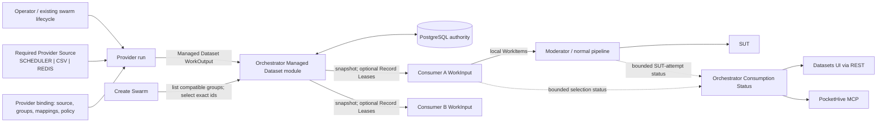

# Managed Test Data MVP Specification

Status: in progress; proposed requirements, implementation and canonical contract approval pending
Scope: Scenario Manager metadata, Orchestrator Managed Dataset module, Worker SDK adapters, UI and PocketHive MCP

## Decision required

Approve a PostgreSQL-backed Managed Dataset MVP in which one provider run with
one required `SCHEDULER`, `CSV` or `REDIS` source creates one named Dataset and
zero or many consumer swarms select it explicitly.
The Dataset is either ungrouped or contains a small frozen set of Groups whose
fields come from its Dataset Definition. Consumers dispatch reusable records
from one exact Group through the existing `WorkInput -> WorkItem -> WorkOutput`
pipeline. PocketHive also shows
whether that exact Dataset group is used at the consumer-input and SUT-attempt
boundary.

Managed Dataset is a new Dataset option alongside the existing
`REDIS_DATASET` option. Redis Dataset remains supported with unchanged
behaviour and configuration. Each bee I/O binding selects exactly one adapter;
PocketHive performs no migration, substitution or fallback between them. A
scenario may use Redis Dataset and Managed Dataset on different bindings.

Managed Dataset does not copy Redis list semantics. Records are immutable and
reusable. Each Dataset freezes one explicit allocation mode: `SHARED` permits
concurrent reuse; `EXCLUSIVE_LEASE` makes one record temporarily unavailable
while one consumer WorkItem uses it, then returns it after release or lease
expiry. Neither mode pops, depletes or moves records. There is no use count,
outcome-driven invalidation or automatic provider lifecycle.

## Goal

Keep reusable synthetic SUT data available for continuous test traffic while
keeping PostgreSQL, Orchestrator and credential-provider calls off the measured
request path.

```text
required provider source -> normal provider pipeline -> provider WorkOutput -> named Managed Dataset / group
exact Dataset-group snapshot -> consumer WorkInput -> normal consumer pipeline -> SUT
```

## Hard rules

| Rule | Requirement |
|---|---|
| Additive option | `REDIS_DATASET` remains supported and unchanged. Each bee I/O binding selects exactly one adapter. A scenario may use Redis Dataset and Managed Dataset on different bindings, but one binding never combines, substitutes or falls back between them. |
| Normal worker I/O | Managed Dataset adapters implement existing `WorkInput` and `WorkOutput`; no Dataset-specific RabbitMQ lane is added. |
| Explicit configuration | Every adapter, requirement and setting is explicit in its canonical contract block. Missing or unsupported values fail before provisioning. |
| One creator | One provider run creates one Managed Dataset per Managed Dataset output binding. A worker-process restart keeps that provider-run identity; a new provider run gets a new identity and Dataset. |
| Required provider source | Every Provider Scenario Binding selects exactly one frozen source from `SCHEDULER`, `CSV` or `REDIS`. Source omission, mixing, switching and fallback fail. `SCHEDULER` is renewable; `CSV` and `REDIS` are finite non-expiring imports in MVP. |
| Named parent | Every Managed Dataset has a required frozen `name` for people and one opaque `datasetId` for identity. Groups are subordinate partitions; they never replace either field. |
| Frozen grouping | Every Dataset Definition explicitly selects `UNGROUPED` or `GROUPED`. A grouped provider binding resolves a bounded group set before provider work starts; records cannot create, rename or change groups at runtime. |
| Mounted authoring registry | Scenario Manager loads Dataset Definition bundles from `scenarios/managed-dataset/<name>/` and reusable Dataset Schema Contracts from `scenarios/dataset-contracts/<name>/<version>/`. Mount order never establishes precedence. |
| One frozen record schema | Each Dataset Definition owns one root JSON Schema Draft 2020-12 record schema. It may compose exact versioned Dataset Schema Contracts and Dataset-local `$defs`; every record in one runtime Dataset uses the same resolved schema graph. |
| Provider-only templates | Group templates may use only the Provider Scenario Binding's non-secret `vars` and `sut` context. Consumers select resolved ids and never evaluate, reconstruct or compare provider templates. |
| Explicit consumers | Create Swarm uses an explicit empty selection when no Managed Dataset is required. Otherwise it requires one exact `datasetId` for each Managed Dataset consumer `bindingRef` and, for `GROUPED`, one exact `groupId`. A run stays pinned to both. There is no alias following, substitution or fallback. |
| Explicit allocation | Every Managed Dataset freezes one mode for all its Groups: `SHARED` for concurrent reuse or `EXCLUSIVE_LEASE` for one active Record Lease per record. Modes never mix within a Dataset and consumers must match the frozen mode. |
| Local measured path | Record selection, Dataset Context validation and counter increments are local. Snapshot refresh, refill, persistence, Record Lease acquire/release and status reporting are background/control-plane work. |
| PostgreSQL authority | For Managed Dataset only, PostgreSQL owns records, finite source imports, grants, receipts, revisions, Record Leases and background-work leases. The Redis Dataset option retains its existing Redis-backed behaviour. |
| No provider automation | The Dataset module never starts, stops, replaces, fails over or reconciles a provider swarm. |
| No generic reconciliation | MVP never infers record state from a SUT result and never corrects, revalidates, deprovisions or retires SUT objects. |
| Secrets by reference | Scenario bundles may contain SUT context, templates and mappings. They contain secret references, never secret values. |
| No fallback | Invalid, stale, unavailable or mismatched configuration fails explicitly. PocketHive never switches Dataset, adapter, provider or snapshot implicitly. |
| One consumption view | Orchestrator alone derives `ManagedDatasetConsumptionStatus`; REST, MCP and UI do not reimplement its checks. Missing or stale input produces `UNKNOWN`, never inferred health. |
| Non-blocking telemetry | Consumption reporting failure never blocks Dataset selection or SUT traffic. Status is operational evidence, not audit-grade delivery proof. |

## Supported MVP

- Existing Redis Dataset scenarios continue to use `REDIS_DATASET` unchanged.
- New scenarios may select `MANAGED_DATASET` explicitly when reusable records
  are required.
- One immutable provider identity and zero or many consumers per Managed
  Dataset.
- One required provider source: refill-driven `SCHEDULER`, finite mounted `CSV`
  or finite immutable `REDIS` list snapshot.
- Required Dataset name and explicit `UNGROUPED` or bounded `GROUPED` mode.
- Mounted Dataset Definition bundles with one root record schema, exact reusable
  Dataset Schema Contract versions and Dataset-local custom definitions.
- Arbitrary Dataset-Definition Group keys resolved once from literals or the
  Provider Scenario Binding's non-secret `vars` and `sut` context.
- Explicit SUT-compatible Dataset-group listing and exact selection during
  Create Swarm.
- Explicit `SHARED` or `EXCLUSIVE_LEASE` allocation. `SHARED` uses
  deterministic local `ROUND_ROBIN`; `EXCLUSIVE_LEASE` uses bounded,
  prefetched durable Record Leases.
- Non-expiring and expiring records.
- Proactive `SCHEDULER` refill to fixed minimum, target and maximum levels.
- Durable idempotent grants and receipts with stale-grant recovery.
- Verified immutable local snapshots with atomic replacement.
- Replica-safe Orchestrator background work using PostgreSQL leases and
  fencing.
- A minimal Managed Dataset Context needed for end-of-pipeline identity and
  expiry safety.
- Lightweight per-consumer consumption status exposed through REST, the
  existing Datasets UI area and PocketHive MCP.

## Out of scope

- Record use counts, queue/pop semantics, bounded-use and one-use records,
  per-record/per-Group/per-consumer allocation overrides, and allocation-mode
  mixing within one Dataset.
- Record Lease renewal, transfer, manual checkout, SUT-outcome-based release or
  invalidation, and exact-use or exactly-once claims.
- SUT-outcome invalidation, SUT reconciliation, correction, revalidation,
  deprovisioning and outcome-driven retirement.
- Multiple providers, provider transfer, automatic provider start or failover,
  and live consumer rebinding.
- Multiple sources in one provider binding, source switching or fallback,
  rotating CSV imports, destructive Redis pop imports and refill or expiry for
  finite `CSV` or `REDIS` sources.
- Sensitive records or secrets in Dataset records.
- Active-active multi-region operation and application-owned PostgreSQL HA.
- Audit-grade delivery or SUT-acceptance proof, qualification evidence,
  evidence frames, approvals, arbitrary-window exactness, loss/duplicate
  cryptographic proof and HiveGate or HiveMind coupling. These are a future
  milestone and must not gate provider or consumer traffic.
- Per-record drill-down, exact-use or exactly-once claims, token/frame sums,
  malicious-worker resistance and custom time services.
- Runtime-created groups, provider-result-derived group identity, live
  regrouping, partial group keys and per-group access or supply overrides.
- Schema-version ranges, `latest`, external network schema resolution, live
  schema upgrade, per-record schema selection and mixed schema graphs within
  one runtime Dataset.
- Selecting all groups, multiple groups in one consumer binding, predicates,
  ranges, joins or an arbitrary Dataset query language.

## Canonical terms

| Term | Status | Meaning | Not the same as | Source | Allowed shorthand |
|---|---|---|---|---|---|
| `WorkInput` | EXISTING | Worker SDK adapter that supplies immutable `WorkItem`s to a worker. | SUT traffic pacing. | Worker SDK | None |
| `WorkOutput` | EXISTING | Worker SDK adapter that publishes or persists a worker result. | A Dataset provider workflow. | Worker SDK | None |
| `Dataset Space` | PROPOSED | SUT-scoped authoring namespace containing versioned Dataset definitions and access policy. | Runtime record storage. | SUT/Dataset model | None |
| `Scenario Binding` | PROPOSED | Validated link between Scenario Template, SUT Environment, Dataset Space and variable profile. It produces a frozen, versioned runtime snapshot. | A provider dependency or Managed Dataset. | SUT/Dataset model | None |
| `Dataset Definition Bundle` | PROPOSED | Mounted authoring package under `scenarios/managed-dataset/<name>/` containing one `dataset.yaml` and its root `record.schema.yaml`. | A Scenario Bundle or runtime Managed Dataset. | This specification | None |
| `Dataset Schema Contract` | PROPOSED | Immutable reusable JSON Schema resource under `scenarios/dataset-contracts/<name>/<version>/schema.yaml`, referenced at one exact version by a root record schema. | A Dataset Definition or Dataset-local `$defs`. | This specification | None |
| `Managed Dataset Provider Source` | PROPOSED | Required tagged union in one Provider Scenario Binding that supplies provider work from `SCHEDULER`, `CSV` or `REDIS` while preserving one frozen configuration and, for a finite import, one content fingerprint. | A consumer Dataset input, provider lifecycle automation or fallback chain. | This specification | `Provider Source` after first use |
| `Managed Dataset` | PROPOSED | Named Orchestrator-owned runtime parent created by one provider run and readable by many compatible consumer bindings. | A group, Redis list or work queue. | This specification | `Dataset` after first use |
| `Dataset Group` | PROPOSED | Immutable runtime partition under one Managed Dataset, identified by an opaque `groupId` and one exact typed `groupKey`. `UNGROUPED` has one internal group. | A Dataset name, filter or Provider Scenario Binding. | This specification | `Group` after first use |
| `Managed Dataset Record Lease` | PROPOSED | Durable exclusive right for one consumer run and binding to hold one immutable record for one dispatched WorkItem until release or fixed expiry. | A record removal, Redis pop, background-work lease or exactly-once guarantee. | This specification | `Record Lease` after first use |
| `Managed Dataset Context` | PROPOSED | Minimal `WorkItem` metadata identifying the selected binding, Dataset Group, revision, record and validity at the SUT-attempt guard. | Consumption evidence or security attestation. | This specification | `Dataset Context` after first use |
| `ManagedDatasetConsumptionStatus` | PROPOSED | Canonical Orchestrator read model for current operational Dataset consumption. | SUT business acceptance, exactly-once proof or audit evidence. | This specification | `Consumption Status` after first use |

The architecture proposal remains authoritative for `SUT Environment`,
`Dataset Space` and `Scenario Binding`. This specification owns proposed
Managed Dataset runtime rules. Its Dataset Definition fields are an M0 proposal
for the canonical Dataset Space schema and are not implemented until that
contract is approved and updated. Any Dataset Space alias is resolved during
Scenario Binding validation to one exact Dataset Definition version; it is not
a runtime Dataset or Group alias and Create Swarm never follows it.

## Ownership

| Concern | Owner | Must not own |
|---|---|---|
| Dataset Definition bundles, Dataset Schema Contracts and compiled schema graph | Scenario Manager Dataset Space registry | Runtime records, refill execution or worker filesystem lookup |
| Dataset name, grouping definition and root record schema reference | Dataset Definition in Scenario Manager | Reusable contract content, runtime records or refill execution |
| Provider Source, Groups, templates, mapping, allocation and supply policy | Provider Scenario Binding | Dataset Definition, implicit source selection or runtime workers |
| Consumer Dataset requirements and local lease bounds | Consumer Scenario Template; Scenario Binding validates and freezes | Provider policy or runtime Dataset selection |
| Candidate listing, admission and frozen run configuration | Orchestrator | Automatic Dataset or provider selection |
| Groups, source imports, records, grants, receipts, revisions, Record Leases, availability and background-work leases | Orchestrator Managed Dataset module | Swarm lifecycle, source selection or SUT business logic |
| Provider lifecycle | Operator and existing swarm lifecycle | Managed Dataset module |
| CSV artifacts, SUT context, templates, mappings and secret references | Provider Scenario Bundle and existing resolution flow | Dataset Definition or Managed Dataset records |
| Bounded CSV/Redis acquisition, parsing, staging, enumeration and fingerprinting | `MANAGED_DATASET_PROVIDER` `WorkInput` | Source policy, durable import state or result persistence |
| Local snapshot, dispatch and selection counters | Managed Dataset `WorkInput` | Durable authority or SUT traffic pacing |
| Context propagation, terminal validation and SUT-attempt counters | Worker SDK | SUT business acceptance or evidence persistence |
| Consumption Status checks and aggregation | Orchestrator application/domain service | REST, MCP, UI, logs or RabbitMQ queue inference |
| Consumption Status presentation | Existing Datasets UI and PocketHive MCP adapters | Independent status logic or direct worker access |
| SUT traffic pacing | Moderator | Dataset supply or refill demand |
| Managed Dataset client settings, capacity limits and Redis connection contracts | Deployment profile | Provider bindings, workers or implicit environment lookup |
| PostgreSQL availability, replication, backup and recovery | Deployment infrastructure | Application fallback logic |

## Architecture


```mermaid
flowchart LR
  OP["Operator / existing swarm lifecycle"] --> P["Provider run"]
  PS["Required Provider Source<br/>SCHEDULER | CSV | REDIS"] --> P
  B["Provider binding: source, groups, mappings, policy"] --> P
  P -->|"Managed Dataset WorkOutput"| MD["Orchestrator Managed Dataset module"]
  MD <--> PG[("PostgreSQL authority")]
  CS["Create Swarm"] -->|"list compatible groups; select exact ids"| MD
  MD -->|"snapshot; optional Record Leases"| C1["Consumer A WorkInput"]
  MD -->|"snapshot; optional Record Leases"| C2["Consumer B WorkInput"]
  C1 -->|"local WorkItems"| M["Moderator / normal pipeline"]
  M --> SUT["SUT"]
  C1 -.->|"bounded selection status"| O["Orchestrator Consumption Status"]
  M -.->|"bounded SUT-attempt status"| O
  O --> UI["Datasets UI via REST"]
  O --> MCP["PocketHive MCP"]
```

The measured path starts when a consumer selects a local record, or a locally
held Record Lease in `EXCLUSIVE_LEASE`. It performs no PostgreSQL,
Orchestrator, Scenario Manager or credential-provider call.

## Dataset creation and selection

Provider admission creates the Managed Dataset before provider workers start.
Creation is idempotent on
`providerSwarmId + providerRunId + providerBindingRef`. Repeating the same
request and contract returns the same `datasetId`; changed content fails. A
new provider run creates a new `providerRunId` and `datasetId`.

The Dataset stores its required `name`, immutable provider swarm, run, binding
and binding-version provenance, plus the frozen SUT Environment, Dataset
Definition, root schema URI, resolved schema dependency versions,
compiled-schema digest, Provider Source type and policy versions. `name` is a
non-secret human label copied from the Dataset Definition. It is required,
non-unique and immutable for the runtime Dataset; `datasetId` alone identifies
the Dataset. Provider ownership and source configuration never transfer.

Source status is a required closed tagged union. `SCHEDULER` has
`state: ACTIVE` and forbids `sourceFingerprint`. `CSV` and `REDIS` start with
`state: PENDING_IMPORT` and required `sourceFingerprint: null`. After provider
preflight, the first valid begin-import request atomically binds the fingerprint
and changes the state to `IMPORTING`. Exact replay returns the same import;
another fingerprint fails with `SOURCE_MISMATCH`. Completion changes the state
to `COMPLETE`; failure or expiry changes it to `FAILED`. `IMPORTING`,
`COMPLETE` and `FAILED` require the bound fingerprint. No transition can clear
or replace it.

The versioned Dataset Definition lives in Dataset Space, outside every
scenario. Its Dataset Definition Bundle owns literal `name`, one root record
schema reference and the closed grouping contract; Definition metadata never
evaluates scenario templates:

```yaml
# scenarios/managed-dataset/shared-records/dataset.yaml
id: shared-records
version: 1.0.0
name: Shared Records
recordSchemaRef:
  path: record.schema.yaml
grouping:
  type: GROUPED
  fields:
    - name: category
      type: STRING
      maximumLength: 40
    - name: variant
      type: STRING
      maximumLength: 40
  maximumGroups: 8
```

`grouping.type` is required. `UNGROUPED` forbids all other grouping fields and
produces one internal Group. `GROUPED` requires between one and eight ordered
`fields` and `maximumGroups` between 1 and 64. Field names are unique, match
`[A-Za-z][A-Za-z0-9_]{0,63}` and may be domain-specific. MVP field types are the
closed set `STRING`, `INTEGER` and `BOOLEAN`. `STRING` requires a positive
`maximumLength` of at most 256 Unicode code points; the field is forbidden for
other types. Its resolved value must be non-empty, within that bound, free of
control characters and without leading or trailing whitespace. `INTEGER` is a
signed 64-bit value. Every listed field and no other field is present in each
Group key; `null`, nested values and type coercion are forbidden.
The example names are illustrative, not PocketHive fields. The Dataset
Definition is versioned, so changing field names, order, types or bounds
creates a new definition version.

### Mounted Dataset definitions and schema contracts

Scenario Manager uses the existing mounted `scenarios` authoring root with
three explicit registries:

```text
scenarios/
  bundles/<scenario-name>/scenario.yaml
  managed-dataset/<dataset-name>/dataset.yaml
  managed-dataset/<dataset-name>/record.schema.yaml
  dataset-contracts/<contract-name>/<version>/schema.yaml
```

`dataset.yaml` is the only Dataset Definition entry point. Its directory name
must equal `id`, `version` is required SemVer and `recordSchemaRef.path` must be
the exact bundle-relative value `record.schema.yaml`. Scenario Manager rejects
duplicates, case-colliding names, path traversal, symbolic-link escape,
missing entry points and directory/declared-identity mismatches. It never uses
mount order, another directory or a previous version as fallback.

A published `id + version` is immutable. Reloading the same pair with changed
`dataset.yaml`, root schema, contract references or local definitions fails.
Any such change requires a new Dataset Definition version; selecting a newer
Dataset Schema Contract also requires a new root schema and Definition version.
Removing a mounted bundle does not mutate a frozen runtime Dataset or erase its
stored registry version.

`record.schema.yaml` is one JSON Schema Draft 2020-12 root for the complete
record. Its `$id` is
`pockethive://managed-dataset/<dataset-id>/<definition-version>/record`. Within
explicit deployment bounds, it may use `$ref` to compose zero or more immutable
Dataset Schema Contracts at exact versions and may contain Dataset-local custom
definitions under `$defs`. A local definition is versioned with the Dataset
Definition. A definition that needs independent versioning or reuse must become
a Dataset Schema Contract. For example:

```yaml
$schema: https://json-schema.org/draft/2020-12/schema
$id: pockethive://managed-dataset/shared-records/1.0.0/record
type: object
additionalProperties: false
required: [identity, state, extension]
properties:
  identity:
    $ref: pockethive://dataset-contracts/base-identity/2.1.0
  state:
    $ref: pockethive://dataset-contracts/record-state/1.4.0
  extension:
    $ref: "#/$defs/extension"
$defs:
  extension:
    type: object
    additionalProperties: false
    required: [label]
    properties:
      label:
        type: string
        maxLength: 40
```

Each Dataset Schema Contract has the canonical URI
`pockethive://dataset-contracts/<name>/<version>`, stored at the matching
`scenarios/dataset-contracts/<name>/<version>/schema.yaml`. Its `$id` must equal
that URI, its directory version must be SemVer and its `$schema` must select
Draft 2020-12. Published versions are immutable. References using `latest`, a
version range, an unversioned id, HTTP(S), an unsupported dialect, an
unresolved contract or a cross-contract cycle fail publication. MVP loads only
each package's required `schema.yaml`; there is no wildcard schema discovery.

Scenario Manager loads and validates Dataset Schema Contracts first, Dataset
Definition Bundles second and scenario references third. It compiles each
complete graph once, applies explicit deployment limits for registry size,
schema bytes and the reference graph, and publishes the registry revision
atomically. The compiled graph has one derived digest and a resolved dependency
list. These are stored metadata, not another authoring contract. The persisted
compiled artifact contains the root and every resolved schema resource.
Scenario Manager alone assigns its digest once as `sha256:` followed by 64
lowercase hexadecimal digits over the exact persisted artifact bytes.
Orchestrator, workers, status adapters and MCP treat that value as opaque and
compare it exactly; they never recompile, canonicalise or hash the graph.

An invalid reload is one failed transaction: Scenario Manager publishes no
partial registry revision, keeps the last successfully published revision
active and reports the rejected bundle, contract and reference paths. This is
registry transaction safety, not Dataset Definition version fallback; changed
content is never admitted under an existing `id + version`.

The Scenario Manager deployment profile requires positive
`maximumDatasetDefinitionBundles`, `maximumDatasetContractVersions`,
`maximumSchemaBytesPerFile`, `maximumCompiledSchemaBytes`,
`maximumSchemaReferences`, `maximumSchemaReferenceDepth` and
`maximumRecordValidationErrors`. None has an implicit default. Exceeding a
bound fails publication or, for the final field, truncates a rejected record's
error locations at the configured count without accepting the record.

Mounted files are authoring/import inputs. Scenario Manager remains the
versioned Dataset Space registry. Orchestrator receives the resolved Dataset
Definition version, root schema URI, dependency versions and digest, then
freezes them into the runtime Dataset. Orchestrator and workers never discover
or resolve `/app/scenarios` files. A provider receipt is committed only after
its mapped record validates against the frozen compiled root schema.

Two resolved Group keys are equal only when every defined field has the same
typed value; string comparison is exact and case-sensitive. Orchestrator does
not trim, normalise or otherwise rewrite resolved values.

The Provider Scenario Binding references the Dataset Definition and owns one
required Provider Source plus the concrete group set because only that binding
has the applicable source, `vars` and `sut` context:

```yaml
providerDataset:
  datasetDefinitionId: shared-records
  source:
    type: SCHEDULER
  allocation:
    type: EXCLUSIVE_LEASE
    recordLeaseDuration: PT2M
    maximumActiveRecordLeases: 100
  groups:
    - groupKey:
        category: "{{ vars.recordCategory }}"
        variant: "{{ sut.type }}"
```

`source` is a required tagged union:

| `source.type` | Required settings | MVP behaviour |
|---|---|---|
| `SCHEDULER` | No source-specific block; the supply policy already owns refill cadence, capacity and completion bounds. | Renewable. The Provider Source dispatches only authority-granted refill items. |
| `CSV` | `csv.artifactRef`, one ASCII `delimiter` other than double quote, CR, LF or NUL, `charset: UTF-8` and `header: true` | Finite. The literal artifact reference is confined to the provider Scenario Bundle; bytes are hashed and rows are read once in stable order. Rotation and external URLs are forbidden. |
| `REDIS` | `redis.connectionRef`, literal `listName`, `itemFormat: JSON`, `snapshotMode: COPY` and positive `snapshotTtl` | Finite. The source list is copied once to an immutable provider-run staging key and read in stable index order. Pop, sampling and live-list reads are forbidden. |

Exactly the matching settings block is present; `SCHEDULER` forbids both
blocks. `CSV` and `REDIS` require `lifecycle.type: NON_EXPIRING` and
`replacementHeadroom: 0`. A CSV row becomes one object keyed by its unique,
non-empty header names. Parsing accepts valid quoted fields, doubled-quote
escaping and LF or CRLF records; malformed UTF-8, quoting, headers or row width
fails the whole import. Each Redis item must be one UTF-8 JSON object.

The provider binding freezes the source type and settings. The content
fingerprint is `sha256:` plus 64 lowercase hexadecimal digits. CSV
hashes the exact artifact bytes before decoding. Redis hashes, in list-index
order, each raw item as an unsigned 64-bit big-endian byte length followed by
those exact bytes. The first import binds that fingerprint to the Dataset as
safe provenance; paths, Redis keys, credentials and source values are not
exposed to consumers, metrics or normal logs. A Redis staging copy expiring
before completion fails the import; PocketHive never reads the live list or
falls back to pop.

`connectionRef` resolves one exact entry in the deployment profile's Managed
Dataset Redis connection registry. That entry alone owns the endpoint, TLS,
declared standalone or cluster topology and credential reference. The staging
key is deterministic for the provider run and binding. The adapter creates it
without replacement using one `MULTI/EXEC` operation that runs `COPY` and
applies expiry. An existing key is accepted only when an exact restart
reproduces its fingerprint. For cluster topology, `listName` must contain a
non-empty Redis hash tag and the staging key must reuse it so both keys occupy
one slot. Unsupported topology, copy failure, collision or fingerprint mismatch
fails explicitly.

Before a finite import, the `MANAGED_DATASET_PROVIDER` `WorkInput` performs a
bounded preflight. It validates source size, item count, CSV headers and
quoting, Redis staging-copy creation, source-item parsing and, for `GROUPED`, an explicit
`source.groupMapping` from Dataset Definition field name to source JSON
Pointer. `source.groupMapping` is forbidden for `UNGROUPED` and `SCHEDULER`.
Its keys must exactly equal `grouping.fields`. Redis pointers retain JSON
types. CSV fields are strings and may map only to string Group fields; there is
no implicit type coercion. Every source item must resolve to exactly one already
frozen Group. Unmatched, ambiguous or invalid items fail the import and cannot
create a Group. Stable source-item identity is the frozen source fingerprint
plus one-based CSV row or Redis list index; a CSV position counts logical data
records after the header, not physical lines, and duplicate values remain
distinct items. `sourceItemKey` is `sha256:`
plus lowercase SHA-256 hex over UTF-8
`sourceType + "\n" + sourceFingerprint + "\n" + decimalPosition`.

`groups` is required and non-empty for `GROUPED` and forbidden for
`UNGROUPED`. Group-key leaves may be typed literals or templates accepted by
the existing Orchestrator create-time renderer. Templates may read only the
provider binding's non-secret, allowlisted `vars` and non-secret `sut` metadata.
Orchestrator resolves them once before Dataset creation or provider work,
validates the resulting object against `grouping.fields`, rejects missing,
additional, mistyped or unresolved values, secret material, duplicate resolved
keys and field/count bound violations, then freezes the set. It assigns one opaque
`groupId` to each resolved key; an idempotent creation replay returns the same
ids.

Provider result mapping may populate record fields and validate an echoed
group attribute, but it cannot derive, create or change group identity. Each
refill item already targets one frozen `groupId`; its receipt can commit only
to that Group. A configuration change requires a new provider binding version
and provider run, which creates a new Dataset. This rule keeps proactive
per-group refill and readiness deterministic.

The Consumer Scenario Template is the single source of truth for Dataset
requirements and local allocation settings. It contains no runtime Dataset id,
provider template or refill policy:

```yaml
managedDatasetRequirements:
  - bindingRef: inputRecords
    datasetDefinitionId: shared-records
    access: READ
    allocation:
      type: EXCLUSIVE_LEASE
      acquireBatchSize: 10
      maximumHeldRecordLeases: 20
      acquireInterval: PT1S
```

`bindingRef`, `datasetDefinitionId`, `access` and `allocation.type` are
required. `access` has the MVP value `READ`. `SHARED` forbids the three lease
settings; `EXCLUSIVE_LEASE` requires them. Templates, aliases, Dataset ids,
Group ids and an omitted allocation are forbidden. Validation requires a
one-to-one match between these requirements and
`inputs.type: MANAGED_DATASET` bindings by `bindingRef`; unmatched or duplicate
entries fail during Scenario Binding validation. The resulting Consumer
Scenario Binding freezes the validated requirement array against one SUT
Environment and Dataset Space; it does not author or alter requirements. A
validated template with no Managed Dataset input uses the explicit shape
`managedDatasetRequirements: []`.

Create Swarm derives required Dataset bindings from the Scenario Binding's
frozen requirement array. When it is empty, Create Swarm skips Dataset
discovery and the request carries `datasetSelections: []`. Otherwise, for each
requirement, Create Swarm lists compatible Groups whose frozen
SUT, Dataset Definition version, compiled record-schema digest, grouping
fields, access contract and required allocation mode match. Each candidate includes
`datasetId`, Dataset `name`, grouping type, allocation mode and, for `GROUPED`,
`groupId`, safe resolved `groupKey` and Group availability. The operator
supplies one closed selection shape:

```yaml
datasetSelections:
  - bindingRef: inputRecords
    selection:
      type: GROUP
      datasetId: shared-records-provider-run-20260805
      groupId: group-01
```

`selection.type: DATASET` requires `datasetId` and forbids `groupId`; it is
valid only for `UNGROUPED`. `selection.type: GROUP` requires both ids and is
valid only for `GROUPED`. Orchestrator revalidates the exact candidate and
freezes the ids into the run. It injects the internal Group id for an
`UNGROUPED` selection so every runtime adapter has one required concrete
`groupId`. Only `READY` Groups with sufficient declared Record Lease capacity,
when applicable, can be admitted; other Groups remain visible with reason
codes. Different bindings and swarms may select the same Group in either
allocation mode. Consumers never evaluate group templates, compare group keys
or follow an alias. The selections array must contain exactly one entry for
every Managed Dataset input binding and no entries for any other binding; it
cannot be omitted, partially supplied or used to attach a Dataset to a swarm
that does not declare one. A consumer that needs two Groups declares two
bindings.

## Worker I/O contract

The examples below are normative for nesting and illustrative for names. M0
must add the enum values and closed settings schemas to the canonical worker
I/O contracts and capability manifests.

Adapter choice is per bee I/O binding. `inputs.type` or `outputs.type` names
one adapter and its matching settings block; conflicting blocks fail schema
validation. Existing direct `SCHEDULER`, `CSV_DATASET` and `REDIS_DATASET`
inputs remain unchanged. They do not become Managed Dataset providers
implicitly. A Provider Scenario Binding instead uses one explicit
`MANAGED_DATASET_PROVIDER` input whose frozen Provider Source selects the
source handler; no binding mixes or fails over between handlers.

The first provider bee obtains refill or finite-import work through its input
adapter:

```yaml
role: provider-source
config:
  inputs:
    type: MANAGED_DATASET_PROVIDER
    managedDatasetProvider:
      bindingRef: supplyRecords
      batchSize: 100
  outputs:
    type: RABBITMQ
```

`batchSize` is only the positive bounded maximum number of source WorkItems
fetched per adapter call. It does not select a source or define supply; the
Provider Scenario Binding remains the sole owner of source settings and supply
policy.

The terminal provider bee persists mapped results through a separate output
adapter:

```yaml
role: provider-store
config:
  inputs:
    type: RABBITMQ
  outputs:
    type: MANAGED_DATASET
    managedDataset:
      bindingRef: supplyRecords
```

Both `bindingRef` values resolve the same provider binding. Orchestrator
injects its created `datasetId`, Provider Source and frozen Group descriptors
into both runtime adapter blocks. `SCHEDULER` obtains Group-scoped refill
grants. `CSV` and `REDIS` create one finite source import after successful
preflight and dispatch every source item once in stable order. Work between the
first and terminal bees follows normal PocketHive topology. The provider
binding owns source settings, SUT template and typed source/result mappings.

The Scenario Manager capability manifest for the provider-source image declares
a required, unique `managedDatasetProviderSources` array whose closed values
are `SCHEDULER`, `CSV` and `REDIS`. Admission requires the selected source
value; missing or unsupported capability fails before provisioning and never
selects another source. Workers do not publish or negotiate this capability.

Each provider WorkItem carries one SDK-owned structured
`MANAGED_DATASET_PROVIDER_CONTEXT` header in the normal JSON WorkItem body.
Its wire key is `ph.dataset.provider.context`; it is not a broker or
observability header. Every value contains `schemaVersion`, `datasetId`,
`groupId`, `bindingRef`, `sourceType` and `workType`. `workType: REFILL` adds
`grantId`, `grantItemId`, `providerOperationKey` and `grantExpiresAt` and is
valid only for `SCHEDULER`. `workType: IMPORT` adds `importId`,
`sourceItemKey`, `sourceFingerprint` and positive `sourcePosition` and is valid
only for `CSV` or `REDIS`. No other fields are allowed. The terminal adapter
rejects a missing, changed or wrong-kind context before any write. Authors and
intermediate workers never construct or change this header.

A consumer declares its dispatch trigger under the adapter-specific block:

```yaml
role: dataset-source
config:
  inputs:
    type: MANAGED_DATASET
    managedDataset:
      bindingRef: inputRecords
      ratePerSec: 500
      sutAttemptRole: sut-client
      sutAttemptGuard:
        maximumInvocationDuration: PT5S
        maximumClockSkew: PT1S
      consumptionObservation:
        reportInterval: PT5S
        staleAfter: PT20S
        observationWindow: PT15S
        pipelineLagTolerance: PT30S
  outputs:
    type: RABBITMQ
```

Create Swarm injects the selected `datasetId` and concrete `groupId` into
`config.inputs.managedDataset` in the frozen runtime configuration. This is
runtime materialisation, not an authoring default.

`bindingRef` must resolve exactly one frozen Consumer Scenario Template
requirement.
Create Swarm injects that requirement's allocation mode and local settings into
the frozen adapter configuration. `EXCLUSIVE_LEASE` acquires only from its
frozen Dataset Group, keeps at most `maximumHeldRecordLeases` active or
pending-release leases, and never changes mode at runtime.

`ratePerSec` controls how quickly `WorkInput` supplies `WorkItem`s. It does not
deplete records or create refill demand. Moderator remains responsible for SUT
traffic pacing. `sutAttemptRole` is the one scenario node whose instances
may make SUT attempts for this binding in MVP. M0 adds the required capability
enum `managedDatasetSutAttemptGuard` with closed values `SUPPORTED` and
`UNSUPPORTED`; the Scenario Manager capability manifest for that role's image
must declare `SUPPORTED`. Missing capability, an unknown role or more than one
SUT-attempt role fails before provisioning. For `EXCLUSIVE_LEASE`, the same
manifest must also declare the closed capability
`managedDatasetRecordLeaseRelease: SUPPORTED`; the SDK releases after that role
completes all permitted SUT calls and its normal output handoff.
Orchestrator copies `datasetId`, `groupId`, `bindingRef`, the two required guard
durations and the observation settings into that role's frozen private runtime
configuration. Authors do not repeat them on the terminal bee.

The two `sutAttemptGuard` and four `consumptionObservation` values are required
and frozen with the run. `maximumInvocationDuration` covers the longest
permitted network invocation, including protocol retries.
`maximumClockSkew` is the deployment's qualified maximum absolute worker-clock
error relative to PostgreSQL time. `staleAfter` MUST be at least three report
intervals; `observationWindow` MUST be at least two;
`pipelineLagTolerance` MUST cover the scenario's declared moderator and bounded
queue delay. There are no defaults or auto-tuning.

Worker trigger, guard and observation settings live only in the bee blocks
above. The Dataset Definition lives once in Dataset Space. Concrete Groups,
provider mapping, allocation, lifecycle, supply and capacity policy live once
in the versioned Provider Scenario Binding resolved by `bindingRef`. One allocation mode and supply
policy applies to every Group in the Dataset; a different mode or policy
requires another output binding and Dataset. The Consumer Scenario Template
owns compatibility, `READ`, allocation requirement and local lease bounds. The
bee adapter references these once by `bindingRef`; it never repeats them or any
provider template or policy. The Scenario Binding freezes the validated
requirements; the Managed Dataset stores its resolved provider contract; and
the consumer run stores its selection.

### Background authority API

All Managed Dataset adapters use authenticated Orchestrator REST only for
background work. Workers never connect to PostgreSQL directly and no
Dataset-specific RabbitMQ lane is added. M0 owns closed request, response and
error schemas for these operations:

| Operation | Product API | Required contract |
|---|---|---|
| Acquire refill grant | `POST /api/managed-datasets/{datasetId}/groups/{groupId}/refill-grants` | `SCHEDULER` only. Request contains `bindingRef`, `batchSize` and `idempotencyKey`; response repeats both ids and contains `grantId`, `grantExpiresAt` and bounded `items[]` with `grantItemId` and `providerOperationKey`. |
| Commit refill receipt | `PUT /api/managed-datasets/{datasetId}/groups/{groupId}/refill-grants/{grantId}/items/{grantItemId}/receipt` | `SCHEDULER` only. Request contains `bindingRef`, `providerOperationKey`, mapped record and explicit `usableUntil`; response repeats both ids and contains `recordId` and committed `snapshotRevision`. Exact replay returns the same response; changed replay fails. |
| Begin finite source import | `POST /api/managed-datasets/{datasetId}/source-imports` | `CSV` or `REDIS` only. Request contains `bindingRef`, source type/fingerprint, total item/byte counts, exact per-Group item counts and `idempotencyKey`; response contains `importId` and bounded import expiry. The first valid request binds the previously null fingerprint; exact replay returns the same import and another fingerprint fails. Counts must satisfy every Group's `targetReady..maximumReady` and deployment limits. |
| Commit finite source item | `PUT /api/managed-datasets/{datasetId}/source-imports/{importId}/items/{sourceItemKey}/receipt` | Request contains exact `groupId`, mapped record, required `usableUntil: null` and `idempotencyKey`. The item key is the hash of source fingerprint, kind and one-based position, never a source value. Exact replay returns the same staged `recordId`; changed replay fails. No consumer snapshot exposes staged records. |
| Complete finite source import | `PUT /api/managed-datasets/{datasetId}/source-imports/{importId}/complete` | Request repeats source fingerprint, item/byte and per-Group counts plus `idempotencyKey`. Completion succeeds only when every declared item has one valid receipt, atomically publishes the first Group revisions and marks the source complete. Exact replay returns the same revisions; changed, incomplete or expired completion fails. |
| Read snapshot descriptor | `GET /api/managed-datasets/{datasetId}/groups/{groupId}/snapshots/latest?bindingRef={bindingRef}` | Response repeats both ids and pins `snapshotRevision`, root schema URI, compiled-schema digest, record count, total bytes, whole-snapshot digest and authority observation time. |
| Read snapshot page | `GET /api/managed-datasets/{datasetId}/groups/{groupId}/snapshots/{snapshotRevision}/records?bindingRef={bindingRef}&afterRecordId={cursor}&limit={limit}` | Stable record-id order; response repeats Dataset, Group, binding and revision and contains bounded `records[]`, page digest, next cursor and completion flag. |
| Acquire Record Leases | `POST /api/managed-datasets/{datasetId}/groups/{groupId}/record-leases` | `EXCLUSIVE_LEASE` only. Request contains `bindingRef`, `snapshotRevision`, `requestedCount` and `idempotencyKey`. Response repeats Dataset, Group, binding and revision, includes `authorityTime`, and contains bounded `recordLeases[]` with `recordId`, `recordLeaseId` and `recordLeaseExpiresAt`. An empty list with required `retryAfter` is normal saturation, not a mode change or error. |
| Release Record Lease | `PUT /api/managed-datasets/{datasetId}/groups/{groupId}/record-leases/{recordLeaseId}/release` | `EXCLUSIVE_LEASE` only. Request contains `bindingRef` and `idempotencyKey`, never SUT outcome. Exact replay returns the same `releasedAt` and resulting record state, `AVAILABLE` or `EXPIRED`; changed or stale ownership fails. |

Receipt validation uses the frozen compiled root schema before persistence.
`RECORD_INVALID` may return bounded schema-keyword and JSON Pointer locations
but never a record value or an unrestricted validator message.

Orchestrator materialises one required `managedDatasetClient` block into every
Managed Dataset runtime adapter from the deployment profile. It contains
`baseUrl`, `serviceAuthRef`, `requestTimeout`, `operationTimeout`,
`maximumAttempts` and `retryBackoff`. Values are explicit; secrets remain
behind `serviceAuthRef`. Missing values, a non-HTTPS production URL,
non-positive durations/counts or `operationTimeout < requestTimeout` fail
before provisioning.

Every request is authorised for the exact Dataset, Group, binding, run and
operation. Every API error has required `schemaVersion`, `code`, `retryable` and
`correlationId`. The closed codes are `AUTHENTICATION_FAILED` (HTTP `401`),
`AUTHORISATION_FAILED` (`403`), `CONTRACT_INVALID` (`400`),
`DATASET_NOT_FOUND`, `GROUP_NOT_FOUND`, `SNAPSHOT_REVISION_NOT_FOUND` or
`RECORD_LEASE_NOT_FOUND` (`404`),
`BINDING_MISMATCH`, `GROUP_MISMATCH`, `ALLOCATION_MISMATCH`,
`SOURCE_MISMATCH`, `SOURCE_INCOMPLETE`, `IDEMPOTENCY_CONFLICT`, `GRANT_STALE`,
`IMPORT_STALE`, `RECORD_LEASE_MISMATCH` or
`RECORD_LEASE_NOT_ACTIVE` (`409`),
`SOURCE_INVALID` or `RECORD_INVALID` (`422`), `RATE_LIMITED` (`429`) and
`AUTHORITY_UNAVAILABLE` (`503`). Only the final two set `retryable: true`.
Authentication/authorisation, invalid contract, schema failure, changed replay,
source mismatch/invalidity/incompleteness, stale grant/import and missing
revision fail explicitly and are not retried. Only
connection reset/refusal, timeout, HTTP `408`, `429`, `502`, `503` and `504`
are retryable within `maximumAttempts` and `operationTimeout`; `Retry-After` is
honoured only within that bound. Refill, import, receipt, Record Lease
acquisition and release retries reuse their original idempotency keys.
Exhaustion fails that background operation and never changes source, adapter,
Dataset, Group or revision.
Snapshot failure preserves only a still-safe local snapshot.

Supply fields are closed and explicit:

| Field | Rule |
|---|---|
| `allocation` | Required tagged union. `SHARED` forbids lease policy fields. `EXCLUSIVE_LEASE` requires positive `recordLeaseDuration` and per-Group `maximumActiveRecordLeases`. |
| `selection` | Required value `ROUND_ROBIN` for `SHARED`; forbidden for `EXCLUSIVE_LEASE`, whose authority chooses available records. |
| `minimumReady`, `targetReady`, `maximumReady` | Required integers; `minimumReady` is non-negative, `targetReady` and `maximumReady` are positive, and all satisfy the stated invariant |
| `replacementHeadroom` | Required non-negative integer; must be `0` for `NON_EXPIRING` |
| `lifecycle` | Required tagged union: `NON_EXPIRING`, or `EXPIRING` with `renewalLeadTime` |
| `maximumExpiryCohort` | Required positive integer for `EXPIRING`; forbidden for `NON_EXPIRING` |
| capacity timings and limits | Required explicit values; no defaults, clamping or auto-tuning |

All supply fields and formulas apply independently to one concrete Group.
Dataset totals are display and capacity aggregates only; they never authorise
admission to an unsafe Group. Admission also validates the aggregate bound
`groupCount * perGroupMaximumStored` against configured storage and provider
capacity. `UNGROUPED` has `groupCount = 1`. Allocation is frozen for the whole
Dataset and cannot be overridden by a Group, record or consumer.

## Safety invariants

### Counts and validity

- `0 <= minimumReady <= targetReady <= maximumReady`, with
  `targetReady > 0`.
- `authorityTime` is PostgreSQL `transaction_timestamp()` read in the same
  transaction that evaluates counts or commits a grant, receipt, revision or
  availability observation. Application clocks never author authority time.
- A record is **live** when its immutable commit and schema are valid and it is
  either `NON_EXPIRING` or its `usableUntil` is later than authority time.
- A record is **renewal-ready** when it is live and either non-expiring or its
  `usableUntil` is later than `authorityTime + renewalLeadTime`.
- A record is **unleased-ready** when it is renewal-ready and has no active
  Record Lease. This is an availability projection, not refill demand.
- `activeGrantedSlots` count unexpired grant items for the same Group not yet
  completed or stale.
- For expiring data,
  `maximumStored = maximumReady + replacementHeadroom`; old live records and
  their replacements may coexist only within this bound.

### Record allocation

`SHARED` selects safe records from the local snapshot by `ROUND_ROBIN`; many
consumers may select the same record concurrently. The scenario owner must
confirm that repeated concurrent use is safe under the SUT contract.

`EXCLUSIVE_LEASE` keeps the Dataset and Group shareable while serialising use
of each record:

```text
AVAILABLE -> LEASED -> AVAILABLE
                    -> EXPIRED      when the record is no longer live
```

- PostgreSQL grants at most one active Record Lease per `recordId` in one
  bounded transaction. A lease is owned by the exact Dataset, Group, consumer
  run and binding, has one unique `recordLeaseId`, and cannot transfer.
- Exact acquisition replay returns the same leases or the same empty result;
  changed replay fails. Exact release replay returns the original result.
- Acquisition is pinned to the caller's verified `snapshotRevision`. A record
  is eligible only when it exists in that revision, is not actively leased and
  remains live beyond `authorityTime + recordLeaseDuration`.
- The consumer input prefetches bounded leases in the background, joins each returned
  `recordId` to that pinned local snapshot and dispatches it once for that
  lease. No held lease means explicit backpressure with no alternate Dataset,
  Group or mode.
- After an empty acquisition, the consumer input retries no earlier than both its
  `acquireInterval` and the authority's `retryAfter`.
- The SDK queues release only after `sutAttemptRole` finishes all permitted SUT
  calls and its normal output handoff. Release is bounded background work; it
  never blocks the measured path and contains no SUT outcome.
- A failed release leaves the record unavailable until authority expiry. A
  graceful stop attempts to release unused held leases; a crash relies on
  expiry. The consumer input does not dispatch a lease that is too close to expiry.
- Lease renewal, transfer and early reuse are forbidden in MVP. After expiry a
  later acquisition receives a new id; a stale release is rejected.

For each Group, `1 <= maximumActiveRecordLeases <= targetReady`. Create Swarm
reserves declared lease capacity, so existing reservations plus
`expectedSourceInstances * maximumHeldRecordLeases` for the requested run must
not exceed `maximumActiveRecordLeases`. It also validates
`1 <= acquireBatchSize <= maximumHeldRecordLeases` and requires
`recordLeaseDuration` to exceed the consumer's clock-skew, pipeline-lag and
maximum-invocation horizon. All durations and counts are explicit and bounded
by the selected deployment capability profile.

### Finite source import

`CSV` and `REDIS` enumerate one immutable bounded source before import begins.
For every Group, preflight requires
`targetReady <= sourceItemCount <= maximumReady`; `UNGROUPED` has one count.
The deployment capability profile requires positive
`maximumFiniteSourceItems`, `maximumFiniteSourceBytes` and
`maximumFiniteImportDuration`; none has a default. Preflight rejects a source
outside those limits. The import expiry is exactly the configured bounded
duration, and a Redis `snapshotTtl` must be greater than it.
The adapter then opens one idempotent import, stages each validated item under
its stable source-item key and completes only after all declared items have
receipts. No staged record is selectable and no Group becomes `READY` before
atomic completion. Any fingerprint, count, Group, schema or item mismatch marks
the import failed and the Dataset `UNAVAILABLE`; it never skips the item,
publishes a partial source or changes Provider Source. An exact restart resumes
the same import and item receipts. Changed source content requires a new
Provider Scenario Binding version and provider run, producing a new Dataset.

### Scheduler refill

`SCHEDULER` refill is evaluated independently for each Group and starts proactively when
`renewalReady + activeGrantedSlots < targetReady`. Active Record Leases do not
create refill demand: leased records remain live and renewal-ready until their
normal lifecycle says otherwise. Records enter the refill deficit before
expiry because they stop being renewal-ready at the renewal lead boundary.

```text
deficit = max(0, targetReady - renewalReady - activeGrantedSlots)

maximumGrant = min(
  deficit,
  maximumReady - renewalReady - activeGrantedSlots,
  maximumStored - liveStored - activeGrantedSlots,
  adapterBatchSize
)
```

A non-positive `maximumGrant` creates no work. Counts and grant creation occur
in one bounded PostgreSQL transaction.

For expiring data, each Group requires
`replacementHeadroom >= maximumExpiryCohort`. Admission also requires a
positive refill window and enough declared provider capacity for the bounded
worst case in which every Group needs one cohort:

```text
refillWindow = renewalLeadTime - refillCycleInterval - maximumProviderCompletionTime
providerCapacityRecordsPerSecond * refillWindow >= groupCount * maximumExpiryCohort
```

### Idempotency and stale provider work

- A grant request has a stable idempotency key. Exact replay returns the same
  grant; reuse with changed content fails without mutation.
- Each grant item has one stable provider-operation key and one receipt.
  Exact receipt replay returns the stored result; changed replay fails.
- A receipt commits one immutable valid record to the Group reserved by its
  grant. A record never moves between Groups. A provider failure records no
  record. MVP does not classify SUT outcomes or retire an existing record.
- A grant item not receipted by `grantExpiresAt` becomes `STALE` in a fenced
  transaction and releases its reserved slot. A late receipt is rejected.
  Recovery performs no SUT call and creates no reconciliation work.
- A finite import and every source-item receipt have stable idempotency keys.
  Exact replay returns the stored result; reuse with another fingerprint,
  position, Group, record or count fails without mutation. Import expiry makes
  incomplete receipts and completion stale; recovery never reads another
  source or exposes staged records.

## Dataset Context and snapshots

An expiring item may wait in the normal pipeline after consumer selection. M0
therefore reserves shared global WorkItem-header constant
`MANAGED_DATASET_CONTEXT` with wire key `ph.dataset.context`. The value lives
at `WorkItem.headers[MANAGED_DATASET_CONTEXT]` inside the JSON WorkItem
envelope. It is a structured JSON object, never a JSON-encoded string, step
header, `ObservabilityContext` field or broker transport header. Transport
adapters carry it only by serialising the normal WorkItem body. Managed Dataset
items require its closed, versioned value; other items do not use it.

The Managed Dataset `WorkInput` creates the Dataset Context locally at selection
with exactly these
fields:

| Field | Rule |
|---|---|
| `schemaVersion` | Required supported integer version. |
| `datasetId` | Required; copied from the frozen consumer configuration. |
| `groupId` | Required opaque Group identity; copied from the frozen consumer configuration, including for `UNGROUPED`. |
| `bindingRef` | Required; copied from the frozen consumer configuration. |
| `snapshotRevision` | Required positive revision of the selected local snapshot. |
| `recordId` | Required opaque record identity; never a telemetry dimension or UI value. |
| `selectedAt` | Required RFC 3339 selection time from the injected UTC `java.time.Clock`. |
| `usableUntil` | Required RFC 3339 value for expiring records; required JSON `null` means explicitly non-expiring. |
| `allocation` | Required closed tagged union. `SHARED` contains only `type: SHARED`. `EXCLUSIVE_LEASE` contains `type: EXCLUSIVE_LEASE` and one required `recordLease` object with `recordLeaseId` and RFC 3339 `recordLeaseExpiresAt`. |

Dataset Context does not repeat the root schema URI, dependency list or digest.
`datasetId + snapshotRevision` already identifies one frozen compiled schema;
repeating it in every WorkItem would create a second measured-path copy of
immutable registry metadata.

The Worker SDK preserves the exact structured global-header value across normal
WorkItem transformations. If an inbound Managed Dataset item loses or changes
the value, the SDK rejects that output explicitly; it never restores,
reconstructs or infers the context.

The Worker SDK owns one `SutAttemptGuard` port. Every supported outbound SUT
protocol adapter calls `beforeAttempt(WorkItem, frozenGuardConfig)` after final
request construction and credential resolution and immediately before its
first network write. The guard uses an injected UTC `java.time.Clock`; it makes
no remote time call. Source selection requires:

```text
localNow + maximumClockSkew + pipelineLagTolerance
  + maximumInvocationDuration < usableUntil
```

For `EXCLUSIVE_LEASE`, source selection applies the same horizon to
`recordLeaseExpiresAt`. The terminal guard requires:

```text
localNow + maximumClockSkew + maximumInvocationDuration < usableUntil
localNow + maximumClockSkew
  + maximumInvocationDuration < recordLeaseExpiresAt   # EXCLUSIVE_LEASE only
```

The usable-until checks are skipped only when `usableUntil` is the required
explicit JSON `null`. The guard rejects an absent, malformed or unsupported
context, allocation mismatch, failed time horizon, or a
`datasetId`/`groupId`/`bindingRef` mismatch against the frozen terminal
configuration. `EXCLUSIVE_LEASE` also rejects missing, expired or mismatched
Record Lease metadata. Only after passing does it increment
`sutAttemptedTotal` and permit network I/O. A WorkItem that causes multiple SUT
calls is guarded and counted once per call; its Record Lease is released only
after the role finishes all of them and completes normal output handoff. A
transport that cannot place the guard and release hooks at these boundaries
cannot have those capabilities declared in its Scenario Manager manifest.

`Clock.systemUTC()` is the production clock and is dependency-injected so
tests can use fixed and offset clocks. Deployment clock health must be
qualified within the declared `maximumClockSkew`; a worker whose clock health
is outside or cannot establish that bound stops Managed Dataset selection and
attempts explicitly. No custom network time service is introduced. An in-flight
item from an older valid snapshot revision remains valid; refresh must not make
queued work fail merely because the local revision advanced.

The context adds no measured-path remote call, persistence, acknowledgement,
canonical JSON, hash, signature, token sum or custom clock protocol. A Record
Lease prevents the authority from allocating the same record to another
WorkItem while active; it does not eliminate message redelivery, a catastrophic
pause after the guard, or an external SUT operation outliving its declared
timeout. The context proves neither SUT acceptance nor exactly-once processing.

Snapshot refresh is background work:

1. Fetch bounded, keyset-paged records at one PostgreSQL-backed revision.
2. Verify Dataset id, Group id, binding, revision, root schema URI,
   compiled-schema digest, page digests, whole-snapshot digest, record count,
   byte limit and validity horizon.
3. Build the next immutable view outside request threads.
4. Publish the complete view with one atomic reference replacement. Existing
   readers finish on the old immutable view.
5. On refresh failure, keep the last verified view only while its records
   remain locally safe. Never extend validity.

A consumer process starts traffic only after loading a verified snapshot and,
for `EXCLUSIVE_LEASE`, acquiring a safe held lease. A temporary control-plane
failure does not stop an admitted `SHARED` consumer while its snapshot remains
safe. An `EXCLUSIVE_LEASE` consumer may finish already held safe leases, then
pauses until background acquisition recovers; it never changes Dataset, Group
or allocation mode.

## Continuous operation and HA

- `providerRunId` belongs to the logical swarm run, not a worker process.
  Worker replacement or restart receives the same id and resumes only its
  durable grants. An explicitly new provider run receives a new id and Dataset.
- Consumer runs remain pinned to their frozen `datasetId + groupId` across
  worker restarts. If that Group is unsafe, the run stops dispatch; it never
  selects another Dataset or Group.
- Orchestrator replicas claim Dataset background work through PostgreSQL lease
  rows. Each successful acquisition increments a fencing token. Every
  background mutation compares the current token in the same transaction;
  work from an expired owner is rejected.
- PostgreSQL replication, failover, backup, restore and recovery objectives are
  infrastructure responsibilities. The application does not implement a
  database fallback.

Availability is a closed enum evaluated per Group. Orchestrator evaluates
authority-side Group state for candidate admission. Each admitted consumer
evaluates its selected Group from the local snapshot and last authority
observation; Orchestrator does not claim to know local memory state.

| State | Orchestrator candidate rule | Admitted consumer rule | Behaviour |
|---|---|---|---|
| `READY` | The selected source is valid; a finite source state is `COMPLETE` when applicable; at least `targetReady` records are renewal-ready; and source/storage checks are within limits. | A verified snapshot has at least `targetReady` records safe through the invocation horizon and authority state is current. | New admission and dispatch are allowed. |
| `DEGRADED` | At least `minimumReady` records are safe, but supply is below target or scheduler/storage health is late within tolerance. A finite import is never partial or `DEGRADED`. | A verified snapshot has at least `minimumReady` safe records, but refresh or authority state is late, unknown or not `READY`. | New admission stops; this consumer continues dispatch. |
| `UNAVAILABLE` | Fewer than `minimumReady` records are safe; a finite source is `PENDING_IMPORT`, `IMPORTING` or `FAILED`; integrity or authorisation fails; or the last authority observation exceeds tolerance. | Fewer than `minimumReady` local records are safe, snapshot integrity or authorisation fails, or records cannot cover the invocation horizon. | New admission stops; only a consumer whose own state is `UNAVAILABLE` stops dispatch. |

These states describe total safe supply, not momentary lease availability.
For `EXCLUSIVE_LEASE`, authority and UI additionally expose per-Group
`unleasedReady` and `activeRecordLeases`. Temporary lease saturation is not
data loss: a consumer input with no held lease pauses with
`NO_RECORD_LEASE_AVAILABLE` and waits for release or expiry without changing
Dataset, Group or allocation mode.

The named Dataset parent shows summed Group counts and the worst Group state in
priority order `UNAVAILABLE`, `DEGRADED`, `READY`. This aggregate is for
navigation and capacity visibility only. Create Swarm admits the selected
Group's state, so a healthy Group is not hidden or blocked by an unrelated
unhealthy Group in the same Dataset.

For an existing consumer, local safety is decisive during a temporary
control-plane outage. A central status change alone does not revoke a still
valid immutable snapshot. An explicit operator stop still stops the run.

Administrative qualification evidence is not an MVP runtime dependency. A
future evidence expiry may block new admission, but MUST NOT unexpectedly stop
already admitted traffic that remains safe under the frozen contract.

## Operational consumption status

Group availability and consumption are separate. `READY` says that the selected
Group can supply safe records; it does not say that a consumer is using them.
Consumption Status is lightweight operational evidence that:

- the consumer remains pinned to its frozen `datasetId`, `groupId` and
  `bindingRef`, and uses the frozen allocation mode;
- its exact Group snapshot matches the frozen compiled record schema and is
  current and safe;
- records are being selected;
- valid Dataset Context reaches the SUT-attempt guard, including an unexpired
  matching Record Lease for `EXCLUSIVE_LEASE`; and
- every expected reporting worker instance is fresh.

It does not prove SUT business acceptance, bounded use, exactly-once delivery,
loss or duplication resistance, or correct behaviour by a malicious worker.

### Bounded telemetry

The consumer input and SUT-attempt role update local monotonic counters and bounded
current gauges. At the configured low frequency, workers attach one bounded
`managedDatasetConsumption` entry per configured binding and boundary to the
existing status context; it adds no new event family. M0 adds these exact wire
rules to the canonical control-event schema:

- `status-full.data.context.managedDatasetConsumption[]` is present, possibly
  empty, and is the complete current set for every Managed Dataset binding and
  boundary owned by that worker instance.
- `status-delta.data.context.managedDatasetConsumption[]`, when present,
  contains complete replacement samples for only the changed entries; entries
  are never partial field patches. The delta still omits top-level
  `data.startedAt`, `data.config` and `data.io` as required by the existing
  status contract.
- Cardinality is at most one entry per `bindingRef + boundary` for one worker
  instance. Both forms carry `sampledAt` and `processStartedAt`; on a full,
  `processStartedAt` MUST equal `status-full.data.startedAt`.

Existing controller status collection delivers the entries to Orchestrator.
The frozen run names expected reporters exactly: every active instance of the
bee owning `inputs.type: MANAGED_DATASET` is a consumer-input reporter, and every active
instance of `sutAttemptRole` is a SUT-attempt reporter. No reporter is inferred
from received telemetry, generic capabilities, queue traffic or logs.

The closed consumption boundary value `SOURCE` refers only to that consumer
`WorkInput`/source role. It never refers to the Provider Source configured on a
provider binding.

All counters start at zero for each process epoch. The epoch is the existing
worker `instance` plus entry `processStartedAt`; no second worker id is
introduced. Orchestrator accepts a delta only after a matching full established
that epoch, keeps only the two latest samples per expected reporter and computes
a rate only when both samples have the same epoch and increasing `sampledAt`.
A restart, counter decrease, sequence reversal or epoch change starts a new
baseline and yields `UNKNOWN` until a second fresh sample arrives.

| Boundary | Required status fields |
|---|---|
| Consumer input (`SOURCE`) | `selectedTotal`, `selectionRejectedTotal`, `lastSelectedAt`, `snapshotRevision`, `snapshotRecordSchemaDigest`, `snapshotRecordCount`, `snapshotAge`, `snapshotRefreshFailures`, `snapshotSafe` |
| SUT attempt | `sutAttemptedTotal`, `lastSutAttemptAt`, `expiredRejectedTotal`, `invalidContextRejectedTotal`, `datasetMismatchRejectedTotal`, `groupMismatchRejectedTotal`, `allocationMismatchRejectedTotal` |
| Both | `schemaVersion`, `runId`, `bindingRef`, `datasetId`, `groupId`, required closed allocation-mode enum `allocation`, `boundary`, `sampledAt`, `processStartedAt` and monotonic `sampleSequence`; the status envelope supplies existing worker `instance` |
| Consumer input (`SOURCE`), `EXCLUSIVE_LEASE` only | `recordLeaseAcquiredTotal`, `recordLeaseAcquireEmptyTotal`, `heldRecordLeaseCount`, `lastRecordLeaseAcquiredAt` |
| SUT attempt, `EXCLUSIVE_LEASE` only | `recordLeaseReleasedTotal`, `recordLeaseReleaseFailureTotal`, `recordLeaseExpiredRejectedTotal`, `recordLeaseMismatchRejectedTotal` |

`allocation` is exactly `SHARED` or `EXCLUSIVE_LEASE` and must match the frozen
run. `SHARED` forbids every Record Lease status field; `EXCLUSIVE_LEASE`
requires all fields listed for its boundary. This prevents a missing field from
being interpreted as zero or as shared operation.

`selectedTotal` increments only after a safe local record and its Dataset
Context are selected; in `EXCLUSIVE_LEASE`, this is after one held lease is
irreversibly assigned to that WorkItem. `sutAttemptedTotal` increments only
after terminal context validation and immediately before SUT invocation.
Record Lease acquire/release counters increment only on authority-confirmed
outcomes; an empty acquire has its own counter. Reject counters increment at
their named guard. Selection and terminal counts are not expected to match:
moderation, bounded queues and in-flight work make their rates and totals
different. Displayed totals sum the latest current-epoch reporter values; they
are operational process totals, not durable run-lifetime counts.

Dimensions are limited to swarm, run, binding, Dataset, configured Group,
allocation mode, expected worker instance, process epoch and boundary. Resolved
`groupKey` objects and their values, record ids, selection ids, context values,
schema URIs or digests, Record Lease ids, correlation ids and unbounded reason
text MUST NOT be dimensions. Reports, metrics and logs contain no record
values, credentials, `recordId` or `recordLeaseId`.

Status transport failure is caught outside the measured path and never changes
selection or SUT invocation. Orchestrator does not infer consumption from logs,
RabbitMQ messages or queue depth, generic worker TPS, another Dataset, or any
other fallback Dataset or Group.

### Canonical read model

`ManagedDatasetConsumptionStatus` is the only consumer-status DTO and domain
calculation. Every key is required on the wire; a nullable observation means
"not observed" and must have an `UNKNOWN` check and reason.

| Field | Contract |
|---|---|
| Identity | `schemaVersion`, `swarmId`, `runId`, `bindingRef`, `datasetId`, `groupId`, `allocation`, `recordSchemaUri`, `recordSchemaDigest` |
| Separate state | `groupAvailability`, `runState`, `consumptionState` |
| Decision | `reasonCode`, `nextActionCode`, `observedAt`, `freshUntil`, `refreshAfter` |
| Selection | `selectedTotal`, `selectionRejectedTotal`, `lastSelectedAt`, `observedSelectionRate`, `snapshotRevision`, `snapshotRecordSchemaDigest`, `snapshotRecordCount`, `snapshotAge`, `snapshotRefreshFailures`, `snapshotSafe` |
| SUT attempt | `sutAttemptedTotal`, `lastSutAttemptAt`, `observedAttemptRate`, `expiredRejectedTotal`, `invalidContextRejectedTotal`, `datasetMismatchRejectedTotal`, `groupMismatchRejectedTotal`, `allocationMismatchRejectedTotal` |
| Record Lease | Required only for `EXCLUSIVE_LEASE`: acquired, empty-acquire, held, released, release-failure, expired-rejection and mismatch-rejection observations from the status fields above |
| Reporting | `expectedReporterCount`, `freshReporterCount`, `staleReporterCount` and bounded reporter identities without record data |
| Checks | Ordered `checks[]` entries containing closed `code`, `result`, `reasonCode`, `observedAt` and `freshUntil` |

`recordSchemaDigest` is the frozen expected digest from the Dataset;
`snapshotRecordSchemaDigest` is the consumer input's observed snapshot digest. They are
distinct fields and `RECORD_SCHEMA_MATCH` compares them.

Rates are observed items per second over the actual interval between two
consecutive cumulative samples in one process epoch. `observationWindow` is the
minimum mature period for a zero-activity decision; it is not a rate window.
These rates are not arbitrary-window exact counts. `freshUntil` is the earliest
required reporter expiry, or `null` when an expected reporter has never been
seen; `refreshAfter` is the earliest useful next read.

Checks use only `PASS`, `FAIL` or `UNKNOWN`:

| Check code | `PASS` | `FAIL` | `UNKNOWN` |
|---|---|---|---|
| `FROZEN_BINDING` | Fresh consumer-input and terminal Dataset, Group, binding and allocation identity match the frozen run. | A fresh identity differs from the frozen run or an identity mismatch rejection increased. | Required identity report missing, stale or reset. |
| `RECORD_SCHEMA_MATCH` | A fresh consumer-input snapshot reports the compiled-schema digest frozen with the selected Dataset. | A fresh consumer input reports another digest. | Consumer-input schema report missing, stale or reset. |
| `SNAPSHOT_SAFE` | A fresh consumer input reports a current safe snapshot. | Snapshot is unsafe and selection is stopped. | Consumer-input snapshot report missing or stale. |
| `SOURCE_SELECTING` | Fresh selection delta is positive. | Expected-active consumer input is fresh with no selection after the observation window. | Window not mature or consumer-input report missing, stale or reset. |
| `SUT_BOUNDARY_REACHED` | Fresh SUT-attempt delta is positive. | Consumer input selects but no attempt occurs after `pipelineLagTolerance`. | Lag window not mature or terminal report missing, stale or reset. |
| `RECORD_LEASE_VALID` | `EXCLUSIVE_LEASE` only: a fresh valid leased attempt is observed with no lease rejection increase. | An expired or mismatched Record Lease rejection increased. | Required lease report is missing/stale/reset or no leased attempt is mature. |
| `EXPECTED_REPORTERS_FRESH` | All expected instances report in time. | Not used: absence cannot prove failure. | One or more expected reports are missing or stale. |

`RECORD_LEASE_VALID` is absent for `SHARED`; it is required for
`EXCLUSIVE_LEASE` and cannot be inferred from selection alone.

Closed reason codes are `OK`, `RUN_NOT_ACTIVE`, `NO_ACTIVE_CONSUMER`,
`NO_SELECTION`, `PIPELINE_DELAY`, `SNAPSHOT_REFRESH_FAILED_SAFE`,
`SNAPSHOT_UNSAFE`, `SCHEMA_MISMATCH`, `CONTEXT_INVALID`, `CONTEXT_EXPIRED`, `DATASET_MISMATCH`,
`GROUP_MISMATCH`, `ALLOCATION_MISMATCH`, `NO_RECORD_LEASE_AVAILABLE`, `RECORD_LEASE_EXPIRED`,
`RECORD_LEASE_MISMATCH`, `RECORD_LEASE_RELEASE_FAILED`,
`REPORT_MISSING`, `REPORT_STALE`, `REPORTER_PARTIAL`, `COUNTER_EPOCH_CHANGED`
and `TELEMETRY_ERROR`. Closed next-action codes are `NONE`, `WAIT`,
`CHECK_DATASET`, `CHECK_BINDING`, `CHECK_WORKER_STATUS` and `RESUME_RUN`.

`consumptionState` is calculated in this order:

1. When the run or binding is not expected to consume, return `UNKNOWN` with
   `RUN_NOT_ACTIVE`; UI shows `PAUSED` or `STOPPED` as the primary state.
2. Return `UNKNOWN` when either required boundary has no usable fresh report or
   awaits a post-restart baseline. If each boundary has a fresh report proving
   valid flow but other expected instances are missing, partial reporting is
   `DEGRADED`, never `CONSUMING`.
3. Return `CONSUMING` only when the snapshot is safe, `RECORD_SCHEMA_MATCH`
   passes, selection and terminal rates are positive, identities and allocation
   match, every expected reporter is fresh and, for `EXCLUSIVE_LEASE`,
   `RECORD_LEASE_VALID` passes.
4. Return `DEGRADED` when valid attempts continue but a safe snapshot refresh
   failed, a release failed, another reject counter increased, reporters are
   partial, or selected work is still within `pipelineLagTolerance`.
5. Return `NOT_CONSUMING` only from fresh, mature reports showing no selection,
   no terminal attempt beyond the lag tolerance, a schema mismatch, an unsafe
   snapshot stop, or terminal rejection activity with no valid attempt beyond
   the lag tolerance. A schema mismatch uses `SCHEMA_MISMATCH` and
   `CHECK_DATASET`.
   In `EXCLUSIVE_LEASE`, mature empty acquisition with no selection returns
   `NO_RECORD_LEASE_AVAILABLE` and next action `WAIT`.

Dataset aggregate state excludes paused and stopped bindings. With active
bindings, priority is `NOT_CONSUMING`, `UNKNOWN`, `DEGRADED`, then
`CONSUMING`; no active binding yields `UNKNOWN/NO_ACTIVE_CONSUMER`. Thus one
degraded and one healthy consumer is `DEGRADED`, while one unknown consumer can
never be hidden by a healthy one. Availability may be `DEGRADED` or
`UNAVAILABLE` while a non-expiring safe snapshot remains `CONSUMING`.

### REST, MCP and UI

Orchestrator exposes the read model unchanged at:

```text
GET /api/managed-datasets/consumption-status?swarmId={swarmId}&runId={runId}&bindingRef={bindingRef}
```

The PocketHive MCP tool
`managed_dataset_consumption_status_get(swarmId, runId, bindingRef)` delegates
to that product API and returns the same JSON object without recalculation. It
does not query logs, RabbitMQ or general metrics. The UI uses normal product
REST, never MCP. Dataset list/detail endpoints project the same statuses; they
do not own a second state algorithm. A successful response identifies the
frozen `datasetId + groupId + allocation`, reports selection from that Group's
matching compiled record schema and reports the same Dataset identity at the
SUT-attempt boundary. For
`EXCLUSIVE_LEASE`, it also reports whether a valid leased record reached that
boundary and bounded acquire/release health without exposing record or lease
ids. This is the MCP evidence that the scenario consumes the selected Group
correctly; mismatched, invalid or stale evidence cannot return `CONSUMING`.

The existing Datasets area gains no new top-level navigation. List rows show
Dataset name/id, grouping type, allocation, aggregate availability and supply,
active consumer bindings, aggregate consumption state, selection rate, last
SUT-attempt time and freshness. Detail shows immutable identity/provider first, then a
safe Provider Source type, finite source state and bound fingerprint when
applicable, then a bounded Group table with safe resolved keys, per-Group
availability and supply. Source paths, Redis names,
connection references and values are never shown.
The consumer table is keyed by swarm/run/binding and shows its exact Group.
Consumer detail shows snapshot revision/size/age/safety, separate selection and
terminal counts/rates, reject counts, last observations, checks, reason and
next action. Charts appear only when the normal metrics store has a real
bounded time series.

Status, freshness, action and reason appear before counts. `READY` is never
labelled `CONSUMING`. Each state has text and an accessible icon; colour is
secondary. Status changes use appropriate live-region semantics without moving
focus. Many consumers default to a compact sortable table with progressive
detail. The UI refreshes no faster than `refreshAfter`, pauses background-tab
refresh and honours endpoint throttling and `Retry-After`; it never polls at
traffic rate. Aggregate rates sum fresh active consumers only and always show
reporter coverage; missing consumers are never filled in as zero.

| UI field | REST/read-model field | Producer | Freshness |
|---|---|---|---|
| Name/id, provider, allocation | Dataset detail identity/provenance | Frozen Dataset registry | Immutable |
| Provider Source type/state/fingerprint | Dataset detail source provenance | Frozen Dataset registry and source-import state | Type immutable; finite fingerprint immutable after one-time bind |
| Dataset Definition and record schema | `recordSchemaUri`, `recordSchemaDigest`, `snapshotRecordSchemaDigest` | Frozen Dataset registry and consumer-input snapshot report | Immutable expected identity; consumer-input `freshUntil` for the observed digest |
| Group id/key | Group projection | Frozen Group registry | Immutable |
| Availability | `groupAvailability` for a consumer; Dataset aggregate projection for parent rows | Managed Dataset authority state | Authority observation |
| Ready/target/maximum | Per-Group supply projection; summed totals for parent rows | PostgreSQL counts/frozen policy | Authority observation |
| Unleased ready/active Record Leases | Per-Group allocation projection; summed totals for parent rows | PostgreSQL authority | Authority observation |
| Active bindings | Dataset aggregate projection | Frozen Orchestrator run registry | Run observation |
| Aggregate state | Dataset aggregate projection | Orchestrator over Consumption Status | Earliest active `freshUntil` |
| Selection rate | `observedSelectionRate` | Consumer-input cumulative samples | Consumer-input `freshUntil` |
| Last observed consumption | `lastSutAttemptAt` | SUT-attempt guard | Terminal `freshUntil` |
| Snapshot revision/size/age/safety | Selection fields | Managed Dataset `WorkInput` | Consumer-input `freshUntil` |
| Terminal rate/count/rejects | SUT-attempt fields | Worker SDK guard | Terminal `freshUntil` |
| Checks/reason/action | `checks`, `reasonCode`, `nextActionCode` | Orchestrator domain service | Overall `freshUntil` |

Required UI acceptance scenarios are:

| Scenario | Expected presentation |
|---|---|
| Healthy Group used by two swarms | `READY`; two separate `CONSUMING` rows and a `CONSUMING` aggregate. |
| Exclusive Group used by two swarms | Both consumers may be `CONSUMING`; each attempted record has one valid Record Lease and no record or lease id is shown. |
| Exclusive Group temporarily saturated | Supply remains separate; affected consumer pauses as `NOT_CONSUMING/NO_RECORD_LEASE_AVAILABLE` with action `WAIT`, without switching source. |
| Record Lease expires or mismatches | Blocked before SUT; `RECORD_LEASE_VALID` fails and the named rejection reason is shown. |
| Record Lease release fails after valid use | Valid attempts may continue as `DEGRADED/RECORD_LEASE_RELEASE_FAILED`; the record remains unavailable until authority expiry. |
| Ready Group with no consumer | `READY`; `UNKNOWN/NO_ACTIVE_CONSUMER`, never `CONSUMING`. |
| Selecting while SUT work is delayed | Selection rate visible; `DEGRADED/PIPELINE_DELAY` until tolerance, then `NOT_CONSUMING`. |
| Refresh fails but current snapshot is safe | Availability and consumption shown separately; consumption `DEGRADED`, traffic continues. |
| Expired, malformed or mismatched context | Blocked before SUT; named reject count and `FAIL` check increase. |
| Snapshot schema differs from frozen Dataset | Dispatch stops; `RECORD_SCHEMA_MATCH` fails with `SCHEMA_MISMATCH`. |
| Dataset has one healthy and one unavailable Group | Parent shows the aggregate problem; each Group remains distinct and only the `READY` Group is selectable. |
| One degraded and one healthy consumer | Rows remain distinct; aggregate is `DEGRADED`. |
| Telemetry missing or stale | Affected checks and state are `UNKNOWN`; no false green status. |
| Provider unavailable, non-expiring snapshot safe | Availability problem remains visible while consumption may continue. |
| Run intentionally paused or stopped | Run state leads; not presented as a consumption failure. |

### Cost and overload budget

Telemetry holds constant-size local counters and at most two Orchestrator
samples per bounded reporter. Publication is coalesced, non-blocking and at most
one status entry per boundary per `reportInterval`; endpoint and UI refresh
limits are required explicit deployment settings and are load-tested. The
minimum UI/API refresh interval MUST be at least `reportInterval`; per-principal
read rate and burst limits MUST be positive and have no implicit defaults.

The MVP release gate compares the same workload with consumption reporting on
and off: throughput reduction and p95 measured-path latency increase MUST each
be at most 2%; telemetry state MUST remain O(expected reporters), status payload
MUST remain at most 8 KiB per worker report, and telemetry allocation may not
grow with record or selection count. Failure of this gate blocks release, not
traffic.

## Capacity and overload protection

Admission fails before provisioning when any of these is false:

- Dataset name, grouping mode and fields are valid; resolved Group keys are
  unique within the Dataset and satisfy every field/count bound;
- count thresholds and lifecycle fields are valid;
- exactly one Provider Source is configured and supported by the provider
  image;
- finite sources pass complete parse, fingerprint, item/byte, per-Group and
  import-duration preflight; Redis `snapshotTtl` exceeds the bounded import
  duration and the staging copy succeeds;
- expiring data has sufficient `replacementHeadroom` and provider replacement
  capacity;
- aggregate `groupCount * perGroupMaximumStored` fits the declared provider and
  PostgreSQL capacity;
- `1 <= batchSize <= maximumSupportedBatchSize` for the selected adapter;
- `EXCLUSIVE_LEASE` duration and consumer bounds satisfy the Record Lease
  invariants, active-run reservations fit `maximumActiveRecordLeases`, and the
  terminal image's Scenario Manager capability manifest declares both guard and
  release hooks;
- snapshot memory satisfies
  `2 * maximumSnapshotBytes + snapshotDecodeOverheadBytes <= snapshotMemoryBudgetBytes`;
  and
- configured dispatch, provider, PostgreSQL connection and storage limits fit
  the selected capability profile.

There are no unbounded Dataset queues. Refill grants, finite import staging,
provider in-flight items, held Record Leases and pending releases are capped.
Pending releases remain
part of `maximumHeldRecordLeases`, so acquisition pauses until release or
expiry frees capacity. Snapshot refresh is single-flight and coalesces a later
request instead of queueing refresh tasks. Consumer dispatch has an explicit
in-flight bound; when downstream capacity is full it pauses through normal
backpressure rather than allocating more work or selecting alternate data.
Any normal RabbitMQ work queue used by the scenario must have explicit length
or byte limits. Overflow must signal pause/rejection; it must not silently drop
or reroute work.

Consumer `ratePerSec` is workload supply, not record-depletion demand. Refill
capacity is driven by expiry/replacement cohorts only; active Record Leases do
not increase deficit.

Required metrics and alerts are bounded by configured `groupId` and include:

- live, renewal-ready, unleased-ready, stored, deficit, active-grant,
  stale-grant, finite-import state/count and active-Record-Lease counts;
- replacement headroom and, for `SCHEDULER`, refill request/completion rate and
  refill latency;
- snapshot revision, age, records, bytes, refresh failures and time-to-unsafe;
- frozen root schema identity and schema-match failures as bounded status, never
  metric dimensions;
- dispatch offered, accepted, paused and rejected, plus in-flight depth;
- Record Lease acquisition/empty/release/failure rates, background-work lease
  acquisition, fencing rejection, transaction latency and database errors; and
- availability state and closed reason code.

Alerts fire before headroom, snapshot validity or bounded queue capacity is
exhausted. Metrics and logs contain ids and counts, never record values or
secrets.

## Security

- Authorise Dataset, Group, binding, SUT and run scope on every control-plane
  call. Record Lease release also requires the exact owning consumer run and
  binding. MVP Dataset access covers all its Groups; per-Group ACLs are not
  inferred.
- Validate Dataset names, Group keys, record schema, sizes, cursors, ids and
  template references as hostile input. Names and resolved keys must be
  non-secret, non-sensitive display data. Names are non-empty, at most 120
  Unicode code points, contain no control characters and have no leading or
  trailing whitespace.
- Confine Dataset Definition and contract paths to their mounted registry
  roots. Reject traversal, symbolic-link escape, duplicate identities,
  undeclared schema entry points, external network references and schema graphs
  that exceed any explicit deployment bound.
- Confine CSV artifact references to the provider Scenario Bundle. Resolve
  Redis credentials only through `connectionRef`; use a provider-run staging
  key with bounded TTL and delete it after successful or failed import without
  changing the source list.
- Resolve SUT endpoints and secret references through existing approved paths
  before traffic starts. Never store resolved credentials in records,
  snapshots, contexts, status, logs or metrics.
- Use `correlationId` for tracing and distinct idempotency keys for mutation
  replay.
- Never expose `recordId` or `recordLeaseId` in UI, status dimensions, metrics
  or normal logs.

## Delivery plan

| Milestone | Deliverable | Exit |
|---|---|---|
| M0 — contracts | Mounted Dataset Definition and Schema Contract layout; closed name, grouping, allocation and required Provider Source; deployment-owned Redis connection registry; provider Group resolution; explicit empty-or-complete Create Swarm selection; provider/consumer adapter configuration; Provider and Dataset Contexts; source-import, grant, receipt, snapshot and Record Lease APIs; status, REST, MCP, availability and capability schemas | Canonical owners and team approve before code starts |
| M1 — authority | PostgreSQL Groups, records, finite imports, revisions, grants, receipts, Record Leases, background-work leases, fencing and bounded APIs | Transaction, atomic import, isolation, concurrency, restart and replica tests pass |
| M2 — adapters | Provider `WorkInput` for all three source types, Dataset `WorkOutput`, consumer `WorkInput`, local snapshots, Record Lease acquire/release, context guards and local counters | `SCHEDULER`, `CSV` and `REDIS` providers plus `SHARED` and `EXCLUSIVE_LEASE` consumers pass functional and overload tests |
| M3 — continuous-use release | Consumption Status REST/MCP/UI, metrics, alerts, security and 24-hour resilience qualification | Functional, freshness, cost, accessibility, restart, outage and soak gates pass |
| Future — audit evidence | Optional qualification, delivery proof, approvals and governance integration | Separate design with no bootstrap cycle or measured-path dependency |

## Acceptance criteria

The MVP is releasable only when tests through official product APIs prove:

1. Scenario Manager loads only the fixed mounted Dataset and contract entry
   points, rejects invalid paths, identities, versions, references, cycles and
   bounds, rejects changed content under a published version, and compiles one
   Draft 2020-12 root from exact contract versions and local `$defs`; each
   Dataset Definition also requires a valid non-unique `name` and exactly one
   valid `UNGROUPED` or `GROUPED` contract, while the runtime Dataset freezes
   the definition, schema graph, digest and name and `datasetId` remains its
   identity;
2. existing direct `SCHEDULER`, `CSV_DATASET` and `REDIS_DATASET` inputs remain
   valid and unchanged, while each bee binding selects one adapter explicitly,
   mixed scenarios work on different bindings, and no binding migrates,
   substitutes or falls back;
   Create Swarm accepts required `datasetSelections: []` when the validated
   scenario has no Managed Dataset input and requires exactly one selection per
   Managed Dataset input otherwise;
3. every provider binding requires exactly one `SCHEDULER`, `CSV` or `REDIS`
   source, rejects missing, mixed, changed or unsupported sources, freezes its
   binding version, type and settings, then binds a finite content fingerprint
   exactly once at import start; it keeps source settings outside the Dataset
   Definition and worker bee configuration; a Redis `connectionRef` resolves
   exactly one deployment-owned connection contract and never exposes or
   duplicates its endpoint, TLS, topology or credential fields; grouped
   provider bindings resolve their complete bounded Group set from
   typed literals or only their own non-secret `vars`/`sut` context before
   provider work; unresolved, secret, duplicate or field/count-invalid keys
   fail, and provider results cannot create or change Groups;
4. `UNGROUPED` creates one internal Group; `GROUPED` preserves arbitrary fields
   defined by the Dataset Definition, and consumers never evaluate provider
   templates;
5. invalid thresholds, allocation or lifecycle fields, headroom, batch size,
   aggregate Group capacity, memory, Record Lease reservation or refill
   capacity fail before provisioning;
6. provider source input and Dataset output are separate adapters on the first
   and terminal bees; the provider WorkItem context is SDK-owned, exact and
   unchanged through the normal pipeline; every consumer template input has
   one matching
   `managedDatasetRequirements` entry and requires `bindingRef`, `ratePerSec`,
   one `sutAttemptRole`, guard bounds and observation timings; Create Swarm
   injects Dataset, Group, allocation, client and terminal guard configuration
   only into frozen runtime;
7. concurrent consumer swarms share the same immutable Group without depletion,
   use counts or cross-consumer mutation: `SHARED` permits concurrent record
   reuse, while `EXCLUSIVE_LEASE` permits at most one active lease per record
   and returns it after idempotent release or authority expiry;
8. adapters use only the specified authenticated Orchestrator REST operations;
   repeated provider create/grant/receipt, finite import/item/completion and
   Record Lease acquire/release requests are idempotent, changed replay fails,
   retries obey the closed error list and all configured bounds;
9. per-Group supply, grants, imports, receipts, revisions and snapshots remain
   isolated; refill or import in one Group neither masks nor mutates another
   Group;
10. stale grants recover capacity, reject late receipts and perform no SUT
   reconciliation;
11. expiring cohorts refill before expiry without exceeding per-Group
   `maximumReady`, per-Group `maximumStored` or aggregate capacity during
   replacement overlap;
12. a provider worker restart preserves `providerRunId`, while a new provider
   run creates a new Dataset;
13. CSV imports hash and process the exact mounted bytes in stable row order;
   Redis imports create and read one immutable staging copy in stable list
   order without popping or changing the live list; both reject invalid items
   or bounds and atomically publish every declared Group only after all items
   are receipted, while an exact restart resumes without duplication and no
   failed or incomplete import exposes a partial Dataset;
14. two Orchestrator replicas cannot both mutate background state under one
   lease, and stale fencing tokens are rejected;
15. Create Swarm lists compatible named Groups whose allocation matches; a
   consumer stays on its exact `datasetId + groupId + allocation`, and Dataset
   or control-plane failure never causes substitution;
16. Group-scoped revision-pinned keyset pages build one fully verified snapshot
   with the frozen root schema URI and compiled-schema digest before atomic
   replacement; a failed refresh preserves only a still-safe view, and
   wrong-schema, wrong-Group, invalid or expired records do not reach the SUT
   boundary;
17. packet-level dependency tests show no PostgreSQL, Orchestrator, Scenario
   Manager, Record Lease authority or credential-provider calls on the measured
   path;
18. per-Group `READY`, `DEGRADED` and `UNAVAILABLE` transitions and the named
   parent aggregate match this specification, including safe continuation
   during a temporary control-plane outage;
19. overload tests reach configured bounds, apply backpressure and keep queue,
   memory and transaction use within limits;
20. a 24-hour soak covers scheduler-provider and consumer process restarts, two
   expiry and refill cycles, one temporary control-plane outage and one
   PostgreSQL failover exercise supplied by the deployment environment; finite
   source restart coverage is provided by criterion 13;
21. two consumer swarms using one Dataset retain separate selection, terminal,
   reporter freshness and aggregate statuses;
22. Dataset Context includes the exact Group and allocation as a structured
   global WorkItem header, survives every normal transport/transformation
   unchanged and never becomes a broker header; the SDK guard blocks missing,
   malformed, wrong-Dataset, wrong-Group, allocation-mismatched, lease-invalid
   or time-unsafe data after request construction but before any network write;
   fixed/offset-clock tests cover both validity horizons, and release failure
   cannot make a record available before authority expiry;
23. full and delta status payloads follow their exact paths, completeness and
   cardinality rules; counter rates never bridge a process epoch, and missing,
   stale or out-of-order telemetry yields `UNKNOWN` without blocking traffic;
24. REST, MCP and UI return or present the same Orchestrator status for the exact
   selected Group, allocation and compiled record schema;
   `RECORD_SCHEMA_MATCH` must pass for `CONSUMING`, and `EXCLUSIVE_LEASE`
   consumption requires a valid lease at the SUT boundary, with no inference
   from logs, RabbitMQ, generic TPS, another Group or another Dataset;
25. API/UI contract tests cover every listed scenario, accessible non-colour
    status semantics, no record values or unbounded identifiers, and complete
    UI-field traceability; and
26. load qualification meets the measured overhead, payload, refresh and
   bounded-state budget in this specification.

## Remaining risks

- Shared reuse is safe only when the scenario's SUT contract tolerates
  concurrent repeated use. The MVP does not detect a false declaration.
- A Record Lease prevents another authority allocation, not message redelivery
  or an external SUT call outliving its declared timeout. A catastrophic pause
  may therefore overlap later reuse after lease expiry; the MVP makes no
  exact-use or exactly-once claim.
- Release failure keeps capacity unavailable until authority expiry. Capacity
  and lease duration must absorb that bounded recovery path.
- A stale provider operation may leave an unrecorded SUT object. The MVP
  deliberately does not reconcile it.
- `REDIS` finite import needs temporary capacity for an immutable staging copy;
  admission must reject a source that cannot fit within its explicit byte and
  TTL bounds. `CSV` and `REDIS` are not renewable in MVP, so replacement needs
  a new provider binding version and run.
- PostgreSQL HA and the proposed contracts are not yet implemented or
  qualified.
- Dataset Context and Consumption Status support local safety and operations;
  they do not prove SUT acceptance, end-to-end delivery or malicious-worker
  resistance.

## References

- [PocketHive architecture](../ARCHITECTURE.md)
- [Scenario contract](../scenarios/SCENARIO_CONTRACT.md)
- [Worker SDK](../../common/worker-sdk/README.md)
- [SUT, Dataset Space and Simulation Program model](../architecture/sut-dataset-simulation-model.md)
- [PocketHive correlation and idempotency](../correlation-vs-idempotency.md)
- [JSON Schema Draft 2020-12](https://json-schema.org/draft/2020-12)
- [HTTP Semantics: idempotent methods and bounded retry safety](https://www.rfc-editor.org/rfc/rfc9110.html)
- [AWS: make mutating operations idempotent](https://docs.aws.amazon.com/wellarchitected/latest/framework/rel_prevent_interaction_failure_idempotent.html)
- [PostgreSQL current transaction time](https://www.postgresql.org/docs/current/functions-datetime.html#FUNCTIONS-DATETIME-CURRENT)
- [PostgreSQL explicit locking](https://www.postgresql.org/docs/current/explicit-locking.html)
- [PostgreSQL high availability, load balancing and replication](https://www.postgresql.org/docs/current/high-availability.html)
- [PostgreSQL transaction atomicity](https://www.postgresql.org/docs/current/tutorial-transactions.html)
- [Redis `COPY`](https://redis.io/docs/latest/commands/copy/)
- [Redis transactions](https://redis.io/docs/latest/develop/using-commands/transactions/)
- [RFC 4180 CSV format](https://www.rfc-editor.org/rfc/rfc4180.html)
- [Kubernetes leases and leader election](https://kubernetes.io/docs/concepts/architecture/leases/)
- [Java 21 `AtomicReference`](https://docs.oracle.com/en/java/javase/21/docs/api/java.base/java/util/concurrent/atomic/AtomicReference.html)
- [Java 21 `Clock`](https://docs.oracle.com/en/java/javase/21/docs/api/java.base/java/time/Clock.html)
- [RabbitMQ flow control](https://www.rabbitmq.com/docs/flow-control)
- [AWS: fail fast and limit queues](https://docs.aws.amazon.com/wellarchitected/latest/framework/rel_mitigate_interaction_failure_fail_fast.html)
- [AWS: rely on the data plane during control-plane failure](https://docs.aws.amazon.com/wellarchitected/latest/framework/rel_withstand_component_failures_avoid_control_plane.html)
- [OpenTelemetry metrics data model](https://opentelemetry.io/docs/specs/otel/metrics/data-model/)
- [OpenTelemetry metrics cardinality limits](https://opentelemetry.io/docs/specs/otel/metrics/sdk/#cardinality-limits)
- [Prometheus instrumentation and label cardinality](https://prometheus.io/docs/practices/instrumentation/)
- [WCAG 2.2: use of colour](https://www.w3.org/WAI/WCAG22/Understanding/use-of-color.html)
- [WCAG 2.2: status messages](https://www.w3.org/WAI/WCAG22/Understanding/status-messages.html)
- [AWS: throttle requests](https://docs.aws.amazon.com/wellarchitected/latest/framework/rel_mitigate_interaction_failure_throttle_requests.html)
