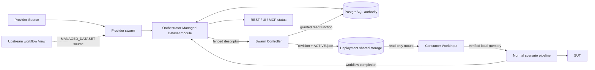

# Managed Test Data MVP Specification

Status: proposed; architecture, executable contracts, implementation and qualification pending
Scope: Scenario Manager, Orchestrator Managed Dataset module, Swarm Controller,
Worker SDK, UI and PocketHive Model Context Protocol (MCP)

## Decision required

Approve Managed Dataset as an additive PostgreSQL-backed option for durable,
reusable synthetic system-under-test (SUT) records. One provider run creates
one named Dataset per output binding. Each provider binding selects exactly one
`SCHEDULER`, `CSV`,
`REDIS` or derived `MANAGED_DATASET` source. Compatible consumer swarms select
one exact Dataset, Group and optional workflow View during Create Swarm.

Managed Dataset does not replace `REDIS_DATASET`, `CSV_DATASET` or direct
`SCHEDULER`. Existing adapters retain their current behaviour and configuration.
Every I/O binding names one adapter; PocketHive never migrates, substitutes or
falls back between them.

Use Record State and named Views for lifecycle outcomes. Create a downstream
Dataset only when successful processing produces records with independent
identity, schema, allocation, retention or lifecycle. This bounded Derivation is
the only cross-Dataset MVP transaction. Exact Dataset clone is separate and
deferred.

The main trade-off is more background publication and lease machinery, plus one
least-privilege Controller database reader, in exchange for durable sharing,
bounded mutable workflows and a measured request path with no PostgreSQL,
filesystem, Orchestrator or credential-provider call.

## Goal

Keep reusable test data available to continuous traffic within the admitted
storage horizon while preserving PocketHive's normal worker pipeline and
providing operational evidence that the selected Dataset reached the
consumer-input and SUT-attempt boundaries.

```text
provider source -> provider pipeline -> named Managed Dataset / Group
publication grant -> Controller database read -> active snapshot -> worker local memory -> SUT
```

## Hard rules

| Rule | Requirement |
|---|---|
| Additive option | Existing Dataset adapters remain unchanged. One binding never combines adapters or sources. |
| Explicit configuration | Every adapter, source, requirement, selection and setting is required by its tagged contract. Invalid or missing values fail before provisioning. |
| One creator | One provider run creates one Managed Dataset per Managed Dataset output binding. A worker restart keeps the run identity; a new provider run creates a new Dataset. |
| Named identity | Every Dataset freezes a human-readable `name` and opaque `datasetId`. Groups never replace either. |
| Frozen contract | Dataset name, SUT Environment, Dataset Space, Profile, schemas, Groups, Views, transitions, source and allocation never change for a runtime Dataset. |
| One schema | Every Dataset freezes one resolved Draft 2020-12 record schema. `WORKFLOW` also freezes one state schema. |
| State before extra Datasets | Success, retryable failure, terminal failure and unknown remain Record State and named Views in one `WORKFLOW` Dataset. |
| Explicit outcomes | A scenario-owned Outcome Normaliser emits one closed Outcome. A terminal Outcome Mapping handles all four classes, has no default and creates one complete next state. PocketHive never parses a SUT response to infer state. |
| Bounded derivation | `MANAGED_DATASET` consumes one exact upstream `WORKFLOW + EXCLUSIVE_LEASE` selection and writes to one downstream Dataset. Only `SUCCESS` creates bounded records. |
| Immutable payload | Record payload never changes. Workflow mutation affects separately versioned Record State only. |
| Explicit allocation | `REPLAY` uses `SHARED` or `EXCLUSIVE_LEASE`; `WORKFLOW` requires `EXCLUSIVE_LEASE`. Modes never mix within one Dataset. |
| Explicit consumers | A Scenario Template that needs no Managed Dataset declares `managedDatasetRequirements: []`, and Create Swarm declares `datasetSelections: []`. Otherwise every requirement has one exact compatible selection. |
| Provider-only templates | Group templates use only the Provider Scenario Binding's allowlisted non-secret `vars` and `sut` values. Consumers use resolved ids. |
| PostgreSQL authority | For Managed Dataset only, PostgreSQL owns runtime records, revisions, state, materialised View membership, imports, grants, lineage, leases, idempotency and background-work fencing. Files and worker memory are derivative. |
| Local measured path | Replay selection, prefetched workflow dispatch, Context validation and counters use verified local memory. Authority and publication work remains background/control-plane work. |
| Split publication boundary | Orchestrator validates and fences publication but never proxies snapshot bytes. Swarm Controller reads only the granted immutable revision through the explicit `DatasetSnapshotReader` PostgreSQL function adapter. Workers never access PostgreSQL. |
| Explicit activation | One atomic Active Snapshot Reference selects the completed publication for a binding. Workers never infer it by scanning directories or choosing a revision. |
| Least-privilege publication | The Controller writes only its swarm publication directory. Applicable consumer-input workers mount only their binding read-only. Other workers get no Dataset mount. |
| Bounded capacity | Deployment limits cover authoritative storage, mutation rates, snapshots, filesystem, memory and concurrency. Exhaustion rejects new work without eviction or fallback. |
| No inferred lifecycle | Managed Dataset never starts, replaces, fails over or reconciles provider swarms or SUT objects. |
| Bounded record lifecycle | MVP records are `NON_EXPIRING`. Replay can reuse them continuously; workflows that move records out of a ready View operate only within the admitted storage horizon. |
| No implicit deletion | MVP has no record retirement, reclamation or Dataset purge state machine. Direct PostgreSQL deletion is prohibited; a runbook and deployment limits bound retained data. |
| Continuity, not Controller HA | MVP has one active Controller per swarm. Fencing and deterministic restart recovery preserve publication safety; loaded workers may continue as defined, but multi-replica Controller election is not claimed. |
| One evidence model | Orchestrator alone derives consumption status. REST, UI and MCP project that read model unchanged. Missing or stale evidence yields `UNKNOWN`, never green. |

## Supported MVP

- Required Dataset name; `UNGROUPED` or bounded `GROUPED` mode.
- `REPLAY` immutable records with `SHARED` or `EXCLUSIVE_LEASE` allocation.
- `WORKFLOW` immutable records plus versioned Record State, materialised Views,
  declared transitions and `EXCLUSIVE_LEASE` allocation.
- Exact versioned record/state schema graphs composed from reusable Dataset
  Schema Contracts and local `$defs`.
- Provider sources: bounded fill-to-target `SCHEDULER`, finite `CSV`, finite
  immutable `REDIS` snapshot and bounded derived `MANAGED_DATASET`.
- Arbitrary schema-defined Group keys resolved before provider work.
- Non-expiring records, bounded Scheduler supply and durable idempotent
  grants/receipts.
- Explicit consumer requirements, compatibility listing and Create Swarm
  selection, including a swarm with no Managed Dataset.
- One bounded successful Derivation from an upstream workflow record to one
  downstream Dataset.
- Verified per-swarm snapshots, worker local memory and operational consumption
  status through REST, UI and PocketHive MCP.
- Deployment-wide storage protection, an operator retention runbook and
  replica-safe background work.

## Out of scope

- Queue/pop, bounded-use, one-use or use-count semantics; allocation overrides
  per record, Group or consumer; lease renewal, transfer or manual checkout.
- Free-form tags, arbitrary selectors or state patches, payload replacement,
  runtime-created Views/transitions and shared mutable snapshots.
- Outcome-selected destination Datasets, multi-destination fan-out or arbitrary
  cross-Dataset transactions.
- Exact Dataset clone, copy-on-write, aliases and in-place extension. A future
  Clone Dataset operation must pin one immutable source revision; transformation
  or enrichment uses Derivation.
- Multiple providers, transfer, automatic provider start/failover, source
  switching, rotating finite imports or destructive Redis pop.
- Sensitive records or credentials in records/state.
- Expiring records, record retirement/reclamation, Dataset purge and unbounded
  continuous workflow supply.
- Active-active multi-region, application-owned PostgreSQL high availability,
  multi-replica Controller election, cross-swarm snapshot caches, object storage,
  direct worker PostgreSQL access or direct Controller table access. Controller
  snapshot access is limited to the canonical read function.
- SUT reconciliation, automatic revalidation/deprovisioning, audit proof,
  exactly-once claims, malicious-worker resistance and arbitrary-window delivery
  evidence.

## Canonical terms

All terms in this table are `PROPOSED` unless marked `EXISTING`.

| Term | Meaning | Not the same as | Shorthand |
|---|---|---|---|
| SUT Environment (`EXISTING`) | Versioned environment and connection context used by a Scenario Binding | Dataset or provider | None |
| Dataset Space | Scenario Manager registry of Dataset Definitions and Schema Contracts for one binding context | Runtime Dataset | None |
| Scenario Binding | Frozen validated link between Scenario Template, SUT Environment, Dataset Space and variable profile | Provider dependency | None |
| Dataset Definition Bundle | Mounted package containing `dataset.yaml`, `record.schema.yaml` and optional `state.schema.yaml` | Scenario Bundle | Dataset Definition |
| Dataset Schema Contract | Reusable immutable schema at one exact version | Runtime record or local `$defs` | Schema Contract |
| Managed Dataset Provider Source | Required tagged provider-work source: `SCHEDULER`, `CSV`, `REDIS` or `MANAGED_DATASET` | Consumer input or fallback chain | Provider Source |
| Managed Dataset | Named Orchestrator-owned runtime parent created by one provider run and usable by compatible consumers | Redis list, queue or Group | Dataset |
| Dataset Group | Frozen typed partition under one Dataset, identified by `groupId` and `groupKey` | Dataset name or query | Group |
| Managed Dataset Profile | Frozen `REPLAY` or `WORKFLOW` behaviour | Per-consumer mode | Profile |
| Record State | Versioned `WORKFLOW` JSON stored separately from immutable record payload | Tag bag or SUT truth | None |
| Dataset View | Named materialised membership from fixed equality clauses over Record State | Runtime selector or copied Dataset | View |
| State Transition | Declared change from one View to another through bounded mutable paths | SUT inference or arbitrary patch | Transition |
| Record Lease | Authority-owned temporary exclusive allocation | Business state or broker acknowledgement | Lease |
| Managed Dataset Outcome | Closed `{class, code}` result: `SUCCESS`, `RETRYABLE_FAILURE`, `TERMINAL_FAILURE` or `UNKNOWN` | SUT truth, state or transport header | Outcome |
| Outcome Mapping | Terminal configuration mapping every Outcome class to one complete next state | Regex extraction or default route | None |
| Managed Dataset Derivation | Atomic bounded creation of independent downstream records plus upstream state transition and lease release | Outcome routing or clone | Derivation |
| Dataset Snapshot Reader | Swarm Controller port that streams one granted immutable revision through the deployment's explicit PostgreSQL function adapter | Orchestrator REST export or worker database access | Snapshot Reader |
| Active Snapshot Reference | Atomic binding-level file selecting one completed publication and monotonic activation generation | PostgreSQL authority or a directory scan | Active Reference |
| Dataset Context | SDK-owned WorkItem identity and safety data | Observability or broker header | None |
| Consumption Status | Orchestrator read model proving matching operational evidence at declared boundaries | Audit or SUT-acceptance proof | None |

## Ownership

| Concern | Owner | Must not own |
|---|---|---|
| Dataset/contract packages, restricted schema compilation and digests | Scenario Manager | Runtime records, leases or source choice |
| Dataset Definition, Profile, schemas, grouping, Views and transitions | Dataset Definition Bundle | Scenario templates or runtime ids |
| Source, Groups, mappings, allocation, lifecycle, supply and capacity | Provider Scenario Binding | Consumer selection or provider automation |
| Required access/Profile/allocation and workflow View/transition | Consumer Scenario Template | Concrete Dataset ids or provider templates |
| Frozen SUT/Dataset compatibility | Consumer Scenario Binding | Live rebinding |
| Exact Dataset/Group/View choice or explicit empty choice | Create Swarm | Fallback or alias following |
| Runtime records, state, memberships, imports, grants, lineage, leases and idempotency | Orchestrator Managed Dataset module | SUT calls, source parsing or filesystem publication |
| Source parsing and scenario result normalisation | Scenario-owned worker pipeline | Authority mutation |
| Publication grant, completion and activation generation | Orchestrator Managed Dataset module | Snapshot byte proxying or filesystem writes |
| Granted snapshot read and filesystem publication | Swarm Controller through `DatasetSnapshotReader` | Schema discovery, authority mutation or direct table access |
| Context construction/preservation/guard and local selection | Worker SDK adapters | Business outcome classification |
| Storage, limits, clock health and connection references | Deployment capability profile | Scenario-selected infrastructure |
| Retention horizon, alerts, response and backup/restore | Operator runbook | Direct row deletion or implicit purge |

## Architecture


```mermaid
flowchart LR
  PS[Provider Source] --> P[Provider swarm]
  U[Upstream workflow View] -. MANAGED_DATASET source .-> P
  P --> O[Orchestrator Managed Dataset module]
  O <--> PG[(PostgreSQL authority)]
  O -->|fenced descriptor| SC[Swarm Controller]
  SC -->|granted read function| PG
  SC -->|revision + ACTIVE.json| FS[(Deployment shared storage)]
  FS -->|read-only mount| WI[Consumer WorkInput]
  WI -->|verified local memory| S[Normal scenario pipeline]
  S --> SUT[SUT]
  S -->|workflow completion| O
  O --> E[REST / UI / MCP status]
```

No Dataset-specific RabbitMQ lane is added. Managed Dataset adapters implement
the existing `WorkInput` and `WorkOutput` ports.

## Authoring and selection contracts

### Dataset Definition and schemas

Scenario Manager reads these fixed registry paths:

```text
scenarios/bundles/<scenario-name>/scenario.yaml
scenarios/managed-dataset/<dataset-name>/dataset.yaml
scenarios/managed-dataset/<dataset-name>/record.schema.yaml
scenarios/managed-dataset/<dataset-name>/state.schema.yaml  # WORKFLOW only
scenarios/dataset-contracts/<name>/<version>/schema.yaml
```

`dataset.yaml` is the only Dataset Definition entry point. Directory name must
equal `id`; `version` is SemVer. Record and state roots use exact paths shown
above. Scenario Manager rejects duplicates, case collisions, traversal,
symlink escape, missing/unexpected entry points and changed content under a
published `id + version`. A failed reload publishes no partial registry revision
and leaves the last valid revision active; this is transaction safety, not
version fallback.

Each root is JSON Schema Draft 2020-12. It may reference exact immutable
`pockethive://dataset-contracts/<name>/<version>` contracts and local `$defs`.
Ranges, `latest`, HTTP(S), unresolved references, cycles and unsupported dialects
fail. A restricted versioned meta-schema forbids unknown keywords and bounds
file/compiled bytes, references, depth, Views, clauses, transitions, mutable
paths and validation errors. Scenario Manager stores one compiled artifact and
opaque `sha256:` digest; other components compare the digest and never recompile.

The deployment supplies positive `maximumDatasetDefinitionBundles`,
`maximumDatasetContractVersions`, `maximumSchemaBytesPerFile`,
`maximumCompiledSchemaBytes`, `maximumSchemaReferences`,
`maximumSchemaReferenceDepth`, `maximumRecordValidationErrors`,
`maximumStateValidationErrors`, `maximumDatasetViews`,
`maximumDatasetViewClauses`, `maximumDatasetTransitions` and
`maximumMutableStatePaths`. Exceeding any bound fails publication. Record roots
use `$id: pockethive://managed-dataset/<id>/<version>/record`; workflow state
roots use the corresponding `/state` id.

Illustrative Dataset Definition:

```yaml
id: shared-records
version: 1.0.0
name: Shared Records
profile: WORKFLOW
recordSchemaRef: {path: record.schema.yaml}
workflow:
  stateSchemaRef: {path: state.schema.yaml}
  views:
    - id: ready
      match: {all: [{path: /phase, equals: READY}]}
    - id: attempted
      match: {all: [{path: /phase, equals: ATTEMPTED}]}
    - id: successful
      match: {all: [{path: /outcome, equals: SUCCESS}]}
    - id: retryable
      match: {all: [{path: /outcome, equals: RETRYABLE_FAILURE}]}
    - id: failed
      match: {all: [{path: /outcome, equals: TERMINAL_FAILURE}]}
    - id: unknown
      match: {all: [{path: /outcome, equals: UNKNOWN}]}
  transitions:
    - id: attempt-complete
      fromViewId: ready
      toViewId: attempted
      mutableStatePaths: [/phase, /outcome, /attemptCount, /lastResultCode]
    - id: retry-complete
      fromViewId: retryable
      toViewId: attempted
      mutableStatePaths: [/outcome, /attemptCount, /lastResultCode]
grouping:
  type: GROUPED
  fields:
    - {name: category, type: STRING, maximumLength: 40}
    - {name: variant, type: STRING, maximumLength: 40}
  maximumGroups: 8
```

`UNGROUPED` forbids fields and creates one internal Group. `GROUPED` requires
1..8 ordered fields, `maximumGroups` 1..64 and unique names matching
`[A-Za-z][A-Za-z0-9_]{0,63}`. Types are `STRING`, signed 64-bit `INTEGER` and
`BOOLEAN`. Strings require `maximumLength` 1..256 and forbid empty, control,
leading-space and trailing-space values. Every Group key contains every field
and no other field; null, nesting and coercion fail. Values compare by exact
type and, for strings, exact case-sensitive content.

`REPLAY` forbids workflow configuration. `WORKFLOW` requires a closed object
state schema, fixed Views and transitions. View clauses are bounded equality
tests on primitive leaves. OR, ranges, negation, expressions and author SQL are
forbidden. Mutable paths are non-root, unique and prefix-disjoint. Orchestrator
materialises memberships on every state commit; consumers never evaluate View
predicates. A transition validates `fromViewId`, permitted changed paths,
complete next-state schema and `toViewId`. State may match other overlapping
Views, so the example's outcome Views do not copy records.

### Provider binding and sources

The Provider Scenario Binding owns one source and resolves the complete Group
set before provider work:

```yaml
providerDataset:
  datasetDefinitionId: shared-records
  source: {type: SCHEDULER}
  allocation:
    type: EXCLUSIVE_LEASE
    recordLeaseDuration: PT2M
    maximumActiveRecordLeases: 100
  groups:
    - groupKey:
        category: "{{ vars.recordCategory }}"
        variant: "{{ sut.type }}"
```

Provider admission creates the Dataset idempotently on
`providerSwarmId + providerRunId + providerBindingRef`. Exact replay returns the
same `datasetId`; changed content fails. The Dataset stores immutable provider,
run, binding/version, SUT Environment, Definition, schema digests, source and
policy provenance. `name` is required, non-unique, at most 120 Unicode code
points, has no control characters or surrounding whitespace and is never an
identity or secret.

`groups` is non-empty for `GROUPED` and forbidden for `UNGROUPED`. Templates use
only allowlisted, non-secret provider `vars` and `sut` metadata. Orchestrator
renders once, validates exact fields/types/counts, rejects unresolved or duplicate
keys and assigns opaque `groupId`s. Provider results and consumers cannot create
or change Groups.

| `source.type` | Required settings | Behaviour |
|---|---|---|
| `SCHEDULER` | No source block | Authority-granted bounded fill-to-target work |
| `CSV` | `artifactRef`, one valid ASCII `delimiter`, `charset: UTF-8`, `header: true` | One finite stable-row-order import from the provider bundle |
| `REDIS` | `connectionRef`, literal `listName`, `itemFormat: JSON`, `snapshotMode: COPY`, positive `snapshotTtl` | One finite stable-index import from an immutable staging copy |
| `MANAGED_DATASET` | `sourceBindingRef`, positive `minimumDerivedRecordsOnSuccess`, `maximumDerivedRecordsPerSource` | Bounded leased derivation from one exact upstream workflow requirement |

Exactly the matching block is present. Every MVP source requires
`lifecycle.type: NON_EXPIRING`; expiring-lifecycle fields are forbidden.

CSV creates one object from unique non-empty headers. It accepts UTF-8,
quoted/doubled-quote fields and LF/CRLF; malformed encoding, quoting, headers or
row width fails the whole import. Each Redis element is one UTF-8 JSON object.
Before import, the adapter validates all items, bytes, Group mappings and
schemas. `source.groupMapping` is required for grouped CSV/Redis/Managed Dataset,
forbidden for Scheduler/ungrouped, and maps every grouping field to one source
JSON Pointer. Managed Dataset pointers read immutable upstream `record` only;
state and provider output are forbidden. CSV can map only strings; no source
coercion exists.

Redis `connectionRef` resolves one deployment registry entry containing
endpoint, TLS, topology and credential reference. The adapter uses a deterministic
provider-run staging key, `COPY` without replacement and expiry in one
`MULTI/EXEC`; it validates every command result because Redis transactions do not
roll back command failures. Copy, expiry, collision, fingerprint or owned-key
cleanup failure blocks the run and never reads, pops or changes the live list.
Cluster mode requires a non-empty hash tag shared by live and staging keys.

Finite sources bind one immutable `sha256:` fingerprint: exact CSV bytes, or
Redis raw items in stable index order with length framing. Exact restart resumes;
another fingerprint fails. Paths, keys, credentials and source values are not
exposed to consumers, status, metrics or normal logs.

Source state is closed. Scheduler and Managed Dataset are `ACTIVE` and have no
fingerprint. CSV/Redis move `PENDING_IMPORT -> IMPORTING -> COMPLETE|FAILED`;
the first valid import binds the previously null fingerprint, which can never be
cleared or changed. Finite item identity uses one-based logical CSV row or Redis
list index:

```text
sourceItemKey = sha256(sourceType + "\n" + sourceFingerprint + "\n" + decimalPosition)
```

For `MANAGED_DATASET`, `sourceBindingRef` names one requirement in the same
Provider Scenario Template. It must be `WORKFLOW`, `READ_STATE_TRANSITION`,
`EXCLUSIVE_LEASE`, one exact View and transition. Create Swarm freezes its
upstream Dataset/Group/View. The provider has one downstream Managed Dataset
output. `1 <= minimumDerivedRecordsOnSuccess <= maximumDerivedRecordsPerSource`
and both obey deployment limits.

### Lifecycle and supply

| Field | Rule |
|---|---|
| `allocation` | `REPLAY`: `SHARED` or `EXCLUSIVE_LEASE`; `WORKFLOW`: `EXCLUSIVE_LEASE` only |
| `lifecycle.type` | Required literal `NON_EXPIRING` |
| `usableFor`, `renewalLeadTime`, `maximumExpiryCohort`, `replacementHeadroom` | Forbidden |
| `minimumReady`, `targetReady`, `maximumReady` | `0 <= minimumReady <= targetReady <= maximumReady` |
| `refillCycleInterval`, `maximumProviderCompletionTime`, `providerCapacityRecordsPerSecond` | Required positive Scheduler bounds |

`maximumStored = maximumReady`. Records remain stored and count toward every
deployment limit. Finite imports require each Group count within
`targetReady..maximumReady` and publish all Groups only after full validation.
Scheduler refill grants reserve capacity and stage receipts; one grant
completion atomically commits the complete cohort and advances at most one
payload revision per affected Group. Stale work publishes nothing.

Scheduler grant size is the minimum of requested batch, target deficit,
`maximumReady` deficit, `maximumStored` deficit and every deployment reservation
limit. A non-positive result creates no work. Refill counts include active grants
so concurrent replicas cannot over-reserve.

`REPLAY + SHARED` may reuse stored records indefinitely. A workflow transition
can move records out of its source View but never deletes them. Scheduler and
Managed Dataset supply therefore stop at `maximumStored`; such workflows are
horizon-bounded until a separately approved reclamation contract exists.

### Consumer requirements and Create Swarm

```yaml
managedDatasetRequirements:
  - bindingRef: inputRecords
    datasetDefinitionId: shared-records
    profile: WORKFLOW
    access: READ_STATE_TRANSITION
    allocation:
      type: EXCLUSIVE_LEASE
      acquireBatchSize: 10
      maximumHeldRecordLeases: 20
      acquireInterval: PT1S
    workflow:
      viewId: ready
      transitionId: attempt-complete
      allowReleaseUnchanged: false
      completionRole: dataset-completion
      completionLagTolerance: PT30S
```

Requirement omission is invalid after contract activation; no Dataset requires
an explicit empty array. `bindingRef` is unique. Compatibility requires the same
SUT Environment, Dataset Space, Definition/version, Profile, access, allocation,
schema digests and, for workflow, View/transition. A provider using
`MANAGED_DATASET` references its upstream requirement; it is not both a normal
consumer input and provider source for the same binding.

Create Swarm lists only compatible named Dataset/Group/View choices. The request
contains one selection per requirement or exactly `datasetSelections: []`. A
selection freezes `datasetId`, `groupId`, optional `viewId`, Profile, allocation,
schema digests and its admitted `revision` as the initial snapshot revision.
Completed activation generations may advance that revision within the same
frozen selection; no identity, schema, Group, View, Profile or allocation may
change. Empty or failed discovery never substitutes another choice. The Create
Swarm model may list compatible shared Datasets already bound to the same SUT
Environment and Dataset Space.

## Worker I/O contract

Provider and consumer adapters are explicit:

```yaml
# first provider bee
inputs:
  type: MANAGED_DATASET_PROVIDER
  managedDatasetProvider: {bindingRef: supplyRecords, batchSize: 100}

# terminal provider bee for Scheduler/CSV/Redis
outputs:
  type: MANAGED_DATASET
  managedDataset: {bindingRef: supplyRecords, operation: CREATE_RECORD}

# consumer input
inputs:
  type: MANAGED_DATASET
  managedDataset:
    bindingRef: inputRecords
    ratePerSec: 500
    sutAttemptRole: sut-client
    sutAttemptGuard:
      maximumInvocationDuration: PT5S
      maximumClockSkew: PT1S
    consumptionObservation:
      reportInterval: PT5S
      staleAfter: PT20S
      observationWindow: PT15S
      pipelineLagTolerance: PT30S
```

`batchSize` is a bounded fetch maximum, not source selection. Provider source
capabilities use one required closed `managedDatasetProviderSources` array.
Missing capability fails before provisioning. `CREATE_RECORD` is valid for
Scheduler/CSV/Redis. A Managed Dataset source uses `COMPLETE_DERIVATION`.

The declared `sutAttemptRole` image must advertise
`managedDatasetSutAttemptGuard: SUPPORTED`; missing, `UNSUPPORTED`, unknown or
multiple attempt roles fail admission. Scenario Manager validates provider and
consumer adapter capabilities before Orchestrator creates a run.

Every provider item carries SDK-owned `MANAGED_DATASET_PROVIDER_CONTEXT` at
`WorkItem.headers[ph.dataset.provider.context]` inside the normal JSON WorkItem
body. Every Context contains `schemaVersion`, `datasetId`, `groupId`,
`bindingRef`, `sourceType` and `workType`. `REFILL` adds `grantId`,
`grantItemId`, `providerOperationKey`, `grantExpiresAt`; `IMPORT` adds
`importId`, `sourceItemKey`, `sourceFingerprint`, `sourcePosition`; `DERIVATION`
adds `derivationGrantId`, `derivationItemId`, `providerOperationKey`,
`grantExpiresAt`, `sourceBindingRef`, source Dataset/Group/record/View/lease,
payload/state revisions and preassigned destination `groupId`. Fields from
another work type are forbidden. Derivation also carries one normal Dataset
Context for the upstream record. Authors and intermediate workers cannot create
or change either Context.

`REPLAY` consumer payload is the record. `WORKFLOW` payload is
`{"record":...,"recordState":...}`. State remains normal scenario data, not
observability context. Every worker preserves Dataset Context.

The terminal workflow adapter is explicit:

```yaml
outputs:
  type: MANAGED_DATASET
  managedDataset:
    bindingRef: inputRecords
    operation: COMPLETE_STATE_TRANSITION
    outcomeMapping:
      sourcePath: /outcome
      cases:
        SUCCESS:
          nextStateMapping:
            phase: ATTEMPTED
            outcome: SUCCESS
            attemptCount: "{{ payload.attemptCount }}"
            lastResultCode: "{{ payload.outcome.code }}"
        RETRYABLE_FAILURE:
          nextStateMapping:
            phase: ATTEMPTED
            outcome: RETRYABLE_FAILURE
            attemptCount: "{{ payload.attemptCount }}"
            lastResultCode: "{{ payload.outcome.code }}"
        TERMINAL_FAILURE:
          nextStateMapping:
            phase: ATTEMPTED
            outcome: TERMINAL_FAILURE
            attemptCount: "{{ payload.attemptCount }}"
            lastResultCode: "{{ payload.outcome.code }}"
        UNKNOWN:
          nextStateMapping:
            phase: ATTEMPTED
            outcome: UNKNOWN
            attemptCount: "{{ payload.attemptCount }}"
            lastResultCode: "{{ payload.outcome.code }}"
```

The normal pipeline emits
`{"outcome":{"class":<closed-class>,"code":<bounded-string-or-null>}}`.
`resultRules` may extract a business code for the Outcome Normaliser, but no
regex or step header changes Dataset state. `sourcePath` points to the complete
Outcome; all four cases are required exactly once and default is forbidden.
Each mapping creates one complete state that satisfies the declared target View.
`RETRYABLE_FAILURE` labels state for a separate retry workflow; it does not
authorise automatic retry. `UNKNOWN` represents an observed ambiguous terminal
result and cannot create derived records. Missing terminal output changes no
state and leaves the lease active until valid completion or expiry.

`RELEASE_RECORD_LEASE` is the only workflow alternative and is valid only when
`allowReleaseUnchanged: true`; it forbids Outcome and state fields.

For `COMPLETE_DERIVATION`, output also supplies one bounded ordered array from
`derivedRecordsMapping.sourcePath`. Each element is
`{"record":...,"initialState":...}`; `initialState` is complete for a
`WORKFLOW` destination and null for `REPLAY`. Destination identity comes only
from Provider Context. `SUCCESS` requires the configured count; other classes
require an empty array.

## Authority API and failure contract

M0 adds one canonical DTO schema and these authenticated background operations.
Workers never connect to PostgreSQL. Controller snapshot access uses only the
explicit Snapshot Reader contract below; it has no table privileges or REST
snapshot-byte fallback.

| Operation | Product API | Essential rule |
|---|---|---|
| Refill grant | `POST /api/managed-datasets/{datasetId}/groups/{groupId}/refill-grants` | Scheduler only; `bindingRef`, `batchSize`, idempotency key; reserves bounded items/capacity |
| Refill receipt | `PUT /api/managed-datasets/{datasetId}/groups/{groupId}/refill-grants/{grantId}/items/{grantItemId}/receipt` | Provider key, record and optional required workflow initial state; stages but does not publish |
| Refill completion | `PUT /api/managed-datasets/{datasetId}/groups/{groupId}/refill-grants/{grantId}/complete` | Expected count; commits the complete cohort atomically |
| Begin finite import | `POST /api/managed-datasets/{datasetId}/source-imports` | CSV/Redis only; source type/fingerprint, total item/byte and exact per-Group counts |
| Import receipt | `PUT /api/managed-datasets/{datasetId}/source-imports/{importId}/items/{sourceItemKey}/receipt` | Exact Group, record and optional required workflow initial state; stable source-position identity |
| Import completion | `PUT /api/managed-datasets/{datasetId}/source-imports/{importId}/complete` | Repeats fingerprint/counts; publishes all Groups atomically or none |
| Derivation grant | `POST /api/managed-datasets/{destinationDatasetId}/derivation-grants` | Destination/source binding refs and batch; claims exact upstream View members and reserves maximum destination capacity |
| Derivation completion | `PUT /api/managed-datasets/{destinationDatasetId}/derivation-grants/{derivationGrantId}/items/{derivationItemId}/completion` | Both bindings, provider key, source lease/View/revision, Outcome, mapping digest, next state and ordered records; changes both Datasets atomically |
| Begin publication | `POST /api/managed-datasets/{datasetId}/groups/{groupId}/snapshot-publications` | Controller swarm/run/binding only; returns a fenced, expiring descriptor pinned to one revision/digest and one opaque Snapshot Reader grant |
| Complete publication | `PUT /api/managed-datasets/{datasetId}/groups/{groupId}/snapshot-publications/{publicationId}/complete` | Exact manifest/chunk/whole digests and fencing token; atomically completes the publication and returns the next binding-scoped `activationGeneration` |
| Recover publication | `GET /api/managed-datasets/{datasetId}/groups/{groupId}/snapshot-activation?swarmId={swarmId}&runId={runId}&bindingRef={bindingRef}` | Active Controller only; returns the frozen selection and latest completed publication/generation for deterministic recovery, never record bytes |
| Replay leases | `POST /api/managed-datasets/{datasetId}/groups/{groupId}/record-leases` | `REPLAY + EXCLUSIVE_LEASE`; binding, revision and requested count |
| Workflow claims | `POST /api/managed-datasets/{datasetId}/groups/{groupId}/views/{viewId}/record-leases` | Binding, payload revision and requested count; returns record, state, lease and state revision |
| State transition | `PUT /api/managed-datasets/{datasetId}/groups/{groupId}/record-leases/{recordLeaseId}/state-transition` | Binding, claimed View/revision, transition, Outcome, mapping digest and complete next state; one transaction |
| Unchanged release | `PUT /api/managed-datasets/{datasetId}/groups/{groupId}/record-leases/{recordLeaseId}/release` | Replay exclusive, or explicitly allowed workflow release with claimed View/revision only |

Every mutating request contains `bindingRef`, scoped `idempotencyKey` and the
operation's expected identities/revisions. Responses repeat enough identity for
the caller to reject mismatches. Schema errors return bounded keyword/JSON
Pointer locations without values or unrestricted validator messages.

The deployment injects one required `managedDatasetClient` with `baseUrl`,
`serviceAuthRef`, `requestTimeout`, `operationTimeout`, `maximumAttempts` and
`retryBackoff`. Production requires HTTPS. Values are positive and
`operationTimeout >= requestTimeout`.

The Controller also receives one required tagged `managedDatasetSnapshotReader`:

```yaml
type: POSTGRESQL_FUNCTION
postgresqlFunction:
  connectionRef: managed-dataset-snapshot-reader
  connectTimeout: PT5S
  readTimeout: PT30S
  maximumConnections: 2
  maximumPageRecords: 1000
  maximumPageBytes: 4194304
```

No other reader type is supported in MVP. Values are deployment-owned, positive
and benchmark-qualified. Missing or invalid configuration fails provisioning;
reader failure never falls back to Orchestrator REST, another credential or
another revision.

`connectionRef` resolves one deployment registry entry containing the JDBC
endpoint, database, TLS/trust settings and credential reference. Scenario
authors cannot select or override it.

The canonical `ph_managed_dataset_snapshot_page` database function accepts
`publicationId`, opaque grant token, fencing token, `afterRecordId` and bounded
page limit. It verifies the
authenticated reader role, hashed grant, Controller/run/binding identities,
grant expiry, fencing token and pinned revision. It returns one closed page with
those identities, ordered `{recordId, record}` rows, `nextRecordId` and
`complete`. Changed identity, duplicate/out-of-order rows or an over-limit page
fails publication. The role receives `CONNECT`, schema `USAGE` and function
`EXECUTE` only. Connections enforce read-only transactions. The function is
`STABLE` and `SECURITY DEFINER`, uses no dynamic SQL, has a fixed safe
`search_path` and a non-login owner. Its migration revokes default `PUBLIC`
execution in the same transaction.

Closed errors are:

```text
AUTHENTICATION_FAILED, AUTHORISATION_FAILED, CONTRACT_INVALID,
DATASET_NOT_FOUND, GROUP_NOT_FOUND, VIEW_NOT_FOUND, BINDING_MISMATCH,
PROFILE_MISMATCH, ALLOCATION_MISMATCH, SOURCE_INVALID, SOURCE_MISMATCH,
SOURCE_INCOMPLETE, RECORD_INVALID, STATE_INVALID, OUTCOME_INVALID,
DERIVATION_INVALID, CAPACITY_EXCEEDED, RATE_LIMITED, GRANT_STALE,
IMPORT_STALE, DERIVATION_GRANT_STALE, RECORD_LEASE_NOT_FOUND,
RECORD_LEASE_NOT_ACTIVE, RECORD_LEASE_EXPIRED, RECORD_LEASE_MISMATCH,
STATE_REVISION_CONFLICT, STATE_TRANSITION_INVALID, IDEMPOTENCY_CONFLICT,
IDEMPOTENCY_WINDOW_EXPIRED, SNAPSHOT_PUBLICATION_NOT_FOUND,
SNAPSHOT_REVISION_NOT_FOUND, SNAPSHOT_DIGEST_MISMATCH,
SNAPSHOT_READER_GRANT_INVALID, SNAPSHOT_READER_UNAVAILABLE,
SNAPSHOT_ACTIVATION_CONFLICT, SNAPSHOT_STORAGE_UNAVAILABLE,
REDIS_STAGING_CLEANUP_FAILED,
AUTHORITY_UNAVAILABLE
```

Authentication/authorisation, contract, mismatch, invalid, stale, conflict,
expiry, digest and cleanup errors are not retryable. `RATE_LIMITED` and bounded
transient `AUTHORITY_UNAVAILABLE` may retry only within `maximumAttempts` and
`operationTimeout`, using the same idempotency key, a new correlation id and
server `Retry-After` within the remaining budget. No error changes adapter,
source, Dataset, Group or View.

`SNAPSHOT_READER_UNAVAILABLE` may retry only inside the unexpired publication
grant and Snapshot Reader timeout with the same descriptor and cursor.
`SNAPSHOT_READER_GRANT_INVALID` and `SNAPSHOT_ACTIVATION_CONFLICT` are terminal
for that Controller attempt. No reader error switches transport or credential.

## Safety and runtime behaviour

### Allocation and workflow

`SHARED` uses deterministic local `ROUND_ROBIN` over the verified snapshot and
permits concurrent reuse. It never depletes supply.

`EXCLUSIVE_LEASE` permits one active authority lease per record. Acquisition is
bounded by `acquireBatchSize`, `maximumHeldRecordLeases`, per-Group
`maximumActiveRecordLeases` and deployment mutation limits. Admission requires:

```text
expectedSourceInstances * maximumHeldRecordLeases <= maximumActiveRecordLeases
1 <= acquireBatchSize <= maximumHeldRecordLeases <= targetReady
```

Lease duration must exceed clock skew, pipeline lag, maximum invocation,
workflow completion lag and one completion timeout. A record remains unavailable
until exact release/transition or authority expiry. There is no renewal or
silent SDK release. Expiry can overlap an external SUT call that outlives its
declared bound, so the MVP makes no exact-use or exactly-once claim.

A workflow completion locks the live lease/state, verifies owner, expiry,
claimed View, expected state revision, transition, mapping digest, changed
paths, complete next-state schema, target View and capacity, then changes state,
materialised memberships and lease in one transaction. Any failure changes none.

### Derivation

Derivation bridges mutable workflow processing to independent reusable records;
it is not physical outcome routing. Authority claims one upstream View member,
reserves the configured maximum destination record/state/membership/lineage
capacity and returns one item. The scenario and SUT call run without database
locks.

Terminal completion uses deterministic lock order and:

1. validates unchanged Provider/Dataset Contexts, both bindings, grant/lease
   expiry, source View and expected state revision;
2. validates the closed Outcome, mapping digest and complete next state;
3. requires configured `1..N` records for `SUCCESS` and zero otherwise;
4. validates every destination record, initial state and preassigned Group;
5. derives lineage from source Dataset/Group/record/state revision, provider
   binding version, destination binding and one-based ordinal;
6. inserts destination records/state/View memberships, advances at most one
   destination Group revision, changes upstream state/memberships and releases
   its lease; and
7. releases unused reservation and returns both revisions and committed count.

The transaction commits or rolls back. Failure creates no downstream record and
changes no upstream state. Exact replay returns the stored result; changed or
stale replay fails. Lineage is authority metadata, never payload, selector,
metric dimension or normal-log data. A `REPLAY + SHARED` destination can then
serve the immutable derived records to many swarms.

### PostgreSQL transaction and idempotency contract

All time comparisons use PostgreSQL transaction time. Mutations lock Dataset,
Group, record/state, lease/grant/import/publication/idempotency rows in documented
ascending Dataset/Group/record order. Cross-Dataset Derivation locks both
Datasets in ascending identity order. Default isolation is `READ COMMITTED` plus
constraints and conditional updates. SQLSTATE `40001`/`40P01` retries remain
inside the same operation budget.

Every mutation scopes idempotency to authenticated principal, operation, route
target, Dataset/Group, run and `bindingRef`. The fingerprint is SHA-256 over RFC
8785 canonical request JSON excluding `correlationId` and the key. Exact replay
inside retention returns the original status/body; changed replay returns
`IDEMPOTENCY_CONFLICT`. After response retention, a tombstone returns
`IDEMPOTENCY_WINDOW_EXPIRED` and never executes. Retention exceeds the largest
operation, broker-redelivery, lease/grant/import/publication and clock-skew
horizon. Capacity exhaustion rejects a new mutation before execution.

Replica-safe refill recovery, import recovery, publication export and other
background work use PostgreSQL leases containing work identity, owner instance,
expiry and monotonically increasing fencing token. Acquisition/renewal is a
conditional transaction; every later mutation checks the current token. A stale
replica may finish local work but cannot commit it. Controller publication grants
use the same fencing rule. There is no process-local or implicit leader fallback.

## Dataset Context and snapshot publication

Dataset Context lives at `WorkItem.headers[ph.dataset.context]` inside the JSON
WorkItem body. It is not an AMQP/HTTP header or observability baggage. The closed
object contains `schemaVersion`, `runId`, `bindingRef`, `datasetId`, `groupId`,
`profile`, `allocation`, `recordId`, `snapshotRevision`, `recordSchemaDigest`
and `activationGeneration`. `EXCLUSIVE_LEASE` adds `recordLeaseId` and
`recordLeaseExpiresAt`; `WORKFLOW` adds `viewId` and `stateRevision`. No other
fields are allowed. Context contains no record value or credential.

The SDK alone creates Context at selection and preserves it byte-for-byte
through the pipeline. Immediately before SUT network I/O, the declared
`sutAttemptRole` validates Context, frozen binding, local snapshot, Group,
Profile, allocation, activation generation, View/state revision and any lease
horizon. Malformed, missing, expired or mismatched Context prevents the network
write.

Required safety checks are strict inequalities:

```text
# REPLAY + EXCLUSIVE_LEASE
localNow + maximumClockSkew + maximumInvocationDuration < recordLeaseExpiresAt

# WORKFLOW
localNow + maximumClockSkew + maximumInvocationDuration
  + completionLagTolerance + operationTimeout < recordLeaseExpiresAt
```

`EXCLUSIVE_LEASE` uses an injected monotonic-adjusted `Clock` plus a background
clock-health port. Only fresh `WITHIN_BOUND` permits exclusive readiness/traffic;
`OUT_OF_BOUND`, stale or missing health stops it without a measured-path remote
call. `REPLAY + SHARED` has no record or lease expiry and requires no clock-health
oracle; all identity, schema, digest and activation checks still apply.

For each admitted binding, the active Controller obtains one fenced publication
descriptor, streams bounded keyset pages through `DatasetSnapshotReader` and
writes:

```text
<storage>/swarms/<swarmId>/<bindingMountId>/
  ACTIVE.json
  <snapshotRevision>/
    chunk-000001.ndjson
    ...
    manifest.json
    READY
```

Chunks contain one closed `{recordId, record}` envelope per line in ascending
record-id order using RFC 8785 JSON. Record State, Views and leases are never
published. The closed manifest freezes Dataset/Group/binding/revision, schema
URI/digest, counts, bytes, chunk digests and whole digest. The Controller writes
a staging directory, fsyncs files/directories, verifies counts/digests, writes
`READY` last and publishes by one qualified atomic directory move. Symlinks,
traversal, special files, partial revisions and cross-filesystem moves fail.
Publications are immutable, single-flight and coalesce later revisions.

The Controller then completes the publication through Orchestrator. Only a
successful completion returns a monotonic `activationGeneration`. The Controller
writes a closed RFC 8785 `ACTIVE.json` containing `schemaVersion`,
`publicationId`, `snapshotRevision`, `manifestDigest`, `wholeSnapshotDigest` and
`activationGeneration`. The storage adapter rejects a non-increasing generation,
fsyncs a temporary file and its directory, then atomically replaces the reference.
Unsupported atomic replacement fails qualification; there is no non-atomic
fallback. Every failure before replacement preserves the old Active Reference.

Workers read `ACTIVE.json`, never scan revision directories, and never choose the
highest revision. They reject a generation lower than the last accepted one,
resolve only the named revision, verify `READY`, manifest, schema, chunks and all
digests, enforce byte/record/memory limits, build the next immutable snapshot and
atomically swap local memory. The current and next snapshots are memory-accounted.
Cleanup never removes an active, worker-held or in-progress revision.

Storage is deployment-selected and qualified for shared visibility, atomic
moves, durability, reschedule and outage semantics. Missing, unhealthy or
writable consumer storage fails provisioning. Loaded safe workers may continue
during temporary Controller/filesystem/authority impairment: shared replay has
no record horizon, while exclusive work stops when prefetched leases are no
longer safe. New/restarted workers remain unready. Workflow claims and leases
still require background authority.

### Controller continuity and recovery

MVP provisions exactly one active Controller per swarm; it does not provide
application-level Controller election or active-active failover. Orchestrator
fences every publication descriptor, and the deployment must prevent concurrent
Controller writers to one swarm publication directory. A compute/storage adapter
that cannot guarantee this fails provisioning.

On restart, the Controller obtains the frozen selections and latest completed
publication/activation generation from Orchestrator, validates the exact Active
Reference and immutable revision, and idempotently restores a missing or older
reference. It never infers state from directory order. A corrupt, mismatched or
newer unexplained reference fails recovery. If no completed revision is usable,
the Controller starts a new fenced publication. Recovery must finish within the
deployment's positive `maximumControllerRecoveryTime`; otherwise the binding is
degraded, and new/restarted workers stay unready. This is continuity for loaded
workers, not Swarm Controller high availability.

## Operational consumption status

Telemetry is bounded and non-blocking. The Controller, consumer input,
SUT-attempt role and workflow completion role report low-frequency monotonic
counters/current gauges through existing `status-full` and `status-delta`
contexts. Delta entries replace complete samples; they are never patches. One
entry exists per `bindingRef + boundary + worker instance`; process start and
sample sequence define an epoch. Missing full baseline, restart, counter
decrease or out-of-order sample yields `UNKNOWN` until two fresh samples exist.

Boundaries are `SNAPSHOT_PUBLICATION`, `SOURCE`, `SUT_ATTEMPT` and, for
workflow, `WORKFLOW_COMPLETION`. A derived provider's Managed Dataset input is
`SOURCE`; Scheduler/CSV/Redis provider input is not a Dataset consumer.

M0 adds no event family. `status-full.data.context.managedDatasetConsumption[]`
is present, possibly empty, and contains the complete current entries owned by
that worker. The same path in `status-delta`, when present, contains complete
replacement entries only for changed keys. Each entry contains `schemaVersion`,
`runId`, `bindingRef`, `datasetId`, `groupId`, `profile`, optional `viewId`,
`allocation`, `boundary`, `sampledAt`, `processStartedAt` and
`sampleSequence`; the envelope supplies worker `instance`.

| Boundary | Required observations |
|---|---|
| `SNAPSHOT_PUBLICATION` | descriptor/revision, reader result, manifest/whole digests, records, bytes, completed publication, Active Reference generation, recovery, failures and `filesystemSafe` |
| `SOURCE` | selected/rejected totals, last selection, loaded revision/activation generation/digests/count/age, load failures and `snapshotSafe` |
| `SUT_ATTEMPT` | attempted/last-attempt totals plus expired, invalid-Context, Dataset, Group, Profile, View, allocation and lease rejection totals |
| `WORKFLOW_COMPLETION` | attempted, Outcome mapped/failed/unknown, last class, mapping digest, transitioned, unchanged release, completion failure, revision conflict and invalid transition totals |
| Derived completion | attempted/completed/failed Derivations, committed records, last completion and exact source/destination Dataset/Group/binding; never record/lease ids |
| Exclusive source/attempt | acquired/empty/held/released/release-failure lease observations as applicable |

Orchestrator stores the bounded latest samples and derives:

| Model | Closed states |
|---|---|
| Group availability | `AVAILABLE`, `DEGRADED`, `UNAVAILABLE` |
| Consumer binding | `CONSUMING`, `DEGRADED`, `NOT_CONSUMING`, `UNKNOWN` |
| Dataset aggregate | Worst active binding in order `NOT_CONSUMING`, `UNKNOWN`, `DEGRADED`, `CONSUMING`; no active binding is `UNKNOWN/NO_ACTIVE_CONSUMER` |

Availability is `AVAILABLE` only when authority supply is at/above target and a
verified consumer snapshot matches the completed Active Reference. `DEGRADED`
requires at least `minimumReady` safe records but is below target or temporarily
control-plane impaired. `UNAVAILABLE` means fewer than `minimumReady`, an
incomplete or failed finite import, unsafe/missing integrity, authorisation
failure or an expired authority observation. Finite imports are never partially
available.

Freshness uses Orchestrator time and each frozen `staleAfter`; rates require two
samples in one epoch. Absence of activity becomes meaningful only after
`observationWindow`, `pipelineLagTolerance` and, for workflow,
`completionLagTolerance` mature. These windows are explicit and never inferred
from traffic rate.

`CONSUMING` requires all applicable checks to pass with fresh matching identity:

| Check | Requirement |
|---|---|
| `FROZEN_BINDING` | Run, requirement, Dataset, Group, Profile, allocation and optional View match |
| `RECORD_SCHEMA_MATCH` | Frozen, authority, publication and worker-loaded record schema digests match |
| `SNAPSHOT_PUBLICATION_MATCH` | Active Controller used the exact fenced descriptor; completed revision/digests and Active Reference generation match authority |
| `SNAPSHOT_SAFE` | Loaded snapshot passes Active Reference, manifest, digest, schema, count and size checks |
| `EXPECTED_REPORTERS_FRESH` | Every expected worker instance has fresh complete telemetry |
| `SOURCE_SELECTING` | Consumer input selected from the exact loaded snapshot/View |
| `SUT_BOUNDARY_REACHED` | Matching Context passed the guard and reached the declared SUT-attempt role |
| `RECORD_LEASE_VALID` | Exclusive attempt held the exact live authority lease |
| `WORKFLOW_VIEW_MATCH` | Workflow claim used the exact View and state revision |
| `WORKFLOW_OUTCOME_MAPPING` | Accepted closed class and frozen mapping digest match |
| `WORKFLOW_COMPLETION_HEALTHY` | Authority confirmed the exact transition or allowed unchanged release within tolerance |
| `DERIVATION_COMPLETION_HEALTHY` | Frozen source/destination bindings and zero/positive committed count match the Outcome |

Fresh mismatches/failures produce `NOT_CONSUMING`; temporary publication,
authority or telemetry impairment with a still-safe loaded snapshot produces
`DEGRADED`; immature, missing or stale evidence produces `UNKNOWN`. Status never
infers from logs, RabbitMQ, generic TPS or a SUT response. Reporter failure does
not block traffic.

Reason and action codes are closed. Applicable reason codes are:

```text
NO_ACTIVE_CONSUMER, RUN_NOT_ACTIVE, NO_SELECTION, REPORT_MISSING,
REPORT_STALE, REPORTER_PARTIAL, COUNTER_EPOCH_CHANGED, TELEMETRY_ERROR,
BINDING_MISMATCH, DATASET_MISMATCH, GROUP_MISMATCH, PROFILE_MISMATCH,
VIEW_MISMATCH, ALLOCATION_MISMATCH, SCHEMA_MISMATCH, CONTEXT_INVALID,
CONTEXT_EXPIRED, SNAPSHOT_PUBLICATION_MISSING, SNAPSHOT_PUBLICATION_STALE,
SNAPSHOT_PUBLICATION_FAILED, SNAPSHOT_LOAD_FAILED, SNAPSHOT_DIGEST_MISMATCH,
SNAPSHOT_READER_UNAVAILABLE, SNAPSHOT_ACTIVATION_FAILED,
SNAPSHOT_ACTIVATION_REGRESSED, SNAPSHOT_STORAGE_UNAVAILABLE, SNAPSHOT_UNSAFE,
SNAPSHOT_REFRESH_FAILED_SAFE,
AUTHORITY_UNAVAILABLE, NO_RECORD_LEASE_AVAILABLE, RECORD_LEASE_EXPIRED,
RECORD_LEASE_MISMATCH, RECORD_LEASE_RELEASE_FAILED, PIPELINE_DELAY,
OUTCOME_MAPPING_FAILED, WORKFLOW_COMPLETION_FAILED, DERIVATION_FAILED
```

The closed next actions are `CHECK_BINDING`, `CHECK_DATASET`,
`CHECK_WORKER_STATUS`, `RESUME_RUN` and `WAIT`. UI renders text/icons as well as
colour and announces status changes accessibly.

Orchestrator exposes the read model at:

```text
GET /api/managed-datasets/consumption-status?swarmId={swarmId}&runId={runId}&bindingRef={bindingRef}
```

PocketHive MCP
`managed_dataset_consumption_status_get(swarmId, runId, bindingRef)` delegates
to that API without recalculation. UI uses product REST, never MCP. All surfaces
show the frozen Dataset/Group/Profile/View/allocation, revision, activation
generation, digests, freshness, boundary checks and next action. Workflow may
show accepted Outcome class/mapping digest; Derivation may show exact
source/destination binding and committed count. They never expose record/state
values, paths, Outcome codes, record/lease ids or unbounded identifiers. This
proves the declared Dataset path operated, not SUT acceptance, business
correctness, losslessness or exactly-once delivery.

## Capacity, performance and operations

The deployment capability profile supplies positive values with no implicit
defaults. Admission atomically reserves worst-case logical and physical use.

| Limit group | Required limits |
|---|---|
| Authority storage | `maximumManagedDatasetCount`, `maximumManagedDatasetStoredRecords`, `maximumManagedDatasetStoredBytes`, `maximumManagedDatasetRecordBytes`, `maximumManagedDatasetStateBytes`, `maximumManagedDatasetViewMemberships`, `maximumManagedDatasetDerivationLineageRows`, `maximumManagedDatasetDerivationLineageBytes`, `maximumIdempotencyRecords`, `maximumIdempotencyBytes` |
| Mutations | `maximumLeaseAcquisitionsPerSecond`, `maximumLeaseReleasesPerSecond`, `maximumWorkflowTransitionsPerSecond`, `maximumDerivationCompletionsPerSecond` |
| Derivation | `maximumDerivedRecordsPerSource`, `maximumConcurrentDerivationItems` |
| Source/import | `maximumFiniteSourceItems`, `maximumFiniteSourceBytes`, `maximumFiniteImportDuration`, `maximumRedisCopyDuration` plus explicit active grant/import and provider-receipt bounds |
| Snapshot | `maximumSnapshotBytes`, `maximumSnapshotChunkCount`, `maximumConcurrentSnapshotPublications`, `maximumConcurrentSnapshotWorkerLoads`, `maximumSnapshotPublicationBytesPerSecond`, `maximumSnapshotReadBytesPerSecond`, `maximumSnapshotExportsPerSecond`, `maximumPostgresSnapshotExportBytesPerSecond`, `maximumSnapshotReaderConnections`, `maximumSnapshotPageRecords`, `maximumSnapshotPageBytes`, `minimumSnapshotRefreshInterval`, `maximumRetainedSnapshotRevisionsPerBinding` |
| Worker/filesystem | `maximumWorkerSnapshotMemoryBytes`, `maximumSnapshotGcPause`, `maximumManagedDatasetFilesystemBytes`, `maximumManagedDatasetFilesystemUtilisationPercent` and eligible-node storage capability |
| Control plane | `maximumControllerRecoveryTime`, status samples/reporters/payload bytes, API/UI refresh rate, background queues, transactions and open files |

Reservations use maximum record/state/lineage/membership bytes before dispatch.
Completion cannot partially commit to fit capacity. Concurrent admission cannot
exceed a limit. At a hard limit, new Dataset creation/supply/publication fails
without evicting authoritative data or interrupting an existing safe consumer.
Alerts fire before action thresholds.

Qualification compares maximum approved snapshot size and worker fan-out with an
equivalent preloaded-memory fixture. Managed Dataset throughput reduction and
p95/p99 SUT-attempt latency increase must each be at most 2%. The measured span
is selection through guarded SUT network write and must show zero filesystem,
PostgreSQL, Controller, Orchestrator, Scenario Manager, lease-authority or
credential-provider calls. Startup/load, refresh, reschedule, memory/GC,
Snapshot Reader saturation, PostgreSQL infrastructure failover,
storage/Controller outage and restart, refill/lease/transition/Derivation and a
target-scale 24-hour soak must pass. Smaller topology success does not qualify a
larger one.

The operator runbook owns the declared retention horizon, PostgreSQL/filesystem
forecast, warning/action thresholds, backup/restore and escalation. Snapshot
cache cleanup is allowed only for inactive derivative revisions. No runbook step
directly deletes authoritative rows. The forecast funds every retained
non-expiring record for the declared operating horizon; it does not claim
unbounded workflow supply.

## Security

- Authorise SUT, Dataset, Group, binding, run and operation on every API call.
  Lease mutation requires the owning run/binding; publication requires the
  active Controller grant/fencing token; Derivation requires both frozen
  bindings.
- Treat names, ids, Group keys, schemas, paths, templates, cursors, manifests,
  CSV and Redis input as hostile. Apply all declared bounds before allocation.
- Confine Dataset/contract and CSV paths to mounted roots. Reject traversal,
  symlinks, external references and unexpected files.
- Resolve Redis, storage, clock and service credentials only through deployment
  references. Never persist resolved credentials in record/state or snapshots.
- Resolve the Snapshot Reader credential only in Swarm Controller. Its role has
  no table privilege and can execute only the canonical fenced read function;
  never expose its connection reference, grant token or fencing token to workers,
  status, metrics or normal logs.
- Records are permitted synthetic non-sensitive data only. Publication storage
  inherits deployment encryption, access, backup-exclusion and cleanup controls.
- Context, status, metrics and normal logs contain ids/counts only. Never expose
  record/state values, record/lease/lineage ids, Outcome codes or credentials.
- Use a new `correlationId` per transport attempt and the original idempotency
  key for mutation replay.

## Delivery plan

`datasetProposalZbig.md` is non-normative design input and cannot override this
specification. No runtime implementation starts before Dataset Space/Scenario
Binding approval and M0 establishes one executable owner per public shape:

| Contract | Canonical M0 owner |
|---|---|
| Dataset Definition, provider/consumer bindings and Create Swarm selection | `docs/scenarios/SCENARIO_CONTRACT.md` plus its executable schema |
| Adapter settings, capabilities, Outcome Mapping and completion | `docs/architecture/workerCapabilities.md` plus manager/worker SDK types |
| Authority/publication/Derivation API and errors | `docs/ORCHESTRATOR-REST.md` plus `docs/spec/managed-dataset-api.schema.json` |
| Snapshot Reader page | `docs/spec/managed-dataset-snapshot-reader.schema.json`; its single PostgreSQL function migration and Controller port must conform to that shape |
| Provider and Dataset Context | `docs/spec/workitem-envelope.schema.json` |
| Consumption telemetry | `docs/spec/control-events.schema.json` |
| Snapshot manifest/record envelope | `docs/spec/managed-dataset-snapshot.schema.json` |
| Restricted schema profile | `docs/spec/managed-dataset-schema-profile.schema.json` plus conformance vectors |

| Milestone | Deliverable | Exit |
|---|---|---|
| M0 — contracts | Approved model and canonical schemas/types above | Owners, migration and review complete |
| M1 — authority | PostgreSQL model, constraints, idempotency, imports/refill, leases, transitions, lineage and fencing | Transaction, concurrency, retry, restart and replica tests pass |
| M2a — snapshot foundation | `SCHEDULER + REPLAY + SHARED`, granted Snapshot Reader, Active Reference, typed mounts and local memory | Reader, activation, recovery, storage, digest, outage, reschedule and measured-path gates pass |
| M2b — mutable workflow | `SCHEDULER + WORKFLOW + EXCLUSIVE_LEASE`, View claim/completion and Context guard | Mutable parity, failure, lease-expiry and overload gates pass |
| M2c — remaining sources | Replay exclusive plus finite CSV/Redis import | Source/profile restart and isolation gates pass |
| M2d — derived source | Managed Dataset source, explicit Outcome Mapping and atomic upstream/downstream completion | Lineage, redelivery, count, capacity and rollback gates pass |
| M3 — operational release | REST/MCP/UI status, metrics, alerts, runbook and 24-hour qualification | Functional, continuity, accessibility, cost, storage and soak gates pass |

## Acceptance criteria

Tests use official product APIs and prove:

1. Scenario Manager publishes only valid immutable Dataset/contract packages,
   exact schema graphs and bounded compiled digests; failed reload is atomic.
2. Every Dataset freezes name, identity, SUT/Dataset Space, Profile, grouping,
   schemas, source, allocation and workflow contract. Group results and consumers
   cannot change identity or create Groups.
3. Existing Dataset adapters remain unchanged. Every binding selects one
   adapter/source with no migration or fallback. Empty Managed Dataset
   requirements/selections work explicitly.
4. Scheduler, CSV, Redis and Managed Dataset sources enforce their exact tagged
   settings, capabilities, provenance and restart rules. Redis tests cover copy,
   per-command results, TTL, cleanup, collision and cluster slot safety without
   altering the live list.
5. Finite import and Scheduler refill validate/stage completely and publish one
   atomic cohort/revision or none. Stale work cannot exceed `maximumStored` or
   expose partial data; every MVP record is non-expiring.
6. Create Swarm lists only compatible choices and freezes one exact Dataset,
   Group and optional View per requirement. Only a completed higher activation
   generation may advance its initial revision; empty or failed discovery never
   substitutes another choice.
7. Shared replay permits concurrent reuse. Exclusive allocation permits one
   active authority lease per record and rejects expired/mismatched Context at
   the SUT boundary. Saturation, redelivery, crash and lease-expiry tests pass.
8. Workflow completion accepts only the closed four-case Outcome Mapping, exact
   transition and complete schema-valid next state. It changes state,
   memberships and lease atomically; missing/invalid output changes none.
9. Derivation freezes one upstream requirement and one destination. `SUCCESS`
   commits the configured `1..N` records and lineage with the upstream transition;
   other outcomes commit zero. Failure changes neither Dataset; replay is
   deterministic and idempotent.
10. Every mutation distinguishes exact, changed and expired idempotency replay.
    Database constraints, deterministic lock order, `READ COMMITTED` and bounded
    SQLSTATE retry prevent duplicate or partial mutation across replicas.
11. Orchestrator grants but never proxies snapshot bytes. The Controller's
    least-privilege Snapshot Reader can read only the fenced revision; reader
    saturation, invalid grants and credential/table-access attempts fail closed.
12. Typed mounts grant only Controller read-write and applicable input-worker
    read-only access. Completion precedes monotonic atomic `ACTIVE.json`
    replacement; workers never scan directories and verify the exact revision
    before atomic local load. Failure preserves the old reference; stale
    Controllers cannot regress it; state/View/lease data never comes from files.
13. Dataset Context survives every transformation and the SDK guard rejects
    malformed, mismatched, expired or clock-unsafe work immediately before SUT
    network I/O. Measured-path packet/syscall tests observe no forbidden call.
14. Status freshness, epoch, reporter and identity rules yield the exact closed
    state/reason. REST, UI and MCP return one read model and expose no prohibited
    data. Evidence proves declared Dataset use, not SUT truth or exactly-once.
15. Concurrent admission reaches every storage, rate, memory, filesystem and
    transaction limit without overcommit, eviction, partial admission or impact
    to existing safe consumers; alerts precede hard thresholds.
16. Maximum approved topology meets the 2% throughput/p95/p99 budget and passes
    startup, refresh, every-node reschedule, authority/storage impairment,
    PostgreSQL failover, Controller restart/recovery within its configured time
    and 24-hour soak gates for all supported Profiles/sources.
17. The production profile names one qualified storage adapter and every
    required limit. The approved retention runbook funds all non-expiring records
    for the operating horizon, backup/restore and escalation without authoritative
    deletion or an unbounded-workflow claim.

## Remaining risks

- Shared reuse is safe only when the scenario's SUT contract permits concurrent
  repeated use; PocketHive cannot detect a false declaration.
- A lease prevents another authority allocation, not broker redelivery or an
  external call exceeding its declared timeout. Exact-use is not guaranteed.
- PocketHive validates Outcome Mapping mechanics, not business correctness. A
  wrong normaliser/mapping may place a valid record in the wrong View.
- A timeout or authority completion failure may follow a successful external
  SUT side effect. `UNKNOWN` prevents guessing, but MVP performs no
  reconciliation and may leave an unrecorded SUT object.
- Atomic Derivation covers the two Managed Datasets, not the preceding external
  SUT call. Idempotency and qualification reduce but do not remove this gap.
- Redis finite import needs temporary staging capacity; `COPY` is linear and
  `MULTI/EXEC` does not roll back individual command errors.
- Shared-filesystem guarantees depend on the qualified deployment adapter.
  Passing one driver/topology does not qualify another.
- Per-swarm snapshots duplicate bytes. Snapshot Reader connections and PostgreSQL
  export rate require admission even though workers remain database-free.
- MVP has no record expiry or purge. State-moving workflows eventually reach
  `maximumStored`; deployment limits/runbook must fund the complete operating
  horizon until a governed reclamation contract exists.
- One active Controller plus restart recovery provides loaded-worker continuity,
  not Swarm Controller high availability.
- PostgreSQL HA, `EXCLUSIVE_LEASE`, Derivation, publication and the proposed
  contracts remain unimplemented and unqualified.

## References

- [PocketHive architecture](../ARCHITECTURE.md)
- [Scenario contract](../scenarios/SCENARIO_CONTRACT.md)
- [Worker SDK](../../common/worker-sdk/README.md)
- [SUT, Dataset Space and Simulation Program model](../architecture/sut-dataset-simulation-model.md)
- [PocketHive correlation and idempotency](../correlation-vs-idempotency.md)
- [JSON Schema Draft 2020-12](https://json-schema.org/draft/2020-12)
- [RFC 8785 JSON Canonicalization Scheme](https://www.rfc-editor.org/rfc/rfc8785.html)
- [HTTP Semantics and retry safety](https://www.rfc-editor.org/rfc/rfc9110.html)
- [PostgreSQL transactions](https://www.postgresql.org/docs/current/tutorial-transactions.html)
- [PostgreSQL explicit locking](https://www.postgresql.org/docs/current/explicit-locking.html)
- [PostgreSQL transaction isolation](https://www.postgresql.org/docs/current/transaction-iso.html)
- [PostgreSQL `SELECT` locking](https://www.postgresql.org/docs/current/sql-select.html)
- [PostgreSQL `INSERT ... ON CONFLICT`](https://www.postgresql.org/docs/current/sql-insert.html)
- [PostgreSQL privileges](https://www.postgresql.org/docs/current/ddl-priv.html)
- [PostgreSQL high availability](https://www.postgresql.org/docs/current/high-availability.html)
- [Java `Files.move`](https://docs.oracle.com/en/java/javase/21/docs/api/java.base/java/nio/file/Files.html)
- [Redis `COPY`](https://redis.io/docs/latest/commands/copy/)
- [Redis transactions](https://redis.io/docs/latest/develop/using-commands/transactions/)
- [RFC 4180 CSV](https://www.rfc-editor.org/rfc/rfc4180.html)
- [RabbitMQ reliability](https://www.rabbitmq.com/docs/reliability)
- [RabbitMQ flow control](https://www.rabbitmq.com/docs/flow-control)
- [W3C PROV data model](https://www.w3.org/TR/prov-dm/)
- [Docker volume behaviour](https://docs.docker.com/engine/storage/volumes/)
- [OpenTelemetry metrics data model](https://opentelemetry.io/docs/specs/otel/metrics/data-model/)
- [Prometheus label cardinality](https://prometheus.io/docs/practices/instrumentation/)
- [WCAG 2.2 use of colour](https://www.w3.org/WAI/WCAG22/Understanding/use-of-color.html)
- [WCAG 2.2 status messages](https://www.w3.org/WAI/WCAG22/Understanding/status-messages.html)
