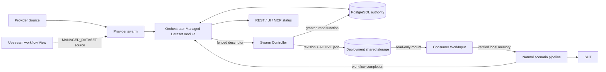

# Managed Test Data Release 1 Specification

Status: proposed Release 1; architecture, executable contracts, implementation and qualification pending
Scope: Scenario Manager, Orchestrator Managed Dataset module, Swarm Controller,
Worker SDK, UI and PocketHive Model Context Protocol (MCP)

## Decision required

Approve Managed Dataset as an additive PostgreSQL-backed option for durable,
reusable synthetic system-under-test (SUT) records. One provider run creates
one named Dataset per output binding. Each provider binding selects exactly one
`SCHEDULER`, `CSV`,
`REDIS` or derived `MANAGED_DATASET` source. Compatible consumer swarms select
one exact Dataset, Group and optional workflow View during Create Swarm.

Managed Dataset does not replace `REDIS_DATASET`, `CSV_DATASET` or direct
`SCHEDULER`. Existing adapters retain their current behaviour and configuration.
Every I/O binding names one adapter; PocketHive never migrates, substitutes or
falls back between them.

The Dataset option is additive at runtime. Activating its required Scenario
fields is a breaking Scenario Protocol migration with planned maintenance.

Use Record State and named Views for lifecycle outcomes. Create a downstream
Dataset only when successful processing produces records with independent
identity, schema, allocation, retention or lifecycle. This bounded Derivation is
the only cross-Dataset Release 1 transaction. Exact Dataset clone is separate and
deferred.

The main trade-off is more background publication and lease machinery, plus one
least-privilege Controller database reader, in exchange for durable sharing,
bounded mutable workflows and a measured request path with no PostgreSQL,
filesystem, Orchestrator or credential-provider call.

## Goal

Keep reusable test data available to continuous traffic within the admitted
storage horizon while preserving PocketHive's normal worker pipeline and
providing operational evidence that the selected Dataset reached the
consumer-input and SUT-attempt boundaries.

```text
provider source -> provider pipeline -> named Managed Dataset / Group
publication grant -> Controller database read -> active snapshot -> worker local memory -> SUT
```

## Hard rules

| Rule | Requirement |
|---|---|
| Additive option | Existing Dataset adapters remain unchanged. One binding never combines adapters or sources. |
| Explicit configuration | Every adapter, source, requirement, selection and setting is required by its tagged contract. Invalid or missing values fail before provisioning. |
| One creator | One provider run creates one Managed Dataset per Managed Dataset output binding. A worker restart keeps the run identity; a new provider run creates a new Dataset. |
| Named identity | Every Dataset freezes a human-readable `name` and opaque `datasetId`. Groups never replace either. |
| Frozen contract | Dataset name, SUT Environment, Dataset Space, Profile, schemas, Groups, Views, transitions, source and allocation never change for a runtime Dataset. |
| One schema | Every Dataset freezes one resolved Draft 2020-12 record schema. `WORKFLOW` also freezes one state schema. |
| State before extra Datasets | Success, retryable failure, terminal failure and unknown remain Record State and named Views in one `WORKFLOW` Dataset. |
| Explicit outcomes | A scenario-owned Outcome Normaliser emits one closed Outcome. A terminal Outcome Mapping handles all four classes, has no default and creates one complete next state. PocketHive never parses a SUT response to infer state. |
| Bounded derivation | `MANAGED_DATASET` consumes one exact upstream `WORKFLOW + EXCLUSIVE_LEASE` selection and writes to one downstream Dataset. Only `SUCCESS` creates bounded records. |
| Immutable payload | Record payload never changes and reaches workers only through a verified snapshot. Workflow claims return identity, state and lease data, never another payload copy. |
| Explicit allocation | `REPLAY` uses `SHARED` or `EXCLUSIVE_LEASE`; `WORKFLOW` requires `EXCLUSIVE_LEASE`. Modes never mix within one Dataset. |
| Explicit consumers | A Scenario Template that needs no Managed Dataset declares `managedDatasetRequirements: []`, and Create Swarm declares `datasetSelections: []`. Otherwise every requirement has one exact compatible selection. |
| Versioned activation | Making `managedDatasetRequirements` required is a breaking Scenario Contract change. M0 uses one Orchestrator-owned persisted Maintenance Epoch with a monotonic fencing token and closed phases while every bundle is inventoried, migrated and validated and the exact v2 swarm set is drained and recreated. Public lifecycle APIs remain fenced; only the exact epoch-bound upgrade operation may drain or restore captured swarms. v2 absence never implies an empty requirement. |
| Provider-only templates | Group templates use only the Provider Scenario Binding's allowlisted non-secret `vars` and `sut` values. Consumers use resolved ids. |
| One authoring validator | Scenario Manager alone validates Scenario, Dataset Definition and Schema Contract packages. UI, MCP, CLI, CI and agents delegate to it and preserve its version/digest evidence; none implements another validator. |
| PostgreSQL authority | For Managed Dataset only, PostgreSQL owns runtime records, revisions, state, materialised View membership, imports, grants, lineage, leases, idempotency and background-work fencing. Files and worker memory are derivative. |
| Local measured path | Replay selection, prefetched workflow dispatch, immutable-record lookup, Context validation and counters use verified local memory. Authority claims return mutable state and leases only; authority and publication work remains background/control-plane work. |
| Split publication boundary | Orchestrator validates and fences publication but never proxies snapshot bytes. Swarm Controller reads only the granted immutable revision through the explicit `DatasetSnapshotReader` PostgreSQL function adapter. Workers never access PostgreSQL. |
| Bounded publication grant | One expiring publication grant covers begin-publication response transit, the hard maximum snapshot export, completion operation, clock skew and explicit safety margin. Expiry preserves the old Active Reference and never activates partial output. |
| Explicit activation | One atomic Active Snapshot Reference selects the completed publication for a binding. Publication completion is not activation: the fenced Controller confirms activation with Orchestrator only after durable replacement. Orchestrator retains one latest checkpoint and exact predecessor evidence. Workers never infer activation by scanning directories or choosing a revision. |
| Terminal publication abandonment | Orchestrator releases a failed publication's pre-completion authority reservations only when one transaction makes the never-completed publication terminal and its fence unable to complete. Completed or activation-uncertain publications retain capacity and use recovery. Derivative staging remains protected until qualified cleanup. |
| Deterministic refresh | Orchestrator sends a revision hint, the Controller reconciles authoritative metadata, and workers poll the Active Reference on explicit background intervals. Hints mark a binding dirty; they do not bypass its publication window. No notification or filesystem watcher is the correctness path. |
| Bounded publication rate | Each dirty binding publishes only its latest observed revision. One required minimum interval bounds start-to-start rate; a long publication may still be followed immediately by the next, so admission covers both publications. |
| Least-privilege publication | The Controller writes only its swarm publication directory. Applicable consumer-input workers mount only their binding read-only. Other workers get no Dataset mount. |
| Safe snapshot cleanup | A qualified grace period covers storage visibility, the enforced worker-load maximum and clock skew. A deactivation marker remains outside its revision until safe deletion is acknowledged. Orchestrator retains the latest Activation Confirmation, every unacknowledged predecessor and each acknowledged confirmation for a full evidence period measured from acknowledgement. Recovery uses exact predecessor evidence; pressure never causes unsafe deletion or evidence pruning. |
| Bounded capacity | Deployment limits cover authoritative storage and Activation Confirmation evidence, including a binding-local pending Deletion Acknowledgement limit, mutation rates, snapshots, Controller publication and cleanup operations, complete restart fan-out, total worker memory and concurrency. Exhaustion rejects new work without eviction or fallback. |
| No inferred lifecycle | Managed Dataset never starts, replaces, fails over or reconciles provider swarms or SUT objects. |
| Bounded record lifecycle | Release 1 records are `NON_EXPIRING`. Replay can reuse them continuously; workflows that move records out of a ready View operate only within the admitted storage horizon. |
| No implicit deletion | Release 1 has no record retirement, reclamation or Dataset purge state machine. Direct PostgreSQL deletion is prohibited; a runbook and deployment limits bound retained data. |
| Continuity, not Controller HA | Release 1 has one active Controller per swarm. Fencing and deterministic restart recovery preserve publication safety; loaded workers may continue as defined, but multi-replica Controller election is not claimed. |
| Separated status planes | Group Availability reports authority health only. Publication Status is per admitted binding. Consumption Status reports worker loading, selection and SUT-attempt evidence. A Group needs no consumer to be `AVAILABLE`. |
| Small Controller deltas | Controller `status-full` may contain bounded reporter detail. Controller `status-delta` contains binding aggregates and digests only, never a reporter list. |
| One evidence model | Orchestrator alone derives consumption status. REST, UI and MCP project that read model unchanged. Missing or stale evidence yields `UNKNOWN`, never green. |

## Release 1 target

- Required Dataset name; `UNGROUPED` or bounded `GROUPED` mode.
- `REPLAY` immutable records with `SHARED` or `EXCLUSIVE_LEASE` allocation.
- `WORKFLOW` immutable records plus versioned Record State, materialised Views,
  declared transitions and `EXCLUSIVE_LEASE` allocation.
- Exact versioned record/state schema graphs composed from reusable Dataset
  Schema Contracts and local `$defs`.
- Provider sources: bounded fill-to-target `SCHEDULER`, finite `CSV`, finite
  immutable `REDIS` snapshot and bounded derived `MANAGED_DATASET`.
- Arbitrary schema-defined Group keys resolved before provider work.
- Non-expiring records, bounded Scheduler supply and durable idempotent
  grants/receipts.
- Explicit consumer requirements, compatibility listing and Create Swarm
  selection, including a swarm with no Managed Dataset.
- One bounded successful Derivation from an upstream workflow record to one
  downstream Dataset.
- Verified per-swarm snapshots, worker local memory and operational consumption
  status through REST, UI and PocketHive MCP.
- Deployment-wide storage protection, an operator retention runbook and
  replica-safe background work.

## Out of scope

- Queue/pop, bounded-use, one-use or use-count semantics; allocation overrides
  per record, Group or consumer; lease renewal, transfer or manual checkout.
- Free-form tags, arbitrary selectors or state patches, payload replacement,
  runtime-created Views/transitions and shared mutable snapshots.
- Outcome-selected destination Datasets, multi-destination fan-out or arbitrary
  cross-Dataset transactions.
- Exact Dataset clone, copy-on-write, aliases and in-place extension. A future
  Clone Dataset operation must pin one immutable source revision; transformation
  or enrichment uses Derivation.
- Multiple providers, transfer, automatic provider start/failover, source
  switching, rotating finite imports or destructive Redis pop.
- Sensitive records or credentials in records/state.
- Expiring records, record retirement/reclamation, Dataset purge and unbounded
  continuous workflow supply.
- Active-active multi-region, application-owned PostgreSQL high availability,
  multi-replica Controller election, cross-swarm snapshot caches, object storage,
  direct worker PostgreSQL access or direct Controller table access. Controller
  snapshot access is limited to the canonical read function.
- Per-worker snapshot pin/ack cleanup. Release 1 uses an enforced load maximum,
  durable deactivation evidence and a qualified retention grace.
- Concurrent Scenario Protocol v2/new-major operation or implicit v2 migration.
  Release 1 uses one explicit inventory, migration and activation gate.
- SUT reconciliation, automatic revalidation/deprovisioning, audit proof,
  exactly-once claims, malicious-worker resistance and arbitrary-window delivery
  evidence.

## Canonical terms

All terms in this table are `PROPOSED` unless marked `EXISTING`.

| Term | Meaning | Not the same as | Shorthand |
|---|---|---|---|
| SUT Environment (`EXISTING`) | Versioned environment and connection context used by a Scenario Binding | Dataset or provider | None |
| Dataset Space | Scenario Manager registry of Dataset Definitions and Schema Contracts for one binding context | Runtime Dataset | None |
| Scenario Binding | Frozen validated link between Scenario Template, SUT Environment, Dataset Space and variable profile | Provider dependency | None |
| Scenario Protocol Maintenance Epoch | Orchestrator-owned persisted deployment-wide upgrade state with one monotonic fencing token, frozen plan digest and closed durable phase; it blocks public Scenario mutation and swarm activation while one captured inventory is drained, cut over and restored | Normal editing, a general lifecycle bypass or dual-major runtime | Maintenance Epoch |
| Dataset Definition Bundle | Mounted package containing `dataset.yaml`, `record.schema.yaml` and optional `state.schema.yaml` | Scenario Bundle | Dataset Definition |
| Dataset Schema Contract | Reusable immutable schema at one exact version | Runtime record or local `$defs` | Schema Contract |
| Managed Dataset Provider Source | Required tagged provider-work source: `SCHEDULER`, `CSV`, `REDIS` or `MANAGED_DATASET` | Consumer input or fallback chain | Provider Source |
| Managed Dataset | Named Orchestrator-owned runtime parent created by one provider run and usable by compatible consumers | Redis list, queue or Group | Dataset |
| Dataset Group | Frozen typed partition under one Dataset, identified by `groupId` and `groupKey` | Dataset name or query | Group |
| Managed Dataset Profile | Frozen `REPLAY` or `WORKFLOW` behaviour | Per-consumer mode | Profile |
| Record State | Versioned `WORKFLOW` JSON stored separately from immutable record payload | Tag bag or SUT truth | None |
| Dataset View | Named materialised membership from fixed equality clauses over Record State | Runtime selector or copied Dataset | View |
| State Transition | Declared change from one View to another through bounded mutable paths | SUT inference or arbitrary patch | Transition |
| Record Lease | Authority-owned temporary exclusive allocation | Business state or broker acknowledgement | Lease |
| Managed Dataset Outcome | Closed `{class, code}` result: `SUCCESS`, `RETRYABLE_FAILURE`, `TERMINAL_FAILURE` or `UNKNOWN` | SUT truth, state or transport header | Outcome |
| Outcome Mapping | Terminal configuration mapping every Outcome class to one complete next state | Regex extraction or default route | None |
| Managed Dataset Derivation | Atomic bounded creation of independent downstream records plus upstream state transition and lease release | Outcome routing or clone | Derivation |
| Dataset Snapshot Reader | Swarm Controller port that streams one granted immutable revision through the deployment's explicit PostgreSQL function adapter | Orchestrator REST export or worker database access | Snapshot Reader |
| Active Snapshot Reference | Atomic binding-level file selecting one completed publication and monotonic activation generation | PostgreSQL authority or a directory scan | Active Reference |
| Snapshot Activation Confirmation | Orchestrator record of one fenced Controller's durable Active Reference replacement, its predecessor and generation | Publication completion or the Active Reference file | Activation Confirmation |
| Snapshot Deletion Acknowledgement | Idempotent state on one Activation Confirmation recording that the current fenced Controller safely removed its predecessor revision, with authority-set `predecessorDeletionAcknowledgedAt` | Deactivation marker or delete request | Deletion Acknowledgement |
| Dataset Context | SDK-owned WorkItem identity and safety data | Observability or broker header | None |
| Group Availability | Orchestrator authority read model for Group source, schema, integrity, supply and authority-storage health | Publication or consumer health | Availability |
| Publication Status | Per-binding read model for Controller publication and Active Reference health against the authority revision | Worker loading or consumption proof | None |
| Consumption Status | Orchestrator read model proving matching operational evidence at declared boundaries | Audit or SUT-acceptance proof | None |

## Ownership

| Concern | Owner | Must not own |
|---|---|---|
| Dataset/contract packages, restricted schema compilation and digests | Scenario Manager | Runtime records, leases or source choice |
| Dataset Definition, Profile, schemas, grouping, Views and transitions | Dataset Definition Bundle | Scenario templates or runtime ids |
| Source, Groups, mappings, allocation, lifecycle, supply and capacity | Provider Scenario Binding | Consumer selection or provider automation |
| Required access/Profile/allocation and workflow View/transition | Consumer Scenario Template | Concrete Dataset ids or provider templates |
| Frozen SUT/Dataset compatibility | Consumer Scenario Binding | Live rebinding |
| Exact Dataset/Group/View choice or explicit empty choice | Create Swarm | Fallback or alias following |
| Runtime records, state, memberships, imports, grants, lineage, leases and idempotency | Orchestrator Managed Dataset module | SUT calls, source parsing or filesystem publication |
| Source parsing and scenario result normalisation | Scenario-owned worker pipeline | Authority mutation |
| Publication grant, abandonment, completion, activation generation, Activation Confirmation and Deletion Acknowledgement | Orchestrator Managed Dataset module | Snapshot byte proxying or filesystem writes |
| Granted snapshot read, filesystem publication and retention cleanup | Swarm Controller through `DatasetSnapshotReader` and the qualified storage adapter | Schema discovery, authority mutation or direct table access |
| Context construction/preservation/guard and local selection | Worker SDK adapters | Business outcome classification |
| Storage, limits, clock health and connection references | Deployment capability profile | Scenario-selected infrastructure |
| Retention horizon, alerts, response and backup/restore | Operator runbook | Direct row deletion or implicit purge |
| Maintenance Epoch record, fencing token, phase transitions and epoch-bound swarm commands | Orchestrator | Bundle validation, root mutation or a general lifecycle bypass |
| Final inventory, frozen plan digest, staged roots and protocol cutover coordination | Deployment upgrade workflow | Independent maintenance state or unfenced swarm lifecycle |
| Bundle mutation fence and final package validation | Scenario Manager | Swarm lifecycle or upgrade coordination |
| Public swarm create/start/recreate fence and bounded drain/restoration execution | Orchestrator | Bundle validation or root switching |

## Architecture


```mermaid
flowchart LR
  PS[Provider Source] --> P[Provider swarm]
  U[Upstream workflow View] -. MANAGED_DATASET source .-> P
  P --> O[Orchestrator Managed Dataset module]
  O <--> PG[(PostgreSQL authority)]
  O -->|fenced descriptor| SC[Swarm Controller]
  SC -->|granted read function| PG
  SC -->|revision + ACTIVE.json| FS[(Deployment shared storage)]
  FS -->|read-only mount| WI[Consumer WorkInput]
  WI -->|verified local memory| S[Normal scenario pipeline]
  S --> SUT[SUT]
  S -->|workflow completion| O
  O --> E[REST / UI / MCP status]
```

No Dataset-specific RabbitMQ lane is added. Managed Dataset adapters implement
the existing `WorkInput` and `WorkOutput` ports.

## Authoring and selection contracts

### Dataset Definition and schemas

Scenario Manager reads these fixed registry paths:

```text
scenarios/bundles/<scenario-name>/scenario.yaml
scenarios/managed-dataset/<dataset-name>/dataset.yaml
scenarios/managed-dataset/<dataset-name>/record.schema.yaml
scenarios/managed-dataset/<dataset-name>/state.schema.yaml  # WORKFLOW only
scenarios/dataset-contracts/<name>/<version>/schema.yaml
```

Scenario descriptors continue to follow the canonical Scenario Contract and
declare an explicit `protocolVersion`. Because contract activation makes
`managedDatasetRequirements` mandatory, M0 assigns it to one new Scenario
Protocol major and updates the supported version, DTO/validator and documentation.

Preflight may prepare staged copies, but the authoritative migration starts only
after the deployment upgrade workflow asks Orchestrator to open one persisted,
deployment-wide Scenario Protocol Maintenance Epoch. Orchestrator owns the
single epoch record, `epochId`, monotonic `epochFencingToken`, frozen inventory
and plan digests, current phase and phase failure. The token advances on phase
change or coordinator takeover. Scenario Manager and the deployment workflow
consume this authority; services never use independent maintenance flags. An
unavailable or unverifiable epoch state keeps their gates closed.

The closed durable phases are `PREPARING`, `DRAINING_V2`, `CUTOVER_READY`,
`RESTORING_NEW_MAJOR`, `ROLLING_BACK`, `RESTORING_V2`, `COMPLETED` and
`ROLLED_BACK`. The forward path ends
`RESTORING_NEW_MAJOR -> COMPLETED`. Pre-switch recovery ends
`RESTORING_V2 -> ROLLED_BACK`; explicit post-switch rollback passes through
`ROLLING_BACK` before the same restoration path. Restart resumes the recorded
phase. Failure is recorded against that phase and permits only its declared
resume or rollback transition. Only the two terminal phases reopen the gates.
`maximumScenarioProtocolMaintenanceDuration` bounds the attempt. Expiry records
failure and keeps every gate closed; it never triggers an automatic cutover,
rollback or protocol fallback.

While the epoch is active, Scenario Manager rejects bundle file writes, creates,
imports, replacements, renames, moves, deletes and registry-changing reloads.
Orchestrator rejects public swarm create, start and recreate. The authenticated
deployment upgrade workflow is the only caller of a dedicated epoch-bound
drain/restore command. Each request carries `epochId`, the current
`epochFencingToken`, `expectedPhase`, one exact `capturedSwarmId`, the frozen
plan digest and an idempotency key. The swarm must belong to the captured
inventory. Exact replay returns its stable result even after a phase/token
advance; a changed replay, stale or foreign token, wrong phase, unknown swarm or
changed plan digest conflicts. This command is not accepted through the normal
lifecycle API and grants no general bypass. UI, MCP, CLI and agents cannot evade
these server-side gates. Operator-mounted source roots are read-only or frozen
by the deployment adapter for the epoch; inability to fence a root fails
preflight.

Inside the epoch, the workflow inventories every repository-shipped,
operator-mounted and uploaded/persisted bundle visible from the configured
Scenario roots. Each staged bundle explicitly declares complete requirements or
`managedDatasetRequirements: []` and passes the Scenario Manager validator. The
closed inventory records source/root, bundle key, original protocol, staged
artifact digest and validation evidence. It also captures the exact v2 swarm set
and immutable pre-drain recreation plans. Unreadable roots, duplicates,
unaccounted bundles or mutable roots fail it.

After draining that exact swarm set, the workflow re-reads every source-root,
inventory and staged-artifact digest. Only an exact match permits one atomic
switch of the new validator and all staged roots. Failure before that switch
publishes no partial registry and keeps the prior validator and original roots
selected; it does not claim the drained swarms were unchanged. Orchestrator must
recreate the exact captured set from its frozen v2 plans within
`maximumScenarioProtocolRecoveryDuration`.

After the switch, the epoch remains active until Orchestrator recreates and
verifies the captured swarms from validated new-major bundles. Failure never
switches back implicitly: the operator explicitly resumes new-major recreation
or requests rollback. Rollback drains any new-major recreation, atomically
reselects the prior validator/roots and restores the captured v2 set within the
same recovery bound. Until recreation or rollback completes, every epoch gate
remains fail-closed and reports the incomplete operation.

Original and staged roots remain immutable until cutover acceptance or rollback
completion. The migration is planned downtime. The deployment never runs both
majors concurrently, and older majors never gain Managed Dataset meaning from
an absent or ignored field; no compatibility shim or default is permitted.

`dataset.yaml` is the only Dataset Definition entry point. Directory name must
equal `id`; `version` is SemVer. Record and state roots use exact paths shown
above. Scenario Manager rejects duplicates, case collisions, traversal,
symlink escape, missing/unexpected entry points and changed content under a
published `id + version`. A failed reload publishes no partial registry revision
and leaves the last valid revision active; this is transaction safety, not
version fallback.

Each root is JSON Schema Draft 2020-12. It may reference exact immutable
`pockethive://dataset-contracts/<name>/<version>` contracts and local `$defs`.
Ranges, `latest`, HTTP(S), unresolved references, cycles and unsupported dialects
fail. A restricted versioned meta-schema forbids unknown keywords and bounds
file/compiled bytes, references, depth, Views, clauses, transitions, mutable
paths and validation errors. Scenario Manager stores one compiled artifact and
opaque `sha256:` digest; other components compare the digest and never recompile.

Scenario Manager is the only public authoring validator. Scenario, Dataset
Definition and Schema Contract validation use its application services and
canonical compiler; UI, PocketHive MCP, CLI, CI and agent workflows call those
services through product APIs. They must not copy schemas or implement local
validation logic. Successful Dataset package validation returns the existing
validation-evidence pattern with declared and supported authoring-contract
versions, `scenarioManagerVersion`, deterministic `artifactDigest` over sorted
normalised paths plus file bytes, and the compiled schema digests. M0 fixes the
exact Dataset evidence DTO and dry-run/published-package routes in one schema.
Missing evidence, a digest mismatch or an unsupported version fails closed.

The deployment supplies positive `maximumDatasetDefinitionBundles`,
`maximumDatasetContractVersions`, `maximumSchemaBytesPerFile`,
`maximumCompiledSchemaBytes`, `maximumSchemaReferences`,
`maximumSchemaReferenceDepth`, `maximumRecordValidationErrors`,
`maximumStateValidationErrors`, `maximumDatasetViews`,
`maximumDatasetViewClauses`, `maximumDatasetTransitions` and
`maximumMutableStatePaths`. Exceeding any bound fails publication. Record roots
use `$id: pockethive://managed-dataset/<id>/<version>/record`; workflow state
roots use the corresponding `/state` id.

Illustrative Dataset Definition:

```yaml
id: shared-records
version: 1.0.0
name: Shared Records
profile: WORKFLOW
recordSchemaRef: {path: record.schema.yaml}
workflow:
  stateSchemaRef: {path: state.schema.yaml}
  views:
    - id: ready
      match: {all: [{path: /phase, equals: READY}]}
    - id: attempted
      match: {all: [{path: /phase, equals: ATTEMPTED}]}
    - id: successful
      match: {all: [{path: /outcome, equals: SUCCESS}]}
    - id: retryable
      match: {all: [{path: /outcome, equals: RETRYABLE_FAILURE}]}
    - id: failed
      match: {all: [{path: /outcome, equals: TERMINAL_FAILURE}]}
    - id: unknown
      match: {all: [{path: /outcome, equals: UNKNOWN}]}
  transitions:
    - id: attempt-complete
      fromViewId: ready
      toViewId: attempted
      mutableStatePaths: [/phase, /outcome, /attemptCount, /lastResultCode]
    - id: retry-complete
      fromViewId: retryable
      toViewId: attempted
      mutableStatePaths: [/outcome, /attemptCount, /lastResultCode]
grouping:
  type: GROUPED
  fields:
    - {name: category, type: STRING, maximumLength: 40}
    - {name: variant, type: STRING, maximumLength: 40}
  maximumGroups: 8
```

`UNGROUPED` forbids fields and creates one internal Group. `GROUPED` requires
1..8 ordered fields, `maximumGroups` 1..64 and unique names matching
`[A-Za-z][A-Za-z0-9_]{0,63}`. Types are `STRING`, signed 64-bit `INTEGER` and
`BOOLEAN`. Strings require `maximumLength` 1..256 and forbid empty, control,
leading-space and trailing-space values. Every Group key contains every field
and no other field; null, nesting and coercion fail. Values compare by exact
type and, for strings, exact case-sensitive content.

`REPLAY` forbids workflow configuration. `WORKFLOW` requires a closed object
state schema, fixed Views and transitions. View clauses are bounded equality
tests on primitive leaves. OR, ranges, negation, expressions and author SQL are
forbidden. Mutable paths are non-root, unique and prefix-disjoint. Orchestrator
materialises memberships on every state commit; consumers never evaluate View
predicates. A transition validates `fromViewId`, permitted changed paths,
complete next-state schema and `toViewId`. State may match other overlapping
Views, so the example's outcome Views do not copy records.

### Provider binding and sources

The Provider Scenario Binding owns one source and resolves the complete Group
set before provider work:

```yaml
providerDataset:
  datasetDefinitionId: shared-records
  source: {type: SCHEDULER}
  allocation:
    type: EXCLUSIVE_LEASE
    recordLeaseDuration: PT2M
    maximumActiveRecordLeases: 100
  groups:
    - groupKey:
        category: "{{ vars.recordCategory }}"
        variant: "{{ sut.type }}"
```

Provider admission creates the Dataset idempotently on
`providerSwarmId + providerRunId + providerBindingRef`. Exact replay returns the
same `datasetId`; changed content fails. The Dataset stores immutable provider,
run, binding/version, SUT Environment, Definition, schema digests, source and
policy provenance. `name` is required, non-unique, at most 120 Unicode code
points, has no control characters or surrounding whitespace and is never an
identity or secret.

`groups` is non-empty for `GROUPED` and forbidden for `UNGROUPED`. Templates use
only allowlisted, non-secret provider `vars` and `sut` metadata. Orchestrator
renders once, validates exact fields/types/counts, rejects unresolved or duplicate
keys and assigns opaque `groupId`s. Provider results and consumers cannot create
or change Groups.

| `source.type` | Required settings | Behaviour |
|---|---|---|
| `SCHEDULER` | No source block | Authority-granted bounded fill-to-target work |
| `CSV` | `artifactRef`, one valid ASCII `delimiter`, `charset: UTF-8`, `header: true` | One finite stable-row-order import from the provider bundle |
| `REDIS` | `connectionRef`, literal `listName`, `itemFormat: JSON`, `snapshotMode: COPY`, positive `snapshotTtl` | One finite stable-index import from an immutable staging copy |
| `MANAGED_DATASET` | `sourceBindingRef`, positive `minimumDerivedRecordsOnSuccess`, `maximumDerivedRecordsPerSource` | Bounded leased derivation from one exact upstream workflow requirement |

Exactly the matching block is present. Every Release 1 source requires
`lifecycle.type: NON_EXPIRING`; expiring-lifecycle fields are forbidden.

CSV creates one object from unique non-empty headers. It accepts UTF-8,
quoted/doubled-quote fields and LF/CRLF; malformed encoding, quoting, headers or
row width fails the whole import. Each Redis element is one UTF-8 JSON object.
Before import, the adapter validates all items, bytes, Group mappings and
schemas. `source.groupMapping` is required for grouped CSV/Redis/Managed Dataset,
forbidden for Scheduler/ungrouped, and maps every grouping field to one source
JSON Pointer. Managed Dataset pointers read immutable upstream `record` only;
state and provider output are forbidden. CSV can map only strings; no source
coercion exists.

Redis `connectionRef` resolves one deployment registry entry containing
endpoint, TLS, topology and credential reference. The adapter uses a deterministic
provider-run staging key, `COPY` without replacement and expiry in one
`MULTI/EXEC`; it validates every command result because Redis transactions do not
roll back command failures. Copy, expiry, collision, fingerprint or owned-key
cleanup failure blocks the run and never reads, pops or changes the live list.
Cluster mode requires a non-empty hash tag shared by live and staging keys.

Finite sources bind one immutable `sha256:` fingerprint: exact CSV bytes, or
Redis raw items in stable index order with length framing. Exact restart resumes;
another fingerprint fails. Paths, keys, credentials and source values are not
exposed to consumers, status, metrics or normal logs.

Source state is closed. Scheduler and Managed Dataset are `ACTIVE` and have no
fingerprint. CSV/Redis move `PENDING_IMPORT -> IMPORTING -> COMPLETE|FAILED`;
the first valid import binds the previously null fingerprint, which can never be
cleared or changed. Finite item identity uses one-based logical CSV row or Redis
list index:

```text
sourceItemKey = sha256(sourceType + "\n" + sourceFingerprint + "\n" + decimalPosition)
```

For `MANAGED_DATASET`, `sourceBindingRef` names one requirement in the same
Provider Scenario Template. It must be `WORKFLOW`, `READ_STATE_TRANSITION`,
`EXCLUSIVE_LEASE`, one exact View and transition. Create Swarm freezes its
upstream Dataset/Group/View. The provider has one downstream Managed Dataset
output. `1 <= minimumDerivedRecordsOnSuccess <= maximumDerivedRecordsPerSource`
and both obey deployment limits.

### Lifecycle and supply

| Field | Rule |
|---|---|
| `allocation` | `REPLAY`: `SHARED` or `EXCLUSIVE_LEASE`; `WORKFLOW`: `EXCLUSIVE_LEASE` only |
| `lifecycle.type` | Required literal `NON_EXPIRING` |
| `usableFor`, `renewalLeadTime`, `maximumExpiryCohort`, `replacementHeadroom` | Forbidden |
| `minimumReady`, `targetReady`, `maximumReady` | `0 <= minimumReady <= targetReady <= maximumReady` |
| `refillCycleInterval`, `maximumProviderCompletionTime`, `providerCapacityRecordsPerSecond` | Required positive Scheduler bounds |

`maximumStored = maximumReady`. Records remain stored and count toward every
deployment limit. Finite imports require each Group count within
`targetReady..maximumReady` and publish all Groups only after full validation.
Scheduler refill grants reserve capacity and stage receipts; one grant
completion atomically commits the complete cohort and advances at most one
snapshot revision per affected Group. Stale work publishes nothing.

Scheduler grant size is the minimum of requested batch, target deficit,
`maximumReady` deficit, `maximumStored` deficit and every deployment reservation
limit. A non-positive result creates no work. Refill counts include active grants
so concurrent replicas cannot over-reserve.

`REPLAY + SHARED` may reuse stored records indefinitely. A workflow transition
can move records out of its source View but never deletes them. Scheduler and
Managed Dataset supply therefore stop at `maximumStored`; such workflows are
horizon-bounded until a separately approved reclamation contract exists.

### Consumer requirements and Create Swarm

```yaml
managedDatasetRequirements:
  - bindingRef: inputRecords
    datasetDefinitionId: shared-records
    profile: WORKFLOW
    access: READ_STATE_TRANSITION
    allocation:
      type: EXCLUSIVE_LEASE
      acquireBatchSize: 10
      maximumHeldRecordLeases: 20
      acquireInterval: PT1S
    workflow:
      viewId: ready
      transitionId: attempt-complete
      allowReleaseUnchanged: false
      completionRole: dataset-completion
      completionLagTolerance: PT30S
```

Requirement omission is invalid under the activated Scenario Protocol major;
no Dataset requires an explicit empty array. `bindingRef` is unique.
Compatibility requires the same SUT Environment, Dataset Space,
Definition/version, Profile, access, allocation, schema digests and, for
workflow, View/transition. A provider using `MANAGED_DATASET` references its
upstream requirement; it is not both a normal consumer input and provider source
for the same binding.

Create Swarm lists only compatible named Dataset/Group/View choices. The request
contains one selection per requirement or exactly `datasetSelections: []`. A
selection freezes `datasetId`, `groupId`, optional `viewId`, Profile, allocation,
schema digests and its admitted `revision` as the initial snapshot revision.
Completed activation generations may advance that revision within the same
frozen selection; no identity, schema, Group, View, Profile or allocation may
change. Empty or failed discovery never substitutes another choice. The Create
Swarm model may list compatible shared Datasets already bound to the same SUT
Environment and Dataset Space.

## Worker I/O contract

Provider and consumer adapters are explicit:

```yaml
# first provider bee
inputs:
  type: MANAGED_DATASET_PROVIDER
  managedDatasetProvider: {bindingRef: supplyRecords, batchSize: 100}

# terminal provider bee for Scheduler/CSV/Redis
outputs:
  type: MANAGED_DATASET
  managedDataset: {bindingRef: supplyRecords, operation: CREATE_RECORD}

# consumer input
inputs:
  type: MANAGED_DATASET
  managedDataset:
    bindingRef: inputRecords
    ratePerSec: 500
    sutAttemptRole: sut-client
    sutAttemptGuard:
      maximumInvocationDuration: PT5S
      maximumClockSkew: PT1S
    consumptionObservation:
      reportInterval: PT5S
      staleAfter: PT20S
      observationWindow: PT15S
      pipelineLagTolerance: PT30S
```

`batchSize` is a bounded fetch maximum, not source selection. Provider source
capabilities use one required closed `managedDatasetProviderSources` array.
Missing capability fails before provisioning. `CREATE_RECORD` is valid for
Scheduler/CSV/Redis. A Managed Dataset source uses `COMPLETE_DERIVATION`.

The declared `sutAttemptRole` image must advertise
`managedDatasetSutAttemptGuard: SUPPORTED`; missing, `UNSUPPORTED`, unknown or
multiple attempt roles fail admission. Scenario Manager validates provider and
consumer adapter capabilities before Orchestrator creates a run.

Every provider item carries SDK-owned `MANAGED_DATASET_PROVIDER_CONTEXT` at
`WorkItem.headers[ph.dataset.provider.context]` inside the normal JSON WorkItem
body. Every Context contains `schemaVersion`, `datasetId`, `groupId`,
`bindingRef`, `sourceType` and `workType`. `REFILL` adds `grantId`,
`grantItemId`, `providerOperationKey`, `grantExpiresAt`; `IMPORT` adds
`importId`, `sourceItemKey`, `sourceFingerprint`, `sourcePosition`; `DERIVATION`
adds `derivationGrantId`, `derivationItemId`, `providerOperationKey`,
`grantExpiresAt`, `sourceBindingRef`, source Dataset/Group/record/View/lease,
payload/state revisions and preassigned destination `groupId`. Fields from
another work type are forbidden. Derivation also carries one normal Dataset
Context for the upstream record. Authors and intermediate workers cannot create
or change either Context.

`REPLAY` consumer payload is the record. `WORKFLOW` payload is
`{"record":...,"recordState":...}`. State remains normal scenario data, not
observability context. Every worker preserves Dataset Context.

The terminal workflow adapter is explicit:

```yaml
outputs:
  type: MANAGED_DATASET
  managedDataset:
    bindingRef: inputRecords
    operation: COMPLETE_STATE_TRANSITION
    outcomeMapping:
      sourcePath: /outcome
      cases:
        SUCCESS:
          nextStateMapping:
            phase: ATTEMPTED
            outcome: SUCCESS
            attemptCount: "{{ payload.attemptCount }}"
            lastResultCode: "{{ payload.outcome.code }}"
        RETRYABLE_FAILURE:
          nextStateMapping:
            phase: ATTEMPTED
            outcome: RETRYABLE_FAILURE
            attemptCount: "{{ payload.attemptCount }}"
            lastResultCode: "{{ payload.outcome.code }}"
        TERMINAL_FAILURE:
          nextStateMapping:
            phase: ATTEMPTED
            outcome: TERMINAL_FAILURE
            attemptCount: "{{ payload.attemptCount }}"
            lastResultCode: "{{ payload.outcome.code }}"
        UNKNOWN:
          nextStateMapping:
            phase: ATTEMPTED
            outcome: UNKNOWN
            attemptCount: "{{ payload.attemptCount }}"
            lastResultCode: "{{ payload.outcome.code }}"
```

The normal pipeline emits
`{"outcome":{"class":<closed-class>,"code":<bounded-string-or-null>}}`.
`resultRules` may extract a business code for the Outcome Normaliser, but no
regex or step header changes Dataset state. `sourcePath` points to the complete
Outcome; all four cases are required exactly once and default is forbidden.
Each mapping creates one complete state that satisfies the declared target View.
`RETRYABLE_FAILURE` labels state for a separate retry workflow; it does not
authorise automatic retry. `UNKNOWN` represents an observed ambiguous terminal
result and cannot create derived records. Missing terminal output changes no
state and leaves the lease active until valid completion or expiry.

`RELEASE_RECORD_LEASE` is the only workflow alternative and is valid only when
`allowReleaseUnchanged: true`; it forbids Outcome and state fields.

For `COMPLETE_DERIVATION`, output also supplies one bounded ordered array from
`derivedRecordsMapping.sourcePath`. Each element is
`{"record":...,"initialState":...}`; `initialState` is complete for a
`WORKFLOW` destination and null for `REPLAY`. Destination identity comes only
from Provider Context. `SUCCESS` requires the configured count; other classes
require an empty array.

## Authority API and failure contract

M0 adds one canonical DTO schema and these authenticated background operations.
Workers never connect to PostgreSQL. Controller snapshot access uses only the
explicit Snapshot Reader contract below; it has no table privileges or REST
snapshot-byte fallback.

| Operation | Product API | Essential rule |
|---|---|---|
| Refill grant | `POST /api/managed-datasets/{datasetId}/groups/{groupId}/refill-grants` | Scheduler only; `bindingRef`, `batchSize`, idempotency key; reserves bounded items/capacity |
| Refill receipt | `PUT /api/managed-datasets/{datasetId}/groups/{groupId}/refill-grants/{grantId}/items/{grantItemId}/receipt` | Provider key, record and optional required workflow initial state; stages but does not publish |
| Refill completion | `PUT /api/managed-datasets/{datasetId}/groups/{groupId}/refill-grants/{grantId}/complete` | Expected count; commits the complete cohort atomically |
| Begin finite import | `POST /api/managed-datasets/{datasetId}/source-imports` | CSV/Redis only; source type/fingerprint, total item/byte and exact per-Group counts |
| Import receipt | `PUT /api/managed-datasets/{datasetId}/source-imports/{importId}/items/{sourceItemKey}/receipt` | Exact Group, record and optional required workflow initial state; stable source-position identity |
| Import completion | `PUT /api/managed-datasets/{datasetId}/source-imports/{importId}/complete` | Repeats fingerprint/counts; publishes all Groups atomically or none |
| Derivation grant | `POST /api/managed-datasets/{destinationDatasetId}/derivation-grants` | Destination/source binding refs, completed source snapshot revision, activation generation and batch; claims exact upstream View members, reserves maximum destination capacity and returns source identity/state/lease without payload |
| Derivation completion | `PUT /api/managed-datasets/{destinationDatasetId}/derivation-grants/{derivationGrantId}/items/{derivationItemId}/completion` | Both bindings, provider key, source lease/View/revision, Outcome, mapping digest, next state and ordered records; changes both Datasets atomically |
| Begin publication | `POST /api/managed-datasets/{datasetId}/groups/{groupId}/snapshot-publications` | Controller swarm/run/binding only; reserves one bounded Activation Confirmation record and, when a current activation can become its predecessor, one binding-local pending Deletion Acknowledgement slot; returns a fenced, expiring descriptor pinned to one revision/digest and one opaque Snapshot Reader grant |
| Abandon publication | `PUT /api/managed-datasets/{datasetId}/groups/{groupId}/snapshot-publications/{publicationId}/abandonment` | Active fenced Controller only; transition is permitted only from `OPEN` and repeats binding, publication, fence and a closed failure reason; atomically makes completion impossible and releases pre-completion authority reservations; exact replay is stable, changed replay or `COMPLETED` conflicts |
| Complete publication | `PUT /api/managed-datasets/{datasetId}/groups/{groupId}/snapshot-publications/{publicationId}/complete` | Exact manifest/chunk/whole digests and fencing token; atomically completes the publication and returns the next binding-scoped `activationGeneration` |
| Confirm activation | `PUT /api/managed-datasets/{datasetId}/groups/{groupId}/snapshot-publications/{publicationId}/activation-confirmation` | Active fenced Controller only, after durable Active Reference replacement; repeats the explicit nullable predecessor tuple, new publication/revision, generation and Active Reference digest; exact replay returns one stable `activationConfirmationId`, changed replay conflicts |
| Acknowledge predecessor deletion | `PUT /api/managed-datasets/{datasetId}/groups/{groupId}/snapshot-activation-confirmations/{activationConfirmationId}/predecessor-deletion-acknowledgement` | Active fenced Controller only, after qualified deletion and durable absence verification; repeats predecessor publication/revision, generation and marker digest; exact replay returns the stable Deletion Acknowledgement with authority-set `predecessorDeletionAcknowledgedAt` and `confirmationPruneAfter`, changed replay conflicts |
| Lookup predecessor activation | `GET /api/managed-datasets/{datasetId}/groups/{groupId}/snapshot-activation-confirmations/by-predecessor/{predecessorPublicationId}?swarmId={swarmId}&runId={runId}&bindingRef={bindingRef}` | Active Controller only; returns the one retained authoritative confirmation and acknowledgement state until `confirmationPruneAfter`, or explicit `404`; no truncation or inferred chain |
| Reconcile publication | `GET /api/managed-datasets/{datasetId}/groups/{groupId}/snapshot-activation?swarmId={swarmId}&runId={runId}&bindingRef={bindingRef}` | Active Controller only; returns the frozen selection, current authority revision, current publication and closed state, latest completed publication/generation and latest retained Activation Confirmation checkpoint for refresh and recovery, never record bytes |
| Replay leases | `POST /api/managed-datasets/{datasetId}/groups/{groupId}/record-leases` | `REPLAY + EXCLUSIVE_LEASE`; binding, completed snapshot revision, activation generation and requested count; returns record identity and lease only |
| Workflow claims | `POST /api/managed-datasets/{datasetId}/groups/{groupId}/views/{viewId}/record-leases` | Binding, completed snapshot revision, activation generation and requested count; returns `recordId`, complete state, state revision, lease, snapshot revision, activation generation and record-schema digest, never record payload |
| State transition | `PUT /api/managed-datasets/{datasetId}/groups/{groupId}/record-leases/{recordLeaseId}/state-transition` | Binding, claimed View/revision, transition, Outcome, mapping digest and complete next state; one transaction |
| Unchanged release | `PUT /api/managed-datasets/{datasetId}/groups/{groupId}/record-leases/{recordLeaseId}/release` | Replay exclusive, or explicitly allowed workflow release with claimed View/revision only |

Every mutating request contains `bindingRef`, scoped `idempotencyKey` and the
operation's expected identities/revisions. Responses repeat enough identity for
the caller to reject mismatches. Schema errors return bounded keyword/JSON
Pointer locations without values or unrestricted validator messages.

Replay lease, workflow claim and Derivation-grant selection intersect the live
eligible records with the requested completed snapshot revision. A record
introduced after that revision is not eligible. The worker resolves each
returned `recordId` only from the matching verified local snapshot and combines
it with the returned workflow state when applicable. Missing identity, revision,
activation generation or schema digest fails closed before dispatch; there is no
authority-payload, REST or database fallback.

The deployment injects one required `managedDatasetClient` with `baseUrl`,
`serviceAuthRef`, `requestTimeout`, `operationTimeout`, `maximumAttempts` and
`retryBackoff`. Production requires HTTPS. Values are positive and
`operationTimeout >= requestTimeout`.

Begin publication returns one descriptor and Snapshot Reader grant with the same
expiry. `maximumSnapshotExportDuration` is an enforced Controller deadline from
the first page attempt until the immutable revision is ready for the completion
call. It includes page retries, chunk writes, digest checks, syncs and the atomic
revision move.
The deployment also requires positive `snapshotPublicationGrantDuration` and
`snapshotReaderGrantSafetyMargin`:

```text
snapshotPublicationSlo <=
  maximumSnapshotExportDuration + managedDatasetClient.operationTimeout

snapshotPublicationGrantDuration >=
  managedDatasetClient.requestTimeout
  + maximumSnapshotExportDuration
  + managedDatasetClient.operationTimeout
  + maximumClockSkew
  + snapshotReaderGrantSafetyMargin

remainingGrantDurationAfterBeginResponse >=
  maximumSnapshotExportDuration
  + managedDatasetClient.operationTimeout
  + maximumClockSkew
  + snapshotReaderGrantSafetyMargin
```

The grant issuer validates the full duration, including the bounded begin-response
transit. After receipt, the Controller excludes `requestTimeout` and does not
start export unless the remaining grant covers the post-receipt work bound. It
does not start or retry a page unless the remaining time still reserves the
reader timeout, completion operation, clock skew and safety margin. Grant expiry
before the final page or publication completion fails that attempt. Staging may
remain for safe cleanup, but the Controller never completes it or changes
`ACTIVE.json`.

For a terminal pre-completion failure, the Controller submits idempotent
abandonment with `READER_TERMINAL`, `EXPORT_TERMINAL`, `GRANT_EXPIRED` or
`CONTROLLER_SHUTDOWN`. If it cannot, Orchestrator reconciles after both the
descriptor and publication work lease expire. Orchestrator locks the publication,
verifies it is still `OPEN`, and in one transaction stores `ABANDONED`, invalidates
that fence for completion and releases its pre-completion authority reservations.
If completion won the race, abandonment returns `SNAPSHOT_PUBLICATION_CONFLICT`
and releases nothing. A later completion against `ABANDONED` returns
`GRANT_STALE`. Time, missing staging or Controller absence alone never releases
capacity.

The Controller also receives one required tagged `managedDatasetSnapshotReader`:

```yaml
type: POSTGRESQL_FUNCTION
postgresqlFunction:
  connectionRef: managed-dataset-snapshot-reader
  connectTimeout: PT5S
  readTimeout: PT30S
  maximumConnections: 2
  maximumPageRecords: 1000
  maximumPageBytes: 4194304
```

No other reader type is supported in Release 1. Values are deployment-owned,
positive and benchmark-qualified. Missing or invalid configuration fails provisioning;
reader failure never falls back to Orchestrator REST, another credential or
another revision.

`connectionRef` resolves one deployment registry entry containing the JDBC
endpoint, database, TLS/trust settings and credential reference. Scenario
authors cannot select or override it.

The canonical `ph_managed_dataset_snapshot_page` database function accepts
`publicationId`, opaque grant token, fencing token, `afterRecordId` and bounded
page limit. It verifies the
exact login role through `session_user`, hashed grant, Controller/run/binding identities,
grant expiry, fencing token and pinned revision. It returns one closed page with
those identities, ordered `{recordId, record}` rows, `nextRecordId` and
`complete`. Changed identity, duplicate/out-of-order rows or an over-limit page
fails publication. The role receives `CONNECT`, schema `USAGE` and function
`EXECUTE` only. Connections enforce read-only transactions. The function is
`STABLE` and `SECURITY DEFINER`; it never uses `current_user` to identify the
caller because that becomes the function owner. It uses no dynamic SQL and sets
`search_path = pg_catalog, ph_managed_dataset, pg_temp`. The trusted
`ph_managed_dataset` schema and function have a non-login owner, and neither
`PUBLIC` nor the reader role has schema `CREATE`. The migration revokes default
`PUBLIC` execution in the same transaction.

Closed errors are:

```text
AUTHENTICATION_FAILED, AUTHORISATION_FAILED, CONTRACT_INVALID,
DATASET_NOT_FOUND, GROUP_NOT_FOUND, VIEW_NOT_FOUND, BINDING_MISMATCH,
PROFILE_MISMATCH, ALLOCATION_MISMATCH, SOURCE_INVALID, SOURCE_MISMATCH,
SOURCE_INCOMPLETE, RECORD_INVALID, STATE_INVALID, OUTCOME_INVALID,
DERIVATION_INVALID, CAPACITY_EXCEEDED, RATE_LIMITED, GRANT_STALE,
IMPORT_STALE, DERIVATION_GRANT_STALE, RECORD_LEASE_NOT_FOUND,
RECORD_LEASE_NOT_ACTIVE, RECORD_LEASE_EXPIRED, RECORD_LEASE_MISMATCH,
STATE_REVISION_CONFLICT, STATE_TRANSITION_INVALID, IDEMPOTENCY_CONFLICT,
IDEMPOTENCY_WINDOW_EXPIRED, SNAPSHOT_PUBLICATION_NOT_FOUND,
SNAPSHOT_PUBLICATION_CONFLICT,
SNAPSHOT_REVISION_NOT_FOUND, SNAPSHOT_DIGEST_MISMATCH,
SNAPSHOT_READER_GRANT_INVALID, SNAPSHOT_READER_UNAVAILABLE,
SNAPSHOT_ACTIVATION_CONFLICT, SNAPSHOT_ACTIVATION_CONFIRMATION_NOT_FOUND,
SNAPSHOT_DELETION_ACKNOWLEDGEMENT_CONFLICT, SNAPSHOT_STORAGE_UNAVAILABLE,
SCENARIO_PROTOCOL_MAINTENANCE_ACTIVE,
REDIS_STAGING_CLEANUP_FAILED,
AUTHORITY_UNAVAILABLE
```

Authentication/authorisation, contract, mismatch, invalid, stale, conflict,
expiry, digest and cleanup errors are not retryable. `RATE_LIMITED` and bounded
transient `AUTHORITY_UNAVAILABLE` may retry only within `maximumAttempts` and
`operationTimeout`, using the same idempotency key, a new correlation id and
server `Retry-After` within the remaining budget. No error changes adapter,
source, Dataset, Group or View.

`SNAPSHOT_READER_UNAVAILABLE` may retry only inside the unexpired publication
grant and Snapshot Reader timeout with the same descriptor and cursor.
`SNAPSHOT_READER_GRANT_INVALID` and `SNAPSHOT_ACTIVATION_CONFLICT` are terminal
for that Controller attempt. No reader error switches transport or credential.
Missing confirmation evidence, changed Deletion Acknowledgement replay and an
active Maintenance Epoch on a normal API are explicit failures; clients do not
retry them automatically or bypass their owning gate. Only the dedicated
epoch-bound upgrade command follows the fenced phase contract above.

## Safety and runtime behaviour

### Allocation and workflow

`SHARED` uses deterministic local `ROUND_ROBIN` over the verified snapshot and
permits concurrent reuse. It never depletes supply.

`EXCLUSIVE_LEASE` permits one active authority lease per record. Acquisition is
bounded by `acquireBatchSize`, `maximumHeldRecordLeases`, per-Group
`maximumActiveRecordLeases` and deployment mutation limits. Admission requires:

```text
expectedSourceInstances * maximumHeldRecordLeases <= maximumActiveRecordLeases
1 <= acquireBatchSize <= maximumHeldRecordLeases <= targetReady
```

Lease duration must exceed clock skew, pipeline lag, maximum invocation,
workflow completion lag and one completion timeout. A record remains unavailable
until exact release/transition or authority expiry. There is no renewal or
silent SDK release. Expiry can overlap an external SUT call that outlives its
declared bound, so Release 1 makes no exact-use or exactly-once claim.

A workflow completion locks the live lease/state, verifies owner, expiry,
claimed View, expected state revision, transition, mapping digest, changed
paths, complete next-state schema, target View and capacity, then changes state,
materialised memberships and lease in one transaction. Any failure changes none.

### Derivation

Derivation bridges mutable workflow processing to independent reusable records;
it is not physical outcome routing. Authority claims one upstream View member,
reserves the configured maximum destination record/state/membership/lineage
capacity and returns identity, state and lease only. The provider resolves the
immutable source record from its exact verified local snapshot. The scenario and
SUT call run without database locks.

Terminal completion uses deterministic lock order and:

1. validates unchanged Provider/Dataset Contexts, both bindings, grant/lease
   expiry, source View and expected state revision;
2. validates the closed Outcome, mapping digest and complete next state;
3. requires configured `1..N` records for `SUCCESS` and zero otherwise;
4. validates every destination record, initial state and preassigned Group;
5. derives lineage from source Dataset/Group/record/state revision, provider
   binding version, destination binding and one-based ordinal;
6. inserts destination records/state/View memberships, advances at most one
   destination Group revision, changes upstream state/memberships and releases
   its lease; and
7. releases unused reservation and returns both revisions and committed count.

The transaction commits or rolls back. Failure creates no downstream record and
changes no upstream state. Exact replay returns the stored result; changed or
stale replay fails. Lineage is authority metadata, never payload, selector,
metric dimension or normal-log data. A `REPLAY + SHARED` destination can then
serve the immutable derived records to many swarms.

### PostgreSQL transaction and idempotency contract

All time comparisons use PostgreSQL transaction time. Mutations lock Dataset,
Group, record/state, lease/grant/import/publication/idempotency rows in documented
ascending Dataset/Group/record order. Cross-Dataset Derivation locks both
Datasets in ascending identity order. Default isolation is `READ COMMITTED` plus
constraints and conditional updates. SQLSTATE `40001`/`40P01` retries remain
inside the same operation budget.

Every mutation scopes idempotency to authenticated principal, operation, route
target, Dataset/Group, run and `bindingRef`. The fingerprint is SHA-256 over RFC
8785 canonical request JSON excluding `correlationId` and the key. Exact replay
inside retention returns the original status/body; changed replay returns
`IDEMPOTENCY_CONFLICT`. After response retention, a tombstone returns
`IDEMPOTENCY_WINDOW_EXPIRED` and never executes. Retention exceeds the largest
operation, broker-redelivery, lease/grant/import/publication and clock-skew
horizon. Capacity exhaustion rejects a new mutation before execution.

Replica-safe refill recovery, import recovery, publication export and other
background work use PostgreSQL leases containing work identity, owner instance,
expiry and monotonically increasing fencing token. Acquisition/renewal is a
conditional transaction; every later mutation checks the current token. A stale
replica may finish local work but cannot commit it. Controller publication grants
use the same fencing rule. There is no process-local or implicit leader fallback.

## Dataset Context and snapshot publication

Dataset Context lives at `WorkItem.headers[ph.dataset.context]` inside the JSON
WorkItem body. It is not an AMQP/HTTP header or observability baggage. The closed
object contains `schemaVersion`, `runId`, `bindingRef`, `datasetId`, `groupId`,
`profile`, `allocation`, `recordId`, `snapshotRevision`, `recordSchemaDigest`
and `activationGeneration`. `EXCLUSIVE_LEASE` adds `recordLeaseId` and
`recordLeaseExpiresAt`; `WORKFLOW` adds `viewId` and `stateRevision`. No other
fields are allowed. Context contains no record value or credential.

The SDK alone creates Context at selection and preserves it byte-for-byte
through the pipeline. Immediately before SUT network I/O, the declared
`sutAttemptRole` validates Context, frozen binding, local snapshot, Group,
Profile, allocation, activation generation, View/state revision and any lease
horizon. Malformed, missing, expired or mismatched Context prevents the network
write.

Required safety checks are strict inequalities:

```text
# REPLAY + EXCLUSIVE_LEASE
localNow + maximumClockSkew + maximumInvocationDuration < recordLeaseExpiresAt

# WORKFLOW
localNow + maximumClockSkew + maximumInvocationDuration
  + completionLagTolerance + operationTimeout < recordLeaseExpiresAt
```

`EXCLUSIVE_LEASE` uses an injected monotonic-adjusted `Clock` plus a background
clock-health port. Only fresh `WITHIN_BOUND` permits exclusive readiness/traffic;
`OUT_OF_BOUND`, stale or missing health stops it without a measured-path remote
call. `REPLAY + SHARED` has no record or lease expiry and requires no clock-health
oracle; all identity, schema, digest and activation checks still apply.

For each admitted binding, the active Controller obtains one fenced publication
descriptor, streams bounded keyset pages through `DatasetSnapshotReader` and
writes:

```text
<storage>/swarms/<swarmId>/<bindingMountId>/
  ACTIVE.json
  <snapshotRevision>/
    chunk-000001.ndjson
    ...
    manifest.json
    READY
```

Chunks contain one closed `{recordId, record}` envelope per line in ascending
record-id order using RFC 8785 JSON. Record State, Views and leases are never
published. The closed manifest freezes Dataset/Group/binding/revision, schema
URI/digest, counts, bytes, chunk digests and whole digest. The Controller writes
a staging directory, fsyncs files/directories, verifies counts/digests, writes
`READY` last and publishes by one qualified atomic directory move. Symlinks,
traversal, special files, partial revisions and cross-filesystem moves fail.
Publications are immutable and single-flight. A binding records the highest
observed authority revision as dirty and publishes only that revision when its
bounded publication window opens. A later revision coalesces into the next
window. The minimum interval bounds publication start times. If the current
publication lasts at least that interval, the next may start immediately after
it finishes; admission covers that back-to-back filesystem activity.

The Controller then completes the publication through Orchestrator. Completion
accepts the immutable export but does not mean it is active. Only a successful
completion returns a monotonic `activationGeneration`. The Controller writes a
closed RFC 8785 `ACTIVE.json` containing `schemaVersion`,
`publicationId`, `snapshotRevision`, `manifestDigest`, `wholeSnapshotDigest` and
`activationGeneration`. The storage adapter rejects a non-increasing generation,
fsyncs a temporary file and its directory, then atomically replaces the reference.
Unsupported atomic replacement fails qualification; there is no non-atomic
fallback. Every failure before replacement preserves the old Active Reference.

After durable replacement, the Controller confirms activation through
Orchestrator with the exact previous and new publication/revision, generation,
Active Reference digest and current fencing token. Orchestrator verifies the
completed publication and monotonic binding chain, then atomically stores one
closed Snapshot Activation Confirmation with those fields, stable
`activationConfirmationId` and server-side `activationConfirmedAt`. Exact replay
returns the same result; changed replay conflicts. A binding with an unconfirmed
completed publication cannot begin another publication. Activation Confirmation
failure leaves the new Active Reference intact, marks publication degraded and
enters bounded recovery; it never rolls back or selects another revision.

Begin publication reserves the confirmation row and maximum bytes needed after
replacement. When a current activation can become the predecessor, the same
transaction reserves one binding-local pending Deletion Acknowledgement slot;
the first activation reserves none. Capacity failure therefore blocks before
export and can never leave an Active Reference unconfirmable. Orchestrator
persists these closed transitions:

```text
publicationState:
  OPEN -> COMPLETED   when publication completion commits
  OPEN -> ABANDONED   only through fenced terminal abandonment

pendingAcknowledgementReservationState:  # absent for the first activation
  RESERVED -> PENDING_ACK   when Activation Confirmation commits
  RESERVED -> RELEASED      when OPEN becomes ABANDONED
  PENDING_ACK -> RELEASED   when Deletion Acknowledgement commits
```

`COMPLETED` is terminal for publication data and retains every reservation until
activation recovery completes. A lost completion response, completed-but-
unconfirmed publication or uncertain Active Reference can never become
`ABANDONED`. Pre-completion abandonment releases the confirmation row/byte
reservation and optional pending slot together. Activation Confirmation converts
the row/byte reservation to retained evidence; Deletion Acknowledgement releases
only the pending slot and starts the separately funded evidence window.

Orchestrator always retains the latest confirmed activation as the binding
checkpoint. An older confirmation with a predecessor remains authoritative
indefinitely until its Deletion Acknowledgement is stored. Orchestrator sets:

```text
confirmationPruneAfter =
  predecessorDeletionAcknowledgedAt
  + snapshotActivationEvidenceRetention
```

The confirmation, acknowledgement, exact predecessor lookup and their
idempotency evidence remain authoritative through that instant. A first
activation with no predecessor remains until it is no longer latest and
`activationConfirmedAt + snapshotActivationEvidenceRetention`. A completed but
unconfirmed publication is never pruned. Evidence expiry never undercuts these
rules.

A Snapshot Activation Confirmation counts towards
`maximumPendingSnapshotDeletionAcknowledgementsPerBinding` when it has a
non-null predecessor and Orchestrator has not stored its Deletion
Acknowledgement. It counts regardless of whether predecessor files or a
deactivation marker still exist. Its binding-local reservation remains occupied
until Orchestrator commits the acknowledgement. That transaction releases the
pending reservation and places the confirmation under its separately reserved
post-acknowledgement evidence window. A response lost after commit is therefore
replayable but is not pending.

Workers read `ACTIVE.json`, never scan revision directories, and never choose the
highest revision. They reject a generation lower than the last accepted one,
resolve only the named revision, verify `READY`, manifest, schema, chunks and all
digests, enforce byte/record/memory limits, build the next immutable snapshot and
atomically swap local memory. The current and next snapshots are memory-accounted.
Loading has one enforced `maximumSnapshotLoadDuration` measured from the first
Active Reference read until every revision file is closed and the next snapshot
is swapped or discarded. The worker checks the monotonic deadline before every
file open/read and before swap. Timeout closes all files, discards the next
snapshot and leaves the current local snapshot unchanged.

### Snapshot refresh

An authority transaction that advances a Group revision makes the revision
available only after commit. Orchestrator then publishes one typed, coalescible
hint to the exact active Controller queue:

```text
signal.managed-dataset-revision-available.{swarmId}.swarm-controller.<instance>
```

The closed payload contains `schemaVersion`, `datasetId`, `groupId` and
`authorityRevision`. The signal accelerates detection but is never authority or
the correctness path. It marks the binding dirty and records the highest
observed revision; it does not start publication directly. The Controller
validates the frozen binding and reconciles the current authority revision
through the metadata-only snapshot-activation API.

The Controller also reconciles every admitted binding on the required
`snapshotRevisionReconciliationInterval` with bounded
`snapshotRevisionReconciliationJitter`. Signal and scheduled reconciliation enter
the same single-flight state machine and set the same dirty state. The Controller
may start a full publication only when `minimumSnapshotPublicationInterval` has
elapsed since that binding's previous publication start and the single-flight
publication has ended. It exports the highest observed revision at that point. A
newer revision arriving during publication keeps the binding dirty for the next
start. A lost, duplicated, delayed or out-of-order signal cannot regress,
suppress or start concurrent publication.

Workers check `ACTIVE.json` on the required background
`workerActiveReferencePollInterval` with bounded
`workerActiveReferencePollJitter`. A higher generation triggers the verified load
and atomic local swap above. An equal generation does no work. Workers do not use
`WatchService` or filesystem events as a correctness mechanism. Polling and load
never occur on the measured request path.

The deployment profile also requires positive `minimumSnapshotPublicationInterval`,
`snapshotPublicationSlo`,
`snapshotLoadStartupSlo`, `maximumSnapshotRefreshLatency`,
`maximumSnapshotRefreshAttemptsPerRevision`, `snapshotRefreshRetryBackoff` and
`snapshotRefreshFailureCooldown`. Each jitter is a sampled additional delay in
`[0, configuredJitter]`; it is non-negative and less than its interval. No field
has an implicit default. The healthy-path bound must satisfy:

```text
maximumSnapshotRefreshLatency >=
  snapshotRevisionReconciliationInterval
  + snapshotRevisionReconciliationJitter
  + max(minimumSnapshotPublicationInterval, snapshotPublicationSlo)
  + snapshotPublicationSlo
  + workerActiveReferencePollInterval
  + workerActiveReferencePollJitter
  + snapshotLoadStartupSlo
```

Every failed refresh attempt preserves the old Active Reference and loaded safe
snapshot. Exhausted attempts mark the binding Publication Status `DEGRADED`, wait
the declared failure cooldown and allow the next reconciliation to retry the same
highest authority revision. With no usable Active Reference, Publication Status
is `UNAVAILABLE` and new/restarted workers remain unready. Refresh never switches
revision, transport, credential, storage adapter or source implicitly.

### Snapshot retention and cleanup

The deployment requires non-negative `maximumStorageVisibilityDelay` and
positive `maximumSnapshotLoadDuration` and `inactiveSnapshotRetentionGrace`.
The healthy startup target cannot exceed the hard load maximum. Cleanup safety
requires:

```text
snapshotLoadStartupSlo <= maximumSnapshotLoadDuration

inactiveSnapshotRetentionGrace >=
  maximumStorageVisibilityDelay
  + maximumSnapshotLoadDuration
  + maximumClockSkew
```

After activation confirmation, the qualified storage adapter writes one closed,
atomically published and durable deactivation marker for the previous
publication/revision. The marker is binding-scoped metadata outside that
revision directory, so it survives revision deletion and acknowledgement retry.
It contains `activationConfirmationId`, predecessor publication/revision,
replacing `activationGeneration` and Controller deactivation-observed time. The
Controller calculates its canonical digest for the Deletion Acknowledgement. A
marker recreated during recovery uses current
recovery time, never the historical activation time, so a fresh full grace
starts. Missing, invalid or non-monotonic marker evidence keeps that revision
protected. Active revisions and staging owned by an unexpired publication work
lease and current fencing token are never removed. An inactive completed
revision remains for the full grace measured from its deactivation marker.
Abandoned staging is removable only after its work lease and descriptor expire,
its fencing token is no longer current and the same grace has elapsed from the
later expiry.
Authority-side `ABANDONED` releases only the pre-completion confirmation and
pending-acknowledgement reservations. Staging bytes and filesystem operations
remain capacity-accounted until this qualified cleanup durably removes them.

After the grace, the current fenced Controller revalidates the Active Reference,
confirmation, marker and generation, invokes the qualified idempotent storage
deletion, syncs the parent and verifies durable absence. It then submits the
Deletion Acknowledgement. Deletion failure sends no acknowledgement. Lost
responses replay the same acknowledgement from the retained marker; only a
stable successful response permits marker removal. Orchestrator stores the
acknowledgement and its server timestamp on the confirmation. A lost successful
response therefore leaves the complete confirmation and acknowledgement
replayable for a fresh evidence period. Missing acknowledgement retains the
confirmation indefinitely even when the revision is absent.

The deployment validates:

```text
snapshotActivationEvidenceRetention >=
  maximumControllerRecoveryTime
  + managedDatasetClient.operationTimeout
  + maximumClockSkew
```

For this calculation, `managedDatasetClient.operationTimeout` includes the
complete bounded Deletion Acknowledgement retry horizon. An unresolved
acknowledgement does not by itself stop publication while its binding has a free
reserved pending slot. Beginning the next applicable publication atomically
reserves that slot; exhaustion blocks only that binding before export. Global
admission reserves the sum of binding-local maxima, so one binding cannot borrow
another binding's confirmation capacity.

`maximumRetainedSnapshotRevisionsPerBinding`,
`maximumPendingSnapshotDeletionAcknowledgementsPerBinding` and the confirmation
row/byte limits are separate admission and reservation limits, not eviction
instructions. If count, byte or utilisation limits cannot retain every protected
revision and confirmation, the Controller blocks another publication and
reports `CAPACITY_EXCEEDED`; it never shortens the grace, deletes a protected
revision or prunes required authority evidence. Cleanup itself is rate-limited
and included in filesystem admission.

Storage is deployment-selected and qualified for shared visibility, atomic
moves, durability, reschedule and outage semantics. Missing, unhealthy or
writable consumer storage fails provisioning. Loaded safe workers may continue
during temporary Controller/filesystem/authority impairment: shared replay has
no record horizon, while exclusive work stops when prefetched leases are no
longer safe. New/restarted workers remain unready. Workflow claims and leases
still require background authority.

### Controller continuity and recovery

Release 1 provisions exactly one active Controller per swarm; it does not provide
application-level Controller election or active-active failover. Orchestrator
fences every publication descriptor, and the deployment must prevent concurrent
Controller writers to one swarm publication directory. A compute/storage adapter
that cannot guarantee this fails provisioning.

On restart, the Controller obtains the frozen selections, current publication
state, latest completed publication/generation and latest retained Activation
Confirmation checkpoint from Orchestrator. An expired `OPEN` publication follows
the fenced terminal-abandonment transition before another Begin. `ABANDONED` is
never resumed, completed or activated; only its qualified staging cleanup
remains. `COMPLETED` retains its authority reservations. The Controller validates
the exact Active Reference and immutable revision and idempotently restores a
missing or older reference. If the reference matches an unconfirmed completed
publication, the Controller confirms it before any new publication. A corrupt,
mismatched or newer unexplained reference fails recovery.

For each retained inactive revision, the Controller performs the exact
predecessor lookup. It recreates a missing marker only when that one confirmation
proves which higher generation replaced the revision, and uses current recovery
time as the marker time. Explicit `404`, conflicting evidence or an unavailable
lookup keeps the revision protected; a bounded response is never interpreted as
a complete chain. A retained marker with an absent predecessor revision and no
acknowledgement causes the Controller to revalidate cleanup eligibility, invoke
the idempotent deletion and replay the acknowledgement. The Controller never
infers activation or deactivation from directory order. If no completed revision
is usable, it starts a new fenced publication. Recovery must finish within the
deployment's positive `maximumControllerRecoveryTime`; otherwise the binding is
degraded, and new/restarted workers stay unready. This is continuity for loaded
workers, not Swarm Controller high availability.

## Operational consumption status

Telemetry is bounded and non-blocking. The Controller, consumer input,
SUT-attempt role and workflow completion role own low-frequency monotonic
counters/current gauges. Workers emit them through their existing `status-full`
and `status-delta` streams to the Swarm Controller. The Controller validates
identity, size, sequence and freshness, combines them with its publication
sample, and emits one bounded swarm aggregate through its own status stream.
Orchestrator consumes only that Controller aggregate, never each worker stream.

Boundaries are `SNAPSHOT_PUBLICATION`, `SOURCE`, `SUT_ATTEMPT` and, for
workflow, `WORKFLOW_COMPLETION`. A derived provider's Managed Dataset input is
`SOURCE`; Scheduler/CSV/Redis provider input is not a Dataset consumer.

M0 adds no telemetry event family. In worker status,
`status-full.data.context.managedDatasetConsumption[]` is present, possibly
empty, and contains the complete entries owned by that worker. The same path in
`status-delta`, when present, contains complete replacement entries only for
changed keys. The worker envelope supplies role and instance.

Controller `status-full.data.context.managedDatasetConsumption[]` contains the
bounded complete reporter entries. Each entry contains `schemaVersion`, `runId`,
`bindingRef`, `datasetId`, `groupId`, `profile`, optional `viewId`, `allocation`,
`boundary`, `sampledAt`, `reporterRole`, `reporterInstance`, `processStartedAt`
and `sampleSequence`. One entry exists per
`bindingRef + boundary + reporterRole + reporterInstance`; process start and
sample sequence define an epoch. Full status also contains the complete
`data.context.managedDatasetConsumptionAggregate[]` described below.

Controller `status-delta` never contains that reporter list. Its
`data.context.managedDatasetConsumptionAggregate[]` contains complete replacement
entries only for changed `bindingRef + boundary` keys. Each entry contains the
binding identities, `aggregateSequence`, expected/fresh/stale reporter counts,
`reporterSetDigest`, `freshnessWatermark`, `minimumLoadedActivationGeneration`
and the closed aggregate counters for that boundary. `aggregateSequence` is
monotonic within the Controller process epoch. `reporterSetDigest` is SHA-256
over RFC 8785 canonical JSON containing only
`reporterRole + reporterInstance + processStartedAt` tuples, sorted
lexicographically by those fields. Counters, sequence numbers and sample times
are excluded. The digest therefore changes only when reporter membership or an
epoch changes, without carrying the reporter list.

Orchestrator accepts a delta only after a matching full baseline. A changed
reporter-set digest, counter decrease, missing baseline or out-of-order sample
sets the affected status to `UNKNOWN` and sends the existing
`signal.status-request` to the Controller. The replacement `status-full` must be
accepted before rates or complete-reporter evidence resume. Full reporter
cardinality, full/delta bytes and aggregate counts obey deployment limits.

| Boundary | Required observations |
|---|---|
| `SNAPSHOT_PUBLICATION` | descriptor/revision, reader result, manifest/whole digests, records, bytes, completed publication, Active Reference generation, recovery, failures and `filesystemSafe` |
| `SOURCE` | selected/rejected totals, last selection, loaded revision/activation generation/digests/count/age, load failures and `snapshotSafe` |
| `SUT_ATTEMPT` | attempted/last-attempt totals plus expired, invalid-Context, Dataset, Group, Profile, View, allocation and lease rejection totals |
| `WORKFLOW_COMPLETION` | attempted, Outcome mapped/failed/unknown, last class, mapping digest, transitioned, unchanged release, completion failure, revision conflict and invalid transition totals |
| Derived completion | attempted/completed/failed Derivations, committed records, last completion and exact source/destination Dataset/Group/binding; never record/lease ids |
| Exclusive source/attempt | acquired/empty/held/released/release-failure lease observations as applicable |

Orchestrator stores the bounded latest Controller aggregate and combines it with
its authority observations to derive:

| Model | Closed states |
|---|---|
| Group Availability | `AVAILABLE`, `DEGRADED`, `UNAVAILABLE` |
| Binding Publication Status | `CURRENT`, `REFRESHING`, `DEGRADED`, `UNAVAILABLE`, `UNKNOWN` |
| Consumer binding Consumption Status | `CONSUMING`, `DEGRADED`, `NOT_CONSUMING`, `UNKNOWN` |
| Dataset consumption aggregate | Worst active binding in order `NOT_CONSUMING`, `UNKNOWN`, `DEGRADED`, `CONSUMING`; no active binding is `UNKNOWN/NO_ACTIVE_CONSUMER` |

Group Availability depends only on fresh authority evidence for source/import,
schema, integrity, supply and authority-storage health. `AVAILABLE` means the
source is healthy or the finite import is complete, schema/integrity checks pass
and supply is at or above `targetReady`. `DEGRADED` requires at least
`minimumReady` safe records but is below target or has a temporary authority or
supply impairment. `UNAVAILABLE` means fewer than `minimumReady`, an incomplete
or failed finite import, unsafe/missing integrity, authorisation failure or an
expired authority observation. Finite imports are never partially available. A
Group can remain `AVAILABLE` with no admitted or active consumer.

Publication Status is per admitted binding. `CURRENT` means the completed
publication and Active Reference match the current authority revision.
`REFRESHING` means a newer authority revision is observed, the old Active
Reference remains safe and refresh is within `maximumSnapshotRefreshLatency`.
`DEGRADED` means a safe old publication remains but refresh failed or exceeded
that bound. `UNAVAILABLE` means no usable Active Reference exists. Missing or
stale Controller evidence is `UNKNOWN`. Worker loading and use never change Group
Availability or Publication Status; they contribute only to Consumption Status.

Freshness uses Orchestrator time and each frozen `staleAfter`; rates require two
samples in one epoch. Absence of activity becomes meaningful only after
`observationWindow`, `pipelineLagTolerance` and, for workflow,
`completionLagTolerance` mature. These windows are explicit and never inferred
from traffic rate.

`CONSUMING` requires all applicable checks to pass with fresh matching identity:

| Check | Requirement |
|---|---|
| `FROZEN_BINDING` | Run, requirement, Dataset, Group, Profile, allocation and optional View match |
| `RECORD_SCHEMA_MATCH` | Frozen, authority, publication and worker-loaded record schema digests match |
| `SNAPSHOT_PUBLICATION_MATCH` | Active Controller used the exact fenced descriptor; completed revision/digests and Active Reference generation match authority |
| `SNAPSHOT_SAFE` | Loaded snapshot passes Active Reference, manifest, digest, schema, count and size checks |
| `EXPECTED_REPORTERS_FRESH` | Every expected worker instance has fresh complete telemetry |
| `SOURCE_SELECTING` | Consumer input selected from the exact loaded snapshot/View |
| `SUT_BOUNDARY_REACHED` | Matching Context passed the guard and reached the declared SUT-attempt role |
| `RECORD_LEASE_VALID` | Exclusive attempt held the exact live authority lease |
| `WORKFLOW_VIEW_MATCH` | Workflow claim used the exact View and state revision |
| `WORKFLOW_OUTCOME_MAPPING` | Accepted closed class and frozen mapping digest match |
| `WORKFLOW_COMPLETION_HEALTHY` | Authority confirmed the exact transition or allowed unchanged release within tolerance |
| `DERIVATION_COMPLETION_HEALTHY` | Frozen source/destination bindings and zero/positive committed count match the Outcome |

Fresh mismatches/failures produce `NOT_CONSUMING`; temporary publication,
authority or telemetry impairment with a still-safe loaded snapshot produces
`DEGRADED`; immature, missing or stale evidence produces `UNKNOWN`. Status never
infers from logs, RabbitMQ, generic TPS or a SUT response. Reporter failure does
not block traffic.

Reason and action codes are closed. Applicable reason codes are:

```text
NO_ACTIVE_CONSUMER, RUN_NOT_ACTIVE, NO_SELECTION, REPORT_MISSING,
REPORT_STALE, REPORTER_PARTIAL, COUNTER_EPOCH_CHANGED, TELEMETRY_ERROR,
BINDING_MISMATCH, DATASET_MISMATCH, GROUP_MISMATCH, PROFILE_MISMATCH,
VIEW_MISMATCH, ALLOCATION_MISMATCH, SCHEMA_MISMATCH, CONTEXT_INVALID,
CONTEXT_EXPIRED, SNAPSHOT_PUBLICATION_MISSING, SNAPSHOT_PUBLICATION_STALE,
SNAPSHOT_PUBLICATION_FAILED, SNAPSHOT_LOAD_FAILED, SNAPSHOT_DIGEST_MISMATCH,
SNAPSHOT_READER_UNAVAILABLE, SNAPSHOT_ACTIVATION_FAILED,
SNAPSHOT_ACTIVATION_REGRESSED, SNAPSHOT_STORAGE_UNAVAILABLE, SNAPSHOT_UNSAFE,
SNAPSHOT_REFRESH_FAILED_SAFE,
AUTHORITY_UNAVAILABLE, NO_RECORD_LEASE_AVAILABLE, RECORD_LEASE_EXPIRED,
RECORD_LEASE_MISMATCH, RECORD_LEASE_RELEASE_FAILED, PIPELINE_DELAY,
OUTCOME_MAPPING_FAILED, WORKFLOW_COMPLETION_FAILED, DERIVATION_FAILED
```

The closed next actions are `CHECK_BINDING`, `CHECK_DATASET`,
`CHECK_WORKER_STATUS`, `RESUME_RUN` and `WAIT`. UI renders text/icons as well as
colour and announces status changes accessibly.

Orchestrator exposes the read model at:

```text
GET /api/managed-datasets/{datasetId}/groups/{groupId}/status
GET /api/managed-datasets/consumption-status?swarmId={swarmId}&runId={runId}&bindingRef={bindingRef}
```

The Group route returns Group Availability and authority evidence even when no
consumer exists. PocketHive MCP
`managed_dataset_group_status_get(datasetId, groupId)` and
`managed_dataset_consumption_status_get(swarmId, runId, bindingRef)` delegate to
their matching API without recalculation. UI uses product REST, never MCP. All
surfaces show only their applicable frozen identities, revision, activation
generation, digests, freshness, boundary checks and next action. Workflow may
show accepted Outcome class/mapping digest; Derivation may show exact
source/destination binding and committed count. They never expose record/state
values, paths, Outcome codes, record/lease ids or unbounded identifiers. This
proves the declared Dataset path operated, not SUT acceptance, business
correctness, losslessness or exactly-once delivery.

## Capacity, performance and operations

The deployment capability profile supplies positive values with no implicit
defaults. Admission atomically reserves worst-case logical and physical use.

| Limit group | Required limits |
|---|---|
| Authority storage | `maximumManagedDatasetCount`, `maximumManagedDatasetStoredRecords`, `maximumManagedDatasetStoredBytes`, `maximumManagedDatasetRecordBytes`, `maximumManagedDatasetStateBytes`, `maximumManagedDatasetViewMemberships`, `maximumManagedDatasetDerivationLineageRows`, `maximumManagedDatasetDerivationLineageBytes`, `maximumSnapshotActivationConfirmations`, `maximumSnapshotActivationConfirmationRecordBytes`, `maximumSnapshotActivationConfirmationBytes`, `maximumPendingSnapshotDeletionAcknowledgementsPerBinding`, `maximumIdempotencyRecords`, `maximumIdempotencyBytes` |
| Mutations | `maximumLeaseAcquisitionsPerSecond`, `maximumLeaseReleasesPerSecond`, `maximumWorkflowTransitionsPerSecond`, `maximumDerivationCompletionsPerSecond` |
| Derivation | `maximumDerivedRecordsPerSource`, `maximumConcurrentDerivationItems` |
| Source/import | `maximumFiniteSourceItems`, `maximumFiniteSourceBytes`, `maximumFiniteImportDuration`, `maximumRedisCopyDuration` plus explicit active grant/import and provider-receipt bounds |
| Snapshot limits | `maximumSnapshotBytes`, `maximumSnapshotChunkCount`, `maximumConcurrentSnapshotPublications`, `maximumConcurrentSnapshotWorkerLoads`, `maximumSnapshotPublicationBytesPerSecond`, `maximumSnapshotReadBytesPerSecond`, `maximumSnapshotExportsPerSecond`, `maximumPostgresSnapshotExportBytesPerSecond`, `maximumSnapshotReaderConnections`, `maximumSnapshotPageRecords`, `maximumSnapshotPageBytes`, `maximumRetainedSnapshotRevisionsPerBinding`, `maximumSnapshotCleanupOpsPerSecond` |
| Refresh and SLO | `snapshotRevisionReconciliationInterval`, `snapshotRevisionReconciliationJitter`, `minimumSnapshotPublicationInterval`, `workerActiveReferencePollInterval`, `workerActiveReferencePollJitter`, `snapshotPublicationSlo`, `snapshotLoadStartupSlo`, `maximumSnapshotRefreshLatency`, `maximumSnapshotRefreshAttemptsPerRevision`, `snapshotRefreshRetryBackoff`, `snapshotRefreshFailureCooldown` |
| Publication and retention time | `maximumSnapshotExportDuration`, `snapshotPublicationGrantDuration`, `snapshotReaderGrantSafetyMargin`, `maximumSnapshotLoadDuration`, `maximumStorageVisibilityDelay`, `inactiveSnapshotRetentionGrace`, `snapshotActivationEvidenceRetention` |
| Qualified throughput | `qualifiedPostgresSnapshotExportBytesPerSecond`, `qualifiedFilesystemSnapshotWriteBytesPerSecond`, `qualifiedFilesystemSnapshotReadBytesPerSecond`, `qualifiedFilesystemOperationsPerSecond` |
| Worker/filesystem | `maximumWorkerMemoryBytes`, `maximumWorkerSnapshotMemoryBytes`, `qualifiedWorkerBaseApplicationMemoryBytes`, `maximumWorkerDirectBufferMemoryBytes`, `minimumWorkerGcHeadroomBytes`, `maximumSnapshotDecodeIndexOverheadBytesPerWorker`, `maximumSnapshotGcPause`, `maximumManagedDatasetFilesystemBytes`, `maximumManagedDatasetFilesystemUtilisationPercent` and eligible-node storage capability |
| Control plane | `maximumControllerRecoveryTime`, `maximumScenarioProtocolMaintenanceDuration`, `maximumScenarioProtocolRecoveryDuration`, status samples/reporters/payload bytes, API/UI refresh rate, background queues, transactions and open files |

Reservations use maximum record/state/lineage/membership bytes before dispatch.
Completion cannot partially commit to fit capacity. Concurrent admission cannot
exceed a limit. At a hard limit, new Dataset creation/supply/publication fails
without evicting authoritative data or interrupting an existing safe consumer.
Alerts fire before action thresholds.

Admission calculates worst-case demand for all bindings and concurrent work:

```text
requiredActivationConfirmationRows(binding) =
  2  # latest checkpoint + one in-progress reservation
  + maximumPendingSnapshotDeletionAcknowledgementsPerBinding(binding)
  + ceil(snapshotActivationEvidenceRetention
      / minimumSnapshotPublicationInterval(binding))

requiredActivationConfirmationBytes(binding) =
  requiredActivationConfirmationRows(binding)
  * maximumSnapshotActivationConfirmationRecordBytes

snapshotFanoutBytes =
  sum(snapshotBytes(binding) * applicableConcurrentWorkerLoads(binding))

requiredFilesystemReadThroughput =
  snapshotFanoutBytes / snapshotLoadStartupSlo

activeReferenceReadOpsPerSecond =
  sum(applicableWorkerCount(binding)
      / workerActiveReferencePollInterval(binding))

peakWorkerSnapshotFileOpsPerSecond =
  sum(applicableConcurrentWorkerLoads(binding)
      * (snapshotChunkCount(binding) + snapshotManifestFileCount(binding))
      / snapshotLoadStartupSlo)

steadyWorkerSnapshotFileOpsPerSecond =
  sum(applicableWorkerCount(binding)
      * (snapshotChunkCount(binding) + snapshotManifestFileCount(binding))
      / minimumSnapshotPublicationInterval(binding))

peakControllerPublicationFileOpsPerSecond =
  sum(publicationFileOps(binding)
      for each binding in the worst-case concurrent publication set)
  / snapshotPublicationSlo

steadyControllerPublicationFileOpsPerSecond =
  sum(publicationFileOps(binding)
      / minimumSnapshotPublicationInterval(binding))

requiredPeakFilesystemOperationsPerSecond =
  activeReferenceReadOpsPerSecond
  + peakWorkerSnapshotFileOpsPerSecond
  + peakControllerPublicationFileOpsPerSecond
  + maximumSnapshotCleanupOpsPerSecond

requiredSteadyFilesystemOperationsPerSecond =
  activeReferenceReadOpsPerSecond
  + steadyWorkerSnapshotFileOpsPerSecond
  + steadyControllerPublicationFileOpsPerSecond
  + maximumSnapshotCleanupOpsPerSecond

requiredSteadyStateSnapshotExportBytesPerSecond =
  sum(operatingHorizonSnapshotBytes(binding)
      / minimumSnapshotPublicationInterval(binding))

requiredWorkerMemory(worker) =
  qualifiedWorkerBaseApplicationMemoryBytes(worker)
  + maximumWorkerDirectBufferMemoryBytes(worker)
  + minimumWorkerGcHeadroomBytes(worker)
  + sum(currentSnapshotBytes(binding)
      + nextSnapshotBytes(binding)
      + decodeAndIndexOverheadBytes(binding))

requiredPeakDatabaseExportThroughput =
  sum(concurrentPublicationBytes) / snapshotPublicationSlo

requiredPeakFilesystemWriteThroughput =
  sum(concurrentPublicationBytes) / snapshotPublicationSlo
```

Release 1 has no wave-loading protocol. `applicableConcurrentWorkerLoads` is
therefore every applicable worker that can restart or observe one activation
together; admission cannot substitute an optimistic configured subset. The
snapshot manifest contract defines `snapshotManifestFileCount`. Storage
qualification defines `publicationFileOps` from measured staging-directory,
chunk, manifest, `READY`, sync, close, directory-move and atomic Active Reference
and deactivation-marker operations. It measures the actual metadata/open/close
amplification behind every logical operation; admission uses that demand, not
the logical count alone.

The conservative confirmation reservation covers the latest checkpoint, one
in-progress publication, every predecessor that may remain unacknowledged and
every acknowledged confirmation in its post-acknowledgement replay window. A
checkpoint may also be pending or inside the evidence window; reservation does
not subtract that overlap. Admission rejects the binding if deployment-wide row
or byte limits cannot fund the sum of all binding-local maxima. It never assumes
timely Deletion Acknowledgement or evidence pruning will create capacity.
One binding has at most one `OPEN` publication. Its pre-completion authority
reservation is either converted to retained evidence after completion and
activation or released by terminal `ABANDONED`; repeated pre-completion failures
therefore cannot accumulate authority reservations.
`maximumRetainedSnapshotRevisionsPerBinding` separately bounds derivative
filesystem retention; it does not bound pending authority evidence.

`minimumSnapshotPublicationInterval` is the single per-binding publication-rate
control; its derived maximum is `1 / interval`. The existing deployment-wide
`maximumSnapshotExportsPerSecond` remains the aggregate cap. Admission uses the
complete operating-horizon snapshot size, not the current size, and rejects a
binding unless both peak and steady-state database/filesystem bandwidth,
Controller/worker/cleanup filesystem operations, protected-retention space and
`maximumSnapshotRefreshLatency` can be met.

The sum of `decodeAndIndexOverheadBytes` for one worker uses the qualified
adapter's declared bounds and cannot exceed
`maximumSnapshotDecodeIndexOverheadBytesPerWorker`. Total required memory cannot
exceed `maximumWorkerMemoryBytes`, and the Dataset portion cannot exceed
`maximumWorkerSnapshotMemoryBytes`. Admission rejects demand above any configured
rate limit, qualified throughput/operations or eligible worker memory. It also
reserves active, retained and in-progress staging bytes; it never assumes
inactive cache cleanup will create capacity.

Qualification compares maximum approved snapshot size and worker fan-out with an
equivalent preloaded-memory fixture. Managed Dataset throughput reduction and
p95/p99 SUT-attempt latency increase must each be at most 2%. The measured span
is selection through guarded SUT network write and must show zero filesystem,
PostgreSQL, Controller, Orchestrator, Scenario Manager, lease-authority or
credential-provider calls.

The performance plan predeclares topology, versions, data, SUT seed, worker
placement, background load, warm-up, steady-state window, confidence method and
invalidation rules. An independent pilot estimates the variance of paired
percentage differences. Before qualification, the plan fixes the largest sample
count required across throughput, p95 and p99 for a one-sided 5% significance
level, at least 90% power and a 2% detectable regression; five valid pairs is a
floor, not proof of adequate power. Pilot trials are not qualification trials.

Qualification runs the fixed paired baseline/candidate count in alternating
order on the same qualified environment. No result is discarded after metrics
are inspected. Every absolute threshold must pass, and the predeclared one-sided
95% confidence bound for each paired throughput, p95 and p99 regression must be
at most 2%. An unjustified confidence method, unstable pilot or insufficient
evidence is `NOT_QUALIFIED`, not a pass or an automatic method switch.

Startup/load, refresh, reschedule, memory/GC,
Snapshot Reader saturation, PostgreSQL infrastructure failover,
storage/Controller outage and restart, refill/lease/transition/Derivation and a
target-scale 24-hour soak must pass. Smaller topology success does not qualify a
larger one. Storage qualification repeatedly activates revisions while workers
load the previous revision at the hard duration boundary. It tests cleanup before
and after the retention grace; lost/replayed Deletion Acknowledgement; consecutive
deleted predecessors whose acknowledgements cannot be stored; binding-local
pending-slot exhaustion, isolation and recovery; confirmation-capacity blocking;
pre-completion reader, export and grant failures; repeated authority-reservation
release; stale completion rejection; completion/abandonment races;
completed-but-unconfirmed recovery; and abandoned-staging recovery.

The operator runbook owns the declared retention horizon, PostgreSQL/filesystem
forecast, warning/action thresholds, backup/restore and escalation. Snapshot
cache cleanup is allowed only for inactive derivative revisions. No runbook step
directly deletes authoritative rows. The forecast funds every retained
non-expiring record for the declared operating horizon; it does not claim
unbounded workflow supply.

## Security

- Authorise SUT, Dataset, Group, binding, run and operation on every API call.
  Lease mutation requires the owning run/binding; publication requires the
  active Controller grant/fencing token; Derivation requires both frozen
  bindings.
- Treat names, ids, Group keys, schemas, paths, templates, cursors, manifests,
  CSV and Redis input as hostile. Apply all declared bounds before allocation.
- Confine Dataset/contract and CSV paths to mounted roots. Reject traversal,
  symlinks, external references and unexpected files.
- Resolve Redis, storage, clock and service credentials only through deployment
  references. Never persist resolved credentials in record/state or snapshots.
- Resolve the Snapshot Reader credential only in Swarm Controller. Its role has
  no table privilege and can execute only the canonical fenced read function;
  never expose its connection reference, grant token or fencing token to workers,
  status, metrics or normal logs.
- Records are permitted synthetic non-sensitive data only. Publication storage
  inherits deployment encryption, access, backup-exclusion and cleanup controls.
- Context, status, metrics and normal logs contain ids/counts only. Never expose
  record/state values, record/lease/lineage ids, Outcome codes or credentials.
- Use a new `correlationId` per transport attempt and the original idempotency
  key for mutation replay.

## Delivery plan

`datasetProposalZbig.md` is non-normative design input and cannot override this
specification. No runtime implementation starts before Dataset Space/Scenario
Binding approval and M0 establishes one executable owner per public shape:

| Contract | Canonical M0 owner |
|---|---|
| Dataset Definition/Schema Contract package shape, validation, publication and evidence | `docs/scenarios/SCENARIO_MANAGER_MANAGED_DATASET_REST.md` plus `docs/spec/managed-dataset-authoring.schema.json` |
| Scenario Protocol activation, Orchestrator-owned Maintenance Epoch/phase API, bundle inventory/migration and epoch-bound swarm restoration | `docs/scenarios/SCENARIO_CONTRACT.md`, `docs/UPGRADING.md`, `docs/ORCHESTRATOR-REST.md` and the single Scenario Manager validator |
| Provider binding and `managedDatasetRequirements` | `docs/scenarios/SCENARIO_CONTRACT.md` plus its single executable Scenario DTO/validator |
| Create Swarm discovery and `datasetSelections` | `docs/ORCHESTRATOR-REST.md` plus `docs/spec/managed-dataset-api.schema.json` |
| Adapter settings, capabilities, Outcome Mapping and completion | `docs/architecture/workerCapabilities.md` plus manager/worker SDK types |
| Authority/publication/Activation Confirmation/Deletion Acknowledgement/Derivation/status API and errors | `docs/ORCHESTRATOR-REST.md` plus `docs/spec/managed-dataset-api.schema.json` |
| Snapshot Reader page | `docs/spec/managed-dataset-snapshot-reader.schema.json`; its single PostgreSQL function migration and Controller port must conform to that shape |
| Provider and Dataset Context | `docs/spec/workitem-envelope.schema.json` |
| Revision-available signal and routing | `docs/spec/asyncapi.yaml` plus its single control-signal payload schema |
| Consumption telemetry | `docs/spec/control-events.schema.json` |
| Group and consumption status MCP tools | `tools/pockethive-mcp/server.mjs` tool schemas; each delegates to its owning REST API without recalculation |
| Snapshot manifest/record envelope, Active Reference and binding-scoped deactivation marker | `docs/spec/managed-dataset-snapshot.schema.json` |
| Restricted schema profile | `docs/spec/managed-dataset-schema-profile.schema.json` plus conformance vectors |

| Milestone | Deliverable | Exit |
|---|---|---|
| M0 — contracts | Approved model and canonical schemas/types above | New Scenario Protocol major, persisted Maintenance Epoch, complete repository-shipped/operator-mounted/uploaded bundle inventory and migration, v2 swarm drain/restoration, authoritative validation evidence, owners and review complete |
| M1 — authority | PostgreSQL model, constraints, idempotency, imports/refill, leases, transitions, lineage and fencing | Transaction, concurrency, retry, restart and replica tests pass |
| M2a — snapshot foundation | `SCHEDULER + REPLAY + SHARED`, granted Snapshot Reader, Active Reference, typed mounts and local memory | Reader, grant-expiry, activation, retention, recovery, storage, digest, outage, reschedule and measured-path gates pass |
| M2b — mutable workflow | `SCHEDULER + WORKFLOW + EXCLUSIVE_LEASE`, View claim/completion and Context guard | Mutable parity, failure, lease-expiry and overload gates pass |
| M2c — remaining sources | Replay exclusive plus finite CSV/Redis import | Source/profile restart and isolation gates pass |
| M2d — derived source | Managed Dataset source, explicit Outcome Mapping and atomic upstream/downstream completion | Lineage, redelivery, count, capacity and rollback gates pass |
| M3 — operational release | REST/MCP/UI status, metrics, alerts, runbook and 24-hour qualification | Functional, continuity, accessibility, cost, storage and soak gates pass |

These are delivery and qualification milestones, not separate product promises.
M2a is the shared-replay foundation; it is not the complete release. M2b is
required mutable-dataset parity. Release 1 is complete only when M0 through M3,
including M2c and M2d, pass. A pre-release build advertises only its completed
Profiles and sources through the canonical capability contract; unsupported
capabilities fail admission without fallback.

## Acceptance criteria

Tests use official product APIs and prove:

1. Scenario Manager is the only public authoring validator. A persisted fenced
   Maintenance Epoch rejects bundle mutation/import/move/delete and normal swarm
   create/start/recreate through every public API while the final inventory,
   migration, validation, drain and cutover run. It survives coordinator restart;
   Orchestrator owns its monotonic token and closed durable phase. Only the
   authenticated upgrade workflow can submit an epoch-bound drain/restore for an
   exact captured swarm and frozen plan digest. Exact replay is stable; stale or
   foreign tokens, wrong phases, changed plans and uncaptured swarms conflict.
   operator-mounted roots remain read-only or frozen. The final inventory records
   every repository-shipped, operator-mounted and uploaded/persisted bundle,
   source, identity, old protocol, staged digest and validation evidence;
   Dataset-free scenarios declare `managedDatasetRequirements: []`. It also
   captures the exact v2 swarm set and frozen recreation plans. Concurrent write,
   import, move, delete, reload, create and start tests fail closed.
   Unreadable, mutable, duplicate, unaccounted or v2 bundles block activation.
   After the exact swarm set drains, source, inventory and staged digests are
   rechecked before one atomic validator/root switch. Pre-switch failure preserves
   the prior validator and original roots, publishes no partial registry and
   restores the drained set from frozen v2 plans within
   `maximumScenarioProtocolRecoveryDuration`; it does not claim the running
   deployment was unchanged. Post-switch recreation failure remains gated until
   explicit resume or rollback; rollback atomically restores the prior
   validator/roots and exact v2 set. Staged and original roots remain available
   until acceptance or completed rollback. Successful validation returns the canonical
   declared/supported versions, Scenario Manager version, deterministic artifact
   digest and applicable compiled schema digests. Epoch crash/resume, takeover,
   stale-coordinator, timeout, rollback and restoration-failure tests prove
   planned-downtime behaviour without a public lifecycle bypass.
2. Every Dataset freezes name, identity, SUT/Dataset Space, Profile, grouping,
   schemas, source, allocation and workflow contract. Group results and consumers
   cannot change identity or create Groups.
3. Existing Dataset adapters remain unchanged. Every binding selects one
   adapter/source with no migration or fallback. Empty Managed Dataset
   requirements/selections work explicitly.
4. Scheduler, CSV, Redis and Managed Dataset sources enforce their exact tagged
   settings, capabilities, provenance and restart rules. Redis tests cover copy,
   per-command results, TTL, cleanup, collision and cluster slot safety without
   altering the live list.
5. Finite import and Scheduler refill validate/stage completely and publish one
   atomic cohort/revision or none. Stale work cannot exceed `maximumStored` or
   expose partial data; every Release 1 record is non-expiring.
6. Create Swarm lists only compatible choices and freezes one exact Dataset,
   Group and optional View per requirement. Only a completed higher activation
   generation may advance its initial revision; empty or failed discovery never
   substitutes another choice. A healthy Group with no consumer remains
   `AVAILABLE` while Publication and Consumption Status remain absent/unknown as
   specified.
7. Shared replay permits concurrent reuse. Exclusive allocation permits one
   active authority lease per record and rejects expired/mismatched Context at
   the SUT boundary. Workflow claims return no payload, claim only records in the
   requested completed snapshot and resolve immutable data locally without
   fallback. Saturation, missing-local-record, redelivery, crash and lease-expiry
   tests pass.
8. Workflow completion accepts only the closed four-case Outcome Mapping, exact
   transition and complete schema-valid next state. It changes state,
   memberships and lease atomically; missing/invalid output changes none.
9. Derivation freezes one upstream requirement and one destination. `SUCCESS`
   commits the configured `1..N` records and lineage with the upstream transition;
   other outcomes commit zero. Failure changes neither Dataset; replay is
   deterministic and idempotent.
10. Every mutation distinguishes exact, changed and expired idempotency replay.
    Database constraints, deterministic lock order, `READ COMMITTED` and bounded
    SQLSTATE retry prevent duplicate or partial mutation across replicas.
11. Orchestrator grants but never proxies snapshot bytes. The Controller's
    least-privilege Snapshot Reader can read only the fenced revision; reader
    saturation, invalid grants and credential/table-access attempts fail closed.
    Its `SECURITY DEFINER` function verifies the exact `session_user`, uses the
    declared trusted `search_path` ending in `pg_temp` and grants no schema create
    or table privilege. Begin-response delay through `requestTimeout`, post-receipt
    remaining-time boundaries and grant expiry immediately before/after the final
    page and completion prove incomplete output never activates. Begin followed
    by terminal reader, export or grant failure reaches fenced `ABANDONED`,
    releases the confirmation row/byte reservation and optional pending slot, and
    permits another Begin. Repeated failures do not accumulate reservations; a
    late completion returns `GRANT_STALE`, including after first-activation
    abandonment where no pending slot existed.
12. Typed mounts grant only Controller read-write and applicable input-worker
    read-only access. Completion precedes monotonic atomic `ACTIVE.json`
    replacement, which precedes fenced idempotent Activation Confirmation and the
    previous revision's binding-scoped deactivation marker. Workers never scan
    directories and verify the exact revision before atomic local load. Failure
    preserves the old reference before replacement; stale Controllers cannot
    regress it; state/View/lease data never comes from files.
    Lost, duplicate, delayed and out-of-order revision signals are recovered by
    bounded Controller reconciliation. Signals only mark the binding dirty; the
    minimum publication interval bounds start rate and the two-publication
    worst-case fits `maximumSnapshotRefreshLatency`. Background worker polling
    loads the new Active Reference without `WatchService` correctness or
    measured-path filesystem access. Crash injection before and after completion,
    Active Reference replacement, Activation Confirmation, marker publication,
    revision deletion and Deletion Acknowledgement proves deterministic recovery.
    A completion/abandonment race has one atomic winner. A lost completion
    response or crash after completion but before confirmation retains every
    reservation, rejects abandonment and recovers through Activation
    Confirmation.
    Repeated activation during a boundary-slow load proves the hard load timeout
    and retention grace prevent early deletion. Recovery recreates a missing
    marker only from exact predecessor confirmation evidence, starts a fresh grace
    and otherwise preserves protected files. A Deletion Acknowledgement delayed
    beyond the activation-based evidence window and a lost successful response
    remain exactly replayable through the full post-acknowledgement evidence
    period. Controller outage beyond the grace, exact-lookup `404` and
    confirmation-at-capacity tests retain required evidence and block publication
    without shortening the grace. Consecutive deleted predecessors with
    unavailable acknowledgements fill exactly the affected binding's pending
    slots. Its next publication blocks while another admitted binding continues;
    committed acknowledgements release pending capacity, remain replayable after
    a lost response and allow the blocked binding to resume.
13. Dataset Context survives every transformation and the SDK guard rejects
    malformed, mismatched, expired or clock-unsafe work immediately before SUT
    network I/O. Measured-path packet/syscall tests observe no forbidden call.
14. Worker status reaches only the Controller; Controller `status-full` preserves
    bounded reporter identity/epoch detail, while `status-delta` contains only
    binding aggregates, reporter-set digest and watermarks. Digest/epoch change
    requests a new full snapshot and yields `UNKNOWN` until accepted. Group
    Availability, per-binding Publication Status and Consumption Status yield
    their exact closed state/reason. The Group REST/MCP route remains observable
    without a consumer. REST, UI and MCP expose no prohibited data. Evidence
    proves declared Dataset use, not SUT truth or exactly-once.
15. Concurrent admission treats every applicable worker as a simultaneous loader
    and applies mandatory peak/steady export, read/write bandwidth, Active
    Reference, worker-load, Controller publication, deactivation-marker, cleanup,
    Activation Confirmation row/byte and total-memory calculations. It reaches
    every storage, rate, memory, filesystem and transaction limit without
    overcommit, eviction, evidence pruning, partial admission or impact to
    existing safe consumers; alerts precede hard thresholds.
16. Maximum approved topology meets the 2% throughput/p95/p99 budget under the
    pilot-powered, predeclared paired-run method and passes startup, refresh, every-node
    reschedule, authority/storage impairment, PostgreSQL failover, Controller
    restart/recovery within its configured time and 24-hour soak gates for all
    supported Profiles/sources. Unstable or insufficient evidence is
    `NOT_QUALIFIED`.
17. The production profile names one qualified storage adapter and every
    required limit. The approved retention runbook funds all non-expiring records
    for the operating horizon, backup/restore and escalation without authoritative
    deletion or an unbounded-workflow claim.

## Remaining risks

- Shared reuse is safe only when the scenario's SUT contract permits concurrent
  repeated use; PocketHive cannot detect a false declaration.
- A lease prevents another authority allocation, not broker redelivery or an
  external call exceeding its declared timeout. Exact-use is not guaranteed.
- PocketHive validates Outcome Mapping mechanics, not business correctness. A
  wrong normaliser/mapping may place a valid record in the wrong View.
- A timeout or authority completion failure may follow a successful external
  SUT side effect. `UNKNOWN` prevents guessing, but Release 1 performs no
  reconciliation and may leave an unrecorded SUT object.
- Atomic Derivation covers the two Managed Datasets, not the preceding external
  SUT call. Idempotency and qualification reduce but do not remove this gap.
- Redis finite import needs temporary staging capacity; `COPY` is linear and
  `MULTI/EXEC` does not roll back individual command errors.
- Shared-filesystem guarantees depend on the qualified deployment adapter.
  Passing one driver/topology does not qualify another.
- Per-swarm snapshots duplicate bytes. Snapshot Reader connections and PostgreSQL
  export rate require admission even though workers remain database-free.
- Release 1 rewrites one complete snapshot per publication. The minimum interval,
  dirty coalescing and operating-horizon admission bound that cost; incremental
  segments require a later separately approved design if qualification fails.
- Release 1 has no record expiry or purge. State-moving workflows eventually reach
  `maximumStored`; deployment limits/runbook must fund the complete operating
  horizon until a governed reclamation contract exists.
- One active Controller plus restart recovery provides loaded-worker continuity,
  not Swarm Controller high availability.
- PostgreSQL HA, `EXCLUSIVE_LEASE`, Derivation, publication and the proposed
  contracts remain unimplemented and unqualified.

## References

- [PocketHive architecture](../ARCHITECTURE.md)
- [Scenario contract](../scenarios/SCENARIO_CONTRACT.md)
- [Scenario Manager bundle validation](../scenarios/SCENARIO_MANAGER_BUNDLE_REST.md)
- [Worker SDK](../../common/worker-sdk/README.md)
- [SUT, Dataset Space and Simulation Program model](../architecture/sut-dataset-simulation-model.md)
- [PocketHive correlation and idempotency](../correlation-vs-idempotency.md)
- [JSON Schema Draft 2020-12](https://json-schema.org/draft/2020-12)
- [RFC 8785 JSON Canonicalization Scheme](https://www.rfc-editor.org/rfc/rfc8785.html)
- [HTTP Semantics and retry safety](https://www.rfc-editor.org/rfc/rfc9110.html)
- [PostgreSQL transactions](https://www.postgresql.org/docs/current/tutorial-transactions.html)
- [PostgreSQL explicit locking](https://www.postgresql.org/docs/current/explicit-locking.html)
- [PostgreSQL transaction isolation](https://www.postgresql.org/docs/current/transaction-iso.html)
- [PostgreSQL `SELECT` locking](https://www.postgresql.org/docs/current/sql-select.html)
- [PostgreSQL `INSERT ... ON CONFLICT`](https://www.postgresql.org/docs/current/sql-insert.html)
- [PostgreSQL privileges](https://www.postgresql.org/docs/current/ddl-priv.html)
- [PostgreSQL session identity](https://www.postgresql.org/docs/current/functions-info.html)
- [PostgreSQL `CREATE FUNCTION` security](https://www.postgresql.org/docs/current/sql-createfunction.html)
- [PostgreSQL high availability](https://www.postgresql.org/docs/current/high-availability.html)
- [Java `Files.move`](https://docs.oracle.com/en/java/javase/21/docs/api/java.base/java/nio/file/Files.html)
- [Java `WatchService`](https://docs.oracle.com/en/java/javase/21/docs/api/java.base/java/nio/file/WatchService.html)
- [Redis `COPY`](https://redis.io/docs/latest/commands/copy/)
- [Redis transactions](https://redis.io/docs/latest/develop/using-commands/transactions/)
- [RFC 4180 CSV](https://www.rfc-editor.org/rfc/rfc4180.html)
- [RabbitMQ reliability](https://www.rabbitmq.com/docs/reliability)
- [RabbitMQ flow control](https://www.rabbitmq.com/docs/flow-control)
- [W3C PROV data model](https://www.w3.org/TR/prov-dm/)
- [Docker volume behaviour](https://docs.docker.com/engine/storage/volumes/)
- [Amazon EFS consistency](https://docs.aws.amazon.com/efs/latest/ug/features.html)
- [Amazon EFS performance guidance](https://docs.aws.amazon.com/efs/latest/ug/performance-tips.html)
- [OpenTelemetry metrics data model](https://opentelemetry.io/docs/specs/otel/metrics/data-model/)
- [Prometheus label cardinality](https://prometheus.io/docs/practices/instrumentation/)
- [Grafana k6 automated performance testing](https://grafana.com/docs/k6/latest/testing-guides/automated-performance-testing/)
- [Grafana k6 thresholds](https://grafana.com/docs/k6/latest/using-k6/thresholds/)
- [NIST sample-size guidance](https://www.itl.nist.gov/div898/handbook/prc/section2/prc222.htm)
- [WCAG 2.2 use of colour](https://www.w3.org/WAI/WCAG22/Understanding/use-of-color.html)
- [WCAG 2.2 status messages](https://www.w3.org/WAI/WCAG22/Understanding/status-messages.html)
