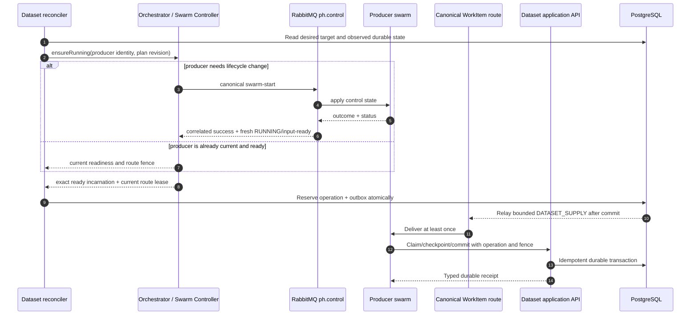

# Managed Test Data Design Readiness Assessment

Last updated: 2026-07-17

## Decision

> **DESIGN ASSESSMENT: GREEN — `G-TEAM-REVIEW-v1` PASS**
>
> The proposal is coherent and ready for an internal architecture, product,
> UX, QA, operations and security decision. This is Grade 0 design evidence.
> Implementation, runtime, 50,000-record, accessibility, endurance and release
> evidence is `NOT_RUN`; this document does not claim that PocketHive already
> provides the feature.

The team is being asked to approve the design direction and implementation
boundary, not production readiness.

## The idea in one minute

PocketHive gains a managed, reusable set of test records that source swarms can
create and other swarms can use repeatedly. PostgreSQL holds durable truth.
Swarms remain responsible for configured source and traffic flows. The existing
PocketHive control plane remains the only RabbitMQ path for swarm lifecycle.

Starting a producer and asking it to produce records are deliberately separate:

1. The Dataset reconciler observes a deficit against the desired target.
2. It asks the existing Orchestrator/Swarm Controller lifecycle port to ensure
   the exact producer swarm is running.
3. If a lifecycle change is needed, the existing controller emits canonical
   `swarm-start` through `ph.control`.
4. A correlated successful outcome plus a fresh exact-incarnation `RUNNING`,
   input-ready and current route-fence observation must be present.
5. Only then does the Dataset module durably reserve and publish one bounded,
   idempotent `DATASET_SUPPLY` WorkItem on the controller-declared canonical
   WorkItem route.
6. The producer runs its configured source flow and commits results through the
   authorised Dataset application API. PostgreSQL records the result, operation
   receipt and any new revision.

If the producer is already current and ready, ensure-running is idempotently
satisfied; a duplicate start is unnecessary. If start is denied, times out,
becomes stale, races with stop or loses its route fence, no supply is published.



## Where responsibility sits

| Component | Owns | Must not own |
|---|---|---|
| Scenario Manager | Versioned Dataset definitions, schemas, bindings and policy metadata | Runtime records, Rabbit topology or lifecycle execution |
| Managed Dataset domain/application inside Orchestrator | Desired/observed reconciliation, target policy, operations, schedules, idempotency, revisions and application ports | Rabbit names, HTTP/JDBC mechanics, worker flow logic or a second swarm controller |
| Existing Orchestrator/Swarm Controller | Plan/lifecycle authority, canonical `ph.control` events, actual runtime status and controller-owned WorkItem topology/route leases | Dataset record truth or source-flow outcomes |
| Producer swarm | Bounded source work through Dataset input/output adapters | Dataset target calculation, queue declaration or direct PostgreSQL access |
| Consumer swarm | Local snapshot selection and normal traffic work | Central mutation on each transaction or business “return” through Rabbit ack/requeue |
| PostgreSQL | Definitions admitted to runtime, records, target/policy versions, schedules, operations, fences, receipts, revisions, leases and outbox | Swarm execution |
| RabbitMQ | Delivery of control events and bounded WorkItems on their existing distinct routes | Schedule, desired state, record truth, completion proof or an additional Dataset event lane |
| Operator UI and MCP | Authorised, bounded, redacted views and evidence | Record values, inferred readiness, hidden mutation or privileged agent authority |

## Architecture boundary: one control plane, no new plane

The feature crosses three interfaces, but it does not create three planes.
Only `ph.control` is a swarm control plane. The WorkItem route is the existing
swarm data/work path, while the Dataset API is an application boundary backed
by PostgreSQL.

| Existing boundary | Role | Allowed | Forbidden |
|---|---|---|---|
| `ph.control` | PocketHive's single RabbitMQ swarm control plane | Template, plan, start, stop, remove, approved live configuration, outcomes, status and bounded alerts | Record bodies, requested record counts as supply work, Dataset commits or leases |
| Canonical WorkItem route | Existing swarm data/work path—not a control plane | Bounded `DATASET_SUPPLY` and existing intra-swarm work | Lifecycle commands, handcrafted routes or queue declarations by Dataset code |
| Dataset application API | Application boundary and durable-store access—not a message plane | Claim, checkpoint, commit, snapshot hydration and any separately admitted allocation lease | Worker direct SQL or unauthorised cross-scope access |

PostgreSQL is the durable store behind the Dataset application API, not a
fourth lane or a new plane. Correctness depends on durable reconciliation and
the periodic repair sweep; it does not depend on a separate Dataset event or
notification path.

The selected WorkItem route capability is platform-owned. Its exact durability,
bounds, overflow, confirms, acknowledgement/redelivery, delivery-limit and
dead-letter behaviour must be frozen and qualified for the release profile.
This design does not hard-code a Dataset-owned queue or silently fall back to a
different topology.

## Three canonical state axes, not one misleading status

The UI, APIs and operators must keep these axes independent:

| Axis | Example states | Question answered |
|---|---|---|
| `SwarmRuntimeState` | `READY`, `STARTING`, `RUNNING`, `STOPPING`, `STOPPED`, `FAILED` | Can this swarm runtime currently accept work? |
| `ProducerWorkState` | `IDLE`, `CLAIMED`, `EXECUTING`, `COMMITTING`, `FAILED`, `UNCERTAIN` | What is the running producer doing now? |
| `DatasetAvailabilityState` | `INITIALISING`, `WARMING`, `READY`, `DEGRADED`, `STARVED`, `ERROR`, `AUTH_REQUIRED` | Is sufficient valid data available for this declared use? |

A producer can therefore be `RUNNING` and safely idle while the Dataset is
`READY`: that is `SwarmRuntimeState=RUNNING` plus
`ProducerWorkState=IDLE`. A running producer does not prove a supply operation
succeeded, and Dataset availability cannot be derived from either producer
axis.

The finer durable supply-operation ledger remains a separate history, with
states such as `RESERVED`, `QUEUED`, `RUNNING`, `SUCCEEDED`, `PARTIAL`,
`FAILED`, `UNCERTAIN`, `TIMED_OUT` and `CANCELLED`. It answers what happened to
one bounded request; it is not a fourth current-state axis. A Rabbit publisher
confirm does not prove that records were committed. Missing, stale, partial and
denied facts never become zero, ready or green.

## Required scenario behaviour

| Scenario | Required decision |
|---|---|
| Producer already current and input-ready | Reuse its current fenced route; do not issue a redundant start; publish only the calculated bounded deficit. |
| Producer stopped | Use the existing lifecycle authority and `ph.control`; wait for correlated fresh readiness before supply. |
| Start denied, times out or status is stale | Publish no supply; retain an observable pending/blocked operation and retry only under durable policy. |
| Stop or topology rebind races supply | Advance/revoke the route fence; reject stale queued/claimed work; rebind the same logical operation as a new delivery attempt only when safe. |
| Rabbit publish is returned or unconfirmed | Keep the durable outbox intent pending; retry with the same operation identity. |
| Delivery is duplicated | The producer claim and commit are idempotent; the duplicate cannot create new durable accounting by accident. |
| Producer crashes before any external effect | Recover the same durable operation under a newer attempt fence when the ledger proves it is safe. |
| Producer crashes after a possible external effect | Mark `UNCERTAIN` and reconcile against an independent provider/effect ledger; never blind-retry. |
| Desired target increases | Coalesce to the newest policy generation and create only the bounded incremental deficit after promoting safe standby records. |
| Desired target decreases | Stop new reservations and transition surplus reusable records to `STANDBY`; do not delete leased/applied records or external resources. |
| Rabbit observation is unavailable | Show observation unavailable, not queue depth zero; PostgreSQL remains Dataset truth. |

## Scheduling and recovery

The target is desired state, not an “add N now” command. The Dataset reconciler
compares durable desired and observed state:

```text
deficit = max(0, targetReady - eligibleReady - reserved - inFlight)
```

- PostgreSQL stores target/policy generation, due time, fill cycle, claim,
  fence, operation, receipt and outbox state.
- Events may wake reconciliation, while a periodic repair sweep recovers missed
  notifications.
- Reconcilers claim due rows in short database transactions; no database lock
  is held while calling RabbitMQ, a controller or a provider.
- State change and outbox intent commit atomically; a relay publishes later.
- Rapid policy edits coalesce to the newest generation. A command receipt means
  accepted, while convergence remains a separately observable result.
- Scenario-timeline and worker-pacer counters stay independent. A process-local
  `maxMessages` counter cannot prove a durable Dataset target after restart.

## Reuse, “add back” and live size changes

The core profile is non-destructive shared reuse. Consumers hydrate an immutable
published revision into a bounded local view and select locally. Use does not
remove membership, so there is nothing to add back.

Exclusive/consumable use is a separate future profile. If admitted, allocation
must use durable holder, token, expiry and monotonic fencing epoch. A stale
return is rejected. Rabbit acknowledgement or requeue is transport behaviour,
not the Dataset business return.

The first release profile is designed for 50,000 eligible records, a maximum of
55,000 and at least two concurrent consumer swarms. This becomes a support
claim only after Grade 5 qualification with representative maximum record size,
live increase/decrease, restarts, duplicate delivery, database/query/resource
measurements, shared-infrastructure non-interference and a 24-hour run.

## Hexagonal and SOLID fitness

The architecture keeps business decisions inside the Dataset domain and
application boundary:

- inbound ports express use cases such as set target, reconcile, commit record,
  acquire snapshot and inspect status;
- outbound ports express required capabilities such as repository, clock,
  lifecycle, work dispatch and event publication;
- PostgreSQL, RabbitMQ, HTTP, worker SDK and controller integrations are
  replaceable infrastructure adapters that depend inward;
- domain/application code imports no Rabbit, HTTP, JDBC, Docker or UI types;
- one lifecycle authority and one canonical contract exist for each behaviour;
- new Dataset input/output adapters extend SDK factories/registries instead of
  adding Dataset conditionals to generic workers.

This applies single responsibility, open/closed extension, substitutable
adapter contracts, small interfaces and dependency inversion. Architecture
fitness tests and adapter TCKs must enforce the boundary; a package diagram
alone cannot.

## Agent, security and observability boundary

An agent using PocketHive MCP is an untrusted, read-only evidence client. It may
request bounded deterministic status or proof, but it cannot read Dataset
values, mutate targets, bypass approval, publish work or access PostgreSQL.

Each adapter uses a least-privilege service identity scoped to its exact API or
Rabbit lane. Logs, metrics, traces, control events and evidence contain bounded
identifiers, reason codes, correlation IDs and idempotency identities—not test
record values, credentials, provider bodies or free-form sensitive text. Denied
requests must produce zero Dataset mutation, zero dispatch and zero external
effect.

## UI design review

The operator experience has a complete design-level acceptance contract:

- all 38 `DSUI` requirements exist exactly once in
  [`managed-test-data-ui-acceptance-registry.json`](managed-test-data-ui-acceptance-registry.json);
- every child has an accountable evidence owner, risks, primary/supporting
  charters, independent oracles, a design-review status and separate
  implementation/release statuses;
- design review is `PASS`; implementation and release are `NOT_RUN` for all 38;
- inventory, detail, supply, consumers, evidence and inspector preserve the
  three state axes and authority/freshness boundaries;
- adverse states cover loading, background refresh, reconciling, stale,
  partial, limited, denied, empty, unavailable, incompatible, failed, starved
  and uncertain outcomes;
- production qualification requires response-to-DOM lineage, keyboard and
  focus behaviour, accessibility tree, screen reader, contrast/forced colours,
  200% zoom, 320-CSS-pixel reflow, desktop/tablet/mobile verification and
  polling non-interference. Screenshots are useful review evidence but cannot
  prove runtime truth or accessibility conformance.

## Gate status and remaining evidence

| Gate | Current result | What closes it |
|---|---|---|
| `G-TEAM-REVIEW-v1` | **PASS — green** | Current coherent design/specification/wireframe/assurance/registry baseline |
| `G-IMPLEMENTATION-READY-v1` | `NOT_EVALUATED` | Approve canonical contracts, ports/adapters, route capability, model/TCK plan, first source/SUT profile, measurable outcomes and named owners |
| `G-M1-INTERNAL-v1` | `NOT_RUN` | Implement and fault-test an official-ingress vertical slice against independent PostgreSQL, Rabbit, worker and external-effect ledgers |
| `dataset-qualified-core` | `NOT_RUN` | Pass every applicable acceptance child, 50,000-record/endurance/non-interference profile, security, recovery, UX and accessibility evidence |
| Sensitive, HA, exact interrupted swarm-lifecycle recovery, exclusive/consumable and wider scale | `NOT_CLAIMED` | Separate explicit profiles and gates; none is inherited from core |

## Why the design assessment is green

- The feature has one durable authority and one swarm lifecycle authority.
- Control stays on the one existing control plane; bounded supply reuses the
  existing WorkItem data path; PostgreSQL remains behind the Dataset
  application boundary. No new plane is introduced.
- The stopped-producer gap is closed by mandatory two-stage readiness gating.
- Scheduling, resize, retry, ambiguity and restart decisions are durable and
  observable rather than inferred from broker or process-local counters.
- Reuse semantics explain why the core mode does not need add-back.
- SOLID/hexagonal dependencies and platform extension points are testable.
- Security, agent authority, observability, UX states and accessibility have
  named owners, risks, oracles and future gates.
- Capacity is a qualification target, not an unsupported present-tense claim.

The proposal is therefore ready to show the team and seek design approval. It
is not yet ready to promise the feature to users or begin release qualification
without first passing `G-IMPLEMENTATION-READY-v1`.

## Primary engineering basis

- [Kubernetes controller pattern](https://kubernetes.io/docs/concepts/architecture/controller/): reconcile desired and observed state continuously.
- [Cockburn, Hexagonal Architecture](https://alistair.cockburn.us/hexagonal-architecture/): keep application decisions inside ports and infrastructure outside.
- [RabbitMQ acknowledgements and publisher confirms](https://www.rabbitmq.com/docs/confirms): delivery acknowledgements are orthogonal and do not create end-to-end exactly-once processing.
- [RabbitMQ virtual hosts](https://www.rabbitmq.com/docs/vhosts): vhosts provide logical, not physical, separation.
- [PostgreSQL `SELECT`](https://www.postgresql.org/docs/current/sql-select.html): `SKIP LOCKED` supports short queue-like row claims.
- [PostgreSQL `INSERT`](https://www.postgresql.org/docs/current/sql-insert.html): unique constraints and `ON CONFLICT` support idempotent durable writes.
- [AWS transactional outbox guidance](https://docs.aws.amazon.com/prescriptive-guidance/latest/cloud-design-patterns/transactional-outbox.html): commit state and publish intent atomically, relay later.
- [WCAG 2.2](https://www.w3.org/TR/WCAG22/): accessibility requires perceivable, operable, understandable and robust behaviour, not screenshots alone.
- [OWASP Logging Cheat Sheet](https://cheatsheetseries.owasp.org/cheatsheets/Logging_Cheat_Sheet.html): log security-relevant events while excluding sensitive data.
- [NIST Zero Trust Architecture](https://www.nist.gov/publications/zero-trust-architecture): apply explicit, least-privilege access at resource boundaries.
