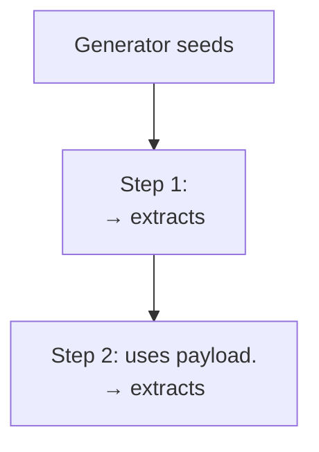

# PocketHive MCP Improvement Spec

> Status: **APPROVED FOR IMPLEMENTATION**
> Author: AI evaluation session, May 2026
> Scope: `tools/pockethive-mcp/server.mjs`, `.amazonq/rules/`, bundle structure standards

---

## Table of Contents

1. [Overview & Guiding Principles](#1-overview--guiding-principles)
2. [Novice Mental Model](#2-novice-mental-model)
3. [Responsibility Boundary — No Shell Tools](#3-responsibility-boundary--no-shell-tools)
4. [Contract Tools — Runtime First](#4-contract-tools--runtime-first)
5. [Generation Sanity Checks](#5-generation-sanity-checks)
6. [Scenario Wizard](#6-scenario-wizard)
7. [Mock Configuration — mock-config/](#7-mock-configuration--mock-config)
8. [Dataset Management](#8-dataset-management)
9. [Documentation Standards](#9-documentation-standards)

---

## 1. Overview & Guiding Principles

### What This Spec Covers

This spec defines improvements to the PocketHive MCP server and bundle authoring
standards. It is written to be concrete enough for an AI agent to implement without
additional clarification.

### The Problem Being Solved

1. **Security and responsibility boundary** — the MCP has accumulated shell and
   devops capabilities (docker, maven, git, npm). That is outside the plugin's
   responsibility. The MCP must not execute shell commands.

2. **Contract knowledge** — the AI has to guess the PocketHive contract by reading
   Java source, markdown docs, and YAML files. These go stale. The Scenario Manager
   already validates bundles — it should expose its contract as a queryable API.

3. **Novice experience** — the AI assumes instead of asking. A wizard must gather
   requirements before authoring any files.

4. **Repeatability** — mock stubs and Redis datasets are configured ad-hoc and lost
   on stack restart. They must be saved as bundle artifacts.

5. **Evidence** — there is no standard for proving a scenario works. Every bundle
   must have a CHANGELOG with structured evidence and a FLOW_DOCUMENT explaining
   the architecture.

6. **Performance mindset** — scenarios are performance tests. They must have
   explicit traffic shape, success criteria, observability, and
   stakeholder-readable evidence.

### Guiding Principles

- **No hard-coded environment values** — environment-specific values go in
  `variables.yaml`. If `variables.yaml` is created, it should include explicit
  profiles such as `smoke`, `default`, and `nft`.
- **Bundles are separate product content** — scenario bundles should be authored
  in a separate scenario-bundles repository. The PocketHive product repo may
  keep examples/fixtures, but MCP authoring should point `BUNDLES_ROOT` at the
  external repo.
- **No assumptions** — the wizard asks before authoring. Missing context = question,
  not guess.
- **Contract from the runtime first** — the Scenario Manager API is the preferred
  source of truth. Explicit offline sources are allowed only when the stack is
  unavailable, and the tool response must say which source was used.
- **Evidence is mandatory** — no bundle is complete without a CHANGELOG entry with
  all evidence fields populated from actual tool output.
- **Performance specialist mindset** — every scenario is a performance test.
  Traffic shape, success criteria, and observability must be explicit.

---

## 2. Novice Mental Model

The MCP should behave like a PocketHive scenario-building skill, not a toolbox.
A novice user should be able to describe the test in plain language and be
guided to a valid, repeatable, evidence-backed bundle.

```
User intent
  "Create a load test for onboarding"
        |
        v
Wizard intake
  protocol, target, data, auth, traffic, observability
        |
        v
Contract-aware authoring
  contract.* tools + domain authoring tools
        |
        v
Bundle artifacts
  scenario.yaml, templates/, authProfiles.yaml, variables.yaml,
  sut/, datasets/, mock-config/, README/FLOW/CHANGELOG
        |
        v
Validation
  bundle.validate through Scenario Manager
        |
        v
Run and evidence
  scenario.deploy -> swarm.create/start
  journal, queues, taps, metrics, mocks, datasets, PocketHive logs if exposed
        |
        v
Closeout
  changelog evidence + HiveMind learning
```

The AI must avoid expensive guesses. If the user has not said where data comes
from, whether auth is needed, what endpoints are called, or what success means,
the wizard asks. It may infer low-risk defaults only after showing the
assumption to the user.

### 2.1 Current Evidence Sources

Use these sources today. `EVIDENCE.md` is the canonical taxonomy for what each
source proves:

- `debug.journal` for swarm lifecycle and runtime events
- `debug.tap` for representative WorkItems and payload flow
- `debug.queues` for queue depth/drain evidence
- `debug.prometheus` for metrics
- `mock.wiremock.requests` / `mock.tcp.requests` for SUT-double evidence
- `dataset.check` for Redis dataset readiness
- `evidence.summary` for an aggregate read-only evidence view
- PocketHive-provided log APIs, if PocketHive exposes them

Do not use Docker/container logs directly. Loki is a possible future backend,
but not a current MCP integration target unless PocketHive exposes it through
its own API.

---

## 3. Responsibility Boundary — No Shell Tools

### 3.1 Rule

The PocketHive MCP server is an application integration layer, not a local
terminal, build runner, Docker controller, Git client, or log scraper. It must
not execute shell commands directly or indirectly.

This is stricter than "sandbox the dangerous commands". The correct boundary is:

- MCP tools may call PocketHive-owned HTTP APIs, RabbitMQ management APIs,
  Prometheus APIs, WireMock/TCP mock admin APIs, and structured file APIs for
  the active bundle.
- MCP tools may read and write bundle artifacts under the configured
  `BUNDLES_ROOT`, using explicit path containment checks.
- MCP tools must not run `docker`, `docker compose`, `mvn`, `npm`, `node`
  scripts, `git`, `bash`, `wsl`, PowerShell, or arbitrary child processes.
- MCP tools must not read Docker/container logs directly. Runtime diagnosis
  should use PocketHive-provided evidence: swarm status, swarm journal, queues,
  debug taps, metrics, mock request history, dataset checks, and any
  PocketHive-owned log API that exists.
- Loki may become a future structured log backend, but it is out of scope for
  this phase unless PocketHive exposes it through a product-owned API. Do not
  add direct Loki tools now.

### 3.2 Tools to Remove

Remove these tools entirely from `server.mjs`:

| Tool | Reason |
|---|---|
| `docker.execute` | Shell/Docker control is outside MCP responsibility |
| `docker.compose` | Stack lifecycle belongs to local dev tooling, not MCP |
| `git.execute` | Git writes/pushes/resets are outside MCP responsibility |
| `git.status` | Git inspection belongs to IDE/Git tooling, not MCP |
| `git.diff` | Git inspection belongs to IDE/Git tooling, not MCP |
| `maven.execute` | Build execution belongs to local dev tooling/CI |
| `npm.execute` | Package/script execution belongs to local dev tooling/CI |
| `tools.check` | Shell-tool support utility; remove with shell tools |
| `docs.refresh` | Sync scripts are shell-based and no longer needed in-repo |
| `stack.start` | Stack lifecycle is outside MCP responsibility |
| `stack.stop` | Stack lifecycle is outside MCP responsibility |
| `stack.rebuild` | Do not add; rebuilds are outside MCP responsibility |
| `bundle.commit` | Do not add; commits are outside MCP responsibility |
| `debug.shell` | Do not add; shell/Docker debug is outside MCP responsibility |
| `debug.docker-logs` | Remove; direct container logs are outside MCP scope |

Also remove the `pockethiveRefStale` check from `health.check`. It only made
sense when the MCP server depended on a synced reference copy.

### 3.3 What Remains In Scope

Keep and improve API/file-backed tools:

| Area | In-scope tools |
|---|---|
| Context | `context.get`, `context.set-bundles-root`, `context.list-bundles-roots` |
| Bundle files | `bundle.list`, `bundle.read`, `bundle.validate`, `bundle.validate.result`, `bundle.diff` |
| Scenario lifecycle | `scenario.deploy`, `scenario.list`, `scenario.get` |
| Swarm lifecycle | `swarm.list`, `swarm.get`, `swarm.create`, `swarm.wait-ready`, `swarm.start`, `swarm.stop`, `swarm.remove` |
| Real-time control | `component.config-preview` read-only merge plan and `component.config-update` through Orchestrator only; read current component config from Orchestrator journal/status evidence, deep-merge requested changes, then send the merged update |
| Debug evidence | `debug.queues`, `debug.tap`, `debug.tap.read`, `debug.tap.close`, `debug.journal`, `debug.config-update` compatibility alias, `debug.prometheus`, `evidence.summary`, PocketHive-provided log tools if/when exposed by PocketHive APIs |
| Mocks | `mock.wiremock.*`, `mock.tcp.*`, `mock.save`, `mock.load` |
| Datasets | `dataset.seed`, `dataset.check`, `dataset.save` |
| Contracts | `contract.*` |
| Wizard/session authoring | Public novice flow: `wizard.*`; lower-level advanced authoring: dot-delimited domain tools such as `scenario.create`, `pipeline.create.*`, `bee.config.set` |
| Docs/evidence | `bundle.docs.generate`, `bundle.docs.changelog` |

Every tool in this table must have a contract entry matching
`TOOL-CONTRACTS.md` before implementation.

### 3.4 Local Development And Logs

Local build, stack start/stop, Docker inspection, package management, Git
operations, and log inspection remain available to humans through existing
developer workflows:

- `build-hive.sh`
- `docker compose`
- IDE Git tooling / command-line Git
- CI jobs
- PocketHive UI/runtime diagnostics

The MCP may return a clear message such as "Use the local dev workflow outside
MCP" when a user asks it to perform those tasks. It must not run them.

### 3.5 Implementation Location

All MCP server changes are in `tools/pockethive-mcp/server.mjs`.

Remove the shell/dev-tool section and the supporting imports/modules:

- `DockerTool`
- `GitTool`
- `MavenTool`
- `NpmTool`
- generic shell executor usage for command execution

Any remaining child-process usage must be deleted or replaced with an
API-backed implementation. Path operations for bundle files must use Node's
filesystem APIs directly and must enforce that resolved paths stay within the
configured bundle root.

---

## 4. Contract Tools — Runtime First

### 4.1 Design Decision

The Scenario Manager is the preferred runtime source for the PocketHive contract. It:
- Already validates bundles on deploy
- Already serves capabilities via `GET /api/capabilities?all=true`
- Runs the live Java models

**Phase A (implement now):** MCP contract tools read from:
1. `GET <SM_URL>/api/capabilities?all=true` — worker config schemas (live, always correct)
2. `REPO_ROOT/scenario-manager-service/capabilities/*.latest.yaml` — explicit offline source when stack is down
3. `REPO_ROOT/docs/scenarios/SCENARIO_CONTRACT.md` — scenario/bee/plan structure (read directly)
4. `REPO_ROOT/docs/AUTH-USER-GUIDE.md` + `AUTH-BEHAVIOR.md` — auth contract (read directly)
5. `REPO_ROOT/docs/scenarios/SCENARIO_PATTERNS.md` — pipeline patterns (read directly)

**Scenario Manager authoring contract (current target):**
Expand the Scenario Manager API with:
- `GET /api/authoring-contract` — full authoring manifest from live Scenario Manager sources
- `GET /api/authoring-contract/fingerprint` — lightweight cache freshness check
- `POST /validation/scenario-bundles` — side-effect-free bundle validation with structured findings
- `POST /validation/scenario-bundles/existing?bundleKey=...` — validate a catalog entry by bundle identity

MCP should call the authoring contract once per server session and cache it.
It should call again only when `forceRefresh` is explicit or when a fingerprint
check shows the Scenario Manager contract changed. All contract tools must
return `source` and cache state so agents and users can see where the contract
came from.

### 4.2 New MCP Tools

#### `contract.worker-config`

```
Input:
  role: string
  Valid roles: generator | moderator | processor | postprocessor | request-builder |
               http-sequence | swarm-controller | clearing-export | trigger

Action:
  1. Try GET <SM_URL>/api/capabilities?all=true
     Find manifest where manifest.role === role
     If found: source = "live"
  2. If stack down or role not found:
     Read REPO_ROOT/scenario-manager-service/capabilities/<role>.latest.yaml
     source = "cached"
  3. Parse config array from manifest
  4. Add role-specific authoring notes (hardcoded per role — see notes table below)

Output:
  {
    role: string,
    source: "live" | "cached",
    sourceReason?: string,       // e.g. "Scenario Manager unavailable"
    capabilitiesVersion: string,
    config: [
      {
        name: string,        // e.g. "inputs.type"
        type: string,        // string | number | boolean | json | text
        default: any,
        options?: string[],  // if enum
        required: boolean,   // true if no default
        description?: string,
        ui?: { label, group }
      }
    ],
    notes: string[]          // key authoring notes for this role
  }

Role-specific notes (hardcoded):
  generator:
    - "Use bodyType: SIMPLE for plain JSON payloads, HTTP for pre-built HTTP envelopes"
    - "Set maxMessages: 0 for infinite run, >0 for finite run"
    - "ratePerSec should come from vars.ratePerSec — never hard-code"
    - "For REDIS_DATASET: sources is a list with listName and weight per source"

  http-sequence:
    - "templateRoot must be /app/scenario/templates — this is the container mount path"
    - "steps[].stepId must be unique within the steps array"
    - "steps[].callId must match a template file callId in the templates/ directory"
    - "extracts[].fromJsonPointer uses JSON Pointer (RFC 6901): /field not $.field"
    - "Auth goes in authRef in each template file, not in worker config"
    - "debugCapture.mode: ALWAYS during development, ERROR_ONLY for production runs"

  processor:
    - "baseUrl must reference sut.endpoints — never hard-code URLs"
    - "mode: THREAD_COUNT caps concurrency; mode: RATE_PER_SEC paces calls"
    - "threadCount should come from vars.threadCount — never hard-code"
    - "For TCP: set tcpTransport.type (socket | nio | netty)"

  request-builder:
    - "templateRoot must be /app/scenario/templates"
    - "serviceId is the default serviceId — templates can override per-call"
    - "Auth goes in authRef in each template file OR in worker config auth[] list"
    - "passThroughOnMissingTemplate: false is safer — fails loudly on missing template"

  postprocessor:
    - "writeTxOutcomeToClickHouse: use vars.writeToClickHouse — true for nft, false for default"
    - "dropTxOutcomeWithoutCallId: true — skip ClickHouse write if no x-ph-call-id header"
    - "forwardToOutput: false unless you need to chain to another worker"
```

#### `contract.auth-profiles`

```
Input: (none)

Action:
  Read REPO_ROOT/docs/AUTH-USER-GUIDE.md
  Read REPO_ROOT/docs/AUTH-BEHAVIOR.md
  Read REPO_ROOT/common/worker-sdk/src/main/java/io/pockethive/worker/sdk/auth/AuthApplyAs.java
    — extract enum constants (lines matching "^\s+[A-Z_]+," or "^\s+[A-Z_]+$")
  Read REPO_ROOT/common/worker-sdk/src/main/java/io/pockethive/worker/sdk/auth/AuthType.java
    — extract enum constants same way

  Return structured contract (hardcoded structure, enum values from source):

Output:
  {
    contract: "authRef",
    deprecated: "auth: inline block — do not use, will fail validation",
    authProfilesYaml: {
      location: "bundle root (same directory as scenario.yaml)",
      format: "profiles: map keyed by profileId (not a list)",
      duplicateKeys: "rejected at parse time — YAML strict duplicate detection enabled"
    },
    authRefShape: {
      profileId: "string — must match a key in authProfiles.yaml profiles map",
      applyAs: [...],   // from AuthApplyAs.java enum constants
      headerName: "optional string — used with HTTP_HEADER applyAs",
      queryParam: "optional string — used with HTTP_QUERY_PARAM applyAs",
      targetField: "optional string — used with HMAC_PAYLOAD_FIELD, ISO8583_MAC_FIELD"
    },
    profileShape: {
      type: [...],      // from AuthType.java enum constants
      storage: {
        mode: "REDIS (refreshable types) | NONE (non-refresh types)",
        tokenKey: "string — Redis key suffix, required when mode=REDIS"
      },
      refresh: {
        refreshAheadSeconds: "number — default 60",
        emergencyRefreshAheadSeconds: "number — default 10",
        leaseSeconds: "number — default 15"
      }
    },
    refreshableTypes: ["OAUTH2_CLIENT_CREDENTIALS", "OAUTH2_PASSWORD_GRANT"],
    nonRefreshTypes: ["STATIC_TOKEN", "BEARER_TOKEN", "BASIC_AUTH", "API_KEY",
                      "HMAC_SIGNATURE", "AWS_SIGNATURE_V4", "ISO8583_MAC",
                      "TLS_CLIENT_CERT", "MESSAGE_FIELD_AUTH"],
    secretInjection: {
      envVar: "{ env: 'VAR_NAME' } — reads from environment variable",
      file: "{ file: '/path/to/secret' } — reads from file"
    },
    redisKeyFamily: "ph:tokens:<swarmId>:record:<tokenKey>",
    notes: [
      "refreshAheadSeconds: 60 means token is refreshed 60s before expiry",
      "Same tokenKey with different config in one swarm fails validation",
      "authProfiles.yaml is located by walking up from templateRoot",
      "Non-refresh strategies must use storage.mode: NONE",
      "Refreshable strategies must use storage.mode: REDIS"
    ]
  }
```

#### `contract.template`

```
Input:
  protocol: "HTTP" | "TCP" | "ISO8583"

Action:
  Read REPO_ROOT/common/request-templates/src/main/java/io/pockethive/requesttemplates/HttpTemplateDefinition.java
  Read REPO_ROOT/common/request-templates/src/main/java/io/pockethive/requesttemplates/TcpTemplateDefinition.java
  Extract record component names using regex: /public record \w+\(([\s\S]+?)\)/
  Parse component list: split on comma, extract type and name
  Return structured field list

Output:
  {
    protocol: "HTTP" | "TCP" | "ISO8583",
    requiredFields: string[],
    optionalFields: string[],
    authField: "authRef — use authRef not auth:",
    deprecated: ["auth"],
    example: string,   // minimal valid template YAML as a string
    notes: string[]
  }

HTTP example output:
  {
    protocol: "HTTP",
    requiredFields: ["serviceId", "callId", "protocol", "method", "pathTemplate"],
    optionalFields: ["bodyTemplate", "headersTemplate", "authRef", "resultRules"],
    authField: "authRef",
    deprecated: ["auth"],
    example: "serviceId: default\ncallId: my-call\nprotocol: HTTP\nmethod: POST\npathTemplate: /api/endpoint\nbodyTemplate: |\n  {}\nheadersTemplate:\n  Content-Type: application/json\n",
    notes: [
      "protocol field is required — set to HTTP",
      "pathTemplate supports Pebble: {{ payload.field }}",
      "bodyTemplate supports Pebble and SpEL via eval(...)",
      "authRef.profileId must match a key in authProfiles.yaml",
      "resultRules.businessCode.pattern is a regex with one capture group"
    ]
  }
```

#### `contract.scenario`

```
Input: (none)

Action:
  Read REPO_ROOT/docs/scenarios/SCENARIO_CONTRACT.md
  Return hardcoded structured contract (the contract is stable — changes tracked in docs)

Output:
  {
    topLevelFields: {
      required: ["id", "name", "template"],
      optional: ["description", "topology", "trafficPolicy", "plan"]
    },
    idRule: "id must match the bundle folder name exactly",
    beeFields: {
      required: ["role", "image", "work"],
      optional: ["id", "config", "env", "ports"],
      idNote: "id is required only when topology is declared or plan.bees references this bee"
    },
    workFormat: {
      description: "map form — in and out are map<portId, queueSuffix>",
      correct: "work:\n  in:\n    in: proc\n  out:\n    out: post",
      incorrect: "work:\n  in: proc\n  out: post",
      note: "string shorthand is legacy — always use map form"
    },
    queueWiring: {
      rule: "out queueSuffix of one bee must match in queueSuffix of the next bee",
      example: "generator out.out: seqQ → http-sequence in.in: seqQ"
    },
    planShape: {
      beeSteps: "plan.bees[].instanceId matches bee role (or id if set)",
      swarmSteps: "plan.swarm[] for swarm-wide actions",
      stepIdField: "stepId — NOT id",
      stepTypes: ["config-update", "start", "stop"],
      timeFormat: "ISO-8601 duration from plan start: PT30S, PT5M, PT1H"
    },
    configStructure: {
      inputs: "config.inputs.type: SCHEDULER | CSV_DATASET | REDIS_DATASET",
      outputs: "config.outputs.type: RABBITMQ | REDIS | NOOP",
      worker: "config.worker — role-specific worker config"
    },
    notes: [
      "template.image must be swarm-controller:latest",
      "Every bee must have a work: section even if empty {}",
      "Standard pipeline: generator → [moderator] → [request-builder] → processor → postprocessor",
      "http-sequence replaces request-builder + processor for multi-step journeys"
    ]
  }
```

#### `contract.patterns`

```
Input: (none)

Action:
  Read REPO_ROOT/docs/scenarios/SCENARIO_PATTERNS.md
  Return hardcoded pattern registry (patterns are stable)

Output:
  [
    {
      id: "rest-simple",
      description: "Generator → Processor → Postprocessor. No request-builder.",
      whenToUse: "Simple HTTP load, static or pre-built payload, no per-call template variation",
      pipeline: ["generator", "processor", "postprocessor"],
      queues: ["proc", "post"],
      dataSource: ["SCHEDULER", "CSV_DATASET"],
      templateRequired: false
    },
    {
      id: "rest-rbuilder",
      description: "Generator → Request-Builder → Processor → Postprocessor",
      whenToUse: "HTTP with dynamic paths/bodies/headers, multiple call types via x-ph-call-id",
      pipeline: ["generator", "request-builder", "processor", "postprocessor"],
      queues: ["build", "proc", "post"],
      dataSource: ["SCHEDULER", "CSV_DATASET", "REDIS_DATASET"],
      templateRequired: true
    },
    {
      id: "sequence",
      description: "Generator → HTTP-Sequence → Postprocessor",
      whenToUse: "Multi-step journeys: auth flows, onboarding, chained transactions",
      pipeline: ["generator", "http-sequence", "postprocessor"],
      queues: ["seq", "post"],
      dataSource: ["SCHEDULER", "REDIS_DATASET"],
      templateRequired: true
    },
    {
      id: "tcp-simple",
      description: "Generator → Processor(TCP) → Postprocessor",
      whenToUse: "TCP or ISO-8583 protocols",
      pipeline: ["generator", "processor", "postprocessor"],
      queues: ["proc", "post"],
      dataSource: ["SCHEDULER", "CSV_DATASET"],
      templateRequired: false
    },
    {
      id: "redis-loop",
      description: "Generator(Redis) → Request-Builder → Processor → Postprocessor(Redis output)",
      whenToUse: "Stateful journeys recycling data through Redis lists",
      pipeline: ["generator", "request-builder", "processor", "postprocessor"],
      queues: ["build", "proc", "post"],
      dataSource: ["REDIS_DATASET"],
      templateRequired: true,
      notes: ["postprocessor outputs.type: REDIS with routes config"]
    }
  ]
```

#### `contract.examples`

```
Input:
  pattern: "rest-simple" | "rest-rbuilder" | "sequence" | "tcp-simple" | "redis-loop"

Action:
  Map pattern to example bundle path:
    rest-simple   → REPO_ROOT/scenarios/bundles/local-rest-topology/
    rest-rbuilder → REPO_ROOT/scenarios/bundles/local-rest-schema-demo/
    sequence      → REPO_ROOT/scenarios/bundles/smarter-onboarding-sequence/ (if exists)
                    else REPO_ROOT/scenarios/e2e/webauth-loop-redis-5-customers/
    tcp-simple    → REPO_ROOT/scenarios/tcp/tcp-socket-demo/
    redis-loop    → REPO_ROOT/scenarios/bundles/webauth-loop-redis-minimal/ (if exists)
                    else REPO_ROOT/scenarios/e2e/webauth-loop-redis-5-customers/

  Read scenario.yaml from the resolved path.
  Read first template file found in templates/ (if any).

Output:
  {
    pattern: string,
    bundlePath: string,
    scenarioYaml: string,
    templateExample?: string,
    notes: string[]   // any caveats about this example
  }
```

### 4.3 Implementation Notes

- All contract tools are read-only. They never write files.
- If `REPO_ROOT` is not set or the file does not exist, throw a clear error:
  `"POCKETHIVE_ROOT not set or file not found: <path>. Ensure POCKETHIVE_ROOT points to the PocketHive repo checkout."`
- The live capabilities API call has a 5s timeout. On timeout, use cached YAML
  only as an explicit offline source and include `source: "cached"` plus a
  `sourceReason`. Never silently switch sources.
- Enum extraction from Java source uses this regex pattern:
  `/^\s+([A-Z][A-Z0-9_]*)\s*[,;]?\s*(?:\/\/.*)?$/gm`
  Applied to the file content after stripping the class/enum declaration line.
  This is robust for PocketHive's enum style — all constants are UPPER_SNAKE_CASE on their own line.

---

## 5. Generation Sanity Checks

### 5.1 Purpose

Authoring tools may run local generation sanity checks to catch missing files or
obvious generated-artifact defects immediately. These checks are internal
authoring diagnostics only. Public static bundle validation must use
`bundle.validate` through Scenario Manager.

### 5.2 Internal Check Shape

```
Action:
  bundleDir = resolve(getBundlesDir(), bundle)
  Throw if bundleDir does not exist.
  Run all checks below. Collect all errors — do not stop at first.

Output:
  {
    valid: boolean,
    errors: [{ code, path, message, fix, severity: "error"|"warning"|"info" }],
    summary: string   // e.g. "3 errors, 1 warning. Fix errors before deploying."
  }
```

### 5.3 Checks

Every check produces an item with `code`, `path`, `message`, `fix`, `severity`.

```
CHECK-01  scenario.yaml exists
  severity: error
  path: scenario.yaml
  message: "scenario.yaml not found in bundle '<bundle>'"
  fix: "Create scenario.yaml in bundles/<bundle>/"

CHECK-02  scenario.yaml parses as valid YAML
  severity: error
  path: scenario.yaml
  message: "scenario.yaml is not valid YAML: <parse error>"
  fix: "Fix YAML syntax error at line <N>"

CHECK-03  id field matches bundle folder name
  severity: error
  path: scenario.yaml#id
  message: "scenario id '<id>' does not match bundle folder name '<bundle>'"
  fix: "Set id: <bundle> in scenario.yaml"

CHECK-04  template.image is swarm-controller:latest
  severity: error
  path: scenario.yaml#template.image
  message: "template.image must be 'swarm-controller:latest', got '<value>'"
  fix: "Set template.image: swarm-controller:latest"

CHECK-05  every bee has role, image, work
  severity: error
  path: scenario.yaml#template.bees[N]
  message: "Bee at index <N> is missing required field '<field>'"
  fix: "Add <field>: <value> to bee at index <N>"

CHECK-06  work uses map form (in/out are objects not strings)
  severity: error
  path: scenario.yaml#template.bees[N].work.<in|out>
  message: "work.<in|out> must be a map (e.g. {out: 'proc'}) not a string"
  fix: "Change 'out: proc' to:\n  out:\n    out: proc"

CHECK-07  queue wiring — every in queueSuffix has a matching upstream out queueSuffix
  severity: error
  path: scenario.yaml#template.bees[N].work.in
  message: "Bee '<role>' consumes queue '<suffix>' but no upstream bee produces it"
  fix: "Set work.out.<portId>: '<suffix>' on the upstream bee"

CHECK-08  plan steps use stepId not id
  severity: error
  path: scenario.yaml#plan.bees[N].steps[M] or plan.swarm[M]
  message: "Plan step uses 'id' field — must use 'stepId'"
  fix: "Rename 'id:' to 'stepId:' in plan step"

CHECK-09  stepId values are unique within their steps array
  severity: error
  path: scenario.yaml#plan
  message: "Duplicate stepId '<value>' in plan"
  fix: "Use unique stepId values"

CHECK-10  every callId in http-sequence steps has a matching template file
  severity: error
  path: scenario.yaml#template.bees[N].config.steps[M].callId
  message: "callId '<callId>' has no matching template file in templates/<serviceId>/<callId>.yaml"
  fix: "Create templates/<serviceId>/<callId>.yaml or correct the callId"

CHECK-11  if any template has authRef, authProfiles.yaml exists
  severity: error
  path: templates/<serviceId>/<callId>.yaml#authRef
  message: "Template '<callId>' declares authRef but authProfiles.yaml not found"
  fix: "Create authProfiles.yaml in the bundle root with a 'profiles:' map"

CHECK-12  every authRef.profileId has a matching key in authProfiles.yaml profiles map
  severity: error
  path: templates/<serviceId>/<callId>.yaml#authRef.profileId
  message: "authRef.profileId '<id>' not found in authProfiles.yaml profiles map"
  fix: "Add profile '<id>:' to authProfiles.yaml or correct the profileId"

CHECK-13  no inline auth: blocks in templates (deprecated)
  severity: error
  path: templates/<serviceId>/<callId>.yaml#auth
  message: "Inline 'auth:' block is deprecated and will fail runtime validation"
  fix: "Replace 'auth:' with 'authRef:' and create authProfiles.yaml"

CHECK-14  sut.yaml exists if sut.endpoints is referenced in config
  severity: error
  path: scenario.yaml
  message: "Config references sut.endpoints but no sut/<sutId>/sut.yaml found"
  fix: "Create sut/<sutId>/sut.yaml with the endpoint definitions"

CHECK-15  variables.yaml exists if {{ vars.* }} is used
  severity: warning
  path: scenario.yaml
  message: "Config uses {{ vars.* }} but variables.yaml not found"
  fix: "Create variables.yaml with the required variable definitions"

CHECK-16  no plan defined
  severity: warning
  path: scenario.yaml#plan
  message: "No plan defined — swarm will run indefinitely until manually stopped"
  fix: "Add a plan with at least an auto-stop step:\nplan:\n  swarm:\n    - stepId: auto-stop\n      time: PT60S\n      type: stop"

CHECK-17  ratePerSec is hard-coded (not a variable reference)
  severity: warning
  path: scenario.yaml
  message: "ratePerSec is hard-coded to <value>. Consider using {{ vars.ratePerSec }}"
  fix: "Move ratePerSec to variables.yaml and reference as {{ vars.ratePerSec }}"

CHECK-18  maxMessages is hard-coded
  severity: warning
  path: scenario.yaml
  message: "maxMessages is hard-coded to <value>. Consider using {{ vars.maxMessages }}"
  fix: "Move maxMessages to variables.yaml and reference as {{ vars.maxMessages }}"

CHECK-19  threadCount is hard-coded
  severity: warning
  path: scenario.yaml
  message: "threadCount is hard-coded to <value>. Consider using {{ vars.threadCount }}"
  fix: "Move threadCount to variables.yaml and reference as {{ vars.threadCount }}"

CHECK-20  no result rules on HTTP templates (info only)
  severity: info
  path: templates/<serviceId>/<callId>.yaml
  message: "No resultRules defined — success determined by HTTP 2xx only"
  fix: "Add resultRules.businessCode and resultRules.successRegex if the SUT returns a business result code"
```

---

## 6. Scenario Wizard

### 6.1 Purpose

A structured intake flow that gathers all requirements before authoring any files.
The AI **must not create bundle files** until `wizard.complete` is called.

### 6.2 In-Memory Session Store

The wizard maintains sessions in a `Map<sessionId, WizardSession>` in the MCP
server process.

```javascript
// WizardSession shape
{
  sessionId: string,          // uuid
  intent: string,
  status: "gathering" | "ready",
  answers: Record<string, unknown>,
  createdAt: string,
  createdAtMs: number
}
```

Sessions expire after 2 hours (cleanup on access).

### 6.3 Tool: `wizard.start`

```
Input:
  intent: string
  bundleId?: string
  protocol?: "REST" | "TCP" | "SEQUENCE" | "HTTP"
  target?: "wiremock-local" | "tcp-mock-local" | "external"
  targetBaseUrl?: string
  endpoint?: string | { method: string, path: string }
  endpoints?: Array<string | { method: string, path: string, callId?: string, bodyTemplate?: string }>
  requestBody?: string
  tcpPayload?: string
  ratePerSec?: number
  defaultRatePerSec?: number
  nftRatePerSec?: number
  trafficShape?: "smoke" | "ramp_steady" | "spike" | "soak" | "flat"
  runDuration?: string
  nftDuration?: string
  dataSource?: "SCHEDULER" | "CSV_DATASET" | "REDIS_DATASET"
  csvColumns?: string[]
  redisLists?: string[]
  redisOutput?: "yes" | "no"
  auth?: "none" | "oauth2_client_credentials" | "bearer_token_static" |
         "basic_auth" | "api_key" | "hmac" | "aws_sig_v4" |
         "iso8583_mac" | "mtls"
  authTokenUrl?: string
  authClientId?: string
  authSecretSource?: "env_var" | "file"
  authSecretEnvVar?: string
  sutDouble?: "real_system" | "wiremock" | "tcp_mock" | "wiremock_and_tcp"
  mockEndpoints?: array
  resultRules?: "yes" | "no"
  resultCodePattern?: string
  successCodes?: string[]
  performanceObjective?: string
  clickhouse?: "yes_for_nft_only" | "yes_always" | "no"
  grafanaDashboard?: "rtt_overview" | "tx_outcomes" | "quality" |
                     "pipeline_observability" | "none"
  docs?: "yes" | "no"

Action:
  Generate sessionId = "wiz-" + randomUUID()
  Create WizardSession with explicit answers supplied by the caller
  Store in sessions map
  Determine first missing required question

Output:
  {
    sessionId: string,
    status: "gathering" | "ready",
    ready: boolean,
    missing: string[],
    errors: string[],
    nextQuestion: { id, prompt, options? } | null,
    bundle: object | null,
    scenario: object | null
  }
```

### 6.4 Tool: `wizard.answer`

```
Input:
  sessionId: string
  questionId: any wizard.start optional field above. Backward-compatible aliases
              are accepted for endpoint/ratePerSec and snake_case question ids.
  answer: any

Action:
  Retrieve session. Throw if not found or expired.
  Normalize and store answer.
  Return the same plan shape as wizard.start.
```

### 6.5 Tool: `wizard.summary`

```
Input:
  sessionId: string

Action:
  Retrieve session.
  Compute WizardSummary from answers.

Output: WizardSummary
  {
    sessionId,
    status: "ready" | "gathering",
    ready: boolean,
    missing: string[],
    errors: string[],
    nextQuestion: object | null,
    bundle: { id: string, path: string } | null,
    scenario: { id, protocol, pattern, target, endpoint, ratePerSec } | null
  }
```

### 6.6 Tool: `wizard.complete`

```
Input:
  sessionId: string

Action:
  Retrieve session. Throw if not ready.
  Resolve bundle id from explicit wizard answer.
  bundleDir = resolve(getBundlesDir(), bundleId)
  Throw if bundleDir already exists (prevent overwrite).

  Generate files based on answers:
    1. scenario.yaml                     — always, Scenario Manager contract shape
    2. variables.yaml                    — always, Scenario Variables v1 shape
    3. sut/<sutId>/sut.yaml              — always
    4. templates/http/<serviceId>/*.yaml — REST/SEQUENCE
    5. templates/tcp/<serviceId>/*.yaml  — TCP
    6. authProfiles.yaml                 — when auth != none
    7. datasets/sample.csv               — when CSV_DATASET
    8. mock-config/redis-state.json      — when REDIS_DATASET
    9. mock-config/wiremock/*.json       — when WireMock mock target
   10. mock-config/tcp/*.yaml            — when TCP mock target
   11. README.md                         — always
   12. FLOW_DOCUMENT.md, CHANGELOG.md    — when docs != no

  Run generation sanity checks on generated bundle.
  Return generation errors/warnings explicitly. For Scenario Manager validation,
  call bundle.validate with validator="scenario-manager-dry-run".
  Use validator="scenario-manager-upload" only when the user explicitly wants
  Scenario Manager import/replace side effects.

Output:
  {
    completed: true,
    generated: { created, bundleId, path, pattern, target },
    generationSanity: GenerationSanityResult
  }
```

### 6.7 Question Flow

Questions are asked in order. `shown_when` conditions are evaluated against current answers.
`required: true` questions block `wizard.complete` if unanswered.
`required: false` questions can be skipped.

```
Q01  id: "protocol"
     text: "What protocol does the target system use?"
     options: ["HTTP_REST", "SOAP_XML", "TCP", "ISO8583"]
     required: true

Q02  id: "pipeline"
     text: "Does each transaction require multiple ordered HTTP calls with data
            flowing between them? (e.g. auth-init → auth-challenge → get-profile)"
     options: ["yes", "no"]
     required: true
     shown_when: answers.protocol === "HTTP_REST"

Q03  id: "request_builder"
     text: "Do different calls need different URL paths, bodies, or headers?
            (e.g. POST /orders vs GET /orders/{id})"
     options: ["yes — use request-builder", "no — same payload every time"]
     required: true
     shown_when: answers.protocol === "HTTP_REST" && answers.pipeline === "no"

Q04  id: "moderator"
     text: "Do you need to rate-limit or shape traffic between the generator
            and the processor? (e.g. cap at exactly 10 rps regardless of generator rate)"
     options: ["yes", "no"]
     required: false
     default: "no"

Q05  id: "data_source"
     text: "Where does test data come from?"
     options: [
       "SCHEDULER — same payload every tick, no external data file",
       "CSV_DATASET — you provide a CSV file, one row per request",
       "REDIS_DATASET — data pre-seeded into Redis lists"
     ]
     required: true
     hint: "Use REDIS_DATASET for stateful journeys where each customer has
            different state. Use CSV_DATASET for a fixed parametric test set.
            Use SCHEDULER for simple load with generated or static payloads."

Q06  id: "csv_columns"
     text: "What columns does your CSV file have? List them with a brief description."
     hint: "e.g. customerId, pan, accountRef, productCode"
     required: true
     shown_when: answers.data_source starts with "CSV_DATASET"

Q07  id: "redis_lists"
     text: "What Redis lists does this scenario read from?
            For each: list name, what each record represents."
     hint: "e.g. webauth.RED.custA — one JSON record per customer"
     required: true
     shown_when: answers.data_source starts with "REDIS_DATASET"

Q08  id: "redis_output"
     text: "After processing, should records be pushed back to a Redis list?
            (circular flow: consume from list A, push result to list B)"
     options: ["yes", "no"]
     required: false
     default: "no"
     shown_when: answers.data_source starts with "REDIS_DATASET"

Q09  id: "rate"
     text: "What is the target request rate for the default profile? (requests per second)"
     hint: "e.g. 2 — keep low for local development. NFT rate asked separately."
     required: true

Q10  id: "nft_rate"
     text: "What is the target request rate for the NFT/performance profile? (rps)"
     hint: "e.g. 50 — this is the realistic production-like load"
     required: false

Q11  id: "traffic_shape"
     text: "What traffic shape do you need?"
     options: [
       "smoke — 1 rps, 10 messages, quick sanity check",
       "ramp_steady — ramp up to target rate then hold (standard performance test)",
       "spike — baseline → spike to 10x → return to baseline (resilience test)",
       "soak — sustained load over time (endurance test)",
       "flat — constant rate, no ramp"
     ]
     required: true
     hint: "ramp_steady is the standard for most performance tests."

Q12  id: "run_duration"
     text: "How long should the default profile run? (e.g. 60s, 5m)"
     required: true

Q13  id: "nft_duration"
     text: "How long should the NFT profile run? (e.g. 5m, 1h)"
     required: false
     shown_when: answers.nft_rate is set

Q14  id: "endpoints"
     text: "List the API endpoints to call. For each: method, path, brief description
            of request body and expected response."
     hint: "e.g.\nPOST /api/auth/init — body: {clientId}, response: {sessionId}\nGET /api/profile — no body, response: {accountId, name}"
     required: true

Q15  id: "extracts"
     text: "Are there response fields that need to be passed to subsequent calls?"
     hint: "e.g. step 1 returns sessionId → used in step 2 body as payload.sessionId"
     required: false
     shown_when: answers.pipeline === "yes"

Q16  id: "auth"
     text: "Does the API require authentication?"
     options: [
       "none",
       "oauth2_client_credentials — fetch token from /oauth/token, cache and refresh",
       "bearer_token_static — fixed token, no refresh",
       "basic_auth — username:password",
       "api_key — API key in header or query param",
       "hmac — HMAC signature over request body",
       "aws_sig_v4 — AWS Signature Version 4",
       "iso8583_mac — ISO-8583 MAC field",
       "mtls — mutual TLS client certificate"
     ]
     required: true

Q17  id: "auth_token_url"
     text: "What is the OAuth2 token URL?"
     hint: "e.g. http://wiremock:8080/oauth/token (for local) or https://auth.example.com/token"
     required: true
     shown_when: answers.auth === "oauth2_client_credentials"

Q18  id: "auth_client_id"
     text: "What is the OAuth2 client ID?"
     required: true
     shown_when: answers.auth === "oauth2_client_credentials"

Q19  id: "auth_secret_source"
     text: "How should the client secret be provided?"
     options: [
       "hardcoded — embed in authProfiles.yaml (local/test only, never production)",
       "env_var — read from environment variable (provide the variable name)",
       "file — read from file path"
     ]
     required: true
     shown_when: answers.auth in ["oauth2_client_credentials", "oauth2_password_grant"]

Q20  id: "sut_base_url"
     text: "What is the base URL of the system under test for the default profile?"
     hint: "e.g. http://wiremock:8080 for local WireMock"
     required: true

Q21  id: "sut_nft_url"
     text: "What is the base URL for the NFT profile? (leave blank if same as default)"
     required: false

Q22  id: "sut_double"
     text: "Is the real system available, or do you need a mock?"
     options: [
       "real_system — connect directly to the SUT",
       "wiremock — HTTP mock (WireMock)",
       "tcp_mock — TCP mock server",
       "wiremock_and_tcp — both HTTP and TCP mocks needed"
     ]
     required: true

Q23  id: "mock_endpoints"
     text: "List the endpoints the mock needs to handle. For each: method, path,
            response body shape, any dynamic fields (e.g. random IDs, echoed request fields)."
     hint: "e.g.\nPOST /oauth/token → {access_token: <random>, expires_in: 3600}\nPOST /api/auth/init → {sessionId: <random 12 chars>}"
     required: true
     shown_when: answers.sut_double != "real_system"

Q24  id: "result_rules"
     text: "Is there a business result code in the response body that indicates
            success vs failure? (beyond HTTP status code)"
     options: ["yes", "no"]
     required: true
     hint: "e.g. JSON field 'resultCode' = 'SUCCESS', or XML <RsltCode>TRS0001</RsltCode>"

Q25  id: "result_code_pattern"
     text: "What regex pattern extracts the business result code from the response body?
            The pattern must have exactly one capture group."
     hint: "JSON: '\"resultCode\"\\s*:\\s*\"([^\"]+)\"'\nXML: '<RsltCode>([^<]+)</RsltCode>'"
     required: true
     shown_when: answers.result_rules === "yes"

Q26  id: "success_codes"
     text: "What values indicate a successful transaction? (comma-separated)"
     hint: "e.g. SUCCESS,TRS0001,00"
     required: true
     shown_when: answers.result_rules === "yes"

Q27  id: "performance_objective"
     text: "What is the performance objective? (optional but recommended for NFT)"
     hint: "e.g. p99 latency < 500ms at 50 rps, or 99.9% success rate at 100 rps"
     required: false

Q28  id: "clickhouse"
     text: "Should transaction outcomes be written to ClickHouse for Grafana dashboards?"
     options: [
       "yes_for_nft_only — disabled for default/smoke, enabled for nft",
       "yes_always",
       "no"
     ]
     default: "yes_for_nft_only"
     required: false

Q29  id: "grafana_dashboard"
     text: "Which Grafana dashboard should stakeholders use to view results?"
     options: [
       "rtt_overview — transaction latency overview",
       "tx_outcomes — business outcome rates (requires result rules)",
       "quality — SLA quality view",
       "pipeline_observability — worker-level throughput",
       "none"
     ]
     default: "rtt_overview"
     required: false

Q30  id: "docs"
     text: "Generate full documentation (README, FLOW_DOCUMENT, CHANGELOG) after the first successful run?"
     options: ["yes", "no"]
     default: "yes"
     required: false
```

### 6.8 Pattern Derivation Logic

```javascript
function derivePattern(answers) {
  const protocol = answers.get("protocol");
  const pipeline = answers.get("pipeline");
  const requestBuilder = answers.get("request_builder");
  const dataSource = answers.get("data_source") || "";

  if (protocol === "TCP" || protocol === "ISO8583") return "tcp-simple";
  if (pipeline === "yes") return "sequence";
  if (dataSource.startsWith("REDIS_DATASET") && answers.get("redis_output") === "yes") return "redis-loop";
  if (requestBuilder && requestBuilder.startsWith("yes")) return "rest-rbuilder";
  return "rest-simple";
}
```

### 6.9 Bundle Name Derivation Logic

```javascript
function deriveBundleName(answers, intent) {
  // Use intent if provided and clean
  if (intent) {
    return intent.toLowerCase()
      .replace(/[^a-z0-9\s-]/g, "")
      .trim()
      .replace(/\s+/g, "-")
      .slice(0, 50);
  }
  // Derive from protocol + pattern
  const protocol = (answers.get("protocol") || "http").toLowerCase().replace("_", "-");
  const pattern = derivePattern(answers);
  return `${protocol}-${pattern}`;
}
```

---

## 7. Mock Configuration — mock-config/

### 7.1 Purpose

All mock stub definitions are saved as bundle artifacts in `mock-config/`. This makes
mock state version-controlled, repeatable, and self-documenting. A new session or a
stack restart can restore the exact mock state with one tool call.

### 7.2 Directory Structure

```
mock-config/
  wiremock/
    <stub-name>.json     — one file per WireMock stub mapping
  tcp/
    <mapping-name>.json  — one file per TCP mock mapping
  redis-state.json       — expected Redis list state (see Section 8)
```

File naming convention: use the endpoint path as the name, replacing `/` with `-`
and removing leading `-`. Examples:
- `POST /oauth/token` → `post-oauth-token.json`
- `GET /api/config` → `get-api-config.json`
- `POST /api/auth/init` → `post-api-auth-init.json`

### 7.3 Tool: `mock.save`

```
Input:
  bundle: string

Action:
  bundleDir = resolve(getBundlesDir(), bundle)
  Throw if bundleDir does not exist.

  WireMock stubs:
    Call GET <WIREMOCK_URL>/__admin/mappings
    For each mapping in response.mappings:
      Skip if mapping.name matches DEFAULT_STUB_PATTERNS
        DEFAULT_STUB_PATTERNS = ["catch-all", "default", "health"]
      Derive filename from mapping.request.method + mapping.request.url/urlPattern
      Write to mock-config/wiremock/<filename>.json
        Content: the full mapping object as returned by WireMock

  TCP mock mappings:
    Call GET <TCP_MOCK_URL>/api/mappings with tcpMockAuth()
    For each mapping:
      Write to mock-config/tcp/<mapping.id>.json

Output:
  {
    saved: true,
    wiremock: { count: N, files: string[] },
    tcp: { count: N, files: string[] }
  }
```

### 7.4 Tool: `mock.load`

```
Input:
  bundle: string

Action:
  bundleDir = resolve(getBundlesDir(), bundle)
  Throw if bundleDir does not exist.

  WireMock stubs:
    wiremockDir = resolve(bundleDir, "mock-config/wiremock")
    If wiremockDir exists:
      For each .json file in wiremockDir:
        Read file content as JSON
        POST to <WIREMOCK_URL>/__admin/mappings with the mapping object
        Collect result (id, url, method)

  TCP mock mappings:
    tcpDir = resolve(bundleDir, "mock-config/tcp")
    If tcpDir exists:
      For each .json file in tcpDir:
        Read file content as JSON
        POST to <TCP_MOCK_URL>/api/mappings with tcpMockAuth()

Output:
  {
    loaded: true,
    wiremock: {
      count: N,
      stubs: [{ id, method, url }]
    },
    tcp: {
      count: N,
      mappings: [{ id }]
    }
  }
```

### 7.5 WireMock Stub File Format

Each file in `mock-config/wiremock/` is the exact JSON object accepted by
`POST /__admin/mappings`. Example:

```json
{
  "request": {
    "method": "POST",
    "url": "/oauth/token"
  },
  "response": {
    "status": 200,
    "headers": { "Content-Type": "application/json" },
    "jsonBody": {
      "access_token": "{{randomValue length=20 type='ALPHANUMERIC'}}",
      "expires_in": 3600,
      "token_type": "Bearer"
    },
    "transformers": ["response-template"]
  }
}
```

### 7.6 Wizard Integration

After `wizard.complete` generates mock stubs via `mock.wiremock.add`, it
automatically calls `mock.save { bundle }` to persist them. The AI does not
need to call `mock.save` manually after wizard-generated bundles.

---

## 8. Dataset Management

### 8.1 Purpose

Every bundle using `REDIS_DATASET` or `CSV_DATASET` must have:
1. `datasets/<file>.csv` — the source data (version-controlled)
2. `mock-config/redis-state.json` — expected Redis list state (for REDIS_DATASET)
3. A documented seeding procedure in FLOW_DOCUMENT Section 10

### 8.2 Tool: `dataset.seed`

```
Input:
  bundle: string
  file: string          — relative path within datasets/, e.g. "accounts.csv"
  listName: string      — Redis list to push to, e.g. "webauth.RED.custA"
  field?: string        — if set, push only this CSV column value as a plain string
                          if not set, push the full row as a JSON object string
  pushDirection?: "RPUSH" | "LPUSH"   — default: "RPUSH"
  skipHeader?: boolean  — default: true (skip first row)

Action:
  csvPath = resolve(getBundlesDir(), bundle, "datasets", file)
  Throw if csvPath does not exist.
  Read CSV file.
  Parse rows (skip header if skipHeader=true).
  For each row:
    value = field ? row[field] : JSON.stringify(rowAsObject)
    Push value to Redis list <listName> using pushDirection
  Use Redis connection from RedisSequenceProperties (host, port, auth from env)

Output:
  {
    seeded: true,
    file,
    listName,
    rowsRead: N,
    rowsPushed: N,
    listLengthAfter: N
  }
```

### 8.3 Tool: `dataset.check`

```
Input:
  bundle: string

Action:
  bundleDir = resolve(getBundlesDir(), bundle)
  stateFile = resolve(bundleDir, "mock-config/redis-state.json")
  Throw if stateFile does not exist.
  Read stateFile as JSON.
  For each list in stateFile.lists:
    Get actual list length from Redis: LLEN <listName>
    Determine status:
      "ok"          — actualLength >= expectedMinLength
      "empty"       — actualLength === 0
      "low"         — 0 < actualLength < expectedMinLength
      "unexpected"  — list does not exist in Redis

Output:
  {
    ready: boolean,   // true if all lists have status "ok"
    lists: [
      {
        listName: string,
        expectedMinLength: number,
        actualLength: number,
        status: "ok" | "empty" | "low" | "unexpected",
        seedCommand: string   // from redis-state.json — what to run to fix
      }
    ]
  }
```

### 8.4 Tool: `dataset.save`

```
Input:
  bundle: string

Action:
  bundleDir = resolve(getBundlesDir(), bundle)
  Read scenario.yaml from bundleDir.
  Find all Redis list references:
    - generator config.inputs.redis.listName
    - generator config.inputs.redis.sources[].listName
    - postprocessor config.outputs.redis.routes[].list
    - postprocessor config.outputs.redis.defaultList
  For each list:
    Get current length from Redis: LLEN <listName>
    Get one sample record: LINDEX <listName> 0
  Find matching CSV file in datasets/ for each list (by convention or wizard answer)
  Write mock-config/redis-state.json

redis-state.json format:
  {
    "description": "Expected Redis state before running this bundle",
    "generatedAt": "<ISO-8601>",
    "lists": [
      {
        "listName": "webauth.RED.custA",
        "sourceFile": "datasets/webauth-accounts.csv",
        "expectedMinLength": 10,
        "seedCommand": "dataset.seed { bundle: '<bundle>', file: 'webauth-accounts.csv', listName: 'webauth.RED.custA' }",
        "sampleRecord": "<first record as string>"
      }
    ]
  }

Output:
  { saved: true, file: "mock-config/redis-state.json", lists: N }
```

### 8.5 CSV File Standards

- Must have a header row
- Column names must be camelCase or snake_case — no spaces
- Must be UTF-8 encoded
- Must be documented in FLOW_DOCUMENT Section 10 (Mock Requirements / Redis Dataset)

Minimum records:
- `smoke` / `default` profile: 10 records minimum
- `nft` profile: 1000 records minimum
- Single-record datasets are flagged as a generation sanity warning (CHECK-17 variant)

---

## 9. Documentation Standards

### 9.1 Tool: `bundle.docs.generate`

```
Input:
  bundle: string
  swarmId: string
  runId?: string        — from swarm.get envelope.runtime.runId
  variablesProfileId?: string
  sutId?: string

Action:
  Collect evidence from tools:
    queues    = debug.queues { swarmId }
    journal   = debug.journal { swarmId, limit: 20 }
    prometheus_latency = debug.prometheus { query: "ph_transaction_total_latency_ms{ph_swarm='<swarmId>'}" }
    prometheus_success = debug.prometheus { query: "ph_transaction_processor_success{ph_swarm='<swarmId>'}" }
    wiremock_requests  = mock.wiremock.requests { limit: 100 }
    redis_keys = (check ph:tokens:<swarmId>:* if auth used)
    pockethive_logs = optional, only if PocketHive exposes a structured log API

  Do not collect evidence by reading Docker/container logs directly.
  Loki is future-only unless accessed through a PocketHive-owned API.

  Read scenario.yaml, variables.yaml, authProfiles.yaml from bundle.
  Read wizard session answers if available (sessionId stored in bundle metadata).

  Generate three files:
    README.md         — if not exists or --force
    FLOW_DOCUMENT.md  — if not exists or --force
    CHANGELOG.md      — always append new entry (never overwrite existing entries)

Output:
  {
    generated: true,
    files: ["README.md", "FLOW_DOCUMENT.md", "CHANGELOG.md"],
    changelogEntry: { version, date, phVersion, summary }
  }
```

### 9.2 Tool: `bundle.docs.changelog`

```
Input:
  bundle: string
  swarmId: string
  summary: string           — one paragraph: what changed and why
  changes: string[]         — bullet list of changes
  evidence: {               — all fields from actual tool output
    queues: object,         — from debug.queues
    journeys?: { ok, error }, — from swarm status
    auth?: {                — if auth used
      tokenFetches: number,
      tokenRefreshes: number,
      redisKey: string,
      fingerprint: string
    },
    dataset?: {             — if REDIS_DATASET or CSV_DATASET
      listsBefore: object,
      listsAfter: object
    },
    variables?: {           — profiles tested
      profilesTested: string[]
    },
    tapSample?: object,     — one WorkItem from debug.tap
    endpointCoverage?: [{ endpoint, method, requests, allSuccessful }],
    metrics?: {
      p50Ms: number,
      p99Ms: number,
      successRate: number
    },
    performanceObjective?: string,
    stakeholderSummary: string   — plain English, no jargon
  }
  phVersion?: string        — PocketHive version (from health.check or image tag)
  knownIssues?: string[]

Action:
  Read existing CHANGELOG.md or create if not exists.
  Determine next version number (increment patch from last entry, or start at 0.1.0).
  Format entry using CHANGELOG_TEMPLATE (see 9.3).
  Prepend new entry after the # Changelog header.
  Write file.

Output:
  { appended: true, version, file: "CHANGELOG.md" }
```

### 9.3 CHANGELOG.md Template

```markdown
# Changelog — <bundle-name>

---

## [<version>] — <YYYY-MM-DD> — PocketHive <ph-version>

### Summary
<summary paragraph>

### Changes
<changes as bullet list>

### Evidence

#### Environment
| Item | Value |
|---|---|
| Swarm ID | `<swarmId>` |
| Run ID | `<runId>` |
| PocketHive version | `<phVersion>` |
| SUT | `<sutId>` |
| Variables profile | `<variablesProfileId>` |
| Timestamp | `<ISO-8601>` |

#### Pipeline Health
| Check | Result |
|---|---|
| All queues drained | ✅ `<queue names: final counts>` |
| OK journeys | `<N>` |
| Error journeys | `<N>` |
| Swarm stopped cleanly | ✅ |

#### Auth Evidence
*(omit section if auth not used)*
| Check | Result |
|---|---|
| Token fetched on first request | ✅ `/oauth/token` called at `<timestamp>` |
| Token cached and reused | ✅ `<N>` requests used same token |
| Token refreshed before expiry | ✅ `<N>` refreshes, cadence `<Xs>` |
| Redis token key | `ph:tokens:<swarmId>:record:<tokenKey>` |
| Token fingerprint | `sha256:<...>` |

#### Dataset Evidence
*(omit section if no dataset)*
| List / File | Before | After | Expected behaviour |
|---|---|---|---|
| `<listName>` | `<N>` records | `<M>` records | `<description>` |

#### Variables Evidence
*(omit section if no variables)*
| Profile | Tested | Key values confirmed |
|---|---|---|
| `<profileId>` | ✅ | `<key=value, key=value>` |

#### Payload Evidence
Sample WorkItem (1 representative journey from debug.tap):

```json
<sanitised tap payload — remove PII, truncate at 50 lines>
```

| Step | Call ID | Status | Key values |
|---|---|---|---|
| `<index>` | `<callId>` | `<HTTP status>` | `<field: value>` |

#### Endpoint Coverage
| Endpoint | Method | Mock/Real | Requests | All 2xx |
|---|---|---|---|---|
| `<path>` | `<method>` | `<WireMock/Real>` | `<N>` | ✅ |

#### Performance Evidence
| Metric | Value | SLA | Pass/Fail |
|---|---|---|---|
| p50 latency | `<N>ms` | `<SLA or n/a>` | ✅ |
| p99 latency | `<N>ms` | `<SLA or n/a>` | ✅ |
| Business success rate | `<N>%` | `>99%` | ✅ |

#### Stakeholder Summary
> <2–3 plain English sentences. No jargon. A non-technical stakeholder must be
> able to read this and understand whether the test passed.>

### Known Issues / Follow-ups
<known issues or "None">
```

### 9.4 FLOW_DOCUMENT.md Template

```markdown
# Flow Document — <bundle-name>

> **Purpose:** <one sentence>
> **Last validated:** <date> on PocketHive <version>

---

## 1. Purpose & Scope

<2–3 paragraphs: what system is tested, what business flow is simulated,
what is in scope, what is out of scope>

---

## 2. Pipeline Architecture

```mermaid
flowchart LR
  GEN["Generator\n<inputType> <rate>/s"]
  <WORKER>["<Role>\n<key config>"]
  POST["Postprocessor"]

  GEN -->|"<queueName>"| <WORKER>
  <WORKER> -->|"<queueName>"| POST

  subgraph SUT["SUT — <sutId> <baseUrl>"]
    <EP1>["<method> <path>"]
  end

  <WORKER> -->|"step N"| <EP1>
```

---

## 3. Queue Wiring

| From | Queue suffix | To |
|---|---|---|
| `<role>` | `<suffix>` | `<role>` |

---

## 4. Worker Configuration

### <Role>
| Field | Value | Notes |
|---|---|---|
| Input type | `<type>` | |
| Rate | `{{ vars.ratePerSec }}` | Configurable per profile |
| Max messages | `{{ vars.maxMessages }}` | 0 = infinite |

*(repeat for each worker)*

---

## 5. Journey Steps
*(http-sequence only — omit for other patterns)*

```mermaid
sequenceDiagram
  participant WI as WorkItem
  participant HS as HTTP-Sequence
  participant SUT as <sutId>

  WI->>HS: initial payload
  <for each step>
  HS->>SUT: <method> <path> {<key fields>}
  SUT-->>HS: {<key response fields>}
  Note over HS: extract <field> → payload.<field>
```

### Step Table
| # | stepId | callId | Method | Path | Extracts | continueOnNon2xx |
|---|---|---|---|---|---|---|
| 1 | `<stepId>` | `<callId>` | `<method>` | `<path>` | `<field>` | false |

---

## 6. Data Correlation



---

## 7. Authentication
*(omit if no auth)*

| Layer | Mechanism | Profile | Token storage |
|---|---|---|---|
| Infrastructure | `<type>` | `<profileId>` in authProfiles.yaml | Redis `ph:tokens:<swarmId>:record:<tokenKey>` |

**Refresh policy:** `refreshAheadSeconds: <N>` — token refreshed <N>s before expiry.

---

## 8. SUT Environments

| ID | Type | Base URL | Used for |
|---|---|---|---|
| `<sutId>` | `<type>` | `<url>` | `<profile>` |

---

## 9. Variables & Profiles

| Variable | Scope | `smoke` | `default` | `nft` | Description |
|---|---|---|---|---|---|
| `ratePerSec` | global | 1 | <N> | <N> | Requests per second |
| `maxMessages` | global | 10 | <N> | 0 | Total messages (0=infinite) |
| `threadCount` | global | 1 | <N> | <N> | Max concurrent requests |
| `writeToClickHouse` | global | false | false | true | ClickHouse output |

---

## 10. Mock Requirements

### Loading Mocks
```
mock.load { bundle: "<bundle-name>" }
```

### WireMock Stubs (`mock-config/wiremock/`)
| File | Endpoint | Method | Response summary |
|---|---|---|---|
| `<filename>.json` | `<path>` | `<method>` | `<summary>` |

### Redis Dataset (`mock-config/redis-state.json`)
*(omit if no Redis dataset)*
| List | Source CSV | Min records | Seed command |
|---|---|---|---|
| `<listName>` | `datasets/<file>.csv` | <N> | `dataset.seed { bundle, file: '<file>', listName: '<list>' }` |

---

## 11. Metrics & Observability

| Metric | Description | Grafana dashboard |
|---|---|---|
| `ph_transaction_total_latency_ms` | End-to-end latency | `<dashboard>` |
| `ph_transaction_processor_success` | Business success rate | `<dashboard>` |

**Result rules:** `<description or "None — success by HTTP 2xx only">`

---

## 12. Performance Profile

| Profile | Rate | Duration | Shape | ClickHouse | Objective |
|---|---|---|---|---|---|
| `smoke` | 1 rps | 10s | flat | no | sanity |
| `default` | `<N>` rps | `<duration>` | `<shape>` | no | development |
| `nft` | `<N>` rps | `<duration>` | ramp+steady | yes | `<objective>` |

```mermaid
xychart-beta
  title "NFT Traffic Shape"
  x-axis [<time points>]
  y-axis "rps" 0 --> <max>
  line [<rate values>]
```

---

## 13. How to Run

### Prerequisites
- PocketHive stack running: `health.check` all UP
- Mocks loaded: `mock.load { bundle: "<bundle-name>" }`
- Redis seeded (if applicable): `dataset.check { bundle: "<bundle-name>" }`

### Quick Start
```
scenario.deploy { bundle: "<bundle-name>" }
swarm.create { swarmId: "my-run-01", templateId: "<bundle-name>",
               sutId: "<sutId>", variablesProfileId: "default" }
swarm.start { swarmId: "my-run-01" }
# wait for auto-stop or monitor via swarm.get
swarm.remove { swarmId: "my-run-01" }
```

### Expected Outcome
- `<N>` journeys completed, 0 errors
- All queues drained
- WireMock shows `<N>` requests to each endpoint

---

## 14. Known Limitations & Follow-ups

<known gaps, assumptions, or future work — or "None">
```

### 9.5 README.md Template

```markdown
# <Bundle Name>

> <one sentence purpose>

## Quick Start

1. Ensure PocketHive stack is running: `health.check`
2. Load mocks: `mock.load { bundle: "<name>" }`
3. Check/seed data (if applicable): `dataset.check { bundle: "<name>" }`
4. Deploy: `scenario.deploy { bundle: "<name>" }`
5. Run: `swarm.create { swarmId: "run-01", templateId: "<name>", sutId: "wiremock-local" }`
6. Start: `swarm.start { swarmId: "run-01" }`

## Documents

| Document | Purpose |
|---|---|
| [FLOW_DOCUMENT.md](FLOW_DOCUMENT.md) | Architecture, pipeline, steps, data flow |
| [CHANGELOG.md](CHANGELOG.md) | Version history and evidence of working runs |
| [scenario.yaml](scenario.yaml) | Main scenario definition |
| [variables.yaml](variables.yaml) | Parameterised values and profiles |

## Pipeline

`<pipeline description>`

## SUT Environments

| ID | URL | Profile |
|---|---|---|
| `wiremock-local` | `http://wiremock:8080` | smoke, default |
| `nft-remote` | `<url>` | nft |

## Last Validated

PocketHive `<version>` — see [CHANGELOG.md](CHANGELOG.md)
```
