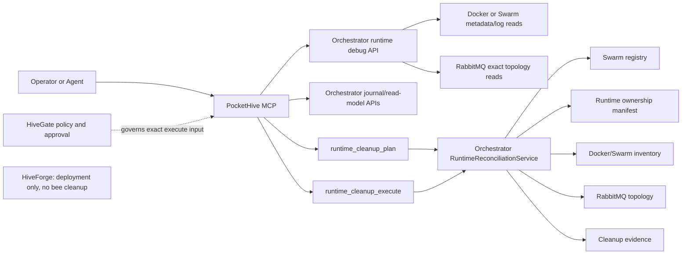

Status: implemented in branch; production HiveGate registration pending

# Runtime Debug MCP Cleanup Spec

## Summary

PocketHive MCP is the agent-facing facade. Orchestrator owns Docker/Swarm
runtime debug and destructive cleanup because it owns swarm desired state, the
swarm registry, runtime manifests, Docker/Swarm inventory, RabbitMQ topology
access, and cleanup evidence.

HiveForge stays deployment-scope only. It must not clean individual bees.

## Ownership

| Concern | Owner | Rule |
| --- | --- | --- |
| Stack deploy/update/remove | HiveForge | Deployment health only |
| Swarm registry and desired state | Orchestrator | Cleanup plans start here |
| Worker topology and worker runtime labels | Swarm Controller | Creates labeled workers |
| Docker/Swarm read-only diagnostics | Orchestrator | Owns Docker socket and runtime log/inspect access |
| RabbitMQ exact topology diagnostics | Orchestrator | Owns manifest/descriptor-based Rabbit reads |
| Journal persistence and read-model APIs | Orchestrator | Owns journal storage/query contracts |
| Agent-facing runtime summaries | `tools/pockethive-mcp` | Composes Orchestrator APIs for agents |
| Cleanup plan/execute | Orchestrator | Single runtime cleanup authority |
| MCP tool surface | `tools/pockethive-mcp` | Agent facade, not runtime authority |
| Cleanup approval/policy | HiveGate | Governs destructive execute in production |
| Cleanup evidence | Orchestrator | MCP must not keep a second evidence authority |

## Runtime Flow



## Hard Rules

| Rule | Why |
| --- | --- |
| Cleanup is always `plan -> execute` | Prevents surprise deletion |
| MCP delegates cleanup to Orchestrator | Keeps one authority path |
| MCP delegates Docker/Swarm runtime debug to Orchestrator | Keeps Docker socket access out of MCP |
| MCP delegates exact Rabbit topology reads to Orchestrator | Prevents queue-name drift |
| MCP fails closed without required Orchestrator runtime APIs | No local Docker cleanup/debug fallback |
| Docker cleanup requires PocketHive labels | Avoids deleting foreign resources |
| RabbitMQ cleanup uses exact manifest/descriptor names | No prefix guessing |
| Registered swarm-controller cleanup uses lifecycle removal | Do not bypass swarm lifecycle |
| Registered swarms are removed only through the canonical `REMOVE` operation | The Controller converges workload disablement before cleanup; no raw live deletion path exists |
| Execute requires `candidateSetHash` | Blocks stale plans |
| Execute requires `idempotencyKey` | Prevents repeat deletion work |
| Running resources require `includeRunning=true` | Makes high-risk cleanup explicit |

## Runtime Labels

Required labels for cleanup candidates:

```text
pockethive.managed=true
pockethive.resourceKind=manager|worker
pockethive.owner=orchestrator|swarm-controller
pockethive.swarmId=<swarmId>
pockethive.runId=<runId>
pockethive.role=<role>
pockethive.instance=<instance>
pockethive.logicalName=<logical runtime name>
pockethive.computeAdapter=DOCKER_SINGLE|SWARM_STACK
pockethive.image=<image>
pockethive.createdAt=<RFC3339 timestamp>
```

Optional:

```text
pockethive.version=<tag parsed from pockethive.image>
pockethive.templateId=<scenario template id>
pockethive.stackName=<swarm stack name>
```

Use `PocketHiveDockerLabels` for label names and values. Do not redeclare these
strings in Java cleanup code.

## Runtime Manifest

The runtime ownership manifest is written during swarm creation/apply. It records
exact owned resources:

| Resource | Examples |
| --- | --- |
| Controller runtime | container/service id, image, role, instance |
| Worker runtimes | container/service ids, images, roles, instances |
| Control queues | controller queue, worker queues |
| Work topology | work queues, work exchange |
| Identity | `swarmId`, `runId`, `templateId`, `computeAdapter` |

If the manifest is missing:

- Docker cleanup may still use exact PocketHive labels.
- RabbitMQ cleanup is blocked with `missing ownership manifest`.

## MCP Tools

Default tool names use underscores. Dotted names are legacy/conceptual unless
`PH_MCP_TOOL_NAME_MODE=legacy` or `both`.

| Tool | Mutates | Purpose |
| --- | --- | --- |
| `runtime_cleanup_plan` | No | Delegates cleanup planning to Orchestrator |
| `runtime_cleanup_execute` | Yes | Executes selected hash-pinned candidates |
| `runtime_tail_worker_logs` | No | Orchestrator-backed bounded logs for worker or manager |
| `runtime_get_worker_version` | No | Orchestrator-backed version from image/labels |
| `runtime_list_workers` | No | Orchestrator-backed manager/worker list |
| `runtime_inspect_worker` | No | Orchestrator-backed bounded inspect summary |
| `runtime_diff_swarm_runtime` | No | Registry/manifest/runtime/Rabbit diff |
| `runtime_control_plane_status` | No | Manifest-provided queues and recent events |
| `runtime_rabbit_topology_snapshot` | No | Orchestrator-backed exact Rabbit resources |
| `runtime_swarm_timeline` | No | Journal/runtime timeline |
| `runtime_manifest_validate` | No | Manifest drift validation |

## Cleanup Inputs

`runtime_cleanup_plan`:

| Field | Required | Notes |
| --- | --- | --- |
| `computeAdapter` | Yes | `DOCKER_SINGLE` or `SWARM_STACK`; never `AUTO` |
| `swarmId` | Yes | Exact swarm id |
| `runId` | No | Omit only for broader high-risk cleanup |
| `includeRunning` | No | Default `false` |
| `includeRabbit` | No | Default `true` |

`runtime_cleanup_execute`:

| Field | Required | Notes |
| --- | --- | --- |
| `computeAdapter` | Yes | Same scope as plan |
| `swarmId` | Yes | Same scope as plan |
| `runId` | No | Same scope as plan |
| `includeRunning` | No | Same scope as plan |
| `includeRabbit` | No | Same scope as plan |
| `candidateSetHash` | Yes | From current plan |
| `candidateIds` | Yes | Execute only selected candidates |
| `idempotencyKey` | Yes | Reuse returns prior evidence |
| `reason` | Yes | Human-readable purpose |
| `actor` | No | Defaults server-side when absent |

REST examples live in `docs/ORCHESTRATOR-REST.md`.

## Cleanup Decision Table

| State | Result | Risk |
| --- | --- | --- |
| Registered swarm with no non-terminal lifecycle operation | `LIFECYCLE_REMOVE_SWARM` candidate | Canonical filesystem-backed remove/abort; remove converges workload to `STOPPED` before cleanup |
| Registered swarm with a non-terminal lifecycle operation | Blocked | The operation coordinator permits only one lifecycle operation |
| Registered controller Docker resource | Blocked | Must use lifecycle |
| Unregistered stopped labeled runtime in requested `swarmId`/`runId` | Docker candidate | Orphan cleanup |
| Unregistered swarm with ownership-manifest Rabbit resources | Rabbit candidate | Exact manifest names only |
| Running labeled runtime, `includeRunning=false` | Blocked | None executed |
| Running labeled runtime, `includeRunning=true` | Candidate | High |
| Worker control queue for running worker, `includeRunning=false` | Not a candidate | Protected |
| Queue has messages or consumers | Candidate only if otherwise allowed | High |
| Active swarm shared work queue/exchange | Blocked | Protected |
| Missing Rabbit manifest | Rabbit cleanup blocked | No guessing |
| Missing required PocketHive labels | Blocked or ignored | No deletion |
| Foreign/unmanaged resource | Ignored or advisory diagnostic | No deletion |
| Candidate hash changed before execute | Reject execute | No mutation |
| Same idempotency key and same input | Return prior evidence | No repeat mutation |

Registered swarms stay on the operation path. Runtime cleanup may abort a
pre-ready swarm or remove a running/stopped swarm through `LIFECYCLE_REMOVE_SWARM`.
The remove operation first sets workload intent to `STOPPED` and converges
disablement. Runtime cleanup does not bypass that convergence, operation
ownership, the filesystem request/result contract or terminal evidence.

Unregistered labeled resources are treated as orphans only inside the requested
scope. Docker candidates require `pockethive.managed=true`, exact `swarmId`,
required PocketHive labels, and exact `runId` when supplied. RabbitMQ candidates
still require an ownership manifest; labels do not authorize prefix deletion.

## RabbitMQ Rules

- Delete only exact queues/exchanges from the manifest or control queues derived
  inside Orchestrator from exact worker labels.
- Derive worker control queues with shared control-plane topology descriptors.
- Never delete by prefix or broad RabbitMQ scan.
- MCP runtime tools must not read RabbitMQ directly for topology ownership.
- Deleting a queue removes its bindings; do not add separate binding cleanup
  unless exact binding identity becomes part of the contract.

## Performance Isolation

Runtime debug must have zero scenario-path impact.

- Do not consume from scenario work/control queues.
- Do not publish control/data messages.
- Do not exec into, pause, resume, or mutate workers.
- Logs are finite `tail` reads; no follow/streaming.
- RabbitMQ diagnostics read exact Orchestrator-owned metadata only.
- Debug taps, when used, must use separate temporary queues.
- Agents should not tight-loop diagnostics during benchmark runs; rate-limit via
  client/HiveGate policy.

## Governance

- PocketHive MCP does not approve its own destructive tool.
- Register `runtime_cleanup_execute` behind HiveGate for production use.
- HiveGate policy should bind `swarmId`, `runId`, `includeRunning`,
  `includeRabbit`, `candidateSetHash`,
  `candidateIds`, and `idempotencyKey`.
- No MCP or ChatGPT approval widget is part of this feature. Governance belongs
  in HiveGate or the production control plane that invokes the execute tool.

## Evidence

Orchestrator writes cleanup evidence for execute responses:

```text
actor
idempotencyKey
swarmId
runId
candidateSetHash
candidateIds
resultByCandidate
startedAt
finishedAt
errors
```

Do not store secrets or full unredacted environment variables.

## Verification Scope

Required tests cover:

- Runtime debug rejects missing bodies, `AUTO`/unknown adapters, invalid
  targets, invalid timestamps, and out-of-bound log tails.
- MCP fails closed without Orchestrator cleanup API.
- MCP delegates plan/execute to Orchestrator when available.
- MCP delegates Docker/Swarm list/logs/version/inspect to Orchestrator.
- MCP delegates exact Rabbit topology reads to Orchestrator.
- Incompatible runtime debug capabilities fail only runtime tools.
- Missing manifest blocks RabbitMQ cleanup.
- Active shared RabbitMQ resources are protected.
- Running resources and derived worker control queues obey `includeRunning`.
- Hash mismatch and stale plan reject before mutation.
- Idempotency prevents repeat deletion work.
- Docker container/service and Rabbit queue/exchange removal ports are covered.
- Logs are bounded/redacted and worker/manager version comes from runtime image/labels.
