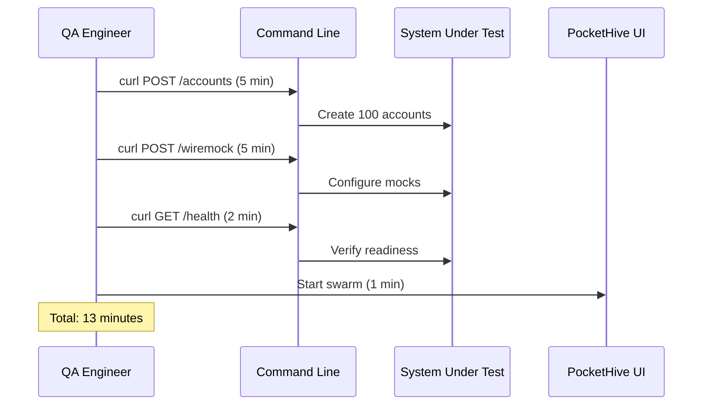
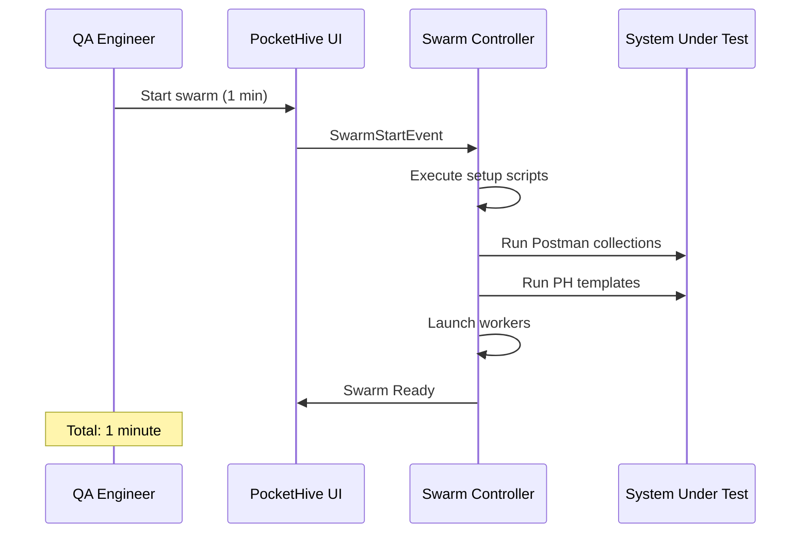
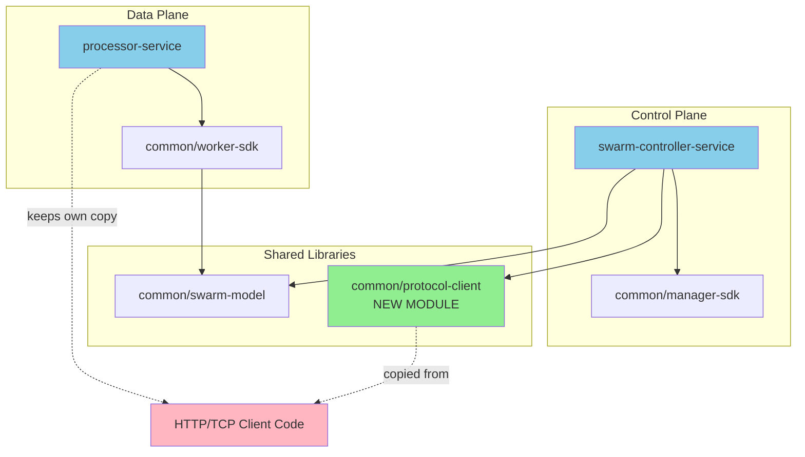
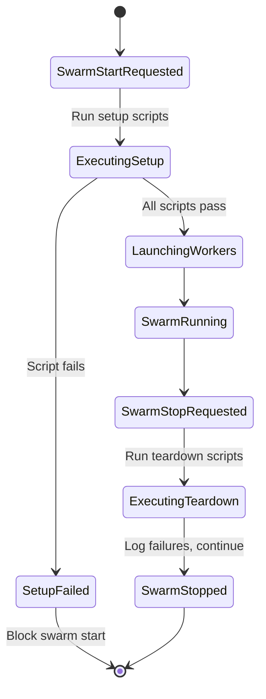
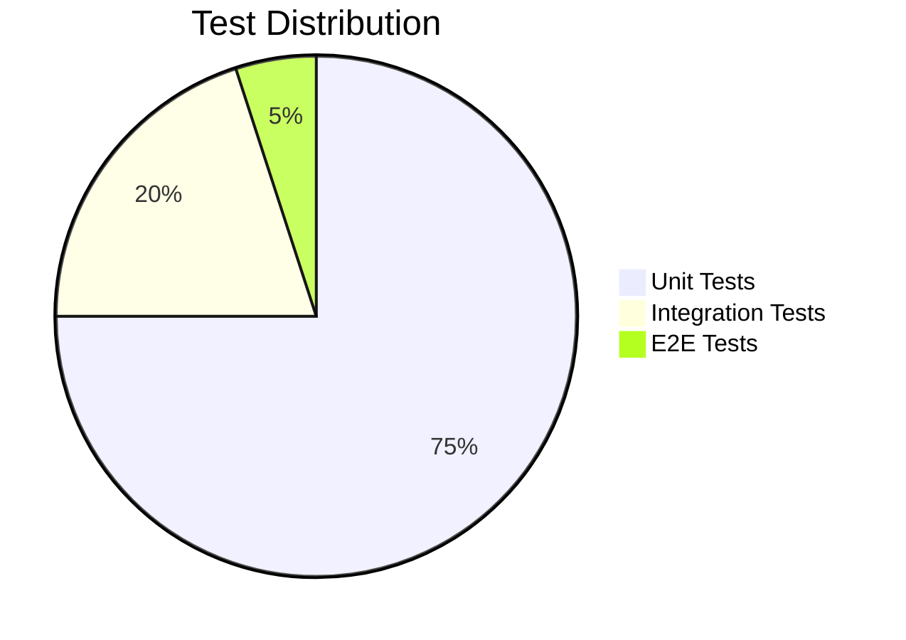
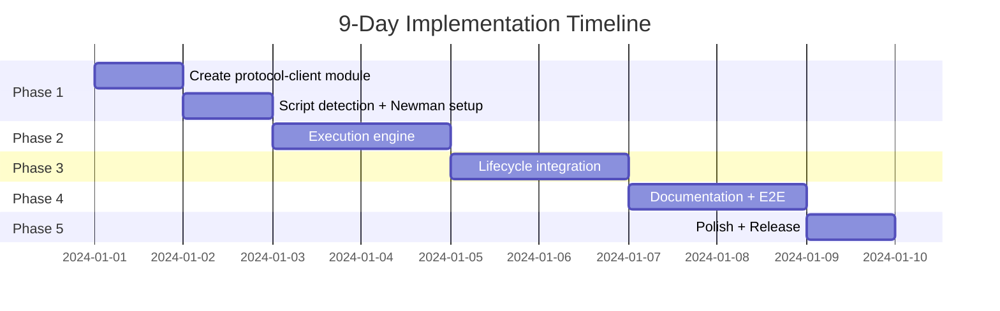
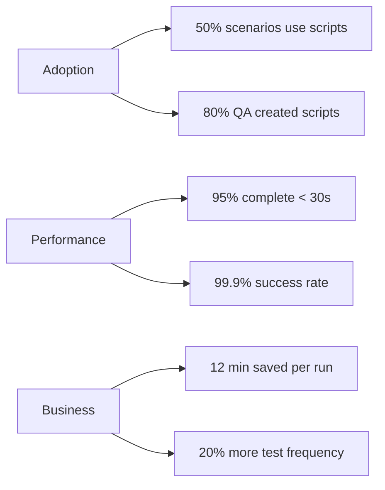

# RFC: Postman Script Execution & Swarm Lifecycle Automation

**Status**: Proposed  
**Target Release**: PocketHive 0.17.x (experimental)  
**Estimated Effort**: 7-9 days  
**Risk Level**: Low

---

## 📋 Executive Summary

Automate swarm setup/teardown by executing Postman collections and PocketHive templates during lifecycle events. This eliminates 15-20 minutes of manual work per test run and prevents "forgot to seed data" failures.

**Value Proposition**: Save 12 minutes per test × 50 tests/week = **10 hours/week** saved across QA team.

---

## 🎯 Problem & Solution

### Current State (Manual)


### Proposed State (Automated)


---

## 🏗️ Architecture

### Module Dependencies


**Key Decision**: Create `common/protocol-client` by **copying** HTTP/TCP code from processor-service. Processor-service remains unchanged (zero risk).

### Lifecycle Flow


---

## 📝 Configuration

### Scenario Configuration
```yaml
id: example-load-test
name: Example Load Test

template:
  image: swarm-controller:latest
  
  lifecycle:
    scriptTimeoutSeconds: 600
    failOnSetupError: true
    environment:
      apiKey: ${EXAMPLE_API_KEY}
      accountCount: 1000
      environment: staging
  
  bees:
    - role: generator
      # ... worker config
```

### Script Structure
```
my-scenario/
  setup-scripts/
    00-health-check.postman.json      # Verify SUT ready
    01-create-accounts.postman.json   # Seed test data
    02-configure-mocks.template.yaml  # Setup WireMock
    setup-env.yaml                    # Variables
  teardown-scripts/
    99-cleanup.postman.json           # Remove test data
```

---

## ✅ Acceptance Criteria (Summary)

### Functional
- ✅ Execute Postman collections via Newman CLI
- ✅ Execute PH templates via shared protocol-client (HTTP + TCP)
- ✅ Auto-detect script type (`.postman.json`, `.template.yaml`)
- ✅ Execute scripts in alphabetical order
- ✅ Block swarm start on setup failure
- ✅ Log teardown failures but continue

### Non-Functional
- ✅ < 5 seconds overhead for empty folder
- ✅ Structured logs + Micrometer metrics
- ✅ SSL verification enabled by default
- ✅ 88% code coverage

---

## 🧪 Testing Strategy



**Coverage Goals**:
- ScriptTypeDetector: 100%
- SetupScriptExecutor: 95%
- NewmanRunner: 90%
- PhTemplateExecutor: 90%
- SwarmLifecycleManager: 85%

---

## 📅 Implementation Plan



### Phase Breakdown
1. **Days 1-2**: Foundation (protocol-client, script detection, Newman)
2. **Days 3-4**: Execution engine (NewmanRunner, PhTemplateExecutor)
3. **Days 5-6**: Lifecycle integration (event listeners, tests)
4. **Days 7-8**: Documentation + E2E tests
5. **Day 9**: Polish + release prep

---

## ⚠️ Risk Assessment

### High Priority Mitigations
| Risk | Mitigation |
|------|------------|
| Newman not available | Fail-fast on startup + health check |
| Secrets in logs | Sanitize patterns (apiKey, password, token) |
| Script folders not mounted | Validate on startup, clear error message |

### Medium Priority
| Risk | Mitigation |
|------|------------|
| Setup takes too long | Document timeout expectations, recommend parallel requests |
| Teams misuse for data-plane | Clear docs: "Lifecycle only, not workload processing" |

---

## 🎯 Success Metrics (3 months post-release)



---

## 🔄 Alternatives Considered

| Option | Verdict | Reason |
|--------|---------|--------|
| Newman + PH Templates | ✅ **Selected** | Best balance: low effort, high value, familiar tools |
| Separate Worker Service | ❌ Rejected | Violates separation of concerns |
| Native Java Parser | ❌ Rejected | 5-7 days extra dev, reinventing wheel |
| Custom DSL | ❌ Rejected | Months of dev, team retraining |
| Bash Scripts | ❌ Rejected | No validation, platform-dependent |
| Ansible | ❌ Rejected | Too heavy, steep learning curve |

---

## 📚 Quick Reference

### Example: Postman Collection
```json
{
  "info": { "name": "Create Test Accounts" },
  "item": [{
    "name": "Create Account",
    "request": {
      "method": "POST",
      "url": "{{baseUrl}}/accounts",
      "body": {
        "raw": "{\"id\": \"{{accountId}}\", \"balance\": 1000}"
      }
    }
  }]
}
```

### Example: PH Template
```yaml
serviceId: default
callId: ConfigureWireMock
method: POST
pathTemplate: /__admin/mappings
bodyTemplate: |
  {
    "request": {"method": "POST", "urlPath": "/payments"},
    "response": {"status": 200, "body": "{\"status\":\"approved\"}"}
  }
```

### Example: Environment Template
```yaml
# SUT endpoints (from SwarmPlan)
baseUrl: "{{ sut.endpoints['default'].baseUrl }}"

# Lifecycle environment (Postman-style)
apiKey: "{{ pm.environment.apiKey }}"
accountCount: "{{ pm.environment.accountCount }}"

# Swarm context
swarmId: "{{ swarmId }}"
timestamp: "{{ eval('#nowIso') }}"
```

---

## 🚀 Recommendation

✅ **Approve for implementation in PocketHive 0.17.x (experimental)**

**Rationale**:
- Low risk (no processor-service changes, battle-tested Newman)
- High value (12 min saved per test run)
- Quick delivery (7-9 days)
- Familiar tools (teams already use Postman)
- Clean architecture (lifecycle in controller, not data plane)

---

**For complete technical details, see the full RFC document.**
