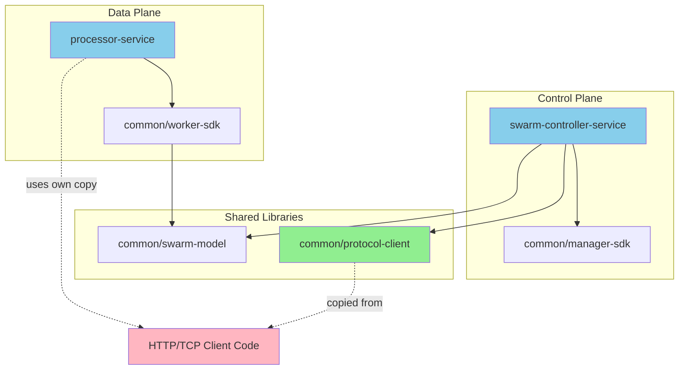

# RFC: Postman Script Execution & Swarm Lifecycle Automation

**Status**: Proposed  
**Author**: Senior Software Architect  
**Date**: 2024  
**Target Release**: PocketHive 0.17.x (experimental)

---

## Executive Summary

This RFC proposes adding Postman collection execution capability to the Swarm Controller to automate setup, teardown, and validation tasks during swarm lifecycle events. This enhancement eliminates manual pre-flight checks, ensures consistent test data provisioning, and provides a familiar scripting interface for QA and operations teams already using Postman.

**Key Benefits:**
- **Reduce manual toil**: Automate 15-20 minutes of manual setup per swarm deployment
- **Improve reliability**: Eliminate human error in test data provisioning
- **Leverage existing skills**: Teams already know Postman - zero learning curve
- **Maintain architectural integrity**: Lifecycle concerns stay in the controller, not the data plane

**Estimated Effort**: 7-9 days  
**Risk Level**: Low (uses battle-tested Newman CLI, no data-plane changes)

---

## Table of Contents

1. [Problem Statement](#problem-statement)
2. [Proposed Solution](#proposed-solution)
3. [Architecture & Design](#architecture--design)
4. [Technology Selection](#technology-selection)
5. [Use Cases](#use-cases)
6. [Acceptance Criteria](#acceptance-criteria)
7. [Testing Strategy](#testing-strategy)
8. [Implementation Plan](#implementation-plan)
9. [Risk Assessment](#risk-assessment)
10. [Alternatives Considered](#alternatives-considered)

---

## Problem Statement

### Current Pain Points

**1. Manual Setup is Error-Prone**
Today, operators must manually:
- Create test accounts in WireMock/SUT before starting swarms
- Configure mock responses for specific scenarios
- Seed databases with test data
- Validate SUT readiness

**Example**: Running the `payments-load-test` scenario requires:
```bash
# Manual steps (15-20 minutes)
curl -X POST http://wiremock:8080/__admin/mappings -d @account-stub.json
curl -X POST http://api:8080/test-data/accounts -d @seed-accounts.json
curl -X GET http://api:8080/health  # verify readiness
# ... then start swarm via UI
```

**2. No Automated Teardown**
After swarm stops:
- Test data pollutes shared environments
- Mock configurations persist across runs
- Manual cleanup required or data accumulates

**3. Inconsistent Validation**
No standardized way to verify:
- SUT is ready before load testing
- Mock configurations are correct
- Test data was created successfully

**4. Tribal Knowledge**
Setup procedures live in:
- Wiki pages (often outdated)
- Slack messages
- Individual team members' heads

### Impact

| Stakeholder | Impact |
|------------|--------|
| **QA Engineers** | 15-20 min manual setup per test run; frequent "forgot to seed data" failures |
| **DevOps** | Support tickets for "swarm not working" due to missing setup |
| **Developers** | Can't reproduce QA issues locally without setup scripts |
| **Product** | Slower iteration cycles; delayed feedback on features |

---

## Proposed Solution

### Overview

Extend the Swarm Controller to execute **setup and teardown scripts** during swarm lifecycle events. Scripts can be:
1. **Postman collections** (executed via Newman CLI)
2. **PocketHive templates** (executed via shared `protocol-client` library supporting HTTP and TCP)

Both types run **synchronously** before/after swarm activation, ensuring deterministic environment state.

**Key Architectural Decision**: Create a new shared `common/protocol-client` module by copying HTTP/TCP client code from `processor-service`. This ensures DRY principles and gives swarm-controller identical protocol handling capabilities without modifying the battle-tested processor-service code. Future optimization can refactor processor-service to use the shared library.

### Why Swarm Controller (Not a Separate Worker)

**Architectural Principle**: Lifecycle concerns belong in the orchestration layer, not the data plane.

```
┌─────────────────────────────────────────────────────────────┐
│ Swarm Controller (Orchestration Layer)                      │
│  ┌──────────────┐    ┌──────────────┐    ┌──────────────┐  │
│  │ Setup Scripts│ →  │ Launch Swarm │ →  │Teardown Scripts│ │
│  │(Postman + PH)│    │   Workers    │    │(Postman + PH)  │ │
│  └──────────────┘    └──────────────┘    └──────────────┘  │
└─────────────────────────────────────────────────────────────┘
                              ↓
┌─────────────────────────────────────────────────────────────┐
│ Data Plane (Worker Pipeline)                                │
│  Generator → Moderator → Processor → Post-Processor         │
└─────────────────────────────────────────────────────────────┘
```

**Rationale**:
- Setup/teardown are **infrequent** (once per swarm lifecycle)
- They need **swarm metadata** (swarmId, config) - controller already has this
- Failure semantics are **lifecycle policies** (block start, log teardown errors)
- No need for **horizontal scaling** or **rate limiting**
- Keeps data plane **focused** on workload processing

---

## Architecture & Design

### Module Dependencies



**Key Points:**
- `common/protocol-client` is **copied** from processor-service (not refactored)
- Processor-service keeps its existing HTTP/TCP code (no changes)
- Swarm-controller uses protocol-client for lifecycle scripts
- Both have identical HTTP/TCP capabilities

### Component Diagram

```
┌─────────────────────────────────────────────────────────────────┐
│ Swarm Controller Container                                      │
│                                                                  │
│  ┌────────────────────────────────────────────────────────┐    │
│  │ SwarmLifecycleManager                                   │    │
│  │  - onSwarmStart(event)                                  │    │
│  │  - onSwarmStop(event)                                   │    │
│  └────────────────┬───────────────────────────────────────┘    │
│                   │                                              │
│                   ↓                                              │
│  ┌────────────────────────────────────────────────────────┐    │
│  │ SetupScriptExecutor                                     │    │
│  │  - runFolder(path, context)                             │    │
│  │  - executeScript(file, env)                             │    │
│  │  - detectScriptType(file)                               │    │
│  └────────┬───────────────────────┬───────────────────────┘    │
│           │                       │                              │
│           ↓                       ↓                              │
│  ┌─────────────────┐    ┌─────────────────────────┐            │
│  │ NewmanRunner    │    │ PhTemplateExecutor      │            │
│  │ (Postman CLI)   │    │ (uses ProtocolClient)   │            │
│  │                 │    │                         │            │
│  └─────────────────┘    └────────┬────────────────┘            │
│                                  │                              │
│                                  ↓                              │
│                         ┌─────────────────┐                    │
│                         │ ProtocolClient  │                    │
│                         │ (HTTP/TCP)      │                    │
│                         └────────┬────────┘                    │
│                                  │                              │
│           └───────────┬───────────┘                              │
│                       ↓                                          │
│                  ┌─────────┐                                     │
│                  │   SUT   │                                     │
│                  │(WireMock│                                     │
│                  │ /Real   │                                     │
│                  │  APIs)  │                                     │
│                  └─────────┘                                     │
└─────────────────────────────────────────────────────────────────┘
```

### Sequence Diagram: Swarm Start with Setup

```
UI          Orchestrator    SwarmController    SetupScriptExecutor    Newman/PH    SUT
│                │                 │                    │                │          │
│ Start Swarm    │                 │                    │                │          │
├───────────────>│                 │                    │                │          │
│                │ SwarmStartEvent │                    │                │          │
│                ├────────────────>│                    │                │          │
│                │                 │ runFolder(setup)   │                │          │
│                │                 ├───────────────────>│                │          │
│                │                 │                    │ 01-accounts.postman.json  │
│                │                 │                    ├───────────────>│          │
│                │                 │                    │                │ POST /accounts
│                │                 │                    │                ├─────────>│
│                │                 │                    │                │ 201 Created
│                │                 │                    │                │<─────────┤
│                │                 │                    │ ✓ Success      │          │
│                │                 │                    │<───────────────┤          │
│                │                 │                    │ 02-seed.template.json     │
│                │                 │                    ├───────────────>│          │
│                │                 │                    │                │ POST /data
│                │                 │                    │                ├─────────>│
│                │                 │                    │                │ 200 OK   │
│                │                 │                    │                │<─────────┤
│                │                 │                    │ ✓ Success      │          │
│                │                 │                    │<───────────────┤          │
│                │                 │ ✓ All scripts OK   │                │          │
│                │                 │<───────────────────┤                │          │
│                │                 │ Launch Workers     │                │          │
│                │                 ├─────────────────>  │                │          │
│                │ Swarm Ready     │                    │                │          │
│                │<────────────────┤                    │                │          │
│ Swarm Running  │                 │                    │                │          │
│<───────────────┤                 │                    │                │          │
```

### File Structure

```
common/
  protocol-client/                            # NEW shared module
    src/main/java/io/pockethive/protocol/
      ProtocolClient.java                      # Interface
      http/
        HttpProtocolClient.java                # HTTP implementation
        HttpClientConfig.java
      tcp/
        TcpProtocolClient.java                 # TCP implementation (all transports)
        TcpTransportType.java                  # SOCKET, NIO, NETTY
        TcpBehavior.java                       # ECHO, REQUEST_RESPONSE, FIRE_FORGET
        TcpClientConfig.java
        socket/
          SocketTcpTransport.java              # Socket implementation
        nio/
          NioTcpTransport.java                 # NIO implementation
        netty/
          NettyTcpTransport.java               # Netty implementation

swarm-controller-service/
  src/main/java/io/pockethive/swarmcontroller/
    lifecycle/
      SwarmLifecycleManager.java               # Event listeners
      SetupScriptExecutor.java                 # Core execution logic
      NewmanRunner.java                        # Postman CLI wrapper
      PhTemplateExecutor.java                  # PH template executor (uses ProtocolClient)
      ScriptTypeDetector.java                  # File type detection
    config/
      LifecycleProperties.java                 # Configuration binding
  src/main/resources/
    application.yml                            # Default config
  src/test/java/
    lifecycle/
      SetupScriptExecutorTest.java             # Unit tests
      SwarmLifecycleIntegrationTest.java       # Integration tests

processor-service/
  # Now depends on common/protocol-client
  # HTTP/TCP code moved to shared module

Scenario bundle structure:
  /app/scenario/setup-scripts/                 # From scenario bundle
    01-create-accounts.postman.json
    02-seed-data.template.json
    setup-env.yaml
  /app/scenario/teardown-scripts/
    99-cleanup.postman.json
    teardown-env.yaml
```

### Configuration Schema

**Application Defaults** (`application.yml` - Swarm Controller):
```yaml
pockethive:
  control-plane:
    swarm-controller:
      lifecycle:
        setup-folder: /app/scenario/setup-scripts      # Default path in scenario bundle
        teardown-folder: /app/scenario/teardown-scripts
        fail-on-setup-error: true                      # Block swarm start if setup fails
        fail-on-teardown-error: false                  # Log but continue if teardown fails
        script-timeout-seconds: 300                    # Per-script timeout
        newman:
          reporters: [cli, json]                       # Newman output formats
          bail: true                                   # Stop on first failure
          insecure: false                              # SSL verification
```

**Scenario Configuration** (`scenario.yaml` - Per-scenario overrides):
```yaml
id: example-load-test
name: Example Load Test
description: Example load test with automated setup/teardown

template:
  image: swarm-controller:latest
  
  # Lifecycle configuration (NEW - added by this RFC)
  lifecycle:
    scriptTimeoutSeconds: 600                      # Override default 300s
    failOnSetupError: true                         # Explicit (matches default)
    
    # Environment variables for setup/teardown scripts
    environment:
      apiKey: ${EXAMPLE_API_KEY}                   # From environment
      accountCount: 1000                           # Scenario-specific
      environment: staging
  
  bees:
    - role: generator
      image: generator:latest
      config:
        inputs:
          scheduler:
            ratePerSec: 100
      work:
        out:
          out: genQ
    # ... other bees
```

**How it works**:
1. Swarm Controller reads defaults from `application.yml`
2. Orchestrator passes scenario-specific config from `scenario.yaml` (under `template.lifecycle`)
3. Controller merges: scenario config overrides defaults
4. Environment variables in scenario config (e.g., `${EXAMPLE_API_KEY}`) are resolved at runtime
5. Template context includes swarm metadata and lifecycle environment

### Script Type Detection Logic

```java
public enum ScriptType {
  POSTMAN,      // Execute via Newman
  PH_TEMPLATE,  // Execute via request-builder → processor
  ENVIRONMENT   // Skip (used for variable injection)
}

public ScriptType detectScriptType(Path file) {
  String filename = file.getFileName().toString();
  
  // 1. Skip environment files
  if (filename.endsWith("-env.yaml") || filename.endsWith("-env.json")) {
    return ScriptType.ENVIRONMENT;
  }
  
  // 2. YAML is always PH template
  if (filename.endsWith(".yaml") || filename.endsWith(".yml")) {
    return ScriptType.PH_TEMPLATE;
  }
  
  // 3. JSON: check naming convention first
  if (filename.endsWith(".json")) {
    if (filename.contains(".postman.")) {
      return ScriptType.POSTMAN;
    }
    if (filename.contains(".template.")) {
      return ScriptType.PH_TEMPLATE;
    }
    
    // 4. Fallback: inspect content
    JsonNode root = objectMapper.readTree(file.toFile());
    if (root.has("info") && root.has("item")) {
      log.warn("Postman collection without .postman. suffix: {}", filename);
      return ScriptType.POSTMAN;
    }
    if (root.has("serviceId") && root.has("callId")) {
      log.warn("PH template without .template. suffix: {}", filename);
      return ScriptType.PH_TEMPLATE;
    }
    
    throw new IllegalArgumentException("Unknown JSON format: " + filename);
  }
  
  throw new IllegalArgumentException("Unsupported file type: " + filename);
}
```

---

## Technology Selection

### Newman CLI

**What**: Official Postman command-line collection runner  
**License**: Apache 2.0 (permissive, commercial-friendly)  
**Maturity**: Production-ready, 10+ years, 6.5k+ GitHub stars  
**Maintained**: Active development by Postman Inc.

#### Why Newman?

| Criterion | Assessment |
|-----------|------------|
| **License Compatibility** | ✅ Apache 2.0 - same as Kubernetes, Kafka, Android. No copyleft restrictions. |
| **Feature Completeness** | ✅ Full Postman feature parity: pre-request scripts, tests, variables, assertions |
| **Battle-Tested** | ✅ Used by thousands of enterprises (Stripe, Shopify, Microsoft documented users) |
| **Maintenance** | ✅ Active releases, security patches, LTS support |
| **Integration Effort** | ✅ Simple CLI wrapper - no complex APIs |
| **Team Familiarity** | ✅ QA teams already use Postman - zero training needed |

#### License Deep Dive

**Apache 2.0 Key Terms**:
- ✅ Commercial use allowed
- ✅ Modification allowed
- ✅ Distribution allowed
- ✅ Patent grant included (protects against patent trolling)
- ✅ No copyleft (unlike GPL - don't need to open-source PocketHive)
- ✅ Can bundle in proprietary software

**Comparison to Other Licenses**:

| License | Commercial Use | Must Open-Source Your Code | Patent Protection |
|---------|----------------|---------------------------|-------------------|
| Apache 2.0 (Newman) | ✅ Yes | ❌ No | ✅ Yes |
| MIT | ✅ Yes | ❌ No | ⚠️ Implicit only |
| BSD | ✅ Yes | ❌ No | ⚠️ Implicit only |
| GPL v3 | ✅ Yes | ✅ Yes (copyleft) | ✅ Yes |

**Verdict**: Apache 2.0 is **ideal** for enterprise use. It's as permissive as MIT but with explicit patent protection.

#### Newman vs. Alternatives

| Option | Pros | Cons | Verdict |
|--------|------|------|---------|
| **Newman CLI** | Battle-tested, full Postman parity, Apache 2.0 | Requires Node.js runtime | ✅ **Recommended** |
| **Native Java Parser** | No external dependencies | 5-7 days extra dev, must reimplement JS engine | ❌ Reinventing wheel |
| **REST Assured** | Java-native | Different syntax, team retraining needed | ❌ Adds learning curve |
| **Custom DSL** | Full control | Months of dev, maintenance burden | ❌ Not core business value |

#### Newman Installation

**Bake into Docker image:**
```dockerfile
FROM eclipse-temurin:21-jre-alpine
RUN apk add --no-cache nodejs npm && \
    npm install -g newman@6.1.1
COPY target/swarm-controller-service.jar /app/app.jar
ENTRYPOINT ["java", "-jar", "/app/app.jar"]
```

---

## Use Cases

### Use Case 1: Automated Test Data Provisioning

**Actor**: QA Engineer  
**Goal**: Start a load test with pre-seeded accounts

**Current Workflow** (Manual):
```bash
# 1. Create test accounts (5 min)
for i in {1..100}; do
  curl -X POST http://api:8080/accounts -d "{\"id\":\"test-$i\"}"
done

# 2. Configure WireMock stubs (5 min)
curl -X POST http://wiremock:8080/__admin/mappings -d @payment-stub.json

# 3. Verify setup (2 min)
curl http://api:8080/accounts/test-1  # Check account exists

# 4. Start swarm via UI (1 min)
# Total: 13 minutes
```

**New Workflow** (Automated):
```bash
# 1. Place scripts in scenario bundle
my-scenario/
  setup-scripts/
    01-create-accounts.postman.json    # Creates 100 accounts
    02-configure-mocks.postman.json    # Sets up WireMock
    setup-env.yaml                     # Variables
  teardown-scripts/
    99-cleanup.postman.json

# 2. Start swarm via UI (1 min)
# Scenario bundle mounted to /app/scenario/
# Setup runs automatically from /app/scenario/setup-scripts/
# Total: 1 minute
```

**Postman Collection Example** (`01-create-accounts.postman.json`):
```json
{
  "info": { "name": "Create Test Accounts" },
  "item": [
    {
      "name": "Create Account",
      "event": [
        {
          "listen": "prerequest",
          "script": {
            "exec": [
              "pm.variables.set('accountId', 'test-' + pm.iterationData.get('index'));"
            ]
          }
        },
        {
          "listen": "test",
          "script": {
            "exec": [
              "pm.test('Account created', function() {",
              "  pm.response.to.have.status(201);",
              "});"
            ]
          }
        }
      ],
      "request": {
        "method": "POST",
        "url": "{{baseUrl}}/accounts",
        "body": {
          "mode": "raw",
          "raw": "{\"id\": \"{{accountId}}\", \"balance\": 1000}"
        }
      }
    }
  ]
}
```

**Environment Template** (`setup-env.yaml` in scenario bundle):
```yaml
# Access SUT endpoints (from SwarmPlan.sutEnvironment)
baseUrl: "{{ sut.endpoints['default'].baseUrl }}"
wiremockUrl: "{{ sut.endpoints['wiremock'].baseUrl }}"

# Access lifecycle environment (Postman-style)
apiKey: "{{ pm.environment.apiKey }}"
accountCount: "{{ pm.environment.accountCount }}"
environment: "{{ pm.environment.environment }}"

# Swarm context (injected by controller)
swarmId: "{{ swarmId }}"
accountPrefix: "swarm-{{ swarmId }}-"
timestamp: "{{ eval('#nowIso') }}"
```

**Value**: Saves 12 minutes per test run, eliminates "forgot to seed data" failures.

---

### Use Case 2: Mock Configuration Management

**Actor**: Developer  
**Goal**: Configure WireMock stubs specific to a scenario

**Scenario**: Testing payment retry logic requires specific HTTP error responses.

**Setup Script** (`02-configure-payment-mocks.postman.json`):
```json
{
  "info": { "name": "Configure Payment Mocks" },
  "item": [
    {
      "name": "Stub: Payment Timeout",
      "request": {
        "method": "POST",
        "url": "{{wiremockUrl}}/__admin/mappings",
        "body": {
          "mode": "raw",
          "raw": "{\n  \"request\": {\n    \"method\": \"POST\",\n    \"urlPath\": \"/payments\"\n  },\n  \"response\": {\n    \"status\": 504,\n    \"fixedDelayMilliseconds\": 30000\n  },\n  \"scenarioName\": \"payment-retry\",\n  \"requiredScenarioState\": \"Started\",\n  \"newScenarioState\": \"Timeout\"\n}"
        }
      }
    },
    {
      "name": "Stub: Payment Success After Retry",
      "request": {
        "method": "POST",
        "url": "{{wiremockUrl}}/__admin/mappings",
        "body": {
          "mode": "raw",
          "raw": "{\n  \"request\": {\n    \"method\": \"POST\",\n    \"urlPath\": \"/payments\"\n  },\n  \"response\": {\n    \"status\": 200,\n    \"body\": \"{\\\"status\\\":\\\"approved\\\"}\"\n  },\n  \"scenarioName\": \"payment-retry\",\n  \"requiredScenarioState\": \"Timeout\"\n}"
        }
      }
    }
  ]
}
```

**Teardown Script** (`99-reset-wiremock.postman.json`):
```json
{
  "info": { "name": "Reset WireMock" },
  "item": [
    {
      "name": "Delete All Mappings",
      "request": {
        "method": "DELETE",
        "url": "{{wiremockUrl}}/__admin/mappings"
      }
    },
    {
      "name": "Reset Scenarios",
      "request": {
        "method": "POST",
        "url": "{{wiremockUrl}}/__admin/scenarios/reset"
      }
    }
  ]
}
```

**Value**: Ensures clean mock state per swarm, prevents cross-contamination between test runs.

---

### Use Case 3: SUT Health Validation

**Actor**: DevOps Engineer  
**Goal**: Verify SUT is ready before starting load test

**Setup Script** (`00-health-check.postman.json`):
```json
{
  "info": { "name": "SUT Health Check" },
  "item": [
    {
      "name": "Check API Health",
      "event": [
        {
          "listen": "test",
          "script": {
            "exec": [
              "pm.test('API is healthy', function() {",
              "  pm.response.to.have.status(200);",
              "  pm.expect(pm.response.json().status).to.eql('UP');",
              "});"
            ]
          }
        }
      ],
      "request": {
        "method": "GET",
        "url": "{{baseUrl}}/health"
      }
    },
    {
      "name": "Check Database Connection",
      "event": [
        {
          "listen": "test",
          "script": {
            "exec": [
              "pm.test('Database is reachable', function() {",
              "  pm.response.to.have.status(200);",
              "  pm.expect(pm.response.json().components.db.status).to.eql('UP');",
              "});"
            ]
          }
        }
      ],
      "request": {
        "method": "GET",
        "url": "{{baseUrl}}/health/db"
      }
    }
  ]
}
```

**Behavior**:
- If health check fails → Swarm start is **blocked**
- Controller logs: `Setup failed: SUT health check failed (API returned 503)`
- UI shows: `Swarm start failed: Setup scripts failed. Check controller logs.`

**Value**: Prevents wasted load test runs against unhealthy systems, faster feedback.

---

### Use Case 4: Mixed Postman + PH Templates

**Actor**: QA Engineer  
**Goal**: Use Postman for complex multi-step setup, PH templates for simple calls

**Folder Structure**:
```
my-scenario/
  setup-scripts/
    01-oauth-token.postman.json        # Complex: Get token, store in variable
    02-create-session.template.yaml    # Simple: Single HTTP call
    03-seed-data.postman.json          # Complex: Loop through CSV data
```

**Why Mix?**
- **Postman**: Best for multi-step flows with variables, loops, assertions
- **PH Templates**: Best for simple single-request calls with PocketHive's template syntax

**Example PH Template** (`02-create-session.template.yaml`):
```yaml
serviceId: default
callId: CreateSession
method: POST
pathTemplate: /sessions
bodyTemplate: |
  {
    "swarmId": "{{ swarmId }}",
    "timestamp": "{{ eval('#nowIso') }}",
    "token": "{{ headers['x-oauth-token'] }}"
  }
headersTemplate:
  Content-Type: application/json
  Authorization: "Bearer {{ headers['x-oauth-token'] }}"
```

**Value**: Flexibility - use the right tool for each task.

---

### Use Case 5: Environment-Specific Configuration

**Actor**: DevOps Engineer  
**Goal**: Run same scenario against dev/staging/prod with different configs

**Environment Template** (`setup-env.yaml`):
```yaml
# Rendered at runtime with swarm context
# Access SUT endpoints (from SwarmPlan.sutEnvironment)
baseUrl: "{{ sut.endpoints['default'].baseUrl }}"
wiremockUrl: "{{ sut.endpoints['wiremock'].baseUrl }}"

# Access lifecycle environment (Postman-style)
apiKey: "{{ pm.environment.apiKey }}"
environment: "{{ pm.environment.environment }}"
dataPrefix: "{{ pm.environment.environment }}-{{ swarmId }}-"
accountCount: "{{ pm.environment.accountCount }}"
```

**Scenario Config** (`scenario.yaml`):
```yaml
# Dev scenario (separate file per environment)
id: example-dev
name: Example Dev Load Test
description: Development environment load test

template:
  image: swarm-controller:latest
  lifecycle:
    environment:
      environment: dev
      accountCount: 100
  bees:
    - role: generator
      image: generator:latest
      # ... config

---
# Prod scenario (separate file: example-prod/scenario.yaml)
id: example-prod
name: Example Prod Load Test
description: Production environment load test

template:
  image: swarm-controller:latest
  lifecycle:
    environment:
      environment: prod
      accountCount: 10000
  bees:
    - role: generator
      image: generator:latest
      # ... config
```

**Note**: SUT endpoints are configured separately via Orchestrator and passed in SwarmPlan.sutEnvironment, not in scenario.yaml.

**Value**: Single script set works across all environments, no duplication.


---

## Acceptance Criteria

### Functional Requirements

#### FR1: Postman Collection Execution
- [ ] **Given** a Postman collection in `/app/scenario/setup-scripts/01-test.postman.json`
- [ ] **When** swarm starts
- [ ] **Then** Newman executes the collection against the configured SUT
- [ ] **And** collection results are logged to controller logs
- [ ] **And** swarm start proceeds if collection passes

#### FR2: PH Template Execution
- [ ] **Given** a PH template in `/app/scenario/setup-scripts/02-test.template.yaml`
- [ ] **When** swarm starts
- [ ] **Then** template is rendered with swarm context
- [ ] **And** HTTP/TCP request is sent via shared `ProtocolClient` (supports all processor-service capabilities)
- [ ] **And** swarm start proceeds if request succeeds (2xx/3xx for HTTP, successful response for TCP)

#### FR3: Script Type Detection
- [ ] **Given** a file named `test.postman.json`
- [ ] **Then** it is executed via Newman
- [ ] **Given** a file named `test.template.json`
- [ ] **Then** it is executed via PH template pipeline
- [ ] **Given** a file named `test.yaml`
- [ ] **Then** it is executed via PH template pipeline
- [ ] **Given** a file named `test.json` (no suffix)
- [ ] **Then** content is inspected to determine type
- [ ] **And** warning is logged if naming convention not followed

#### FR4: Execution Order
- [ ] **Given** scripts named `01-a.json`, `03-c.json`, `02-b.json`
- [ ] **When** folder is executed
- [ ] **Then** scripts run in order: `01-a`, `02-b`, `03-c`

#### FR5: Environment Variable Injection
- [ ] **Given** `setup-env.yaml` exists in script folder
- [ ] **When** scripts execute
- [ ] **Then** environment is rendered with swarm context (swarmId, config, timestamp)
- [ ] **And** rendered variables are passed to Newman via `--env-var`
- [ ] **And** rendered variables are available in PH template context

#### FR6: Setup Failure Handling
- [ ] **Given** setup script fails (non-2xx response or Newman failure)
- [ ] **When** swarm start is triggered
- [ ] **Then** swarm start is **blocked**
- [ ] **And** error is logged with script name and failure reason
- [ ] **And** UI shows "Swarm start failed: Setup scripts failed"
- [ ] **And** no worker containers are launched

#### FR7: Teardown Failure Handling
- [ ] **Given** teardown script fails
- [ ] **When** swarm stop is triggered
- [ ] **Then** failure is **logged** but swarm stop continues
- [ ] **And** remaining teardown scripts still execute
- [ ] **And** swarm is marked as stopped

#### FR8: Timeout Protection
- [ ] **Given** a script takes longer than `script-timeout-seconds`
- [ ] **When** script executes
- [ ] **Then** execution is terminated
- [ ] **And** treated as failure (blocks setup, logs teardown)

#### FR9: Configuration Override
- [ ] **Given** scenario.yaml contains `template.lifecycle.scriptTimeoutSeconds: 600`
- [ ] **Then** controller uses 600 seconds instead of default 300
- [ ] **Given** scenario.yaml contains `template.lifecycle.failOnSetupError: false`
- [ ] **Then** setup failures are logged but don't block swarm start
- [ ] **Given** scenario.yaml contains `template.lifecycle.environment.apiKey`
- [ ] **Then** value is available in setup-env.yaml as `{{ pm.environment.apiKey }}`
- [ ] **Given** SwarmPlan contains `sutEnvironment.endpoints['default'].baseUrl`
- [ ] **Then** value is available in setup-env.yaml as `{{ sut.endpoints['default'].baseUrl }}`

#### FR10: Empty Folder Handling
- [ ] **Given** setup folder is empty or doesn't exist
- [ ] **When** swarm starts
- [ ] **Then** no error occurs, swarm starts normally
- [ ] **And** info log: "No setup scripts found, skipping"

### Non-Functional Requirements

#### NFR1: Performance
- [ ] Setup script execution adds < 5 seconds overhead for empty folder
- [ ] Newman execution time = collection execution time + < 1 second overhead
- [ ] PH template execution time = HTTP request time + < 500ms overhead

#### NFR2: Observability
- [ ] Each script execution emits structured log with: script name, type, duration, result
- [ ] Micrometer metrics: `ph_lifecycle_script_executions_total{type, result}`
- [ ] Micrometer timer: `ph_lifecycle_script_duration_seconds{type, script}`
- [ ] Controller status includes: `setupScriptsExecuted`, `setupDuration`, `lastSetupResult`

#### NFR3: Security
- [ ] Newman SSL verification enabled by default (`insecure: false`)
- [ ] Script files are read-only (mounted volumes should use `:ro`)
- [ ] No script output contains secrets (sanitize logs)
- [ ] Environment variables support `${ENV_VAR}` syntax for secrets

#### NFR4: Reliability
- [ ] Script execution is idempotent (can retry safely)
- [ ] Partial setup failure doesn't leave swarm in inconsistent state
- [ ] Teardown runs even if swarm crashed (best-effort cleanup)

#### NFR5: Maintainability
- [ ] Script type detection logic has 100% unit test coverage
- [ ] Integration tests cover all script types (Postman, PH template, mixed)
- [ ] Error messages include actionable guidance (e.g., "Check script syntax")

---

## Testing Strategy

### Testing Pyramid

```
                    ▲
                   ╱ ╲
                  ╱   ╲
                 ╱ E2E ╲              2 tests (5%)
                ╱───────╲
               ╱         ╲
              ╱Integration╲           8 tests (20%)
             ╱─────────────╲
            ╱               ╲
           ╱  Unit Tests     ╲       30 tests (75%)
          ╱───────────────────╲
         ╱                     ╲
        ╱_______________________╲
```

### Unit Tests (30 tests, ~75% coverage)

**ScriptTypeDetectorTest** (10 tests)
```java
@Test
void detectPostmanByNamingConvention() {
  Path file = Path.of("test.postman.json");
  assertEquals(ScriptType.POSTMAN, detector.detectScriptType(file));
}

@Test
void detectPhTemplateByNamingConvention() {
  Path file = Path.of("test.template.json");
  assertEquals(ScriptType.PH_TEMPLATE, detector.detectScriptType(file));
}

@Test
void detectPhTemplateFromYaml() {
  Path file = Path.of("test.yaml");
  assertEquals(ScriptType.PH_TEMPLATE, detector.detectScriptType(file));
}

@Test
void detectPostmanByContentInspection() {
  // File: test.json (no suffix)
  // Content: {"info": {...}, "item": [...]}
  assertEquals(ScriptType.POSTMAN, detector.detectScriptType(file));
}

@Test
void detectPhTemplateByContentInspection() {
  // File: test.json (no suffix)
  // Content: {"serviceId": "...", "callId": "..."}
  assertEquals(ScriptType.PH_TEMPLATE, detector.detectScriptType(file));
}

@Test
void skipEnvironmentFiles() {
  Path file = Path.of("setup-env.yaml");
  assertEquals(ScriptType.ENVIRONMENT, detector.detectScriptType(file));
}

@Test
void throwsOnUnknownJsonFormat() {
  // File: test.json with neither Postman nor PH structure
  assertThrows(IllegalArgumentException.class, 
    () -> detector.detectScriptType(file));
}

@Test
void throwsOnUnsupportedFileType() {
  Path file = Path.of("test.txt");
  assertThrows(IllegalArgumentException.class,
    () -> detector.detectScriptType(file));
}

@Test
void logsWarningWhenNamingConventionNotFollowed() {
  // Postman collection named test.json (no .postman. suffix)
  detector.detectScriptType(file);
  verify(logger).warn(contains("without .postman. suffix"));
}

@Test
void logsWarningForPhTemplateWithoutSuffix() {
  // PH template named test.json (no .template. suffix)
  detector.detectScriptType(file);
  verify(logger).warn(contains("without .template. suffix"));
}
```

**SetupScriptExecutorTest** (12 tests)
```java
@Test
void executesScriptsInAlphabeticalOrder() {
  // Given: 03-c.json, 01-a.json, 02-b.json
  executor.runFolder("/test", context);
  // Then: verify execution order a → b → c
  InOrder inOrder = inOrder(newmanRunner, phExecutor);
  inOrder.verify(newmanRunner).run(contains("01-a"));
  inOrder.verify(newmanRunner).run(contains("02-b"));
  inOrder.verify(phExecutor).execute(contains("03-c"));
}

@Test
void skipsEnvironmentFiles() {
  // Given: setup-env.yaml in folder
  executor.runFolder("/test", context);
  // Then: env file not executed, only used for variables
  verify(newmanRunner, never()).run(contains("env"));
  verify(phExecutor, never()).execute(contains("env"));
}

@Test
void rendersEnvironmentTemplate() {
  // Given: setup-env.yaml with "{{ swarmId }}"
  Map<String, Object> context = Map.of("swarmId", "test-123");
  executor.runFolder("/test", context);
  // Then: rendered env passed to Newman
  verify(newmanRunner).run(any(), argThat(env -> 
    env.get("swarmId").equals("test-123")));
}

@Test
void blocksSwarmStartOnSetupFailure() {
  // Given: setup script returns 500
  when(newmanRunner.run(any(), any())).thenReturn(failureResult());
  // Then: throws exception
  assertThrows(SetupFailedException.class,
    () -> executor.runFolder("/setup", context));
}

@Test
void continuesOnTeardownFailure() {
  // Given: teardown script fails
  when(newmanRunner.run(any(), any())).thenReturn(failureResult());
  // Then: no exception, just logs
  assertDoesNotThrow(() -> executor.runFolder("/teardown", context));
  verify(logger).warn(contains("Teardown script failed"));
}

@Test
void executesRemainingTeardownScriptsAfterFailure() {
  // Given: 01-fail.json, 02-success.json
  when(newmanRunner.run(contains("01"), any())).thenReturn(failureResult());
  when(newmanRunner.run(contains("02"), any())).thenReturn(successResult());
  executor.runFolder("/teardown", context);
  // Then: both executed
  verify(newmanRunner, times(2)).run(any(), any());
}

@Test
void terminatesScriptOnTimeout() {
  // Given: script-timeout-seconds = 5
  // When: script takes 10 seconds
  // Then: execution terminated, treated as failure
  assertThrows(SetupFailedException.class,
    () -> executor.runFolder("/setup", context));
}

@Test
void handlesEmptyFolder() {
  // Given: empty folder
  executor.runFolder("/empty", context);
  // Then: no error, info log
  verify(logger).info(contains("No setup scripts found"));
}

@Test
void handlesMissingFolder() {
  // Given: folder doesn't exist
  executor.runFolder("/nonexistent", context);
  // Then: no error, info log
  verify(logger).info(contains("Setup folder not found"));
}

@Test
void emitsMetricsForEachScript() {
  executor.runFolder("/test", context);
  verify(meterRegistry).counter("ph_lifecycle_script_executions_total",
    "type", "postman", "result", "success");
  verify(meterRegistry).timer("ph_lifecycle_script_duration_seconds",
    "type", "postman", "script", "01-test.postman.json");
}

@Test
void sanitizesSecretsInLogs() {
  // Given: script output contains "apiKey: secret123"
  executor.runFolder("/test", context);
  // Then: logs show "apiKey: ***"
  verify(logger).info(argThat(msg -> 
    !msg.contains("secret123") && msg.contains("***")));
}

@Test
void supportsConfigurationOverride() {
  // Given: fail-on-setup-error = false
  properties.setFailOnSetupError(false);
  when(newmanRunner.run(any(), any())).thenReturn(failureResult());
  // Then: no exception
  assertDoesNotThrow(() -> executor.runFolder("/setup", context));
}
```

**NewmanRunnerTest** (4 tests)
```java
@Test
void executesNewmanCli() {
  runner.run("/test/collection.json", Map.of("baseUrl", "http://test"));
  verify(processExecutor).execute(argThat(cmd ->
    cmd.contains("newman") &&
    cmd.contains("run") &&
    cmd.contains("collection.json") &&
    cmd.contains("--env-var") &&
    cmd.contains("baseUrl=http://test")));
}

@Test
void parsesNewmanJsonOutput() {
  // Given: Newman outputs JSON summary
  String output = "{\"run\":{\"stats\":{\"assertions\":{\"failed\":0}}}}";
  NewmanResult result = runner.parseOutput(output);
  assertTrue(result.isSuccess());
}

@Test
void detectsNewmanFailure() {
  String output = "{\"run\":{\"stats\":{\"assertions\":{\"failed\":2}}}}";
  NewmanResult result = runner.parseOutput(output);
  assertFalse(result.isSuccess());
  assertEquals(2, result.getFailedAssertions());
}

@Test
void respectsSslVerificationConfig() {
  properties.setNewmanInsecure(true);
  runner.run("/test/collection.json", Map.of());
  verify(processExecutor).execute(argThat(cmd ->
    cmd.contains("--insecure")));
}
```

**PhTemplateExecutorTest** (4 tests)
```java
@Test
void rendersTemplateWithContext() {
  Map<String, Object> context = Map.of("swarmId", "test-123");
  executor.execute("/test/template.yaml", context);
  verify(templateRenderer).render(any(), argThat(ctx ->
    ctx.get("swarmId").equals("test-123")));
}

**PhTemplateExecutorTest** (4 tests)
```java
@Test
void rendersTemplateWithContext() {
  Map<String, Object> context = Map.of("swarmId", "test-123");
  executor.execute("/test/template.yaml", context);
  verify(templateRenderer).render(any(), argThat(ctx ->
    ctx.get("swarmId").equals("test-123")));
}

@Test
void sendsHttpRequestViaProtocolClient() {
  executor.execute("/test/http-template.yaml", Map.of());
  verify(protocolClient).execute(argThat(req ->
    req.getUrl().equals("http://wiremock:8080/api/test") &&
    req.getMethod().equals(HttpMethod.POST)));
}

@Test
void sendsTcpRequestViaProtocolClient() {
  executor.execute("/test/tcp-template.yaml", Map.of());
  verify(protocolClient).execute(argThat(req ->
    req.getProtocol().equals("TCP") &&
    req.getBehavior().equals(TcpBehavior.REQUEST_RESPONSE)));
}

@Test
void returnsSuccessFor2xxResponse() {
  when(protocolClient.execute(any()))
    .thenReturn(ProtocolResponse.success("response"));
  PhTemplateResult result = executor.execute("/test/template.yaml", Map.of());
  assertTrue(result.isSuccess());
}

@Test
void returnsFailureForErrorResponse() {
  when(protocolClient.execute(any()))
    .thenReturn(ProtocolResponse.failure(500, "error"));
  PhTemplateResult result = executor.execute("/test/template.yaml", Map.of());
  assertFalse(result.isSuccess());
}
```
```

### Integration Tests (8 tests, ~20% coverage)

**SwarmLifecycleIntegrationTest** (8 tests)
```java
@SpringBootTest
@Testcontainers
class SwarmLifecycleIntegrationTest {
  
  @Container
  static GenericContainer<?> wiremock = new GenericContainer<>("wiremock/wiremock:latest")
    .withExposedPorts(8080);
  
  @Test
  void executesPostmanSetupBeforeSwarmStart() {
    // Given: Postman collection that creates test account
    // When: swarm start event published
    eventPublisher.publishEvent(new SwarmStartEvent("test-swarm"));
    // Then: WireMock received POST /accounts
    await().atMost(5, SECONDS).untilAsserted(() ->
      verify(wiremock).receivedRequest(postRequestedFor(urlEqualTo("/accounts"))));
  }
  
  @Test
  void executesPhTemplateSetup() {
    // Given: PH template that seeds data
    // When: swarm start event published
    eventPublisher.publishEvent(new SwarmStartEvent("test-swarm"));
    // Then: HTTP request sent via ProtocolClient
    await().atMost(5, SECONDS).untilAsserted(() ->
      verify(wiremock).receivedRequest(postRequestedFor(urlEqualTo("/data"))));
  }
  
  @Test
  void executesMixedPostmanAndPhTemplates() {
    // Given: 01-accounts.postman.json, 02-data.template.yaml
    eventPublisher.publishEvent(new SwarmStartEvent("test-swarm"));
    // Then: both executed in order
    await().atMost(10, SECONDS).untilAsserted(() -> {
      verify(wiremock).receivedRequest(1, postRequestedFor(urlEqualTo("/accounts")));
      verify(wiremock).receivedRequest(2, postRequestedFor(urlEqualTo("/data")));
    });
  }
  
  @Test
  void blocksSwarmStartOnSetupFailure() {
    // Given: setup script expects 200, WireMock returns 500
    wiremock.stubFor(post("/accounts").willReturn(aResponse().withStatus(500)));
    // When: swarm start event published
    // Then: swarm start fails, no workers launched
    assertThrows(SetupFailedException.class,
      () -> eventPublisher.publishEvent(new SwarmStartEvent("test-swarm")));
    verify(dockerClient, never()).createContainer(any());
  }
  
  @Test
  void executesTeardownAfterSwarmStop() {
    // Given: teardown script that deletes test data
    // When: swarm stop event published
    eventPublisher.publishEvent(new SwarmStopEvent("test-swarm"));
    // Then: DELETE /accounts called
    await().atMost(5, SECONDS).untilAsserted(() ->
      verify(wiremock).receivedRequest(deleteRequestedFor(urlEqualTo("/accounts"))));
  }
  
  @Test
  void continuesSwarmStopOnTeardownFailure() {
    // Given: teardown script fails
    wiremock.stubFor(delete("/accounts").willReturn(aResponse().withStatus(500)));
    // When: swarm stop event published
    // Then: no exception, swarm marked as stopped
    assertDoesNotThrow(() ->
      eventPublisher.publishEvent(new SwarmStopEvent("test-swarm")));
    assertEquals(SwarmState.STOPPED, swarmRepository.findById("test-swarm").getState());
  }
  
  @Test
  void rendersEnvironmentVariablesWithSwarmContext() {
    // Given: setup-env.yaml with "{{ swarmId }}"
    // When: swarm "alpha-123" starts
    eventPublisher.publishEvent(new SwarmStartEvent("alpha-123"));
    // Then: Newman receives swarmId=alpha-123
    await().atMost(5, SECONDS).untilAsserted(() ->
      verify(wiremock).receivedRequest(postRequestedFor(urlEqualTo("/accounts"))
        .withHeader("X-Swarm-Id", equalTo("alpha-123"))));
  }
  
  @Test
  void emitsMetricsForScriptExecution() {
    eventPublisher.publishEvent(new SwarmStartEvent("test-swarm"));
    await().atMost(5, SECONDS).untilAsserted(() -> {
      assertThat(meterRegistry.counter("ph_lifecycle_script_executions_total",
        "type", "postman", "result", "success").count()).isEqualTo(1);
      assertThat(meterRegistry.timer("ph_lifecycle_script_duration_seconds",
        "type", "postman").count()).isEqualTo(1);
    });
  }
}
```

### E2E Tests (2 tests, ~5% coverage)

**LifecycleE2ETest** (in `e2e-tests` module)
```java
@CucumberContextConfiguration
@SpringBootTest
class LifecycleE2ETest {
  
  @Test
  void fullSwarmLifecycleWithSetupAndTeardown() {
    // Given: PocketHive stack running with WireMock
    // And: Scenario with setup/teardown scripts
    
    // When: Start swarm via Orchestrator API
    Response response = orchestratorClient.startSwarm("example-load-test");
    assertEquals(200, response.statusCode());
    
    // Then: Setup scripts executed (verify WireMock received requests)
    await().atMost(30, SECONDS).untilAsserted(() ->
      wiremockClient.verify(postRequestedFor(urlEqualTo("/accounts"))));
    
    // And: Swarm is running
    SwarmStatus status = orchestratorClient.getSwarmStatus("example-load-test");
    assertEquals("RUNNING", status.getState());
    
    // When: Stop swarm
    orchestratorClient.stopSwarm("example-load-test");
    
    // Then: Teardown scripts executed
    await().atMost(30, SECONDS).untilAsserted(() ->
      wiremockClient.verify(deleteRequestedFor(urlEqualTo("/accounts"))));
    
    // And: Swarm is stopped
    status = orchestratorClient.getSwarmStatus("example-load-test");
    assertEquals("STOPPED", status.getState());
  }
  
  @Test
  void setupFailureBlocksSwarmStart() {
    // Given: Setup script expects healthy API
    // And: WireMock is down
    wiremockContainer.stop();
    
    // When: Start swarm
    Response response = orchestratorClient.startSwarm("example-load-test");
    
    // Then: Swarm start fails
    assertEquals(500, response.statusCode());
    assertThat(response.body().asString()).contains("Setup scripts failed");
    
    // And: No worker containers launched
    List<Container> containers = dockerClient.listContainers();
    assertThat(containers).noneMatch(c -> 
      c.getNames().contains("generator") || c.getNames().contains("processor"));
  }
}
```

### TDD Workflow

**Red → Green → Refactor cycle with AI assistance**

1. **Write failing test first** (Red)
   ```java
   @Test
   void detectsPostmanByNamingConvention() {
     Path file = Path.of("test.postman.json");
     assertEquals(ScriptType.POSTMAN, detector.detectScriptType(file));
   }
   ```

2. **Implement minimal code to pass** (Green)
   ```java
   public ScriptType detectScriptType(Path file) {
     if (file.getFileName().toString().contains(".postman.")) {
       return ScriptType.POSTMAN;
     }
     throw new UnsupportedOperationException("Not implemented");
   }
   ```

3. **Refactor for quality** (Refactor)
   ```java
   public ScriptType detectScriptType(Path file) {
     String filename = file.getFileName().toString();
     if (filename.contains(".postman.")) {
       return ScriptType.POSTMAN;
     }
     if (filename.contains(".template.")) {
       return ScriptType.PH_TEMPLATE;
     }
     // ... continue with content inspection
   }
   ```

4. **Fast feedback**: Run tests after each change (< 5 seconds for unit tests)

### Test Coverage Goals

| Component | Unit | Integration | E2E | Total |
|-----------|------|-------------|-----|-------|
| ScriptTypeDetector | 100% | - | - | 100% |
| SetupScriptExecutor | 95% | 80% | - | 90% |
| NewmanRunner | 90% | 70% | - | 85% |
| PhTemplateExecutor | 90% | 70% | - | 85% |
| SwarmLifecycleManager | 80% | 90% | 100% | 85% |
| **Overall** | **90%** | **80%** | **100%** | **88%** |


---

## Implementation Plan

### Phase 1: Foundation (Days 1-2)

**Goal**: Core infrastructure and script detection

**Tasks**:
1. Create `common/protocol-client` module by copying HTTP/TCP client code from processor-service
2. Create `lifecycle` package in `swarm-controller-service`
3. Implement `ScriptTypeDetector` with unit tests (TDD)
4. Implement `LifecycleProperties` configuration binding
5. Add Newman to Docker image (`Dockerfile` update)
6. Create test fixtures (sample Postman collections, PH templates)

**Deliverables**:
- [ ] `common/protocol-client` module (copied from processor-service, no changes to processor)
- [ ] `ScriptTypeDetector.java` (100% test coverage)
- [ ] `LifecycleProperties.java`
- [ ] Updated `Dockerfile` with Newman
- [ ] Test fixtures in `src/test/resources/lifecycle/`

**Acceptance**: All unit tests pass, Newman available in container, protocol-client module builds, processor-service unchanged

---

### Phase 2: Execution Engine (Days 3-4)

**Goal**: Script execution logic

**Tasks**:
1. Implement `NewmanRunner` with CLI wrapper (TDD)
2. Implement `PhTemplateExecutor` using `ProtocolClient` (TDD)
3. Implement `SetupScriptExecutor` orchestration logic (TDD)
4. Add timeout protection and error handling
5. Add Micrometer metrics

**Deliverables**:
- [ ] `NewmanRunner.java` (90% test coverage)
- [ ] `PhTemplateExecutor.java` (90% test coverage)
- [ ] `SetupScriptExecutor.java` (95% test coverage)
- [ ] Metrics: `ph_lifecycle_script_executions_total`, `ph_lifecycle_script_duration_seconds`

**Acceptance**: Unit tests pass, scripts execute successfully in isolation

**Note**: Processor-service remains unchanged. Future optimization can refactor it to use protocol-client.

---

### Phase 3: Lifecycle Integration (Days 5-6)

**Goal**: Wire into swarm lifecycle events

**Tasks**:
1. Implement `SwarmLifecycleManager` event listeners (TDD)
2. Integrate with existing swarm start/stop flow
3. Add environment template rendering
4. Implement setup failure blocking logic
5. Add structured logging
6. Write integration tests with Testcontainers

**Deliverables**:
- [ ] `SwarmLifecycleManager.java` (80% test coverage)
- [ ] Integration tests (8 tests, all passing)
- [ ] Updated swarm start/stop flow
- [ ] Structured logs with script execution details

**Acceptance**: Integration tests pass, swarm lifecycle respects setup/teardown

---

### Phase 4: Documentation & E2E (Days 7-8)

**Goal**: Documentation and end-to-end validation

**Tasks**:
1. Write E2E tests in `e2e-tests` module
2. Create example scripts for common scenarios
3. Update `swarm-controller-service/README.md`
4. Create `docs/SETUP-TEARDOWN-GUIDE.md`
5. Update `docs/ARCHITECTURE.md` with lifecycle diagram
6. Add capability manifest to Scenario Manager

**Deliverables**:
- [ ] E2E tests (2 tests, all passing)
- [ ] Example scripts in `docs/examples/lifecycle-scripts/`
- [ ] Complete documentation
- [ ] Updated architecture diagrams

**Acceptance**: E2E tests pass, documentation reviewed and approved

---

### Phase 5: Polish & Release (Day 9)

**Goal**: Final polish and release preparation

**Tasks**:
1. Code review and refactoring
2. Performance testing (measure overhead)
3. Security review (SSL verification, secret sanitization)
4. Update CHANGELOG.md
5. Tag release candidate

**Deliverables**:
- [ ] Code review completed
- [ ] Performance benchmarks documented
- [ ] Security checklist completed
- [ ] Release notes drafted

**Acceptance**: All acceptance criteria met, ready for experimental release

---

### Rollout Strategy

**Experimental Release (0.17.x)**:
- Feature flag: `pockethive.control-plane.swarm-controller.lifecycle.enabled: false` (default)
- Opt-in for early adopters
- Gather feedback for 2-4 weeks

**Stable Release (0.18.x)**:
- Enable by default after feedback incorporated
- Promote to stable channel
- Full documentation and training materials

---

## Risk Assessment

### Technical Risks

| Risk | Likelihood | Impact | Mitigation |
|------|-----------|--------|------------|
| **Newman CLI not available in container** | Low | High | Fail-fast on startup if Newman missing; add health check |
| **Script execution timeout** | Medium | Medium | Configurable timeout with sensible default (300s); log warnings at 80% |
| **Environment variable rendering failure** | Low | High | Validate template syntax on startup; fail-fast with clear error |
| **Setup script leaves inconsistent state** | Medium | High | Document idempotency requirements; provide rollback examples |
| **Newman version incompatibility** | Low | Medium | Pin Newman version in Dockerfile; test against specific version |
| **Large script output crashes logger** | Low | Low | Truncate script output to 10KB in logs; full output to file |

### Operational Risks

| Risk | Likelihood | Impact | Mitigation |
|------|-----------|--------|------------|
| **Teams misuse feature for data-plane work** | Medium | Medium | Clear documentation: "Setup/teardown only, not for workload processing" |
| **Script folders not mounted correctly** | High | High | Validate folder exists on startup; log clear error if missing |
| **Secrets leaked in logs** | Medium | High | Sanitize known secret patterns; document best practices |
| **Setup takes too long** | Medium | Medium | Document performance expectations; recommend parallel Postman requests |
| **Teardown failures accumulate** | Low | Medium | Monitor teardown failure rate; alert if > 10% |

### Adoption Risks

| Risk | Likelihood | Impact | Mitigation |
|------|-----------|--------|------------|
| **Teams don't adopt (prefer manual setup)** | Medium | Low | Showcase time savings in demos; provide migration examples |
| **Learning curve for Postman scripting** | Low | Low | Teams already use Postman; provide examples |
| **Confusion between Postman and PH templates** | Medium | Low | Clear naming conventions; decision tree in docs |

### Risk Mitigation Summary

**High Priority**:
1. ✅ Fail-fast validation (Newman availability, folder existence, template syntax)
2. ✅ Secret sanitization in logs
3. ✅ Idempotency documentation with examples
4. ✅ Clear error messages with actionable guidance

**Medium Priority**:
1. ⚠️ Performance monitoring and alerting
2. ⚠️ Adoption tracking (usage metrics)
3. ⚠️ Feedback collection mechanism

**Low Priority**:
1. ℹ️ Advanced features (parallel execution, conditional scripts)
2. ℹ️ UI integration (show setup progress)

---

## Alternatives Considered

### Alternative 1: Separate Postman Worker Service

**Approach**: Create a dedicated worker that executes Postman collections in the data plane.

**Pros**:
- Horizontal scaling of Postman execution
- Reuses worker pipeline infrastructure

**Cons**:
- ❌ Adds operational complexity (extra service, queues, routing)
- ❌ Lifecycle concerns mixed with data plane
- ❌ Awkward failure semantics (how does data-plane failure block swarm start?)
- ❌ Requires WorkItem wrapping for swarm metadata

**Verdict**: ❌ Rejected - violates separation of concerns

---

### Alternative 2: Native Java Postman Parser

**Approach**: Parse Postman collections in Java, execute requests with existing HTTP client.

**Pros**:
- No external dependencies (Newman)
- Full control over execution

**Cons**:
- ❌ 5-7 days extra development
- ❌ Must reimplement JavaScript engine for pre-request/test scripts
- ❌ Maintenance burden (keep up with Postman format changes)
- ❌ Reinventing a battle-tested wheel

**Verdict**: ❌ Rejected - not core business value

---

### Alternative 3: Custom Setup DSL

**Approach**: Create PocketHive-specific YAML DSL for setup/teardown.

**Example**:
```yaml
setup:
  - http:
      url: /accounts
      method: POST
      body: { id: "test-1" }
  - loop:
      count: 100
      http:
        url: /accounts
        method: POST
        body: { id: "test-{{ index }}" }
```

**Pros**:
- Full control over features
- Tight integration with PocketHive

**Cons**:
- ❌ Months of development
- ❌ Teams must learn new DSL
- ❌ Limited compared to Postman (no pre-request scripts, assertions, etc.)
- ❌ Maintenance burden

**Verdict**: ❌ Rejected - high cost, low value

---

### Alternative 4: Bash Scripts

**Approach**: Mount bash scripts, execute via `ProcessBuilder`.

**Example**:
```bash
#!/bin/bash
for i in {1..100}; do
  curl -X POST http://api:8080/accounts -d "{\"id\":\"test-$i\"}"
done
```

**Pros**:
- Simple, familiar to DevOps
- No dependencies

**Cons**:
- ❌ No assertions or test validation
- ❌ Poor error handling
- ❌ Platform-dependent (bash not available on Windows)
- ❌ No variable templating
- ❌ Hard to parse output

**Verdict**: ❌ Rejected - too primitive, no validation

---

### Alternative 5: Ansible Playbooks

**Approach**: Execute Ansible playbooks for setup/teardown.

**Pros**:
- Powerful automation framework
- Idempotency built-in

**Cons**:
- ❌ Heavy dependency (Python, Ansible)
- ❌ Overkill for HTTP requests
- ❌ Steep learning curve
- ❌ Slower execution than Newman

**Verdict**: ❌ Rejected - too heavy for the use case

---

## Decision Matrix

| Criterion | Newman + PH Templates | Separate Worker | Native Parser | Custom DSL | Bash Scripts | Ansible |
|-----------|----------------------|-----------------|---------------|------------|--------------|---------|
| **Development Effort** | ✅ Low (7-9 days) | ⚠️ Medium (10-12 days) | ❌ High (15-20 days) | ❌ Very High (30+ days) | ✅ Low (3-5 days) | ⚠️ Medium (12-15 days) |
| **Team Familiarity** | ✅ High (Postman) | ✅ High (workers) | ⚠️ Medium | ❌ Low (new DSL) | ✅ High (bash) | ⚠️ Medium |
| **Feature Completeness** | ✅ Full Postman | ⚠️ Limited | ⚠️ Limited | ❌ Basic | ❌ Very Basic | ✅ Full Ansible |
| **Maintenance Burden** | ✅ Low (Newman maintained) | ⚠️ Medium | ❌ High | ❌ Very High | ✅ Low | ⚠️ Medium |
| **Architectural Fit** | ✅ Perfect (lifecycle) | ❌ Poor (data plane) | ✅ Good | ✅ Good | ✅ Good | ✅ Good |
| **License** | ✅ Apache 2.0 | ✅ N/A | ✅ N/A | ✅ N/A | ✅ N/A | ⚠️ GPL v3 |
| **Performance** | ✅ Fast | ✅ Fast | ✅ Fast | ✅ Fast | ⚠️ Slow (curl loops) | ❌ Slow |

**Winner**: ✅ **Newman + PH Templates** - best balance of effort, features, and architectural fit.

---

## Success Metrics

### Adoption Metrics (3 months post-release)

- [ ] **50%** of scenarios use setup/teardown scripts
- [ ] **80%** of QA engineers have created at least one Postman setup script
- [ ] **90%** reduction in "forgot to seed data" support tickets

### Performance Metrics

- [ ] Setup execution adds **< 5 seconds** overhead for empty folders
- [ ] **95%** of setup scripts complete in < 30 seconds
- [ ] **99.9%** of swarms start successfully when setup passes

### Quality Metrics

- [ ] **0** production incidents caused by setup/teardown feature
- [ ] **< 5%** teardown failure rate
- [ ] **88%** code coverage maintained

### Business Metrics

- [ ] **12 minutes** average time saved per test run
- [ ] **20%** increase in test execution frequency
- [ ] **30%** reduction in manual setup errors

---

## Stakeholder Sign-Off

| Stakeholder | Role | Approval | Date |
|-------------|------|----------|------|
| | Senior Software Architect | ☐ Approved | |
| | Development Manager | ☐ Approved | |
| | QA Lead | ☐ Approved | |
| | DevOps Lead | ☐ Approved | |
| | Product Owner | ☐ Approved | |

---

## Appendix A: Example Scripts

### Example 1: Create Test Accounts (Postman)

**File**: `01-create-accounts.postman.json`

```json
{
  "info": {
    "name": "Create Test Accounts",
    "description": "Seeds 100 test accounts for load testing"
  },
  "item": [
    {
      "name": "Create Account",
      "event": [
        {
          "listen": "prerequest",
          "script": {
            "exec": [
              "const index = pm.iterationData.get('index') || 1;",
              "pm.variables.set('accountId', `test-${index}`);",
              "pm.variables.set('balance', Math.floor(Math.random() * 10000));"
            ]
          }
        },
        {
          "listen": "test",
          "script": {
            "exec": [
              "pm.test('Account created successfully', function() {",
              "  pm.response.to.have.status(201);",
              "});",
              "",
              "pm.test('Response contains account ID', function() {",
              "  const json = pm.response.json();",
              "  pm.expect(json.id).to.eql(pm.variables.get('accountId'));",
              "});"
            ]
          }
        }
      ],
      "request": {
        "method": "POST",
        "header": [
          {
            "key": "Content-Type",
            "value": "application/json"
          }
        ],
        "url": "{{baseUrl}}/accounts",
        "body": {
          "mode": "raw",
          "raw": "{\n  \"id\": \"{{accountId}}\",\n  \"balance\": {{balance}},\n  \"currency\": \"USD\",\n  \"status\": \"ACTIVE\"\n}"
        }
      }
    }
  ]
}
```

### Example 2: Configure WireMock (PH Template)

**File**: `02-configure-wiremock.template.yaml`

```yaml
serviceId: default
callId: ConfigureWireMock
method: POST
pathTemplate: /__admin/mappings
bodyTemplate: |
  {
    "request": {
      "method": "POST",
      "urlPath": "/payments"
    },
    "response": {
      "status": 200,
      "body": "{\"status\":\"approved\",\"transactionId\":\"{{ eval('#uuid()') }}\"}",
      "headers": {
        "Content-Type": "application/json"
      }
    },
    "metadata": {
      "swarmId": "{{ swarmId }}",
      "createdAt": "{{ eval('#nowIso') }}"
    }
  }
headersTemplate:
  Content-Type: application/json
  X-Swarm-Id: "{{ swarmId }}"
```

### Example 3: Health Check (Postman)

**File**: `00-health-check.postman.json`

```json
{
  "info": {
    "name": "SUT Health Check",
    "description": "Verifies SUT is ready before starting swarm"
  },
  "item": [
    {
      "name": "Check API Health",
      "event": [
        {
          "listen": "test",
          "script": {
            "exec": [
              "pm.test('API is healthy', function() {",
              "  pm.response.to.have.status(200);",
              "  const json = pm.response.json();",
              "  pm.expect(json.status).to.eql('UP');",
              "});",
              "",
              "pm.test('Database is connected', function() {",
              "  const json = pm.response.json();",
              "  pm.expect(json.components.db.status).to.eql('UP');",
              "});"
            ]
          }
        }
      ],
      "request": {
        "method": "GET",
        "url": "{{baseUrl}}/health"
      }
    }
  ]
}
```

### Example 4: Cleanup (Postman)

**File**: `99-cleanup.postman.json`

```json
{
  "info": {
    "name": "Cleanup Test Data",
    "description": "Removes test data created during swarm execution"
  },
  "item": [
    {
      "name": "Delete Test Accounts",
      "request": {
        "method": "DELETE",
        "url": "{{baseUrl}}/accounts?prefix={{accountPrefix}}"
      }
    },
    {
      "name": "Reset WireMock",
      "request": {
        "method": "POST",
        "url": "{{wiremockUrl}}/__admin/mappings/reset"
      }
    }
  ]
}
```

### Example 5: Environment Template

**File**: `setup-env.yaml`

```yaml
# SUT endpoints (from SwarmPlan.sutEnvironment passed by Orchestrator)
baseUrl: "{{ sut.endpoints['default'].baseUrl }}"
wiremockUrl: "{{ sut.endpoints['wiremock'].baseUrl }}"

# Swarm context (always available)
swarmId: "{{ swarmId }}"
accountPrefix: "swarm-{{ swarmId }}-"
timestamp: "{{ eval('#nowIso') }}"

# Lifecycle environment (Postman-style, from template.lifecycle.environment)
accountCount: "{{ pm.environment.accountCount }}"
environment: "{{ pm.environment.environment }}"
apiKey: "{{ pm.environment.apiKey }}"
```

---

## Appendix B: Configuration Reference

### Complete Configuration Example

**Application Defaults** (`swarm-controller-service/src/main/resources/application.yml`):
```yaml
pockethive:
  control-plane:
    swarm-controller:
      lifecycle:
        # Folder paths (from scenario bundle)
        setup-folder: /app/scenario/setup-scripts
        teardown-folder: /app/scenario/teardown-scripts
        
        # Error handling defaults
        fail-on-setup-error: true
        fail-on-teardown-error: false
        
        # Timeout defaults
        script-timeout-seconds: 300
        
        # Newman defaults
        newman:
          reporters: [cli, json]
          bail: true
          insecure: false
          timeout-request: 30000
          timeout-script: 5000
```

**Scenario Configuration** (`scenario-manager-service/scenarios/example-load-test/scenario.yaml`):
```yaml
id: example-load-test
name: Example Load Test
description: Example load test with automated setup/teardown

template:
  image: swarm-controller:latest
  
  # Lifecycle configuration (NEW - added by this RFC)
  lifecycle:
    scriptTimeoutSeconds: 600           # Override default 300s
    failOnSetupError: true              # Explicit (matches default)
    
    # Environment variables for setup/teardown scripts
    environment:
      apiKey: ${EXAMPLE_API_KEY}        # Resolved from environment
      accountCount: 1000
      environment: staging
  
  bees:
    - role: generator
      image: generator:latest
      config:
        inputs:
          scheduler:
            ratePerSec: 100
      work:
        out:
          out: genQ
    # ... other bees
```

**Environment Template** (`scenarios/example-load-test/setup-scripts/setup-env.yaml`):
```yaml
# Access SUT endpoints (from SwarmPlan.sutEnvironment passed by Orchestrator)
baseUrl: "{{ sut.endpoints['default'].baseUrl }}"
wiremockUrl: "{{ sut.endpoints['wiremock'].baseUrl }}"

# Access lifecycle environment (Postman-style)
apiKey: "{{ pm.environment.apiKey }}"
accountCount: "{{ pm.environment.accountCount }}"
environment: "{{ pm.environment.environment }}"

# Swarm context (always available)
swarmId: "{{ swarmId }}"
timestamp: "{{ eval('#nowIso') }}"
accountPrefix: "{{ pm.environment.environment }}-{{ swarmId }}-"
```

**Template Context Available**:
- `sut` - SUT configuration from SwarmPlan.sutEnvironment (passed by Orchestrator)
- `swarmId` - Swarm identifier
- `pm.environment` - Lifecycle environment from template.lifecycle.environment (e.g., `pm.environment.apiKey`, `pm.environment.accountCount`)
- `eval(expression)` - SpEL evaluation with helpers

### Environment Variables

| Variable | Purpose | Default |
|----------|---------|---------|
| `POCKETHIVE_CONTROL_PLANE_SWARM_CONTROLLER_LIFECYCLE_SETUP_FOLDER` | Setup scripts path | `/app/scenario/setup-scripts` |
| `POCKETHIVE_CONTROL_PLANE_SWARM_CONTROLLER_LIFECYCLE_TEARDOWN_FOLDER` | Teardown scripts path | `/app/scenario/teardown-scripts` |
| `POCKETHIVE_CONTROL_PLANE_SWARM_CONTROLLER_LIFECYCLE_FAIL_ON_SETUP_ERROR` | Block swarm start on setup failure | `true` |
| `POCKETHIVE_CONTROL_PLANE_SWARM_CONTROLLER_LIFECYCLE_SCRIPT_TIMEOUT_SECONDS` | Per-script timeout | `300` |
| `EXAMPLE_API_KEY` | Example: API key referenced in scenario.yaml | (none) |

---

## Appendix C: Troubleshooting Guide

### Common Issues

**Issue**: Setup scripts not executing

**Symptoms**: Swarm starts immediately, no setup logs

**Diagnosis**:
```bash
# Check if scenario bundle is mounted
docker exec swarm-controller ls -la /app/scenario/setup-scripts

# Check controller logs
docker logs swarm-controller | grep "setup"
```

**Solutions**:
- Verify scenario bundle is mounted to `/app/scenario/`
- Check folder path in configuration points to `/app/scenario/setup-scripts/`
- Ensure scripts have correct file extensions

---

**Issue**: Newman not found

**Symptoms**: Error: `newman: command not found`

**Diagnosis**:
```bash
# Check if Newman is installed
docker exec swarm-controller newman --version
```

**Solutions**:
- Rebuild Docker image with Newman
- Verify Dockerfile includes Newman installation
- Check base image supports Node.js

---

**Issue**: Script timeout

**Symptoms**: Setup fails with "Script execution timeout"

**Diagnosis**:
```bash
# Check script execution time in logs
docker logs swarm-controller | grep "duration"
```

**Solutions**:
- Increase `script-timeout-seconds` in configuration
- Optimize Postman collection (parallel requests)
- Check SUT performance

---

**Issue**: Environment variables not rendered

**Symptoms**: Templates contain literal `{{ swarmId }}` instead of values

**Diagnosis**:
```bash
# Check if setup-env.yaml exists
docker exec swarm-controller cat /app/scenario/setup-scripts/setup-env.yaml

# Check template rendering logs
docker logs swarm-controller | grep "template"
```

**Solutions**:
- Verify `setup-env.yaml` syntax
- Check swarm context is passed correctly
- Validate template expressions

---

## Appendix D: Migration Guide

### Migrating from Manual Setup

**Before** (manual):
```bash
# setup.sh
curl -X POST http://wiremock:8080/__admin/mappings -d @stub.json
curl -X POST http://api:8080/accounts -d @accounts.json
```

**After** (automated):
1. Convert to Postman collection or PH template
2. Place in scenario bundle: `my-scenario/setup-scripts/`
3. Add numeric prefix for ordering
4. Scenario bundle is automatically mounted to `/app/scenario/` by Swarm Controller

**Example**:
```
my-scenario/
  setup-scripts/
    01-create-accounts.postman.json
  teardown-scripts/
    99-cleanup.postman.json
```

---

## Conclusion

This RFC proposes a low-risk, high-value enhancement to PocketHive that:
- ✅ Saves 12+ minutes per test run
- ✅ Eliminates manual setup errors
- ✅ Leverages familiar tools (Postman)
- ✅ Maintains architectural integrity
- ✅ Requires only 7-9 days of development

The feature aligns with PocketHive's goals of **scenario-driven testing**, **fast iteration**, and **production-adjacent simulation** while respecting the existing architecture and control-plane patterns.

**Recommendation**: ✅ **Approve for implementation in PocketHive 0.17.x (experimental)**
