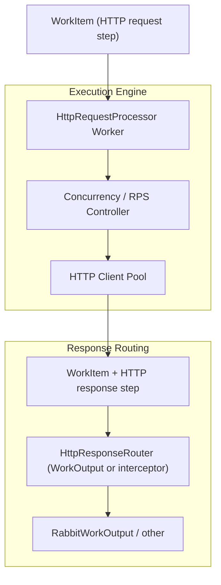

# HTTP Request Processor Worker Plan

> Scope: design a full HTTP Request Processor worker that can drive outbound HTTP calls with configurable threading and rate behaviour, and route responses intelligently, while keeping the worker API simple for users.  
> Sources: align with `docs/ARCHITECTURE.md`, `docs/ORCHESTRATOR-REST.md`, `docs/sdk/worker-autoconfig-plan.md`, and the `WorkItem`/steps model in `docs/sdk/templated-generator-plan.md`.

## Motivation

The current processors typically make synchronous HTTP calls inside `onMessage`, with concurrency and rate behaviour emerging from queue settings, container count, and scheduler rate. This makes it hard to:

- Express a **desired RPS** (e.g. 10 requests/s) in a clear, per-worker way.
- Control **concurrency and pacing** when HTTP latencies are high (e.g. 2s responses but still wanting 10/s outbound).
- Route HTTP responses **differently based on status** (e.g. 2xx to one queue, 4xx/5xx to others) without bespoke `onMessage` code per worker.

We want an HTTP Request Processor that:

- Is a first-class worker (not just an interceptor), with clean `onMessage`.
- Can run in simple “threaded” mode or in a **target RPS** mode.
- Can delegate “where the response goes” to a configurable, reusable output component.

## High-Level Goals

- [x] Introduce a simple HTTP processor worker (current `ProcessorWorkerImpl`) that consumes `WorkItem`s whose current step describes an HTTP request (method, URL, headers, body) and appends an HTTP response step.
- [x] Extend the HTTP processor with configurable execution modes:
  - **`THREAD_COUNT` mode**: process incoming items as fast as possible, bounded by a configured `threadCount` (max concurrent HTTP calls per worker instance).
  - **`RATE_PER_SEC` mode**: aim for a configured requests-per-second rate (e.g. 10/s), spreading calls evenly over time (inter-arrival ≈ `1 / ratePerSec`), even when responses are slow.
- [x] Integrate with the `WorkItem` step model:
  - Add an HTTP request step (if not already present) and an HTTP response step using `addStepPayload(...)` / `addStep(...)`.
  - Allow history to be trimmed via `clearHistory()` and per-worker `HistoryPolicy` when payload sizes are large.
- [ ] Provide a response routing mechanism that can:
  - Examine HTTP status / headers / body.
  - Decide which outbound queue/exchange to use (e.g. 2xx vs 4xx/5xx routes).
  - Live either as a dedicated `WorkOutput` implementation or as a small interceptor in front of a standard output.
- [ ] Keep the worker API simple for users with minimal Java skills: they configure behaviour; they rarely write custom `onMessage`.

## Non-Goals

- Do not replace the Swarm Controller’s global rate/guard mechanisms; this worker’s rate controls complement, not override, the control-plane.
- Do not introduce a new transport; responses still go through existing `WorkOutput` (primarily Rabbit).
- Do not leak threading primitives (executors, latches) into the public worker API; concurrency remains an internal implementation detail.

## Architecture Sketch

## Workstreams & Tasks

### 1. HTTP Request Shape on WorkItem

- [ ] Define a simple, reusable representation of an HTTP request step:
  - Method, URL (or baseUrl + path), headers, query parameters, body.
  - Map this onto the existing `HttpWorkMessage` or an equivalent DTO so generator/templating code can reuse it.
- [ ] Document how upstream components (e.g. templating pipeline) should populate the current `WorkItem` step before it reaches `HttpRequestProcessor`:
  - `addStepPayload(...)` with a JSON-based HTTP envelope, or
  - `addStep(...)` with a strongly-typed HTTP DTO serialised in the body.
- [ ] Decide how `HttpRequestProcessor` behaves if the current step is *not* a valid HTTP request (e.g. error, skip, or configurable behaviour).

### 2. Execution Modes & Concurrency Model

- [x] Define configuration properties for the processor worker:
  - `mode`: `THREAD_COUNT` vs `RATE_PER_SEC`.
  - `threadCount`: how many concurrent HTTP calls this worker instance is allowed to run in `THREAD_COUNT` mode.
  - `ratePerSec`: desired requests per second in `RATE_PER_SEC` mode (used to compute inter-arrival spacing).
  - `connectionReuse`: `GLOBAL`, `PER_THREAD`, or `NONE` for HTTP connection reuse behaviour.
  - Timeouts, retry policy, and circuit-breaker style options (where appropriate, possibly deferred).
- [ ] Clarify interaction with existing control-plane rate controls:
  - In `THROUGHPUT` mode, treat incoming message rate (scheduler/queue) as the main rate control; the worker simply uses an internal pool to overlap latency.
  - In `TARGET_RPS` mode, treat worker config as an additional pacing layer on top of scheduler rate (e.g. scheduler might emit seeds at a higher rate, but the worker enforces the effective outbound HTTP rate).
// Concurrency/pacing engine is implemented; virtual-thread wiring lives at the container factory layer.
- [x] Design the concurrency / pacing engine using virtual threads:
  - Run the Rabbit listener and worker invocations on virtual threads so blocking waits (semaphore / sleep) are cheap. This is wired at the Rabbit listener container level in the Worker SDK (executor = virtual-thread per task).
  - In `THREAD_COUNT` mode:
    - Use a `Semaphore(threadCount)` to gate concurrent HTTP calls; each `onMessage` acquires before invoking HTTP and releases in `finally`.
  - In `RATE_PER_SEC` mode:
    - Maintain a shared `nextAllowedTimeNanos` and compute `intervalNanos = 1_000_000_000L / ratePerSec`.
    - For each message, atomically schedule a start time (`max(now, prev) + intervalNanos`) and `sleep` until that time before invoking HTTP, producing evenly spaced calls (as much as possible).
  - Ensure `onMessage` semantics remain clear: for each incoming `WorkItem`, the processor:
    - Waits according to the chosen mode (semaphore / pacing).
    - Performs the HTTP call.
    - Appends the HTTP response as a new step and returns the updated `WorkItem`.

> Note on `connectionReuse` semantics (current vs planned):
>
> - `GLOBAL` – uses the shared JDK `HttpClient` instance with its default connection pooling/keep-alive.
> - `PER_THREAD` – for now behaves effectively like `GLOBAL` in `RATE_PER_SEC` mode; in `THREAD_COUNT` mode it uses a small client pool sized to `threadCount`.
> - `NONE` – currently behaves like `GLOBAL` as well; JDK `HttpClient` treats `Connection` as a restricted header, so we cannot reliably force `Connection: close`.
> - Planned: for `NONE`, introduce a dedicated “no keep-alive” HTTP client (for example an Apache HttpClient 5 based adapter) that guarantees one request per connection so PocketHive can match tools like JMeter’s “Use Keep-Alive” toggle. This client will be used only when `connectionReuse=NONE`; other modes will continue to use the existing JDK client.

### 3. WorkItem Integration & History Management

- [ ] Specify how `HttpRequestProcessor` manipulates `WorkItem`:
  - Reads HTTP request from the current step (`payload()` and/or typed JSON).
  - After a successful call, uses `addStepPayload(responsePayload)` and `addStepHeader(...)` to record status, latency, etc.
  - In failure cases (timeouts, 5xx, network errors), records an error step with appropriate metadata.
- [ ] Integrate with `HistoryPolicy`:
  - Allow `FULL` history for debugging and post-processing scenarios.
  - Provide a configuration flag to invoke `clearHistory()` after adding the HTTP response step when dealing with large bodies (keep only the latest step).
  - Ensure post-processors can still see either full steps or just the latest, depending on policy.
- [ ] Define which automatic step headers are added:
  - HTTP status, elapsed time, target URL, attempt count, etc.
  - Keep these consistent with observability conventions in `docs/observability.md`.

### 4. Response Routing (Clever Output)

Rather than pushing routing logic into another interceptor, keep `onMessage` clean and make the output itself “clever”.

- [ ] Design a `RoutingWorkOutput` (or similar) that implements `WorkOutput` and wraps one or more concrete outputs (Rabbit or others):
  - Support multiple named outputs (e.g. `success`, `clientError`, `serverError`, `fallback`), each pointing at an exchange/routingKey pair or a nested `WorkOutput`.
  - Delegate publishing to the selected output based on routing decisions.
- [ ] Define a small SPI for routing decisions:
  - For example: `interface HttpResponseRouteSelector { OutputRoute select(WorkItem item); }`
  - `OutputRoute` includes the chosen output id and optional overrides (e.g. exchange, routing key, extra headers/tags).
- [ ] Keep routing rules configuration-friendly:
  - Start with a simple condition model: select a field from `WorkItem` (e.g. latest HTTP status, header, JSON path into the response body) and compare it to a configured value or range.
  - Map these conditions to output ids (e.g. `status in 200-299 → success`, `status in 400-499 → clientError`, `status >= 500 → serverError`).
  - Keep the expression language deliberately small and documented so minimal-Java users can reason about it.
- [ ] Provide default strategies:
  - Status-family router: 2xx → success, 4xx → clientError, 5xx → serverError, everything else → fallback.
  - Header/field-based router: route based on a specific header or JSON field in the last step’s payload.
- [ ] Integrate router configuration into output properties and/or worker properties:
  - Allow Scenario or service config to select the router type and define named outputs and their destinations.
  - Ensure the router can also honour a global “no routing” mode where it behaves like a plain `RabbitWorkOutput`.

### 5. Worker Contract & Simplicity

- [ ] Keep `HttpRequestProcessor`’s `onMessage` as thin as possible:
  - It should read the current `WorkItem`, hand off to the execution engine, and return the updated `WorkItem`.
  - Avoid exposing thread or rate-control knobs directly; those stay in configuration properties.
- [ ] Ensure the worker fits naturally into the existing Worker SDK patterns:
  - Reuse `WorkItem` and step APIs (`addStepPayload`, `addStep`, `addStepHeader`, `clearHistory`).
  - Use the existing `WorkerContext` for logging, metrics, and config.
- [ ] Provide user-facing docs aimed at minimal-Java audiences:
  - Show how to configure modes (`THROUGHPUT` vs `TARGET_RPS`), threads, and routing targets without writing Java.
  - Include a “typical pipeline” example: templated generator → HTTP request processor → post-processor.

### 6. Validation & Observability

- [ ] Add tests for:
  - Correct handling of success and error HTTP responses in both modes.
  - Respect for `targetRps` under synthetic latency scenarios.
  - History trimming via `clearHistory()` and `HistoryPolicy`.
- [ ] Ensure observability is first-class:
  - Emit metrics for request count, error count, latency distributions, and current RPS.
  - Record per-step observability data on `WorkItem` (step headers, step metadata) so logs and dashboards can show the HTTP processor behaviour clearly.
- [ ] Provide guidance in docs/observability on how to interpret these metrics and step headers.

## Open Questions

- Should the HTTP processor always block in `onMessage` until the HTTP call completes, or is there a safe way to integrate an asynchronous model with the current Worker SDK semantics?
- Where should final authority on RPS live: the scheduler input, the HTTP worker, or a combination (e.g. scheduler provides upper bound, worker enforces a finer-grained pattern)?
- How do we prevent misconfiguration where a high `targetRps` conflicts with control-plane guards and backpressure?
- To what extent should the response router be configurable at runtime via control-plane vs static service configuration?

## Next Steps

1. Finalise the HTTP request representation on `WorkItem` and how upstream templating workers populate it.
2. Decide on the execution model (blocking vs internal async) and sketch the concurrency/RPS controller accordingly.
3. Design and prototype the response routing SPI and its integration point (enhanced `WorkOutput` vs interceptor-driven routing).
4. Once the end-to-end path (templated HTTP request → `HttpRequestProcessor` → routed response) is working in a feature branch, update SDK docs and architecture references to point to this plan. 

## UI / Editor Considerations

The HTTP Request Processor and its routing output are intended to be wired and tuned from a UI, building on the same principles as the `WorkItem`/pipeline plan.

- The `HttpRequestProcessor` worker should:
  - Expose its mode (`THROUGHPUT`, `TARGET_RPS`), concurrency, and timeout settings as simple, typed configuration fields (numbers/enums/booleans).
  - Avoid any free-form scripting; all behaviour should be driven by structured config that a UI can present as a form.
- The HTTP request shape on `WorkItem` should use a small, well-defined schema:
  - Fields like `http.method`, `http.url`, `http.status`, `http.headers[...]` should be standardised so UIs can present them as selectable inputs for rules and routing.
  - Avoid requiring UIs to interpret arbitrary JSON; keep any JSON-path-like capabilities behind a constrained, documented field system.
- The `RoutingWorkOutput` should be explicitly pipeline-friendly:
  - Support a fixed list of named outputs (`success`, `clientError`, `serverError`, `fallback`), each with a user-visible label and target (exchange/routing key or logical destination).
  - Model routing rules as small, structured conditions:
    - e.g. `field: "http.status"`, `op: "RANGE"`, `from: 200`, `to: 299`, `output: "success"`.
    - Keep the operator set limited and predictable so UIs can represent it with dropdowns.
  - Keep an explicit “default output” for unmatched cases so users don’t have to specify exhaustive rule sets.
- Configuration should be versioned:
  - Pipeline/worker/output definitions should carry a version number so the editor and control-plane can migrate old configs as the HTTP processor and routing capabilities evolve.
