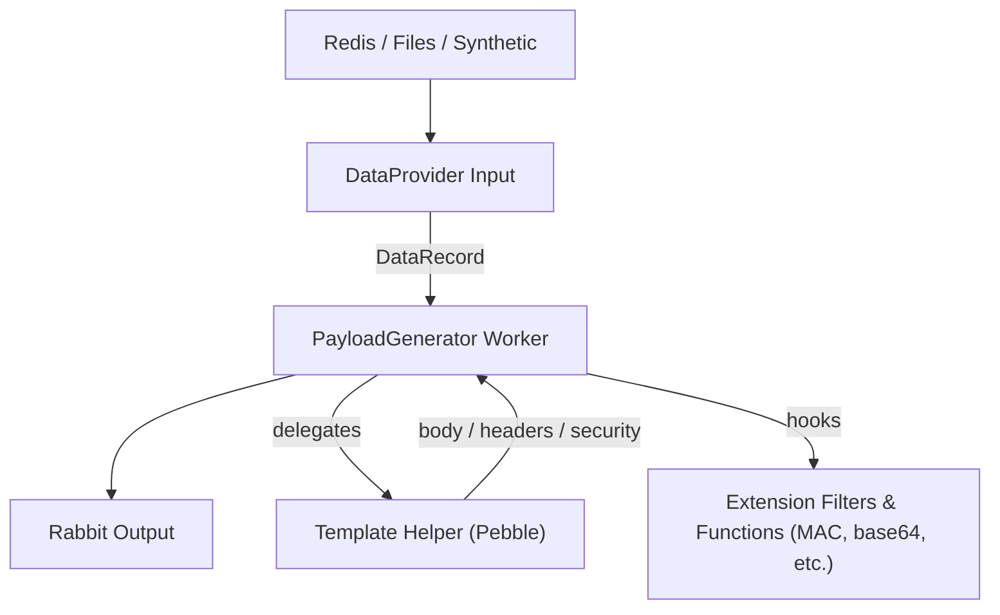

# Templated Generator & Dataset Provider Plan

> Status: Draft (tracking the exploration work needed before we land SDK v4 multi-plugin efforts).  
> Sources: align with `docs/ARCHITECTURE.md`, `docs/ORCHESTRATOR-REST.md`, and the Worker SDK plans already in `docs/sdk/`.

## Motivation

Operators need to emit SOAP/XML (and other structured) payloads where the body, headers, and security metadata depend on per-request datasets. The current generator can send arbitrary JSON, but it lacks:

- A reusable dataset abstraction (Redis-backed pools, static fixtures, synthetic records).
- A templating engine that merges datasets into envelopes while allowing custom signing/MAC logic.
- Extension points smaller than a full worker plugin.

## Goals

- [ ] Introduce a **Dataset Provider** SPI that can stream `DataRecord` objects (JSON, POJO, or binary) from Redis, files, or synthetic sources.
- [ ] Add a brand-new **PayloadGenerator** worker (the existing generator stays untouched) that renders payload/header templates via a Jinja-like engine (Pebble).
- [ ] Expose **templating extension hooks** (filters/functions/tests) so teams can add MAC/signature helpers without building entire worker plugins.
- [ ] Build the templating logic as a dedicated helper class invoked from `onMessage`, preparing us to lift it into a smaller plugin surface later.
- [ ] Ensure every `DataRecord` carries dataset provenance (dataset name/record id) via headers so downstream processors/postprocessors can reinsert or audit the original payload.
- [ ] Keep all configuration declarative (`pockethive.workers.<role>.*`) so control-plane overrides can swap datasets/templates at runtime.

## Non-Goals

- The plan does *not* replace the existing Worker SDK input/output adapters.
- SDK v3 remains single-plugin-per-host; this work prepares richer generators but does not change routing contracts.
- The current `generator` worker/service remains in place; PayloadGenerator is an additional worker built alongside it.

## Architecture Sketch

## Workstreams & Tasks

### 1. Dataset & Provider SPI

- [ ] Define `DataRecord` (POJO + metadata headers) and `DatasetProvider` interfaces in Worker SDK.
- [ ] Implement a Redis-backed provider (lists/streams) with pluggable selection policies (round-robin, weighted, priority). Start with a simple `RedisDataSet` implementation that pops entries from a named list/stream.
- [ ] Provide sample providers: Static JSON array, CSV, synthetic generator (UUID/time-driven).
- [ ] Document how providers attach to worker inputs (mirroring scheduler input semantics). Spell out that backpressure remains under Swarm Controller control (ratePerSec + guard-based enable/disable), and the provider should rely on scheduler pacing rather than its own ACK loop.
- [ ] Emit clear status signals when datasets are empty/unreachable so operators see “dataset outage” in Grafana/CLI status.

### 2. Pebble-Based PayloadGenerator

- [ ] Create a new worker module/service for PayloadGenerator and wire Pebble with Spring-friendly configuration.
- [ ] Implement a reusable templating helper invoked from `onMessage` so future plugins can share the same logic.
- [ ] Support multiple template fields per worker (`body`, `headers`, optional `status`), each pointing to a file/resource/env string.
- [ ] Resolve templates against the `DataRecord` plus helper context (control-plane info, timestamps).
- [ ] Emit WorkMessage with templated payload + headers and keep existing control-plane reporting.

### 3. Extension Surface

- [ ] Define SPI packages for Pebble **filters/functions/tests** so additional jars can register custom helpers (e.g., `mac()`, `soap_escape()`).
- [ ] Provide sample extensions (WS-Security timestamp builder, HMAC signer) and wire them via Spring auto-configuration.
- [ ] Add guardrails/tests ensuring untrusted templates cannot access host internals (limit class exposure, sandbox helpers).

### 4. Configuration & Docs

- [ ] Describe dataset + template configuration in `docs/USAGE.md` (new section: “Templated Generators”).
- [ ] Add a SOAP swarm example under `scenarios/` that uses Redis dataset + Pebble templates for body/header rendering.
- [ ] Update `docs/sdk/worker-plugin-plan.md` to link this plan for teams needing richer generators pre SDK v4.

### 5. Validation

- [ ] Integration test: Redis dataset → templated generator → processor, asserting the rendered SOAP envelope matches expectations.
- [ ] Load test the templating path (Pebble + Redis) to ensure throughput matches existing generator baselines.
- [ ] Observability: confirm status snapshots expose dataset/template info (without leaking sensitive data).

## Open Questions

- How should datasets be versioned/rolled out? **Decision**: start with simple dataset names; Redis-backed providers treat datasets as named lists/arrays. Operators can roll workloads by swapping the dataset name in control-plane config.
- Do we need per-template sandboxing (time limits, recursion limits) beyond Pebble’s defaults?
- Should the dataset provider own back-pressure (ack/fail semantics) or rely on Rabbit outputs? **Decision**: treat the provider as a scheduler-driven input. Swarm Controller + `ratePerSec` manage pacing/backpressure; provider only pops at the configured rate and surfaces status when data is unavailable.

## Next Steps

1. Review this plan with the control-plane owners and confirm Redis is the preferred first provider.
2. Spike the Pebble/spring wiring inside generator-service to validate template rendering.
3. Flesh out the dataset provider SPI and target APIs before implementation.
4. Once PayloadGenerator and the Redis provider are stable (“singing and dancing”), author the corresponding architectural documentation (new section under `docs/ARCHITECTURE.md` + `docs/USAGE.md`) so future teams can adopt the pattern.
