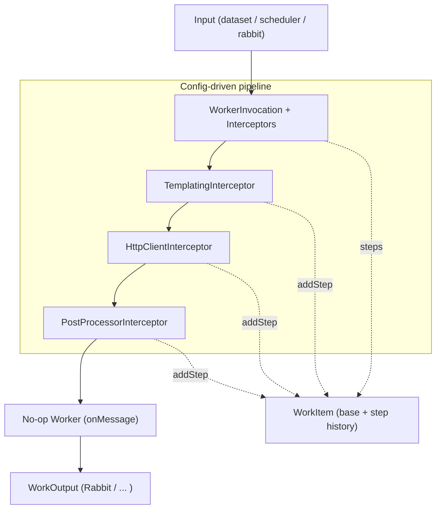

# Config-Driven Templated Workers & Message History Plan

> Scope: make most workers composable and configuration-driven, with minimal Java code.  
> Sources: align with `docs/ARCHITECTURE.md`, `docs/ORCHESTRATOR-REST.md`, and the Worker SDK plans in `docs/sdk/`.

## Motivation

Most workers today implement custom `onMessage` logic even for common patterns like:

- Turning a record/dataset into an HTTP request (templating).
- Calling an HTTP endpoint and attaching the response.
- Enriching or inspecting the resulting data in a post-processor.

We want a flow where:

- Inputs, templating, HTTP calls, and post-processing are expressed as a *pipeline* of standard modules.
- `onMessage` exists as an escape hatch, not the default.
- The payload carries a *history* of steps (dataset → template → HTTP → post-process) without forcing users to deal with low-level details like “stages”.

## High-Level Goals

- [ ] Make most workers **config-driven**, using a chain of Worker SDK interceptors between input and `onMessage`.
- [ ] Rename `WorkMessage` to **`WorkItem`** and extend it so it can **accumulate results** across steps (a simple history), while keeping existing callers working during the transition.
- [ ] Provide a **templating building block** that any worker can use, with a small, friendly API for users (minimal Java).
- [ ] Introduce a **no-op / pipeline worker** whose `onMessage` is effectively empty, delegating behavior to configured modules.
- [ ] Keep the public API simple: users see `addStepPayload(...)`, `addStep(...)`, and `addStepHeader(...)`; internal step metadata stays inside the SDK.

## Non-Goals

- This plan does not change control-plane contracts or routing keys.
- It does not introduce a new transport or replace existing inputs/outputs.
- It does not expose stages as a public concept; stage naming remains an internal concern.

## Architecture Sketch

## Workstreams & Tasks

### 1. WorkItem Steps & Public API

Introduce a step model inside the SDK so each worker/Interceptor can “add a step” in a simple, readable way, while keeping the surface approachable for minimal-Java users.

- [ ] Rename `WorkMessage` to `WorkItem` at the public API level (keep a compatibility type/aliases as needed during migration).
- [ ] Design an internal `WorkStep` type representing one step:
  - Payload (raw body + charset) and headers snapshot for that step.
  - Internal `stepId` (derived from interceptor/worker/input; **not** exposed to end users).
  - Optional metadata (timestamps, duration, step index).
- [ ] Extend `WorkItem` to optionally hold a list of steps in addition to the existing body/headers:
  - Ensure existing code (`asString()`, `headers()`, etc.) still treats the “current” step as the primary view.
  - Decide whether the top-level `body`/`headers` mirror the latest step or a base step and document this.
- [ ] Add explicit, readable public methods with no step parameter:
  - `WorkItem addStepPayload(String payload)` — adds a new step using the current step’s auto-derived name.
  - `WorkItem addStep(String payload, Map<String, Object> headers)` — adds a new step with per-step headers.
  - `WorkItem addStepHeader(String name, Object value)` — mutates headers for the *current* step in a friendly way.
- [ ] Provide read helpers for downstream modules (especially post-processors):
  - `String payload()` / helpers for JSON/binary views scoped to the current step.
  - `Optional<String> previousPayload()` for “one step back”.
  - `Iterable<WorkStep> steps()` for iterating all steps when needed.
- [ ] Add an explicit manual history reset helper on `WorkItem`:
  - `WorkItem clearHistory()` — keeps the current step, drops all previous steps, and normalises step indices/headers so the retained step becomes the new baseline (e.g. `ph.step.index = 0`, `ph.step.total = 1`).
- [ ] Introduce a `HistoryPolicy` (or similar) that controls how much step history is retained:
  - Modes such as `FULL` (keep all steps up to a limit), `LATEST_ONLY` (keep only the current step), and `DISABLED` (no history, behave like today’s single-payload message).
  - Apply policy per worker/role or per swarm via configuration, with `clearHistory()` available as an explicit escape hatch in individual workers/interceptors that need to drop history eagerly for large payloads.
- [ ] Implement sensible bounds (max steps per item, max header size) to avoid unbounded growth and allow operators to effectively “remove history” for large payloads.

### 2. Step Metadata & Observability (Internal Only)

Step metadata is required for observability and debugging, but should not appear in public APIs.

- [ ] Extend `WorkerInvocationContext` to carry an internal `stepId` and step index:
  - For inputs (scheduler/rabbit), derive from input type, e.g. `input:scheduler`, `input:rabbit`.
  - For interceptors, derive from class name or an annotation, e.g. `interceptor:templating`, `interceptor:http-client`.
  - For worker `onMessage`, derive from worker bean/role, e.g. `worker:payload-generator`.
- [ ] Add an internal API used by the SDK when adding steps:
  - `WorkItem addStepInternal(String stepId, Object payload, Map<String,Object> headers)`.
  - This is the only entry point that records step metadata; public `addStepPayload(...)` / `addStep(...)` methods call it with the step id derived from `WorkerInvocationContext`.
- [ ] Ensure step headers are stamped automatically for observability:
  - Inject fields such as `ph.step.name`, `ph.step.index`, `ph.step.total` into the step headers.
  - Keep these headers in sync with metrics and logs so operators can correlate steps without manual wiring.
- [ ] Make sure the global `ObservabilityContext` behaviour remains consistent:
  - The top-level `ObservabilityContext` continues to be propagated via headers as today.
  - Step-specific observability (durations, error markers) is captured in step metadata and/or automatically added step headers.
- [ ] When history is disabled by `HistoryPolicy`, ensure:
  - `addStepPayload(...)` updates the current step without retaining previous payloads.
  - `previousPayload()` and `steps()` degrade gracefully (e.g. empty/one-element views) without surprising callers.

### 3. Generic Templating Building Block

Lift the templating logic from the payload-generator work into a reusable module.

- [ ] Introduce a small, engine-agnostic API in `common/worker-sdk`:
  - `interface TemplateRenderer { String render(String template, Map<String,Object> context); }`
- [ ] Provide a Pebble-based implementation:
  - `PebbleTemplateRenderer` that uses `PebbleEngine#getLiteralTemplate` and `template.evaluate(...)`.
  - Keep configuration simple and safe (no reflection helpers, limited function set by default).
- [ ] Define a standard context model for templating:
  - Always include the current `WorkItem` as a map (`seed.body`, `seed.headers`, `seed.steps`, etc.).
  - Optionally expose control-plane metadata (worker role, swarm id) via safe helper objects.
- [ ] Document a few one-line examples for users (in docs, not Javadoc) such as:
  - `{{ seed.body }}`, `{{ seed.headers.correlationId }}`, etc.

### 4. Pipeline Interceptors (Dataset → Template → HTTP → Post)

Use `WorkerInvocationInterceptor` as the configurable pipeline stage between input and `onMessage`.

- [ ] Introduce a `TemplatingInterceptor` that:
  - Reads the current step from `WorkItem`.
  - Builds the template context (as defined above).
  - Uses `TemplateRenderer` to render new payloads (e.g. an HTTP request envelope) and calls `addStepPayload(...)` / `addStep(...)`.
  - Optionally applies `addStepHeader(...)` for per-step metadata (e.g. template name).
- [ ] Introduce an `HttpClientInterceptor` that:
  - Reads the templated HTTP request from the latest frame.
  - Executes the HTTP call (using existing HTTP client abstractions or a minimal client).
  - Adds the HTTP response as a new step on the `WorkItem`.
- [ ] Introduce a simple `PostProcessorInterceptor` building block:
  - Gives access to the full step history (or to just the latest step, when history is disabled).
  - Can be specialized later (e.g. JSONPath-based checks, metric emission).
- [ ] Wire step headers automatically in these interceptors so operators can see per-step latency and status.

### 5. No-Op Worker & Config-Driven Workers

Provide a worker implementation that effectively does nothing in `onMessage`, letting interceptors do the work.

- [ ] Add a `PipelineWorker` (name TBD) implementing `PocketHiveWorkerFunction`:
  - `onMessage` simply returns the current `WorkItem` (or indicates “no output”) based on the latest step.
  - It should be safe to use with any input/output type the SDK already supports.
- [ ] Define a configuration model for pipeline-based workers (Scenario/worker config):
  - Allow Scenario to declare which interceptors run, in which order (referencing known interceptor IDs).
  - Keep the worker’s own config minimal (describe pipeline, not algorithms).
- [ ] Ensure UI/control-plane can introspect the configured pipeline for a worker so operators understand the flow without reading code.

### 6. Docs, Samples, and Migration

- [ ] Update `docs/sdk/worker-sdk-quickstart.md` with a “Config-driven workers” section that:
  - Explains the pipeline concept (inputs → interceptors → worker → output).
  - Shows `append(...)` and `addHeader(...)` as the only APIs most users need.
- [ ] Add an end-to-end sample scenario:
  - Dataset-like input (or synthetic records) → templating → HTTP call → post-processor.
  - Demonstrate how the message history looks in logs/metrics without mentioning “stages”.
- [ ] Refresh any existing references to the old “templated generator” plan to point to this document instead.

## Open Questions

- How many frames do we keep by default? Should there be a per-swarm / per-worker limit to avoid very large messages?
- Should `WorkItem` expose any history-aware read helpers directly (e.g. `history()`), or keep that API internal and let interceptors provide higher-level abstractions?
- How much of the pipeline configuration should live in Scenario vs service-level configuration (e.g. can a single worker role support multiple pipelines)?

## Next Steps

1. Finalize the `WorkMessage` history design and its public `append/addHeader` surface, ensuring no surprises for existing workers.
2. Extract `TemplateRenderer` and a basic `PebbleTemplateRenderer` into `common/worker-sdk` (or a small shared module) and wire them into a `TemplatingInterceptor`.
3. Add the no-op/pipeline worker and a minimal pipeline configuration model that can be driven from Scenario.
4. Once the first end-to-end scenario (dataset → template → HTTP → post-process) is stable, update docs and use this plan to track further enhancements. 

## UI / Editor Considerations

The `WorkItem` + steps model and the interceptor-based pipeline are intended to be editable from a UI without requiring users to write Java.

- Each interceptor (e.g. `TemplatingInterceptor`, `PostProcessorInterceptor`) should expose:
  - A stable type id (e.g. `templating`, `post-processor`) and a human-readable label.
  - A configuration schema made up of primitive fields (strings, numbers, booleans, enums) that can be rendered as form inputs.
- Pipelines should be describable as ordered lists of blocks:
  - `pipeline: [ { type: "templating", config: {...} }, { type: "httpProcessor", config: {...} }, ... ]`
  - No cycles, no embedded scripting; order is explicit so UIs can support drag-and-drop reordering.
- `WorkItem`-derived fields used in configuration (for templating, routing, etc.) should be standardised:
  - At minimum: `current.payload`, `current.headers[...]`, and logical HTTP fields such as `http.status`, `http.method`, `http.url` (when present).
  - Keep the list small and documented so the UI can offer field dropdowns instead of free-form expressions.
- History controls:
  - `HistoryPolicy` should be configurable per worker/pipeline via simple enums (`FULL`, `LATEST_ONLY`, `DISABLED`).
  - `clearHistory()` remains an advanced tool used in specific components; UIs don’t need to expose it directly, but its effect should be documented so step visualisation is predictable.
