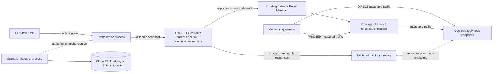

# Global SUTs, Shared Mocks and Continuous Plans

Status: proposed; specification review and runtime implementation pending.
Evidence baseline: `merge/rewrite-lifecycle-mcp@aedd336b`, inspected 2026-09-15.
Delivery branch: `docs/global-sut-mocks-spec`.

## Decision and benefit

Give each System Under Test (SUT) one global identity and one shared runtime
within a PocketHive deployment. Many swarms can use `nft01`, its mocks and its
current behaviour without creating another `nft01`. A dedicated controller
runs its schedule independently, including while Orchestrator restarts.
Its execution state stays in memory, like the Swarm Controller. It needs no
database or checkpoint store; restarting the SUT Controller requires explicit
plan reactivation.

Review this responsibility split, the contracts below and the linked
[TCP functional-equivalence gate](../../tcp-mock-server/docs/WIREMOCK-PARITY.md)
before runtime implementation. This delivery creates specifications and corrects
qualification claims; it does not change running services or executable schemas.

The trade-off is one controller process per registered SUT runtime. Shared mock
state and scheduled changes intentionally affect all callers of that mock.
Keep Scenario YAML unchanged and retain the existing proxy services.

## Definitions

These definitions distinguish current contracts from proposed extensions.
An active snapshot is a read-only copy of its named source, never another writer.

| Canonical term | Status | Meaning and contents | Not the same as | Source | Allowed shorthand |
| --- | --- | --- | --- | --- | --- |
| SUT Environment | EXISTING; global runtime scope PROPOSED | A named target definition containing endpoint contracts; this proposal adds owned mock declarations and behaviour references. | A scenario bundle or a copy per swarm. | [SUT schema](../spec/sut-environment.schema.json); this specification | SUT |
| NetworkProfile | EXISTING | A named definition of network faults and endpoint targets. | An active route or generated request rate. | [Proxy baseline](../archive/network-proxy-plan.md) | Network profile |
| SUT Controller | PROPOSED | One manager process per SUT; executes mock lifecycle and owns the active plan clock and live behaviour selection in memory. | A Swarm Controller or another proxy manager. | This specification | Controller only within SUT-specific sections |
| Managed Mock | PROPOSED | An explicitly declared WireMock or TCP Mock instance, its native assets and transport settings, identified within one SUT. | Another SUT or a swarm worker. | This specification | Mock |
| Mock Behaviour | PROPOSED | A named set of response values for stable mapping IDs in one Managed Mock. | Mapping topology, mutable session state or an incremental patch chain. | This specification | Behaviour |
| SUT Plan | PROPOSED | A schedule of complete network-profile and Mock Behaviour selections, with an explicit baseline. | The existing swarm Scenario Plan or the proposed Simulation Program. | This specification | Plan within SUT-specific sections |
| SUT Runtime Snapshot | PROPOSED | Immutable validated SUT configuration and asset digests selected for one runtime activation. | The editable catalogue or the broader dataset Binding Snapshot proposal. | This specification | Runtime snapshot |

## Hard rules and scope

- One SUT ID per deployment; one controller and one runtime identity per declared
  mock. Two swarms selecting the same SUT must reuse them.
- KISS, single source of truth (SSOT), SOLID boundaries and No Fraking Fallbacks
  (NFF) apply. No adapter guessing, source search chains or hidden catch-all stubs.
- Keep `scenario.yaml` / `scenario.yml`, Scenario Protocol and scenario schema
  unchanged. Preserve endpoint templates, HTTP Sequence endpoint IDs, auth
  context and variables-file structure.
- Configuration becomes stricter only where a new selected capability requires
  an explicit setting or an existing setting was silently ignored.
- Real endpoints, mock endpoints and mocks called by real SUT dependencies are
  supported. External exposure uses declared data-plane addresses; mock admin
  APIs remain internal. External target services are never provisioned or removed.
- No cross-deployment identity service, active-active controller scheduling,
  aggregate SUT requests-per-second limiter, new chaos platform, dataset engine,
  WireMock SDK compatibility or standalone mock GUI is included.
- The singleton guarantee covers registered and managed runtime identity.
  Swarm one-replica/stop-first operation does not provide physical fencing of
  partitioned hosts. Unknown ownership never authorises a replacement instance.

## Ownership and placement

| Concern | Sole owner | Must not own |
| --- | --- | --- |
| SUT catalogue, native assets, behaviour/plan definitions and static validation | Scenario Manager | Mock execution or live plan progress |
| Runtime admission, controller provisioning/removal, durable swarm attachments and public lifecycle outcomes | Orchestrator | Scheduled phase execution or mock state |
| Mock provisioning/readiness, in-memory plan execution and selected live behaviour | SUT Controller | Editable catalogue, durable execution store or proxy implementation |
| Desired/applied proxy routes and fault configuration | Network Proxy Manager | SUT plan timing or mock response state |
| Request matching, scenario/session state, responses and request evidence | Respective mock engine | SUT lifecycle, catalogue editing or network-profile scheduling |
| Protocol-specific apply/readback mapping | One adapter per mock/proxy boundary | Independent configuration, success calculation or fallback paths |
| Runtime names, paths and effective infrastructure settings | Shared validated contract/resolvers | Repeated service-local defaults or path construction |
| Status/UI/MCP/IDE views | Read-only projections of the named owners | Independent state transitions or validation |

The SUT Controller uses a narrow authenticated internal HTTP command/result/
status contract. Public commands enter through Orchestrator ingress. This is
SUT infrastructure control: it neither invents a swarm ID nor weakens the
existing AMQP-only swarm worker heartbeat contract. The architecture amendment
must name that separate boundary before implementation.

## Catalogue and resolution

Scenario Manager exposes one writable global catalogue. Each SUT owns its
definition, native mock assets, named behaviours and plans. Keep WireMock
`mappings` / `__files` and TCP's native mapping formats; do not create a common
stub language. An empty declared mock collection is a valid external-only SUT.
Declare each mock adapter (`WIREMOCK` or `TCP_MOCK`) and its required transport
settings. Multiple endpoints may reference one mock. Distinct TCP/TCPS listeners
may use separate named mocks without creating duplicate SUTs.

For example, `nft01` declares one real API endpoint and one TCP dependency mock.
Two swarms select it with their existing `sutId` and `networkMode` fields. A
ten-minute plan selects baseline responses/no network faults for five minutes,
then slow responses/latency for five minutes. Definitions, native mappings and
the plan live under `nft01`; neither swarm copies them.

One catalogue resolver owns layout and safe ID-to-path mapping. One shared
runtime resolver constructs SUT records outside every swarm-owned directory
and validates non-overlap. Case-distinct accepted IDs must not collide after
Docker naming/encoding. Existing ID and endpoint-kind validation is not replaced
with a blanket restrictive grammar.

Save authoring edits without changing the active runtime snapshot. Endpoint
addresses, images, ports, TLS material, framing, mapping identities/matchers and
body-file contents take effect on the next explicit SUT Start after Stop. Show pending
changes in the UI. Live Mock Behaviour publication/application is separate.

Orchestrator resolves global `sutId` once against the active runtime snapshot.
The selected network mode determines the explicit client route; the resulting
`sut.endpoints[...]` context is frozen into the swarm startup artifact. Preserve
client TLS hostname/SNI and the distinction between client and upstream
authorities. Never derive a direct route merely from `upstreamBaseUrl`.
For managed mocks the canonical resolver derives runtime addresses from the
declared instance/settings; authors do not repeat generated names.

Scenario Manager keeps static authoring validation; Orchestrator performs
admission using fresh identity/readiness evidence. Required selected variables
remain strict. Variables coverage considers IDs actually referenced by that
document, not every global SUT. Remove downstream endpoint reconstruction and
silent unknown-endpoint handling; all consumers use the canonical resolution.

## Runtime lifecycle and failure

Intent, observed runtime state, configuration readiness and operation outcome
remain separate facts. Readiness proves the declared listeners/configuration
are applied; an intentionally injected fault is not a provisioning failure.

| Operation | Required behaviour and completion evidence |
| --- | --- |
| SUT Start | Reserve identity and persist the accepted operation/snapshot before side effects. Observe or create the exact owned controller; it provisions only declared mocks and required proxy routes. Complete after matching controller identity, asset digest, listeners and configuration readback are verified. Plan activation is separate. |
| Swarm attach | Persist `(sutId, swarmId, runId)` before swarm-create side effects. Bind to the active snapshot without restarting mocks, changing their state or selecting a profile. Unknown/stopped SUTs fail admission. |
| Swarm detach | Release only after verified swarm removal. A failed create retains its reservation until owned side effects are proved absent. Detach never stops the SUT plan or clears its routes. |
| SUT Stop | Require no attached swarms; reject admission while stopping. Stop a known active plan and verify its baseline, then stop mocks and clear owned proxy routes. Only a new Stop explicitly requested after execution loss may use shutdown-only postconditions; report the previous plan baseline as unverified. Retain catalogue identity and runtime ownership records; keep the controller control surface available. Stop is not Remove. |
| SUT Remove | Require no attachments. Controller removes exact owned mocks/routes and records evidence; Orchestrator verifies absence and removes the controller last. Failure reports remaining resources. Catalogue identity is retained. |

Start on a running SUT verifies the current activation without applying structural
edits. Start after Stop pins the selected published snapshot. If structural
settings changed, verify absence of each affected old resource before replacing
it under the same stable identity; never run old and new instances together.
A planned replacement generation is distinct from an unexpected ownership mismatch.

Use one active lifecycle mutation per SUT. Orchestrator deduplicates public
commands using its operation records. Controller commands target the observed
process instance; repeated delivery returns its retained result/progress.
An unavailable result is unknown, never permission to repeat side effects.
Explicit recovery uses a new operation identity against the same runtime
identities; never append retry names or add a replica.
An owned matching instance is observed/resumed. A foreign name, mismatched
generation, duplicate runtime or uncertain inventory is explicit failure.
Partial startup retains known resources for explicit recovery, with no automatic
deletion or adapter switch. Swarm cleanup must never claim SUT-labelled resources.

Orchestrator fixes each operation's required completion evidence at admission
and retains it in that operation's record. Execution loss never weakens an
accepted operation's postconditions. If baseline restoration was required and
cannot be verified, resource shutdown alone cannot complete that operation
successfully; it remains unresolved until verified or fails at its deadline.
A new explicit runtime Stop has its own outcome and cannot complete or rewrite
the earlier operation. Never convert a failed Plan Stop into runtime Stop/Remove.

Orchestrator retains controller ownership, attachments, startup artifacts and
accepted external operations outside swarm-owned directories. Those records
protect shared runtime identity; they do not store or replay the controller's
plan clock or progress.

The SUT Controller reads the immutable startup snapshot and holds accepted
commands, active plan inputs, clock and apply progress in bounded memory.
Follow the [Swarm Controller timeline model](../../swarm-controller-service/src/main/java/io/pockethive/swarmcontroller/scenario/TimelineScenario.java):
no database, mutable checkpoint file or journal replay for execution state.
Mock mutable state remains owned by each mock engine.

On Orchestrator restart, the controller and mocks keep running and phase changes
continue. No phase requires an Orchestrator callback, heartbeat or lease renewal.
Orchestrator reloads its records and reads the existing controller's status and
results. Lost observation becomes unknown; it never resets a plan or proves
resources absent.

A SUT Controller restart loses execution memory. It reloads structural startup
input and observes exact owned resources without resetting mocks, restoring a
baseline or starting a plan automatically. Status exposes lost execution state;
pending commands from the previous process remain unknown until verified.
Commands addressed to the previous process are rejected. Explicit recovery must
settle possible outstanding writes and verify the selected baseline before new
plan activation. No previous pause state, manual selection or elapsed epoch is
reconstructed from readback, catalogue contents or journal history. Runtime
Stop/Remove remain explicitly requestable, subject to the same outstanding-write
barrier as every mutation: the old write must settle or be proved unable to apply
before another mutation starts. Their resource postconditions still require
verification. New swarm admission remains blocked while readiness is unknown.
This feature does not implement general controller crash recovery.

## Mock behaviour and TCP release requirement

The [TCP parity specification](../../tcp-mock-server/docs/WIREMOCK-PARITY.md)
owns the required TCP workflows, code evidence, native semantic differences and
qualification matrix. Every required workflow must pass before TCP-backed SUT
mocks and continuous plans are released. Correcting old claims alone does not
satisfy that gate. Use headless WireMock and TCP runtimes while retaining the
required internal administration/readiness APIs.

Base mappings own matching, priority, framing and scenario transitions once.
Each named Mock Behaviour supplies complete native response values for the same
declared mutable mapping IDs. One adapter composes each update; no remembered
patch chains, copied matcher definitions or runtime `/save` authority exists.
Supported live values include response content/status/headers where applicable,
delay and deliberate response faults. Upstream proxy destinations and transport
settings are structural, even if a native engine embeds them in response syntax.

Changing behaviour preserves mapping registration order, counters, scenario/
session state and request history. Do not snapshot and restore changing scenario
state around an edit. Reset remains a separate explicit operation through the
same owner. Preserving state on live edits or Orchestrator restart does not claim
that all engine state survives a mock process replacement.

Validate a complete selection before applying it. Apply mocks in stable mock-ID
order, then the network profile; read back each effect. Expose applying and
per-target results. Native engines provide no multi-mapping/multi-engine atomic
transaction: traffic may observe intermediate behaviour, including a native
mapping-replacement gap. On failure/timeout, record partial or unknown effects,
halt further plan progression and require explicit recovery. Do not claim rollback
or success from HTTP acknowledgement alone.

## Continuous SUT Plans

A SUT Plan is a separate file/contract; no step is added to scenario YAML.
Keep familiar step IDs and time offsets, but do not reuse the swarm-bound
`ScenarioContext`, invent a fake swarm or copy its permissive failure handling.
The SUT Controller owns one schedule evaluator and calls the same behaviour
application path as manual commands.

Each phase is a complete desired state: one NetworkProfile selection (explicit
absence when no proxy capability is declared) plus a Mock Behaviour selection
for every configured mutable mock. The plan declares a baseline and an initial
phase. Pin its definition and all transitive profile/behaviour assets on activation;
editing a catalogue entry by ID cannot change a running plan.

| Schedule mode | Contract |
| --- | --- |
| Repeating elapsed-time cycle | Explicit positive cycle duration; unique phase IDs and increasing ISO-8601 duration offsets starting at zero and less than the cycle duration. Activation establishes the in-memory epoch. |
| Daily clock schedule | Required IANA timezone; unique phase IDs and increasing local clock boundaries starting at midnight. Resolve each day's boundaries to actual instants; a calendar day is not a fixed 24-hour duration. |

For daylight-saving overlaps, use the first occurrence of a repeated boundary
once. Boundaries in a missing interval coalesce at the first valid instant
afterward; the latest declared local boundary wins. Never select phases by local
clock comparison alone, which can repeat earlier phases when the clock goes back.

- Activation applies the phase due now. Automatic activation during SUT Start is
  not implied. Only explicit new activation establishes a new epoch.
- Pause is acknowledged after accepted application settles or reports failure;
  it keeps current behaviour while schedule time continues. Manual changes
  require a paused plan. With no active plan, the same manual path is available.
- Resume computes the current phase; it does not replay missed transitions.
- Plan Stop explicitly restores the pinned declared baseline and verifies it.
  Failure leaves the operation failed with actual effects, not successfully stopped.
  After execution loss, reject Plan Stop because its pinned baseline is unavailable;
  recovery or runtime Stop/Remove requires a separate explicit request.
- A SUT Controller restart requires the explicit recovery described above and
  new activation. Repeating plans get a new epoch; daily plans select the phase
  due now. Neither replays missed transitions. An Orchestrator restart leaves the
  running controller's activation, pause state and clock untouched.
- Scheduled selections contain no toggle/increment/reset commands. The schedule
  and clock determine intent; current apply progress is held in memory.
- Serialize plan/manual changes inside the controller and correlate generations
  through adapters. Generations alone cannot cancel a dispatched native write.
  Unknown completion blocks later mutations and Resume, including after restart,
  until it settles or explicit recovery proves the old write cannot still apply.
  Apply failures stop progression; recovery is explicit.
- A plan runs with zero attached swarms. Publish SUT-scoped phase/failure evidence
  through existing observability infrastructure with bounded buffering and
  explicit reporting of lost history. Journal availability never drives the
  schedule or restores execution. No controller database is required, and no
  fabricated swarm identity is allowed.

## Preserve and scope the proxy

Keep Network Proxy Manager, HAProxy, Toxiproxy and the Proxy page. Manager owns
applied routes/faults; SUT Controller owns which pinned profile is desired now.
Attach/detach updates membership without recreating proxies or submitting stale
swarm-selected profiles. The SUT's routes live until its lifecycle clears them.

Replace latest-swarm-wins selection and stack-wide manual mutation with SUT-scoped
commands through its controller. Remove competing write entrypoints in the same
slice. Retain explicit per-swarm `DIRECT`/`PROXIED`; only proxied traffic receives
proxy faults. Mock response changes affect all callers, including direct callers
and external dependencies using the declared endpoint.

Retain existing latency/jitter, bandwidth, timeout, reset, slow-close and
data-limit capabilities. Bandwidth is **KB/s per connection**; correct misleading
labels without silently converting stored values. Generated request rate remains
owned by existing swarm load shaping. Preserve HAProxy's exact applied-digest
handshake and additionally verify the relevant Toxiproxy configuration.

Research supports reuse: [Toxiproxy 2.11.0](https://github.com/Shopify/toxiproxy/blob/v2.11.0/README.md#toxics)
provides the deployed fault engine; [WireMock Docker](https://wiremock.org/docs/standalone/docker/)
supports headless execution with native assets. Use baseline/fault/recovery
measurements as described by the [chaos principles](https://principlesofchaos.org/).
No additional chaos scheduler or platform is required.

## Proposed public and internal interfaces

These are target capabilities, not currently available endpoints. Publish their
executable schemas before implementing producers/consumers; do not duplicate
schemas or validators in this document or in individual clients.

| Surface | Required change |
| --- | --- |
| Scenario Manager global `/sut-environments` family | Catalogue list/get, per-SUT authoring/import and native asset/behaviour/plan editing; one canonical SUT parser. Whole-file legacy writes must not remain another active catalogue owner. |
| Orchestrator `/api/suts/{sutId}` family | Status, Start/Stop/Remove, plan activate/pause/resume/stop, manual behaviour application, explicit mock resets and operation polling through authenticated ingress. |
| SUT Controller internal command/result/status | Canonical SUT/runtime and process identities, correlation/idempotency identity, pinned input digests and in-memory acceptance/result. Reject commands for a previous process; unknown results require verification, never implicit replay. |
| SUT execution evidence | Canonical SUT-scoped identity for phase/failure observations through existing observability infrastructure. Evidence is not a recovery store or a database dependency for the controller. |
| Network Proxy Manager | SUT-scoped pinned-profile apply/readback and attachment projections. Consume the controller's immutable profile input instead of refetching a mutable definition by ID. |
| Swarm create/network contracts | `sutId` becomes global; retain `networkMode`; remove independent writable `networkProfileId` selection. Current profile/status is a projection. No-SUT creation retains current explicit-null rules and requires DIRECT. |
| TCP contract | One canonical mapping/admin contract and response-update path, as specified by the parity document. No requirement for WireMock API/SDK compatibility. |
| UI, Java MCP and VS Code | Consume canonical shared/generated types and the same global catalogue, lifecycle and diagnostics surfaces. No private runtime inspection or alternate validators. |

State/status must distinguish desired intent, fresh observed resources,
configuration readiness, active/pending digests, phase due/applied evidence and
operation failure. Scheduled phase evidence describes controller-owned execution,
not an Orchestrator-admitted public lifecycle operation. External commands retain
Orchestrator-owned outcomes. Logs/evidence propagate correlation and exact SUT/
controller identity; existing authentication, redaction and audit rules apply.

## Import and UI

Bundle SUTs remain readable solely for explicit inspection/import. Detection and
import produce a structured deprecation warning visible in validation, UI, MCP
and IDE results: bundle-local SUT execution is retired; choose/import a global ID.
Create never searches bundles, imports automatically or falls back on catalogue
failure. Validate all selected input before publishing; conflicting IDs leave
the catalogue unchanged. Repeated identical imports report already present.

The inventory at the evidence baseline contains 30 bundle descriptors and 11
distinct IDs; `wiremock-local` has differing definitions. Migration must list
those conflicts for explicit author resolution, not silently pick one. Importing
does not rewrite active runtime snapshots or alter shared mocks. Migrate supplied
examples and remove their old runtime source path in the same integration slice.

Use one dedicated SUTs page for definitions/assets, lifecycle, mocks, consumers,
active network behaviour and plan editing/control/evidence. Hive shows the selected
SUT and links to that page. The Proxy page retains stack health and profile-catalogue
administration. Show pending restart changes, shared effects and direct/proxied
consumers. Do not embed WireMock/TCP standalone GUIs.

## Architecture alignment and branch dependencies

The [architecture](../ARCHITECTURE.md), [engineering rules](../ENGINEERING_RULES.md)
and [review rules](../REVIEW_RULES.md) remain authoritative for current code.
Before implementation, amend the affected canonical contracts for global SUT
resolution, SUT infrastructure HTTP observations, SUT-labelled compute resources,
durable attachment ownership, SUT evidence identity and SUT-scoped proxy lifecycle.
Update the shared SUT/swarm-create schemas, REST contracts and generated clients
together.

This proposal replaces the permanent dual-source direction in the older
[SUT/dataset/simulation proposal](../archive/pre-boundary-reset/architecture/sut-dataset-simulation-model.md)
with import-only migration. It also replaces the unimplemented swarm
`network-profile` timeline extension with a SUT Plan. Neither older proposal is
an implicit compatibility requirement; datasets and Simulation Programs remain
separate work.

Branch inspection found the current base includes remote `main` and the MCP
improvements branch. `docs/http-sequence-sut-endpoints@0374a769` has only a release
bump outside the base. `docs/managed-test-data-lifecycle-spec@0c5e5c48` remains a
separate proposal: consume this SUT identity/snapshot and extend the same create
contract. Its retained data introduces a future deletion/retargeting dependency.
Runtime Remove therefore retains catalogue identity; catalogue deletion/reuse
must not silently retarget retained data when that feature is introduced.

## Delivery and acceptance

| Stage | Deliverable and exit condition |
| --- | --- |
| 1. Specification | Review this design, ownership map and TCP parity matrix. Documentation corrections do not claim runtime qualification. |
| 2. TCP workflows | Publish the canonical TCP contracts; replace affected duplicate paths and pass every required parity row before releasing TCP-managed mocks. |
| 3. Global runtime | Publish SUT/lifecycle contracts; deliver catalogue/import, canonical resolution, controller and shared mocks. Remove static equivalent stack mocks and singleton admin/probe assumptions in the same integration slice. |
| 4. Continuous behaviour | Qualify live changes, independent scheduling and complete UI/MCP/IDE integration; prove the 24-hour acceptance run. |

Every slice names one owner per responsibility, replaces old writers in the same
mergeable change and applies Java 21/type-per-file/responsibility-header rules.
Domain logic depends on ports. REST/listener boundaries delegate. Do not extend
existing mixed classes without extracting the affected responsibility first.

Required acceptance cases:

- Two different scenario bundles without local SUT files share one SUT and mock
  state; removing either swarm preserves the other, the mocks and the plan.
- A second SUT can use identical mapping IDs without sharing state/resources.
- Concurrent/repeated Start, crashes around creation, foreign names, partial
  provisioning and uncertain inventory never create another owned instance.
- Running Start leaves structural edits pending; stopped Start replaces affected
  resources only after verified absence. Recovery differs from duplicate delivery.
- Restart Orchestrator across scheduled transitions: controller identity, mock
  connections/state and activation epoch remain unchanged and transitions occur.
- Restart the SUT Controller: execution loss is visible, existing resources stay
  owned, previous-process commands fail and no plan restarts automatically.
  Explicit recovery verifies effects/baseline before new activation. Prove plan
  execution requires no controller database or checkpoint store.
- Accept a baseline-restoring Stop, then lose controller execution before its
  result is verified. Stopped resources alone must not make it successful.
  A separately requested runtime Stop has a new operation identity and reports
  shutdown evidence plus the unverified prior baseline; the earlier outcome stays
  unchanged. A failed Plan Stop never automatically invokes runtime Stop/Remove.
- Leave a native write unresolved across controller restart. Stop, Remove and
  new behaviour/plan mutations must remain blocked until it settles or is proved
  unable to apply; an expired operation deadline is not that proof.
- Exercise both clocks, cycle/daily rollover, DST gaps/overlaps, controller
  recovery, pause/manual/resume, stale completions and baseline restoration.
- Verify DIRECT bypass, PROXIED shared effects, TLS authority, no disruption from
  attach/detach, and no effects on another SUT.
- Reject malformed assets, unknown endpoints, missing selected variables,
  conflicting imports and failed/partial readback without false success.
- Complete all [TCP workflow tests](../../tcp-mock-server/docs/WIREMOCK-PARITY.md)
  on actual declared TCP/TLS endpoints; prove bytes, state and observed faults.
- Run at least 24 hours with repeated network/mock transitions and two consumers.
  Record configured load/limits, memory, connections, journal retention, phase
  timing, errors and resource identities. No unexplained growth, duplicate
  resources, lost phase progression or plan-clock reset during an uninterrupted
  controller process is acceptable. The explicit controller-restart case above
  qualifies execution loss and reactivation separately.
- UI, MCP and IDE agree on identity, readiness, active behaviour and warnings;
  executable scenario schema and authoring syntax remain unchanged.

Use in-process tests and official public ingress/SUT endpoints. `/api/test` and
direct backend-port substitutes cannot qualify listener behaviour. Apply the
[control-plane test strategy](../ci/control-plane-testing.md), canonical
`build-hive.sh` for local refresh and [HiveForge](../HIVEFORGE.md) for production-like
deployment/evidence. Do not claim these runtime gates passed in a documentation
delivery. Documentation verification covers links/formatting and `git diff --check`.

HiveMind was not callable during this specification work. Repository
inspection is local development evidence; no governed execution, durable-memory
recording or runtime qualification is claimed.
