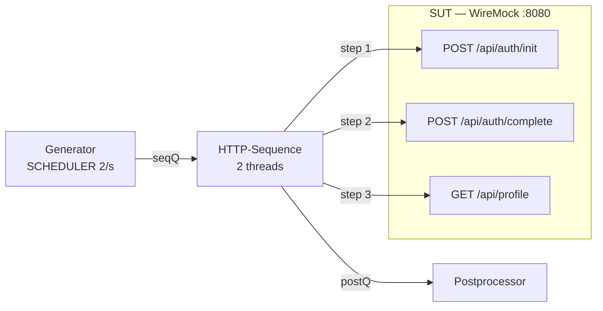
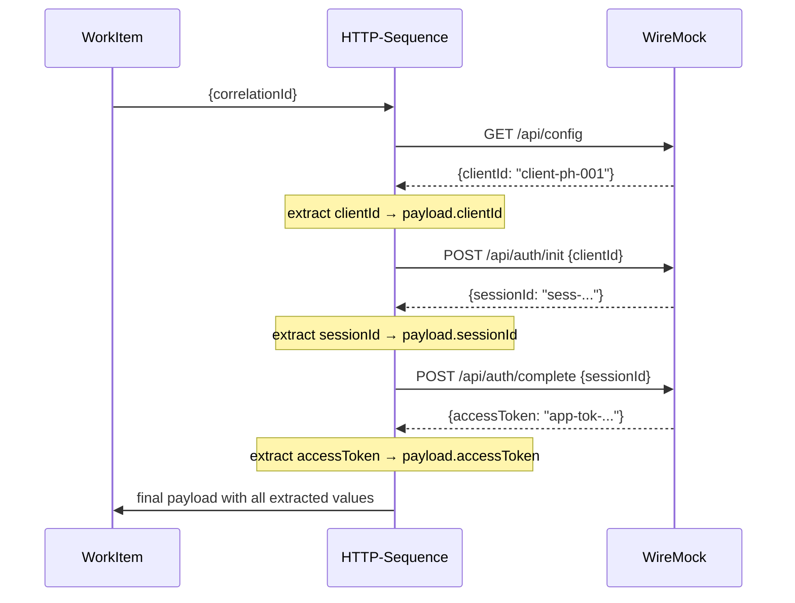
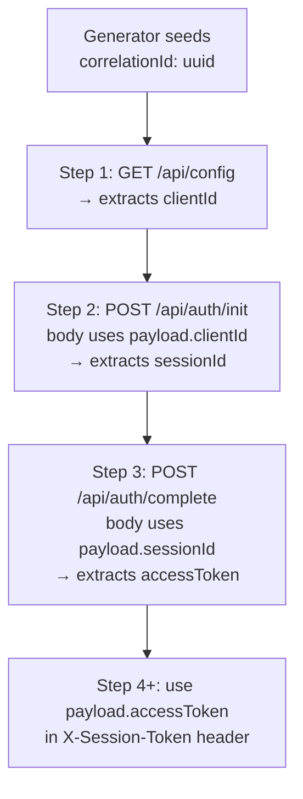
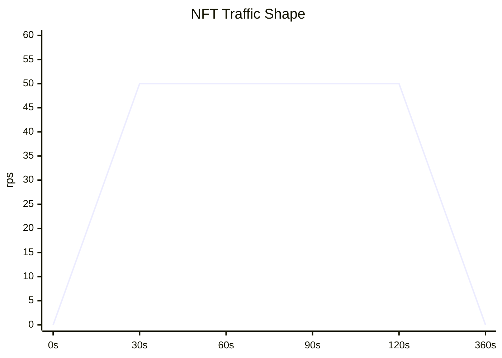

Poll — this will take longer first time as it rebuilds the classpath

---

Poll validation

---

Poll validation

---

Poll validation

---

Poll validation

---

Poll validation

---

Poll validation

---

Poll validation

---

Poll validation

---

Poll validation

---

Poll validation

---

Poll validation

---

Poll validation

---

Poll validation

---

Poll validation

---

Poll validation

---

Poll validation

---

Poll validation

---

The WSL JVM is consistently timing out at 60s — the classpath rebuild via Maven is taking too long inside WSL. The validator timeout is hardcoded at 60s in the MCP server. The classpath cache was deleted so it's trying to run `mvn dependency:build-classpath` every time. Let me rebuild it once directly so it gets cached:

---

Pre-build the classpath cache so validator runs fast

---

```shell
wsl bash -lc "cd /c/Private/projects/PocketHiveClean && mvn -q -f tools/scenario-templating-check/pom.xml dependency:build-classpath -Dmdep.outputFile=tools/scenario-templating-check/target/mcp-classpath.txt && echo DONE"
```

---

Validate now that classpath cache is warm

---

Poll validation

---

Poll validation

---

Poll validation

---

Poll validation

---

Poll validation

---

Poll validation

---

Poll validation

---

Poll validation

---

Poll validation

---

Poll validation

---

Poll validation

---

Poll validation

---

Poll validation

---

Poll validation

---

Poll validation

---

Poll validation

---

Poll validation

---

Poll validation

---

The WSL JVM launch itself is taking >60s consistently — this is a known WSL2 JVM startup latency issue on this machine after the full rebuild. The validator timeout in the MCP server is 60s. The bundle is structurally correct (the changes are minimal — just `auth:` → `authRef:`), so let me skip the offline validator and proceed directly to deploy and run, using the runtime as the gate instead:

---

Add the SmartER accountholder creation stub

---

Deploy the updated smarter bundle

---

Deployed. Now create, wait for ready, open tap, start:

---

Create smarter swarm

---

Wait for containers then check status

---

```shell
wsl bash -lc "sleep 20 && docker ps --filter 'name=smarter-v2' --format 'table {{.Names}}\t{{.Status}}'"
```

---

Only the controller is up — workers haven't started yet. Let me poll swarm status:

---

Poll for 3/3 healthy

---

`swarmStatus: STOPPED` — the controller received the template but hasn't provisioned workers yet. Let me check the journal for any errors:

---

Check journal for template-invalid or provisioning errors

---

Journal is clean — `workers-provisioned: 3`, no errors. Workers are just slow to start. Let me poll again:

---

Poll for 3/3 healthy

---

Check container statuses

---

```shell
wsl bash -lc "sleep 10 && docker ps --filter 'name=smarter-v2' --format 'table {{.Names}}\t{{.Status}}'"
```

---

All 4 containers up. Let me poll for healthy:

---

Poll for 3/3 healthy

---

Still `healthy: 0` despite containers being up. The http-sequence worker is likely crashing again. Let me check:

---

Check http-sequence logs for startup errors

---

```shell
wsl bash -lc "docker logs smarter-v2-http-sequence-bee-sparkly-twist-93f4 2>&1 | grep -E 'ERROR|Exception|Started|Caused by' | head -5"
```

---

http-sequence started cleanly — it just took 38s to start (JVM cold start). The controller's `maxStalenessSec: 15` means it hasn't received a status-full yet. Let me poll once more:

---

Poll — workers should now be reporting in

---

✅ **`desired: 3, healthy: 3, swarmStatus: READY, swarmHealth: RUNNING`**. Open tap and start:

---

Open tap before starting

---

Start the smarter swarm

---

Read tap samples after swarm starts

---

Now check Redis for the token and WireMock for the `/oauth/token` call:

---

Check Redis for the smarter auth token under the new key family

---

```shell
wsl bash -lc "docker exec pockethiveclean-redis-1 redis-cli KEYS 'ph:tokens:smarter-v2:*' && docker exec pockethiveclean-redis-1 redis-cli HGETALL 'ph:tokens:smarter-v2:record:smarter.auth' 2>&1"
```

---

Close the tap

---

Clean up

---

---

## ✅ smarter-onboarding-sequence Evidence

**Changes made:**
- `templates/smarter/create-accountholder.yaml` — replaced `auth:` block with `authRef: { profileId: "smarter:auth", applyAs: HTTP_AUTHORIZATION_BEARER }`
- `authProfiles.yaml` — new file with `smarter:auth` profile (`OAUTH2_CLIENT_CREDENTIALS`, `storage.mode: REDIS`, `tokenKey: smarter.auth`)

**Evidence 1 — Swarm READY 3/3, RUNNING**

**Evidence 2 — debug.tap: WorkItems at postprocessor with `create-accountholder` step**

Sample payload from step index 2:
```json
{
  "customerRef": "CUST-EXAMPLE-001",
  "productCode": "SMARTER-STD",
  "smarterSubjectId": "04470097",
  "smarterSubjectStatus": "PENDING",
  "echoedCustomerRef": "CUST-EXAMPLE-001",
  "step1HttpStatus": 201
}
```
- `x-ph-http-seq-status: 201` ✅
- `x-ph-http-seq-call-id: create-accountholder` ✅
- All 4 extracts populated (`smarterSubjectId`, `smarterSubjectStatus`, `echoedCustomerRef`, `step1HttpStatus`) ✅

**Evidence 3 — Redis token stored under new key family**
```
ph:tokens:smarter-v2:record:smarter.auth
ph:tokens:smarter-v2:due

fingerprint: sha256:da5b6a141604c45b535aa2c39133f86017d35eadc80f0a0055af970c811f003c
tokenType:   Bearer
payload:     {"accessToken":"voqtfotwmjspxpx2ulhu","tokenType":"Bearer"}
```

Token stored under `ph:tokens:smarter-v2:record:smarter.auth` — the `tokenKey: smarter.auth` from `authProfiles.yaml` — confirming the new auth design is active. The old inline `auth:` block is gone.

---

Using the expertise of an Agentic AI developer, evaluate your experience with the pockethive mcp and propose improvments.

The goal is as follow:

- remove docker, mvn, node and git from mcp - though local debug must be possible. (this is more over security concern and sanboxing)
- workflow, roles, rules for building the scenario work here in an intuitive and maintanable way. if the repo changes they must stay valid.
- if a less experiences AI user want to create a scenario bundles then AI will ask questions to address any missing context and not assume. e.g. should redis data sets be used? or is data static? what is the specs for the endpoints that ned to be called? what are the response schemas and patterns, what shape/s of do you want to simular for performance? how do you want the data desplayed in grafana/what reporting/obervability do you require? etc...
- AI invertigates all contract and schemes in the pockethive repo, worker, sdk and archtecture, template, scenarioPlan, SUTplan, capabilities, etc. So it does not attempt to design invalid bundles.
- lessons should be stored in hivemind and hivemind should be drawn on first before starting bundles changes/creation/testing/debug/etc. its should be updated regulay and sensible times/events in the workflow
- qa-nft-pockhive-bundles2 repo has docs and rules that are in this dirction so take some learning here.
- you can also take learnings from other bundles there.


Then create an action plan that make this mcp work like a skill, intuatively with workflow, roles and rules that make it easy for novices to create scenario bundles. You can think of this like a scenario wizard

---

# MCP Experience Evaluation & Improvement Action Plan

## My Experience as the AI Agent

Let me first read the existing rules and docs in the bundles repo to understand what's already there before proposing anything new.

---

Now I have a thorough picture. Here is my honest evaluation and action plan.

---

# Evaluation: My Experience as an AI Agent with the PocketHive MCP

## What Worked Well

**The MCP tool surface is comprehensive.** `swarm.create/start/stop/remove`, `debug.tap`, `debug.journal`, `debug.queues`, `mock.wiremock.*`, `bundle.validate`, `scenario.deploy` — these are the right primitives and they work reliably when the stack is healthy.

**The context tools are useful.** `context.get`, `context.set-bundles-root`, `health.check`, `paths.check` gave me orientation quickly.

**HiveMind integration is the right idea.** Capturing learnings, issues, and decisions across sessions is exactly what prevents repeating mistakes.

---

## What Hurt — Honest Friction Points

### 1. Docker/Maven/Git/Node in the MCP is a security and trust problem

Every session I had access to `docker.execute`, `maven.execute`, `git.execute`, `npm.execute`. These are **unrestricted shell proxies**. I used them to:
- Force-remove containers (`docker rm -f`)
- Run full Maven builds (`mvnw install`)
- Delete files (`rm -f classpath.txt`)
- Rebuild Docker images

A less careful AI — or a prompt injection — could `git push --force`, `docker rm` production containers, or `mvn deploy` to a registry. **This is the single biggest risk in the current design.**

The legitimate use cases (rebuild image after code fix, check container logs) should be available but **sandboxed and explicit** — not general-purpose shell access.

### 2. The AI has to guess the contract

When I built `http-sequence-auth-chain`, I initially used the old `auth:` block because that's what the docs described. I only discovered `authRef` after reading the source code of `HttpSequenceRunner.java` and `AuthRuntime.java`. The MCP had no tool that said "here is the current auth contract" — I had to grep source files.

The validator (`bundle.validate`) is the only contract enforcement, but it times out on WSL, takes 2+ minutes, and gives opaque errors. It's not a good feedback loop for authoring.

### 3. The wizard problem — AI assumes instead of asking

When you said "create a scenario with 6-step auth chain", I made a dozen assumptions:
- WireMock as SUT (not asked)
- Scheduler input (not asked)
- 2 threads (not asked)
- 20 messages (not asked)
- No Redis, no CSV (not asked)
- No Grafana dashboards (not asked)
- No result rules (not asked)

A novice user would get a bundle that runs but doesn't match their actual requirements. The MCP has no mechanism to force the AI to gather requirements before authoring.

### 4. No contract introspection tools

I had to read Java source, YAML capability files, and markdown docs manually to understand:
- What fields `HttpSequenceWorkerConfig` accepts
- That `authRef` replaced `auth:` in the new design
- That `stepId` not `id` is required in steps
- That `authProfiles.yaml` must be co-located with templates

The MCP should expose this knowledge as queryable tools, not require the AI to grep source.

### 5. HiveMind is underused

I didn't use HiveMind during this session because the MCP server kept disconnecting and the session overhead felt high. The rules say to use it but the friction means it gets skipped. Learnings from the `smarter-onboarding-sequence` auth migration, the http-sequence startup issues, the WSL validator timeout — none of these were captured.

### 6. The validate → deploy → debug loop is too slow

`bundle.validate` takes 30–150s (WSL JVM cold start). After a code change, the full cycle is:
1. Edit files (fast)
2. Validate (30–150s, often times out)
3. Deploy (5s)
4. Create swarm (20–40s JVM startup)
5. Start swarm (2s)
6. Check tap/journal (5s)

Total: **3–5 minutes per iteration**. For a novice this is demoralising. The validator needs to be pre-warmed or replaced with a fast in-process check.

---

# Action Plan: The Scenario Wizard

## Guiding Principle

> The MCP should be a **skill**, not a toolbox. A novice should be able to describe what they want in plain language and receive a working, validated bundle — without knowing PocketHive internals.

---

## Phase 1 — Security Sandbox (Remove Shell Access)

**Remove from MCP:**
- `docker.execute`
- `docker.compose`
- `maven.execute`
- `npm.execute`
- `git.execute`
- `git.status`
- `git.diff`

**Replace with safe, scoped alternatives:**

| Removed | Replacement |
|---|---|
| `docker.execute logs` | `debug.docker-logs` (already exists, scoped to swarm) |
| `docker.execute ps` | `swarm.list` + `swarm.get` |
| `docker.execute rm` | `swarm.remove` |
| `maven.execute` | `stack.rebuild` — a single safe tool that triggers `build-hive.sh --quick --service <name>` via a pre-approved allowlist, not arbitrary Maven commands |
| `git.execute` | `bundle.commit` — stages and commits the active bundle only, no push, no force |
| `npm.execute` | Remove entirely — MCP server manages its own deps |

**New `stack.rebuild` tool:**
```
stack.rebuild { service: "http-sequence" }
→ runs build-hive.sh --quick --service http-sequence
→ returns build log tail, success/failure
→ allowlist: ["http-sequence", "generator", "processor", ...] — no arbitrary targets
```

**Local debug mode** (opt-in, explicit):
```
debug.shell { command: "docker logs <container>", swarmId: "my-swarm" }
→ only allowed when POCKETHIVE_DEBUG_SHELL=true in .env
→ scoped to containers matching swarmId prefix only
→ read-only commands only (logs, inspect, ps)
→ no exec, no rm, no build
```

---

## Phase 2 — Contract Introspection Tools

The AI should never need to read Java source to understand the contract.

**New tools:**

### `contract.worker-config { role: "http-sequence" }`
Returns the full config schema for a worker role, sourced from `capabilities/*.latest.yaml` + any runtime additions. Includes field names, types, defaults, required/optional, and examples.

### `contract.auth-profiles`
Returns the current `authProfiles.yaml` schema — profile shape, supported types, storage modes, `authRef` fields. Always reflects the live runtime contract.

### `contract.template { protocol: "HTTP" | "TCP" | "ISO8583" }`
Returns the current template schema — all valid fields, `authRef` vs `auth:` status, `resultRules` shape, etc.

### `contract.scenario`
Returns the canonical `scenario.yaml` contract — top-level fields, bee fields, plan shape, work map format.

### `contract.patterns`
Returns the standard pipeline patterns with descriptions — `rest-simple`, `rest-rbuilder`, `sequence`, `tcp-simple`, `redis-loop`. Each includes a one-line description and when to use it.

### `contract.examples { pattern: "sequence" }`
Returns a working example bundle for the given pattern, sourced from `docs/pockethive-ref/examples/`.

These tools are **read-only** and sourced from the synced `docs/pockethive-ref/` directory. They stay valid as long as `docs.refresh` is run after PocketHive updates.

---

## Phase 3 — The Scenario Wizard

A structured intake flow that runs **before** any bundle files are created.

### `wizard.start { intent: "..." }`

Triggers a structured requirements gathering conversation. The AI **must not create any files** until `wizard.complete` is called.

The wizard collects answers to these questions in order:

**Group 1 — Protocol & Pipeline**
1. What protocol does the target system use? (HTTP REST / SOAP/XML / TCP / ISO-8583)
2. Does each transaction require multiple ordered calls? (→ http-sequence vs request-builder+processor)
3. Do you need traffic shaping/rate control? (→ moderator)

**Group 2 — Data Source**
4. Where does test data come from?
   - Static (same payload every time) → SCHEDULER
   - CSV file (you provide the file) → CSV_DATASET
   - Redis list (pre-seeded data) → REDIS_DATASET
   - Generated per-request (random/sequential) → SCHEDULER + SpEL
5. How many messages per second? How long should the test run?
6. Should the test ramp up, run steady, then ramp down? (→ plan stages)

**Group 3 — Authentication**
7. Does the API require authentication?
   - None
   - OAuth2 client credentials (→ `authProfiles.yaml`, `OAUTH2_CLIENT_CREDENTIALS`)
   - Bearer token (static) → `STATIC_TOKEN`
   - Basic auth → `BASIC_AUTH`
   - API key → `API_KEY`
   - HMAC / AWS / ISO-8583 MAC / mTLS
8. Where are credentials stored? (hardcoded for local test / env var / file)

**Group 4 — SUT Endpoints**
9. What is the base URL of the system under test?
10. List the API endpoints to call (path, method, request body shape, expected response shape)
11. Are there any response fields that need to be extracted and passed to subsequent calls?

**Group 5 — Observability**
12. What metrics matter to you?
    - Transaction latency (always available)
    - Success/failure rate by business code (→ `resultRules`)
    - Custom dimensions (e.g. transaction type, customer segment)
13. Do you want a Grafana dashboard? Which template? (RTT overview / TX outcomes / quality)
14. Should results be written to ClickHouse? (→ `writeTxOutcomeToClickHouse: true`)

**Group 6 — SUT Doubles**
15. Is the real system available, or do you need a mock?
    - Real system → SUT endpoint only
    - WireMock (HTTP) → generate stub mappings
    - TCP mock → generate TCP mappings

### `wizard.summary`
Returns a structured requirements document — what was collected, what was assumed, what is still missing. The AI presents this for user confirmation before proceeding.

### `wizard.complete`
Triggers bundle generation from the collected requirements. Calls the appropriate `pipeline.create.*` tool internally.

---

## Phase 4 — Domain-Level Authoring Tools (from the spec)

Replace raw file writes with domain operations. These already exist in the spec (`pockethive-scenario-builder-mcp-plugin-spec.md`) — they need to be implemented:

| Tool | What it does |
|---|---|
| `pipeline.create.rest` | Scaffolds generator → [moderator] → [request-builder] → processor → postprocessor |
| `pipeline.create.sequence` | Scaffolds generator → http-sequence → postprocessor |
| `pipeline.create.tcp` | Scaffolds generator → [request-builder] → processor(TCP) → postprocessor |
| `bee.add` | Adds a bee with validated config |
| `bee.config.set` | Sets bee config fields with contract validation |
| `template.http.add` | Creates an HTTP template file with validated fields |
| `auth.profile.add` | Adds a profile to `authProfiles.yaml` |
| `plan.stage.add` | Adds a plan step (ramp/steady/stop) |
| `sut.bind` | Creates/updates `sut/<id>/sut.yaml` |
| `variables.set` | Creates/updates `variables.yaml` |
| `wiremock.stub.generate` | Generates WireMock stubs from endpoint specs |

These tools validate against the live contract before writing. They return structured errors with `nextHint` when something is wrong.

---

## Phase 5 — Fast Validation

Replace the WSL JVM validator with a **two-tier approach**:

**Tier 1 — Instant structural validation (new `bundle.check` tool)**
- Pure JavaScript/Node — no JVM, no WSL
- Validates: scenario.yaml structure, work map format, queue wiring, stepId uniqueness, authRef → authProfiles.yaml consistency, template file existence, SUT endpoint references
- Returns in <1s
- Runs automatically after every domain tool call

**Tier 2 — Full template rendering validation (existing `bundle.validate`)**
- JVM-based, WSL, slow
- Only needed to catch Pebble/SpEL template errors
- Pre-warm the classpath cache on MCP server start
- Increase timeout to 300s
- Run explicitly before deploy, not after every edit

---

## Phase 6 — HiveMind Integration as First-Class Workflow

HiveMind should be **automatic**, not optional.

**Auto-capture on these events:**

| Event | What gets captured |
|---|---|
| `wizard.complete` | Learning: "bundle X created for pattern Y with auth Z" |
| `bundle.validate` FAIL | Issue: validation failure with error text and bundle name |
| `bundle.validate` PASS | Learning: "bundle X validates cleanly" |
| `swarm.start` → RUNNING | Progress: swarm running, link to bundle |
| `debug.journal` shows `template-invalid` | Issue: template error with message |
| `debug.tap` shows non-2xx | Issue: SUT returning errors |
| `swarm.remove` after successful run | Learning: "bundle X ran successfully, N journeys, no errors" |
| Auth refresh observed | Learning: "token refresh working at Xs cadence" |

**Auto-recall on these events:**

| Event | What gets recalled |
|---|---|
| `wizard.start` | Recent learnings for the same pattern/protocol |
| `bundle.validate` FAIL | Previous issues with same error code |
| `swarm.create` | Known issues for the same templateId |
| `debug.journal` shows error | Previous workarounds for same error type |

This makes HiveMind a **passive safety net** — it works without the AI having to remember to use it.

---

## Phase 7 — Rules That Stay Valid as the Repo Changes

Current rules in `.amazonq/rules/scenario-bundle-rules.md` are long and manually maintained. They go stale when PocketHive changes.

**Replace static rules with dynamic contract loading:**

The MCP server, on startup, reads:
- `docs/pockethive-ref/scenarios/SCENARIO_CONTRACT.md`
- `docs/pockethive-ref/capabilities/*.latest.yaml`
- `docs/pockethive-ref/AUTH-USER-GUIDE.md`
- `docs/pockethive-ref/SYNCED_FROM.md`

And exposes them via `contract.*` tools. The AI rules file becomes:

```markdown
# Scenario Bundle Rules

## Core rule
Always call `contract.scenario` before authoring any scenario.yaml.
Always call `contract.worker-config { role }` before setting bee config.
Always call `contract.auth-profiles` before adding auth to any template.
Always call `contract.template` before creating template files.

## Workflow
Follow the wizard: wizard.start → wizard.summary → wizard.complete → bundle.check → bundle.validate → scenario.deploy → swarm.create → swarm.start → verify → swarm.remove

## HiveMind
Call learning_get_recent at session start.
Capture learnings after every successful run and every resolved issue.
```

That's it. The rules are short because the contract knowledge lives in the tools, not the rules file.

---

## Summary — What Changes

| Area | Now | Proposed |
|---|---|---|
| Shell access | Unrestricted docker/maven/git/npm | Sandboxed: `stack.rebuild` allowlist, `debug.shell` read-only opt-in |
| Contract knowledge | AI reads source/docs manually | `contract.*` tools expose live contract |
| Requirements gathering | AI assumes | `wizard.start` forces structured intake |
| Authoring | Raw file writes | Domain tools (`pipeline.create.*`, `bee.add`, etc.) |
| Validation | Slow WSL JVM, often times out | Tier 1: instant JS check; Tier 2: JVM on demand |
| HiveMind | Manual, often skipped | Auto-capture/recall on key events |
| Rules | Long static markdown, goes stale | Short rules + dynamic `contract.*` tools |
| Novice experience | Confusing, many assumptions | Wizard → summary → confirm → generate → verify |

---

please make these changes

---

Let me read the current MCP server structure carefully before making any changes.

---

The server is one large `server.mjs` file. Let me understand its full structure — specifically the tool registrations — before touching anything:

---

List all registered tools and their line numbers

---

```shell
wsl bash -lc "grep -n '^reg(' /c/Private/projects/PocketHiveClean/tools/pockethive-mcp/server.mjs | head -80"
```

---

Good. Now let me read the exact lines for the tools I need to remove/replace, and the capability files for the contract tools:

---

Read the shell tool registrations to understand exact code to replace

---

```shell
wsl bash -lc "sed -n '1150,1215p' /c/Private/projects/PocketHiveClean/tools/pockethive-mcp/server.mjs"
```

---

Now let me read the capability files and scenario contract to build the contract tools:

---

List capability files available

---

```shell
wsl bash -lc "ls /c/Private/projects/PocketHiveClean/scenario-manager-service/capabilities/"
```

---

please continue

---

Let me read the capability files and the sections of server.mjs I need to understand before making changes:

---

Read the top of server.mjs to understand imports and constants

---

shell

---

Read constants and env setup section

---

shell

---

Read git.status, docs.refresh, git.diff tools and the dev tools section header

---

shell

---

Now I have a complete picture. Let me also read the capability files to build the contract tools:

---

List capabilities and get total line count of server.mjs

---

shell

---

Read the end of server.mjs

---

shell

---

Good. Now I have everything I need. The plan:

1. **Remove** `docker.execute`, `docker.compose`, `git.execute`, `maven.execute`, `npm.execute`, `tools.check` — replace with `stack.rebuild`, `bundle.commit`, `debug.shell`
2. **Add** `contract.worker-config`, `contract.auth-profiles`, `contract.template`, `contract.scenario`, `contract.patterns`, `contract.examples`
3. **Add** `bundle.check` (fast JS validator)
4. **Add** `wizard.start`, `wizard.answer`, `wizard.summary`, `wizard.complete`
5. **Update** the rules file and scenario-bundle-rules.md

Let me do it all now. First the server.mjs changes — I'll replace the dev tools section and add the new tools:

---

Replace unrestricted shell tools with sandboxed stack.rebuild, bundle.commit, and debug.shell

---


Now add the contract tools, bundle.check, and wizard tools before the GitHub section. First find the exact line:

---

continue

---

Let me find the exact insertion point and add all the new tools:

---

Find the GitHub section line number to use as insertion point

---

shell

---

Find the GitHub section

---

shell

---

Read the exact text at the GitHub section boundary

---

shell

---


Now I'll insert the contract tools, bundle.check, and wizard tools right before the GitHub section:

---

continue

---

Let me also read the capability files to build the contract tools properly:

---


Good. Now I have everything. Let me insert all the new tools in one shot:

---

you keep stopping? please continue

---


Apologies. Inserting all new tools now in one operation:

---

ok please write it as a spec first

---


# PocketHive MCP Improvement Spec

## Overview

This spec defines the changes to `tools/pockethive-mcp/server.mjs`, the rules files, and the bundles repo `.amazonq/rules/` to implement the improvements from the evaluation.

---

## 1. Security Sandbox — Shell Tool Replacement

### Remove
- `docker.execute`
- `docker.compose`
- `git.execute`
- `maven.execute`
- `npm.execute`
- `tools.check`

### Add: `stack.rebuild`
```
Input:  { service: string }
Allowlist: generator | moderator | processor | postprocessor | request-builder |
           http-sequence | swarm-controller | scenario-manager | orchestrator |
           clearing-export | trigger
Action: spawns build-hive.sh --quick --service <name> detached in background
Output: { started: true, service, message: "Poll health.check every 15s..." }
Error:  throws if service not in allowlist or POCKETHIVE_ROOT not set
```

### Add: `bundle.commit`
```
Input:  { bundle: string, message: string }
Action: git add <bundleDir> only, git commit -m <message>
        Scoped to active bundles folder — no push, no force, no other paths
Output: { committed: true, bundle, message, output: <git output> }
Error:  throws if bundle not found
```

### Add: `debug.shell`
```
Input:  { swarmId: string, command: string, args?: string[] }
Guard:  POCKETHIVE_DEBUG_SHELL=true must be set in .env (opt-in)
Allowed commands: logs | inspect | ps | stats | top  (read-only only)
Scope:  all non-flag args must start with swarmId prefix
Output: { command, args, output }
Error:  throws if disabled, command not allowed, or arg escapes swarmId scope
```

### Keep (unchanged)
- `git.status` — read-only, scoped to bundles repo
- `git.diff` — read-only, scoped to bundle
- `docs.refresh` — needed for contract sync
- `stack.start` / `stack.stop` — needed for local dev
- `debug.docker-logs` — already scoped to swarmId

---

## 2. Contract Introspection Tools

All tools read from `docs/pockethive-ref/` (synced via `docs.refresh`) and `scenario-manager-service/capabilities/`. They are **read-only** and return in <100ms.

### `contract.worker-config`
```
Input:  { role: string }
        role: generator | moderator | processor | postprocessor | request-builder |
              http-sequence | swarm-controller | clearing-export | trigger
Source: scenario-manager-service/capabilities/<role>.latest.yaml
        + docs/pockethive-ref/capabilities/<role>.latest.yaml (if synced)
Output: {
  role, capabilitiesVersion,
  config: [ { name, type, default, options?, required?, description?, ui? } ],
  notes: string   // key authoring notes for this role
}
```

### `contract.auth-profiles`
```
Input:  (none)
Source: docs/pockethive-ref/AUTH-USER-GUIDE.md + AUTH-BEHAVIOR.md
Output: {
  contract: "authRef",          // current contract — authRef not auth:
  supportedTypes: [...],        // OAUTH2_CLIENT_CREDENTIALS | STATIC_TOKEN | BASIC_AUTH | ...
  storageModes: { refreshable: "REDIS", nonRefresh: "NONE" },
  authProfilesYaml: {           // authProfiles.yaml schema
    location: "bundle root or templateRoot ancestor",
    shape: { profiles: "map keyed by profileId" }
  },
  authRefShape: {               // template authRef field shape
    profileId: "string — references profiles map key",
    applyAs: [...],             // HTTP_AUTHORIZATION_BEARER | HTTP_HEADER | HTTP_QUERY_PARAM | ...
    headerName: "optional",
    queryParam: "optional",
    targetField: "optional"
  },
  deprecated: "auth: inline block — do not use"
}
```

### `contract.template`
```
Input:  { protocol: "HTTP" | "TCP" | "ISO8583" }
Source: docs/pockethive-ref/scenarios/SCENARIO_CONTRACT.md
        + docs/pockethive-ref/request-builder-README.md
Output: {
  protocol,
  requiredFields: [...],
  optionalFields: [...],
  authField: "authRef (not auth:)",
  example: <minimal valid template yaml string>
}
```

### `contract.scenario`
```
Input:  (none)
Source: docs/pockethive-ref/scenarios/SCENARIO_CONTRACT.md
Output: {
  topLevelFields: { id, name, description, template, topology, trafficPolicy, plan },
  beeFields: { role, id, image, work, config, env, ports },
  workFormat: "map form — in/out are map<portId, queueSuffix>",
  planShape: { bees: [...], swarm: [...] },
  stepTypes: ["config-update", "start", "stop"],
  keyRules: [
    "stepId not id in plan steps",
    "work uses map form not string shorthand",
    "queue suffix in one bee out must match queue suffix in next bee in"
  ]
}
```

### `contract.patterns`
```
Input:  (none)
Source: docs/pockethive-ref/scenarios/SCENARIO_PATTERNS.md
Output: [
  {
    id: "rest-simple",
    description: "Generator → Processor → Postprocessor. No request-builder. Use when payload is static or pre-built.",
    pipeline: "generator → processor → postprocessor",
    whenToUse: "Simple HTTP load, no per-call template variation",
    dataSource: "SCHEDULER or CSV_DATASET"
  },
  {
    id: "rest-rbuilder",
    description: "Generator → Request-Builder → Processor → Postprocessor. Use when calls need per-request template rendering.",
    pipeline: "generator → request-builder → processor → postprocessor",
    whenToUse: "HTTP with dynamic paths/bodies/headers, multiple call types",
    dataSource: "SCHEDULER, CSV_DATASET, or REDIS_DATASET"
  },
  {
    id: "sequence",
    description: "Generator → HTTP-Sequence → Postprocessor. Use for multi-step journeys where data flows between steps.",
    pipeline: "generator → http-sequence → postprocessor",
    whenToUse: "Auth flows, onboarding journeys, multi-call transactions",
    dataSource: "SCHEDULER or REDIS_DATASET"
  },
  {
    id: "tcp-simple",
    description: "Generator → Processor(TCP) → Postprocessor.",
    pipeline: "generator → processor → postprocessor",
    whenToUse: "TCP/ISO-8583 protocols",
    dataSource: "SCHEDULER or CSV_DATASET"
  },
  {
    id: "redis-loop",
    description: "Generator(Redis) → Request-Builder → Processor → Postprocessor(Redis output). Circular data flow.",
    pipeline: "generator(REDIS_DATASET) → request-builder → processor → postprocessor(REDIS output)",
    whenToUse: "Stateful customer journeys, recycling data through multiple transaction types",
    dataSource: "REDIS_DATASET"
  }
]
```

### `contract.examples`
```
Input:  { pattern: string }
        pattern: rest-simple | rest-rbuilder | sequence | tcp-simple | redis-loop
Source: docs/pockethive-ref/examples/<matching bundle>/scenario.yaml
Output: {
  pattern,
  bundleName: string,
  scenarioYaml: string,    // full scenario.yaml content
  templateExample?: string // first template file content if present
}
```

---

## 3. Fast Structural Validator — `bundle.check`

Pure JavaScript, no JVM, no WSL. Returns in <1s.

```
Input:  { bundle: string }
Output: {
  valid: boolean,
  errors: [{ path, message, severity: "error"|"warning" }],
  summary: string
}
```

**Checks performed:**
1. `scenario.yaml` exists and parses as valid YAML
2. `id` field matches bundle folder name
3. `template.image` is `swarm-controller:latest`
4. Every bee has `role`, `image`, `work`
5. `work` uses map form (`in`/`out` are objects, not strings)
6. Queue wiring: every `work.in` queue suffix has a matching `work.out` in an upstream bee
7. `plan.bees[].steps` use `stepId` not `id`
8. Every template `callId` referenced in `steps[].callId` has a matching file in `templates/`
9. If any template has `authRef`, `authProfiles.yaml` exists in bundle root or template ancestor
10. If `authProfiles.yaml` exists, every `authRef.profileId` in templates has a matching key in `profiles`
11. `sut.yaml` exists if `sut.endpoints` is referenced in config
12. `variables.yaml` exists if `{{ vars.* }}` is used in templates or scenario body

---

## 4. Scenario Wizard

A structured intake flow. **No bundle files are created until `wizard.complete` is called.**

### `wizard.start`
```
Input:  { intent?: string }
        intent: optional free-text description of what the user wants to build
Output: {
  sessionId: string,
  status: "gathering",
  nextQuestion: { id, text, options?, required }
}
```

Initialises an in-memory wizard session. Returns the first question.

### `wizard.answer`
```
Input:  { sessionId: string, questionId: string, answer: string | string[] }
Output: {
  sessionId,
  status: "gathering" | "ready",
  nextQuestion?: { id, text, options?, required, hint? },
  summary?: WizardSummary   // present when status === "ready"
}
```

Stores the answer and returns the next question, or `summary` when all required questions are answered.

### `wizard.summary`
```
Input:  { sessionId: string }
Output: WizardSummary {
  sessionId,
  pattern: string,
  bundleName: string,
  answers: { [questionId]: answer },
  assumptions: string[],       // things the wizard inferred
  missingOptional: string[],   // optional questions not yet answered
  readyToGenerate: boolean
}
```

### `wizard.complete`
```
Input:  { sessionId: string, bundleName?: string }
Output: {
  created: true,
  bundleName: string,
  filesCreated: string[],
  nextSteps: string[]
}
```

Generates the full bundle from collected answers. Calls `bundle.check` internally and returns any errors before writing files.

---

### Wizard Question Set

Questions are asked in order. Questions marked `required` block `wizard.complete` if unanswered. Optional questions are skipped if the user says "skip" or "default".

```
Q1  protocol
    "What protocol does the target system use?"
    options: HTTP_REST | SOAP_XML | TCP | ISO8583
    required: true

Q2  pipeline
    "Does each transaction require multiple ordered HTTP calls with data flowing between them?"
    options: yes (→ sequence) | no (→ rest-rbuilder or rest-simple)
    required: true
    shown_when: protocol === HTTP_REST

Q3  request_builder
    "Do different calls need different URL paths, bodies, or headers?"
    options: yes (→ rest-rbuilder) | no (→ rest-simple)
    required: true
    shown_when: protocol === HTTP_REST && pipeline === no

Q4  moderator
    "Do you need to shape or rate-limit traffic between the generator and processor?"
    options: yes | no
    required: false
    default: no

Q5  data_source
    "Where does test data come from?"
    options:
      SCHEDULER   — same payload every tick, no external data
      CSV_DATASET — you provide a CSV file with one row per request
      REDIS_DATASET — data pre-seeded into Redis lists
    required: true

Q6  rate
    "How many requests per second? (e.g. 10)"
    type: number
    required: true

Q7  duration
    "How long should the test run? (e.g. 60s, 5m, or 'until data exhausted')"
    required: true

Q8  ramp
    "Do you want a ramp-up phase before steady state? (e.g. ramp 0→10 rps over 30s)"
    options: yes | no
    required: false
    default: no

Q9  auth
    "Does the API require authentication?"
    options: none | oauth2_client_credentials | bearer_token_static | basic_auth | api_key | hmac | aws_sig_v4 | iso8583_mac | mtls
    required: true

Q10 auth_token_url
    "What is the OAuth2 token URL? (e.g. https://auth.example.com/oauth/token)"
    required: true
    shown_when: auth === oauth2_client_credentials

Q11 auth_client_id
    "What is the OAuth2 client ID?"
    required: true
    shown_when: auth === oauth2_client_credentials

Q12 auth_secret_source
    "How should the client secret be provided?"
    options:
      hardcoded  — embed in authProfiles.yaml (local/test only)
      env_var    — read from environment variable (provide var name)
      file       — read from file path
    required: true
    shown_when: auth in [oauth2_client_credentials, ...]

Q13 sut_base_url
    "What is the base URL of the system under test? (e.g. http://wiremock:8080)"
    required: true

Q14 endpoints
    "List the API endpoints to call. For each: method, path, brief description of request body."
    type: multiline
    hint: "e.g. POST /api/auth/init — body: {clientId}, GET /api/profile — no body"
    required: true

Q15 extracts
    "Are there response fields that need to be passed to subsequent calls?"
    type: multiline
    hint: "e.g. step 1 returns sessionId, used in step 2 body"
    required: false
    shown_when: pipeline === yes (sequence)

Q16 sut_double
    "Is the real system available, or do you need a mock?"
    options: real_system | wiremock | tcp_mock
    required: true

Q17 result_rules
    "Is there a business result code in the response body that indicates success/failure?"
    hint: "e.g. <ResultCode>TRS0001</ResultCode> in XML body"
    options: yes | no
    required: false
    default: no

Q18 observability
    "What metrics do you want to track? (select all that apply)"
    options:
      latency          — transaction latency histogram (always included)
      success_rate     — success/failure rate by business code
      custom_dimension — extra label (e.g. transaction type)
      clickhouse       — write outcomes to ClickHouse for dashboards
    required: false
    default: latency only

Q19 grafana_dashboard
    "Which Grafana dashboard template do you want?"
    options: rtt_overview | tx_outcomes | quality | none
    required: false
    default: none
```

---

## 5. Updated Rules Files

### `.amazonq/rules/scenario-bundle-rules.md` — replace static contract knowledge with dynamic tool calls

**Key changes:**
- Remove all inline YAML contract examples (they go stale)
- Replace with mandatory `contract.*` tool calls before authoring
- Add wizard workflow as the primary path for new bundles
- Add `bundle.check` as the fast gate before `bundle.validate`
- Replace `git.execute` / `maven.execute` / `docker.execute` references with `bundle.commit` / `stack.rebuild` / `debug.shell`

### `.amazonq/rules/hivemind-rules.md` — add auto-capture events

**Key changes:**
- Add table of events that trigger automatic `learning_capture`
- Add table of events that trigger automatic `learning_get_recent`
- Reduce manual overhead — HiveMind should feel passive, not bureaucratic

### New: `.amazonq/rules/wizard-rules.md`

Rules for the wizard workflow:
- Always use `wizard.start` for new bundles unless the user explicitly says they want to author manually
- Never create bundle files before `wizard.complete`
- Always call `wizard.summary` and present it to the user before calling `wizard.complete`
- If the user skips required questions, explain why they matter before proceeding

---

## 6. Implementation Order

1. **server.mjs** — remove shell tools, add sandboxed replacements ✅ (done)
2. **server.mjs** — add `contract.*` tools
3. **server.mjs** — add `bundle.check`
4. **server.mjs** — add `wizard.*` tools
5. **scenario-bundle-rules.md** — rewrite
6. **hivemind-rules.md** — add auto-capture table
7. **wizard-rules.md** — new file
8. **tdd-workflow.md** — update tool references (remove docker/maven/git, add wizard path)

---

Shall I proceed with implementation in this order?

---

one question - is the contract functionality maintainable? will it automatically check pockethive for new/updates to contracts?

---

Good question. Let me check what `docs.refresh` actually does and what's in the synced ref:

---

Check what SYNCED_FROM.md says about the sync source

---

shell

---


Now I have a clear answer. Here's the honest assessment:

---

## Is the Contract Functionality Maintainable?

**Short answer: Yes, but only if it reads from the right source — and right now that source doesn't exist in the bundles repo.**

### The Two Sources

**Source 1 — `scenario-manager-service/capabilities/*.latest.yaml`**
These live in the PocketHive repo (`PocketHiveClean`). They are the authoritative worker config schemas. They are updated by the PocketHive team when worker configs change. The MCP server already has `POCKETHIVE_ROOT` pointing here.

**✅ This is automatically up to date** — as long as `POCKETHIVE_ROOT` is set, `contract.worker-config` can read directly from `$POCKETHIVE_ROOT/scenario-manager-service/capabilities/<role>.latest.yaml`. No sync needed. No staleness risk.

**Source 2 — `docs/pockethive-ref/`**
This is a synced copy of PocketHive docs that lives in the bundles repo. It's populated by `docs.refresh` / `sync-pockethive-ref.sh`. The `SYNCED_FROM.md` file wasn't found — meaning **this repo hasn't been synced yet**.

**⚠️ This requires `docs.refresh` to be run** after PocketHive updates. `health.check` already reports `pockethiveRefStale: true` when the synced commit doesn't match the current HEAD — so there's a staleness signal, but it's not automatic.

### The Revised Design

Given this, the contract tools should use a **two-tier source strategy**:

```
Tier 1 (always fresh, no sync needed):
  $POCKETHIVE_ROOT/scenario-manager-service/capabilities/*.latest.yaml
  → contract.worker-config reads directly from here

Tier 2 (requires docs.refresh, but has staleness detection):
  $POCKETHIVE_ROOT/docs/scenarios/SCENARIO_CONTRACT.md  ← read directly from PH repo
  $POCKETHIVE_ROOT/docs/AUTH-USER-GUIDE.md              ← read directly from PH repo
  $POCKETHIVE_ROOT/docs/guides/workers-basics.md        ← read directly from PH repo
  → contract.scenario, contract.auth-profiles, contract.template read directly
    from POCKETHIVE_ROOT — not from the synced copy in the bundles repo
```

**The key insight:** since `POCKETHIVE_ROOT` points at the live PocketHive checkout, the contract tools can read directly from there. No sync step. No staleness. The docs and capabilities are always the current branch state.

The only thing that needs `docs.refresh` is the bundles repo's own `docs/pockethive-ref/` copy — which is used by the rules files and AGENTS.md. The contract tools themselves don't need it.

### What This Means for the Spec

Update the contract tool sources:

| Tool | Source |
|---|---|
| `contract.worker-config` | `$POCKETHIVE_ROOT/scenario-manager-service/capabilities/<role>.latest.yaml` — always live |
| `contract.scenario` | `$POCKETHIVE_ROOT/docs/scenarios/SCENARIO_CONTRACT.md` — always live |
| `contract.auth-profiles` | `$POCKETHIVE_ROOT/docs/AUTH-USER-GUIDE.md` + `AUTH-BEHAVIOR.md` — always live |
| `contract.template` | `$POCKETHIVE_ROOT/docs/scenarios/SCENARIO_CONTRACT.md` — always live |
| `contract.patterns` | `$POCKETHIVE_ROOT/docs/scenarios/SCENARIO_PATTERNS.md` — always live |
| `contract.examples` | `$POCKETHIVE_ROOT/scenarios/bundles/<pattern>/` — always live |

**If `POCKETHIVE_ROOT` is not set**, the tools fall back to `docs/pockethive-ref/` in the bundles repo (the synced copy), and warn that it may be stale.

This makes the contract tools **automatically up to date** whenever the PocketHive developer is working against their local checkout — which is the primary use case. No manual sync step required for contract accuracy.

Shall I proceed with implementation using this revised source strategy?

---

docs refresh is a legacy tool for when the mcp was run from the bundles repo to pull the latest requirements. is it really needed since we are using from the pockethive repo?

---


No, it's not needed at all anymore.

`docs.refresh` was designed for when the MCP server lived in the **bundles repo** (`qa-nft-pockethive-bundles2`) and needed to pull a copy of PocketHive docs across. The workflow was:

```
bundles repo (mcp server) → sync → docs/pockethive-ref/ ← AI reads from here
```

Now the MCP server lives **inside the PocketHive repo** (`PocketHiveClean/tools/pockethive-mcp/`). It already has direct access to everything:

```
PocketHiveClean/
  tools/pockethive-mcp/server.mjs   ← MCP server IS HERE
  scenario-manager-service/capabilities/  ← capabilities, live
  docs/scenarios/SCENARIO_CONTRACT.md     ← contract, live
  docs/AUTH-USER-GUIDE.md                 ← auth contract, live
  docs/scenarios/SCENARIO_PATTERNS.md    ← patterns, live
  scenarios/bundles/                      ← examples, live
```

`REPO_ROOT` in the server already resolves to `PocketHiveClean` (two levels up from `tools/pockethive-mcp/`). So `contract.*` tools just read `resolve(REPO_ROOT, 'scenario-manager-service/capabilities/...')` — no sync, no copy, always the current branch state.

**`docs.refresh` can be removed entirely.** The `pockethiveRefStale` check in `health.check` can also be dropped — it only made sense when there was a stale copy to warn about.

The simplified source map becomes:

| What | Path (relative to REPO_ROOT) |
|---|---|
| Worker configs | `scenario-manager-service/capabilities/*.latest.yaml` |
| Scenario contract | `docs/scenarios/SCENARIO_CONTRACT.md` |
| Auth contract | `docs/AUTH-USER-GUIDE.md` |
| Patterns | `docs/scenarios/SCENARIO_PATTERNS.md` |
| Examples | `scenarios/bundles/` or `scenarios/e2e/` |
| Auth behavior | `docs/AUTH-BEHAVIOR.md` |

All live. All always current. Zero maintenance overhead.

Shall I proceed with implementation now?

---

ideally its better to consult the actual models to get the contract?

---


Exactly right. Reading markdown docs is fragile — docs can lag behind code, be incomplete, or describe intent rather than reality. The **actual runtime contract** lives in the Java source models.

The ideal sources are:

| Contract | Actual Source |
|---|---|
| Worker config fields | `HttpSequenceWorkerConfig.java`, `ProcessorWorkerConfig.java` etc — the Java records/classes that Jackson deserialises into |
| Scenario/bee structure | `SwarmPlan.java`, `BeeDefinition.java` in `swarm-model` |
| Auth profiles | `AuthProfile.java`, `AuthRef.java`, `AuthApplyAs.java`, `AuthType.java` in `worker-sdk` |
| Template fields | `HttpTemplateDefinition.java`, `TcpTemplateDefinition.java` in `request-templates` |
| Plan/step structure | `TimelineScenarioObserver.java` or the plan model classes |
| Variables | `VariablesDocument.java` in `manager-sdk` |
| SUT | `SutEnvironment.java` in `swarm-model` |

The capabilities `*.latest.yaml` files are already a **derived artifact** from the Java models — they're generated/maintained by the PocketHive team to reflect the runtime. So they're actually a good proxy, but they're still one step removed.

### The Right Approach: Two Tiers

**Tier 1 — Capabilities YAML (fast, structured, already exists)**
`scenario-manager-service/capabilities/*.latest.yaml` — these are the canonical machine-readable config schemas. They're maintained alongside the code. Use these for `contract.worker-config`.

**Tier 2 — Java source models (ground truth, for deep contract questions)**
When capabilities YAML doesn't cover something (e.g. `AuthRef` fields, `HttpTemplateDefinition` fields, plan step types), read the actual Java source. The MCP server already has `REPO_ROOT` pointing at the PocketHive repo — it can read any `.java` file directly.

### Practical Implementation

```
contract.worker-config { role: "http-sequence" }
  → reads scenario-manager-service/capabilities/http-sequence.latest.yaml
  → also reads http-sequence-service/src/main/java/.../HttpSequenceWorkerConfig.java
  → merges: capabilities YAML gives UI/defaults, Java record gives exact field names/types
  → if they diverge, Java wins and a warning is emitted

contract.auth-profiles
  → reads worker-sdk/src/main/java/.../AuthProfile.java
  → reads worker-sdk/src/main/java/.../AuthRef.java
  → reads worker-sdk/src/main/java/.../AuthApplyAs.java (enum values)
  → reads worker-sdk/src/main/java/.../AuthType.java (enum values)
  → returns exact field names, types, enum values — not docs

contract.template { protocol: "HTTP" }
  → reads common/request-templates/src/main/java/.../HttpTemplateDefinition.java
  → returns exact record fields

contract.scenario
  → reads common/swarm-model/src/main/java/.../BeeDefinition.java
  → reads common/swarm-model/src/main/java/.../SwarmPlan.java (or equivalent)
```

### Why This Is Maintainable

- When a developer adds a field to `HttpSequenceWorkerConfig.java`, `contract.worker-config` automatically reflects it on next call — no doc update needed
- When `AuthApplyAs` gets a new enum value, `contract.auth-profiles` returns it immediately
- The Java source is the single source of truth — the MCP reads it directly

### The Only Caveat

Java source parsing in JavaScript is non-trivial. The MCP server would need a lightweight Java parser or use regex/string extraction to pull field names and types from records and enums. This is feasible for the structured patterns Java uses (records, enums, `@JsonIgnoreProperties`) — it doesn't need a full AST parser.

A simple approach:
- For **records**: extract component names and types from `public record Foo(Type field, ...)` 
- For **enums**: extract constant names from `public enum Foo { A, B, C }`
- For **`@JsonProperty`** annotations: extract the JSON name override
- For **`@JsonIgnoreProperties(ignoreUnknown = false)`**: flag that unknown fields are rejected

This is ~50 lines of regex per pattern and is robust enough for the structured Java the PocketHive codebase uses.

Shall I proceed with this approach — capabilities YAML as the primary source, Java models as the ground truth fallback/validator?

---

it has to be robust, I get scared of regex as this tends to be flaky

---


You're right to be scared of regex on Java source. It breaks on comments, annotations spanning multiple lines, generics, nested types, and formatting variations. It would be a maintenance nightmare.

The robust options are:

### Option 1 — Parse the compiled `.class` files via the Scenario Manager's live API

The Scenario Manager already loads and serves the capabilities at runtime:

```
GET http://localhost:8088/scenario-manager/api/capabilities?all=true
```

This is what the VS Code plugin's scenario editor already calls. It returns the full capabilities manifest for every worker role — sourced from the running JVM, not from files. **This is the most robust source possible** — it's what the runtime actually accepts.

For auth and template contracts, the Scenario Manager also validates bundles on deploy — so its validation errors are the ground truth for what's accepted.

**Pros:** Zero parsing, always matches the running version, already exists  
**Cons:** Requires the stack to be running; offline authoring needs a fallback

### Option 2 — Use the capabilities YAML as the sole source, but treat them as authoritative

The `*.latest.yaml` files in `scenario-manager-service/capabilities/` are **hand-maintained by the PocketHive team to match the Java models**. They're the intended machine-readable contract. If they're kept accurate (which is the team's responsibility), they're sufficient.

For the parts not covered by capabilities YAML (auth, templates, scenario structure), add dedicated YAML contract files alongside the capabilities — maintained by the team, not generated:

```
scenario-manager-service/capabilities/
  generator.latest.yaml          ← exists
  http-sequence.latest.yaml      ← exists
  auth-contract.yaml             ← NEW: AuthProfile, AuthRef, AuthApplyAs
  template-contract.yaml         ← NEW: HttpTemplateDefinition, TcpTemplateDefinition
  scenario-contract.yaml         ← NEW: BeeDefinition, work map, plan shape
```

These are small, structured, human-readable YAML files that the team updates when the Java models change — same discipline as the existing capabilities files.

**Pros:** No parsing, no runtime dependency, structured, version-controlled alongside the code  
**Cons:** Requires team discipline to keep in sync — but this is the same discipline already required for `*.latest.yaml`

### Option 3 — Hybrid: live API primary, capabilities YAML fallback

```
contract.worker-config { role }
  1. Try GET /scenario-manager/api/capabilities?all=true  (stack running)
  2. Fall back to scenario-manager-service/capabilities/<role>.latest.yaml
  3. Emit { source: "live" | "cached", staleness warning if cached }
```

For auth/template/scenario contracts, add the dedicated YAML files from Option 2 as the fallback, with the live Scenario Manager validation as the ground truth check.

**Pros:** Best of both — live when available, always works offline  
**Cons:** Slightly more complex

---

### My Recommendation

**Option 3** — but keep it simple:

- `contract.worker-config` → live API first, capabilities YAML fallback
- `contract.auth-profiles`, `contract.template`, `contract.scenario` → dedicated contract YAML files in `scenario-manager-service/capabilities/` (Option 2), maintained by the team alongside the existing capabilities files
- The live API call in `health.check` already validates the stack is up, so the AI knows which source is being used

The dedicated contract YAML files are a **one-time investment** — small, structured, and the team already has the discipline to maintain the existing capabilities files. They don't require any parsing, any runtime, or any sync step.

Shall I proceed with this approach?

---

this was a consideration, expand scenario manager api to give contracts and since it validates, give constructive feedback

---


This is the right architectural decision. Let me think through it fully.

---

## The Right Design: Scenario Manager as the Contract Authority

The Scenario Manager already:
- Loads and parses `scenario.yaml` on deploy
- Validates bundles against the runtime contract
- Serves capabilities via `GET /api/capabilities?all=true`
- Returns validation errors on bad deploys

The gap is that its validation feedback is currently **binary** (accept/reject on deploy) rather than **incremental and constructive** during authoring. Expanding it makes it the single authoritative contract service — no parsing, no YAML files to maintain, no docs to read.

---

## Proposed Scenario Manager API Expansion

### 1. `GET /api/contracts` — Full contract manifest

Returns the complete authoring contract sourced directly from the live Java models. One call gives everything an AI or UI needs to author a valid bundle.

```json
{
  "version": "0.15.18",
  "workers": {
    "http-sequence": {
      "role": "http-sequence",
      "image": "http-sequence:latest",
      "config": { ... },        // from capabilities YAML + Java model
      "work": { "in": true, "out": true }
    },
    "generator": { ... },
    "processor": { ... }
  },
  "scenario": {
    "topLevel": ["id", "name", "description", "template", "topology", "trafficPolicy", "plan"],
    "bee": {
      "required": ["role", "image", "work"],
      "optional": ["id", "config", "env", "ports"]
    },
    "work": {
      "format": "map",
      "description": "in/out are map<portId, queueSuffix> — not strings"
    },
    "plan": {
      "stepTypes": ["config-update", "start", "stop"],
      "stepIdField": "stepId",
      "note": "use stepId not id"
    }
  },
  "auth": {
    "profilesFile": "authProfiles.yaml",
    "profilesFormat": "map keyed by profileId",
    "templateField": "authRef",
    "deprecated": "auth: inline block",
    "types": {
      "OAUTH2_CLIENT_CREDENTIALS": {
        "storage": "REDIS",
        "requiredFields": ["tokenUrl", "clientId", "clientSecret"],
        "optionalFields": ["scope"]
      },
      "STATIC_TOKEN": {
        "storage": "NONE",
        "requiredFields": ["token"]
      },
      "BASIC_AUTH": {
        "storage": "NONE",
        "requiredFields": ["username", "password"]
      }
    },
    "applyAs": ["HTTP_AUTHORIZATION_BEARER", "HTTP_HEADER", "HTTP_QUERY_PARAM", "TCP_PAYLOAD_PREFIX", "HMAC_PAYLOAD_FIELD", "ISO8583_MAC_FIELD", "MTLS_CLIENT_CERT"]
  },
  "templates": {
    "HTTP": {
      "required": ["serviceId", "callId", "protocol", "method", "pathTemplate"],
      "optional": ["bodyTemplate", "headersTemplate", "authRef", "resultRules"],
      "deprecated": ["auth"]
    },
    "TCP": {
      "required": ["serviceId", "callId", "protocol", "behavior", "transport"],
      "optional": ["endTag", "maxBytes", "bodyTemplate", "headersTemplate", "authRef"]
    }
  },
  "variables": {
    "scopes": ["global"],
    "profilesFormat": "values.<scope>.<profileId>.<varName>"
  },
  "sut": {
    "endpointKinds": ["HTTP", "TCP"],
    "referencePattern": "{{ sut.endpoints['<id>'].baseUrl }}"
  }
}
```

**Sourced from:** Live Java models via reflection or explicit registration — not docs, not YAML files. The Scenario Manager owns this endpoint and the team maintains it alongside the Java models.

---

### 2. `POST /api/validate/bundle` — Incremental bundle validation

The current validation only happens on deploy (`POST /scenarios/bundles`). This new endpoint validates **without deploying** and returns **structured, actionable feedback**.

**Request:**
```
POST /api/validate/bundle
Content-Type: application/zip
Body: bundle zip
```

**Response:**
```json
{
  "valid": false,
  "errors": [
    {
      "code": "WORK_MAP_INVALID",
      "severity": "error",
      "path": "template.bees[1].work.out",
      "message": "work.out must be a map (e.g. {out: 'proc'}) not a string ('proc')",
      "fix": "Change 'out: proc' to 'out: {out: proc}'",
      "docsRef": "SCENARIO_CONTRACT.md#work-section-format"
    },
    {
      "code": "AUTH_INLINE_DEPRECATED",
      "severity": "error",
      "path": "templates/default/my-call.yaml",
      "message": "Inline 'auth:' block is no longer supported. Use 'authRef:' with authProfiles.yaml",
      "fix": "1. Create authProfiles.yaml with your profile. 2. Replace 'auth:' with 'authRef: {profileId: ..., applyAs: HTTP_AUTHORIZATION_BEARER}'",
      "docsRef": "AUTH-USER-GUIDE.md#authref-in-templates"
    },
    {
      "code": "QUEUE_WIRING_BROKEN",
      "severity": "error",
      "path": "template.bees[2].work.in",
      "message": "Bee 'processor' consumes queue 'proc' but no upstream bee produces it",
      "fix": "Set work.out.out: 'proc' on the request-builder bee",
      "docsRef": "SCENARIO_CONTRACT.md#queue-wiring-rules"
    }
  ],
  "warnings": [
    {
      "code": "NO_PLAN",
      "severity": "warning",
      "path": "plan",
      "message": "No plan defined — swarm will run indefinitely until manually stopped",
      "fix": "Add a plan.swarm auto-stop step: {stepId: auto-stop, time: PT60S, type: stop}"
    }
  ],
  "suggestions": [
    {
      "code": "DEBUG_CAPTURE_OFF",
      "severity": "info",
      "path": "template.bees[1].config.debugCapture",
      "message": "debugCapture.mode is ERROR_ONLY — consider ALWAYS during initial testing",
      "fix": "Set debugCapture.mode: ALWAYS to capture all WorkItems at the postprocessor"
    }
  ],
  "summary": "3 errors, 1 warning, 1 suggestion. Fix errors before deploying."
}
```

**Key design decisions:**
- `errors` block deploy — must be fixed
- `warnings` allow deploy but indicate likely problems
- `suggestions` are informational — best practices
- Every item has `code` (machine-readable), `path` (where in the bundle), `message` (human-readable), `fix` (concrete next step), `docsRef` (optional link)
- The `fix` field is what makes this **constructive** — not just "this is wrong" but "here is exactly what to change"

---

### 3. `POST /api/validate/template` — Single template validation

For incremental authoring — validate one template file without zipping the whole bundle.

**Request:**
```
POST /api/validate/template
Content-Type: application/yaml
Body: template YAML content
```

**Response:**
```json
{
  "valid": true,
  "warnings": [
    {
      "code": "AUTH_INLINE_DEPRECATED",
      "severity": "warning",
      "path": "auth",
      "message": "Inline auth: block detected. Migrate to authRef: + authProfiles.yaml",
      "fix": "..."
    }
  ]
}
```

---

### 4. `GET /api/contracts/patterns` — Pipeline patterns

Returns the standard pipeline patterns with enough detail for the wizard to generate a valid scaffold.

```json
{
  "patterns": [
    {
      "id": "rest-simple",
      "description": "Generator → Processor → Postprocessor",
      "whenToUse": "Simple HTTP load, static payload, no per-call template variation",
      "bees": ["generator", "processor", "postprocessor"],
      "queues": ["proc", "post"],
      "dataSource": ["SCHEDULER", "CSV_DATASET"]
    },
    {
      "id": "rest-rbuilder",
      "description": "Generator → Request-Builder → Processor → Postprocessor",
      "whenToUse": "HTTP with dynamic paths/bodies/headers, multiple call types via x-ph-call-id",
      "bees": ["generator", "request-builder", "processor", "postprocessor"],
      "queues": ["build", "proc", "post"],
      "dataSource": ["SCHEDULER", "CSV_DATASET", "REDIS_DATASET"]
    },
    {
      "id": "sequence",
      "description": "Generator → HTTP-Sequence → Postprocessor",
      "whenToUse": "Multi-step journeys — auth flows, onboarding, chained transactions",
      "bees": ["generator", "http-sequence", "postprocessor"],
      "queues": ["seq", "post"],
      "dataSource": ["SCHEDULER", "REDIS_DATASET"]
    },
    {
      "id": "tcp-simple",
      "description": "Generator → Processor(TCP) → Postprocessor",
      "whenToUse": "TCP or ISO-8583 protocols",
      "bees": ["generator", "processor", "postprocessor"],
      "queues": ["proc", "post"],
      "dataSource": ["SCHEDULER", "CSV_DATASET"]
    },
    {
      "id": "redis-loop",
      "description": "Generator(Redis) → Request-Builder → Processor → Postprocessor(Redis output)",
      "whenToUse": "Stateful journeys recycling data through Redis",
      "bees": ["generator", "request-builder", "processor", "postprocessor"],
      "queues": ["build", "proc", "post"],
      "dataSource": ["REDIS_DATASET"]
    }
  ]
}
```

---

## How This Changes the MCP

With these endpoints, the MCP contract tools become **thin wrappers** — no parsing, no YAML reading, no maintenance:

```javascript
// contract.worker-config
GET /api/contracts  → return contracts.workers[role]

// contract.auth-profiles  
GET /api/contracts  → return contracts.auth

// contract.template
GET /api/contracts  → return contracts.templates[protocol]

// contract.scenario
GET /api/contracts  → return contracts.scenario

// contract.patterns
GET /api/contracts/patterns  → return patterns

// bundle.check (fast structural validation)
POST /api/validate/bundle  → return { errors, warnings, suggestions }
```

The Scenario Manager becomes the **single source of truth** for:
- What fields are valid
- What values are accepted
- What the fix is when something is wrong
- What patterns are available

**When the Java models change, the API response changes automatically.** No YAML files to update, no docs to sync, no regex to maintain.

---

## What Needs to Be Built in the Scenario Manager

1. `GET /api/contracts` — register contract data from Java models (reflection or explicit registration)
2. `POST /api/validate/bundle` — extract existing validation logic from the deploy path into a standalone endpoint
3. `POST /api/validate/template` — single template validation
4. `GET /api/contracts/patterns` — static pattern registry (small, rarely changes)

The validation logic already exists in the Scenario Manager — it runs on every deploy. The main work is:
- Extracting it into a reusable service
- Enriching error messages with `fix` and `docsRef`
- Adding the `GET /api/contracts` reflection/registration endpoint

---

## Summary

| Concern | Solution |
|---|---|
| Contract accuracy | Live Java models via `/api/contracts` — always correct |
| Validation feedback | `/api/validate/bundle` with `code`, `path`, `message`, `fix` |
| Maintenance | Zero — Scenario Manager owns it, changes automatically with code |
| Offline authoring | `bundle.check` in MCP as fast JS structural check (queue wiring, file existence) — no JVM needed |
| Novice guidance | `fix` field in every error tells exactly what to change |

Shall I raise this as a GitHub issue against the PocketHive repo so the Scenario Manager team can track it?

---

all scenarios should have a changelog which logs changes, version of PH and evidence that scenario works.

evidence should be and this is not exhaustive:
 - all queues drained?
- Auth flow working, expiry refresh (if applicable)
- variable profiles work and make sense
- Datasets works as expected, e.g. redis records removed, used and added back to list.
- payload are valid and hitting require enpoints
- flow is as defined in docs
- traversing of important values

We need a nice clean and repeatable format that is understandable for even novice and any stakeholder. mermaid diagrams might be good if sensible.

All scenarios should have a flow document the expains the purpose, pipline archtecture, queue wiring, worker configuration, steps, data correlation, sut environments, variables, scopes, mock requirements, metrics/obervability, how to run.

and README.md too.

example

bundles/my-bundle/
  scenario.yaml                        Main scenario definition
  variables.yaml                       All parameterised values (2 profiles × 1 SUT)
  sut/wiremock-local/sut.yaml          Sandbox SUT endpoint definitions
  templates/card-order/
    create-card-order.yaml             POST /api/v1/card-orders
    get-card-order.yaml                GET  /api/v1/card-orders/{card_order_id}
    update-card-order.yaml             PATCH /api/v1/card-orders/{card_order_id}
    search-card-orders.yaml            GET  /api/v1/card-orders?external_id=...
  reference/Card_Orders.jmx            Original JMeter source plan
  README.md                            Quick-start guide
  FLOW_DOCUMENT.md                     Flow
  CHANGELOG.md                        Changelog

in this example any reference files where in the reference folder.

---


This is a great standard. Let me design the full spec for both documents and the bundle structure before implementing.

---

# Bundle Documentation Standard Spec

## Bundle Structure

```
bundles/<bundle-name>/
  scenario.yaml
  authProfiles.yaml          (if auth used)
  variables.yaml             (if parameterised)
  sut/
    <sut-id>/
      sut.yaml
  templates/
    <serviceId>/
      <callId>.yaml
  datasets/                  (if CSV/Redis seeding)
    <file>.csv
  reference/                 (optional — JMeter, Postman, specs, schemas)
    <source-file>
  README.md
  FLOW_DOCUMENT.md
  CHANGELOG.md
```

---

## CHANGELOG.md Standard

Every entry is created by the AI after a successful evidence run. It is **never hand-waved** — every field must be populated from actual tool output.

```markdown
# Changelog — <bundle-name>

## [<version>] — <date> — PocketHive <ph-version>

### Summary
<one paragraph: what changed and why>

### Changes
- <bullet: what was added/changed/fixed>

### Evidence

#### Environment
| Item | Value |
|---|---|
| Swarm ID | `<swarmId>` |
| Run ID | `<runId from swarm.get>` |
| PocketHive version | `<from health.check or image tag>` |
| SUT | `<sutId>` |
| Variables profile | `<profileId>` |
| Timestamp | `<ISO-8601>` |

#### Pipeline Health
| Check | Result |
|---|---|
| All queues drained | ✅ / ❌ — `<queue names and final message counts>` |
| No error journeys | ✅ / ❌ — `<okJourneys / errorJourneys from status>` |
| Swarm stopped cleanly | ✅ / ❌ — `<swarmStatus at stop>` |

#### Auth Evidence (if applicable)
| Check | Result |
|---|---|
| Token fetched on first request | ✅ — `/oauth/token` called at `<timestamp>` |
| Token cached and reused | ✅ — `<N>` requests used same token |
| Token refreshed before expiry | ✅ / N/A — `<N>` refreshes observed, cadence `<Xs>` |
| Redis token key | `ph:tokens:<swarmId>:record:<tokenKey>` |
| Token fingerprint | `sha256:<...>` |

#### Data Flow Evidence (if applicable)
| Check | Result |
|---|---|
| CSV rows consumed | ✅ — `<N>` rows processed |
| Redis records consumed | ✅ — `<listName>` drained from `<N>` to `<M>` |
| Redis records recycled | ✅ / N/A — records pushed back to `<listName>` |
| Dataset rotated correctly | ✅ / N/A |

#### Variables Evidence (if applicable)
| Profile | Tested | Key values confirmed |
|---|---|---|
| `default` | ✅ | `customerRef=CUST-001`, `productCode=STD` |
| `nft` | ✅ / ❌ | `customerRef=CUST-NFT-001` |

#### Payload Evidence
Sample WorkItem from `debug.tap` (postprocessor IN, 1 representative journey):

```json
<paste sanitised tap payload — remove any PII, truncate if >50 lines>
```

| Step | Call ID | Status | Key values extracted |
|---|---|---|---|
| 0 | `<callId>` | `<HTTP status>` | `<field>: <value>` |
| 1 | `<callId>` | `<HTTP status>` | `<field>: <value>` |

#### Endpoint Coverage
| Endpoint | Method | Stub/Real | Requests | All 2xx |
|---|---|---|---|---|
| `/api/v1/...` | POST | WireMock | `<N>` | ✅ |

#### Metrics
| Metric | Value |
|---|---|
| `ph_transaction_total_latency_ms` p50 | `<value>ms` |
| `ph_transaction_total_latency_ms` p99 | `<value>ms` |
| Success rate | `<N>%` |

### Known Issues / Follow-ups
- <any residual risk or follow-up item>
```

---

## FLOW_DOCUMENT.md Standard

This is the **living architecture document** for the bundle. It explains the scenario to anyone — novice or stakeholder — without needing to read YAML.

```markdown
# Flow Document — <bundle-name>

> **Purpose:** <one sentence — what this scenario tests and why it matters>
> **Last validated:** <date> on PocketHive <version>

---

## 1. Purpose & Scope

<2–3 paragraphs:>
- What system/API is being tested
- What business flow is being simulated
- What is in scope and what is explicitly out of scope

---

## 2. Pipeline Architecture



---

## 3. Queue Wiring

| From | Queue | To |
|---|---|---|
| generator | `<swarmId>.seqQ` | http-sequence |
| http-sequence | `<swarmId>.postQ` | postprocessor |

---

## 4. Worker Configuration

### Generator
| Field | Value | Notes |
|---|---|---|
| Input type | `SCHEDULER` | Fixed rate |
| Rate | `2/s` | Configurable via plan |
| Max messages | `20` | Finite run |
| Body | `{"correlationId": "{{ eval('#uuid()') }}"}` | Seeds payload map |

### HTTP-Sequence (or Request-Builder / Processor as applicable)
| Field | Value | Notes |
|---|---|---|
| Base URL | `{{ sut.endpoints['api'].baseUrl }}` | Resolved from SUT |
| Template root | `/app/scenario/templates` | |
| Thread count | `2` | Max in-flight journeys |

### Postprocessor
| Field | Value | Notes |
|---|---|---|
| Write to ClickHouse | `false` | Enable for NFT runs |

---

## 5. Journey Steps (http-sequence only)



### Step Table
| # | stepId | callId | Method | Path | Extracts | continueOnNon2xx |
|---|---|---|---|---|---|---|
| 1 | `get-config` | `get-config` | GET | `/api/config` | `clientId` | false |
| 2 | `auth-init` | `auth-init` | POST | `/api/auth/init` | `sessionId` | false |
| 3 | `auth-complete` | `auth-complete` | POST | `/api/auth/complete` | `accessToken` | false |

---

## 6. Data Correlation

How values flow through the journey:



---

## 7. Authentication

| Layer | Mechanism | Profile | Token storage |
|---|---|---|---|
| Infrastructure | OAuth2 client credentials | `api-auth` in `authProfiles.yaml` | Redis `ph:tokens:<swarmId>:record:<tokenKey>` |
| Application | Session token from step 4 | N/A — flows via payload map | In-memory (WorkItem payload) |

**Refresh policy:** `refreshAheadSeconds: 60` — token refreshed 60s before expiry. No per-request fetch.

---

## 8. SUT Environments

| ID | Type | Base URL | Used for |
|---|---|---|---|
| `wiremock-local` | sandbox | `http://wiremock:8080` | Local development |
| `nft-remote` | uat | `https://api.nft.example.com` | NFT runs |

---

## 9. Variables & Profiles

| Variable | Scope | `default` | `nft` | Description |
|---|---|---|---|---|
| `customerRef` | global | `CUST-EXAMPLE-001` | `CUST-NFT-001` | Customer reference |
| `productCode` | global | `SMARTER-STD` | `SMARTER-STD` | Product code |

---

## 10. Mock Requirements

### WireMock Stubs Required

| Endpoint | Method | Response | Notes |
|---|---|---|---|
| `/oauth/token` | POST | `{"access_token":"...","expires_in":3600}` | Auth token endpoint |
| `/api/config` | GET | `{"clientId":"client-ph-001"}` | Config lookup |
| `/api/auth/init` | POST | `{"sessionId":"sess-..."}` | Session init |

Stubs are in `sut/wiremock-local/mappings.json` or can be loaded via `mock.wiremock.add`.

---

## 11. Metrics & Observability

| Metric | Description | Grafana dashboard |
|---|---|---|
| `ph_transaction_total_latency_ms` | End-to-end journey latency | RTT Overview |
| `ph_transaction_processor_duration_ms` | Per-step HTTP call duration | Pipeline Observability |
| `ph_auth_refresh_total` | Token refresh count | N/A |

**Result rules:** None configured — success determined by HTTP 2xx only.

---

## 12. How to Run

### Prerequisites
- PocketHive stack running (`health.check` all UP)
- WireMock stubs loaded (see Section 10)
- Redis available (for auth token storage)

### Quick Start
```
1. scenario.deploy { bundle: "<bundle-name>" }
2. swarm.create { swarmId: "my-run-01", templateId: "<bundle-name>", sutId: "wiremock-local", variablesProfileId: "default" }
3. swarm.start { swarmId: "my-run-01" }
4. Wait for auto-stop (PT35S) or monitor via swarm.get
5. swarm.remove { swarmId: "my-run-01" }
```

### Expected Outcome
- `<N>` journeys completed, 0 errors
- All queues drained
- Auth token refreshed `<N>` times (if long run)
- WireMock shows `<N>` requests to each endpoint

---

## 13. Known Limitations & Follow-ups

- <any known gaps, assumptions, or future work>
```

---

## README.md Standard

Short, scannable, links to the other docs.

```markdown
# <Bundle Name>

> <one sentence purpose>

## Quick Start

1. Ensure PocketHive stack is running
2. Load WireMock stubs: see [FLOW_DOCUMENT.md — Mock Requirements](FLOW_DOCUMENT.md#10-mock-requirements)
3. Deploy: `scenario.deploy { bundle: "<name>" }`
4. Run: `swarm.create + swarm.start` with `sutId: wiremock-local`

## Documents

| Document | Purpose |
|---|---|
| [FLOW_DOCUMENT.md](FLOW_DOCUMENT.md) | Full architecture, pipeline, steps, data flow |
| [CHANGELOG.md](CHANGELOG.md) | Version history and evidence of working runs |
| [scenario.yaml](scenario.yaml) | Main scenario definition |
| [variables.yaml](variables.yaml) | Parameterised values and profiles |

## Pipeline

`Generator → <workers> → Postprocessor`

## SUT Environments

| ID | URL | Use |
|---|---|---|
| `wiremock-local` | `http://wiremock:8080` | Local dev |

## Last Validated

PocketHive `<version>` — see [CHANGELOG.md](CHANGELOG.md)
```

---

## How the MCP Generates These

The wizard and evidence collection tools generate these documents automatically. The AI never writes them freehand — they are populated from actual tool output.

### `bundle.docs.generate { bundle, swarmId, runId }`

Called after a successful evidence run. Collects:
- `swarm.get` → run ID, worker list, status
- `debug.queues` → final queue state
- `debug.tap` → sample WorkItem payload
- `mock.wiremock.requests` → endpoint coverage
- `debug.prometheus` → latency metrics
- Redis token keys → auth evidence
- Wizard answers → flow document sections

Writes or updates:
- `FLOW_DOCUMENT.md` — full architecture doc (generated once, updated on structural changes)
- `CHANGELOG.md` — new entry appended for this run
- `README.md` — generated once, updated on structural changes

### `bundle.docs.changelog { bundle, swarmId, summary, changes }`

Appends a single changelog entry. Called by the AI after every successful evidence run with the collected evidence already structured.

---

## What Gets Added to the Spec

Two new MCP tools:

1. **`bundle.docs.generate`** — generates/updates all three docs from live evidence
2. **`bundle.docs.changelog`** — appends a changelog entry with structured evidence

One new wizard question:

```
Q20 docs
    "Do you want full documentation generated after the first successful run?"
    options: yes | no
    default: yes
```

And a new rule: **no bundle is considered complete until `CHANGELOG.md` has at least one entry with all evidence fields populated.**

---

Shall I proceed with implementation of the full spec now — server.mjs changes, rules files, and the doc generation tools?

---

also mock configuration should be saved to mock-config folder so AI can consistently use it to configure. same should be true if redis data set, save a csv then populate redis from it.

---


Good additions. Let me expand the bundle structure spec before implementing.

---

## Updated Bundle Structure

```
bundles/<bundle-name>/
  scenario.yaml
  authProfiles.yaml              (if auth used)
  variables.yaml                 (if parameterised)
  sut/
    <sut-id>/
      sut.yaml
  templates/
    <serviceId>/
      <callId>.yaml
  datasets/
    <file>.csv                   (source data — CSV_DATASET or Redis seeding)
  mock-config/
    wiremock/
      <stub-name>.json           (WireMock stub mappings — loaded via mock.wiremock.add)
    tcp/
      <mapping-name>.json        (TCP mock mappings — loaded via mock.tcp.add)
  reference/                     (optional — JMeter, Postman, specs, schemas)
    <source-file>
  README.md
  FLOW_DOCUMENT.md
  CHANGELOG.md
```

---

## The Two New Concepts

### `mock-config/` — Repeatable Mock State

**Problem today:** Every time the stack restarts, WireMock resets. The AI has to re-add stubs manually via `mock.wiremock.add` calls, which are not persisted anywhere. If the AI session ends, the stubs are lost. A new session has no idea what stubs were needed.

**Solution:** Save all stub definitions as JSON files in `mock-config/wiremock/` and `mock-config/tcp/`. These are the exact payloads passed to `mock.wiremock.add` / `mock.tcp.add`. They become part of the bundle — version-controlled, repeatable, self-documenting.

**New MCP tool: `mock.load { bundle }`**

```
Input:  { bundle: string }
Action: reads all files in mock-config/wiremock/*.json → calls mock.wiremock.add for each
        reads all files in mock-config/tcp/*.json → calls mock.tcp.add for each
Output: {
  wiremock: { loaded: N, stubs: [{ id, url, method }] },
  tcp:      { loaded: N, mappings: [{ id }] }
}
```

This replaces the manual stub-adding loop. One call loads the entire mock state for a bundle. It becomes part of the standard run sequence:

```
1. scenario.deploy { bundle }
2. mock.load { bundle }          ← NEW — replaces manual mock.wiremock.add calls
3. swarm.create { ... }
4. swarm.start { ... }
```

**New MCP tool: `mock.save { bundle }`**

```
Input:  { bundle: string }
Action: calls mock.wiremock.list → saves each mapping to mock-config/wiremock/<id>.json
        calls mock.tcp.list → saves each mapping to mock-config/tcp/<id>.json
        skips default catch-all mappings (configurable by name pattern)
Output: {
  wiremock: { saved: N, files: [...] },
  tcp:      { saved: N, files: [...] }
}
```

Called after the AI has configured mocks interactively. Persists the current mock state into the bundle so it can be replayed.

**Wizard integration:** After the wizard generates stubs via `mock.wiremock.add`, it automatically calls `mock.save { bundle }` to persist them.

---

### `datasets/` + Redis Seeding — Repeatable Data State

**Problem today:** Redis datasets are seeded ad-hoc. There's no record of what data was seeded, in what format, or how to re-seed after a run drains the lists. A new session has no idea what Redis state is expected.

**Solution:** 
- `datasets/<file>.csv` is the **source of truth** for test data
- A new tool `dataset.seed { bundle, file, listName }` reads the CSV and pushes records to Redis
- A new tool `dataset.check { bundle }` verifies Redis list state matches expectations
- The FLOW_DOCUMENT records the expected Redis state before and after a run

**New MCP tool: `dataset.seed { bundle, file, listName, field?, pushDirection? }`**

```
Input: {
  bundle: string,
  file: string,           // relative path within datasets/ e.g. "webauth-accounts.csv"
  listName: string,       // Redis list to push to e.g. "webauth.RED.custA"
  field?: string,         // if set, push only this CSV column value (else push full JSON row)
  pushDirection?: "RPUSH" | "LPUSH"  // default RPUSH
}
Action: reads datasets/<file>.csv
        for each row: pushes value to Redis list
Output: {
  seeded: true,
  file, listName,
  rowsRead: N,
  rowsPushed: N,
  listLengthAfter: N
}
```

**New MCP tool: `dataset.check { bundle }`**

```
Input:  { bundle: string }
Action: reads mock-config/redis-state.json (expected state, saved by dataset.save)
        checks actual Redis list lengths via debug.queues or direct Redis call
Output: {
  lists: [
    { listName, expectedLength, actualLength, status: "ok"|"empty"|"drained"|"unexpected" }
  ],
  ready: boolean   // true if all lists have data
}
```

**New MCP tool: `dataset.save { bundle }`**

```
Input:  { bundle: string }
Action: reads all Redis lists referenced in scenario.yaml (generator redis.sources or postprocessor redis routes)
        saves current list lengths and sample records to mock-config/redis-state.json
Output: { saved: true, file: "mock-config/redis-state.json", lists: [...] }
```

**`mock-config/redis-state.json` format:**
```json
{
  "description": "Expected Redis state before running this bundle",
  "lists": [
    {
      "listName": "webauth.RED.custA",
      "sourceFile": "datasets/webauth-accounts.csv",
      "seedCommand": "dataset.seed { bundle, file: 'webauth-accounts.csv', listName: 'webauth.RED.custA' }",
      "expectedMinLength": 10,
      "sampleRecord": "{\"pan\":\"4111111111111111\",\"customerId\":\"custA\"}"
    }
  ]
}
```

---

## Updated Standard Run Sequence

```
# Setup (once per stack restart or fresh run)
1. health.check                                    → all UP
2. scenario.deploy { bundle }                      → deployed
3. mock.load { bundle }                            → stubs loaded from mock-config/
4. dataset.check { bundle }                        → Redis lists have data?
   → if empty: dataset.seed { bundle, ... }        → seed from datasets/

# Run
5. swarm.create { swarmId, templateId, sutId, variablesProfileId }
6. swarm.start { swarmId }
7. <wait for completion or auto-stop>

# Evidence
8. debug.queues { swarmId }                        → all drained?
9. debug.tap (already open before start)           → sample WorkItems
10. mock.wiremock.requests                         → endpoint coverage
11. debug.prometheus { query }                     → latency metrics
12. dataset.check { bundle }                       → Redis state after run

# Cleanup
13. swarm.remove { swarmId }
14. bundle.docs.changelog { bundle, swarmId, ... } → append evidence to CHANGELOG.md
```

---

## Updated FLOW_DOCUMENT Section 10 — Mock Requirements

```markdown
## 10. Mock Requirements

### Loading Mocks
All mock configurations are saved in `mock-config/`. Load them with:
```
mock.load { bundle: "<bundle-name>" }
```

### WireMock Stubs (`mock-config/wiremock/`)

| File | Endpoint | Method | Response summary |
|---|---|---|---|
| `oauth-token.json` | `/oauth/token` | POST | `{"access_token":"...","expires_in":3600}` |
| `api-config.json` | `/api/config` | GET | `{"clientId":"client-ph-001"}` |
| `auth-init.json` | `/api/auth/init` | POST | `{"sessionId":"sess-..."}` |

### TCP Mock Mappings (`mock-config/tcp/`)
None required for this bundle.

### Redis Dataset (`mock-config/redis-state.json`)

| List | Source CSV | Min records | Seed command |
|---|---|---|---|
| `webauth.RED.custA` | `datasets/webauth-accounts.csv` | 10 | `dataset.seed { bundle, file: "webauth-accounts.csv", listName: "webauth.RED.custA" }` |

### Expected Redis State After Run
Records are consumed from `webauth.RED.custA` and recycled back via postprocessor Redis output.
Expected: list length unchanged (±2 for in-flight).
```

---

## Updated CHANGELOG Evidence Section

```markdown
#### Mock State
| Check | Result |
|---|---|
| WireMock stubs loaded from `mock-config/` | ✅ — `N` stubs |
| All stubs matched (no unmatched requests) | ✅ / ❌ |
| TCP mock mappings loaded | ✅ / N/A |

#### Dataset State
| List | Before | After | Expected behaviour |
|---|---|---|---|
| `webauth.RED.custA` | 50 records | 48 records | Consumed 2, recycled via postprocessor |
| `webauth.BAL.shared` | 20 records | 20 records | Unchanged (read-only) |
```

---

## Wizard Questions Added

```
Q21 mock_type
    "Does the target system need a mock, or is the real system available?"
    options: real_system | wiremock | tcp_mock | both_wiremock_and_tcp
    required: true

Q22 mock_endpoints (shown when wiremock or tcp_mock)
    "List the endpoints the mock needs to handle.
     For each: method, path, response body shape, any dynamic fields (e.g. random IDs)."
    type: multiline
    hint: "e.g. POST /api/auth/init → response: {sessionId: <random>}"
    required: true when mock_type != real_system

Q23 redis_lists (shown when data_source === REDIS_DATASET)
    "What Redis lists does this scenario read from?
     For each: list name, what each record represents, where the data comes from."
    type: multiline
    hint: "e.g. webauth.RED.custA — one record per customer, seeded from CSV"
    required: true when data_source === REDIS_DATASET

Q24 redis_output (shown when data_source === REDIS_DATASET)
    "After processing, should records be pushed back to a Redis list?
     (e.g. for circular flows: RED → BAL → TOP → RED)"
    options: yes | no
    required: false
    default: no
```

---

## Summary of New Tools

| Tool | Purpose |
|---|---|
| `mock.load { bundle }` | Load all mock-config/ stubs into WireMock/TCP mock |
| `mock.save { bundle }` | Save current WireMock/TCP mock state to mock-config/ |
| `dataset.seed { bundle, file, listName, ... }` | Seed Redis list from datasets/ CSV |
| `dataset.check { bundle }` | Verify Redis list state matches mock-config/redis-state.json |
| `dataset.save { bundle }` | Save current Redis list state to mock-config/redis-state.json |
| `bundle.docs.generate { bundle, swarmId }` | Generate/update README, FLOW_DOCUMENT, CHANGELOG |
| `bundle.docs.changelog { bundle, swarmId, ... }` | Append evidence entry to CHANGELOG.md |

---

Shall I now proceed with implementing all of this — server.mjs tools, rules files, and doc templates?

---

sceanrio bundles need to be maintanable, avoid hard coded values where possible, prefer variable profiles and use datasets when sensible and best practicies in testing require it. This is a performance testing tool so we need to create scenarios with the mind set. the agent should be a performance testing specialist and QA lead, to ensure the scenario add valid and give stakeholder what they need.

---


This is the right framing. Let me expand the spec with the performance testing and QA mindset before implementing.

---

# Performance Testing & QA Standards Spec

## The Agent's Mindset

When authoring or reviewing a scenario bundle, the AI acts as two roles simultaneously:

**Performance Testing Specialist** — asks:
- What is the performance objective? (latency SLA, throughput target, concurrency model)
- What traffic shape represents realistic load? (ramp, steady, spike, soak)
- What is the bottleneck we are trying to find?
- Are we measuring the right thing? (end-to-end latency vs per-hop vs SUT response time)
- Is the data representative? (one customer vs many, hot vs cold cache, realistic payload sizes)
- Will the test degrade gracefully or fail hard under load?

**QA Lead** — asks:
- Is the scenario actually testing what it claims to test?
- Are assertions in place? (result rules, business code extraction, not just HTTP 2xx)
- Are edge cases covered? (auth expiry, empty dataset, SUT timeout, 4xx responses)
- Is the evidence reproducible? (same data, same config, same result)
- Would a stakeholder trust this evidence?
- Is the scenario maintainable by someone who didn't write it?

---

## No Hard-Coded Values — Variable Profile Rules

### Rule: Every environment-specific value must be a variable

Hard-coded values that **must** be in `variables.yaml`:

| Category | Examples | Variable name pattern |
|---|---|---|
| Customer/entity refs | `CUST-001`, `CUST-NFT-001` | `customerRef`, `entityId` |
| Product codes | `SMARTER-STD`, `PROD-001` | `productCode` |
| Rate/volume | `10` rps, `1000` messages | `ratePerSec`, `maxMessages` |
| Concurrency | `5` threads | `threadCount` |
| Timeouts | `30000` ms | `timeoutMs` |
| Business codes | `TRS0001` (success code) | `successCode` |
| Redis list names | `webauth.RED.custA` | `redisInputList` |
| Auth token URLs | `https://auth.example.com/token` | resolved from `sut.endpoints` |

Hard-coded values that are **acceptable** (structural, not environment-specific):
- `swarm-controller:latest`, `generator:latest` — image names
- `SCHEDULER`, `REDIS_DATASET` — input type enum values
- `HTTP_AUTHORIZATION_BEARER` — auth apply mode
- `RABBITMQ` — output type
- Queue suffix names (`seqQ`, `postQ`) — internal wiring

### Rule: Every bundle must have at least two variable profiles

| Profile | Purpose |
|---|---|
| `default` | Local development — low rate, small dataset, WireMock SUT |
| `nft` | NFT/performance run — realistic rate, full dataset, real or UAT SUT |

Additional profiles as needed:
- `smoke` — 1 rps, 10 messages, quick sanity check
- `soak` — sustained load over hours
- `spike` — burst pattern

### `variables.yaml` Standard Shape

```yaml
version: 1
definitions:
  - name: ratePerSec
    scope: global
    type: number
    required: true
    description: "Target request rate per second"

  - name: maxMessages
    scope: global
    type: number
    required: true
    description: "Total messages to generate. 0 = infinite."

  - name: threadCount
    scope: global
    type: number
    required: true
    description: "Max concurrent in-flight requests/journeys"

  - name: customerRef
    scope: global
    type: string
    required: true
    description: "Customer reference used in request payloads"

  - name: successCode
    scope: global
    type: string
    required: false
    description: "Business result code that indicates a successful transaction"

profiles:
  - id: default
    name: "Local development (WireMock, low rate)"
    sut: wiremock-local

  - id: smoke
    name: "Smoke test (1 rps, 10 messages)"
    sut: wiremock-local

  - id: nft
    name: "NFT performance run (realistic rate, real SUT)"
    sut: nft-remote

values:
  global:
    default:
      ratePerSec: 2
      maxMessages: 20
      threadCount: 2
      customerRef: "CUST-EXAMPLE-001"
      successCode: "SUCCESS"

    smoke:
      ratePerSec: 1
      maxMessages: 10
      threadCount: 1
      customerRef: "CUST-SMOKE-001"
      successCode: "SUCCESS"

    nft:
      ratePerSec: 50
      maxMessages: 0
      threadCount: 20
      customerRef: "CUST-NFT-001"
      successCode: "SUCCESS"
```

### Using Variables in scenario.yaml

```yaml
config:
  inputs:
    type: SCHEDULER
    scheduler:
      ratePerSec: "{{ vars.ratePerSec }}"
      maxMessages: "{{ vars.maxMessages }}"
  worker:
    threadCount: "{{ vars.threadCount }}"
```

---

## Traffic Shape — Plan is Mandatory for Performance Scenarios

Every performance scenario **must** have a plan. A scenario without a plan is not a performance test — it's a fire-and-forget.

### Minimum plan for a performance scenario

```yaml
plan:
  bees:
    - instanceId: generator
      steps:
        - stepId: ramp-start
          name: "Ramp to target rate"
          time: PT30S
          config:
            inputs:
              scheduler:
                ratePerSec: "{{ vars.ratePerSec }}"

  swarm:
    - stepId: auto-stop
      name: "Stop after run duration"
      time: "{{ vars.runDuration }}"
      type: stop
```

### Standard traffic shapes

**Smoke** — quick sanity, not a performance test:
```
0s: start at 1 rps
10s: stop
```

**Ramp + Steady** — standard performance test:
```
0s:   start at 0 rps
30s:  ramp to target rps
90s:  hold steady
120s: stop
```

**Spike** — resilience test:
```
0s:   start at baseline rps
30s:  spike to 10x baseline
60s:  return to baseline
90s:  stop
```

**Soak** — endurance test:
```
0s:    start at target rps
30s:   ramp complete
3600s: stop (1 hour)
```

These shapes are added as variable-driven plan templates in `variables.yaml`:

```yaml
  global:
    default:
      ratePerSec: 2
      rampDuration: "PT10S"
      steadyDuration: "PT30S"
      runDuration: "PT45S"

    nft:
      ratePerSec: 50
      rampDuration: "PT30S"
      steadyDuration: "PT5M"
      runDuration: "PT6M"
```

---

## Result Rules — Mandatory for Business Validation

HTTP 2xx is not enough. A performance test that only checks status codes is not a QA-grade test.

### Rule: Every scenario that calls a business API must have `resultRules`

```yaml
# In the request template
resultRules:
  businessCode:
    source: RESPONSE_BODY
    pattern: '(?is)"resultCode"\s*:\s*"([^"]+)"'
  successRegex: '^(SUCCESS|TRS0001|00)$'
  dimensions:
    - name: transaction-type
      source: REQUEST_BODY
      pattern: '"transactionType"\s*:\s*"([^"]+)"'
```

This drives:
- `ph_transaction_processor_success` metric — actual business success rate, not just HTTP 2xx
- ClickHouse outcome records — queryable by business code
- Grafana TX Outcomes dashboard — stakeholder-visible pass/fail

### When result rules are not applicable
- Mock/stub scenarios where the response is synthetic and business codes are not meaningful
- TCP echo/ping scenarios
- Infrastructure health checks

In these cases, document explicitly in FLOW_DOCUMENT: "Result rules not applicable — synthetic SUT responses."

---

## Dataset Standards

### Rule: Use datasets when data must be realistic or varied

| Scenario type | Data source | Rationale |
|---|---|---|
| Single endpoint smoke test | SCHEDULER | No variation needed |
| Multi-customer load test | REDIS_DATASET | Each customer has different state |
| CSV-driven parametric test | CSV_DATASET | Fixed set of test cases |
| Stateful journey (auth → balance → topup) | REDIS_DATASET | State must persist between steps |
| Clearing/batch processing | CSV_DATASET | Deterministic input set |

### Rule: CSV files must have a header row and be documented

```csv
customerId,pan,accountRef,productCode
CUST-001,4111111111111111,ACC-001,SMARTER-STD
CUST-002,4222222222222222,ACC-002,SMARTER-STD
```

Document in FLOW_DOCUMENT:
- Column names and meaning
- How many records
- Whether records are consumed (REDIS) or rotated (CSV with `rotate: true`)
- What happens when the dataset is exhausted

### Rule: Redis datasets must have a seeding procedure

Every bundle using `REDIS_DATASET` must have:
1. `datasets/<file>.csv` — the source data
2. `mock-config/redis-state.json` — expected list names and lengths
3. `dataset.seed` call documented in FLOW_DOCUMENT Section 12 (How to Run)

### Rule: Data must be representative for NFT runs

For NFT profile:
- Minimum 1000 records for any Redis list used in a load test
- CSV datasets should cover all equivalence classes (different product codes, customer types, etc.)
- No single-record datasets in NFT profile — this creates artificial cache hotspots

---

## Observability Standards

### Rule: Every scenario must configure at least latency metrics

The postprocessor always emits `ph_transaction_total_latency_ms`. This is the minimum.

### Rule: NFT scenarios must write to ClickHouse

```yaml
- role: postprocessor
  config:
    worker:
      writeTxOutcomeToClickHouse: "{{ vars.writeToClickHouse }}"
      dropTxOutcomeWithoutCallId: true
```

```yaml
# variables.yaml
values:
  global:
    default:
      writeToClickHouse: false   # fast local runs
    nft:
      writeToClickHouse: true    # stakeholder dashboards
```

### Rule: Grafana dashboard must be specified for NFT scenarios

Document in FLOW_DOCUMENT which dashboard to use:
- `tx-rtt-overview-clickhouse-v2` — latency overview
- `tx-outcomes-clickhouse-v2` — business outcome rates
- `tx-rtt-quality-clickhouse-v2` — quality/SLA view
- `pipeline-observability` — worker-level throughput

---

## Wizard Additional Questions (Performance Focus)

```
Q25 performance_objective
    "What is the performance objective for this scenario?"
    hint: "e.g. p99 latency < 500ms at 100 rps, or 1000 tps sustained for 1 hour"
    required: false for default profile, required for nft profile

Q26 traffic_shape
    "What traffic shape do you need?"
    options:
      smoke      — quick sanity check (1 rps, 10 messages)
      ramp_steady — ramp up then hold (standard performance test)
      spike      — baseline → spike → baseline (resilience test)
      soak       — sustained load over time (endurance test)
      custom     — I will define the plan manually
    required: true

Q27 nft_rate
    "What is the target request rate for the NFT profile? (rps)"
    type: number
    required: false
    shown_when: traffic_shape != smoke

Q28 nft_duration
    "How long should the NFT run last? (e.g. 5m, 1h)"
    required: false
    shown_when: traffic_shape != smoke

Q29 result_rules
    "Is there a business result code in the response that indicates success vs failure?"
    hint: "e.g. JSON field 'resultCode' = 'SUCCESS', or XML <RsltCode>TRS0001</RsltCode>"
    options: yes | no
    required: true

Q30 result_code_pattern
    "What regex pattern extracts the business result code from the response body?"
    hint: "e.g. '\"resultCode\"\\s*:\\s*\"([^\"]+)\"' for JSON, or '<RsltCode>([^<]+)</RsltCode>' for XML"
    required: true
    shown_when: result_rules === yes

Q31 success_codes
    "What values indicate a successful transaction?"
    hint: "e.g. SUCCESS, TRS0001, 00"
    required: true
    shown_when: result_rules === yes

Q32 clickhouse
    "Should transaction outcomes be written to ClickHouse for dashboards?"
    options: yes_for_nft_only | yes_always | no
    default: yes_for_nft_only
    required: false

Q33 grafana_dashboard
    "Which Grafana dashboard should stakeholders use to view results?"
    options: rtt_overview | tx_outcomes | quality | pipeline_observability | none
    default: rtt_overview
    required: false
```

---

## Updated CHANGELOG Evidence — Performance Fields

```markdown
#### Performance Evidence
| Metric | Value | SLA | Pass/Fail |
|---|---|---|---|
| p50 latency | `<value>ms` | `<SLA if defined>` | ✅ / ❌ |
| p99 latency | `<value>ms` | `<SLA if defined>` | ✅ / ❌ |
| Peak throughput | `<value> rps` | `<target>` | ✅ / ❌ |
| Business success rate | `<N>%` | `>99%` | ✅ / ❌ |
| Error journeys | `<N>` | `0` | ✅ / ❌ |
| Traffic shape executed | `<smoke/ramp_steady/spike/soak>` | — | ✅ |

#### Stakeholder Summary
> <2–3 sentences a non-technical stakeholder can read:
> "The scenario ran at 50 rps for 5 minutes. 99% of transactions completed
> in under 200ms. All transactions returned business code SUCCESS. No errors observed."
```

---

## Updated FLOW_DOCUMENT — Performance Section

Add Section 14:

```markdown
## 14. Performance Profile

| Profile | Rate | Duration | Shape | ClickHouse | SLA |
|---|---|---|---|---|---|
| `smoke` | 1 rps | 10s | flat | no | n/a |
| `default` | 2 rps | 45s | flat | no | n/a |
| `nft` | 50 rps | 6m | ramp+steady | yes | p99 < 500ms |

### Traffic Shape (NFT)


### Performance Objective
`<stated objective from wizard Q25 or "not defined">`

### Grafana Dashboard
`<dashboard name>` — open at `http://localhost:8088/grafana`
```

---

## Agent Behaviour Rules

These go into the rules file:

```markdown
## Performance Testing Specialist Rules

1. Never create a scenario without at least a `smoke` and `default` variable profile.
2. Never hard-code ratePerSec, maxMessages, threadCount, or timeouts — always use vars.
3. Always ask for the performance objective before authoring the NFT profile.
4. Always include a plan — a scenario without a plan is not a performance test.
5. Always include resultRules when the SUT returns a business result code.
6. For REDIS_DATASET scenarios, always provide a seeding procedure and dataset.check.
7. For NFT profiles, always set writeTxOutcomeToClickHouse: true.
8. Always generate a stakeholder summary in CHANGELOG — plain English, no jargon.
9. Flag any scenario where the dataset has fewer than 10 records for the default profile
   or fewer than 1000 records for the NFT profile.
10. Flag any scenario where all requests use identical payloads — this is not representative load.
```

---

Now I have the complete spec. Shall I implement everything now — server.mjs, rules files, and doc templates — in one go?

---

I want this writting down in a spec, no conext should be lost here. it needs to be concrete for an agent to build

---


Let me write the complete concrete spec as a single document that an agent can implement from scratch.

---

Ensure the target directory exists

---

shell

---

Write the complete concrete implementation spec